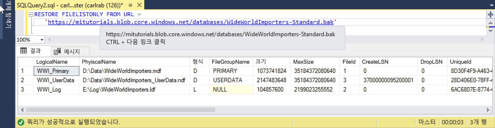

# <a name="quickstart-restore-a-database-to-a-managed-instance"></a>빠른 시작: 데이터베이스를 Managed Instance로 복원 

이 빠른 시작에서는 SSMS(SQL Server Management Studio)를 사용하여 Azure Blob Storage에서 Azure SQL Database [Managed Instance](sql-database-managed-instance.md)로 데이터베이스(Wide World Importers - Standard 백업 파일)를 복원합니다. 

> [!VIDEO https://www.youtube.com/embed/RxWYojo_Y3Q]

> [!NOTE]
> - Azure DMS(Database Migration Service)를 사용하여 마이그레이션하는 방법에 대한 자세한 내용은 [DMS를 사용한 Managed Instance 마이그레이션](../dms/tutorial-sql-server-to-managed-instance.md)을 참조하세요. 
> - 다양한 마이그레이션 방법에 대한 자세한 내용은 [SQL Server 인스턴스를 Azure SQL Database Managed Instance로 마이그레이션](sql-database-managed-instance-migrate.md)을 참조하세요.

## <a name="prerequisites"></a>필수 조건

이 빠른 시작의 특징은 다음과 같습니다.

- [Managed Instance 만들기](sql-database-managed-instance-get-started.md) 빠른 시작의 리소스를 사용합니다.
- 컴퓨터에 최신 [SQL Server Management Studio](https://docs.microsoft.com/sql/ssms/sql-server-management-studio-ssms)가 설치되어 있어야 합니다.
- SSMS를 사용하여 Managed Instance에 연결해야 합니다. 다음과 같이 연결하는 방법에 대한 빠른 시작을 참조하세요.
  - [Azure VM에서 Azure SQL Database Managed Instance에 연결](sql-database-managed-instance-configure-vm.md)
  - [온-프레미스에서 Azure SQL Database Managed Instance로의 지점 및 사이트 간 연결 구성](sql-database-managed-instance-configure-p2s.md).

> [!NOTE]
> Azure Blob Storage와 [SAS(공유 액세스 서명) 키](https://docs.microsoft.com/azure/storage/common/storage-dotnet-shared-access-signature-part-1)를 사용하여 SQL Server Database를 백업하고 복원하는 데 관한 자세한 내용은 [URL에 SQL Server 백업](sql-database-managed-instance-get-started-restore.md)을 참조하세요.

## <a name="restore-the-database-from-a-backup-file"></a>백업 파일에서 데이터베이스 복원

SSMS에서 이러한 단계를 사용하여 Managed Instance로 Wide World Importers 데이터베이스를 복원합니다. 데이터베이스 백업 파일은 미리 구성된 Azure Blob Storage 계정에 저장됩니다.

1. SMSS를 열고 Managed Instance에 연결합니다.
2. 왼쪽 메뉴에서 Managed Instance를 마우스 오른쪽 단추로 클릭하고 **새 쿼리**를 선택하여 새 쿼리 창을 엽니다.
3. 미리 구성된 스토리지 계정과 SAS 키를 사용하여 Managed Instance에 [자격 증명을 만드는](https://docs.microsoft.com/sql/t-sql/statements/create-credential-transact-sql?view=sql-server-2017) 다음 SQL 스크립트를 실행합니다.

   ```sql
   CREATE CREDENTIAL [https://mitutorials.blob.core.windows.net/databases] 
   WITH IDENTITY = 'SHARED ACCESS SIGNATURE'
   , SECRET = 'sv=2017-11-09&ss=bfqt&srt=sco&sp=rwdlacup&se=2028-09-06T02:52:55Z&st=2018-09-04T18:52:55Z&spr=https&sig=WOTiM%2FS4GVF%2FEEs9DGQR9Im0W%2BwndxW2CQ7%2B5fHd7Is%3D' 
   ```

    

4. 자격 증명을 확인하려면 [컨테이너](https://azure.microsoft.com/services/container-instances/) URL을 사용하여 백업 파일 목록을 가져오는 다음 스크립트를 실행합니다.

   ```sql
   RESTORE FILELISTONLY FROM URL = 
      'https://mitutorials.blob.core.windows.net/databases/WideWorldImporters-Standard.bak'
   ```

    

5. Wide World Importers 데이터베이스를 복원하려면 다음 스크립트를 실행합니다.

   ```sql
   RESTORE DATABASE [Wide World Importers] FROM URL =
     'https://mitutorials.blob.core.windows.net/databases/WideWorldImporters-Standard.bak'
   ```

    

6. 복원의 상태를 추적하려면 다음 스크립트를 실행합니다.

   ```sql
   SELECT session_id as SPID, command, a.text AS Query, start_time, percent_complete
      , dateadd(second,estimated_completion_time/1000, getdate()) as estimated_completion_time 
   FROM sys.dm_exec_requests r 
   CROSS APPLY sys.dm_exec_sql_text(r.sql_handle) a 
   WHERE r.command in ('BACKUP DATABASE','RESTORE DATABASE')
   ```

7. 복원이 완료되면 개체 탐색기에서 봅니다. 

## <a name="next-steps"></a>다음 단계

- URL에 대한 백업과 관련된 문제를 해결하려면 [URL에 대한 SQL Server 백업 - 모범 사례 및 문제 해결](https://docs.microsoft.com/sql/relational-databases/backup-restore/sql-server-backup-to-url-best-practices-and-troubleshooting)을 참조하세요.
- 앱 연결 옵션의 개요는 [애플리케이션을 Managed Instance에 연결](sql-database-managed-instance-connect-app.md)을 참조하세요.
- 즐겨찾는 도구 또는 언어를 사용하여 쿼리하려면 [빠른 시작: Azure SQL Database 연결 및 쿼리](sql-database-connect-query.md)를 참조하세요.
