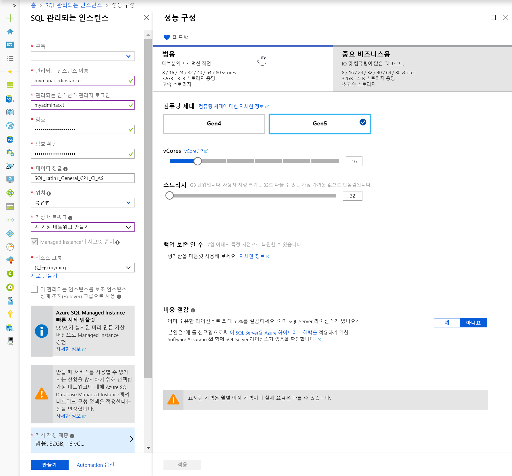
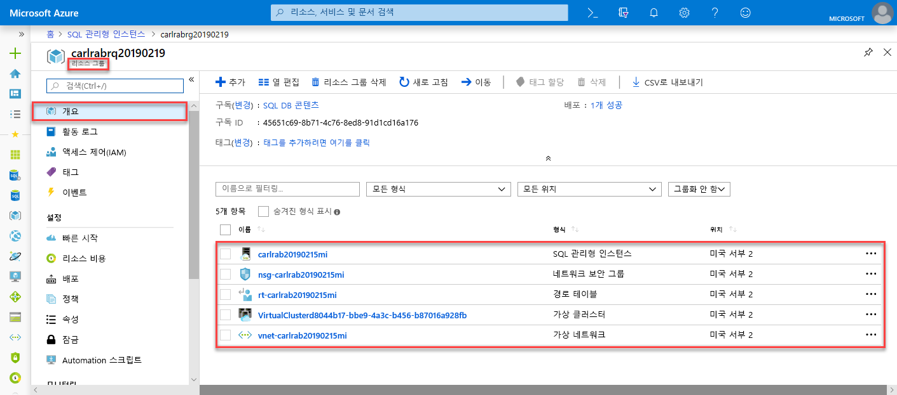
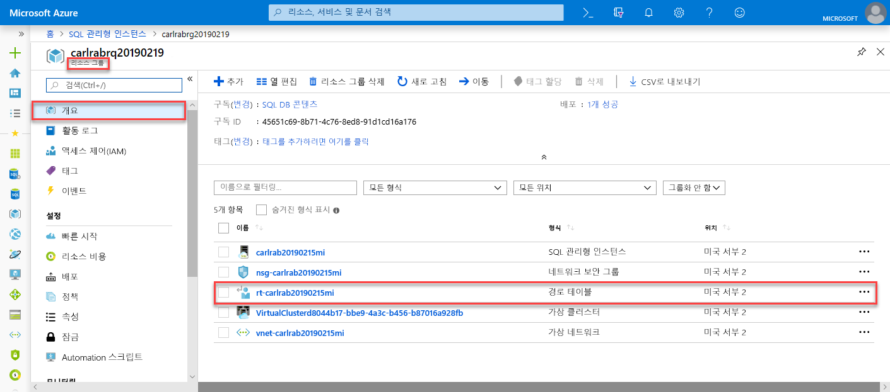
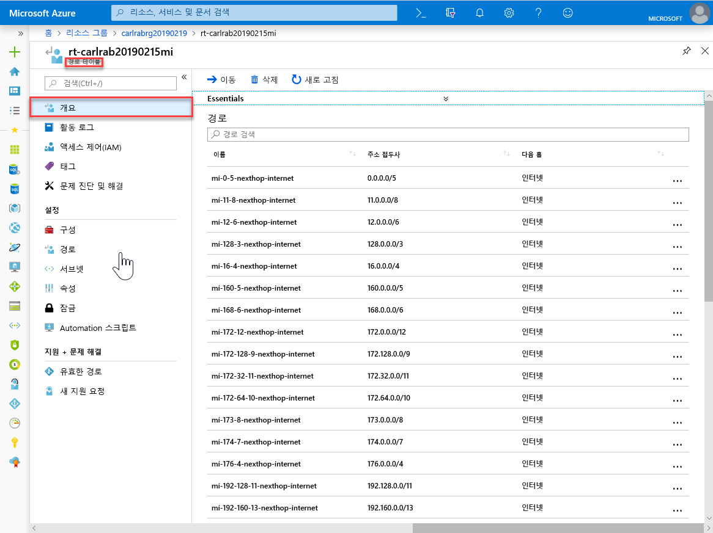
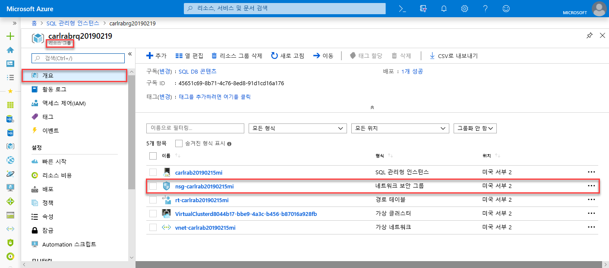
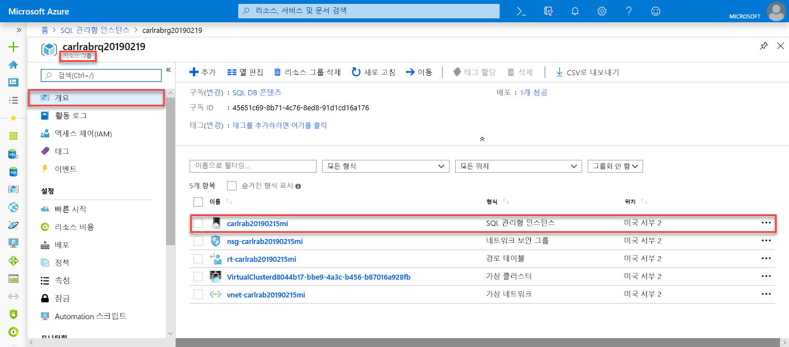
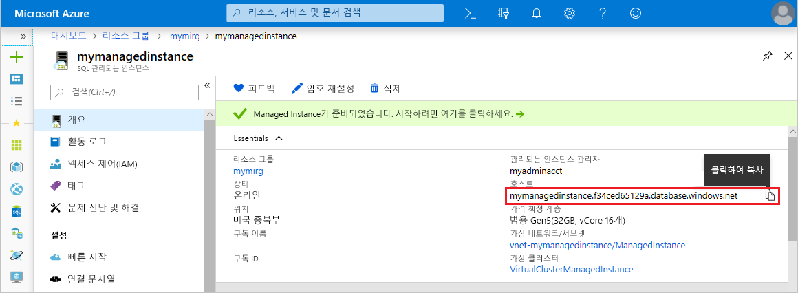

# 빠른 시작: Azure SQL Database 관리형 인스턴스 만들기

이 빠른 시작에서는 Azure Portal에서 Azure SQL Database [관리형 인스턴스](sql-database-managed-instance.md)를 만드는 방법을 안내합니다.

> [!IMPORTANT]
> 제한 사항은 [지원되는 지역](sql-database-managed-instance-resource-limits.md#supported-regions) 및 [지원되는 구독 유형](sql-database-managed-instance-resource-limits.md#supported-subscription-types)을 참조하세요.

## Azure Portal에 로그인

Azure 구독이 아직 없는 경우 [무료 계정을 만듭니다](https://azure.microsoft.com/free/).

[Azure Portal](https://portal.azure.com/)에 로그인합니다.

## 관리되는 인스턴스 만들기

다음 단계는 관리되는 인스턴스를 만드는 방법을 보여 줍니다.

1. Azure Portal의 왼쪽 위 모서리에서 **리소스 만들기**를 선택합니다.
2. **관리형 인스턴스**를 찾은 다음, **Azure SQL Managed Instance**를 선택합니다.
3. **만들기**를 선택합니다.

   

4. 다음 표의 정보를 사용하여 요청된 정보가 포함된 **SQL 관리형 인스턴스** 양식을 작성합니다.

   | 설정| 제안 값 | 설명 |
   | ------ | --------------- | ----------- |
   | **구독** | 사용자의 구독. | 새 리소스를 만들 권한을 제공하는 구독입니다. |
   |**관리되는 인스턴스 이름**|모든 유효한 이름|유효한 이름은 [명명 규칙 및 제한 사항](https://docs.microsoft.com/azure/architecture/best-practices/naming-conventions)을 참조하세요.|
   |**Managed Instance 관리자 로그인**|유효한 사용자 이름.|유효한 이름은 [명명 규칙 및 제한 사항](https://docs.microsoft.com/azure/architecture/best-practices/naming-conventions)을 참조하세요. "serveradmin"은 예약된 서버 수준 역할이므로 사용하지 마세요.|
   |**암호**|유효한 암호|암호는 16자 이상이어야 하며 [정의된 복잡성 요구 사항](../virtual-machines/windows/faq.md#what-are-the-password-requirements-when-creating-a-vm)을 충족해야 합니다.|
   |**표준 시간대**|관리형 인스턴스에서 관찰할 표준 시간대.|자세한 내용은 [표준 시간대](sql-database-managed-instance-timezone.md)를 참조하세요.|
   |**데이터 정렬**|관리형 인스턴스에 사용할 데이터 정렬.|SQL Server에서 데이터베이스를 마이그레이션하는 경우 `SELECT SERVERPROPERTY(N'Collation')` 명령으로 원본 데이터 정렬을 확인하고 해당 값을 사용합니다. 데이터 정렬에 대한 자세한 내용은 [서버 데이터 정렬 설정 또는 변경](https://docs.microsoft.com/sql/relational-databases/collations/set-or-change-the-server-collation)을 참조하세요.|
   |**위치**:|관리형 인스턴스를 만들 위치.|지역에 대한 자세한 내용은 [Azure 지역](https://azure.microsoft.com/regions/)을 참조하세요.|
   |**가상 네트워크**|**새 가상 네트워크 만들기** 또는 유효한 가상 네트워크 및 서브넷을 선택합니다.| 네트워크 또는 서브넷을 사용할 수 없는 경우 [네트워크 요구 사항을 충족하도록 수정](sql-database-managed-instance-configure-vnet-subnet.md)해야만 새 관리형 인스턴스의 대상으로 선택할 수 있습니다. 관리형 인스턴스의 네트워크 환경을 구성하기 위한 요구 사항에 대한 자세한 내용은 [관리형 인스턴스에 대한 가상 네트워크 구성](sql-database-managed-instance-connectivity-architecture.md)을 참조하세요. |
   |**공용 엔드포인트 사용**   |공용 엔드포인트를 사용하려면 이 옵션을 선택합니다.   |공용 데이터 엔드포인트를 통해 관리형 인스턴스에 액세스하려면 **공용 엔드포인트 사용**을 선택해야 합니다.| 
   |**다음의 액세스 허용**   |다음 옵션 중 하나를 선택합니다. <ul> <li>**Azure 서비스**</li> <li>**인터넷**</li> <li>**액세스 권한 없음**</li></ul>   |포털 환경에서는 공용 엔드포인트를 사용하여 보안 그룹을 구성합니다.     시나리오에 따라 다음 옵션 중 하나를 선택합니다.   <ul> <li>Azure 서비스 - Power BI 또는 다른 다중 테넌트 서비스에서 연결할 때 권장합니다. </li> <li> 인터넷 - 관리형 인스턴스를 신속하게 가동하려는 경우에 테스트 용도로 사용합니다. 프로덕션 환경에서는 사용하지 않는 것이 좋습니다. </li> <li> 액세스 권한 없음 - 이 옵션은 거부 보안 규칙을 만듭니다. 공용 엔드포인트를 통해 관리형 인스턴스에 액세스하려면 이 규칙을 수정해야 합니다. </li> </ul>   공용 엔드포인트 보안에 대한 자세한 내용은 [공용 엔드포인트를 통해 Azure SQL Database 관리형 인스턴스를 안전하게 사용](sql-database-managed-instance-public-endpoint-securely.md)을 참조하세요.|
   |**연결 형식**|프록시 또는 리디렉션 연결 형식 중에 선택합니다.|연결 형식에 대한 자세한 내용은 [Azure SQL Database 연결 정책](sql-database-connectivity-architecture.md#connection-policy)을 참조하세요.|
   |**리소스 그룹**|새 또는 기존 리소스 그룹입니다.|유효한 리소스 그룹 이름은 [명명 규칙 및 제한 사항](https://docs.microsoft.com/azure/architecture/best-practices/naming-conventions)을 참조하세요.|

   

5. 관리되는 인스턴스를 보조 인스턴스 장애 조치(failover) 그룹으로 사용하려면 체크 아웃 확인란을 선택하고 DnsAzurePartner 관리되는 인스턴스를 지정합니다. 이 기능은 미리 보기로 제공되며 다음 스크린샷에는 표시되지 않습니다.
6. **가격 책정 계층**을 선택하여 컴퓨팅 및 스토리지 리소스의 크기를 조정하고 가격 책정 옵션을 검토합니다. 메모리 32GB와 Vcore 16개를 제공하는 범용 가격 책정 계층이 기본값입니다.
7. 슬라이더 또는 텍스트 상자를 사용하여 저장소 공간 및 가상 코어 수를 지정합니다.
8. 모두 마쳤으면 **적용**을 눌러 선택한 내용을 저장합니다. 
9. **만들기**를 선택하여 관리되는 인스턴스를 배포합니다.
10. **알림** 아이콘을 선택하여 배포 상태를 확인합니다.

    

11. **배포 진행 중**을 선택하여 관리되는 인스턴스 창을 열어 배포 진행 상황을 자세히 모니터링합니다. 

> [!IMPORTANT]
> 서브넷의 첫 번째 인스턴스에서는 배포 시간이 일반적으로 후속 인스턴스의 경우보다 훨씬 더 깁니다. 배포 작업이 예상보다 오래 지속되므로 취소하지 마세요.

## 리소스를 검토하고 정규화된 서버 이름 검색

배포가 완료되면 생성된 리소스를 검토하고 이후에 빠른 시작에서 사용할 정규화된 서버 이름을 검색합니다.

1. 관리형 인스턴스의 리소스 그룹을 엽니다. [관리형 인스턴스 만들기](#create-a-managed-instance) 빠른 시작에서 생성된 리소스를 살펴봅니다.

   

2. 자동으로 생성된 UDR(사용자 정의 경로) 테이블을 검토할 경로 테이블을 선택합니다.

   

3. 경로 테이블에서는, 관리되는 인스턴스 가상 네트워크 내에서 트래픽을 라우팅할 항목을 검토합니다. 경로 테이블을 수동으로 만들거나 구성하는 경우 반드시 경로 테이블에 이러한 항목을 만들어야 합니다.

   

4. 리소스 그룹으로 돌아가서, 보안 규칙을 검토할 네트워크 보안 그룹을 선택합니다.

   

5. 인바운드 및 아웃바운드 보안 규칙을 검토합니다. 관리형 인스턴스에 공용 엔드포인트를 구성한 경우 [공용 엔드포인트 구성](sql-database-managed-instance-public-endpoint-configure.md#allow-public-endpoint-traffic-on-the-network-security-group) 문서에서 자세한 내용을 참조하세요.

   

6. 리소스 그룹으로 돌아가서, 관리형 인스턴스를 선택합니다.

   

7. **개요** 탭에서 **호스트** 속성을 찾습니다. 다음 빠른 시작에서 사용할 수 있도록 관리형 인스턴스의 정규화된 호스트 주소를 복사합니다.

   

   이름은 **your_machine_name.a1b2c3d4e5f6.database.windows.net**과 유사합니다.

## 다음 단계

- 관리형 인스턴스에 연결하는 방법은 다음 항목을 참조하세요.
  - 애플리케이션의 연결 옵션 개요는 [애플리케이션을 관리형 인스턴스에 연결](sql-database-managed-instance-connect-app.md)을 참조하세요.
  - Azure 가상 머신에서 관리형 인스턴스에 연결하는 방법을 보여주는 빠른 시작은 [Azure 가상 머신 연결 구성](sql-database-managed-instance-configure-vm.md)을 참조하세요.
  - 온-프레미스 클라이언트 컴퓨터에서 지점 및 사이트 간 연결을 사용하여 관리형 인스턴스에 연결하는 방법을 보여주는 빠른 시작은 [지점 및 사이트 간 연결 구성](sql-database-managed-instance-configure-p2s.md)을 참조하세요.
- 기존의 온-프레미스 SQL Server 데이터베이스를 관리형 인스턴스에 복원하려면 다음을 수행합니다. 
    - [마이그레이션용 Azure DMS(Database Migration Service)](../dms/tutorial-sql-server-to-managed-instance.md)를 사용하여 데이터베이스 백업 파일에서 복원합니다. 
    - [T-SQL RESTORE 명령](sql-database-managed-instance-get-started-restore.md)을 사용하여 데이터베이스 백업 파일에서 복원합니다.
- 기본 제공 문제 해결 인텔리전스를 사용하는 관리형 인스턴스 데이터베이스의 고급 성능 모니터링에 대해 자세히 알아보려면 [Azure SQL 분석을 사용하여 Azure SQL Database 모니터링](../azure-monitor/insights/azure-sql.md)을 참조하세요.
