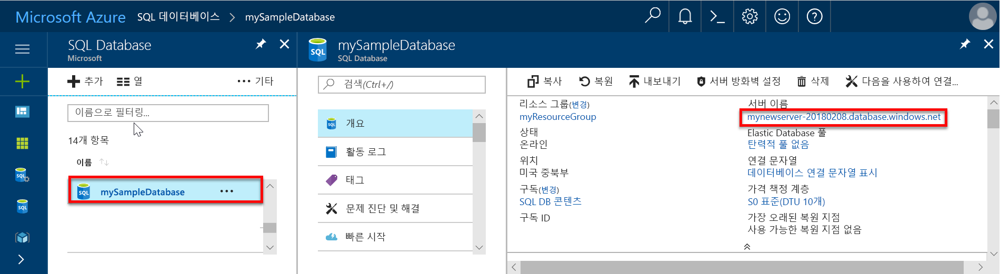
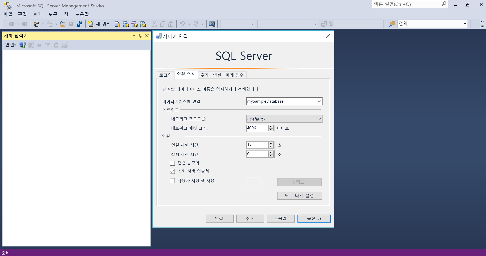

# <a name="migrate-your-sql-server-database-to-azure-sql-database-using-dma"></a>DMA를 사용하여 SQL Server 데이터베이스를 Azure SQL Database로 마이그레이션

SQL Server 데이터베이스를 Azure SQL Database 단일 데이터베이스로 이동하는 것은 Azure에서 빈 SQL 데이터베이스를 만든 다음, DMA([Data Migration Assistant](https://www.microsoft.com/download/details.aspx?id=53595))를 사용하여 데이터베이스를 Azure로 가져오는 것만큼 간단합니다. 추가 마이그레이션 옵션은 [데이터베이스를 Azure SQL Database로 마이그레이션](sql-database-cloud-migrate.md)을 참조하세요.

> [!IMPORTANT]
> Azure SQL Database 관리되는 인스턴스로 마이그레이션하려면 [SQL Server에서 관리되는 인스턴스로 마이그레이션](sql-database-managed-instance-migrate.md)을 참조하세요.

이 자습서에서는 다음에 대해 알아봅니다.

> [!div class="checklist"]
> * Azure Portal에서 빈 Azure SQL Database 만들기(새로운 또는 기존 Azure SQL Database 서버 사용)
> * Azure Portal에서 서버 수준 방화벽 만들기(이전에 만들지 않은 경우)
> * DMA([Data Migration Assistant](https://www.microsoft.com/download/details.aspx?id=53595))를 사용하여 SQL Server 데이터베이스를 빈 Azure SQL Database로 가져오기 
> * SSMS([SQL Server Management Studio](https://docs.microsoft.com/sql/ssms/download-sql-server-management-studio-ssms))를 사용하여 데이터베이스 속성을 변경합니다.

Azure 구독이 아직 없는 경우 시작하기 전에 [체험](https://azure.microsoft.com/free/) 계정을 만듭니다.

## <a name="prerequisites"></a>필수 조건

이 자습서를 수행하려면 다음 필수 조건이 완료되었는지 확인합니다.

- SSMS([SQL Server Management Studio](https://docs.microsoft.com/sql/ssms/download-sql-server-management-studio-ssms))의 최신 버전  
- 최신 버전의 DMA([Data Migration Assistant](https://www.microsoft.com/download/details.aspx?id=53595))를 설치했습니다.
- 마이그레이션할 데이터베이스를 식별했고 이에 대한 액세스 권한이 있습니다. 이 자습서에서는 SQL Server 2008R2 이상의 인스턴스에서 [SQL Server 2008R2 AdventureWorks OLTP 데이터베이스](https://msftdbprodsamples.codeplex.com/releases/view/59211)를 사용하지만 사용자가 선택한 모든 데이터베이스를 사용할 수 있습니다. 호환성 문제를 해결하려면 [SQL Server Data Tools](https://docs.microsoft.com/sql/ssdt/download-sql-server-data-tools-ssdt)를 사용합니다.

## <a name="log-in-to-the-azure-portal"></a>Azure Portal에 로그인

[Azure Portal](https://portal.azure.com/)에 로그인합니다.

## <a name="create-a-blank-sql-database"></a>빈 SQL 데이터베이스 만들기

Azure SQL Database는 일련의 정의된 [계산 및 저장소 리소스](sql-database-service-tiers-dtu.md)를 사용하여 만들어집니다. 데이터베이스는 [Azure 리소스 그룹](../azure-resource-manager/resource-group-overview.md) 및 [Azure SQL Database 논리 서버](sql-database-features.md)에서 만들어집니다. 

빈 SQL Database를 만들려면 다음 단계를 수행합니다. 

1. Azure Portal의 왼쪽 위 모서리에서 **리소스 만들기**를 클릭합니다.

2. **새로 만들기** 페이지에서 **데이터베이스**를 선택하고 **새로 만들기** 페이지의 **SQL Database** 아래에서 **만들기**를 선택합니다.

   

3. 위의 이미지에 표시된 대로 다음과 같은 정보를 사용하여 SQL Database 형식을 작성합니다.   

   | 설정       | 제안 값 | 설명 | 
   | ------------ | ------------------ | ------------------------------------------------- | 
   | **데이터베이스 이름** | mySampleDatabase | 유효한 데이터베이스 이름은 [데이터베이스 식별자](https://docs.microsoft.com/sql/relational-databases/databases/database-identifiers)를 참조하세요. | 
   | **구독** | 사용자의 구독  | 구독에 대한 자세한 내용은 [구독](https://account.windowsazure.com/Subscriptions)을 참조하세요. |
   | **리소스 그룹** | myResourceGroup | 유효한 리소스 그룹 이름은 [명명 규칙 및 제한 사항](https://docs.microsoft.com/azure/architecture/best-practices/naming-conventions)을 참조하세요. |
   | **원본 선택** | 빈 데이터베이스 | 빈 데이터베이스를 만들도록 지정합니다. |

4. **서버**를 클릭하여 새 데이터베이스에 새 서버를 만들고 구성합니다. 다음 정보로 **새 서버 양식**을 작성합니다. 

   | 설정       | 제안 값 | 설명 | 
   | ------------ | ------------------ | ------------------------------------------------- | 
   | **서버 이름** | 전역적으로 고유한 이름 | 유효한 서버 이름은 [명명 규칙 및 제한 사항](https://docs.microsoft.com/azure/architecture/best-practices/naming-conventions)을 참조하세요. | 
   | **서버 관리자 로그인** | 모든 유효한 이름 | 유효한 로그인 이름은 [데이터베이스 식별자](https://docs.microsoft.com/sql/relational-databases/databases/database-identifiers)를 참조하세요.|
   | **암호** | 유효한 암호 | 암호는 8자 이상이어야 하며 대문자, 소문자, 숫자 및 영숫자가 아닌 문자 범주 중 세 가지 범주의 문자를 포함해야 합니다. |
   | **위치**: | 모든 유효한 위치 | 지역에 대한 자세한 내용은 [Azure 지역](https://azure.microsoft.com/regions/)을 참조하세요. |

   

5. **선택**을 클릭합니다.

6. **가격 책정 계층**을 클릭하여 서비스 계층, DTU 수 및 저장소 크기를 지정합니다. 각 서비스 계층에 대해 사용할 수 있는 DTU 및 저장소 수에 대한 옵션을 살펴봅니다. 

7. 이 자습서에서는 **표준** 서비스 계층을 선택한 다음 슬라이더를 사용하여 **100DTU(S3)** 및 **400**GB 저장소를 선택합니다.

   

8. **추가 기능 저장소** 옵션을 사용하려면 미리 보기 약관에 동의합니다. 

   > [!IMPORTANT]
   > - 포함된 저장소보다 큰 저장소 크기는 미리 보기로 있으며 추가 비용이 적용됩니다. 자세한 내용은 [SQL Database 가격](https://azure.microsoft.com/pricing/details/sql-database/)을 참조하세요. 
   >
   > - Premium 계층의 경우 현재 브라질 남부, 캐나다 중부, 캐나다 동부, 미국 중부, 프랑스 중부, 독일 중부, 일본 동부, 일본 서부, 한국 중부, 미국 중북부, 북유럽, 미국 중남부, 동남 아시아, 영국 남부, 영국 서부, 미국 동부 2, 미국 서부, US Gov 버지니아 및 유럽 서부에서 1TB 이상의 저장소를 사용할 수 있습니다. [P11-P15 현재 제한 사항](sql-database-dtu-resource-limits.md#single-database-limitations-of-p11-and-p15-when-the-maximum-size-greater-than-1-tb)을 참조하세요.  
   > 

9. 서버 계층, DTU 수 및 저장소 크기를 선택한 후에 **적용**을 클릭합니다.  

10. 빈 데이터베이스에 대한 **데이터 정렬**을 선택합니다(이 자습서의 경우 기본값 사용). 데이터 정렬에 대한 자세한 내용은 [데이터 정렬](https://docs.microsoft.com/sql/t-sql/statements/collations)을 참조하세요.

11. 이제 SQL Database 양식을 완료했으므로 **만들기**를 클릭하여 데이터베이스를 프로비전합니다. 프로비전하는 데 몇 분이 걸립니다. 

12. 도구 모음에서 **알림**을 클릭하여 배포 프로세스를 모니터링합니다.
    
     

## <a name="create-a-server-level-firewall-rule"></a>서버 수준 방화벽 규칙 만들기

방화벽 규칙을 만들어서 특정 IP 주소에 대한 방화벽을 열지 않으면 SQL Database 서비스는 외부 응용 프로그램 및 도구가 서버 또는 서버의 데이터베이스에 연결되지 않도록 방지하는 서버 수준에 방화벽을 만듭니다. 다음 단계에 따라 클라이언트의 IP 주소에 대한 [SQL Database 서버 수준 방화벽 규칙](sql-database-firewall-configure.md)을 만들고 IP 주소에만 SQL Database 방화벽을 통해 외부 연결을 사용하도록 설정합니다. 

> [!NOTE]
> SQL Database는 포트 1433을 통해 통신합니다. 회사 네트워크 내에서 연결을 시도하는 경우 포트 1433을 통한 아웃바운드 트래픽이 네트워크 방화벽에서 허용되지 않을 수 있습니다. 이 경우 IT 부서에서 포트 1433을 열지 않으면 Azure SQL Database 서버에 연결할 수 없습니다.
>

1. 배포가 완료되면 왼쪽 메뉴에서 **SQL Database**를 클릭한 다음 **SQL Database** 페이지에서 **mySampleDatabase**를 클릭합니다. 데이터베이스에 대한 개요 페이지가 열려 정규화된 서버 이름(예: **mynewserver-20170824.database.windows.net**)을 표시하고 추가 구성을 위한 옵션을 제공합니다. 

2. 후속 빠른 시작에서 서버 및 해당 데이터베이스에 연결하는 데 사용할 수 있도록 이 정규화된 서버 이름을 복사합니다. 

    

3. 도구 모음에서 **서버 방화벽 설정**을 클릭합니다. SQL Database 서버에 대한 **방화벽 설정** 페이지가 열립니다. 

    

4. 도구 모음에서 **클라이언트 IP 추가**를 클릭하여 현재 IP 주소를 새 방화벽 규칙에 추가합니다. 방화벽 규칙은 단일 IP 주소 또는 IP 주소의 범위에 1433 포트를 열 수 있습니다.

5. **저장**을 클릭합니다. 논리 서버의 1433 포트를 여는 현재 IP 주소에 서버 수준 방화벽 규칙이 생성됩니다.

6. **확인**을 클릭한 후 **방화벽 설정** 페이지를 닫습니다.

이제 SQL Server Management Studio, Data Migration Assistant 또는 이전 프로시저에서 만든 서버 관리자 계정을 사용하여 이 IP 주소에서 원하는 다른 도구를 사용하여 SQL Database 서버 및 해당 데이터베이스에 연결할 수 있습니다.

> [!IMPORTANT]
> SQL Database 방화벽을 통한 액세스는 기본적으로 모든 Azure 서비스에 대해 사용됩니다. 이 페이지에서 **끄기**를 클릭하여 모든 Azure 서비스에 대해 사용하지 않도록 설정합니다.

## <a name="sql-server-connection-information"></a>SQL 서버 연결 정보

Azure Portal에 있는 Azure SQL Database 서버의 정규화된 서버 이름을 가져옵니다. 정규화된 서버 이름을 사용하여 Data Migration Assistance 및 SQL Server Management Studio 등의 클라이언트 도구를 통해 Azure SQL Server에 연결합니다.

1. [Azure Portal](https://portal.azure.com/)에 로그인합니다.
2. 왼쪽 메뉴에서 **SQL Database**를 선택하고 **SQL Database** 페이지에서 데이터베이스를 클릭합니다. 
3. 데이터베이스의 경우 Azure Portal의 **Essentials** 창에서 **서버 이름**을 찾고 복사합니다.

   

## <a name="migrate-your-database"></a>데이터베이스 마이그레이션

**[Data Migration Assistant](https://www.microsoft.com/download/details.aspx?id=53595)** 를 사용하여 Azure SQL Database에 마이그레이션하기 위한 데이터베이스의 준비 상태를 평가하고 마이그레이션을 완료하려면 다음 단계를 수행합니다.

1. **Data Migration Assistant**를 엽니다. 마이그레이션하려는 데이터베이스가 포함된 SQL Server 인스턴스에 연결되고 그리고 인터넷에 연결된 모든 컴퓨터에서 DMA를 실행할 수 있습니다. 마이그레이션하려는 SQL Server 인스턴스를 호스팅하는 컴퓨터에 설치할 필요가 없습니다. 이전 프로시저에서 만든 방화벽 규칙은 Data Migration Assistant를 실행하는 컴퓨터에 적용해야 합니다.

     

2. 왼쪽 메뉴에서 **+ 새로 만들기**를 클릭하여 **평가** 프로젝트를 만듭니다. 요청된 값을 입력한 다음 **만들기**를 클릭합니다.

   | 설정      | 제안 값 | 설명 | 
   | ------------ | ------------------ | ------------------------------------------------- | 
   | 프로젝트 형식 | 마이그레이션 | 마이그레이션을 위해 데이터베이스를 평가할지 동일한 워크플로의 일부로서 평가하고 마이그레이션할지 선택 |
   |프로젝트 이름|마이그레이션 자습서| 설명이 포함된 이름 |
   |원본 서버 유형| SQL Server | 이는 현재 유일하게 지원되는 원본임 |
   |대상 서버 유형| Azure SQL Database| 선택 사항: Azure SQL Database, SQL Server, Azure 가상 머신의 SQL Server |
   |마이그레이션 범위| 스키마와 데이터| 선택 사항: 스키마와 데이터, 스키마만, 데이터만 |
   
   

3.  **원본 선택** 페이지에서 요청된 값을 입력한 다음 **연결**을 클릭합니다.

    | 설정      | 제안 값 | 설명 | 
    | ------------ | ------------------ | ------------------------------------------------- | 
    | 서버 이름 | 서버 이름 또는 IP 주소 | 서버 이름 또는 IP 주소 |
    | 인증 유형 | 기본 설정된 인증 유형| 선택 사항: Windows 인증, SQL Server 인증, Active Directory 통합 인증, Active Directory 암호 인증 |
    | 사용자 이름 | 사용자의 로그인 이름 | 사용자 로그인은 **제어 서버** 권한이 있어야 함 |
    | 암호| 사용자 암호 | 사용자 암호 |
    | 연결 속성| 사용자 환경에 맞게 **연결 암호화**와 **서버 인증서 신뢰**를 선택합니다. | 서버 연결에 적절한 속성을 선택 |

    

5. Azure SQL Database로 마이그레이션할 원본 서버의 단일 데이터베이스를 선택하고 **다음**을 클릭합니다. 이 자습서에는 단일 데이터베이스만 있습니다.

6. **대상 선택** 페이지에서 요청된 값을 입력한 다음 **연결**을 클릭합니다.

    | 설정      | 제안 값 | 설명 | 
    | ------------ | ------------------ | ------------------------------------------------- | 
    | 서버 이름 | 정규화된 Azure Database 서버 이름 | 이전 프로시저의 정규화된 Azure Database 서버 이름 |
    | 인증 유형 | SQL Server 인증 | 자습서가 작성될 당시 SQL Server 인증은 유일한 옵션이지만, Active Directory 통합 인증 및 Active Directory 암호 인증도 Azure SQL Database에서 지원됩니다. |
    | 사용자 이름 | 사용자의 로그인 이름 | 사용자 로그인은 원본 데이터베이스에 대해 **제어 데이터베이스** 권한이 있어야 합니다. |
    | 암호| 사용자 암호 | 사용자 암호 |
    | 연결 속성| 사용자 환경에 맞게 **연결 암호화**와 **서버 인증서 신뢰**를 선택합니다. | 서버 연결에 적절한 속성을 선택 |

    

7. 이전 프로시저에서 만든 대상 서버에서 데이터베이스를 선택한 다음 **다음**을 클릭하여 원본 데이터베이스 스키마 평가 프로세스를 시작합니다. 이 자습서에는 단일 데이터베이스만 있습니다. 이 데이터베이스에 대한 호환성 수준은 Azure SQL Database의 모든 새 데이터베이스에 대한 기본 호환성 수준인 140으로 설정됩니다.

   > [!IMPORTANT] 
   > Azure SQL Database로 데이터베이스를 마이그레이션한 후 이전 버전과 호환성을 위해 지정된 호환성 수준에서 데이터베이스가 작동하도록 선택할 수 있습니다. 특정 호환성 수준에서 데이터베이스를 운영하기 위한 옵션 및 그 영향에 대한 자세한 내용은 [ALTER DATABASE 호환성 수준](https://docs.microsoft.com/sql/t-sql/statements/alter-database-transact-sql-compatibility-level)을 참조하세요. 또한 호환성 수준과 관련된 추가 데이터베이스 수준 설정에 대한 자세한 내용은 [ALTER DATABASE SCOPED CONFIGURATION](https://docs.microsoft.com/sql/t-sql/statements/alter-database-scoped-configuration-transact-sql)을 참조하세요.
   >

8. **개체 선택** 완료 페이지에서 원본 데이터베이스 스키마 평가 프로세스가 완료된 후 마이그레이션을 위해 선택한 개체를 검토하고 문제를 포함하는 개체를 검토합니다. 예를 들어, **dbo.uspSearchCandidateResumes** 개체에 대한 **SERVERPROPERTY('LCID')** 동작 변경 내용과 전체 텍스트 검색 변경 내용에 대한 **HumanResourcesJobCandidate** 개체를 검토합니다. 

   > [!IMPORTANT] 
   > 데이터베이스의 디자인 및 응용 프로그램의 디자인에 따라 원본 데이터베이스를 마이그레이션하는 경우, 마이그레이션 후(일부 경우, 마이그레이션 전) 데이터베이스 또는 응용 프로그램을 수정해야 할 수 있습니다. 마이그레이션에 영향을 줄 수 있는 Transact-SQL 차이점에 대한 자세한 내용은 [SQL Database으로 마이그레이션 중 Transact-SQL 차이점 해결](sql-database-transact-sql-information.md)을 참조하세요.

     

9. **SQL 스크립트 생성**을 클릭하여 원본 데이터베이스의 스키마 개체를 스크립팅합니다. 
10. 생성된 스크립트를 검토한 다음 필요한 만큼 **다음 문제**를 클릭하여 확인된 평가 문제 및 권장 사항을 검토합니다. 예를 들어, 전체 텍스트 검색의 경우 업그레이드할 때 전체 텍스트 기능을 활용하여 응용 프로그램을 테스트하는 것이 좋습니다. 원하면 스크립트를 저장하거나 복사할 수 있습니다.

     

11. **스키마 배포**를 클릭하여 스키마 마이그레이션 프로세스를 확인합니다.

     

12. 스키마 마이그레이션이 완료되면 오류에 대한 결과를 검토하고 오류가 없다고 판단되면 **데이터 마이그레이션**을 클릭합니다.
13. **테이블 선택** 페이지에서 마이그레이션을 위해 선택한 테이블을 검토한 다음 **데이터 마이그레이션 시작**을 클릭합니다.

     

14. 마이그레이션 프로세스를 봅니다.

     

## <a name="connect-to-the-database-with-ssms"></a>SSMS로 데이터베이스에 연결

[SQL Server Management Studio](https://docs.microsoft.com/sql/ssms/sql-server-management-studio-ssms)를 사용하여 Azure SQL Database 서버에 연결합니다.

1. SQL Server Management Studio를 엽니다.

2. **서버에 연결** 대화 상자에서 다음 정보를 입력합니다.

   | 설정       | 제안 값 | 설명 | 
   | ------------ | ------------------ | ------------------------------------------------- | 
   | 서버 유형 | 데이터베이스 엔진 | 이 값은 필수입니다. |
   | 서버 이름 | 정규화된 서버 이름 | 이름은 **mynewserver20170824.database.windows.net**과 비슷해야 합니다. |
   | 인증 | 공개 | SQL 인증은 이 자습서에서 구성한 유일한 인증 유형입니다. |
   | 로그인 | 서버 관리자 계정 | 서버를 만들 때 지정한 계정입니다. |
   | 암호 | 서버 관리자 계정의 암호 | 서버를 만들 때 지정한 암호입니다. |

   

3. **서버에 연결** 대화 상자에서 **옵션**을 클릭합니다. **데이터베이스에 연결** 섹션에서 **mySampleDatabase**를 입력하여 이 데이터베이스에 연결합니다.

     

4. **Connect**를 클릭합니다. SSMS에서 개체 탐색기 창이 열립니다. 

5. 개체 탐색기에서 **데이터베이스**를 확장한 다음 **mySampleDatabase**를 확장하여 샘플 데이터베이스에 있는 개체를 봅니다.

     

## <a name="change-database-properties"></a>데이터베이스 속성 변경

SQL Server Management Studio를 사용하여 서비스 계층, 성능 수준 및 호환성 수준을 변경할 수 있습니다. 가져오기 단계 중에 최고의 성능을 위해 더 높은 성능의 계층 데이터베이스를 가져오는 것이 좋지만, 가져오기가 완료된 후 규모를 축소하여 가져온 데이터베이스를 적극적으로 사용할 준비가 될 때까지 비용을 절약하는 것이 좋습니다. 호환성 수준을 변경하면 Azure SQL Database 서비스의 최신 기능에 대한 성능과 액세스가 향상될 수 있습니다. 이전 데이터베이스를 마이그레이션할 경우 해당 데이터베이스 호환성 수준은 가져오는 데이터베이스와 호환 가능한 가장 낮은 지원 수준으로 유지됩니다. 자세한 내용은 [Azure SQL Database의 호환성 수준 130을 통해 개선된 쿼리 성능](sql-database-compatibility-level-query-performance-130.md)을 참조하세요.

1. 개체 탐색기에서 **mySampleDatabase**를 마우스 오른쪽 단추로 클릭한 다음 **새 쿼리**를 클릭합니다. 데이터베이스에 연결된 쿼리 창이 열립니다.

2. 다음 명령을 실행하여 서비스 계층을 **Standard**로, 성능 수준을 **S1**로 설정합니다.

    ```sql
    ALTER DATABASE mySampleDatabase 
    MODIFY 
        (
        EDITION = 'Standard'
        , MAXSIZE = 250 GB
        , SERVICE_OBJECTIVE = 'S1'
    );
    ```

## <a name="next-steps"></a>다음 단계 
이 자습서에서는 다음에 대해 알아보았습니다.

> * Azure Portal에서 빈 Azure SQL Database 만들기 
> * Azure Portal에서 서버 수준 방화벽 만들기 
> * DMA([Data Migration Assistant](https://www.microsoft.com/download/details.aspx?id=53595))를 사용하여 SQL Server 데이터베이스를 빈 Azure SQL Database로 가져오기 
> * SSMS([SQL Server Management Studio](https://docs.microsoft.com/sql/ssms/download-sql-server-management-studio-ssms))를 사용하여 데이터베이스 속성을 변경합니다.

데이터의 보안을 설정하는 방법에 대해 알아보려면 다음 자습서로 이동합니다.

> [!div class="nextstepaction"]
> [Azure SQL Database 보안](sql-database-security-tutorial.md)


