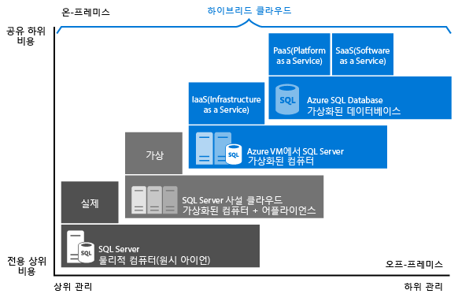

# Azure에서 적절한 SQL Server 옵션 선택

Azure에서 SQL Server 워크로드가 호스트된 인프라(IaaS)에서 실행 중이거나 호스트된 서비스([PaaS](https://azure.microsoft.com/overview/what-is-paas/))로 실행 중일 수 있습니다. PaaS 내에는 여러 배포 옵션이 있고 각 배포 옵션 내에는 여러 서비스 계층이 있습니다. IaaS 또는 PaaS 중에서 결정할 때 물어보아야 하는 핵심 질문은 직접 데이터베이스를 관리하거나, 패치를 적용하거나, 백업을 수행할 것인지 아니면 이러한 작업을 Azure에 위임할 것인가입니다.
대답에 따라 다음 옵션을 사용할 수 있습니다.

- [Azure SQL Database](sql-database-technical-overview.md): 안정적인 최신 SQL Server Enterprise Edition을 기준으로 하는 완전 관리형 SQL 데이터베이스 엔진. 이 엔진은 *PaaS(Platform as a Service)* 산업 범주로 분류되며, Azure 클라우드에서 호스트되는 관계형 DBaaS(Database as a Service)입니다. SQL 데이터베이스는 여러 배포 옵션을 제공하며, 각 배포 옵션은 Microsoft에서 소유하고 호스트하고 유지 관리하는 표준화된 하드웨어 및 소프트웨어를 기반으로 합니다. SQL Database를 선택하면 SQL Server에서(온-프레미스 또는 Azure 가상 머신에서) 사용할 때 광범위한 구성이 필요한 기본 제공 기능을 사용할 수 있습니다. SQL Database를 사용할 경우 추가 성능에 맞게 중단 없이 강화 및 확장하는 옵션을 통해 사용량에 따라 지불합니다. SQL Database는 기본 제공 고가용성, 인텔리전스, 관리처럼 SQL Server에서 사용할 수 없는 추가 기능을 제공합니다. Azure SQL Database는 다음과 같은 배포 옵션을 제공합니다.
  
  - SQL Database 서버를 통해 관리되고 고유한 리소스 세트가 있는 [단일 데이터베이스](sql-database-single-database.md). 단일 데이터베이스는 SQL Server의 [포함된 데이터베이스](https://docs.microsoft.com/sql/relational-databases/databases/contained-databases)와 유사합니다. 이 옵션은 새로운 클라우드 기반 애플리케이션의 최신 애플리케이션 개발에 맞게 최적화되어 있습니다.
  - SQL Database 서버를 통해 관리되는 공유 리소스 세트가 있는 데이터베이스 컬렉션인 [탄력적 풀](sql-database-elastic-pool.md). 단일 데이터베이스를 탄력적 풀로 이동하거나 탄력적 풀에서 제거할 수 있습니다. 이 옵션은 다중 테넌트 SaaS 애플리케이션을 사용하여 새로운 클라우드 기반 애플리케이션의 최신 애플리케이션 개발에 맞게 최적화되어 있습니다.
  - 공유 리소스 세트가 있는 시스템 및 사용자 데이터베이스 컬렉션인 [관리되는 인스턴스](sql-database-managed-instance.md). 관리되는 인스턴스는 데이터베이스를 위한 공유 리소스와 추가적인 인스턴스 범위 기능을 제공하는 [Microsoft SQL Server 데이터베이스 엔진] 인스턴스와 비슷합니다. 관리되는 인스턴스는 데이터베이스 변경 없이 또는 최소한의 변경으로 온-프레미스에서 데이터베이스를 마이그레이션할 수 있도록 지원합니다. 이 옵션은 Azure SQL Database의 모든 PaaS 혜택을 제공하지만 이전에 SQL VM에서만 사용할 수 있었던 기능을 추가합니다. 여기에는 기본 가상 네트워크(VNet) 및 온-프레미스 SQL Server와의 거의 100% 호환성이 포함됩니다.
- [Azure Virtual Machines의 SQL Server](https://azure.microsoft.com/services/virtual-machines/sql-server/) 는 업계 범주에 속하는 *IaaS(Infrastructure as a service)* 산업 부분으로 분류되며 Azure 클라우드의 완전 관리형 가상 머신 내에서 SQL Server를 실행할 수 있도록 지원합니다. [SQL Server 가상 머신](../virtual-machines/windows/sql/virtual-machines-windows-sql-server-iaas-overview.md)은 Microsoft에서 소유, 호스팅 및 유지 관리하는 표준화된 하드웨어에서도 실행됩니다. VM에서 SQL Server를 사용하는 경우 SQL Server 이미지에 이미 포함된 SQL Server 라이선스에 종량제를 사용하거나 기존 라이선스를 쉽게 사용할 수 있습니다. VM을 필요에 따라 중지하거나 재개할 수도 있습니다. Azure에서 실행 중인 Windows Server 또는 Linux VM(Virtual Machines)의 클라우드에 설치되고 호스트된 SQL Server로, IaaS(infrastructure as a service)라고도 합니다. Azure Virtual Machines의 SQL Server는 데이터베이스 변경 없이 온-프레미스 SQL Server 데이터베이스 및 애플리케이션을 마이그레이션하는 좋은 옵션입니다. 모든 최신 버전의 SQL Server를 IaaS 가상 머신에 설치할 수 있습니다. SQL Database와의 가장 중요한 차이점은 SQL Server VM에서는 데이터베이스 엔진을 완전히 제어할 수 있다는 것입니다. 유지 관리/패치가 시작되는 시기를 선택하고, 더 적은 로그로 더 빠르게 로드되도록 복구 모델을 단순 또는 대량 로그로 변경하고, 필요한 경우, 엔진을 일시 중지 또는 시작하고, SQL Server 데이터베이스 엔진을 완전히 사용자 지정할 수 있습니다. 이러한 추가 제어 기능과 더불어 가상 머신을 관리해야 하는 책임도 추가됩니다.

이러한 옵션들의 주요 차이점은 다음 표에 나와 있습니다.

| VM의 SQL Server | SQL Database의 관리되는 인스턴스 | SQL Database의 단일 데이터베이스/탄력적 풀 |
| --- | --- | --- |
|SQL Server 엔진을 완전히 제어할 수 있습니다. 최대 99.95%의 가용성이 보장됩니다. 일치하는 온-프레미스 SQL Server의 버전과 완전히 동등합니다. 고정된 잘 알려진 데이터베이스 엔진 버전입니다. SQL Server 온-프레미스에서 쉽게 마이그레이션할 수 있습니다. Azure VNet 내의 개인 IP 주소 SQL Server가 있는 호스트에 애플리케이션 또는 서비스를 배포할 수 있습니다.| 온-프레미스의 SQL Server와의 높은 호환성 99.99% 가용성 보장 기본 제공 백업, 패치, 복구 안정적인 최신 데이터베이스 엔진 버전 SQL Server에서 쉽게 마이그레이션할 수 있습니다. Azure VNet 내의 개인 IP 주소 기본 제공 고급 인텔리전스 및 보안 온라인에서 리소스(CPU/스토리지)를 변경할 수 있습니다.|가장 자주 사용되는 SQL Server 기능을 사용할 수 있습니다. 99.99% 가용성 보장 기본 제공 백업, 패치, 복구 안정적인 최신 데이터베이스 엔진 버전 필요한 리소스(CPU/스토리지)를 개별 데이터베이스에 할당할 수 있습니다. 기본 제공 고급 인텔리전스 및 보안 온라인에서 리소스(CPU/스토리지)를 변경할 수 있습니다.|
|사용자가 백업 및 패치를 관리해야 합니다. 사용자 고유의 고가용성 솔루션을 구현해야 합니다. 리소스(CPU/스토리지)를 변경하는 동안 가동 중지 시간이 발생합니다.|사용할 수 없는 최소한의 SQL Server 기능이 아직 있습니다. 정확한 유지 관리 시간이 보장되지 않습니다(하지만 거의 투명함). SQL Server 버전과의 호환성은 데이터베이스 호환성 수준을 사용해야만 달성될 수 있습니다.|SQL Server에서 마이그레이션하기 어려울 수 있습니다. 일부 SQL Server 기능을 사용할 수 없습니다. 정확한 유지 관리 시간이 보장되지 않습니다(하지만 거의 투명함). SQL Server 버전과의 호환성은 데이터베이스 호환성 수준을 사용해야만 달성될 수 있습니다. 개인 IP 주소를 할당할 수 없습니다(방화벽 규칙을 사용하여 액세스를 제한할 수 있음).|

각 배포 옵션이 Microsoft 데이터 플랫폼에 얼마나 적합한지 알아보고 비즈니스 요구 사항에 적합한 옵션을 찾는 데 도움이 됩니다. 비용 절감이 우선이든 관리 최소화가 무엇보다 중요하든 이 문서에서는 가장 관심 있는 비즈니스 요구 사항에 대해 어떤 접근 방식이 결과를 가져오는지 결정하도록 도울 수 있습니다.

## Microsoft SQL 데이터 플랫폼

Azure와 온-프레미스 SQL Server 데이터베이스를 비교 논의할 때 우선 이 둘을 모두 사용할 수 있다는 점을 이해해야 합니다. Microsoft의 데이터 플랫폼에서는 SQL Server 기술을 활용하며 물리적 온-프레미스 컴퓨터, 사설 클라우드 환경, 타사 호스팅 사설 클라우드 환경 및 공용 클라우드 전반에서 이 기술을 사용할 수 있습니다. Azure 가상 머신에서 SQL Server를 사용하면 온-프레미스 배포와 클라우드에 호스트된 배포를 조합하여 고유하고 다양한 비즈니스 요구 사항을 충족하고, 이러한 환경 전반에서 일련의 서버 제품, 개발 도구 및 전문 지식을 동일하게 사용할 수 있습니다.

   

다이어그램에 나온 대로 각 제품의 특징을 인프라에 대한 관리 수준(X축)과 데이터베이스 수준 통합 및 자동화를 통해 얻는 비용 효율성의 정도(Y축)를 기준으로 설명할 수 있습니다.

애플리케이션을 설계할 때 다음 네 가지 기본 옵션을 사용하여 애플리케이션의 SQL Server 부분을 호스트할 수 있습니다.

- 가상화되지 않은 물리적 컴퓨터의 SQL Server
- 온-프레미스 가상화 컴퓨터의 SQL Server(사설 클라우드)
- Azure Virtual Machine의 SQL Server(Microsoft 공용 클라우드)
- Azure SQL Database(Microsoft 공용 클라우드)

다음 섹션에서는 Microsoft 공용 클라우드의 SQL Server인 Azure VM의 SQL Server 및 Azure SQL Database. 또한 애플리케이션에 가장 적합한 옵션을 결정하는 데 영향을 미치는 일반적인 비즈니스 동인도 살펴봅니다.

## Azure SQL Database 및 Azure VM의 SQL Server에서 자세히 보기

일반적으로 이러한 두 SQL 옵션은 다음과 같이 최적의 용도가 서로 다릅니다.

- **Azure SQL Database**

여러 데이터베이스를 프로비전 및 관리하는 전체 관리 비용을 최소한으로 줄이는 데 최적화되어 있습니다. 가상 머신, 운영 체제 또는 데이터베이스 소프트웨어를 관리할 필요가 없으므로 지속적인 관리 비용을 줄입니다. 업그레이드, 고가용성 또는 [백업](sql-database-automated-backups.md)을 관리할 필요가 없습니다. 일반적으로 Azure SQL Database는 단일 IT 또는 개발 리소스로 관리되는 데이터베이스 수를 크게 늘립니다. 또한 [탄력적 풀](sql-database-elastic-pool.md)은 테넌트 격리, 데이터베이스 간에 리소스를 공유하여 비용을 줄이는 기능을 비롯한 기능으로 SaaS 다중 테넌트 애플리케이션 아키텍처를 지원합니다. [관리되는 인스턴스](sql-database-managed-instance.md)는 데이터베이스 간에 리소스를 공유하는 기능뿐만 아니라 기존 애플리케이션을 쉽게 마이그레이션할 수 있게 해주는 인스턴스 범위 기능을 지원합니다.

- **Azure VM에서 실행되는 SQL Server**

기존 애플리케이션을 Azure로 마이그레이션하거나 기존 온-프레미스 애플리케이션을 하이브리드 배포의 클라우드로 확장하는 데 최적화됩니다. 또한 가상 머신에서 SQL Server를 사용하여 기존 SQL Server 애플리케이션을 개발하고 테스트할 수 있습니다. Azure VM의 SQL Server를 사용할 경우 전용 SQL Server 인스턴스와 클라우드 기반 VM에 대한 모든 관리 권한을 갖습니다. 이 옵션은 가상 머신을 유지 관리하는 IT 리소스를 이미 갖춘 조직에게 가장 적합합니다. 이러한 기능을 사용하면 애플리케이션 관련 성능 및 가용성 요구 사항을 해결하는 고도로 사용자 지정된 시스템을 구축할 수 있습니다.

다음 테이블에는 SQL Database와 Azure VM의 SQL Server의 주요 특징이 요약되어 있습니다.

| | SQL Database 단일 데이터베이스 및 탄력적 풀 | SQL Database 관리되는 인스턴스 |SQL Server를 사용하는 Azure 가상 머신 |
| --- | --- | --- |---|
| **최적 용도:** |개발 및 마케팅에서 시간 제약 조건이 있고 안정적인 최신 SQL Server 기능을 사용하려는, 클라우드용으로 설계된 새 애플리케이션 | 최소한의 변경으로 클라우드로 마이그레이션되며 안정적인 최신 SQL Server 기능을 사용하려는 새 애플리케이션 또는 기존 온-프레미스 애플리케이션  | 변경 없이 또는 최소한의 변경으로 클라우드로 빠르게 마이그레이션해야 하는 기존 애플리케이션 온-프레미스 개발 및 테스팅 SQL Server 하드웨어를 구입하지 않는 빠른 개발 및 테스트 시나리오 |
|  | 데이터베이스에 대한 기본 제공 고가용성, 재해 복구 및 업그레이드가 필요한 팀 | SQL Database 단일 데이터베이스 및 풀링된 데이터베이스와 동일합니다. | SQL Server에 대한 고가용성, 재해 복구 및 패치를 구성, 미세 조정, 사용자 지정 및 관리할 수 있는 팀 자동화된 기능을 제공하는 일부 팀은 이를 크게 간소화합니다. |
|  | 기본 운영 체제 및 구성 설정을 관리하지 않으려는 팀입니다. | SQL Database 단일 데이터베이스 및 풀링된 데이터베이스와 동일합니다. | 모든 관리 권한이 있는 사용자 지정 환경이 필요합니다. |
|  | 최대 100TB의 데이터베이스. | 최대 8TB. | 저장소의 최대 64TB를 사용하는 SQL Server 인스턴스 인스턴스는 필요한 만큼 많은 데이터베이스를 지원할 수 있습니다. |
| **호환성** | 대부분의 온-프레미스 데이터베이스 수준 기능을 지원합니다. | 거의 모든 온-프레미스 인스턴스 수준 및 데이터베이스 수준 기능을 지원합니다. | 모든 온-프레미스 기능을 지원합니다. |
| **리소스:** | 기본 인프라를 구성하고 관리하는 데 IT 리소스를 사용하지 않지만 애플리케이션 계층에 중점을 두려고 합니다. | SQL Database 단일 데이터베이스 및 풀링된 데이터베이스와 동일합니다. | 구성 및 관리를 위한 일부 IT 리소스가 있습니다. 자동화된 기능을 제공하는 일부 팀은 이를 크게 간소화합니다. |
| **총 소유 비용** | 하드웨어 비용을 제거하고 관리 비용을 절감합니다. | SQL Database 단일 데이터베이스 및 풀링된 데이터베이스와 동일합니다. | 하드웨어 비용을 제거합니다. |
| **비즈니스 연속성:** |Azure SQL Database는 [기본 제공된 내결함성 인프라 기능](sql-database-high-availability.md) 외에도 [자동화된 백업](sql-database-automated-backups.md), [특정 시점 복원](sql-database-recovery-using-backups.md#point-in-time-restore), [지리적 복원](sql-database-recovery-using-backups.md#geo-restore), [활성 지역 복제](sql-database-active-geo-replication.md) 및 [자동 장애 조치(failover) 그룹](sql-database-auto-failover-group.md) 등의 기능을 제공하여 비즈니스 연속성을 향상시킵니다. 자세한 내용은 [SQL Database 비즈니스 연속성 개요](sql-database-business-continuity.md)를 참조하세요. | SQL Database 단일 데이터베이스 및 풀링된 데이터베이스와 동일하며, 사용자가 시작한 복사 전용 백업을 추가로 사용할 수 있습니다. | Azure VM의 SQL Server를 사용하면 데이터베이스의 특정 요구에 맞게 고가용성 및 재해 복구 솔루션을 설정할 수 있습니다. 따라서 시스템을 애플리케이션에 최적화할 수 있습니다. 필요한 경우 장애 조치(Failover)를 직접 테스트하고 실행할 수 있습니다. 자세한 내용은 [Azure Virtual Machines의 SQL Server에 대한 고가용성 및 재해 복구](../virtual-machines/windows/sql/virtual-machines-windows-sql-high-availability-dr.md)를 참조하세요. |
| **하이브리드 클라우드:** |온-프레미스 애플리케이션은 Azure SQL Database의 데이터에 액세스할 수 있습니다. | Azure ExpressRoute 또는 VPN Gateway를 사용하여 [기본 가상 네트워크 구현](sql-database-managed-instance-vnet-configuration.md) 및 온-프레미스 환경에 연결 | Azure VM의 SQL Server를 사용하면 애플리케이션을 일부는 클라우드에서, 일부는 온-프레미스에서 실행할 수 있습니다. 예를 들어 [Azure Virtual Network](../virtual-network/virtual-networks-overview.md)를 통해 클라우드로 온-프레미스 네트워크 및 Active Directory 도메인을 확장할 수 있습니다. 하이브리드 클라우드 솔루션에 대한 자세한 내용은 [클라우드로 온-프레미스 데이터 솔루션 확장](https://docs.microsoft.com/azure/architecture/data-guide/scenarios/hybrid-on-premises-and-cloud)을 참조하세요. |
|  | [SQL Server 트랜잭션 복제](https://msdn.microsoft.com/library/mt589530.aspx) 를 구독자로 지원하여 데이터를 복제합니다. | 복제는 관리되는 인스턴스에 미리 보기 기능으로 지원됩니다. | [SQL Server 트랜잭션 복제](https://msdn.microsoft.com/library/mt589530.aspx), [Always On 가용성 그룹](../virtual-machines/windows/sql/virtual-machines-windows-sql-high-availability-dr.md), Integration Services 및 로그 전달을 완전히 지원하여 데이터를 복제합니다. 또한 기존의 SQL Server 백업은 완벽하게 지원됩니다. |
|  | | |

## Azure SQL Database 또는 Azure VM의 SQL Server를 선택하는 경우 비즈니스 동기

PaaS 또는 IaaS 중에서 SQL Database의 호스트를 결정할 때 영향을 줄 수 있는 여러 요인이 있습니다.

- [비용](#cost) - PaaS 및 IaaS 옵션 둘 다 기본 인프라 및 라이선스를 고려하는 기본 가격을 포함합니다. 그러나 IaaS 옵션을 사용할 경우 데이터베이스를 관리하기 위한 시간과 리소스를 추가로 투자해야 하지만 PaaS에서는 이러한 관리 기능이 가격에 포함되어 있습니다. IaaS 옵션을 사용하면 사용하지 않을 때 리소스를 종료하여 비용을 절감할 수 있지만, PaaS 버전은 필요하지 않을 때 리소스를 삭제했다가 다시 만들지 않으면 항상 실행됩니다.
- [관리](#administration) - PaaS 옵션은 데이터베이스를 관리하는 데 투자해야 하는 시간을 줄여줍니다. 그러나 사용자 지정 관리 작업을 수행 하거나 실행할 수 있는 스크립트 범위도 제한 합니다. 예를 들어 CLR 단일 또는 풀링된 데이터베이스는 지원 되지 않습니다 하지만 관리 되는 인스턴스에서 지원 됩니다. 또한 paas에서 배포 옵션이 추적 플래그의 사용을 지원 합니다.
- [서비스 수준 계약](#service-level-agreement-sla) - IaaS 및 PaaS 둘 다 높은 업계 표준 SLA를 제공합니다. PaaS 옵션은 99.99%의 SLA를 보장하지만, IaaS는 인프라에 대해 99.95%의 SLA를 보장합니다. 따라서 데이터베이스의 가용성을 보장하려면 추가 메커니즘을 구현해야 합니다. 극단적인 경우, PaaS와 일치하는 고가용성 솔루션을 구현하려는 경우 VM에서 추가 SQL Server를 만들고 AlwaysOn 가용성 그룹을 구성해야 할 수 있습니다. 이 경우 데이터베이스의 비용이 2배가 들 수 있습니다.
- [Azure로 전환해야 할 때](#market) -Azure VM의 SQL Server는 작업 환경에 정확히 일치하므로 온-프레미스에서 Azure SQL VM으로 마이그레이션하는 것은 데이터베이스를 한 온-프레미스 서버에서 다른 온-프레미스 서버로 이동하는 것과는 다릅니다. 또한 관리되는 인스턴스를 사용하면 매우 쉽게 마이그레이션할 수 있지만, 관리되는 인스턴스로 마이그레이션하기 전에 몇 가지 변경 내용을 적용해야 할 수 있습니다.

이러한 요소는 다음 섹션에서 자세히 설명합니다.

### 비용

현금이 쪼들리는 신생 기업이든 자리를 잡은 회사에서 빠듯한 예산으로 운영되는 팀이든 데이터베이스를 호스트하는 방법을 결정할 때 제한된 자금이 주된 동인으로 작용하는 경우가 많습니다. 이 섹션에서는 SQL Database 및 Azure VM의 SQL Server 등 두 가지 관계형 데이터베이스 옵션에 대한 Azure의 청구 및 라이선스 기본 사항을 알아봅니다. 또한 총 애플리케이션 비용을 계산하는 방법에 대해 알아봅니다.

#### 청구 및 라이선스 기본 사항

현재 **SQL Database**는 서비스로 판매되며 각기 다른 리소스 요금이 책정된 여러 배포 옵션과 여러 서비스 계층에서 사용할 수 있습니다. 모든 옵션은 고객이 선택하는 서비스 계층과 컴퓨팅 크기를 기준으로 시간당 고정 요금이 청구됩니다. 현재 지원되는 서비스 계층, 컴퓨팅 크기 및 스토리지 용량에 대한 최신 정보는 [DTU 기반 구매 모델](sql-database-service-tiers-dtu.md) 및 [vCore 기반 구매 모델](sql-database-service-tiers-vcore.md)을 참조하세요.

- SQL Database 단일 데이터베이스를 사용하면 월 5$의 기본 계층부터 시작하는 다양한 가격 중에서 요구 사항에 적합한 서비스 계층을 선택할 수 있습니다.
- 데이터베이스 인스턴스 간에 리소스를 공유하도록 [탄력적 풀](sql-database-elastic-pool.md)을 만들어서 비용을 줄이고 사용량 급증에 대비할 수 있습니다.
- SQL Database 관리되는 인스턴스를 선택하면 고객이 보유한 라이선스를 사용할 수도 있습니다. BYOL(사용자 라이선스 필요)에 대한 자세한 내용은 [Azure에서 Software Assurance를 통한 라이선스 이동](https://azure.microsoft.com/pricing/license-mobility/)을 참조하거나 [Azure 하이브리드 혜택 계산기](https://azure.microsoft.com/pricing/hybrid-benefit/#sql-database)를 사용하여 **최대 40%를 절감하는 방법**을 알아보세요.

또한 일반 [데이터 전송 요금](https://azure.microsoft.com/pricing/details/data-transfers/)으로 발신 인터넷 트래픽에 대해 요금이 청구됩니다. 애플리케이션의 다양한 처리량 요구에 맞게 서비스 계층과 컴퓨팅 크기를 동적으로 조정할 수 있습니다.

**SQL Database**에서 데이터베이스 소프트웨어는 Microsoft에서 구성, 패치 적용 및 업그레이드를 수행하며 이는 관리 비용을 줄입니다. 또한 [기본 제공 백업](sql-database-automated-backups.md) 기능을 사용하여 비용을 크게 절감할 수 있으며, 특히 데이터베이스 수가 많을 경우 그 효과가 큽니다.

**Azure VM의 SQL Server**로 플랫폼에서 제공하는 SQL Server 이미지(라이선스 포함)를 사용하거나 사용자의 SQL Server 라이선스를 가져올 수 있습니다. 지원되는 모든 SQL Server 버전(2008R2, 2012, 2014, 2016) 및 버전(Developer, Express, Web, Standard, Enterprise)을 사용할 수 있습니다. 또한 이미지의 BYOL(사용자 라이선스 필요)를 사용할 수 있습니다. Azure에서 제공하는 이미지를 사용할 경우 VM 크기 및 선택하는 SQL Server 버전에 따라 운영 비용이 달라집니다. VM 크기 또는 SQL Server 버전과 관계없이 VM 디스크에 대한 Azure Storage 비용과 함께 SQL Server와 Windows 또는 Linux Server의 분당 라이선스 비용을 지불합니다. 분당 청구 옵션을 사용하면 추가 SQL Server 라이선스를 구입하지 않고 필요한 시간 동안만 SQL Server를 사용할 수 있습니다. SQL Server 사용자 라이선스를 Azure로 가져오는 경우, 서버 및 저장소 비용만 청구됩니다. 고유한 라이선스 가져오기에 대한 자세한 내용은 [Azure에서 Software Assurance를 통한 라이선스 이동](https://azure.microsoft.com/pricing/license-mobility/)을 참조하세요. 또한 일반 [데이터 전송 요금](https://azure.microsoft.com/pricing/details/data-transfers/)으로 발신 인터넷 트래픽에 대해 요금이 청구됩니다.

#### 총 애플리케이션 비용 계산

클라우드 플랫폼을 사용하기 시작하면 애플리케이션을 실행하는 비용에는 새 개발 및 진행 중인 관리 비용과 공용 클라우드 플랫폼 서비스 비용이 포함됩니다.

**Azure SQL Database를 사용하는 경우:**

- 최소화된 관리 비용
- 마이그레이션된 애플리케이션에 대한 제한된 개발 비용(관리되는 인스턴스)
- SQL Database 서비스 비용
- 하드웨어 구매 비용 없음

**Azure VM의 SQL Server를 사용하는 경우:**

- 높은 관리 비용
- 마이그레이션된 애플리케이션에 대한 제한된 개발 비용 또는 개발 비용 없음
- 가상 머신 서비스 비용
- 하드웨어 구매 비용 없음

가격에 대한 자세한 내용은 다음 리소스를 참조하세요.

- [SQL Database 가격](https://azure.microsoft.com/pricing/details/sql-database/)
- [SQL](https://azure.microsoft.com/pricing/details/virtual-machines/#sql) 및 [Windows](https://azure.microsoft.com/pricing/details/virtual-machines/#windows)에 대한 [가상 머신 가격 책정](https://azure.microsoft.com/pricing/details/virtual-machines/)
- [Azure 가격 계산기](https://azure.microsoft.com/pricing/calculator/)

### 관리

많은 비즈니스의 경우 클라우드 서비스로 전환하는 결정은 드는 비용 만큼 관리의 복잡성을 오프로드하는 것과 관련됩니다. IaaS 및 PaaS에서는 Microsoft가 기본 인프라를 관리하고, 모든 데이터를 자동으로 복제하여 재해 복구를 제공하고, 데이터베이스 소프트웨어를 구성 및 업그레이드하고, 부하 분산을 관리하고, 데이터 센터 내에서 서버 오류가 발생하는 경우 장애 조치(Failover)를 투명하게 수행합니다.

- **Azure SQL Database**에서는 데이터베이스를 계속 관리할 수 있지만 데이터베이스 엔진, 운영 체제 또는 하드웨어를 더 이상 관리할 필요가 없습니다. 계속 관리할 수 있는 항목의 예는 데이터베이스 및 로그인, 인덱스 및 쿼리 튜닝 및 감사 및 보안을 들 수 있습니다. 또한 다른 데이터 센터에 고가용성을 구성하는 데 필요한 구성 및 관리가 최소화됩니다.
- **Azure VM에 대한 SQL Server**에서는 운영 체제와 SQL Server 인스턴스 구성을 완벽히 제어할 수 있습니다. VM에서는 운영 체제 및 데이터베이스 소프트웨어를 업데이트/업그레이드할 시기 및 바이러스 백신 등의 추가 소프트웨어를 설치할 시기를 사용자가 결정합니다. 자동화된 일부 기능이 제공되어 패치, 백업 및 고가용성을 크게 간소화합니다. 또한 VM 크기, 디스크 수 및 해당 저장소 구성도 사용자가 제어할 수 있습니다. Azure를 사용하면 VM이 필요한 크기를 변경할 수 있습니다. 자세한 내용은 [Azure용 Virtual Machine 및 클라우드 서비스 크기](../virtual-machines/windows/sizes.md)를 참조하세요.

### SLA(서비스 수준 계약)

IT 부서의 경우 SLA(서비스 수준 계약)의 작동 시간 의무를 충족하는 일이 가장 우선합니다. 이 섹션에서는 각 데이터베이스 호스팅 옵션에 어떤 SLA를 적용하는지 살펴봅니다.

Microsoft는 **SQL Database**에 대해 99.99%의 가용성 SLA를 제공합니다. 최신 정보는 [서비스 수준 계약](https://azure.microsoft.com/support/legal/sla/sql-database/)을 참조하세요.

**Azure VM에서 실행 중인 SQL Server**의 경우 Microsoft는 Virtual Machine을 다루는 99.95%의 가용성 SLA를 제공합니다. 이 SLA는 VM에서 실행 중인 프로세스(예: SQL Server)를 다루지 않으며 가용성 집합에 두 개 이상의 VM 인스턴스를 호스트해야 합니다. 최신 정보는 [VM SLA](https://azure.microsoft.com/support/legal/sla/virtual-machines/)를 참조하세요. VM 내에서 데이터베이스 고가용성(HA)을 이용하려면 SQL Server에서 지원되는 고가용성 옵션 중 하나(예: [Always On 가용성 그룹](https://docs.microsoft.com/sql/database-engine/availability-groups/windows/always-on-availability-groups-sql-server))를 구성해야 합니다. 지원되는 고가용성 옵션을 사용하면 추가 SLA를 제공하지 않지만 >99.99%의 데이터베이스 가용성을 달성할 수 있습니다.

### Azure로 이동해야 하는 경우

**SQL Database 단일 데이터베이스 또는 탄력적 풀**은 새 솔루션에 대한 개발자 생산성과 빠른 출시 시간이 중요한 경우, 클라우드용으로 설계된 애플리케이션에 적합한 솔루션입니다. 프로그래밍 방식 DBA와 비슷한 기능을 사용하여 기본 운영 체제 및 데이터베이스를 관리할 필요성을 낮추므로 클라우드 설계자와 개발자에게 이상적인 솔루션입니다.

**SQL Database 관리형 인스턴스**는 기존 애플리케이션을 Azure SQL Database로 마이그레이션하는 과정을 간소화하므로 Azure에서 마이그레이션된 데이터베이스 애플리케이션을 빠르게 출시할 수 있습니다.

**Azure VM에서 실행 중인 SQL Server**는 기존 애플리케이션 또는 새 애플리케이션에 큰 데이터베이스가 필요하거나 SQL Server 또는 Windows/Linux의 모든 기능에 액세스해야 하며 새로운 온-프레미스 하드웨어를 획득하는 시간과 비용을 피하려는 경우에 유용합니다. 또한 기존 온-프레미스 애플리케이션 및 데이터베이스를 Azure로 있는 그대로 마이그레이션하기를 원하지만 Azure SQL Database 관리형 인스턴스가 적합하지 않은 경우에 적절한 선택입니다. 프레젠테이션, 애플리케이션 및 데이터 계층을 변경할 필요가 없으므로 기존 솔루션 재설계에 따른 비용과 예산이 절감됩니다. 대신 모든 솔루션을 Azure에 마이그레이션하고 Azure 플랫폼에 필요할 수 있는 일부 성능 최적화를 수행하는 데 집중할 수 있습니다. 자세한 내용은 [Azure Virtual Machines의 SQL Server에 대한 성능 모범 사례](../virtual-machines/windows/sql/virtual-machines-windows-sql-performance.md)를 참조하세요.

## 다음 단계

- SQL Database를 시작하려면 [첫 Azure SQL Database](sql-database-single-database-get-started.md)를 참조하세요.
- [SQL Database 가격 책정](https://azure.microsoft.com/pricing/details/sql-database/)을 참조하세요.
- Azure VM에서 SQL Server를 시작하려면 [Azure에서 SQL Server 가상 머신 프로비전](../virtual-machines/windows/sql/virtual-machines-windows-portal-sql-server-provision.md)을 참조하세요.
