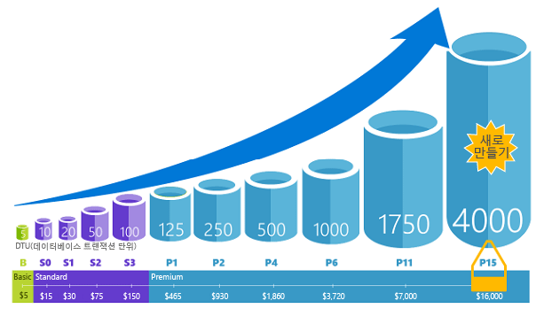

# 최소 가동 중지 시간으로 동적으로 데이터베이스 리소스 크기 조정

Azure SQL Database를 사용 하면 최소 사용 하 여 데이터베이스에 더 많은 리소스를 동적으로 추가할 [가동 중지 시간](https://azure.microsoft.com/support/legal/sla/sql-database/v1_2/)하지만 있습니다는 스위치를 기간 동안 연결 데이터베이스에 손실 될 수 있는 시간을 짧은 시간에 대 한 재시도 논리를 사용 하 여 완화 합니다.

## 개요

앱에 대한 수요가 몇 개의 디바이스 및 고객에서 수백만으로 증가할 경우, Azure SQL Database는 가동 중지 시간을 최소화하면서 즉시 크기가 조정됩니다. 확장성은 PaaS의 가장 중요한 특성 중 하나로, 필요한 경우 서비스에 리소스를 동적으로 추가할 수 있게 해줍니다. Azure SQL Database를 사용하면 데이터베이스에 할당된 리소스(CPU 처리 능력, 메모리, IO 처리량 및 스토리지)를 쉽게 변경할 수 있습니다.

인덱싱 또는 쿼리 재작성 방법으로 해결할 수 없는, 애플리케이션 사용량 증가로 인한 성능 문제를 완화할 수 있습니다. 데이터베이스가 현재 리소스 한도에 도달하고 들어오는 워크로드를 처리하기 위해 추가 처리 능력이 필요할 때 리소스를 추가하면 빠르게 대응할 수 있습니다. Azure SQL Database를 사용하면 필요하지 않을 때 리소스를 축소하여 비용을 줄일 수도 있습니다.

하드웨어 구매 및 기본 인프라 변경에 대해 염려할 필요가 없습니다. Azure Portal에서 슬라이더를 사용하여 데이터베이스 크기를 쉽게 조정할 수 있습니다.

Azure SQL Database는 [DTU 기반 구매 모델](sql-database-service-tiers-dtu.md) 및 [vCore 기반 구매 모델](sql-database-service-tiers-vcore.md)을 제공합니다.

- [DTU 기반 구매 모델](sql-database-service-tiers-dtu.md)은 경량 또는 중량 데이터베이스 워크로드를 지원하기 위해 다음과 같은 세 가지 서비스 계층에서 계산, 메모리 및 IO 리소스를 혼합하여 제공합니다. 기본, 표준 및 프리미엄의 세 가지 서비스 계층으로 컴퓨팅, 메모리 및 IO 리소스를 함께 제공합니다. 각 계층 내의 성능 수준은 다양하게 섞인 리소스를 제공합니다. 여기에 저장소 리소스를 추가할 수 있습니다.
- [vCore 기반 구매 모델](sql-database-service-tiers-vcore.md)을 통해 vCore 개수, 크기나 메모리 및 저장소의 크기와 속도를 선택할 수 있습니다. 이 구매 모델은 다음 세 가지 서비스 계층을 제공합니다. 일반 목적, 업무 수행에 필수적인 및 대규모 합니다.

기본, 표준 또는 범용 서비스 계층에서 매월 저렴한 비용으로 작은 규모의 단일 데이터베이스에 첫 번째 앱을 빌드한 다음, 솔루션의 요구 사항에 맞게 언제든지 수동 또는 프로그래밍 방식으로 이 서비스 계층을 프리미엄 또는 중요 비즈니스용 서비스 계층으로 변경할 수 있습니다. 앱이나 고객에게 가동 중지 시간 없이 성능을 조정할 수 있습니다. 동적 확장성을 통해 데이터베이스는 급변하는 리소스 요구 사항에 투명하게 대응할 수 있으며, 필요할 때 필요한 리소스에 대해서만 비용을 지불할 수 있습니다.

> [!NOTE]
> 동적 확장성은 자동 크기 조정과 다릅니다. 자동 크기 조정은 서비스 기준에 따라 자동으로 조정 하는 경우 반면 동적 확장성을 최소 가동 중지 시간을 사용 하 여 수동으로 확장할 수 있습니다.

단일 Azure SQL Database는 수동 동적 확장성을 지원하지만 자동 크기 조정은 지원하지 않습니다. 더 많은 *자동* 환경은 데이터베이스에서 개별 데이터베이스 요구 사항에 따라 풀에 리소스를 공유하도록 허용하는 탄력적 풀을 사용하는 것이 좋습니다.
그러나 단일 Azure SQL Database에 대한 확장성을 자동화할 수 있는 스크립트가 있습니다. 예제는 [PowerShell을 사용하여 단일 SQL Database 모니터링 및 크기 조정](scripts/sql-database-monitor-and-scale-database-powershell.md)을 참조하세요.

애플리케이션 가동 중지 시간을 최소로 하여 언제든지 [DTU 서비스 계층](sql-database-service-tiers-dtu.md) 또는 [vCore 특성](sql-database-vcore-resource-limits-single-databases.md)을 변경할 수 있습니다(일반적으로 평균 4초 미만). 많은 업무와 앱에서, 특히 사용 패턴이 비교적 예측 가능한 경우 데이터베이스를 만들고 성능을 확장하거나 축소할 수 있으면 충분합니다. 하지만 사용 패턴을 예측할 수 없는 경우 비용과 비즈니스 모델을 관리하기 어려워질 수 있습니다. 이 시나리오에서는 풀의 여러 데이터베이스 간에 공유되는 특정 개수의 eDTU가 포함된 탄력적 풀을 사용합니다.

Azure SQL Database의 세 가지 버전은 모두 데이터베이스 크기를 동적으로 조정할 수 있는 기능을 제공합니다.

- [단일 데이터베이스](sql-database-single-database-scale.md)에서는 [DTU](sql-database-dtu-resource-limits-single-databases.md) 또는 [vCore](sql-database-vcore-resource-limits-single-databases.md) 모델 중 하나를 사용하여 각 데이터베이스에 할당되는 최대 리소스 양을 정의할 수 있습니다.
- [Managed Instance](sql-database-managed-instance.md)는 [vCores](sql-database-managed-instance.md#vcore-based-purchasing-model) 모드를 사용하며, 인스턴스에 할당되는 최대 CPU 코어 수와 최대 스토리지 수를 정의할 수 있습니다. 인스턴스 내의 모든 데이터베이스가 인스턴스에 할당된 리소스를 공유합니다.
- [탄력적 풀](sql-database-elastic-pool-scale.md)에서는 풀의 데이터베이스 그룹당 최대 리소스 한도를 정의할 수 있습니다.

> [!NOTE]
> 완료 되 면 확장 위쪽/확장 프로세스는 짧은 연결 중단을 예상할 수 있습니다. 구현한 경우 [표준 일시적인 오류에 대 한 논리 다시 시도](sql-database-connectivity-issues.md#retry-logic-for-transient-errors), 장애 조치를 알지 못합니다.

## 대체 크기 조정 방법

리소스 크기 조정은 데이터베이스 또는 애플리케이션 코드를 변경하지 않고 데이터베이스 성능을 향상하는 가장 쉽고 효과적인 방법입니다. 경우에 따라 가장 높은 서비스 계층, 컴퓨팅 크기, 성능 최적화를 사용해도 워크로드가 성공적이고 비용 효과적인 방식으로 처리되지 않을 수 있습니다. 이 경우 다음과 같은 추가 옵션을 사용하여 데이터베이스 크기를 조정할 수 있습니다.

- [읽기 확장](sql-database-read-scale-out.md)은 데이터의 읽기 전용 복제본이 한 개 있고, 보고서 등 까다로운 읽기 전용 쿼리를 실행할 수 있는 경우에 사용할 수 있는 기능입니다. 읽기 전용 복제본은 주 데이터베이스의 리소스 사용량에 영향을 주지 않고 읽기 전용 워크로드를 처리합니다.
- [데이터베이스 분할](sql-database-elastic-scale-introduction.md)은 데이터를 여러 데이터베이스로 분할하고 독립적으로 크기를 조정할 수 있는 기술 집합입니다.

## 다음 단계

- 데이터베이스 코드를 변경하여 데이터베이스 성능을 향상하는 방법에 대한 자세한 내용은 [성능 권장 사항 찾기 및 적용](sql-database-advisor-portal.md)을 참조하세요.
- 기본 제공 데이터베이스 인텔리전스를 통해 데이터베이스를 최적화하는 방법에 대한 자세한 내용은 [자동 조정](sql-database-automatic-tuning.md)을 참조하세요.
- Azure SQL Database 서비스의 읽기 확장에 대한 자세한 내용은 [읽기 전용 복제본을 사용하여 읽기 전용 쿼리 워크로드의 부하를 분산](sql-database-read-scale-out.md)하는 방법을 참조하세요.
- 데이터베이스 분할에 대한 자세한 내용은 [Azure SQL Database를 사용하여 확장](sql-database-elastic-scale-introduction.md)을 참조하세요.
