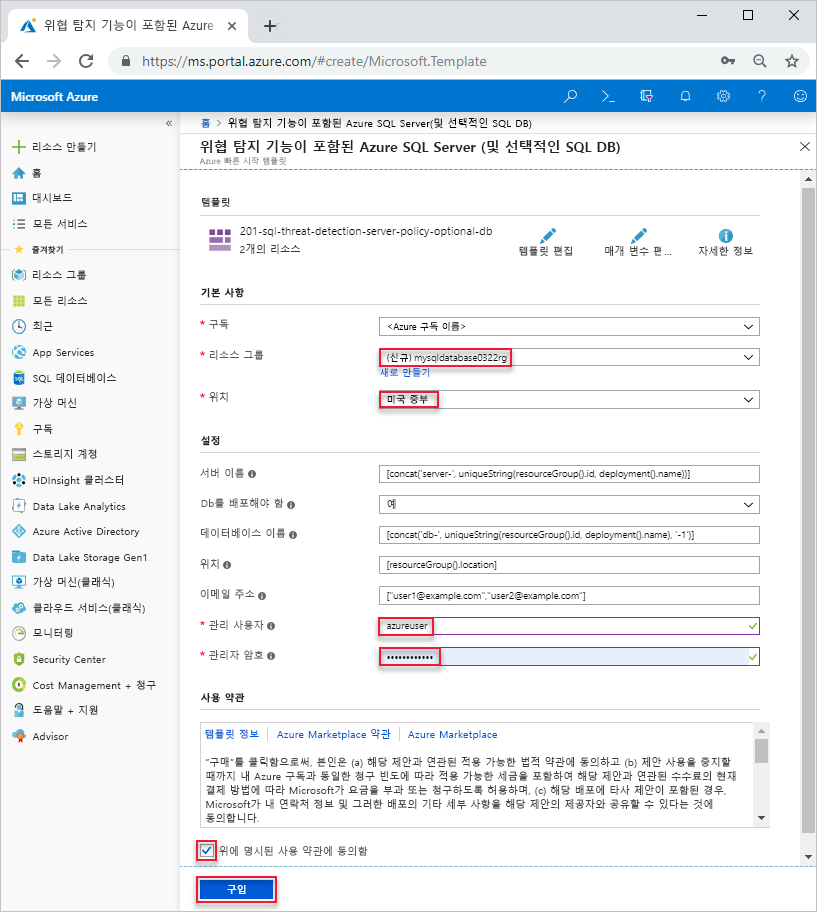

# <a name="quickstart-create-a-single-database-in-azure-sql-database-using-the-azure-resource-manager-template"></a>빠른 시작: Azure Resource Manager 템플릿을 사용하여 Azure SQL Database에서 단일 데이터베이스 만들기

Azure SQL Database에서 데이터베이스를 만드는 가장 쉽고 빠른 방법은 [단일 데이터베이스](sql-database-single-database.md)를 만드는 것입니다. 이 빠른 시작에서는 Azure Resource Manager 템플릿을 사용하여 단일 데이터베이스를 만드는 방법을 보여줍니다. 자세한 내용은 [Azure Resource Manager 설명서](/azure/azure-resource-manager/)를 참조하세요.

Azure 구독이 아직 없는 경우 [무료 계정을 만듭니다](https://azure.microsoft.com/free/).

## <a name="create-a-single-database"></a>단일 데이터베이스 만들기

단일 데이터베이스는 두 [구매 모델](sql-database-purchase-models.md) 중 하나를 사용하여 컴퓨팅, 메모리, IO 및 스토리지 리소스 세트가 정의됩니다. 단일 데이터베이스를 만들 때 지정된 Azure 지역의 [Azure 리소스 그룹](../azure-resource-manager/resource-group-overview.md) 내에서 데이터베이스를 관리 및 배치하기 위한 [SQL Database 서버](sql-database-servers.md)도 정의합니다.

다음 JSON 파일은 이 문서에 사용되는 템플릿입니다. 템플릿은 Azure Storage 계정에 저장됩니다. Azure SQL 데이터베이스 템플릿 샘플을 더 보려면 [여기](https://azure.microsoft.com/resources/templates/?resourceType=Microsoft.Sql&pageNumber=1&sort=Popular)에서 확인할 수 있습니다.

```json
{
  "$schema": "https://schema.management.azure.com/schemas/2015-01-01/deploymentTemplate.json#",
  "contentVersion": "1.0.0.0",
  "parameters": {
    "serverName": {
      "type": "string",
      "defaultValue": "[concat('server-', uniqueString(resourceGroup().id, deployment().name))]",
      "metadata": {
        "description": "Name for the SQL server"
      }
    },
    "shouldDeployDb": {
      "type": "string",
      "allowedValues": [
        "Yes",
        "No"
      ],
      "defaultValue": "Yes",
      "metadata": {
        "description": "Whether an Azure SQL Database should be deployed under the server"
      }
    },
    "databaseName": {
      "type": "string",
      "defaultValue": "[concat('db-', uniqueString(resourceGroup().id, deployment().name), '-1')]",
      "metadata": {
        "description": "Name for the SQL database under the SQL server"
      }
    },
    "location": {
      "type": "string",
      "defaultValue": "[resourceGroup().location]",
      "metadata": {
        "description": "Location for server and optional DB"
      }
    },
    "emailAddresses": {
      "type": "array",
      "defaultValue": [
        "user1@example.com",
        "user2@example.com"
      ],
      "metadata": {
        "description": "Email addresses for receiving alerts"
      }
    },
    "adminUser": {
      "type": "string",
      "metadata": {
        "description": "Username for admin"
      }
    },
    "adminPassword": {
      "type": "securestring",
      "metadata": {
        "description": "Password for admin"
      }
    }
  },
  "variables": {
    "databaseServerName": "[toLower(parameters('serverName'))]",
    "databaseName": "[parameters('databaseName')]",
    "shouldDeployDb": "[parameters('shouldDeployDb')]",
    "databaseServerLocation": "[parameters('location')]",
    "databaseServerAdminLogin": "[parameters('adminUser')]",
    "databaseServerAdminLoginPassword": "[parameters('adminPassword')]",
    "emailAddresses": "[parameters('emailAddresses')]"
  },
  "resources": [
    {
      "type": "Microsoft.Sql/servers",
      "name": "[variables('databaseServerName')]",
      "location": "[variables('databaseServerLocation')]",
      "apiVersion": "2015-05-01-preview",
      "properties": {
        "administratorLogin": "[variables('databaseServerAdminLogin')]",
        "administratorLoginPassword": "[variables('databaseServerAdminLoginPassword')]",
        "version": "12.0"
      },
      "tags": {
        "DisplayName": "[variables('databaseServerName')]"
      },
      "resources": [
        {
          "type": "securityAlertPolicies",
          "name": "DefaultSecurityAlert",
          "apiVersion": "2017-03-01-preview",
          "dependsOn": [
            "[variables('databaseServerName')]"
          ],
          "properties": {
            "state": "Enabled",
            "emailAddresses": "[variables('emailAddresses')]",
            "emailAccountAdmins": true
          }
        }
      ]
    },
    {
      "condition": "[equals(variables('shouldDeployDb'), 'Yes')]",
      "type": "Microsoft.Sql/servers/databases",
      "name": "[concat(string(variables('databaseServerName')), '/', string(variables('databaseName')))]",
      "location": "[variables('databaseServerLocation')]",
      "apiVersion": "2017-10-01-preview",
      "dependsOn": [
        "[concat('Microsoft.Sql/servers/', variables('databaseServerName'))]"
      ],
      "properties": {},
      "tags": {
        "DisplayName": "[variables('databaseServerName')]"
      }
    }
  ]
}
```

1. 다음 이미지를 선택하고 Azure에 로그인하여 템플릿을 엽니다.

    <a href="https://portal.azure.com/#create/Microsoft.Template/uri/https%3A%2F%2Farmtutorials.blob.core.windows.net%2Fcreatesql%2Fazuredeploy.json"></a>

2. 다음 값을 선택하거나 입력합니다.  

    

    지정되지 않은 경우 기본값을 사용합니다.

    * **구독**: Azure 구독을 선택합니다.
    * **리소스 그룹**: **새로 만들기**를 선택하고 리소스 그룹에 고유한 이름을 입력한 다음, **확인**을 클릭합니다. 
    * **위치**: 위치를 선택합니다.  예: **미국 중부**
    * **관리 사용자**: SQL 데이터베이스 서버 관리자 사용자 이름을 지정합니다.
    * **관리자 암호**: 관리자 암호를 지정합니다. 
    * **위에 명시된 사용 약관에 동의함**: 선택합니다.
3. **구매**를 선택합니다.

## <a name="query-the-database"></a>데이터베이스 쿼리

데이터베이스를 쿼리하려면 [데이터베이스 쿼리](./sql-database-single-database-get-started.md#query-the-database)를 참조하세요.

## <a name="clean-up-resources"></a>리소스 정리

[다음 단계](#next-steps)를 진행하려면 이 리소스 그룹, 데이터베이스 서버 및 단일 데이터베이스를 그대로 유지합니다. 다음 단계에서는 다른 메서드를 사용하여 데이터베이스를 연결하고 쿼리하는 방법을 보여줍니다.

Azure CLI 또는 Azure PowerShell을 사용하여 리소스 그룹을 삭제하려면:

```azurecli-interactive
echo "Enter the Resource Group name:" &&
read resourceGroupName &&
az group delete --name $resourceGroupName 
```

```azurepowershell-interactive
$resourceGroupName = Read-Host -Prompt "Enter the Resource Group name"
Remove-AzResourceGroup -Name $resourceGroupName 
```

## <a name="next-steps"></a>다음 단계

- 온-프레미스 또는 원격 도구에서 단일 데이터베이스에 연결하기 위한 서버 수준 방화벽 규칙을 만듭니다. 자세한 내용은 [서버 수준 방화벽 규칙 만들기](sql-database-server-level-firewall-rule.md)를 참조하세요.
- 서버 수준 방화벽 규칙을 만든 후 여러 다양한 도구 및 언어를 사용하여 데이터베이스를 [연결 및 쿼리](sql-database-connect-query.md)할 수 있습니다.
  - [SQL Server Management Studio를 사용하여 연결 및 쿼리](sql-database-connect-query-ssms.md)
  - [Azure Data Studio를 사용하여 연결 및 쿼리](https://docs.microsoft.com/sql/azure-data-studio/quickstart-sql-database?toc=/azure/sql-database/toc.json)
- Azure CLI를 사용하여 단일 데이터베이스를 만들려면 [Azure CLI 샘플](sql-database-cli-samples.md)을 참조하세요.
- Azure PowerShell을 사용하여 단일 데이터베이스를 만들려면 [Azure PowerShell 샘플](sql-database-powershell-samples.md)을 참조하세요.
