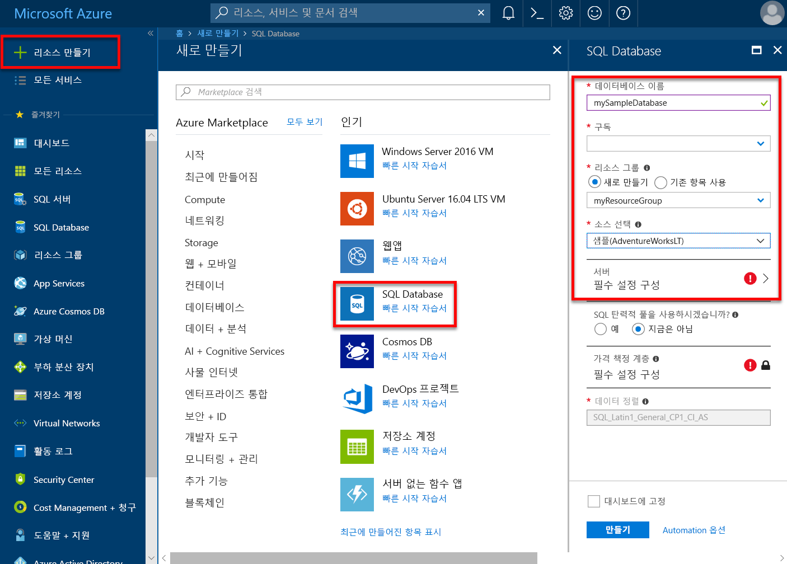
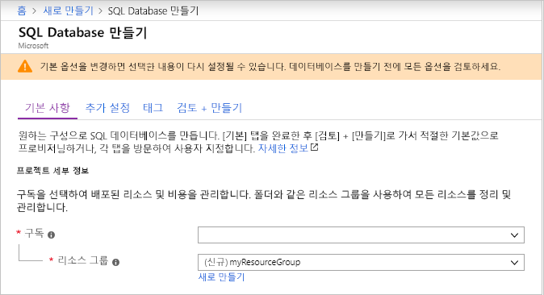
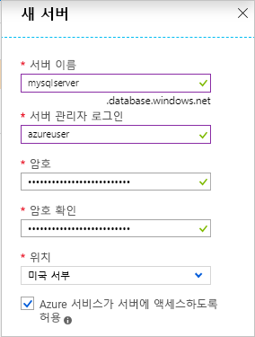
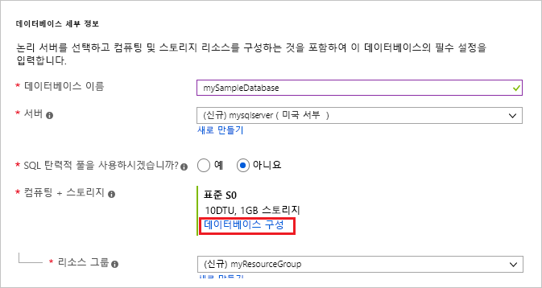
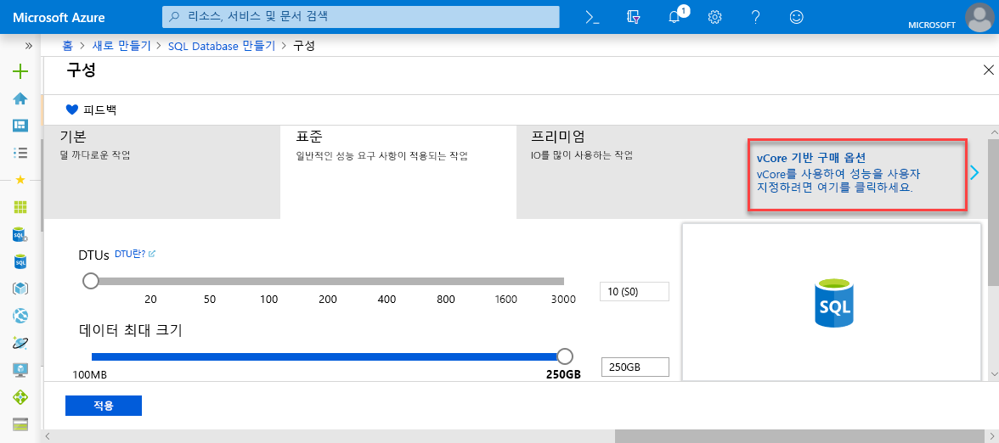
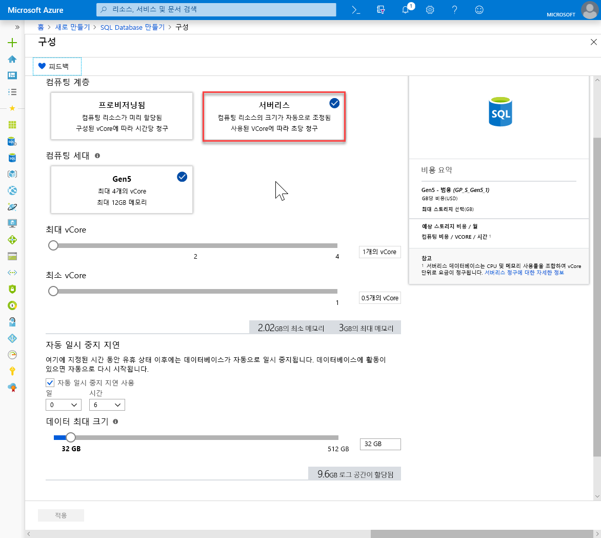
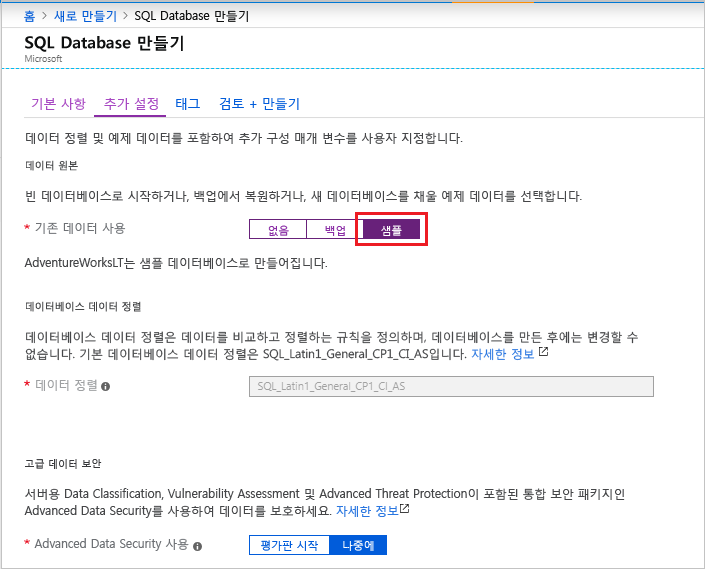
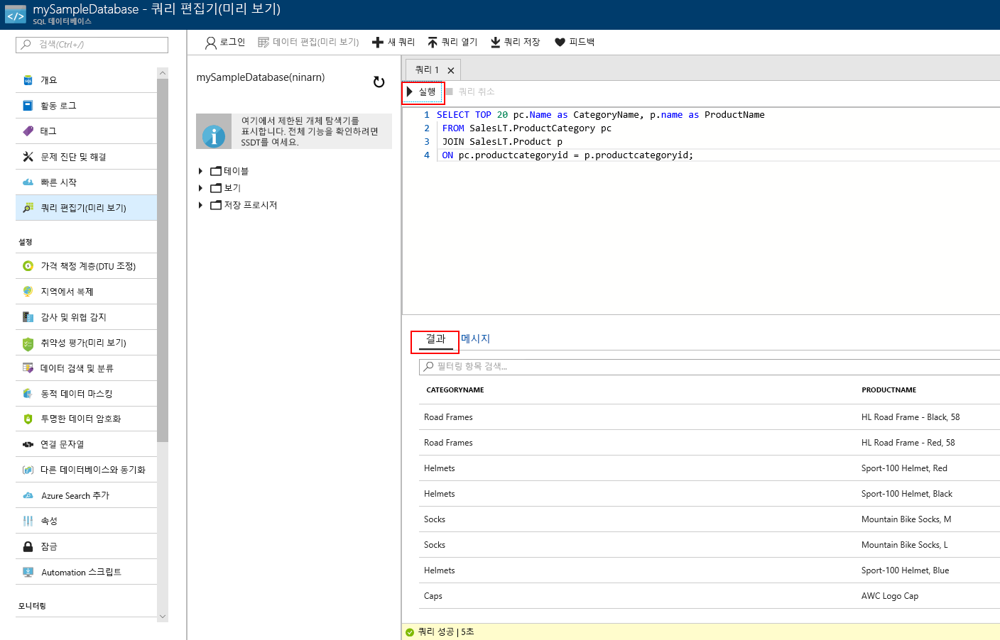

# <a name="quickstart-create-a-single-database-in-azure-sql-database-using-the-azure-portal"></a>빠른 시작: Azure Portal을 사용하여 Azure SQL Database에서 단일 데이터베이스 만들기

Azure SQL Database에서 데이터베이스를 만드는 가장 쉽고 빠른 방법은 [단일 데이터베이스](sql-database-single-database.md)를 만드는 것입니다. 이 빠른 시작에서는 Azure Portal을 사용하여 단일 데이터베이스를 만들고 쿼리하는 방법을 보여줍니다.

Azure 구독이 아직 없는 경우 [무료 계정을 만듭니다](https://azure.microsoft.com/free/).

이 빠른 시작에서 모든 단계의 경우 [Azure Portal](https://portal.azure.com/)에 로그인합니다.

## <a name="create-a-single-database"></a>단일 데이터베이스 만들기

단일 데이터베이스는 서버리스(미리 보기) 또는 프로비저닝된 컴퓨팅 계층에서 만들 수 있습니다.

- 프로비저닝된 컴퓨팅 계층의 단일 데이터베이스에는 미리 할당된 지정된 양의 컴퓨팅 리소스와 함께 두 가지 [구매 모델](sql-database-purchase-models.md) 중 하나를 사용하는 메모리 및 스토리지 리소스 세트가 있습니다.
- 서버리스 컴퓨팅 계층의 단일 데이터베이스에는 자동으로 크기가 조정된 컴퓨팅 리소스의 범위와 함께 코어당 지정된 양의 메모리, 지정된 양의 스토리지 리소스가 있으며, [vCore 기반 구매 모델](sql-database-service-tiers-vcore.md)에서만 제공됩니다.

단일 데이터베이스를 만들 때 지정된 Azure 지역의 [Azure 리소스 그룹](../azure-resource-manager/resource-group-overview.md) 내에서 데이터베이스를 관리 및 배치하기 위한 [SQL Database 서버](sql-database-servers.md)도 정의합니다.

> [!NOTE]
> 이 빠른 시작에서는 [vCore 기반 구매 모델](sql-database-service-tiers-vcore.md)과 [서버리스](sql-database-serverless.md) 컴퓨팅 계층을 사용하지만 [DTU 기반 구매 모델](sql-database-service-tiers-DTU.md)도 사용할 수 있습니다.

AdventureWorksLT 샘플 데이터를 포함하는 단일 데이터베이스를 만들려면:

1. Azure Portal의 왼쪽 위 모서리에서 **리소스 만들기**를 선택합니다.
2. **데이터베이스**를 선택한 다음, **SQL Database**를 선택하여 **SQL Database 만들기** 페이지를 엽니다.

   

3. **기본 사항** 탭의 **프로젝트 세부 정보** 섹션에서 다음 값을 입력하거나 선택합니다.

   - **구독**: 표시되지 않는 경우 올바른 구독을 드롭다운하고 선택합니다.
   - **리소스 그룹**: **새로 만들기**를 선택하고, `myResourceGroup`을 입력하고, **확인**을 선택합니다.

     

4. **데이터베이스 세부 정보** 섹션에서 다음 값을 입력하거나 선택합니다.

   - **데이터베이스 이름**: `mySampleDatabase`을 입력합니다.
   - **서버**: **새로 만들기**를 선택하고 다음 값을 입력한 다음, **선택**을 클릭합니다.
       - **서버 이름**: `mysqlserver`에 숫자를 붙여서 고유한 이름을 입력합니다.
       - **서버 관리자 로그인**: `azureuser`을 입력합니다.
       - **암호**: 암호 요구 사항을 충족하는 복잡한 암호를 입력합니다.
       - **위치**: 드롭다운 목록에서 위치를 선택합니다(예: `West US 2`).

         

      > [!IMPORTANT]
      > 빠른 시작을 위해 서버 및 데이터베이스에 로그인할 수 있도록 서버 관리자 로그인 및 암호를 적어 둡니다. 로그인 또는 암호를 잊은 경우 **SQL 서버** 페이지에서 로그인 이름을 얻거나 암호를 다시 설정할 수 있습니다. **SQL 서버** 페이지를 열려면 데이터베이스를 만든 후 데이터베이스 **개요** 페이지에서 서버 이름을 선택합니다.

        

   - **SQL 탄력적 풀을 사용하시겠습니까?** : **아니요** 옵션을 선택합니다.
   - **컴퓨팅 및 스토리지**: **데이터베이스 구성**을 선택하고 이 빠른 시작에 대해서는 **vCore 기반 구매 옵션**을 선택합니다.

     

   - **서버리스**를 선택합니다.

     

   - **최대 vCore 수**, **최소 vCore 수**, **자동 일시 중지 지연** 및 **데이터 최대 크기**에 대한 설정을 검토합니다. 원하는 대로 변경합니다.
   - 미리 보기 조건을 수락하고 **확인**을 클릭합니다.
   - **적용**을 선택합니다.

5. **추가 설정** 탭을 선택합니다. 
6. **데이터 원본** 섹션의 **기존 데이터 사용** 아래에서 `Sample`을 선택합니다. 

   

   > [!IMPORTANT]
   > 이 데이터를 사용하는 Azure SQL Database 빠른 시작을 쉽게 따라 할 수 있도록 **샘플(AdventureWorksLT)** 데이터를 선택해야 합니다.

7. 나머지 값은 기본값으로 두고 양식 맨 아래에서 **검토 + 만들기**를 선택합니다.
8. 최종 설정을 검토하고 **만들기**를 선택합니다.

9. **SQL Database** 양식에서 **만들기**를 선택하여 리소스 그룹, 서버 및 데이터베이스를 배포하고 프로비전합니다.

## <a name="query-the-database"></a>데이터베이스 쿼리

데이터베이스를 만들었으니, 이제 Azure Portal에서 기본 제공 쿼리 도구를 사용하여 데이터베이스에 연결하고 데이터를 쿼리합니다.

1. 데이터베이스의 **SQL Database** 페이지에서 왼쪽 메뉴에 있는 **쿼리 편집기(미리 보기)** 를 선택합니다.

   

2. 사용자의 로그인 정보를 입력하고 **확인**을 선택합니다.
3. 다음 쿼리를 **쿼리 편집기** 창에 입력합니다.

   ```sql
   SELECT TOP 20 pc.Name as CategoryName, p.name as ProductName
   FROM SalesLT.ProductCategory pc
   JOIN SalesLT.Product p
   ON pc.productcategoryid = p.productcategoryid;
   ```

4. **실행**을 선택한 다음, **결과** 창에서 쿼리 결과를 검토합니다.

   

5. **쿼리 편집기** 창을 닫고, 저장하지 않은 편집 내용을 삭제하라는 메시지가 표시될 때 **확인**을 선택합니다.

## <a name="clean-up-resources"></a>리소스 정리

[다음 단계](#next-steps)를 진행하려면 이 리소스 그룹, 데이터베이스 서버 및 단일 데이터베이스를 그대로 유지합니다. 다음 단계에서는 다른 메서드를 사용하여 데이터베이스를 연결하고 쿼리하는 방법을 보여줍니다.

이러한 리소스 사용을 완료한 경우 다음과 같이 해당 리소스를 삭제할 수 있습니다.

1. Azure Portal의 왼쪽 메뉴에서 **리소스 그룹**을 선택한 다음, **myResourceGroup**을 선택합니다.
2. 리소스 그룹 페이지에서 **리소스 그룹 삭제**를 선택합니다.
3. 필드에 *myResourceGroup*을 입력한 다음, **삭제**를 선택합니다.

## <a name="next-steps"></a>다음 단계

- 온-프레미스 또는 원격 도구에서 단일 데이터베이스에 연결하기 위한 서버 수준 방화벽 규칙을 만듭니다. 자세한 내용은 [서버 수준 방화벽 규칙 만들기](sql-database-server-level-firewall-rule.md)를 참조하세요.
- 서버 수준 방화벽 규칙을 만든 후 여러 다양한 도구 및 언어를 사용하여 데이터베이스를 [연결 및 쿼리](sql-database-connect-query.md)할 수 있습니다.
  - [SQL Server Management Studio를 사용하여 연결 및 쿼리](sql-database-connect-query-ssms.md)
  - [Azure Data Studio를 사용하여 연결 및 쿼리](https://docs.microsoft.com/sql/azure-data-studio/quickstart-sql-database?toc=/azure/sql-database/toc.json)
- Azure CLI를 사용하여 프로비저닝된 컴퓨팅 계층에서 단일 데이터베이스를 만들려면 [Azure CLI 샘플](sql-database-cli-samples.md)을 참조하세요.
- Azure PowerShell을 사용하여 프로비저닝된 컴퓨팅 계층에서 단일 데이터베이스를 만들려면 [Azure PowerShell 샘플](sql-database-powershell-samples.md)을 참조하세요.
- Azure Powershell을 사용하여 서버리스 컴퓨팅 계층에서 단일 데이터베이스를 만들려면 [PowerShell을 사용하여 서버리스 데이터베이스 만들기](sql-database-serverless.md#create-new-serverless-database-using-powershell)를 참조하세요.
