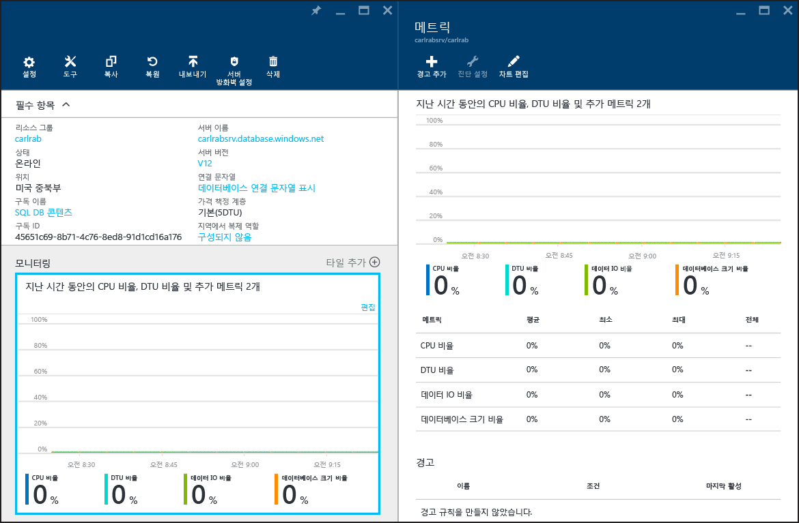

<properties
	pageTitle="Azure SQL 데이터베이스에서 데이터베이스 성능 모니터링 | Microsoft Azure"
	description="Azure 도구 및 동적 관리 뷰를 사용하여 데이터베이스를 모니터링하기 위한 옵션에 대해 알아봅니다."
	keywords="데이터베이스 모니터링, 클라우드 데이터베이스 성능"
	services="sql-database"
	documentationCenter=""
	authors="CarlRabeler"
	manager="jhubbard"
	editor=""/>

<tags
	ms.service="sql-database"
	ms.devlang="na"
	ms.topic="get-started-article"
	ms.tgt_pltfrm="na"
	ms.workload="data-management"
	ms.date="09/27/2016"
	ms.author="carlrab"/>

# Azure SQL 데이터베이스에서 데이터베이스 성능 모니터링
Azure에서 SQL 데이터베이스의 성능 모니터링은 데이터베이스에 대해 선택한 데이터베이스 성능 수준을 기준으로 리소스 사용률을 모니터링하는 것으로 시작합니다. 모니터링을 통해 데이터베이스에 과도한 용량이 있는지, 리소스가 최대값에 도달하는 문제가 있는지 확인한 후 데이터베이스의 성능 수준 및 [서비스 계층](sql-database-service-tiers.md)을 조정할 시기인지 여부를 결정할 수 있습니다. [Azure 포털](https://portal.azure.com)에서 그래픽 도구를 사용하거나 SQL [동적 관리 뷰](https://msdn.microsoft.com/library/ms188754.aspx)를 사용하여 데이터베이스를 모니터링할 수 있습니다.

## Azure 포털을 사용하여 데이터베이스 모니터링

[Azure 포털](https://portal.azure.com/)에서 데이터베이스를 선택하고 **모니터링** 차트를 클릭하여 단일 데이터베이스의 사용률을 모니터링할 수 있습니다. 그러면 **메트릭** 창이 나타나며 **차트 편집** 단추를 클릭하면 이 창을 변경할 수 있습니다. 다음 메트릭을 추가합니다.

- CPU 비율
- DTU 비율
- 데이터 IO 비율
- 데이터베이스 크기 비율

이러한 메트릭을 추가한 후 **메트릭** 창의 세부 정보가 포함된 **모니터링** 차트에서 메트릭을 계속 볼 수 있습니다. 네 가지 메트릭 모두 데이터베이스의 **DTU**를 기준으로 평균 사용률 비율을 표시합니다. DTU에 대한 자세한 내용은 [서비스 계층](sql-database-service-tiers.md)을 참조하세요.

성능 메트릭에 대한 경고를 구성할 수도 있습니다. **메트릭** 창에서 **경고 추가** 단추를 클릭합니다. 마법사를 따라 경고를 구성합니다. 메트릭이 특정 임계값을 초과하거나 메트릭이 특정 임계값보다 낮은 경우 경고하는 옵션이 있습니다.

예를 들어 데이터베이스에 대한 워크로드가 확장될 것으로 예상되면 데이터베이스가 성능 메트릭의 80%에 도달할 때마다 이메일 경고를 보내도록 구성할 수 있습니다. 다음 높은 성능 수준으로 전환해야 할 수 있는 시기를 알 수 있도록 이 기능을 조기 경고로 사용할 수 있습니다.

성능 메트릭이 더 낮은 성능 수준으로 다운그레이드할 수 있는지 여부를 판단하는 데 도움이 될 수도 있습니다. 표준 S2 데이터베이스를 사용하고 있는데 모든 성능 메트릭에서 지정한 시기에 데이터베이스가 평균적으로 10% 이하를 사용하는 것으로 나타난다고 가정합니다. 데이터베이스가 표준 S1에서 잘 작동할 가능성이 있습니다. 그러나 더 낮은 성능 수준으로 이동하도록 결정하기 전에 갑자기 증가하거나 변동하는 워크로드에 주의해야 합니다.

## DMV를 사용하여 데이터베이스 모니터링

포털에 노출된 것과 같은 메트릭을 서버의 논리 **마스터** 데이터베이스에 있는 [sys.resource\_stats](https://msdn.microsoft.com/library/dn269979.aspx), 사용자 데이터베이스의 [sys.dm\_db\_resource\_stats](https://msdn.microsoft.com/library/dn800981.aspx) 등의 시스템 뷰를 통해 사용할 수도 있습니다. 더 오랜 개간 동안 덜 자세한 데이터를 모니터링해야 하는 경우 **sys.resource\_stats**를 사용합니다. 더 작은 시간 범위의 자세한 데이터를 모니터링해야 하는 경우 **sys.dm\_db\_resource\_stats**를 사용합니다. 자세한 내용은 [Azure SQL 데이터베이스 성능 지침](sql-database-performance-guidance.md#monitoring-resource-use-with-sysresourcestats)을 참조하세요.

>[AZURE.NOTE] **sys.dm\_db\_resource\_stats**는 Web 및 Business Edition 데이터베이스에서 사용할 때 빈 결과 집합을 반환합니다.

탄력적 데이터베이스 풀의 경우 이 섹션에서 설명하는 기법을 사용하여 풀의 개별 데이터베이스를 모니터링할 수 있습니다. 하지만 전체적으로 풀을 모니터링할 수도 있습니다. 자세한 내용은 [탄력적 데이터베이스 풀 모니터링 및 관리](sql-database-elastic-pool-manage-portal.md)를 참조하세요.

<!---HONumber=AcomDC_0928_2016-->