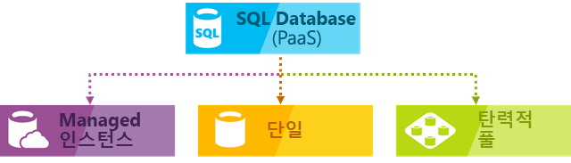
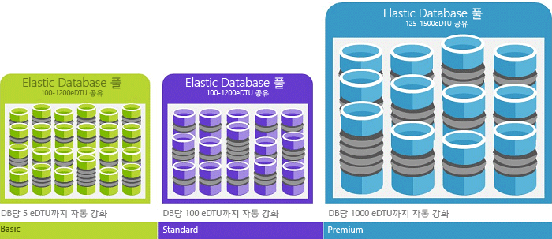
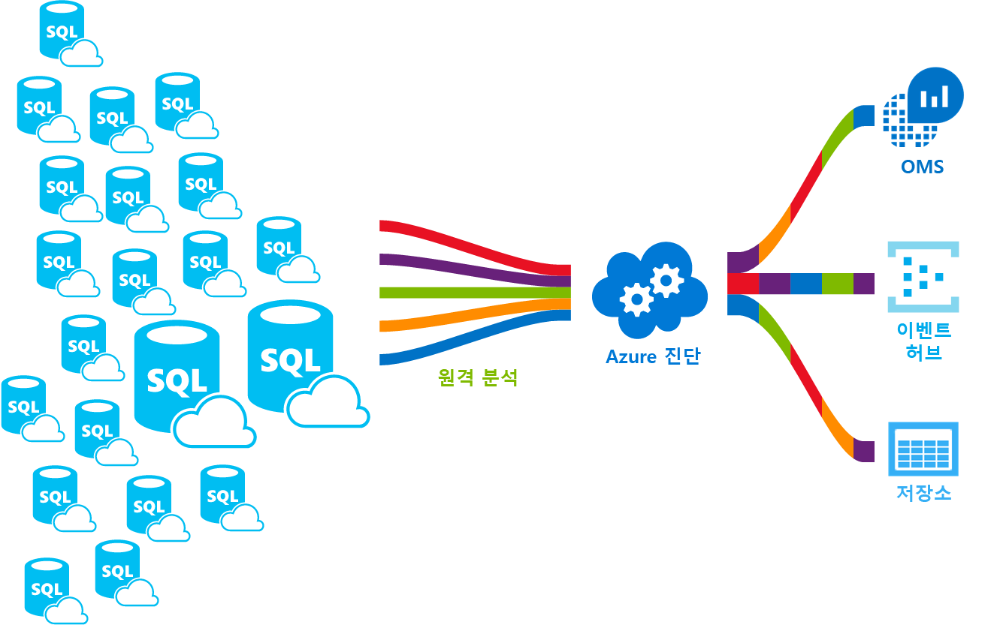

# Azure SQL Database 서비스란 무엇입니까

SQL Database는 관계형 데이터, 공간, JSON 및 XML과 같은 구조를 지원하는 Microsoft Azure의 범용 관계형 데이터베이스 관리 서비스입니다. SQL Database는 서로 다른 두 구매 모델 내에서 동적으로 확장 가능한 성능을 제공합니다(vCore 기반 구매 모델 및 DTU 기반 구매 모델). 또한 SQL Database는 고도의 분석 및 보고를 위한 [columnstore 인덱스](https://docs.microsoft.com/sql/relational-databases/indexes/columnstore-indexes-overview) 및 고도의 트랜잭션 처리를 위한 [메모리 내 OLTP](sql-database-in-memory.md)와 같은 옵션을 제공합니다. Microsoft에서는 SQL 코드 베이스를 모두 원활하게 패치하고 업데이트하며 기본 인프라의 모든 관리를 추상화합니다.

> [!NOTE]
> Azure SQL Database의 용어집은 [SQL Database 용어집](sql-database-glossary-terms.md)을 참조하세요.

Azure SQL Database는 Azure SQL 데이터베이스에 다음과 같은 옵션을 제공합니다.

- SQL Database 서버를 통해 관리되는 고유한 리소스 세트가 있는 [단일 데이터베이스](sql-database-single-database.md). 단일 데이터베이스는 SQL Server의 [포함된 데이터베이스](https://docs.microsoft.com/sql/relational-databases/databases/contained-databases)와 유사합니다.
- SQL Database 서버를 통해 관리되는 공유 리소스 세트가 있는 데이터베이스 컬렉션인 [탄력적 풀](sql-database-elastic-pool.md). 단일 데이터베이스를 탄력적 풀로 이동하거나 탄력적 풀에서 제거할 수 있습니다.
- 공유 리소스 세트가 있는 시스템 및 사용자 데이터베이스 컬렉션인[관리되는 인스턴스](sql-database-managed-instance.md). 관리되는 인스턴스는 [Microsoft SQL Server 데이터베이스 엔진](https://docs.microsoft.com/sql/sql-server/sql-server-technical-documentation) 인스턴스와 유사합니다.

다음 그림에서는 이러한 배포 옵션을 보여줍니다.

SQL Database는 해당 코드 베이스를 [Microsoft SQL Server 데이터베이스 엔진](https://docs.microsoft.com/sql/sql-server/sql-server-technical-documentation)과 공유합니다. Microsoft의 클라우드 우선 전략을 사용하여 SQL Server의 최신 기능을 SQL Database에 먼저 릴리스한 다음 SQL Server 자체에 릴리스합니다. 이 방법은 패치 기능 또는 업그레이드에 대한 오버헤드 없이 수백만 개의 데이터베이스에 대해 테스트된 이러한 새로운 기능을 사용하여 최신 SQL Server 기능을 제공합니다. 별도로 공지된 새로운 기능에 대한 내용은 다음을 참조하세요.

- **[SQL Database에 대한 Azure 로드맵](https://azure.microsoft.com/roadmap/?category=databases)**:

  새로운 기능과 향후 제공될 기능을 확인할 수 있는 곳입니다.

- **[Azure SQL Database 블로그](https://azure.microsoft.com/blog/topics/database)**:

  SQL Database 뉴스 및 기능에 대한 SQL Server 제품 팀 멤버 블로그를 확인할 수 있습니다.

> [!IMPORTANT]
> SQL Database와 SQL Server 간의 기능 차이점과 다양한 Azure SQL Database 배포 옵션 간의 차이점을 파악하려면 [SQL 기능](sql-database-features.md)을 참조하세요.

SQL Database는 가동 중지 시간이 없는 동적 확장성, 기본 제공 지능형 최적화, 글로벌 확장성 및 가용성, 고급 보안 옵션을 제공하는 여러 리소스 종류, 서비스 계층 및 계산 크기를 통해 예측 가능한 성능을 제공하며 거의 관리할 필요가 없습니다. 이러한 기능을 사용하면 가상 머신과 인프라를 관리하는 데 귀중한 시간과 리소스를 할당하는 대신 빠른 앱 개발에 집중하고 시장 출시 시간을 단축할 수 있습니다. SQL Database는 현재 전 세계에서 38개의 데이터 센터에 제공되며, 주변의 데이터 센터에서 데이터베이스를 실행할 수 있도록 정기적으로 더 많은 데이터 센터가 온라인될 예정입니다.

## 확장 가능한 성능 및 풀

- 단일 데이터베이스를 사용하면 각 데이터베이스가 서로 격리되고 포팅 가능하며, 각각 고유한 양의 컴퓨팅, 메모리 및 스토리지 리소스가 보장됩니다. SQL Database는 요구에 따라 다른 컴퓨팅, 메모리 및 스토리지 리소스를 제공하며 동적으로 [단일 데이터베이스 리소스를 확장/축소](sql-database-single-database-scale.md)하는 기능도 제공합니다. 단일 데이터베이스에 대한 [하이퍼스케일 서비스 계층](sql-database-service-tier-hyperscale.md)(미리 보기)을 사용하면 빠른 백업 및 복원 기능을 통해 100TB까지 크기를 조정할 수 있습니다.
- 탄력적 풀을 사용할 경우 새 데이터베이스를 만들거나 단일 데이터베이스를 리소스 풀로 이동하여 리소스 사용을 극대화하고 비용을 절감할 수 있으며 동적으로 [탄력적 풀 리소스를 확장/축소](sql-database-elastic-pool-scale.md)할 수도 있습니다.
- 관리되는 인스턴스를 사용할 경우 각각의 관리되는 인스턴스가 다른 인스턴스에서 격리되고 리소스가 보장됩니다. 관리되는 인스턴스 내에서 인스턴스 데이터베이스는 리소스 세트를 공유하며, 동적으로 [관리되는 인스턴스 리소스를 확장/축소](sql-database-managed-instance-resource-limits.md)할 수 있습니다.

범용 서비스 계층에서 매월 저렴한 비용으로 작은 규모의 단일 데이터베이스에 첫 번째 앱을 빌드한 다음, 솔루션의 요구 사항에 맞게 언제든지 수동 또는 프로그래밍 방식으로 이 서비스 계층을 중요 비즈니스용 서비스 계층으로 변경할 수 있습니다. 앱이나 고객에게 가동 중지 시간 없이 성능을 조정할 수 있습니다. 동적 확장성을 통해 데이터베이스는 급변하는 리소스 요구 사항에 투명하게 대응할 수 있으며, 필요할 때 필요한 리소스에 대해서만 비용을 지불할 수 있습니다.

동적 확장성은 자동 크기 조정과 다릅니다. 자동 크기 조정은 서비스가 조건에 따라 자동으로 크기를 조정하는 경우인 반면 동적 확장성은 가동 중지 시간 없이 수동 크기 조정을 허용합니다. 단일 데이터베이스는 수동 동적 확장성을 지원하지만 자동 크기 조정은 지원하지 않습니다. 더 많은 *자동* 환경은 데이터베이스에서 개별 데이터베이스 요구 사항에 따라 풀에 리소스를 공유하도록 허용하는 탄력적 풀을 사용하는 것이 좋습니다. 그러나 단일 데이터베이스에 대한 확장성을 자동화할 수 있는 스크립트가 있습니다. 예제는 [PowerShell을 사용하여 단일 데이터베이스 모니터링 및 크기 조정](scripts/sql-database-monitor-and-scale-database-powershell.md)을 참조하세요.

### 구매 모델, 서비스 계층, 컴퓨팅 크기 및 스토리지의 양

SQL Database는 다음 두 가지 구매 모델을 제공합니다.

- [DTU 기반 구매 모델](sql-database-service-tiers-dtu.md)에서는 경량부터 중량까지의 데이터베이스 워크로드를 지원하기 위해 세 가지 서비스 계층으로 컴퓨팅, 메모리, IO 리소스를 함께 제공합니다. 각 계층 내의 계산 크기는 이러한 리소스의 다양한 조합을 제공하여 추가 스토리지 리소스를 추가할 수 있습니다.
- [vCore 기반 구매 모델](sql-database-service-tiers-vcore.md)을 통해 vCore 개수, 크기나 메모리 및 저장소의 크기와 속도를 선택할 수 있습니다. vCore 기반 구매 모델을 사용하면 [SQL Server용 Azure 하이브리드 혜택](https://azure.microsoft.com/pricing/hybrid-benefit/)을 사용하여 비용을 절약할 수도 있습니다. Azure 하이브리드 혜택에 대한 자세한 내용은 [질문과 대답](#sql-database-frequently-asked-questions-faq)을 참조하세요.

  > [!IMPORTANT]
  > 단일 데이터베이스에 대한 [하이퍼스케일 서비스 계층](sql-database-service-tier-hyperscale.md)은 현재 공개 미리 보기로 제공되고 있습니다. 프로덕션 워크로드는 하이퍼스케일 데이터베이스에서 아직 실행하지 않는 것이 좋습니다. 하이퍼스케일 데이터베이스를 다른 서비스 계층으로 업데이트할 수 없습니다. 테스트 목적으로 현재 데이터베이스의 복사본을 만들고 복사본을 하이퍼스케일 서비스 계층으로 업데이트하는 것이 좋습니다.

### 리소스 사용률 극대화를 위한 탄력적 풀

특히 사용 패턴이 비교적 예측 가능한 경우 많은 비즈니스 및 애플리케이션에서 단일 데이터베이스를 만들고 필요에 따라 충분히 성능을 확장하거나 축소할 수 있습니다. 하지만 사용 패턴을 예측할 수 없는 경우 비용과 비즈니스 모델을 관리하기 어려워질 수 있습니다. [탄력적 풀](sql-database-elastic-pool.md)은 이 문제를 해결하도록 설계되었습니다. 개념은 간단합니다. 개별 데이터베이스가 아니라 풀에 성능 리소스를 할당하고 단일 데이터베이스 성능이 아니라 풀의 전체 성능 리소스에 대해 요금을 지불합니다.

   

탄력적 풀을 사용하면 리소스에 대한 요구가 변동함에 따라 데이터베이스 성능을 높이거나 낮추는 데 집중할 필요가 없습니다. 풀링된 데이터베이스는 필요에 따라 탄력적 풀의 성능 리소스를 사용합니다. 풀링된 데이터베이스는 풀의 한도를 사용하지만 초과하지 않으므로 개별 데이터베이스 사용량을 예측할 수 없는 경우에도 비용을 계속 예측할 수 있습니다. 뿐만 아니라 [풀에 데이터베이스를 추가 및 제거](sql-database-elastic-pool-manage-portal.md)하여 소수의 데이터베이스에서 수천 개의 데이터베이스까지 자신이 관리하는 예산 범위 내에서 앱의 규모를 조정할 수 있습니다. 풀의 데이터베이스에서 사용할 수 있는 최소 및 최대 리소스를 제어하여 풀의 어떤 데이터베이스도 풀 리소스 전체를 사용하지 못하도록 하고 풀링된 모든 데이터베이스에 최소한의 리소스를 보장할 수 있습니다. 탄력적 풀을 사용한 SaaS 애플리케이션의 디자인 패턴에 대해 자세히 알아보려면 [SQL Database를 사용한 다중 테넌트 SaaS 애플리케이션 디자인 패턴](sql-database-design-patterns-multi-tenancy-saas-applications.md)을 참조하세요.

스크립트는 탄력적 풀 모니터링 및 크기 조정에 도움을 줄 수 있습니다. 예제는 [PowerShell을 사용하여 Azure SQL Database에서 SQL 탄력적 풀 모니터링 및 크기 조정](scripts/sql-database-monitor-and-scale-pool-powershell.md)을 참조하세요.

> [!IMPORTANT]
> 관리되는 인스턴스는 탄력적 풀을 지원하지 않습니다. 대신, 관리되는 인스턴스는 관리되는 인스턴스 리소스를 공유하는 인스턴스 데이터베이스 컬렉션입니다.

### 단일 데이터베이스와 풀링된 데이터베이스의 혼합

즉 단일 데이터베이스와 탄력적 풀을 혼합하고, 단일 데이터베이스와 탄력적 풀의 서비스 계층을 상황에 맞게 빠르고 쉽게 변경할 수 있습니다. Azure의 성능 및 도달 범위를 바탕으로 다른 Azure 서비스를 SQL Database와 조합하여 사용하면 고유한 앱 설계 요구를 충족시키고, 비용 및 리소스를 효율적으로 운용하고, 새로운 비즈니스 기회를 만들 수 있습니다.

### 광범위한 모니터링 및 경고 기능

성능 등급과 결합된 [기본 제공 성능 모니터링](sql-database-performance.md) 및 [경고](sql-database-insights-alerts-portal.md) 도구를 사용합니다. 이 도구를 사용하면 현재 또는 프로젝트의 성능 요구에 기반하여 확장 또는 축소의 영향을 신속하게 평가할 수 있습니다. 또한 SQL Database는 쉬운 모니터링을 위해 [메트릭 및 진단 로그를 내보낼](sql-database-metrics-diag-logging.md) 수 있습니다. 리소스 사용량, 작업자와 세션 및 연결을 이러한 Azure 리소스 중 하나에 저장하도록 SQL Database를 구성할 수 있습니다.

- **Azure Storage**: 저렴한 가격으로 방대한 양의 원격 분석을 보관할 수 있습니다.
- **Azure Event Hub**: 사용자 지정 모니터링 솔루션 또는 핫 파이프라인과 SQL Database 원격 분석을 통합합니다.
- **Azure Monitor 로그**: 보고, 경고 및 완화 기능을 사용하는 기본 제공 모니터링 솔루션의 경우

    

## 가용성 기능

기존 SQL Server 환경에서 일반적으로 해야 로컬 으로부터 보호 하기 위해 정확한 (동기적으로 유지 관리) (AlwaysOn 가용성 그룹 또는 장애 조치 클러스터 인스턴스와 같은 기능을 사용 하 여) 데이터 복사본을 사용 하 여 설정 하는 2 개 (이상) 컴퓨터를 단일 컴퓨터/구성 요소 오류가 발생 합니다.  이 고가용성을 제공 하지만 데이터 센터 제거 자연 재해 로부터 보호 하지 않습니다.

재해 복구 중대 한 이벤트가 지리적으로 분산 된다는 가정 지역화 집합이 다른 컴퓨터/컴퓨터 데이터의 복사본으로 멀리 떨어진 곳에 충분 합니다.  SQL Server에서이 기능을 가져오려면 Always On 가용성 그룹 비동기 모드에서 실행을 사용할 수 있습니다.  밝은 문제의 속도 사람들이 되므로 잠재적 데이터 손실에 대 한 계획 되지 않은 장애 조치를 수행할 때 트랜잭션을 커밋하기 전에 멀리 발생 하는 복제 될 때까지 기다리는 않으려는 의미 합니다.

프리미엄 및 비즈니스 중요 한 서비스에서 데이터베이스 계층을 이미 [매우 비슷한 작업을 수행](sql-database-high-availability.md#premium-and-business-critical-service-tier-availability) 가용성 그룹의 동기화 합니다. 사용 하 여 저장소를 통해 중복성을 제공 하는 낮은 서비스 계층의 데이터베이스를 [다르지만 동등한 메커니즘](sql-database-high-availability.md#basic-standard-and-general-purpose-service-tier-availability)합니다. 단일 컴퓨터 장애 로부터 보호 하는 논리가 있습니다.  활성 지역 복제 기능을 사용 하면 재해 로부터 보호 하는 기능 전체 지역 소멸 되는 위치입니다.

Azure 가용성 영역은 고가용성 문제입니다.  단일 지역 내에서 빌드하면 단일 데이터 센터 중단 으로부터 보호 하려고 합니다.  따라서 전원 또는 네트워크를 구성 하려면의 손실을 방지 하려고 합니다. SQL Azure 다른 가용성 영역에서 서로 다른 복제본을 배치 하 여 작동 (건물, 효과적으로) 그렇지 않은 경우 이전 처럼 작동 합니다.

사실, Azure의 업계 선도적인 99.99% 가용성 서비스 수준 계약 [(SLA)](https://azure.microsoft.com/support/legal/sla/), 전 세계 Microsoft 관리 데이터 센터의 지원을 받아 24/7을 실행 중인 앱을 유지 하는 데 도움이 됩니다. Azure 플랫폼은 모든 데이터베이스를 완벽하게 관리하며 데이터 무손실 및 높은 데이터 가용성을 보장합니다. Azure는 패치, 백업, 복제, 오류 감지, 기본 하드웨어, 소프트웨어 또는 네트워크 오류, 배포 버그 픽스, 장애 조치(failover), 데이터베이스 업그레이드 및 기타 유지 관리 작업을 자동으로 처리합니다. 표준 가용성은 계산 계층과 스토리지 계층을 분리하여 달성합니다. 프리미엄 가용성은 계산 및 스토리지를 단일 고성능 노드에 통합한 후 내부적으로 Always On 가용성 그룹과 유사한 기술을 구현하여 달성됩니다. Azure SQL Database의 고가용성 기능에 대한 자세한 내용은 [SQL Database 가용성](sql-database-high-availability.md)을 참조하세요. 또한 SQL Database는 다음을 포함하여 기본 제공 [비즈니스 연속성 및 글로벌 확장성](sql-database-business-continuity.md) 기능을 제공합니다.

- **[자동 백업](sql-database-automated-backups.md)**:

  SQL Database는 Azure SQL Database의 전체, 차등, 트랜잭션 로그 백업을 자동으로 수행하므로 특정 시점으로 복원할 수 있습니다. 단일 데이터베이스 및 풀링된 데이터베이스의 경우 장기 백업 보존을 위해 전체 데이터베이스 백업을 Azure Storage에 저장하도록 SQL Database를 구성할 수 있습니다. 관리되는 인스턴스의 경우 장기 백업 보존을 위해 복사 전용 백업도 수행할 수 있습니다.

- **[지정 시간 복원](sql-database-recovery-using-backups.md)**:

  모든 SQL Database 배포 옵션은 Azure SQL 데이터베이스에 대해 자동 백업 보존 기간 내의 특정 시점으로 복구를 지원합니다.
- **[활성 지역 복제](sql-database-active-geo-replication.md)**:

  단일 데이터베이스 및 풀링된 데이터베이스를 사용하면 동일하거나 전역적으로 분산되어 있는 Azure 데이터 센터에 최대 4개의 읽기 가능한 보조 데이터베이스를 구성할 수 있습니다.  예를 들어 읽기 전용 동시 트랜잭션 양이 많은 카탈로그 데이터베이스와 SaaS 애플리케이션이 있는 경우 활성 지역 복제를 사용하여 세계적인 읽기 규모를 사용하도록 설정하고 읽기 워크로드로 인한 주 서버의 병목 상태를 제거합니다. 관리되는 인스턴스의 경우 자동 장애 조치(failover) 그룹을 사용합니다.
- **[자동 장애 조치(Failover) 그룹](sql-database-auto-failover-group.md)**:

  모든 SQL Database 배포 옵션을 통해 장애 조치(failover) 그룹을 사용하면 데이터베이스, 탄력적 풀 및 관리되는 인스턴스로 이루어진 대규모 세트의 장애 조치(failover) 및 투명한 지역 복제를 포함하여 고가용성 및 부하 분산을 글로벌 규모로 활성화할 수 있습니다. 장애 조치(failover) 그룹을 사용하면 SQL Database를 통해 복잡한 모니터링, 라우팅 및 장애 조치(failover) 오케스트레이션을 처리하고 최소한의 관리 오버헤드로 전역 분산형 SaaS 애플리케이션을 만들 수 있습니다.
- **[영역 중복 데이터베이스](sql-database-high-availability.md)**:

  SQL Database를 사용하면 여러 가용성 영역에서 프리미엄 또는 중요 비즈니스용 데이터베이스 또는 탄력적 풀을 프로비전할 수 있습니다. 이러한 데이터베이스와 탄력적 풀에는 고가용성을 위한 여러 중복 복제본이 있기 때문에 이러한 복제본을 여러 가용성 영역에 배치하면 데이터 손실 없이 데이터 센터 크기 조정 실패에서 자동으로 복구하는 기능을 포함하여 더 높은 복원력을 제공합니다.

## 기본 제공 인텔리전스

SQL Database에서 기본 제공 인텔리전스를 통해 데이터베이스를 실행하고 관리하는 비용을 크게 줄이고 애플리케이션의 성능과 보안을 모두 극대화할 수 있습니다. SQL Database는 수백만 개의 고객 워크로드를 24시간 실행하여 많은 양의 원격 분석 데이터를 수집하고 처리하는 동시에 고객 개인 정보를 완벽하게 관리합니다. 다양한 알고리즘은 서비스가 애플리케이션에 적용될 수 있도록 지속적으로 원격 분석 데이터를 평가합니다. 이 분석을 기반으로 서비스에서는 특정 워크로드에 맞게 성능 개선 권장 사항을 제공합니다.

### 자동 성능 모니터링 및 튜닝

SQL Database는 모니터링해야 하는 쿼리에 대한 자세한 정보를 제공합니다. SQL Database는 데이터베이스 패턴을 인식하고 워크로드에 맞게 데이터베이스 스키마를 적용할 수 있습니다. SQL Database는 튜닝 작업을 검토하고 적용할 수 있는 [성능 튜닝 권장 사항](sql-database-advisor.md)을 제공합니다.

그러나 지속적으로 데이터베이스를 모니터링하는 것은 특히 많은 데이터베이스를 처리할 때 힘들고 지루한 작업입니다. [Intelligent Insights](sql-database-intelligent-insights.md)는 대규모로 SQL Database 성능을 자동으로 모니터링하여 이 작업을 수행하고 나서, 성능 저하 문제를 알리고, 문제의 근본 원인을 식별하고, 가능한 경우 성능 개선 권장 사항을 제공합니다.

SQL Database 및 Azure Portal에서 제공하는 모든 사용 가능한 도구 및 보고서를 사용하더라도 상당히 많은 데이터베이스를 효율적으로 관리하기 어려울 수 있습니다. 수동으로 데이터베이스를 모니터링하고 튜닝하는 대신 [자동 튜닝](sql-database-automatic-tuning.md)을 사용하여 SQL Database에 대한 모니터링 및 튜닝 작업을 위임하도록 고려할 수 있습니다. SQL Database는 권장 사항, 테스트를 자동으로 적용하고 해당 튜닝 작업을 확인하여 성능이 계속 향상되도록 합니다. 이러한 방식으로 SQL Database는 자동으로 안전하게 제어된 방법으로 워크로드에 적용됩니다. 자동 튜닝은 데이터베이스 성능을 신중하게 모니터링하고 모든 튜닝 작업 전후와 비교함을 의미합니다. 성능이 개선되지 않는 경우 튜닝 작업은 되돌려집니다.

현재 SQL Database를 기반으로 [SaaS 다중 테넌트 앱](sql-database-design-patterns-multi-tenancy-saas-applications.md)을 실행하는 파트너는 대부분 자동 성능 튜닝을 사용하여 애플리케이션이 항상 안정적이고 예측 가능한 성능을 제공하도록 합니다. 이 기능은 갑자기 성능 인시던트가 발생하는 위험을 크게 줄여 줍니다. 또한 일부 해당 고객이 SQL Server를 사용하기 때문에 SQL Database에서 제공하는 동일한 인덱싱 권장 사항을 사용하여 SQL Server 고객을 도울 수 있습니다.

[SQL Database에서 사용할 수 있는](sql-database-automatic-tuning.md) 두 가지 자동 튜닝 측면이 있습니다.

- **자동 인덱스 관리**: 데이터베이스에 추가되어야 하는 인덱스 및 제거되어야 하는 인덱스를 식별합니다.
- **자동 계획 수정**: 문제가 있는 계획을 식별하고 SQL 계획 성능 문제를 해결합니다(출시 예정, SQL Server 2017에서 이미 사용 가능).

### 적응 쿼리 처리

또한 다중 문 테이블 반환 함수, 일괄 처리 모드 메모리 부여 피드백 및 일괄 처리 모드 적응 조인에 대해 인터리브된 실행을 포함하여 [적응 쿼리 처리](/sql/relational-databases/performance/intelligent-query-processing) 기능 모음을 SQL Database에 추가하려고 합니다. 이러한 적응 쿼리 처리 기능은 각각 유사한 "알아보기 및 적용" 방법을 적용하고 지금까지 다루기 힘든 쿼리 최적화 문제와 관련된 성능 문제를 추가로 해결할 수 있도록 합니다.

## 고급 보안 및 규정 준수

SQL Database는 다양한 [기본 제공 보안 및 규정 준수 기능](sql-database-security-overview.md)을 제공하여 애플리케이션이 다양한 보안 및 규정 준수 요구 사항을 충족할 수 있도록 합니다.

> [!IMPORTANT]
> Azure SQL Database (모든 배포 옵션)을 여러 규정 준수 표준에 대해 인증 받았습니다. 자세한 내용은 참조는 [Microsoft Azure 보안 센터](https://gallery.technet.microsoft.com/Overview-of-Azure-c1be3942) 있는 SQL Database 규정 준수 인증의 최신 목록을 찾을 수 있습니다.

### 고급 위협 방지

고급 데이터 보안은 고급 SQL 보안 기능의 통합 패키지입니다. 여기에는 중요한 데이터 검색 및 분류, 데이터베이스 취약성 관리 및 데이터베이스에 대한 위협을 나타낼 수 있는 비정상적인 활동 검색 기능이 포함됩니다. 이러한 기능을 설정하고 관리하는 단일 준비 위치를 제공합니다.

- [데이터 검색 및 분류](sql-database-data-discovery-and-classification.md):

  이 기능(현재 미리 보기임)은 데이터베이스에 있는 중요한 데이터의 검색, 분류, 레이블 지정 및 보호를 위해 Azure SQL Database에 내장된 기능을 제공합니다. 데이터베이스 분류 상태에 대한 가시성을 제공하고, 데이터베이스 내 및 해당 경계 외부의 중요한 데이터에 대한 액세스를 추적하는 데 사용할 수 있습니다.
- [취약성 평가](sql-vulnerability-assessment.md):

  이 서비스는 잠재적인 데이터베이스 취약성을 검색, 추적 및 수정하는 데 도움이 됩니다. 보안 상태에 대한 가시성을 제공하고, 보안 문제를 해결하고 데이터베이스 보안을 강화하기 위한 실행 가능한 단계를 포함합니다.
- [위협 탐지](sql-database-threat-detection.md):

  이 기능은 비정상적이며 잠재적으로 유해한 데이터베이스 액세스 또는 악용 시도를 나타내는 비정상적인 활동을 검색합니다. 지속적으로 의심스러운 활동에 대한 데이터베이스를 모니터링하고, 잠재적인 취약점, SQL 삽입 공격 및 비정상 데이터베이스 액세스 패턴에 대한 보안 경고를 즉시 제공합니다. 위협 탐지 경고는 의심스러운 활동에 대한 세부 정보를 제공하며, 위협을 조사하고 완화하는 방법에 대한 조치를 권장합니다.

### 규정 준수 및 보안에 대한 감사

[감사](sql-database-auditing.md)는 데이터베이스 이벤트를 추적하고 Azure Storage 계정의 감사 로그에 이벤트를 씁니다. 감사는 규정 준수를 유지 관리하고, 데이터베이스 작업을 이해하고, 비즈니스 문제나 의심스러운 보안 위반을 나타낼 수 있는 불일치 및 이상 활동을 파악하는 데 도움이 될 수 있습니다.

### 데이터 암호화.

SQL Database는 전송 중인 데이터의 경우 [전송 계층 보안](https://support.microsoft.com/kb/3135244), 미사용 데이터의 경우 [투명한 데이터 암호화](https://docs.microsoft.com/sql/relational-databases/security/encryption/transparent-data-encryption-azure-sql), 사용 중인 데이터의 경우 [Always Encrypted](https://docs.microsoft.com/sql/relational-databases/security/encryption/always-encrypted-database-engine)로 암호화를 제공하여 데이터를 보호합니다.

### Azure Active Directory 통합 및 Multi-Factor Authentication

SQL Database를 사용하면 [Azure Active Directory 통합](sql-database-aad-authentication.md)에서 데이터베이스 사용자 및 다른 Microsoft 서비스의 ID를 중앙 집중식으로 관리할 수 있습니다. 이 기능은 사용 권한 관리를 간소화하고 보안을 향상시킵니다. Azure Active Directory는 MFA([Multi-Factor Authentication](sql-database-ssms-mfa-authentication.md))를 제공하여 단일 로그인 프로세스를 지원하는 동시에 데이터 및 애플리케이션 보안을 향상시킵니다.

### 규정 준수 인증

SQL Database는 일반 감사에 참여하고 몇 가지 준수 표준에 대해 인증됩니다. 자세한 내용은 참조는 [Microsoft Azure 보안 센터](https://gallery.technet.microsoft.com/Overview-of-Azure-c1be3942) 있는 SQL Database 규정 준수 인증의 최신 목록을 찾을 수 있습니다.

## 사용하기 쉬운 도구

SQL Database로 애플리케이션을 빌드하고 관리하는 작업의 편의성과 생산성을 높이세요. SQL Database를 사용하면 멋진 앱을 만드는 데만 집중할 수 있습니다. 이미 설치된 도구와 기술을 사용하여 SQL Database에서 관리하고 개발할 수 있습니다.

- **[Azure Portal](https://portal.azure.com/)**:

  모든 Azure 서비스를 관리하는 웹 기반 애플리케이션
- **[SQL Server Management Studio](https://docs.microsoft.com/sql/ssms/download-sql-server-management-studio-ssms)**:

  SQL Server에서 SQL Database에 이르는 모든 SQL 인프라를 관리하는 체험, 다운로드 가능한 클라이언트 애플리케이션
- **[Visual Studio의 SQL Server Data Tools](https://docs.microsoft.com/sql/ssdt/download-sql-server-data-tools-ssdt)**:

  SQL Server 관계형 데이터베이스, Azure SQL Database, Integration Services 패키지, Analysis Services 데이터 모델 및 Reporting Services 보고서를 개발하는 체험, 다운로드 가능한 클라이언트 애플리케이션
- **[Visual Studio Code](https://code.visualstudio.com/docs)**:

  Microsoft SQL Server, Azure SQL Database 및 SQL Data Warehouse를 쿼리하는 [mssql 확장](https://aka.ms/mssql-marketplace)을 비롯한 여러 확장을 지원하는 Windows, macOS 및 Linux용 체험, 다운로드 가능한 오픈 소스 코드 편집기입니다.

SQL Database는 MacOS, Linux 및 Windows에서 Python, Java, Node.js, PHP, Ruby 및 .NET을 사용하여 애플리케이션을 빌드하도록 지원합니다. SQL Database는 동일한 [연결 라이브러리](sql-database-libraries.md)를 SQL Server로 지원합니다.

## SQL Database FAQ(질문과 대답)

### SQL Database의 최신 버전은 무엇인가요?

SQL Database의 현재 버전은 V12입니다. 버전 V11은 만료되었습니다.

### 패치 가동 중지 시간이 발생하는 경우를 제어할 수 있나요?

아니요. 일반적으로 패치 적용에 따른 영향은 앱에서 [다시 시도 논리를 사용](sql-database-develop-overview.md#resiliency)하면 두드러지지 않습니다. Azure SQL Database에서 계획된 유지 관리 이벤트를 준비하는 방법에 대한 자세한 내용은 [Azure SQL Database의 Azure 유지 관리 이벤트 계획](sql-database-planned-maintenance.md)을 참조하세요.

### Azure 하이브리드 혜택 질문

#### SQL Server에 대한 Azure 하이브리드 혜택에 이중 사용 권한이 있나요?

마이그레이션이 원활하게 실행되도록 하려면 180일간의 이중 사용 권한 라이선스가 있어야 합니다. 180일 기간이 지난 후에는 SQL Server 라이선스는 클라우드의 SQL Database에만 사용할 수 있으며, 온-프레미스 및 클라우드에 대한 이중 사용 권한을 갖지 않습니다.

#### SQL Server에 대한 Azure 하이브리드 혜택이 라이선스 이동과 어떻게 다른가요?

현재 SQL Server 고객에게는 타사 공유 서버에 라이선스를 다시 할당할 수 있는 Software Assurance에 대한 라이선스 이동 혜택을 제공합니다. 이 혜택은 Azure IaaS 및 AWS EC2에서 사용할 수 있습니다.
SQL Server에 대한 Azure 하이브리드 혜택은 두 가지 주요 영역에서 라이선스 이동과 다릅니다.

- 높은 수준으로 가상화된 워크로드를 Azure로 이동할 수 있는 경제적 이점을 제공합니다. SQL EE 고객은 높은 수준으로 가상화된 애플리케이션을 위해 온-프레미스에서 소유하는 모든 코어에 대해 Azure의 범용 SKU에서 4개 코어를 얻을 수 있습니다. 라이선스 이동은 가상화된 워크로드를 클라우드로 이동하는 데 특별한 비용상의 혜택을 허용하지 않습니다.
- Azure SQL Database Managed Instance에서 SQL Server 온-프레미스와 항상 호환되는 PaaS 대상을 제공합니다.

#### SQL Server에 대한 Azure 하이브리드 혜택의 구체적인 권한은 무엇인가요?

SQL Server에 대한 Azure 하이브리드 혜택과 관련하여 SQL Database 고객이 보유하는 권한은 다음과 같습니다.

|라이선스 공간|SQL Server에 대한 Azure 하이브리드 혜택의 내용|
|---|---|
|SA가 있는 SQL Server Enterprise Edition 핵심 고객|<li>범용 또는 중요 비즈니스 SKU 중 하나에 대한 기본 요금을 지불할 수 있습니다.</li> <li>온-프레미스의 1개 코어 = 범용 SKU의 4개 코어</li> <li>온-프레미스의 1개 코어 = 중요 비즈니스 SKU의 1개 코어</li>|
|SA가 있는 SQL Server Standard Edition 핵심 고객|<li>범용 SKU에 대해서만 기본 요금을 지불할 수 있습니다.</li> <li>온-프레미스의 1개 코어 = 범용 SKU의 1개 코어</li>|
|||

## SQL Server 엔지니어링 팀에 문의

- [DBA 스택 교환](https://dba.stackexchange.com/questions/tagged/sql-server): 데이터베이스 관리 관련 질문
- [Stack Overflow](https://stackoverflow.com/questions/tagged/sql-server): 개발 관련 질문
- [MSDN 포럼](https://social.msdn.microsoft.com/Forums/home?category=sqlserver): 기술 관련 질문
- [사용자 의견](https://aka.ms/sqlfeedback): 버그 및 요청 기능 보고
- [Reddit](https://www.reddit.com/r/SQLServer/): SQL Server 관련 토론

## 다음 단계

- 단일 데이터베이스 및 탄력적 풀의 비용 비교 및 계산기는 [가격 책정 페이지](https://azure.microsoft.com/pricing/details/sql-database/)를 참조하세요.
- 이러한 빠른 시작을 참조하여 다음 항목을 시작하세요.

  - [Azure Portal에서 SQL Database 만들기](sql-database-single-database-get-started.md)  
  - [Azure CLI를 사용하여 SQL Database 만들기](sql-database-get-started-cli.md)
  - [PowerShell을 사용하여 SQL Database 만들기](sql-database-get-started-powershell.md)

- 일련의 Azure CLI 및 PowerShell 샘플은 다음을 참조하세요.
  - [SQL Database에 대한 Azure CLI 샘플](sql-database-cli-samples.md)
  - [SQL Database에 대한 Azure PowerShell 샘플](sql-database-powershell-samples.md)
