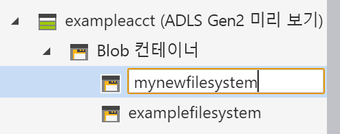

# Use Azure Storage Explorer with Azure Data Lake Storage Gen2

이 빠른 시작에서는 [Azure Storage Explorer](https://azure.microsoft.com/features/storage-explorer/)를 사용하여 디렉터리 및 Blob을 만드는 방법을 알아봅니다. 그런 다음, Blob을 로컬 컴퓨터로 다운로드하는 방법과 디렉터리의 모든 Blob을 보는 방법을 알아봅니다. 또한 Blob의 스냅샷을 만들고, 디렉터리 액세스 정책을 관리하고, 공유 액세스 서명을 만드는 방법을 알아봅니다.

## 전제 조건

[!INCLUDE [storage-quickstart-prereq-include](../../../includes/storage-quickstart-prereq-include.md)]

이 빠른 시작을 사용하려면 Azure Storage Explorer를 설치해야 합니다. Windows, Macintosh 또는 Linux용 Azure Storage Explorer를 설치하려면 [Azure Storage Explorer](https://azure.microsoft.com/features/storage-explorer/)를 참조하세요.

## Storage Explorer에 로그인

처음 시작하는 경우 **Microsoft Azure Storage Explorer - 연결** 창이 표시됩니다. Storage Explorer에서는 몇 가지 방법으로 스토리지 계정에 연결할 수 있지만, 현재는 ACL을 관리하는 한 가지 방법만 지원됩니다.

|작업|용도|
|---|---|
|Azure 계정 추가 | Azure에 인증하기 위해 조직 로그인 페이지로 리디렉션합니다. ACL을 관리하고 설정하려는 경우 현재 유일하게 지원되는 인증 방법입니다. |

Select **Add an Azure Account** and click **Sign in..** . Follow the on-screen prompts to sign into your Azure account.

작업이 완료되면 Azure Storage Explorer는 표시된 **탐색기** 탭을 로드합니다. 이 보기는 [Azure Storage 에뮬레이터](../common/storage-use-emulator.md?toc=%2fazure%2fstorage%2fblobs%2ftoc.json), [Cosmos DB](../../cosmos-db/storage-explorer.md?toc=%2fazure%2fstorage%2fblobs%2ftoc.json) 계정 또는 [Azure Stack](/azure-stack/user/azure-stack-storage-connect-se?toc=%2fazure%2fstorage%2fblobs%2ftoc.json) 환경을 통해 구성된 로컬 스토리지뿐만 아니라 모든 Azure Storage 계정에 대한 정보를 제공합니다.

## 컨테이너 만들기

Blob은 항상 디렉터리에 업로드됩니다. 컴퓨터의 폴더에서 파일을 구성하는 것처럼 컨테이너를 사용하여 Blob 그룹을 구성할 수 있습니다.

디렉터리를 만들려면 진행 단계에서 만든 스토리지 계정을 확장합니다. **Blob 컨테이너**를 선택하고, 마우스 오른쪽 단추로 클릭하여 **Blob 컨테이너 만들기**를 선택합니다. Enter the name for your container. When complete, press **Enter** to create the container. Blob 디렉터리가 성공적으로 만들어졌다면 선택한 스토리지 계정에 대해 **Blob 컨테이너** 폴더 아래에 표시됩니다.

## 디렉터리에 Blob 업로드

Blob Storage는 블록 Blob, 추가 Blob 및 페이지 Blob을 지원합니다. IaaS VM을 백업하는 데 사용된 VHD 파일은 페이지 Blob입니다. 추가 Blob은 파일에 쓰고 더 많은 정보를 계속해서 추가하려는 경우처럼 로깅에 사용됩니다. Blob Storage에 저장된 대부분의 파일은 블록 Blob입니다.

디렉터리 리본에서 **업로드**를 선택합니다. 이 작업에서는 폴더나 파일을 업로드할 수 있는 옵션이 제공됩니다.

업로드할 파일 또는 폴더를 선택합니다. **Blob 유형**을 선택합니다. 사용할 수 있는 선택 사항은 **추가**, **페이지** 또는 **블록** Blob입니다.

.vhd 또는 .vhdx 파일을 업로드하는 경우 **.vhd/.vhdx 파일을 페이지 blob으로 업로드(권장)** 를 선택합니다.

**폴더에 업로드(선택 사항)** 필드에서 디렉터리 아래 폴더에 파일 또는 폴더를 저장할 폴더 이름을 입력합니다. 폴더를 선택하지 않으면 파일이 디렉터리 바로 아래에 업로드됩니다.

**확인**을 선택하면 선택한 파일들이 업로드 대기 상태가 되고 파일 하나하나가 업로드됩니다. 업로드가 완료되면 결과가 **활동** 창에 표시됩니다.

## 디렉터리에서 Blob 보기

**Azure Storage Explorer** 애플리케이션에서 스토리지 계정 아래에 있는 디렉터리를 선택합니다. 기본 창에는 선택한 디렉터리의 Blob 목록이 표시됩니다.

## Blob 다운로드

**Azure Storage Explorer**에서 Blob을 선택하여 Blob을 다운로드하려면 리본에서 **다운로드**를 선택합니다. 파일 대화 상자가 열리면 파일 이름을 입력할 수 있습니다. **저장**을 선택하면 로컬 위치에 Blob 다운로드가 시작됩니다.

## 다음 단계

이 빠른 시작에서는 **Azure Storage Explorer**를 사용하여 로컬 디스크와 Azure Blob Storage 간에 파일을 전송하는 방법을 학습했습니다. 파일 및 디렉터리에 ACL을 설정하는 방법을 알아보려면 주제에 대한 방법을 계속 따르세요.

> [!div class="nextstepaction"]
> [파일 및 디렉터리에 대한 ACL을 설정하는 방법](data-lake-storage-how-to-set-permissions-storage-explorer.md)
