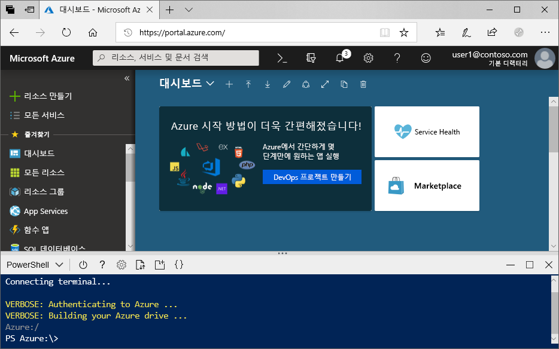

# <a name="create-an-azure-data-lake-storage-gen2-storage-account"></a>Azure Data Lake Storage Gen2 스토리지 계정 만들기

Azure Data Lake Storage Gen2는 HDFS(Hadoop 분산 파일 시스템)에서 작동하도록 조정된 네이티브 디렉터리 기반 컨테이너를 제공하는 [계층 구조 네임스페이스를 지원](data-lake-storage-introduction.md)합니다. HDFS에서 Data Lake Storage Gen2 데이터에 액세스하려면 [ABFS 드라이버](data-lake-storage-abfs-driver.md)를 통해 액세스할 수 있습니다.

This article demonstrates how to create an account using the Azure portal, Azure PowerShell, or via the Azure CLI.

## <a name="prerequisites"></a>전제 조건

Azure 구독이 아직 없는 경우 시작하기 전에 [체험 계정](https://azure.microsoft.com/free/)을 만듭니다. 

|           | 필수 조건 |
|-----------|--------------|
|포털     | 없음         |
|PowerShell | This article requires the PowerShell module Az.Storage version **0.7** or later. 현재 버전을 찾으려면 `Get-Module -ListAvailable Az.Storage` 명령을 실행합니다. 이 명령을 실행한 후에 결과가 나타나지 않거나 **0.7**보다 낮은 버전이 표시되는 경우에는 PowerShell 모듈을 업그레이드해야 합니다. 이 가이드의 [PowerShell 모듈 업그레이드](#upgrade-your-powershell-module) 섹션을 참조하세요.
|CLI        | Azure에 로그인하고 다음 두 방법 중 하나로 Azure CLI 명령을 실행할 수 있습니다. <ul><li>Azure Cloud Shell의 Azure Portal에서 CLI 명령 실행 </li><li>CLI를 설치하고 로컬에서 CLI 실행</li></ul>|

명령줄에서 작업하는 경우 Azure Cloud Shell을 실행하거나 CLI를 로컬로 설치하는 옵션이 제공됩니다.

### <a name="use-azure-cloud-shell"></a>Azure Cloud Shell 사용

Azure Cloud Shell은 Azure Portal에서 직접 실행할 수 있는 평가판 Bash 셸입니다. Azure CLI가 사전 설치되어 계정에서 사용하도록 구성되어 있습니다. Azure Portal 오른쪽 위에 있는 메뉴에서 **Cloud Shell** 버튼을 클릭합니다.

[](https://portal.azure.com)

The button launches an interactive shell that you can use to run the steps in this article:

[](https://portal.azure.com)

### <a name="install-the-cli-locally"></a>로컬에서 CLI 설치

Azure CLI를 로컬에서 설치하여 사용할 수도 있습니다. This article requires that you are running the Azure CLI version 2.0.38 or later. `az --version`을 실행하여 버전을 찾습니다. 설치 또는 업그레이드가 필요한 경우, [Azure CLI 설치](/cli/azure/install-azure-cli)를 참조하세요.

## <a name="create-a-storage-account-with-azure-data-lake-storage-gen2-enabled"></a>Data Lake Storage Gen2가 사용되는 스토리지 계정 만들기

Azure Storage 계정에는 Blob, 파일, 큐, 테이블, 디스크 등, 모든 Azure Storage 데이터 개체가 포함됩니다. The storage account provides a unique namespace for your Azure Storage data that is accessible from anywhere in the world over HTTP or HTTPS. Data in your Azure storage account is durable and highly available, secure, and massively scalable.

> [!NOTE]
> Data Lake Storage Gen2 기능을 활용하려면 새 스토리지 계정을 **StorageV2(범용 V2)** 유형으로 만들어야 합니다.  

스토리지 계정에 대한 자세한 내용은 [Azure Storage 계정 개요](../common/storage-account-overview.md)를 참조하세요.

## <a name="create-an-account-using-the-azure-portal"></a>Azure Portal을 사용하여 계정 만들기

[Azure portal](https://portal.azure.com)에 로그인합니다.

### <a name="create-a-storage-account"></a>스토리지 계정 만들기

모든 스토리지 계정은 Azure 리소스 그룹에 속해야 합니다. 리소스 그룹은 Azure 리소스를 그룹화하기 위한 논리적 컨테이너입니다. 스토리지 계정을 만들 때 새 리소스 그룹을 만들거나 기존 리소스 그룹을 사용할 수 있는 옵션이 있습니다. This article shows how to create a new resource group.

Azure Portal에서 범용 v2 스토리지 계정을 만들려면 다음 단계를 수행합니다.

> [!NOTE]
> 계층 구조 네임스페이스는 현재 모든 공용 영역에서 사용할 수 있습니다.

1. 스토리지 계정을 만들려는 구독을 선택합니다.
2. In the Azure portal, choose the **Create a resource** button, then choose **Storage account**.
3. **리소스 그룹** 필드 아래에서 **새로 만들기**를 선택합니다. Enter a name for your new resource group.
   
   리소스 그룹은 Azure 리소스를 그룹화하기 위한 논리적 컨테이너입니다. 스토리지 계정을 만들 때 새 리소스 그룹을 만들거나 기존 리소스 그룹을 사용할 수 있는 옵션이 있습니다.

4. 그런 다음, 스토리지 계정의 이름을 입력합니다. 선택하는 이름이 Azure에서 고유해야 합니다. 또한 이름의 길이가 3~24자여야 하고, 숫자 및 소문자만 포함할 수 있습니다.
5. 위치를 선택합니다.
6. Make sure that **StorageV2 (general purpose v2)** appears as selected in the **Account kind** drop-down list.
7. Optionally change the values in each of these fields: **Performance**, **Replication**, **Access tier**. To learn more about these options, see [Introduction to Azure Storage](https://docs.microsoft.com/azure/storage/common/storage-introduction#azure-storage-services).
8. Choose the **Advanced** tab.
10. **Data Lake Storage Gen2** 섹션에서 **계층적 네임스페이스**를 **사용**으로 설정합니다.
11. **검토 + 만들기**를 클릭하여 스토리지 계정을 만듭니다.

이제 포털을 통해 스토리지 계정이 만들어집니다.

### <a name="clean-up-resources"></a>리소스 정리

Azure Portal을 사용하여 리소스 그룹을 제거하려면

1. Azure Portal에서 왼쪽의 메뉴를 확장하여 서비스 메뉴를 열고 **리소스 그룹**을 선택하여 리소스 그룹 목록을 표시합니다.
2. 삭제할 리소스 그룹을 찾아 목록 오른쪽에 있는 **자세히** 단추( **...** )를 마우스 오른쪽 단추로 클릭합니다.
3. **리소스 그룹 삭제**를 선택하고 확인합니다.

## <a name="create-an-account-using-powershell"></a>PowerShell을 사용하여 계정 만들기

먼저 [PowerShellGet](/powershell/scripting/gallery/installing-psget) 모듈의 최신 버전을 설치합니다.

그런 다음, powershell 모듈을 업그레이드하고, Azure 구독에 로그인하고, 리소스 그룹을 만든 다음, 스토리지 계정을 만듭니다.

### <a name="upgrade-your-powershell-module"></a>PowerShell 모듈 업그레이드

[!INCLUDE [updated-for-az](../../../includes/updated-for-az.md)]

PowerShell을 사용하여 Data Lake Storage Gen2와 상호 작용하려면 모듈 Az.Storage 버전 **0.7** 이상을 설치해야 합니다.

관리자 권한으로 PowerShell 세션을 열어 시작합니다.

Az.Storage 모듈 설치

```powershell
Install-Module Az.Storage -Repository PSGallery -AllowClobber -Force
```

### <a name="sign-in-to-your-azure-subscription"></a>Azure 구독에 로그인합니다.

`Login-AzAccount` 명령을 사용하고 화면의 지시에 따라 인증합니다.

```powershell
Login-AzAccount
```

### <a name="create-a-resource-group"></a>리소스 그룹 만들기

PowerShell에서 새 리소스 그룹을 만들려면 [New-AzResourceGroup](/powershell/module/az.resources/new-azresourcegroup) 명령을 사용합니다. 

> [!NOTE]
> 계층 구조 네임스페이스는 현재 모든 공용 영역에서 사용할 수 있습니다.

```powershell
# put resource group in a variable so you can use the same group name going forward,
# without hardcoding it repeatedly
$resourceGroup = "storage-quickstart-resource-group"
$location = "westus2"
New-AzResourceGroup -Name $resourceGroup -Location $location
```

### <a name="create-a-general-purpose-v2-storage-account"></a>범용 v2 스토리지 계정 만들기

PowerShell에서 LRS(로컬 중복 스토리지)를 사용하여 범용 v2 스토리지 계정을 만들려면 [New-AzStorageAccount](/powershell/module/az.storage/New-azStorageAccount) 명령을 사용합니다.

```powershell
$location = "westus2"

New-AzStorageAccount -ResourceGroupName $resourceGroup `
  -Name "storagequickstart" `
  -Location $location `
  -SkuName Standard_LRS `
  -Kind StorageV2 `
  -EnableHierarchicalNamespace $True
```

### <a name="clean-up-resources"></a>리소스 정리

새 스토리지 계정을 포함하여 리소스 그룹 및 관련 리소스를 제거하려면 [Remove-AzResourceGroup](/powershell/module/az.resources/remove-azresourcegroup) 명령을 사용합니다. 

```powershell
Remove-AzResourceGroup -Name $resourceGroup
```

## <a name="create-an-account-using-azure-cli"></a>Azure CLI를 사용하여 계정 만들기

Azure Cloud Shell을 시작하려면 [Azure Portal](https://portal.azure.com)에 로그인합니다.

CLI의 로컬 설치에 로그인하려면 다음과 같은 로그인 명령을 실행합니다.

```cli
az login
```

### <a name="add-the-cli-extension-for-azure-data-lake-gen-2"></a>Azure Data Lake Gen2에 대한 CLI 확장 추가

CLI를 사용하여 Data Lake Storage Gen2와 상호 작용하려면 셸에 확장을 추가해야 합니다.

이렇게 하려면 Cloud Shell이나 로컬 셸을 사용하여 다음 명령을 입력합니다. `az extension add --name storage-preview`

### <a name="create-a-resource-group"></a>리소스 그룹 만들기

Azure CLI로 새 리소스 그룹을 만들려면 [az group create](/cli/azure/group) 명령을 사용합니다.

```azurecli-interactive
az group create `
    --name storage-quickstart-resource-group `
    --location westus2
```

> [!NOTE]
> > 계층 구조 네임스페이스는 현재 모든 공용 영역에서 사용할 수 있습니다.

### <a name="create-a-general-purpose-v2-storage-account"></a>범용 v2 스토리지 계정 만들기

Azure CLI에서 로컬 중복 스토리지를 사용하여 범용 v2 스토리지 계정을 만들려면 [az storage account create](/cli/azure/storage/account) 명령을 사용합니다.

```azurecli-interactive
az storage account create `
    --name storagequickstart `
    --resource-group storage-quickstart-resource-group `
    --location westus2 `
    --sku Standard_LRS `
    --kind StorageV2 `
    --hierarchical-namespace true
```

### <a name="clean-up-resources"></a>리소스 정리

새 스토리지 계정을 포함하여 리소스 그룹과 관련 리소스를 제거하려면 [az group delete](/cli/azure/group) 명령을 사용합니다.

```azurecli-interactive
az group delete --name myResourceGroup
```

## <a name="next-steps"></a>다음 단계

In this article, you've created a storage account with Data Lake Storage Gen2 capabilities. 스토리지 계정에서 Blob을 업로드 및 다운로드하는 방법을 알아보려면 다음 항목을 참조하세요.

* [AzCopy V10](https://docs.microsoft.com/azure/storage/common/storage-use-azcopy-v10?toc=%2fazure%2fstorage%2fblobs%2ftoc.json)
