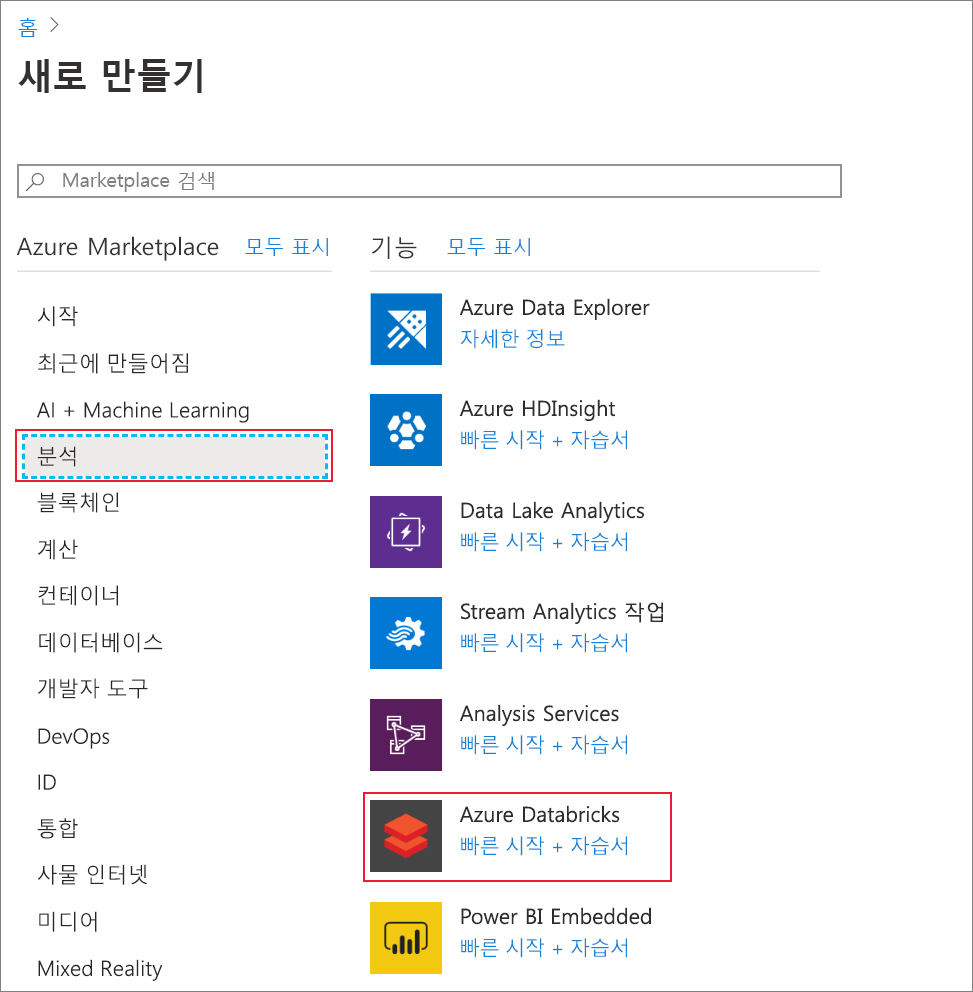
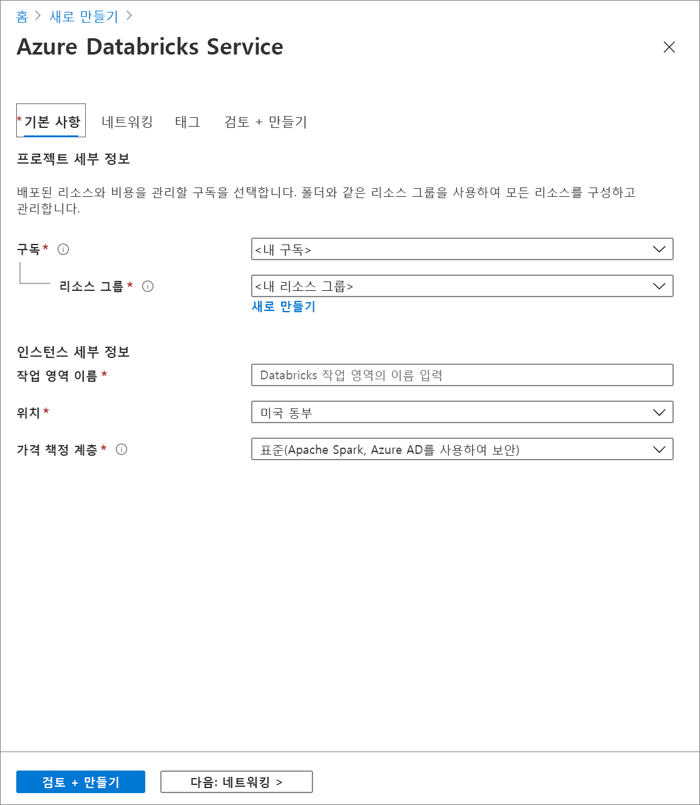
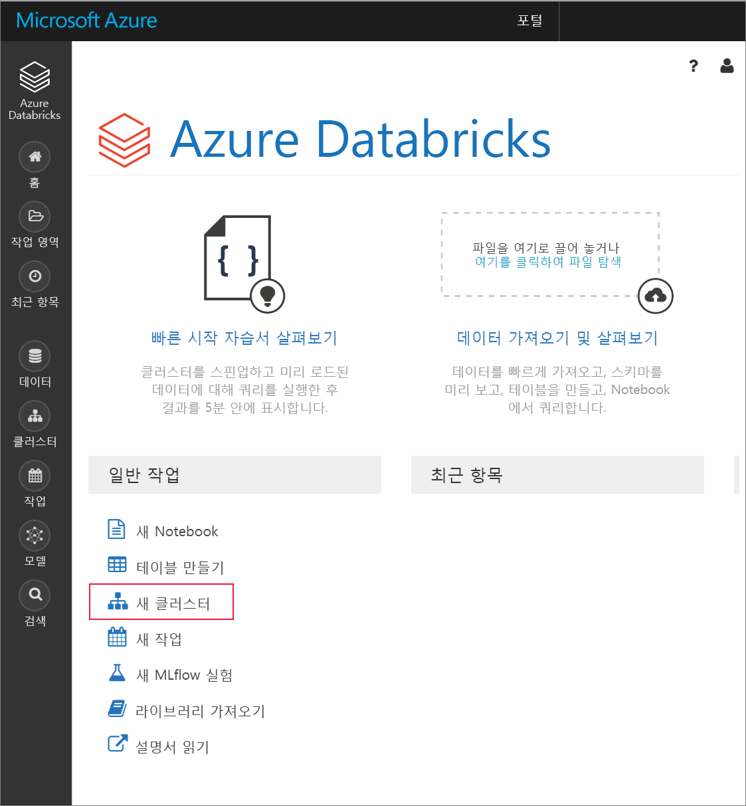
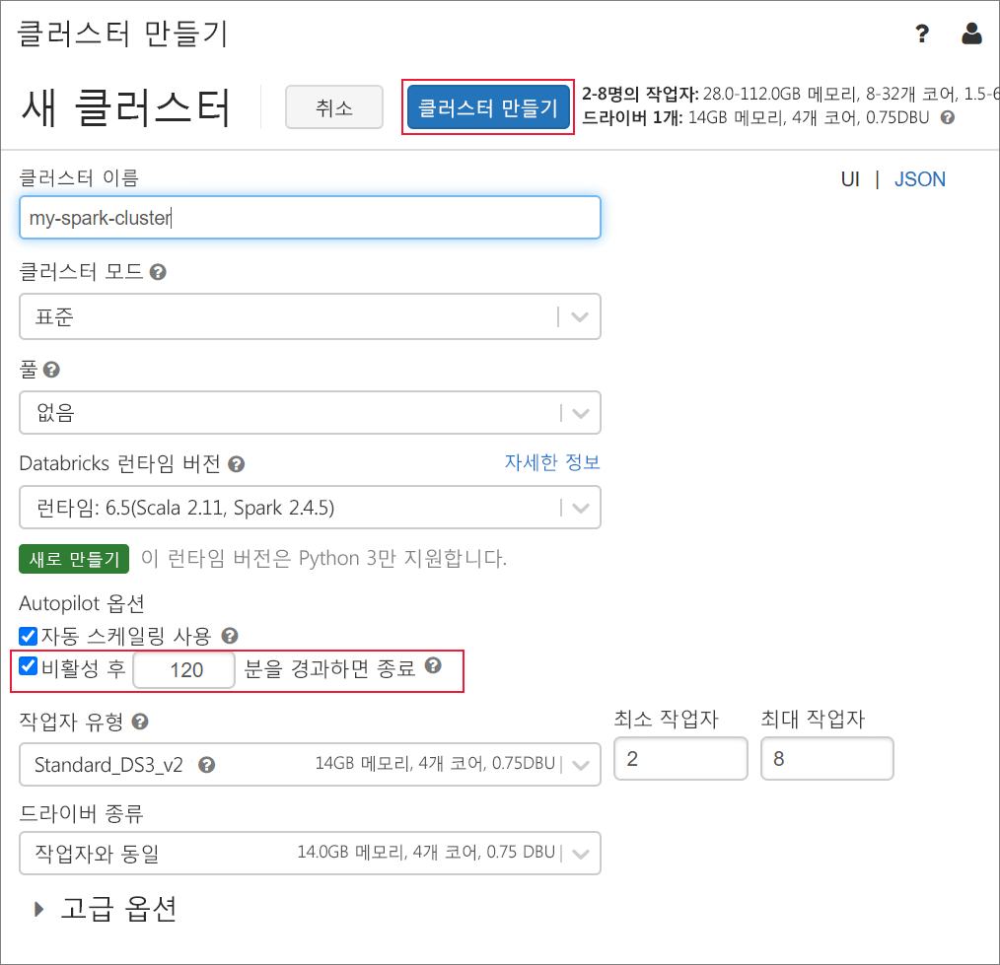
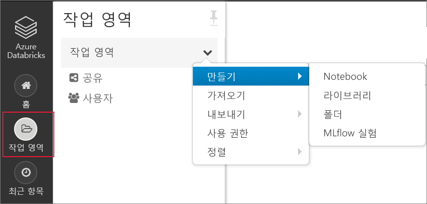
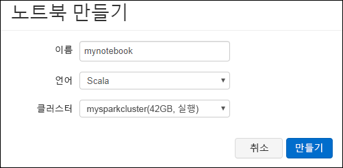
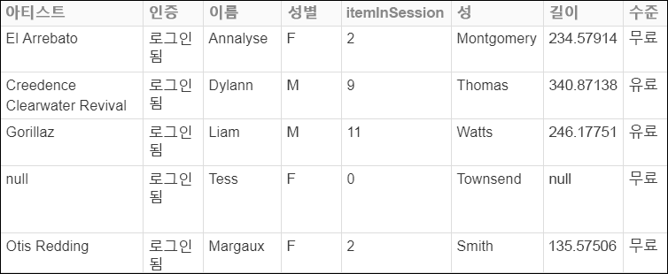
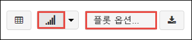
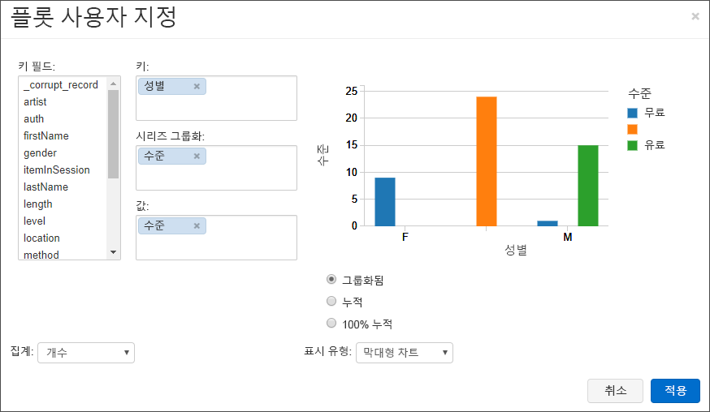
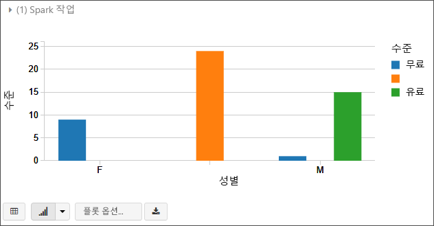

# <a name="quickstart-analyze-data-in-azure-data-lake-storage-gen2-by-using-azure-databricks"></a>빠른 시작: Azure Databricks를 사용하여 Azure Data Lake Storage Gen2의 데이터 분석

이 빠른 시작에서는 Azure Databricks를 사용하여 Apache Spark 작업을 실행함으로써 Azure Data Lake Storage Gen2가 사용되는 스토리지 계정에 저장된 데이터에 대한 분석을 수행하는 방법을 보여줍니다.

Spark 작업의 일부로, 라디오 채널 구독 데이터를 분석하여 인구 통계에 따른 체험/유료 사용에 대한 인사이트를 얻습니다.

Azure 구독이 아직 없는 경우 시작하기 전에 [체험](https://azure.microsoft.com/free/) 계정을 만듭니다.

## <a name="prerequisites"></a>필수 조건

* Data Lake Gen2 스토리지 계정을 만듭니다. [빠른 시작: Azure Data Lake Storage Gen2 스토리지 계정 만들기](data-lake-storage-quickstart-create-account.md)를 참조하세요.

  스토리지 계정의 이름을 텍스트 파일에 붙여넣습니다. 곧 필요하게 될 것입니다.

* 서비스 주체 만들기 [방법: 포털을 사용하여 리소스에 액세스할 수 있는 Azure AD 애플리케이션 및 서비스 주체 만들기](https://docs.microsoft.com/azure/active-directory/develop/howto-create-service-principal-portal)

  해당 문서의 단계를 수행할 때 해야 하는 두어 가지 항목이 있습니다.

  :heavy_check_mark: 문서의 [애플리케이션을 역할에 할당](https://docs.microsoft.com/azure/active-directory/develop/howto-create-service-principal-portal#assign-the-application-to-a-role) 섹션에 있는 단계를 수행할 때 **스토리지 Blob 데이터 기여자** 역할을 서비스 주체에 할당해야 합니다.

  > [!IMPORTANT]
  > 역할을 Data Lake Storage Gen2 스토리지 계정의 범위에 할당해야 합니다. 역할은 부모 리소스 그룹 또는 구독에 할당할 수 있지만, 이러한 역할 할당이 스토리지 계정에 전파될 때까지 권한 관련 오류가 발생합니다.

  :heavy_check_mark: 문서의 [로그인을 위한 값 가져오기](https://docs.microsoft.com/azure/active-directory/develop/howto-create-service-principal-portal#get-values-for-signing-in) 섹션에서 단계를 수행하는 경우 테넌트 ID, 앱 ID 및 암호 값을 텍스트 파일에 붙여넣습니다. 곧 이 값들이 필요합니다.

## <a name="create-an-azure-databricks-workspace"></a>Azure Databricks 작업 영역 만들기

이 섹션에서는 Azure Portal을 사용하여 Azure Databricks 작업 영역을 만듭니다.

1. Azure Portal에서 **리소스 만들기** > **분석** > **Azure Databricks**를 차례로 선택합니다.

    

2. **Azure Databricks 서비스** 아래에서 Databricks 작업 영역을 만들기 위한 값을 제공합니다.

    

    다음 값을 제공합니다.

    |자산  |설명  |
    |---------|---------|
    |**작업 영역 이름**     | Databricks 작업 영역의 이름을 제공합니다.        |
    |**구독**     | 드롭다운에서 Azure 구독을 선택합니다.        |
    |**리소스 그룹**     | 새 리소스 그룹을 만들지, 아니면 기존 그룹을 사용할지 여부를 지정합니다. 리소스 그룹은 Azure 솔루션에 관련된 리소스를 보유하는 컨테이너입니다. 자세한 내용은 [Azure Resource Manager 개요](../../azure-resource-manager/resource-group-overview.md)를 참조하세요. |
    |**위치**:     | **미국 서부 2**를 선택합니다. 원하는 경우 다른 공용 영역을 자유롭게 선택합니다.        |
    |**가격 책정 계층**     |  **표준** 또는 **프리미엄** 중에서 선택합니다. 이러한 계층에 대한 자세한 내용은 [Databricks 가격 페이지](https://azure.microsoft.com/pricing/details/databricks/)를 참조하세요.       |

3. 계정 생성에는 몇 분 정도가 소요됩니다. 작업 상태를 모니터링하려면 맨 위에 있는 진행률 표시줄을 확인합니다.

4. **대시보드에 고정**을 선택한 다음, **만들기**를 선택합니다.

## <a name="create-a-spark-cluster-in-databricks"></a>Databricks에서 Spark 클러스터 만들기

1. Azure Portal에서 사용자가 만든 Databricks 작업 영역으로 이동한 다음, **작업 영역 시작**을 선택합니다.

2. Azure Databricks 포털로 리디렉션됩니다. 포털에서 **새로 만들기** > **클러스터**를 차례로 선택합니다.

    

3. **새 클러스터** 페이지에서 값을 제공하여 클러스터를 만듭니다.

    

    다음 항목 이외의 다른 모든 기본값을 허용합니다.

    * 클러스터의 이름을 입력합니다.
    * **5.1** 런타임을 사용하여 클러스터를 만듭니다.
    * **Terminate after 120 minutes of inactivity**(비활성 120분 후 종료) 확인란을 선택했는지 확인합니다. 클러스터를 사용하지 않는 경우 클러스터를 종료하는 기간(분)을 제공합니다.

4. **클러스터 만들기**를 선택합니다. 클러스터가 실행되면 노트북을 클러스터에 첨부하고 Spark 작업을 실행할 수 있습니다.

클러스터를 만드는 방법에 대한 자세한 내용은 [Azure Databricks에서 Spark 클러스터 만들기](https://docs.azuredatabricks.net/user-guide/clusters/create.html)를 참조하세요.

## <a name="create-storage-account-file-system"></a>저장소 계정 파일 시스템 만들기

이 섹션에서는 Azure Databricks 작업 영역에서 노트북을 만든 다음, 코드 조각을 실행하여 저장소 계정을 구성합니다.

1. [Azure Portal](https://portal.azure.com)에서, 앞에서 만든 Databricks 작업 영역으로 이동한 후 **작업 영역 시작**을 선택합니다.

2. 왼쪽 창에서 **작업 영역**을 선택합니다. **작업 영역** 드롭다운에서 **만들기** > **Notebook**을 차례로 선택합니다.

    

3. **노트북 만들기** 대화 상자에서 노트북 이름을 입력합니다. 언어로 **Scala**를 선택한 다음, 앞에서 만든 Spark 클러스터를 선택합니다.

    

    **만들기**를 선택합니다.

4. 다음 코드 블록을 복사하여 첫 번째 셀에 붙여넣습니다. 하지만 이 코드를 아직 실행하지 마십시오.

   ```scala
   spark.conf.set("fs.azure.account.auth.type.<storage-account-name>.dfs.core.windows.net", "OAuth")
   spark.conf.set("fs.azure.account.oauth.provider.type.<storage-account-name>.dfs.core.windows.net", "org.apache.hadoop.fs.azurebfs.oauth2.ClientCredsTokenProvider")
   spark.conf.set("fs.azure.account.oauth2.client.id.<storage-account-name>.dfs.core.windows.net", "<appID>")
   spark.conf.set("fs.azure.account.oauth2.client.secret.<storage-account-name>.dfs.core.windows.net", "<password>")
   spark.conf.set("fs.azure.account.oauth2.client.endpoint.<storage-account-name>.dfs.core.windows.net", "https://login.microsoftonline.com/<tenant-id>/oauth2/token")
   spark.conf.set("fs.azure.createRemoteFileSystemDuringInitialization", "true")
   dbutils.fs.ls("abfss://<file-system-name>@<storage-account-name>.dfs.core.windows.net/")
   spark.conf.set("fs.azure.createRemoteFileSystemDuringInitialization", "false")

   ```

    > [!NOTE]
    > 이 코드 블록은 OAuth를 사용하여 Data Lake Gen2 엔드포인트에 직접 액세스하지만 Data Lake Storage Gen2 계정에 Databricks 작업 영역을 연결하는 다른 방법이 있습니다. 예를 들어 OAuth를 사용하여 파일 시스템을 탑재하거나 공유 키로 직접 액세스를 사용할 수 있습니다. <br>이러한 방법의 예제를 보려면 Azure Databricks 웹 사이트에서 [Azure Data Lake Storage Gen2](https://docs.azuredatabricks.net/spark/latest/data-sources/azure/azure-datalake-gen2.html) 문서를 참조하세요.

5. 이 코드 블록에서 `storage-account-name`, `appID`, `password` 및 `tenant-id` 자리 표시자 값을 서비스 주체를 만들 때 수집한 값으로 바꿉니다. `file-system-name` 자리 표시자 값을 파일 시스템에 제공하려는 이름으로 설정합니다.

    > [!NOTE]
    > 프로덕션 설정에서 Azure Databricks에서 인증 키를 저장하는 것이 좋습니다. 그런 다음, 인증 키 대신 코드 블록에 조회 키를 추가합니다. 이 빠른 시작을 완료했으면 Azure Databricks 웹 사이트에서 [Azure Data Lake Storage Gen2](https://docs.azuredatabricks.net/spark/latest/data-sources/azure/azure-datalake-gen2.html) 문서에서 이 방법에 대한 예제를 살펴보세요.

6. 이 블록에서 코드를 실행하려면 **SHIFT + ENTER** 키를 누릅니다.

## <a name="ingest-sample-data"></a>샘플 데이터 수집

이 섹션을 시작하기 전에 다음 필수 구성 요소를 완료해야 합니다.

노트북 셀에 다음 코드를 입력합니다.

    %sh wget -P /tmp https://raw.githubusercontent.com/Azure/usql/master/Examples/Samples/Data/json/radiowebsite/small_radio_json.json

셀에서 **Shift+Enter**를 눌러 코드를 실행합니다.

이제 이 아래에 있는 새 셀에서 다음 코드를 입력하고 괄호에 나타나는 값을 이전에 사용한 동일한 값으로 바꿉니다.

    dbutils.fs.cp("file:///tmp/small_radio_json.json", "abfss://<file-system>@<account-name>.dfs.core.windows.net/")

셀에서 **Shift+Enter**를 눌러 코드를 실행합니다.

## <a name="run-a-spark-sql-job"></a>Spark SQL 작업 실행

다음 작업을 수행하여 데이터에 대한 Spark SQL 작업을 실행합니다.

1. SQL 문을 실행하여 샘플 JSON 데이터 파일인 **small_radio_json.json**의 데이터를 사용하여 임시 테이블을 만듭니다. 다음 코드 조각에서 자리 표시자 값을 파일 시스템 이름 및 저장소 계정 이름으로 바꿉니다. 앞에서 만든 노트북을 사용하여 노트북의 새 코드 셀에 코드 조각을 붙여넣은 다음, SHIFT+ENTER를 누릅니다.

    ```sql
    %sql
    DROP TABLE IF EXISTS radio_sample_data;
    CREATE TABLE radio_sample_data
    USING json
    OPTIONS (
     path  "abfss://<file-system-name>@<storage-account-name>.dfs.core.windows.net/<PATH>/small_radio_json.json"
    )
    ```

    명령이 성공적으로 완료되면 JSON 파일의 모든 데이터가 Databricks 클러스터에 테이블로 저장됩니다.

    `%sql` 언어 magic 명령을 사용하면 노트북이 다른 유형인 경우에도 노트북에서 SQL 코드를 실행할 수 있습니다. 자세한 내용은 [노트북에서 언어 혼합](https://docs.azuredatabricks.net/user-guide/notebooks/index.html#mixing-languages-in-a-notebook)을 참조하세요.

2. 사용자가 실행하는 쿼리를 더 잘 이해할 수 있도록 샘플 JSON 데이터의 스냅샷을 살펴보겠습니다. 코드 셀에 다음 코드 조각을 붙여넣은 다음 **SHIFT + ENTER**를 누릅니다.

    ```sql
    %sql
    SELECT * from radio_sample_data
    ```

3. 다음 스크린샷과 같이 테이블 형식으로 출력됩니다(일부 열만 표시됨).

    

    기타 세부 사항 중 샘플 데이터는 라디오 채널(열 이름, **성별**)의 청중의 성별과 구독이 무료 또는 유료(열 이름, **수준**)인지 여부를 캡처합니다.

4. 이제 이 데이터를 시각적으로 표현하여 각 성별, 무료 계정을 가진 사용자 수 및 유료 구독자 수를 보여줍니다. 테이블 형식 출력 하단에서 **가로 막대형 차트** 아이콘을 클릭한 다음 **플롯 옵션**을 클릭합니다.

    

5. **사용자 지정 플롯**에서 스크린샷에 표시된 것과 같이 값을 끌어서 놓습니다.

    

    - **키**를 **성별**로 설정합니다.
    - **시계열 그룹화**를 **수준**으로 설정합니다.
    - **값**을 **수준**으로 설정합니다.
    - **집계**를 **COUNT**로 설정합니다.

6. **적용**을 클릭합니다.

7. 출력은 다음 스크린샷에 표시된 것처럼 시각적인 표시를 보여줍니다.

     

## <a name="clean-up-resources"></a>리소스 정리

이 문서가 완료되면 클러스터를 종료할 수 있습니다. Azure Databricks 작업 영역에서 **클러스터**를 선택하고, 종료하려는 클러스터를 찾습니다. **작업** 열 아래의 줄임표 위를 마우스 커서로 가리키고 **종료** 아이콘을 선택합니다.


클러스터를 수동으로 종료하지 않으면 클러스터를 만드는 중에 **Terminate after \_\_ minutes of inactivity**(비활성 __분 후 종료) 확인란을 선택한 경우 클러스터가 자동으로 중지됩니다. 이 옵션을 설정하면 클러스터가 지정된 시간 동안 비활성 상태가 된 후에 클러스터가 중지됩니다.

## <a name="next-steps"></a>다음 단계

이 문서에서는 Azure Databricks에서 Spark 클러스터를 만들고, Data Lake Storage Gen2가 사용되는 스토리지 계정의 데이터를 사용하여 Spark 작업을 실행했습니다. 또한 [Spark 데이터 소스](https://docs.azuredatabricks.net/spark/latest/data-sources/index.html)를 보고 다른 데이터 소스의 데이터를 Azure Databricks로 가져오는 방법을 배울 수 있습니다. Azure Databricks를 사용하여 ETL 작업(데이터 추출, 변환 및 로드)을 수행하는 방법을 알아보려면 다음 문서로 이동합니다.

> [!div class="nextstepaction"]
>[Azure Databricks를 사용하여 데이터 추출, 변환 및 로드](../../azure-databricks/databricks-extract-load-sql-data-warehouse.md)
