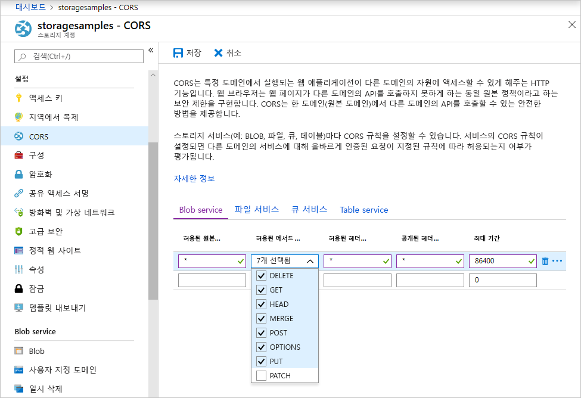

<!-- Customer intent: As a web application developer I want to interface with Azure Blob storage entirely on the client so that I can build a SPA application that is able to upload and delete files on blob storage. -->

# <a name="quickstart-manage-blobs-with-javascript-v12-sdk-in-a-browser"></a>빠른 시작: 브라우저에서 JavaScript v12 SDK를 사용하여 Blob 관리

Azure Blob 스토리지는 대량의 비정형 데이터를 저장하도록 최적화되어 있습니다. Blob은 이미지, 문서, 스트리밍 미디어 및 보관 데이터를 포함하여 텍스트 또는 이진 데이터를 저장할 수 있는 개체입니다. 이 빠른 시작에서는 브라우저에서 JavaScript를 사용하여 Blob을 관리하는 방법에 대해 알아봅니다. Blob을 업로드하여 나열하고, 컨테이너를 만들고 삭제합니다.

추가 리소스:

* [API 참조 설명서](/javascript/api/@azure/storage-blob)
* [라이브러리 소스 코드](https://github.com/Azure/azure-sdk-for-js/tree/master/sdk/storage/storage-blob)
* [패키지(npm)](https://www.npmjs.com/package/@azure/storage-blob)
* [샘플](https://docs.microsoft.com/azure/storage/common/storage-samples-javascript?toc=%2fazure%2fstorage%2fblobs%2ftoc.json#blob-samples)

## <a name="prerequisites"></a>필수 구성 요소

* [활성 구독이 있는 Azure 계정](https://azure.microsoft.com/free/?ref=microsoft.com&utm_source=microsoft.com&utm_medium=docs&utm_campaign=visualstudio)
* [Azure Storage 계정](../common/storage-account-create.md)
* [Node.JS](https://nodejs.org)
* [Microsoft Visual Studio Code](https://code.visualstudio.com)
* 브라우저 디버깅을 위한 Visual Studio Code 확장은 다음과 같습니다.
    * [Microsoft Edge용 디버거](https://marketplace.visualstudio.com/items?itemName=msjsdiag.debugger-for-edge)
    * [Chrome용 디버거](https://marketplace.visualstudio.com/items?itemName=msjsdiag.debugger-for-chrome)
    * [Firefox용 디버거](https://marketplace.visualstudio.com/items?itemName=firefox-devtools.vscode-firefox-debug)


[!INCLUDE [storage-multi-protocol-access-preview](../../../includes/storage-multi-protocol-access-preview.md)]

## <a name="object-model"></a>개체 모델

Blob Storage는 다음 세 가지 유형의 리소스를 제공합니다.

* 스토리지 계정
* 스토리지 계정의 컨테이너
* 컨테이너의 blob

다음 다이어그램에서는 이러한 리소스 간의 관계를 보여줍니다.


이 빠른 시작에서는 다음 JavaScript 클래스를 사용하여 이러한 리소스와 상호 작용합니다.

* [BlobServiceClient](/javascript/api/@azure/storage-blob/blobserviceclient): `BlobServiceClient` 클래스를 사용하여 Azure Storage 리소스 및 blob 컨테이너를 조작할 수 있습니다.
* [ContainerClient](/javascript/api/@azure/storage-blob/containerclient): `ContainerClient` 클래스를 사용하여 Azure Storage 컨테이너 및 해당 blob을 조작할 수 있습니다.
* [BlockBlobClient](/javascript/api/@azure/storage-blob/blockblobclient): `BlockBlobClient` 클래스를 사용하여 Azure Storage blob을 조작할 수 있습니다.

## <a name="setting-up"></a>설치

이 섹션에서는 JavaScript용 Azure Blob 스토리지 클라이언트 라이브러리 v12를 사용하는 프로젝트를 준비합니다.

### <a name="create-a-cors-rule"></a>CORS 규칙 만들기

웹 애플리케이션에서 클라이언트의 Blob 스토리지에 액세스하려면 [CORS(원본 간 리소스 공유)](https://docs.microsoft.com/rest/api/storageservices/cross-origin-resource-sharing--cors--support-for-the-azure-storage-services)를 사용하도록 계정을 구성해야 합니다.

Azure Portal에서 스토리지 계정을 선택합니다. 새 CORS 규칙을 정의하려면 **설정** 섹션으로 이동하여 **CORS**를 선택합니다. 이 빠른 시작의 경우 공개 CORS 규칙을 만듭니다.



다음 표에서는 각 CORS 설정을 설명하고 규칙을 정의하는 데 사용되는 값을 설명합니다.

|설정  |값  | Description |
|---------|---------|---------|
| **허용된 원본** | **\*** | 허용 가능한 원본으로 설정된 도메인의 쉼표로 구분된 목록을 허용합니다. 값을 `*`로 설정하면 스토리지 계정에 대한 모든 도메인 액세스가 허용됩니다. |
| **허용된 메서드** | **DELETE**, **GET**, **HEAD**, **MERGE**, **POST**, **OPTIONS** 및 **PUT** | 스토리지 계정에 대해 실행하도록 허용된 HTTP 동사를 나열합니다. 이 빠른 시작에서는 사용 가능한 옵션을 모두 선택합니다. |
| **허용된 헤더** | **\*** | 스토리지 계정에서 허용하는 요청 헤더(접두 헤더 포함)의 목록을 정의합니다. 값을 `*`로 설정하면 모든 헤더에 액세스할 수 있습니다. |
| **노출된 헤더** | **\*** | 계정에서 허용되는 응답 헤더를 나열합니다. 값을 `*`로 설정하면 계정에서 모든 헤더를 보낼 수 있습니다. |
| **최대 기간** | **86400** | 브라우저에서 실행 전 OPTIONS 요청을 캐시하는 최대 시간(초)입니다. 값이 *86400*이면 하루 동안 캐시를 유지할 수 있습니다. |

필드가 이 표의 값으로 채워지면 **저장** 단추를 클릭합니다.

> [!IMPORTANT]
> 프로덕션 환경에서 사용하는 모든 설정이 보안 액세스를 유지하기 위해 스토리지 계정에 필요한 최소한의 액세스 권한을 공개하는지 확인하세요. 여기에 설명된 CORS 설정은 관대한 보안 정책을 정의하므로 빠른 시작에 적합합니다. 하지만 이러한 설정은 실제 컨텍스트에서는 적합하지 않습니다.

### <a name="create-a-shared-access-signature"></a>공유 액세스 서명 만들기

SAS(공유 액세스 서명)는 브라우저에서 실행되는 코드에서 Azure Blob 스토리지 요청에 권한을 부여하는 데 사용됩니다. SAS를 사용하면 클라이언트는 계정 액세스 키 또는 연결 문자열 없이 스토리지 리소스에 대한 액세스 권한을 부여할 수 있습니다. SAS에 대한 자세한 내용은 [SAS(공유 액세스 서명) 사용](../common/storage-sas-overview.md)을 참조하세요.

다음 단계에 따라 Blob service SAS URL을 가져옵니다.

1. Azure Portal에서 스토리지 계정을 선택합니다.
2. **설정** 섹션으로 이동하여 **공유 액세스 서명**을 선택합니다.
3. 아래로 스크롤하여 **SAS 및 연결 문자열 생성** 단추를 클릭합니다.
4. 더 아래로 스크롤하여 **Blob service SAS URL** 필드를 찾습니다.
5. **Blob service SAS URL** 필드의 오른쪽 끝에 있는 **클립보드에 복사** 단추를 클릭합니다.
6. 이후 단계에서 사용할 수 있도록 복사된 URL을 어딘가에 저장합니다.

### <a name="add-the-azure-blob-storage-client-library"></a>Azure Blob 스토리지 클라이언트 라이브러리 추가

로컬 컴퓨터에서 *azure-blobs-js-browser*라는 새 폴더를 만들고 Visual Studio Code에서 엽니다.

**보기 > 터미널**을 차례로 선택하여 Visual Studio Code 내에서 콘솔 창을 엽니다. 터미널 창에서 다음 Node.js 패키지 관리자(npm) 명령을 실행하여 [package.json](https://docs.npmjs.com/files/package.json) 파일을 만듭니다.

```console
npm init -y
```

Azure SDK는 여러 개별 패키지로 구성되어 있습니다. 사용하려는 서비스에 따라 필요한 패키지를 선택할 수 있습니다. 터미널 창에서 다음 `npm` 명령을 실행하여 `@azure/storage-blob` 패키지를 설치합니다.

```console
npm install --save @azure/storage-blob
```

#### <a name="bundle-the-azure-blob-storage-client-library"></a>Azure Blob 스토리지 클라이언트 라이브러리 번들

웹 사이트에서 Azure SDK 라이브러리를 사용하려면 브라우저 내에서 작동하도록 코드를 변환합니다. 이 작업은 번들러라는 도구를 사용하여 수행합니다. 번들은 [Node.js](https://nodejs.org) 규칙을 사용하여 작성된 JavaScript 코드를 사용하여 브라우저에서 인식하는 형식으로 변환합니다. 이 빠른 시작 문서에서는 [Parcel](https://parceljs.org/) 번들러를 사용합니다.

터미널 창에서 다음 `npm` 명령을 실행하여 Parcel을 설치합니다.

```console
npm install -g parcel-bundler
```

Visual Studio Code에서 *package.json* 파일을 열고, `license` 및 `dependencies` 항목 사이에 `browserlist`를 추가합니다. 이 `browserlist`는 인기 있는 세 브라우저의 최신 버전을 대상으로 합니다. 이제 전체 *package.json* 파일은 다음과 같습니다.

:::code language="json" source="~/azure-storage-snippets/blobs/quickstarts/JavaScript/V12/azure-blobs-js-browser/package.json" highlight="12-16":::

*package.json* 파일을 저장합니다.

### <a name="import-the-azure-blob-storage-client-library"></a>Azure Blob 스토리지 클라이언트 라이브러리 가져오기

JavaScript 내에서 Azure SDK 라이브러리를 사용하려면 `@azure/storage-blob` 패키지를 가져옵니다. Visual Studio Code에서 다음 JavaScript 코드가 포함된 새 파일을 만듭니다.

:::code language="javascript" source="~/azure-storage-snippets/blobs/quickstarts/JavaScript/V12/azure-blobs-js-browser/index.js" id="snippet_ImportLibrary":::

파일을 *index.js*로 *azure-blobs-js-browser* 디렉터리에 저장합니다.

### <a name="implement-the-html-page"></a>HTML 페이지 구현

Visual Studio Code에서 새 파일을 만들고 다음 HTML 코드를 추가합니다.

:::code language="html" source="~/azure-storage-snippets/blobs/quickstarts/JavaScript/V12/azure-blobs-js-browser/index.html":::

파일을 *index.html*로 *azure-blobs-js-browser* 디렉터리에 저장합니다.

## <a name="code-examples"></a>코드 예제

코드 예제에서는 JavaScript용 Azure Blob 스토리지 클라이언트 라이브러리를 사용하여 다음 작업을 수행하는 방법을 보여 줍니다.

* [UI 요소에 대한 필드 선언](#declare-fields-for-ui-elements)
* [스토리지 계정 정보 추가](#add-your-storage-account-info)
* [클라이언트 개체 만들기](#create-client-objects)
* [스토리지 컨테이너 만들기 및 삭제](#create-and-delete-a-storage-container)
* [Blob 나열](#list-blobs)
* [Blob 업로드](#upload-blobs)
* [Blob 삭제](#delete-blobs)

모든 코드 조각이 *index.js* 파일에 추가되면 코드를 실행합니다.

### <a name="declare-fields-for-ui-elements"></a>UI 요소에 대한 필드 선언

다음 코드를 *index.js* 파일의 끝에 추가합니다.

:::code language="JavaScript" source="~/azure-storage-snippets/blobs/quickstarts/JavaScript/V12/azure-blobs-js-browser/index.js" id="snippet_DeclareVariables":::

*index.js* 파일을 저장합니다.

이 코드는 각 HTML 요소에 대한 필드를 선언하고, 출력을 표시하는 `reportStatus` 함수를 구현합니다.

다음 섹션에서는 이전 블록 뒤에 새 JavaScript 코드 블록을 추가합니다.

### <a name="add-your-storage-account-info"></a>스토리지 계정 정보 추가

스토리지 계정에 액세스하는 코드를 추가합니다. 자리 표시자를 이전에 생성한 Blob service SAS URL로 바꿉니다. 다음 코드를 *index.js* 파일의 끝에 추가합니다.

:::code language="javascript" source="~/azure-storage-snippets/blobs/quickstarts/JavaScript/V12/azure-blobs-js-browser/index.js" id="snippet_StorageAcctInfo":::

*index.js* 파일을 저장합니다.

### <a name="create-client-objects"></a>클라이언트 개체 만들기

Azure Blob 스토리지 서비스와 상호 작용하기 위한 [BlobServiceClient](/javascript/api/@azure/storage-blob/blobserviceclient) 및 [ContainerClient](/javascript/api/@azure/storage-blob/containerclient) 개체를 만듭니다. 다음 코드를 *index.js* 파일의 끝에 추가합니다.

:::code language="javascript" source="~/azure-storage-snippets/blobs/quickstarts/JavaScript/V12/azure-blobs-js-browser/index.js" id="snippet_CreateClientObjects":::

*index.js* 파일을 저장합니다.

### <a name="create-and-delete-a-storage-container"></a>스토리지 컨테이너 만들기 및 삭제

웹 페이지에서 해당 단추를 클릭하면 스토리지 컨테이너를 만들고 삭제합니다. 다음 코드를 *index.js* 파일의 끝에 추가합니다.

:::code language="javascript" source="~/azure-storage-snippets/blobs/quickstarts/JavaScript/V12/azure-blobs-js-browser/index.js" id="snippet_CreateDeleteContainer":::

*index.js* 파일을 저장합니다.

### <a name="list-blobs"></a>Blob 나열

**파일 나열** 단추를 클릭하면 스토리지 컨테이너의 콘텐츠를 나열합니다. 다음 코드를 *index.js* 파일의 끝에 추가합니다.

:::code language="javascript" source="~/azure-storage-snippets/blobs/quickstarts/JavaScript/V12/azure-blobs-js-browser/index.js" id="snippet_ListBlobs":::

*index.js* 파일을 저장합니다.

이 코드는 [ContainerClient.listBlobsFlat](/javascript/api/@azure/storage-blob/containerclient#listblobsflat-containerlistblobsoptions-) 함수를 호출한 다음, 반복기를 사용하여 반환된 각 [BlobItem](/javascript/api/@azure/storage-blob/blobitem)의 이름을 검색합니다. 각 `BlobItem`에 대해 **Files** 목록을 [name](/javascript/api/@azure/storage-blob/blobitem#name) 속성 값으로 업데이트합니다.

### <a name="upload-blobs"></a>Blob 업로드

**파일 선택 및 업로드** 단추를 클릭하면 파일을 스토리지 컨테이너에 업로드합니다. 다음 코드를 *index.js* 파일의 끝에 추가합니다.

:::code language="javascript" source="~/azure-storage-snippets/blobs/quickstarts/JavaScript/V12/azure-blobs-js-browser/index.js" id="snippet_UploadBlobs":::

*index.js* 파일을 저장합니다.

이 코드는 **선택 및 업로드 파일** 단추를 숨겨진 `file-input` 요소에 연결합니다. 단추 `click` 이벤트에서 파일 입력 `click` 이벤트를 트리거하고 파일 선택기를 표시합니다. 파일을 선택하고 대화 상자를 닫으면 `input` 이벤트가 발생하고 `uploadFiles` 함수가 호출됩니다. 이 함수는 [BlockBlobClient](/javascript/api/@azure/storage-blob/blockblobclient) 개체를 만든 다음, 선택한 각 파일에 대해 브라우저 전용 [uploadBrowserData](/javascript/api/@azure/storage-blob/blockblobclient#uploadbrowserdata-blob---arraybuffer---arraybufferview--blockblobparalleluploadoptions-) 함수를 호출합니다. 각 호출에서 `Promise`를 반환합니다. 모두 함께 대기할 수 있도록 각 `Promise`가 목록에 추가됩니다. 그러면 파일이 병렬로 업로드됩니다.

### <a name="delete-blobs"></a>Blob 삭제

**선택한 파일 삭제** 단추를 클릭하면 스토리지 컨테이너에서 파일을 삭제합니다. 다음 코드를 *index.js* 파일의 끝에 추가합니다.

:::code language="javascript" source="~/azure-storage-snippets/blobs/quickstarts/JavaScript/V12/azure-blobs-js-browser/index.js" id="snippet_DeleteBlobs":::

*index.js* 파일을 저장합니다.

이 코드는 목록에서 선택한 각 파일을 제거하는 [ContainerClient.deleteBlob](/javascript/api/@azure/storage-blob/containerclient#deleteblob-string--blobdeleteoptions-) 함수를 호출합니다. 그런 다음, 앞에서 표시된 `listFiles` 함수를 호출하여 **Files** 목록의 내용을 새로 고칩니다.

## <a name="run-the-code"></a>코드 실행

코드를 Visual Studio Code 디버거 내에서 실행하려면 브라우저에 대한 *launch.json* 파일을 구성합니다.

### <a name="configure-the-debugger"></a>디버거 구성

Visual Studio Code에서 디버거 확장을 설정하려면 다음을 수행합니다.

1. **실행 > 구성 추가**를 차례로 선택합니다.
2. 이전의 [사전 요구 사항](#prerequisites) 섹션에서 설치한 확장에 따라 **Edge**, **Chrome** 또는 **Firefox**를 선택합니다.

새 구성을 추가하면 *launch.json* 파일이 만들어지고 편집기에서 열립니다. 다음과 같이 `url` 값이 `http://localhost:1234/index.html`이 되도록 *launch.json* 파일을 수정합니다.

:::code language="json" source="~/azure-storage-snippets/blobs/quickstarts/JavaScript/V12/azure-blobs-js-browser/.vscode/launch.json" highlight="11":::

업데이트되면 *launch.json* 파일을 저장합니다. 이 구성은 열려는 브라우저와 로드할 URL을 Visual Studio Code에 알려줍니다.

### <a name="launch-the-web-server"></a>웹 서버 시작

로컬 개발 웹 서버를 시작하려면 **보기 > 터미널**을 차례로 선택하여 Visual Studio Code 내에서 콘솔 창을 열고, 다음 명령을 입력합니다.

```console
parcel index.html
```

Parcel에서 코드를 번들로 묶고 `http://localhost:1234/index.html`의 페이지에 대한 로컬 개발 서버를 시작합니다. *index.js*에서 변경한 내용은 파일을 저장할 때마다 자동으로 빌드되어 개발 서버에 반영됩니다.

**구성된 1234 포트를 사용할 수 없습니다.** 라는 메시지가 표시되면 `parcel -p <port#> index.html` 명령을 실행하여 포트를 변경할 수 있습니다. *launch.json* 파일에서 일치하도록 URL 경로의 포트를 업데이트합니다.

### <a name="start-debugging"></a>디버그 시작

디버거에서 페이지를 실행하고, Blob 스토리지의 작동 방식을 확인합니다. 오류가 발생하면 웹 페이지의 **상태** 창에 수신된 오류 메시지가 표시됩니다.

Visual Studio Code 디버거가 연결된 브라우저에서 *index.html*을 열려면 **실행 > 디버깅 시작**을 차례로 선택하거나 Visual Studio Code에서 F5 키를 누릅니다.

### <a name="use-the-web-app"></a>웹앱 사용

[Azure Portal](https://portal.azure.com)에서 아래 단계에 따라 API 호출 결과를 확인할 수 있습니다.

#### <a name="step-1---create-a-container"></a>1단계 - 컨테이너 만들기

1. 웹앱에서 **컨테이너 만들기**를 선택합니다. 컨테이너가 만들어졌다는 상태가 표시됩니다.
2. Azure Portal에서 확인하려면 스토리지 계정을 선택합니다. **Blob service** 아래에서 **컨테이너**를 선택합니다. 새 컨테이너가 표시되는지 확인합니다. (**새로 고침**을 선택해야 할 수도 있습니다.)

#### <a name="step-2---upload-a-blob-to-the-container"></a>2단계 - 컨테이너에 Blob 업로드

1. 로컬 컴퓨터에서 테스트 파일(예: *test.txt*)을 만들어 저장합니다.
2. 웹앱에서 **파일 선택 및 업로드**를 클릭합니다.
3. 테스트 파일로 이동한 다음, **열기**를 선택합니다. 파일이 업로드되고 파일 목록이 검색되었다는 상태가 표시됩니다.
4. Azure Portal에서 이전에 만든 새 컨테이너의 이름을 선택합니다. 테스트 파일이 표시되는지 확인합니다.

#### <a name="step-3---delete-the-blob"></a>3단계 - Blob 삭제

1. 웹앱의 **파일** 아래에서 테스트 파일을 선택합니다.
2. **선택한 파일 삭제**를 선택합니다. 파일이 삭제되어 컨테이너에 파일이 없다는 상태가 표시됩니다.
3. Azure Portal에서 **새로 고침**을 선택합니다. **Blob이 없습니다.** 라고 표시되는지 확인합니다.

#### <a name="step-4---delete-the-container"></a>4단계 - 컨테이너 삭제

1. 웹앱에서 **컨테이너 삭제**를 선택합니다. 컨테이너가 삭제되었다는 상태가 표시됩니다.
2. Azure Portal에 있는 포털 창의 왼쪽 위에서 **\<account-name\> | 컨테이너** 링크를 선택합니다.
3. **새로 고침**을 선택합니다. 새 컨테이너가 사라집니다.
4. 웹앱을 닫습니다.

### <a name="clean-up-resources"></a>리소스 정리

Visual Studio Code에서 **터미널** 콘솔을 클릭하고, Ctrl+C를 눌러 웹 서버를 중지합니다.

이 빠른 시작에서 만든 리소스를 정리하려면 [Azure Portal](https://portal.azure.com)로 이동하여 [사전 요구 사항](#prerequisites) 섹션에서 만든 리소스 그룹을 삭제합니다.

## <a name="next-steps"></a>다음 단계

이 빠른 시작에서는 JavaScript를 사용하여 Blob을 업로드, 나열 및 삭제하는 방법을 알아보았습니다. 또한 Blob 스토리지 컨테이너를 만들고 삭제하는 방법도 알아보았습니다.

자습서, 샘플, 빠른 시작 및 기타 설명서는 다음을 참조하세요.

> [!div class="nextstepaction"]
> [JavaScript용 Azure 설명서](/azure/developer/javascript/)

* 자세한 내용은 [JavaScript용 Azure Blob 스토리지 클라이언트 라이브러리](https://github.com/Azure/azure-sdk-for-js/blob/master/sdk/storage/storage-blob)를 참조하세요.
* Blob 스토리지 샘플 앱을 보려면 [Azure Blob 스토리지 클라이언트 라이브러리 v12 JavaScript 샘플](https://github.com/Azure/azure-sdk-for-js/tree/master/sdk/storage/storage-blob/samples)을 계속 진행하세요.
