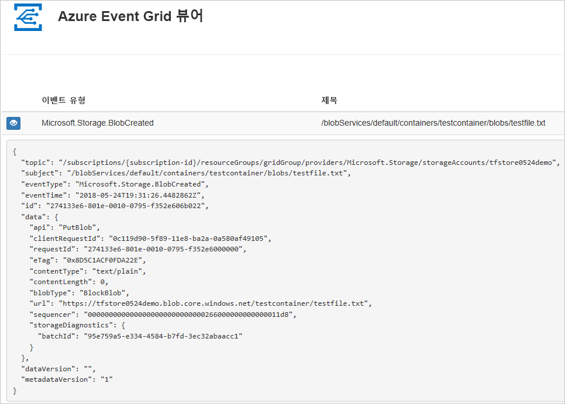
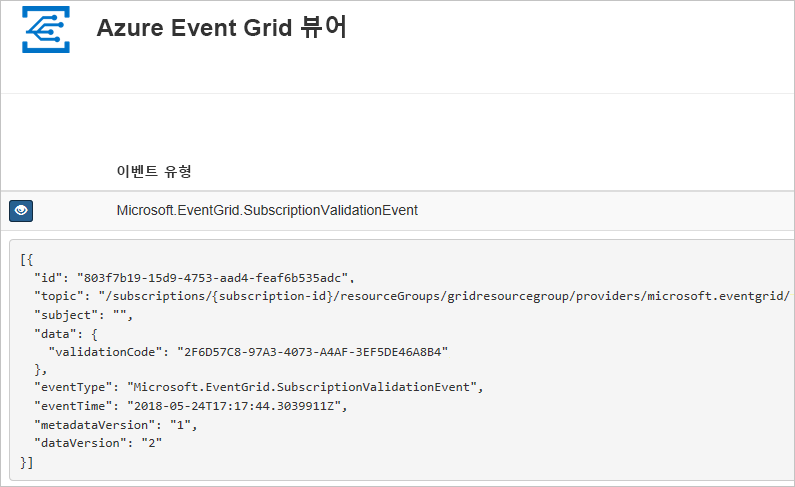

# <a name="quickstart-route-storage-events-to-web-endpoint-with-azure-cli"></a>빠른 시작: Azure CLI를 사용하여 스토리지 이벤트를 웹 엔드포인트로 라우팅

Azure Event Grid는 클라우드에 대한 이벤트 서비스입니다. 이 문서에서는 Azure CLI를 사용하여 Blob 저장소 이벤트를 구독하고 이벤트를 트리거하여 결과를 확인합니다.

일반적으로 이벤트 데이터를 처리하고 작업을 수행하는 엔드포인트에 이벤트를 보냅니다. 그러나 이 문서를 간소화하기 위해 메시지를 수집하고 표시하는 웹앱에 이벤트를 보냅니다.

이 문서에서 설명하는 단계를 완료하면 이벤트 데이터가 웹앱으로 보내졌음을 알 수 있습니다.




[!INCLUDE [quickstarts-free-trial-note.md](../../../includes/quickstarts-free-trial-note.md)]

[!INCLUDE [cloud-shell-try-it.md](../../../includes/cloud-shell-try-it.md)]

CLI를 로컬로 설치하여 사용하도록 선택하는 경우 이 문서에서는 최신 버전의 Azure CLI(2.0.24 이상)를 실행해야 합니다. 버전을 확인하려면 `az --version`을 실행합니다. 설치 또는 업그레이드해야 하는 경우 [Azure CLI 설치](/cli/azure/install-azure-cli)를 참조하세요.

Cloud Shell을 사용하지 않는 경우 먼저 `az login`을 사용하여 로그인해야 합니다.

## <a name="create-a-resource-group"></a>리소스 그룹 만들기

Event Grid 토픽은 Azure 리소스이며 Azure 리소스 그룹에 배치해야 합니다. 리소스 그룹은 Azure 리소스가 배포 및 관리되는 논리적 컬렉션입니다.

[az group create](/cli/azure/group#az_group_create) 명령을 사용하여 리소스 그룹을 만듭니다. 

다음 예제에서는 *westcentralus* 위치에 `<resource_group_name>`이라는 리소스 그룹을 만듭니다.  `<resource_group_name>`을 리소스 그룹의 고유한 이름으로 바꿉니다.

```azurecli-interactive
az group create --name <resource_group_name> --location westcentralus
```

## <a name="create-a-storage-account"></a>저장소 계정 만들기

Blob Storage 이벤트는 범용 v2 저장소 계정과 Blob Storage 계정에서 사용할 수 있습니다. **범용 v2** 저장소 계정은 Blob, 파일, 큐 및 테이블을 포함하여 모든 저장소 서비스의 모든 기능을 지원하는 저장소 계정입니다. **Blob Storage 계정**은 Azure Storage에서 Blob와 같은 구조화되지 않은 데이터(개체) 저장을 위한 특수 Storage 계정입니다. Blob Storage 계정은 범용 저장소 계정과 유사하면서, 현재 사용되고 있는 모든 뛰어난 내구성, 가용성, 확장성 및 성능 기능을 공유합니다(예: 블록 Blob 및 추가 Blob에 대한 100% API 일관성). 자세한 내용은 [Azure Storage 계정 개요](../common/storage-account-overview.md)를 참조하세요.

`<storage_account_name>`을 저장소 계정의 고유한 이름으로 바꾸고 `<resource_group_name>`을 이전에 만든 리소스 그룹으로 바꿉니다.

```azurecli-interactive
az storage account create \
  --name <storage_account_name> \
  --location westcentralus \
  --resource-group <resource_group_name> \
  --sku Standard_LRS \
  --kind BlobStorage \
  --access-tier Hot
```

## <a name="create-a-message-endpoint"></a>메시지 엔드포인트 만들기

토픽을 구독하기 전에 이벤트 메시지에 대한 엔드포인트를 만들어 보겠습니다. 일반적으로 엔드포인트는 이벤트 데이터를 기반으로 작업을 수행합니다. 이 빠른 시작을 간소화하기 위해 이벤트 메시지를 표시하는 [미리 작성된 웹앱](https://github.com/Azure-Samples/azure-event-grid-viewer)을 배포합니다. 배포된 솔루션은 App Service 계획, App Service 웹앱 및 GitHub의 소스 코드를 포함합니다.

`<your-site-name>`을 웹앱의 고유한 이름으로 바꿉니다. 웹앱 이름은 DNS 항목의 일부이므로 고유해야 합니다.

```azurecli-interactive
sitename=<your-site-name>

az group deployment create \
  --resource-group <resource_group_name> \
  --template-uri "https://raw.githubusercontent.com/Azure-Samples/azure-event-grid-viewer/master/azuredeploy.json" \
  --parameters siteName=$sitename hostingPlanName=viewerhost
```

배포가 완료될 때까지 몇 분 정도 걸릴 수 있습니다. 배포가 성공된 후 실행하는지 확인하려면 웹앱을 봅니다. 웹 브라우저에서 `https://<your-site-name>.azurewebsites.net`으로 이동합니다.

현재 표시된 메시지가 없는 사이트가 표시되어야 합니다.

[!INCLUDE [event-grid-register-provider-cli.md](../../../includes/event-grid-register-provider-cli.md)]

## <a name="subscribe-to-your-storage-account"></a>저장소 계정 구독

항목을 구독하여 Event Grid에 추적하려는 이벤트와 해당 이벤트를 보낼 위치를 알립니다. 다음 예제에서는 저장소 계정을 구독하고 웹앱의 URL을 이벤트 알림에 대한 엔드포인트로 전달합니다. `<event_subscription_name>`을 이벤트 구독의 이름으로 바꿉니다. `<resource_group_name>` 및 `<storage_account_name>`에는 앞에서 만든 값을 사용합니다.

웹앱에 대한 엔드포인트는 접미사 `/api/updates/`를 포함해야 합니다.

```azurecli-interactive
storageid=$(az storage account show --name <storage_account_name> --resource-group <resource_group_name> --query id --output tsv)
endpoint=https://$sitename.azurewebsites.net/api/updates

az eventgrid event-subscription create \
  --resource-id $storageid \
  --name <event_subscription_name> \
  --endpoint $endpoint
```

웹앱을 다시 확인하고, 구독 유효성 검사 이벤트를 보냈음을 확인합니다. 눈 모양 아이콘을 선택하여 이벤트 데이터를 확장합니다. Event Grid는 유효성 검사 이벤트를 보내므로 엔드포인트는 이벤트 데이터를 수신하려는 것을 확인할 수 있습니다. 웹앱은 구독의 유효성을 검사하는 코드를 포함합니다.



## <a name="trigger-an-event-from-blob-storage"></a>Blob 저장소에서 이벤트 트리거

이제 이벤트를 트리거하여 Event Grid가 메시지를 사용자 엔드포인트에 어떻게 배포하는지 살펴 보겠습니다. 먼저 저장소 계정의 이름과 키를 구성하고, 컨테이너를 만든 다음, 파일을 만들고 업로드합니다. `<storage_account_name>` 및 `<resource_group_name>`에 대해 이전에 만든 값을 다시 사용합니다.

```azurecli-interactive
export AZURE_STORAGE_ACCOUNT=<storage_account_name>
export AZURE_STORAGE_ACCESS_KEY="$(az storage account keys list --account-name <storage_account_name> --resource-group <resource_group_name> --query "[0].value" --output tsv)"

az storage container create --name testcontainer

touch testfile.txt
az storage blob upload --file testfile.txt --container-name testcontainer --name testfile.txt
```

이벤트를 트리거했고 Event Grid가 구독할 때 구성한 엔드포인트로 메시지를 보냈습니다. 웹앱을 확인하여 방금 전송한 이벤트를 봅니다.


```json
[{
  "topic": "/subscriptions/xxxxxxxx-xxxx-xxxx-xxxx-xxxxxxxxxxxx/resourceGroups/myrg/providers/Microsoft.Storage/storageAccounts/myblobstorageaccount",
  "subject": "/blobServices/default/containers/testcontainer/blobs/testfile.txt",
  "eventType": "Microsoft.Storage.BlobCreated",
  "eventTime": "2017-08-16T20:33:51.0595757Z",
  "id": "4d96b1d4-0001-00b3-58ce-16568c064fab",
  "data": {
    "api": "PutBlockList",
    "clientRequestId": "d65ca2e2-a168-4155-b7a4-2c925c18902f",
    "requestId": "4d96b1d4-0001-00b3-58ce-16568c000000",
    "eTag": "0x8D4E4E61AE038AD",
    "contentType": "text/plain",
    "contentLength": 0,
    "blobType": "BlockBlob",
    "url": "https://myblobstorageaccount.blob.core.windows.net/testcontainer/testblob1.txt",
    "sequencer": "00000000000000EB0000000000046199",
    "storageDiagnostics": {
      "batchId": "dffea416-b46e-4613-ac19-0371c0c5e352"
    }
  },
  "dataVersion": "",
  "metadataVersion": "1"
}]

```

## <a name="clean-up-resources"></a>리소스 정리
이 저장소 계정 및 이벤트 구독을 계속 사용하려면 이 문서에서 만든 리소스를 정리하지 마세요. 계속하지 않으려는 경우 다음 명령을 사용하여 이 문서에서 만든 리소스를 삭제합니다.

`<resource_group_name>`을 위에서 만든 리소스 그룹으로 바꿉니다.

```azurecli-interactive
az group delete --name <resource_group_name>
```

## <a name="next-steps"></a>다음 단계

이제 토픽 및 이벤트 구독을 만드는 방법을 알아보았으므로 Blob 저장소 이벤트 및 Event Grid에서 수행할 수 있는 작업에 대해 자세히 알아봅니다.

- [Blob 저장소 이벤트에 응답](storage-blob-event-overview.md)
- [Event Grid 정보](../../event-grid/overview.md)
