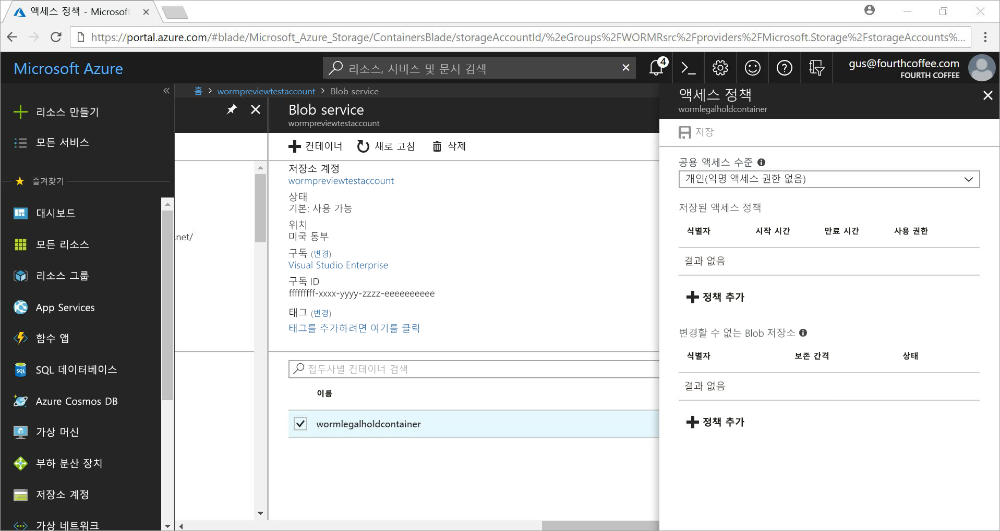
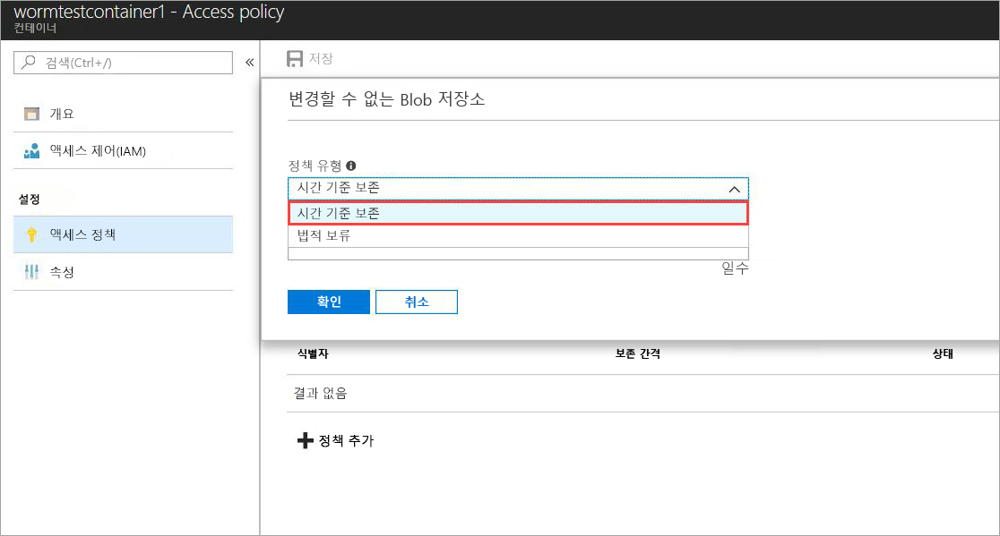
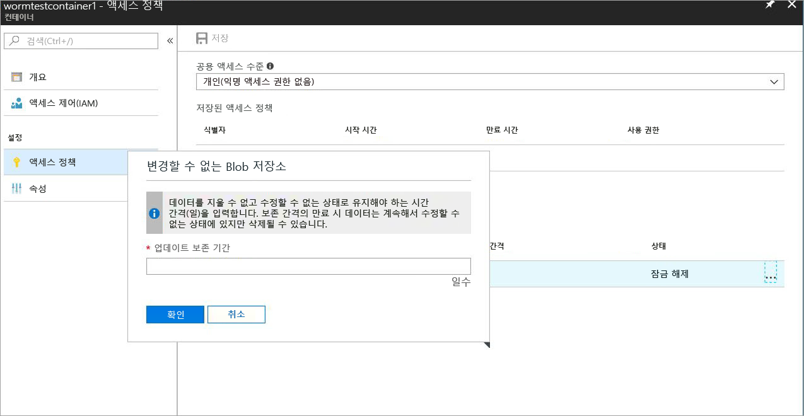
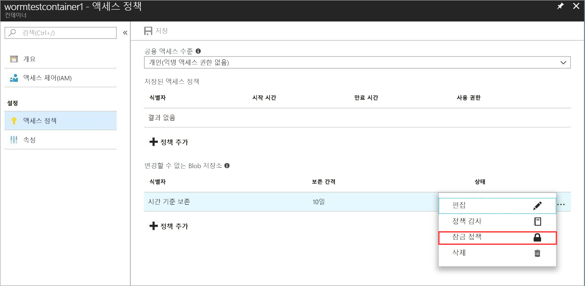
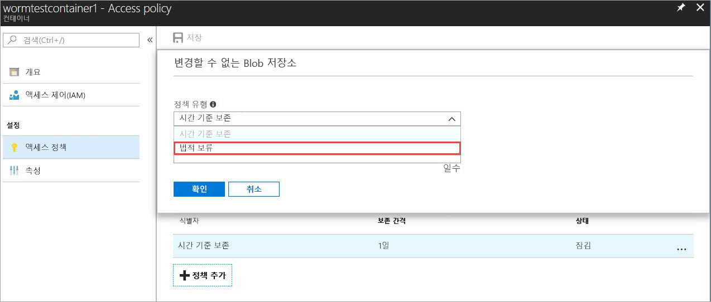
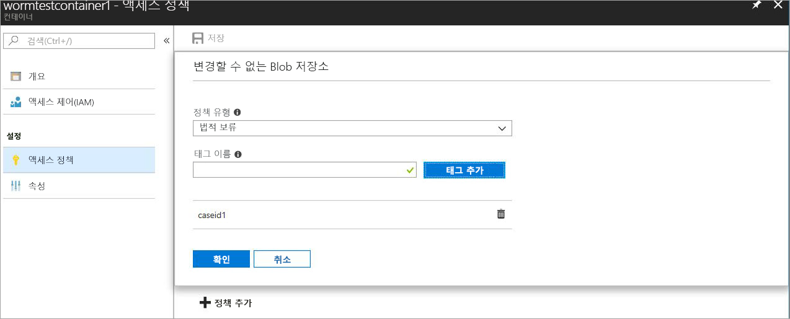

# <a name="store-business-critical-data-in-azure-blob-storage"></a>Azure Blob Storage에 중요 비즈니스용 데이터 저장

Azure Blob storage에 대 한 변경할 수 없는 저장소를 사용 하면 웜 (한 번 쓰기, 읽기 많은) 상태의 비즈니스에 중요 한 데이터 개체를 저장할 수 있습니다. 이 상태는 사용자가 지정한 간격 동안 데이터를 지울 수 없고 수정할 수 없게 만듭니다. Blob 개체 생성 및 읽기, 하지만 하지 수정 하거나 삭제할 수, 보존 간격 기간에 대 한 합니다. 변경할 수 없는 저장소 범용 v2 및 Blob 저장소 계정은 모든 Azure 지역에서 사용 됩니다.

## <a name="overview"></a>개요

변경할 수 없는 저장소 의료 조직, 금융 기관 및 관련된 산업-특히 broker 딜러 조직-데이터를 안전 하 게 저장 하는 데 도움이 됩니다. 수정 또는 삭제에 대 한 중요 한 데이터를 보호 하기 위해 모든 시나리오에서 활용할 수도 있습니다. 

일반적인 적용 분야는 다음과 같습니다.

- **규정 준수**: Azure Blob Storage에 대해 변경 불가능한 스토리지를 사용하면 SEC 17a-4(f), CFTC 1.31(d), FINRA 및 기타 규정을 처리할 수 있습니다. Cohasset 연결 하는 기술 백서를 통해 다운로드할 수는 이러한 규정 요구 사항을 어떻게 변경할 수 없는 저장소 주소에 자세히 설명 합니다 [Microsoft Service Trust Portal](https://aka.ms/AzureWormStorage)합니다. 합니다 [Azure 보안 센터](https://www.microsoft.com/trustcenter/compliance/compliance-overview) 규정 준수 인증에 대 한 자세한 정보를 포함 합니다.

- **보안 문서 보존**: Azure Blob storage에 대 한 변경할 수 없는 저장소에 데이터 수정 하거나 계정 관리자 권한이 있는 사용자를 포함 하 여 모든 사용자가 삭제할 수 있는지 확인 합니다.

- **법적 보존**: Azure Blob storage에 대 한 변경할 수 없는 저장소를 사용 하면 보류 제거 될 때까지 원하는 기간에 대 한 무단 상태의 소송 또는 비즈니스 사용에 중요 한 중요 한 정보를 저장할 수 있습니다. 이 기능은 법적 사용 사례에만 제한 되지 않지만 생각할 수 있습니다는 이벤트 기반 보류 또는 엔터프라이즈 잠금으로 이벤트 트리거 또는 회사 정책에 따라 데이터를 보호 해야가 필요한 경우입니다.

변경할 수 없는 저장소 다음을 지원합니다.

- **[시간 기준 보존 정책 지원이](#time-based-retention)** : 사용자 지정된 된 간격에 대 한 데이터를 저장 하는 정책을 설정할 수 있습니다. 시간 기준 보존 정책이 경우 설정 blob 생성 및 읽기, 하지만 하지 수정 하거나 삭제할 수입니다. 보존 기간이 만료 되 면 blob은 삭제 하지만 덮어쓰지 수 있습니다.

- **[법적 보존 정책 지원이](#legal-holds)** : 보존 간격을 알 수 없는 경우 사용자 데이터를 저장할 immutably 법적 보존을 지울 때까지 법적 포함을 설정할 수 있습니다.  법적 보존 정책을 설정 하는 경우 blob 생성 및 읽기, 하지만 하지 수정 하거나 삭제할 수입니다. 각 법적 보존을 사용자 정의 영숫자 태그 (예: 이벤트 이름 등 사례 ID) 문자열을 식별자로 사용 되는 연결 되어 있습니다. 

- **모든 Blob 계층 지원**: WORM 정책은 Azure Blob Storage 계층과 별개이며, 모든 계층(핫, 쿨 및 보관)에 적용됩니다. 사용자가 데이터 불변성을 유지하면서 해당 워크로드에 대해 비용이 가장 최적화된 계층으로 데이터를 전환할 수 있습니다.

- **컨테이너 수준 구성**: 사용자가 컨테이너 수준에서 시간 기준 보존 정책 및 법적 보존 태그를 구성할 수 있습니다. 간단한 컨테이너 수준 설정을 사용 하 여 사용자 수 만들기 및 잠금 시간 기준 보존 정책, 보존 간격, 집합 및 지우기 법적 저장 등을 확장 합니다. 이러한 정책은 컨테이너의 모든 Blob(기존 및 신규)에 적용됩니다.

- **감사 로깅 지원**: 각 컨테이너에는 정책 감사 로그를 포함합니다. 표시 7 시간 기준 보존 잠긴된 시간 기준 보존 정책에 대 한 명령 및 사용자 ID, 명령 유형, 타임 스탬프 및 보존 간격이 포함 됩니다. 법적 보존의 경우 로그에는 사용자 ID, 명령 유형, 타임스탬프 및 법적 보존 태그가 포함됩니다. 이 로그는 초 17a-4(f) 규정 지침에 따라 정책의 수명 동안 유지 됩니다. [Azure 활동 로그](../../azure-monitor/platform/activity-logs-overview.md) 를 사용 하도록 설정 하는 동안 모든 제어 평면 작업의 자세한 로그를 보여 줍니다 [Azure Diagnostic Logs](../../azure-monitor/platform/diagnostic-logs-overview.md) 유지 및 데이터 평면 작업을 표시 합니다. 이러한 로그는 규정 또는 다른 목적으로 필요할 수 있으므로 사용자가 이러한 로그를 영구적으로 저장할 책임이 있습니다.

## <a name="how-it-works"></a>작동 방법

Azure Blob Storage에 대한 변경 불가능한 스토리지는 두 가지 유형의 WORM 또는 변경 불가능한 정책, 즉, 시간 기준 보존 정책과 법적 보존 정책을 지원합니다. 시간 기준 보존 정책이 나 법적 보존을 컨테이너에 적용 되 면 30 초 이내에 모든 기존 blob을 변경할 수 없는 웜 상태로 이동 합니다. 해당 컨테이너에 업로드 되는 모든 새 blob도 변경할 수 없는 상태로 이동 됩니다. 모든 blob를 변경할 수 없는 상태로 이동 했을 변경할 수 없는 정책 확인 되 고 모든 덮어쓰거나 삭제에 변경할 수 없는 컨테이너에 기존 및 새 개체에 대 한 작업이 허용 되지 않습니다.

컨테이너 및 계정 삭제도 허용 되지 않습니다 모든 blob이 변경할 수 없는 정책에 의해 보호 된 경우. 잠긴 시간 기반 보존 정책 또는 법적 보존이 있는 Blob이 하나 이상 있는 경우 컨테이너 삭제 작업이 실패합니다. 법적 보존 또는 보존 기간이 활성화된 BLOB이 있는 WORM 컨테이너가 하나 이상 있는 경우 저장소 계정 삭제 작업이 실패합니다. 

### <a name="time-based-retention"></a>시간 기반 보존

> [!IMPORTANT]
> 시간 기준 보존 정책이 있어야 *잠긴* 규격이에 blob에 대 한 변경할 수 없는 (쓰기 및 삭제 금지 된) 초 17a-4(f) 및 기타 규정 준수에 대 한 상태입니다. 잠그는 정책을 합당 한 시간에에서 일반적으로 24 시간 보다 작아야 하는 것이 좋습니다. 적용된 시간 기준 보존 정책의 초기 상태가 *잠기지 않은*, 기능을 테스트 하 고 잠글 전에 정책을 변경할 수 있습니다. 하는 동안 합니다 *잠기지 않은* 불변성 보호를 제공 하는 상태를 권장 하지 않습니다를 사용 하 여를 *잠기지 않은* 단기 기능 평가판 이외의 목적을 위해 상태. 

컨테이너에 시간 기준 보존 정책을 적용하면 컨테이너의 모든 Blob이 *유효* 보존 기간 동안 변경 불가능한 상태로 유지됩니다. 기존 blob에 대 한 효과적인 보존 기간은 blob 수정 시간 및 사용자 지정 보존 간격 사이의 차이 것과 같습니다.

새 BLOB의 경우 유효 보존 기간은 사용자가 지정한 보존 기간과 같습니다. 사용자가 보존 간격을 연장할 수 있으므로 변경 불가능한 스토리지는 사용자 지정 보존 간격의 최신 값을 사용하여 유효 보존 기간을 계산합니다.

> [!TIP]
> **예제:** 사용자가 5년 보존 간격의 시간 기준 보존 정책을 만듭니다.
>
> 해당 컨테이너의 기존 blob _testblob1_, 1 년 전에 생성 되었습니다. 에 대 한 효과적인 보존 기간 _testblob1_ 4 년입니다.
>
> 새 blob _testblob2_, 이제 컨테이너에 업로드 합니다. 이 새 Blob의 유효 보존 기간은 5년입니다.

잠금 해제 시간 기준 보존 정책을 기능 테스트에 권장 및 정책을 초 17a-4(f) 및 기타 규정을 준수 하기 위해 잠겨 있어야 합니다. 시간 기준 보존 정책이 잠기면 정책을 제거할 수 없습니다 하 고 효과적인 보존 기간으로 5 증가의 경우 최대 허용 됩니다. 잠금 시간 기준 보존 정책을 설정 하는 방법에 대 한 자세한 내용은 참조는 [Getting started](#getting-started) 섹션입니다.

### <a name="legal-holds"></a>법적 보존

법적 보존이 설정되면 이 법적 보존을 지울 때까지 기존 및 새 Blob이 모두 변경 불가능한 상태로 유지됩니다. 법적 보존을 설정하고 지우는 방법에 대한 자세한 내용은 [시작](#getting-started) 섹션을 참조하세요.

컨테이너에는 법적 보존 정책 및 시간 기준 보존 정책이 모두 있을 수 있습니다. 유효 보존 기간이 만료된 경우에도 법적 보존이 지워질 때까지 해당 컨테이너의 모든 Blob은 변경 불가능한 상태로 유지됩니다. 반대로, 모든 법적 보존이 지워진 경우에도 유효 보존 기간이 만료될 때까지 Blob은 변경 불가능한 상태로 유지됩니다.

다음 표에서는 변경 불가능한 여러 시나리오에 사용할 수 없는 Blob 작업의 유형을 보여 줍니다. 자세한 내용은 [Azure Blob 서비스 API](https://docs.microsoft.com/rest/api/storageservices/blob-service-rest-api) 설명서를 참조하세요.

|시나리오  |Blob 상태  |허용되지 않는 Blob 작업  |
|---------|---------|---------|
|BLOB의 유효 보존 기간이 아직 만료되지 않았고/않았거나 법적 보존이 설정되어 있음     |변경할 수 없음: 삭제 및 쓰기 금지         | Blob 배치<sup>1</sup>, 블록 배치<sup>1</sup>, 블록 목록 배치<sup>1</sup>Delete Blob 컨테이너 집합에 대 한 Blob 메타 데이터 삭제, 페이지 배치, Blob 속성, 스냅숏 Blob, Blob 증분 복사를 설정 합니다. 블록 추가         |
|BLOB의 유효 보존 기간이 만료됨     |쓰기만 금지(삭제 작업은 허용)         |Blob<sup>1</sup> 배치, 블록<sup>1</sup> 배치, 블록 목록<sup>1</sup> 배치, Blob 메타데이터 설정, 페이지 배치, Blob 속성 설정, 스냅샷 Blob, Blob 증분 복사, 블록 추가         |
|모든 법적 보존을 지우고,컨테이너에 시간 기준 보존 정책이 설정되지 않음     |변경 가능         |없음         |
|만들어진 WORM 정책(시간 기준 보존 또는 법적 보존)이 없음     |변경 가능         |없음         |

<sup>1</sup> 응용 프로그램에서는 이러한 작업을 한 번 새 blob을 만듭니다. 모든 후속 덮어쓰기 변경할 수 없는 컨테이너에 기존 blob 경로에서 작업이 허용 되지 않습니다.

## <a name="supported-values"></a>지원되는 값

### <a name="time-based-retention"></a>시간 기반 보존
- 저장소 계정에 대 한 잠금된 시간을 기준으로 변경할 수 없는 정책 사용 하 여 컨테이너의 최대 수는 1,000입니다.
- 최소 보존 간격은 1 일입니다. 최대값은 146,000 일 (400 년)입니다.
- 컨테이너에 대 한 최대 잠긴된 시간을 기준으로 변경할 수 없는 정책에 대 한 보존 간격을 확장 하는 편집은 5입니다.
- 컨테이너에 대 한 7 시간 기준 보존 정책 감사 로그의 최대 기간 정책에 대 한 유지 됩니다.

### <a name="legal-hold"></a>법적 보존
- 저장소 계정의 경우 법적 보존이 설정된 컨테이너의 최대 수는 1,000개입니다.
- 컨테이너의 경우 법적 보존 태그의 최대 수는 10개입니다.
- 법적 보존 태그의 최소 길이 영숫자 3 자입니다. 최대 길이 영숫자 23 자입니다.
- 컨테이너에 대 한 법적 10 개 사이로 정책의 기간에 대 한 로그를 보관 하는 정책 감사를 보유 합니다.

## <a name="pricing"></a>가격

이 기능을 사용하는 경우 추가 요금이 부과되지 않습니다. 변경 불가능한 데이터는 일반적으로 변경 가능한 데이터와 동일한 방식으로 가격이 책정됩니다. Azure Blob Storage의 가격 책정에 대한 자세한 내용은 [Azure Storage 가격 책정 페이지](https://azure.microsoft.com/pricing/details/storage/blobs/)를 참조하세요.

## <a name="getting-started"></a>시작
변경할 수 없는 저장소는 범용 v2 및 Blob Storage 계정에 대해서만 사용할 수 있습니다. 이러한 계정을 통해 관리 되어야 [Azure Resource Manager](https://docs.microsoft.com/azure/azure-resource-manager/resource-group-overview)합니다. 기존 범용 v1 저장소 계정을 업그레이드에 대 한 자세한 내용은 [저장소 계정을 업그레이드](../common/storage-account-upgrade.md)합니다.

최신 릴리스는 [Azure portal](https://portal.azure.com)를 [Azure CLI](https://docs.microsoft.com/cli/azure/install-azure-cli?view=azure-cli-latest), 및 [Azure PowerShell](https://github.com/Azure/azure-powershell/releases) Azure Blob storage에 대 한 변경할 수 없는 저장소를 지원 합니다. [클라이언트 라이브러리 지원](#client-libraries) 도 제공 됩니다.

### <a name="azure-portal"></a>Azure portal

1. 변경할 수 없는 상태로 유지해야 하는 BLOB을 저장할 새 컨테이너를 만들거나 기존 컨테이너를 선택합니다.
 컨테이너는 GPv2 또는 Blob Storage 계정에 있어야 합니다.
2. 컨테이너 설정에서 **액세스 정책**을 선택합니다. 그런 다음, **변경 불가능한 Blob Storage** 아래에서 **+ 정책 추가**를 선택합니다.

    

3. 시간 기준 보존을 사용하도록 설정하려면 드롭다운 메뉴에서 **시간 기준 보존**을 선택합니다.

    

4. 일 (허용 되는 값 1에 146000 일) 동안에서 보존 간격을 입력 합니다.

    

    초기 상태 정책의 기능을 테스트 하 여 잠글 전에 정책을 변경할 수 있도록 잠금 해제 됩니다. 정책을 잠금은 초 17a-4와 같은 규정 준수에 대 한 필수적입니다.

5. 정책을 잠급니다. 줄임표를 마우스 오른쪽 단추로 클릭 ( **...** ), 추가 작업을 사용 하 여 다음과 같은 메뉴가 나타납니다.

    

6. 선택 **잠금 정책을** 잠금을 확인 합니다. 정책을 이제 잠겨 있어서 삭제할 수 없습니다, 보존 간격이 확장만 허용 됩니다. Blob 삭제 하 고 재정의 허용 되지 않습니다. 

    

7. 법적 보존을 사용하도록 설정하려면 **+ 정책 추가**를 선택합니다. 드롭다운 메뉴에서 **법적 보존**을 선택합니다.

    

8. 하나 이상의 태그를 사용하여 법적 보존을 만듭니다.

    

9. 법적 보존을 지우려면 적용된 법적 식별자 태그를 제거 하면 됩니다.

### <a name="azure-cli"></a>Azure CLI

이 기능은 `az storage container immutability-policy` 및 `az storage container legal-hold` 명령 그룹에 포함되어 있습니다. 이러한 그룹에 `-h`를 실행하여 명령을 확인합니다.

### <a name="powershell"></a>PowerShell

Az.Storage 모듈 변경할 수 없는 저장소를 지원합니다.  기능을 사용하도록 설정하려면 다음 단계를 수행합니다.

1. 최신 버전의 PowerShellGet이 설치되어 있는지 확인합니다. `Install-Module PowerShellGet –Repository PSGallery –Force`
2. Azure PowerShell의 이전 설치를 제거합니다.
3. Azure PowerShell을 설치합니다. `Install-Module Az –Repository PSGallery –AllowClobber`

이 문서의 뒷부분에 나오는 [PowerShell 코드 샘플](#sample-powershell-code) 섹션에서는 기능을 사용하는 방법을 보여 줍니다.

## <a name="client-libraries"></a>클라이언트 라이브러리

Azure Blob Storage에 대한 변경 불가능한 스토리지를 지원하는 클라이언트 라이브러리는 다음과 같습니다.

- [.NET 클라이언트 라이브러리 버전 7.2.0-preview 이상](https://www.nuget.org/packages/Microsoft.Azure.Management.Storage/7.2.0-preview)
- [Node.js 클라이언트 라이브러리 버전 4.0.0 이상](https://www.npmjs.com/package/azure-arm-storage)
- [Python 클라이언트 라이브러리 버전 2.0.0 릴리스 후보 2 이상](https://pypi.org/project/azure-mgmt-storage/2.0.0rc2/)
- [Java 클라이언트 라이브러리](https://github.com/Azure/azure-rest-api-specs/tree/master/specification/storage/resource-manager/Microsoft.Storage/preview/2018-03-01-preview)

## <a name="faq"></a>FAQ

**웜 규정 준수의 설명서를 제공 하나요?**

예. 문서 준수에 Microsoft는 독립 평가 기관인 Azure 변경할 수 없는 Blob Storage 및 특정 요구 사항 준수를 평가 하려면 Cohasset 연결 레코드 관리 및 정보 관리를 전문으로 하는 유지 금융 서비스 업계 합니다. Cohasset은 Azure 변경할 수 없는 Blob 저장소, 웜 상태에서 시간을 기준으로 Blob을 유지 하는 데 사용 하는 경우 CFTC 규칙 1.31(c)-(d), FINRA 규칙 4511 및 초 규칙 17a-4의 관련 저장소 요구 사항을 충족 하는지 확인 합니다. Microsoft 글로벌 금융 기관에 대 한 레코드 보존에 대 한 가장 규범적인 지침을 나타내므로이 규칙 집합을 대상으로 합니다. Cohasset 보고서에서 사용할 수 있는를 [Microsoft Service Trust Center](https://aka.ms/AzureWormStorage)합니다. 증명 문자로 Microsoft에서 웜 규정 준수에 대 한를 요청 하려면 Azure 지원에 문의 하세요.

**이 기능은 블록 Blob에만 적용되나요, 아니면 페이지 및 추가 Blob에도 적용되나요?**

변경이 불가능한 스토리지를 모든 Blob 유형과 함께 사용할 수 있지만 블록 Blob에 주로 사용하는 것이 좋습니다. 블록 Blob과는 달리, 페이지 Blob과 추가 Blob은 WORM 컨테이너 외부에서 만든 후에 복사해야 합니다. 복사한 후 이러한 blob 웜 컨테이너로 더 더욱 *추가* 추가 하려면 blob 또는 페이지 blob에 대 한 변경 내용이 허용 됩니다.

**이 기능을 사용 하려면 새 저장소 계정을 만들려면 하나요?**

아니요, 기존 또는 새롭게 만든 범용 v2 및 Blob storage 계정에 대해 변경할 수 없는 저장소를 사용할 수 있습니다. 이 기능은 GPv2 및 Blob Storage 계정의 블록 blob 사용에 대 한 것입니다. 일반 용도 v1 저장소 계정만 지원 되지 않지만 범용 v2로 쉽게 업그레이드할 수 있습니다. 기존 범용 v1 저장소 계정을 업그레이드에 대 한 자세한 내용은 [저장소 계정을 업그레이드](../common/storage-account-upgrade.md)합니다.

**법적 보존 및 시간 기반 보존 정책을 적용할 수 있나요?**

예, 컨테이너를 동시에 법적 보존 및 시간 기준 보존 정책이 있을 수 있습니다. 유효 보존 기간이 만료된 경우에도 법적 보존이 지워질 때까지 해당 컨테이너의 모든 Blob은 변경 불가능한 상태로 유지됩니다. 반대로, 모든 법적 보존이 지워진 경우에도 유효 보존 기간이 만료될 때까지 Blob은 변경 불가능한 상태로 유지됩니다.

**법적 보존 정책을 법적 절차에 대해서만 아니면 다른 사용 시나리오가 있습니다?**

아니요, 법적 보관은 시간 기준 보존 정책에 사용 되는 일반 용어만 합니다. 소송에만 사용 하지 않아도 proceedings 관련 됩니다. 법적 보존 정책을 여기서 보존 기간 알 수 없는 덮어쓰기 및 보호 하는 중요 한 엔터프라이즈 웜 데이터에 대 한 삭제를 사용 하지 않도록 설정 하는 것에 대 한 유용 합니다. 업무상 중요 한 웜 워크 로드를 보호 하거나 사용자 지정 이벤트 트리거를 시간 기준 보존 정책 사용 해야 하기 전에 준비 정책으로 사용 하려면 엔터프라이즈 정책으로 사용할 수 있습니다. 

**제거할 수는 *잠긴* 시간 기준 보존 정책 또는 법적?**

잠금 해제 시간 기준 보존 정책에 대 한 컨테이너에서 제거할 수 있습니다. 시간 기준 보존 정책이 잠기면 제거할 수 없습니다. 유효 기간 확장은만 사용할 수 있습니다. 법적 보존 태그를 삭제할 수 있습니다. 모든 법적 태그를 삭제할 때 법적 보존 제거 됩니다.

***잠긴* 시간 기반 보존 정책 또는 법적 보존이 있는 컨테이너를 삭제하려고 시도하면 어떻게 되나요?**

잠긴 시간 기반 보존 정책 또는 법적 보존이 있는 Blob이 하나 이상 있는 경우 컨테이너 삭제 작업이 실패합니다. 활성 보존 기간이 있는 BLOB이 없고 법적 보존이 없는 경우에만 컨테이너 삭제 작업이 성공합니다. 컨테이너를 삭제하려면 먼저 Blob을 삭제해야 합니다.

**WORM 컨테이너에 *잠긴* 시간 기반 보존 정책 또는 법적 보존이 있는 저장소 계정을 삭제하려고 시도하면 어떻게 되나요?**

법적 보존 또는 보존 기간이 활성화된 BLOB이 있는 WORM 컨테이너가 하나 이상 있는 경우 저장소 계정 삭제 작업이 실패합니다. 저장소 계정을 삭제하려면 먼저 모든 WORM 컨테이너를 삭제해야 합니다. 컨테이너 삭제에 대한 내용은 앞의 질문을 참조하세요.

**BLOB이 변경할 수 없는 상태인 경우 BLOB 계층(핫, 쿨, 콜드) 간에 데이터를 이동할 수 있나요?**

예, 변경할 수 없는 준수 상태 데이터를 유지 하면서 blob 계층 전반에 걸쳐 데이터를 이동할 Blob 계층 설정 명령을 사용할 수 있습니다. 변경 불가능한 스토리지는 핫, 쿨 및 아카이브 Blob 계층에서 지원됩니다.

**보존 기간이 만료되지는 않았지만 요금을 지불하지 않은 경우 어떻게 되나요?**

요금을 지불하지 않으면 Microsoft와 맺은 사용 약관에 명시된 대로 일반 데이터 보존 정책이 적용됩니다.

**기능을 경험해 볼 수 있는 평가판 또는 유예 기간이 제공되나요?**

예. 시간 기준 보존 정책을 처음 만들 때에 *잠기지 않은* 상태입니다. 이 상태에서는 필요에 따라 보존 간격을 변경할 수 있습니다. 즉 해당 정책을 늘리거나 줄이고, 심지어 삭제할 수도 있습니다. 정책을 잠근 후에는 보존 간격이 만료될 때까지 잠금 상태가 유지됩니다. 이 잠긴된 정책은 보존 간격이 수정 및 삭제를 방지합니다. *잠금 해제* 상태는 기능 평가 목적으로만 사용하고, 24 시간 내에 해당 정책을 잠그는 것이 좋습니다. 이러한 사례는 SEC 17a-4(f) 및 기타 규정을 준수하는 데 도움이 됩니다.

**일시 삭제 정책 변경할 수 없는 blob와 함께 사용할 수 있습니까?**

예. [Azure Blob storage에 대 한 일시 삭제](storage-blob-soft-delete.md) 법적 또는 시간 기준 보존 정책에 관계 없이 저장소 계정 내의 모든 컨테이너에 적용 됩니다. 변경할 수 없는 웜 정책을 적용 하 고 확인 하기 전에 추가 보호에 대해 일시 삭제를 사용 하도록 설정 하는 것이 좋습니다. 

**사용 가능한 기능은 여기서?**

변경이 불가능한 스토리지는 Azure 공용, 중국 및 Government 지역에서 사용할 수 있습니다. 지원 및 전자 메일 문의 변경할 수 없는 저장소를 사용할 수 없는 지역의 경우 azurestoragefeedback@microsoft.com합니다.

## <a name="sample-powershell-code"></a>PowerShell 코드 샘플

[!INCLUDE [updated-for-az](../../../includes/updated-for-az.md)]

다음 PowerShell 스크립트 샘플은 참조하기 위한 목적으로 제공되는 것입니다. 이 스크립트는 새 저장소 계정과 컨테이너를 만듭니다. 그런 다음, 법적 보존 정책을 설정하고 지우고, 시간 기준 보존 정책(변경 불가능한 정책이라고도 함)을 만들고 잠그며, 보존 간격을 연장하는 방법을 보여 줍니다.

Azure Storage 계정 설정 및 테스트:

```powershell
$ResourceGroup = "<Enter your resource group>”
$StorageAccount = "<Enter your storage account name>"
$container = "<Enter your container name>"
$container2 = "<Enter another container name>”
$location = "<Enter the storage account location>"

# Log in to the Azure Resource Manager account
Login-AzAccount
Register-AzResourceProvider -ProviderNamespace "Microsoft.Storage"

# Create your Azure resource group
New-AzResourceGroup -Name $ResourceGroup -Location $location

# Create your Azure storage account
New-AzStorageAccount -ResourceGroupName $ResourceGroup -StorageAccountName `
    $StorageAccount -SkuName Standard_LRS -Location $location -Kind StorageV2

# Create a new container
New-AzStorageContainer -ResourceGroupName $ResourceGroup `
    -StorageAccountName $StorageAccount -Name $container

# Create Container 2 with a storage account object
$accountObject = Get-AzStorageAccount -ResourceGroupName $ResourceGroup `
    -StorageAccountName $StorageAccount
New-AzStorageContainer -StorageAccount $accountObject -Name $container2

# Get a container
Get-AzStorageContainer -ResourceGroupName $ResourceGroup `
    -StorageAccountName $StorageAccount -Name $container

# Get a container with an account object
$containerObject = Get-AzStorageContainer -StorageAccount $accountObject -Name $container

# List containers
Get-AzStorageContainer -ResourceGroupName $ResourceGroup `
    -StorageAccountName $StorageAccount

# Remove a container (add -Force to dismiss the prompt)
Remove-AzStorageContainer -ResourceGroupName $ResourceGroup `
    -StorageAccountName $StorageAccount -Name $container2

# Remove a container with an account object
Remove-AzStorageContainer -StorageAccount $accountObject -Name $container2

# Remove a container with a container object
$containerObject2 = Get-AzStorageContainer -StorageAccount $accountObject -Name $container2
Remove-AzStorageContainer -InputObject $containerObject2
```

법적 보존 설정 및 지우기:

```powershell
# Set a legal hold
Add-AzRmStorageContainerLegalHold -ResourceGroupName $ResourceGroup `
    -StorageAccountName $StorageAccount -Name $container -Tag <tag1>,<tag2>,...

# with an account object
Add-AzRmStorageContainerLegalHold -StorageAccount $accountObject -Name $container -Tag <tag3>

# with a container object
Add-AzRmStorageContainerLegalHold -Container $containerObject -Tag <tag4>,<tag5>,...

# Clear a legal hold
Remove-AzRmStorageContainerLegalHold -ResourceGroupName $ResourceGroup `
    -StorageAccountName $StorageAccount -Name $container -Tag <tag2>

# with an account object
Remove-AzRmStorageContainerLegalHold -StorageAccount $accountObject -Name $container -Tag <tag3>,<tag5>

# with a container object
Remove-AzRmStorageContainerLegalHold -Container $containerObject -Tag <tag4>
```

불변성 정책 만들기 또는 업데이트:
```powershell
# with an account name or container name
Set-AzRmStorageContainerImmutabilityPolicy -ResourceGroupName $ResourceGroup `
    -StorageAccountName $StorageAccount -ContainerName $container -ImmutabilityPeriod 10

# with an account object
Set-AzRmStorageContainerImmutabilityPolicy -StorageAccount $accountObject `
    -ContainerName $container -ImmutabilityPeriod 1 -Etag $policy.Etag

# with a container object
$policy = Set-AzRmStorageContainerImmutabilityPolicy -Container `
    $containerObject -ImmutabilityPeriod 7

# with an immutability policy object
Set-AzRmStorageContainerImmutabilityPolicy -ImmutabilityPolicy $policy -ImmutabilityPeriod 5
```

불변성 정책 검색:
```powershell
# Get an immutability policy
Get-AzRmStorageContainerImmutabilityPolicy -ResourceGroupName $ResourceGroup `
    -StorageAccountName $StorageAccount -ContainerName $container

# with an account object
Get-AzRmStorageContainerImmutabilityPolicy -StorageAccount $accountObject `
    -ContainerName $container

# with a container object
Get-AzRmStorageContainerImmutabilityPolicy -Container $containerObject
```

불변성 정책 잠금(추가 -프롬프트 강제로 닫기):
```powershell
# with an immutability policy object
$policy = Get-AzRmStorageContainerImmutabilityPolicy -ResourceGroupName `
    $ResourceGroup -StorageAccountName $StorageAccount -ContainerName $container
$policy = Lock-AzRmStorageContainerImmutabilityPolicy -ImmutabilityPolicy $policy -force

# with an account name or container name
$policy = Lock-AzRmStorageContainerImmutabilityPolicy -ResourceGroupName `
    $ResourceGroup -StorageAccountName $StorageAccount -ContainerName $container `
    -Etag $policy.Etag

# with an account object
$policy = Lock-AzRmStorageContainerImmutabilityPolicy -StorageAccount `
    $accountObject -ContainerName $container -Etag $policy.Etag

# with a container object
$policy = Lock-AzRmStorageContainerImmutabilityPolicy -Container `
    $containerObject -Etag $policy.Etag -force
```

불변성 정책 확장:
```powershell

# with an immutability policy object
$policy = Get-AzRmStorageContainerImmutabilityPolicy -ResourceGroupName `
    $ResourceGroup -StorageAccountName $StorageAccount -ContainerName $container

$policy = Set-AzRmStorageContainerImmutabilityPolicy -ImmutabilityPolicy `
    $policy -ImmutabilityPeriod 11 -ExtendPolicy

# with an account name or container name
$policy = Set-AzRmStorageContainerImmutabilityPolicy -ResourceGroupName `
    $ResourceGroup -StorageAccountName $StorageAccount -ContainerName $container `
    -ImmutabilityPeriod 11 -Etag $policy.Etag -ExtendPolicy

# with an account object
$policy = Set-AzRmStorageContainerImmutabilityPolicy -StorageAccount `
    $accountObject -ContainerName $container -ImmutabilityPeriod 12 -Etag `
    $policy.Etag -ExtendPolicy

# with a container object
$policy = Set-AzRmStorageContainerImmutabilityPolicy -Container `
    $containerObject -ImmutabilityPeriod 13 -Etag $policy.Etag -ExtendPolicy
```

잠금이 해제 된 불변성 정책 제거 (추가-프롬프트 해제 하도록):
```powershell
# with an immutability policy object
$policy = Get-AzRmStorageContainerImmutabilityPolicy -ResourceGroupName `
    $ResourceGroup -StorageAccountName $StorageAccount -ContainerName $container
Remove-AzRmStorageContainerImmutabilityPolicy -ImmutabilityPolicy $policy

# with an account name or container name
Remove-AzRmStorageContainerImmutabilityPolicy -ResourceGroupName `
    $ResourceGroup -StorageAccountName $StorageAccount -ContainerName $container `
    -Etag $policy.Etag

# with an account object
Remove-AzRmStorageContainerImmutabilityPolicy -StorageAccount $accountObject `
    -ContainerName $container -Etag $policy.Etag

# with a container object
Remove-AzRmStorageContainerImmutabilityPolicy -Container $containerObject `
    -Etag $policy.Etag

```
