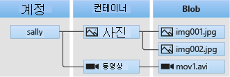

# Blob 저장소 소개

Azure Blob 저장소는 HTTP 또는 HTTPS를 통해 전 세계 어디에서든 액세스할 수 있는 다량의 구조화되지 않은 개체 데이터(예: 텍스트 또는 이진 데이터)를 저장할 수 있는 서비스입니다. Blob 저장소를 사용하여 세상에 공개적으로 표시하거나 응용 프로그램 데이터를 비공개적으로 저장할 수 있습니다.

Blob 저장소의 일반적인 사용은 다음과 같습니다.

* 브라우저에 직접 이미지 또는 문서 제공
* 분산 액세스를 위해 파일 저장
* 동영상 및 오디오 스트리밍
* 백업 및 복원, 재해 복구 및 보관을 위한 데이터 저장
* 온-프레미스 또는 Azure 호스티드 서비스에서 분석하기 위해 데이터 저장

## Blob service 개념

Blob service에는 다음 구성 요소가 포함됩니다.

* **Storage 계정:** Azure Storage에 대한 모든 액세스는 Storage 계정을 통해 수행됩니다. 이 저장소 계정은 **범용 저장소 계정(v1 또는 v2)**일 수도 있고 **Blob 저장소 계정**일 수도 있습니다. 자세한 내용은 [Azure Storage 계정 정보](../common/storage-create-storage-account.md?toc=%2fazure%2fstorage%2fblobs%2ftoc.json)를 참조하세요.

* **컨테이너:** 컨테이너는 Blob 집합 그룹화를 제공합니다. 모든 Blob은 컨테이너에 있어야 합니다. 한 계정에 포함될 수 있는 컨테이너 수에는 제한이 없습니다. 한 컨테이너에 저장될 수 있는 Blob 수에도 제한이 없습니다. 컨테이너 이름은 소문자여야 합니다.

* **Blob:** 모든 형식과 크기의 파일입니다. Azure Storage는 세 가지 유형의 Blob, 즉 블록 Blob, [페이지 Blob](storage-blob-pageblob-overview.md) 및 추가 Blob을 제공합니다.
  
    **블록 Blob* 은 문서 및 미디어 파일과 같은 텍스트 또는 이진 파일을 저장하기에 적합합니다. *추가 Blob* 은 블록으로 구성된다는 점에서 블록 Blob과 유사하지만 추가 작업에 최적화되었으므로 로깅 시나리오에 유용합니다. 단일 블록 Blob은 각각 100MB까지 최대 50,000개 블록을 포함할 수 있으며, 총 크기는 4.75TB(100MBx50,000)보다 약간 큽니다.  단일 추가 Blob은 각각 4MB까지 최대 50,000개 블록을 포함할 수 있으며, 총 크기는 195GB(4MBx50,000)보다 약간 큽니다.
  
    *페이지 Blob*은 최대 8TB 크기까지 가능하며 빈번한 읽기/쓰기 작업에 대해 더 효율적입니다. Azure Virtual Machines는 OS 및 데이터 디스크로 페이지 Blob을 사용합니다.
  
    컨테이너 및 Blob를 명명하는 세부 정보는 [컨테이너, Blob 및 메타데이터 명명 및 참조](/rest/api/storageservices/Naming-and-Referencing-Containers--Blobs--and-Metadata)를 참조하세요.

## 다음 단계

* [저장소 계정을 만드는](../common/storage-create-storage-account.md?toc=%2fazure%2fstorage%2fblobs%2ftoc.json)
* [.NET을 사용하여 Blob 저장소 시작](storage-dotnet-how-to-use-blobs.md)
* [.NET을 사용한 Azure Storage 샘플](../common/storage-samples-dotnet.md)
* [Java를 사용한 Azure Storage 샘플](../common/storage-samples-java.md)
