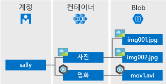

# <a name="introduction-to-azure-blob-storage"></a>Azure Blob Storage 소개

[!INCLUDE [storage-blob-concepts-include](../../../includes/storage-blob-concepts-include.md)]

## <a name="blob-storage-resources"></a>Blob Storage 리소스

Blob Storage는 다음 세 가지 유형의 리소스를 제공합니다.

- **스토리지 계정** 
- 스토리지 계정의 **컨테이너**
- 컨테이너의 **BLOB**. 

다음 다이어그램에서는 이러한 리소스 간의 관계를 보여줍니다.



### <a name="storage-accounts"></a>Storage 계정

저장소 계정은 데이터에 대해 Azure에서 고유의 네임스페이스를 제공합니다. Azure Storage 계정에 저장한 모든 개체는 고유 계정 이름을 포함하는 주소를 갖습니다. 계정 이름과 Azure Storage Blob 엔드포인트의 조합은 스토리지 계정에 있는 개체의 기본 주소를 구성합니다.

예를 들어 스토리지 계정의 이름이 *mystorageaccount*일 경우 Blob Storage의 기본 엔드포인트는 다음과 같습니다.

```
http://mystorageaccount.blob.core.windows.net 
```

저장소 계정을 만들려면 [저장소 계정 만들기](../common/storage-quickstart-create-account.md)를 참조하세요. 스토리지 계정을 자세히 알아보려면 [Azure Storage 계정 개요](../common/storage-account-overview.md?toc=%2fazure%2fstorage%2fblobs%2ftoc.json)를 참조하세요.

### <a name="containers"></a>컨테이너

컨테이너는 파일 시스템의 디렉터리와 비슷한 BLOB 세트를 구성합니다. 한 저장소 계정에 포함될 수 있는 컨테이너 수에 제한이 없으며, 컨테이너에 저장될 수 있는 Blob 수에도 제한이 없습니다. 

  > [!NOTE]
  > 컨테이너 이름은 소문자여야 합니다. 컨테이너 이름 지정에 대한 자세한 내용은 [컨테이너, Blob, 메타데이터 이름 지정 및 참조](https://docs.microsoft.com/rest/api/storageservices/Naming-and-Referencing-Containers--Blobs--and-Metadata)를 참조하세요.

### <a name="blobs"></a>Blob
 
Azure Storage는 다음 세 가지 유형의 Blob을 지원합니다.

* **블록 Blob**은 최대 4.7TB 정도의 텍스트 및 이진 데이터를 저장합니다. 블록 Blob은 개별적으로 관리할 수 있는 데이터 블록으로 구성됩니다.
* **추가 Blob**은 블록 Blob과 같이 블록으로 구성되지만 추가 작업에 최적화되어 있습니다. 추가 Blob은 가상 머신의 데이터 로깅 같은 시나리오에 적합합니다.
* **페이지 Blob**은 최대 8TB 크기의 임의 액세스 파일을 저장합니다. 페이지 Blob은 Azure Virtual Machines의 디스크로 사용되는 VHD(가상 하드 드라이브) 파일을 저장합니다. 페이지 Blob에 대한 자세한 내용은 [Azure 페이지 Blob 개요](storage-blob-pageblob-overview.md)를 참조하세요.

다양한 유형의 Blob에 대한 자세한 내용은 [블록 Blob, 추가 Blob 및 페이지 Blob 이해](https://docs.microsoft.com/rest/api/storageservices/understanding-block-blobs--append-blobs--and-page-blobs)를 참조하세요.

## <a name="move-data-to-blob-storage"></a>데이터를 Blob Storage로 이동

기존 데이터를 Blob Storage로 마이그레이션하기 위한 다양한 솔루션이 있습니다.

- **AzCopy**는 Blob Storage, 컨테이너 또는 스토리지 계정 간에 데이터를 복사하는 사용하기 쉬운 Windows 및 Linux용 명령줄 도구입니다. AzCopy에 대한 자세한 내용은 [AzCopy v10(미리 보기)으로 데이터 전송](../common/storage-use-azcopy-v10.md)을 참조하세요. 
- **Azure Storage 데이터 이동 라이브러리**는 Azure Storage 서비스 간에 데이터를 이동하기 위한 .NET 라이브러리입니다. AzCopy 유틸리티는 데이터 이동 라이브러리를 사용하여 빌드됩니다. 자세한 내용은 데이터 이동 라이브러리에 대한 [참조 문서](/dotnet/api/microsoft.azure.storage.datamovement)를 참조하세요. 
- **Azure Data Factory**는 Azure 리소스 인증에 계정 키, 공유 액세스 서명, 서비스 주체 또는 관리형 ID를 사용하여 Blob Storage 간에 데이터 복사를 지원합니다. 자세한 내용은 [Azure Data Factory를 사용하여 Azure Blob Storage 간에 데이터 복사](https://docs.microsoft.com/azure/data-factory/connector-azure-blob-storage?toc=%2fazure%2fstorage%2fblobs%2ftoc.json)를 참조하세요. 
- **Blobfuse**는 Azure Blob Storage의 가상 파일 시스템 드라이버입니다. Blobfuse를 사용하여 Linux 파일 시스템을 통해 스토리지 계정의 기존 블록 Blob 데이터에 액세스할 수 있습니다. 자세한 내용은 [blobfuse를 사용하여 Blob Storage를 파일 시스템으로 탑재하는 방법](storage-how-to-mount-container-linux.md)을 참조하세요.
- **Azure Data Box** 서비스는 큰 데이터 세트 또는 네트워크 제약 조건으로 인해 유선으로 데이터를 업로드할 수 없는 경우 온-프레미스 데이터를 Blob Storage로 전송하는 서비스입니다. 데이터 크기에 따라 Microsoft의 [Azure Data Box Disk](../../databox/data-box-disk-overview.md), [Azure Data Box](../../databox/data-box-overview.md) 또는 [Azure Data Box Heavy](../../databox/data-box-heavy-overview.md) 디바이스를 요청할 수 있습니다. 그런 다음, 해당 디바이스에 데이터를 복사하고, Microsoft에 다시 제공하여 Blob Storage에 업로드할 수 있습니다.
- **Azure Import/Export 서비스**는 대용량 데이터를 사용자의 스토리지 계정에서 사용자가 제공하는 하드 드라이브로 가져오거나 내보내는 방법을 제공합니다. 자세한 내용은 [Microsoft Azure Import/Export 서비스를 사용하여 Blob Storage에 데이터 전송](../common/storage-import-export-service.md)을 참조하세요.

## <a name="next-steps"></a>다음 단계

* [저장소 계정을 만드는](../common/storage-create-storage-account.md?toc=%2fazure%2fstorage%2fblobs%2ftoc.json)
* [Azure Storage 확장성 및 성능 목표](../common/storage-scalability-targets.md)
