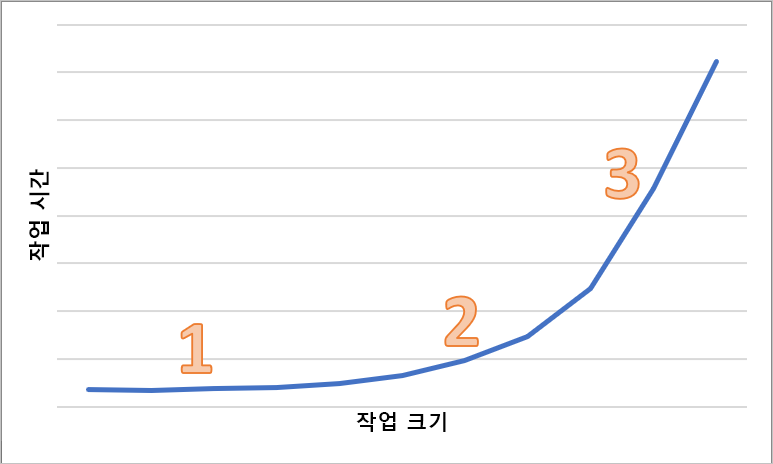

# Blob 스토리지의 대기 시간

응답 시간이라고도 하는 대기 시간은 애플리케이션에서 요청이 완료될 때까지 대기해야 하는 시간입니다. 대기 시간은 애플리케이션 성능에 직접적으로 영향을 줄 수 있습니다. 낮은 대기 시간은 신용 카드 트랜잭션을 수행하거나 웹 페이지를 로드하는 등 반복에 사용자가 있는 시나리오에서 중요합니다. 원격 분석 로깅 또는 IoT 이벤트와 같이 높은 속도로 들어오는 이벤트를 처리해야 하는 시스템에도 낮은 대기 시간이 필요합니다. 이 문서에서는 블록 Blob 작업의 대기 시간을 파악 및 측정하고, 낮은 대기 시간에 맞춰 애플리케이션을 디자인하는 방법을 설명합니다.

Azure Storage는 블록 Blob에 대한 두 가지 성능 옵션인 프리미엄과 표준을 제공합니다. 프리미엄 블록 Blob은 고성능 SSD 디스크를 통해 표준 블록 Blob보다 상당히 낮고 일관성 있는 대기 시간을 제공합니다. 자세한 내용은 [Azure Blob Storage: 핫, 쿨 및 보관 액세스 계층](storage-blob-storage-tiers.md)의 **프리미엄 성능 블록 Blob 스토리지**를 참조하세요.

## Azure Storage 대기 시간 정보

Azure Storage 대기 시간은 Azure Storage 작업의 요청 속도와 관련이 있습니다. 요청 속도는 IOPS(초당 입출력 작업 수)라고도 합니다.

요청 속도를 계산하려면 먼저 각 요청을 완료하는 데 걸리는 시간을 확인한 다음, 초당 처리할 수 있는 요청 수를 계산합니다. 예를 들어 요청을 완료하는 데 50ms(밀리초)가 걸린다고 가정합니다. 처리되지 않은 읽기 또는 쓰기 작업 1개가 있는 스레드 1개를 사용하는 애플리케이션은 20 IOPS(요청당 1초 또는 1,000ms/50ms)를 달성해야 합니다. 이론상, 스레드 수가 두 배가 되면 애플리케이션은 40 IOPS를 달성할 수 있어야 합니다. 각 스레드의 처리되지 않은 비동기 읽기 또는 쓰기 작업이 두 배가 되면 애플리케이션은 80 IOPS를 달성할 수 있어야 합니다.

실제로, 작업 예약, 컨텍스트 전환 등의 클라이언트 오버헤드로 인해 요청 속도 크기가 항상 이렇게 선형으로 조정되지는 않습니다. 서비스 쪽에서는 Azure Storage 시스템의 과부하, 사용된 스토리지 미디어의 차이, 다른 워크로드의 노이즈, 유지 관리 작업 및 기타 요소로 인해 대기 시간이 달라질 수 있습니다. 마지막으로, 클라이언트와 서버 간의 네트워크 연결이 정체, 경로 전환 또는 기타 중단으로 인해 Azure Storage 대기 시간에 영향을 줄 수 있습니다.

처리량이라고도 하는 Azure Storage 대역폭은 요청 속도와 관련이 있으며, 요청 속도(IOPS)에 요청 크기를 곱하여 계산할 수 있습니다. 예를 들어 초당 160개 요청을 가정하면 각 256KiB 데이터가 초당 40,960KiB 또는 초당 40MiB 처리량을 생성합니다.

## 블록 Blob에 대한 대기 시간 메트릭

Azure Storage는 블록 Blob에 대한 두 가지 대기 시간 메트릭을 제공합니다. 이러한 메트릭은 Azure Portal에서 확인할 수 있습니다.

- **E2E(엔드투엔드) 대기 시간**은 Azure Storage가 요청의 첫 번째 패킷을 받은 시간부터 Azure Storage가 응답의 마지막 패킷에서 클라이언트 수신 확인을 받을 시간까지의 간격을 측정합니다.

- **서버 대기 시간**은 Azure Storage가 요청의 마지막 패킷을 받은 시간부터 Azure Storage에서 응답의 첫 번째 패킷이 반환된 시간까지의 간격을 측정합니다.

다음 그림은 `Get Blob` 작업을 호출하는 샘플 워크로드의 **평균 성공 E2E 대기 시간** 및 **평균 성공 서버 대기 시간**을 보여 줍니다.

정상 조건에서는 샘플 워크로드 관련 그림과 같이 엔드투엔드 대기 시간과 서버 대기 시간 사이의 간격이 거의 없습니다.

엔드투엔드 및 서버 대기 시간 메트릭을 검토하고 엔드투엔드 대기 시간이 서버 대기 시간보다 훨씬 높은 것을 발견할 경우, 추가 대기 시간의 출처를 조사하고 해결합니다.

엔드투엔드 및 서버 대기 시간이 비슷하지만 더 낮은 대기 시간이 필요할 경우, 프리미엄 블록 Blob 스토리지로 마이그레이션하는 것이 좋습니다.

## 대기 시간에 영향을 미치는 요인

대기 시간에 영향을 주는 주요 요인은 작업 크기입니다. 네트워크를 통해 전송되고 Azure Storage에서 처리되는 데이터의 양 때문에 큰 작업을 완료하려면 더 오랜 시간이 걸립니다.

다음 다이어그램은 다양한 크기의 작업에 대한 총 시간을 보여 줍니다. 데이터의 양이 적은 경우 대기 시간 간격은 데이터 전송이 아닌 요청 처리에 주로 사용됩니다. 작업 크기가 커지면 대기 시간 간격이 약간 증가합니다(아래 다이어그램에서 1로 표시됨). 작업 크기가 좀 더 커지면 데이터 전송에 더 많은 시간이 사용되어, 총 대기 시간 간격이 요청 처리와 데이터 전송 간에 분할됩니다(아래 다이어그램에서 2로 표시됨). 작업 크기가 더욱 커지면 대기 시간 간격이 주로 데이터 전송에 사용되고 요청 처리는 거의 영향을 주지 않습니다(아래 다이어그램에서 3으로 표시됨).

동시성 및 스레딩과 같은 클라이언트 구성 요인도 대기 시간에 영향을 줍니다. 전반적인 처리량은 특정 시점에 진행 중인 스토리지 요청 수와 애플리케이션이 스레딩을 처리하는 방법에 따라 달라집니다. CPU, 메모리, 로컬 스토리지 및 네트워크 인터페이스를 비롯한 클라이언트 리소스도 대기 시간에 영향을 줄 수 있습니다.

Azure Storage 요청을 처리하려면 클라이언트 CPU 및 메모리 리소스가 필요합니다. 저성능 가상 머신 또는 시스템의 일부 런어웨이 프로세스로 인해 클라이언트가 과부하 상태이면 Azure Storage 요청을 처리하는 데 사용할 수 있는 리소스가 더 적습니다. 클라이언트 리소스가 부족하거나 경합이 발생할 경우 서버 대기 시간은 증가하지 않고 엔드투엔드 대기 시간이 증가하므로 두 메트릭 사이의 간격이 커집니다.

클라이언트와 Azure Storage 간의 네트워크 인터페이스 및 네트워크 파이프도 중요합니다. 물리적 거리 하나만으로도 중요한 요소가 될 수 있습니다. 예를 들어 클라이언트 VM이 다른 Azure 지역이나 온-프레미스에 있는 경우입니다. 네트워크 홉, ISP 라우팅 및 인터넷 상태와 같은 기타 요소도 전반적인 스토리지 대기 시간에 영향을 줄 수 있습니다.

대기 시간을 평가하려면 먼저 시나리오의 기준 메트릭을 설정합니다. 기준 메트릭은 워크로드 프로필, 애플리케이션 구성 설정, 클라이언트 리소스, 네트워크 파이프 및 기타 요인에 따라 애플리케이션 환경의 컨텍스트에서 예상 엔드투엔드 및 서버 대기 시간을 제공합니다. 기준 메트릭이 있으면 비정상 조건을 보다 쉽게 확인할 수 있습니다. 기준 메트릭을 사용하면 애플리케이션 구성 또는 VM 크기와 같은 변경된 매개변수의 영향을 관찰할 수도 있습니다.

## 다음 단계

- [Blob 스토리지의 확장성 및 성능 목표](scalability-targets.md)
- [Blob 스토리지에 대한 성능 및 확장성 검사 목록](storage-performance-checklist.md)
