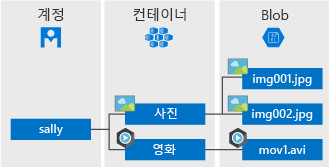

# <a name="quickstart-azure-blob-storage-client-library-for-net"></a>빠른 시작: .NET용 Azure Blob Storage 클라이언트 라이브러리

.NET용 Azure Blob Storage 클라이언트 라이브러리 시작 Azure Blob Storage는 클라우드를 위한 Microsoft의 개체 스토리지 솔루션입니다. 단계에 따라 패키지를 설치하고 기본 작업을 위한 예제 코드를 사용해 봅니다. Blob Storage는 대량의 비정형 데이터를 저장하도록 최적화되어 있습니다.

.NET용 Azure Blob Storage 클라이언트 라이브러리를 사용하여 다음을 수행합니다.

* 컨테이너 만들기
* 컨테이너에 권한 설정
* Azure Storage에 blob 만들기
* 로컬 컴퓨터에 blob 다운로드
* 컨테이너의 모든 blob 나열
* 컨테이너 삭제

[API 참조 설명서](https://docs.microsoft.com/dotnet/api/overview/azure/storage?view=azure-dotnet) | [라이브러리 소스 코드](https://github.com/Azure/azure-storage-net/tree/master/Blob) | [패키지(NuGet)](https://www.nuget.org/packages/Microsoft.Azure.Storage.Blob/) | [샘플](https://azure.microsoft.com/resources/samples/?sort=0&service=storage&platform=dotnet&term=blob)

## <a name="prerequisites"></a>필수 조건

* Azure 구독 - [체험 구독 만들기](https://azure.microsoft.com/free/)
* Azure Storage 계정 - [스토리지 계정 만들기](https://docs.microsoft.com/azure/storage/common/storage-quickstart-create-account)
* 해당 운영 체제용 [NET Core 2.1 SDK](https://dotnet.microsoft.com/download/dotnet-core) 이상

## <a name="setting-up"></a>설치

이 섹션에서는 .NET용 Azure Blob Storage 클라이언트 라이브러리를 사용하는 프로젝트를 준비합니다.

### <a name="create-the-project"></a>프로젝트 만들기

먼저 **blob-quickstart**라는 .NET Core 애플리케이션을 만듭니다.

1. 콘솔 창(예: cmd, PowerShell 또는 Bash)에서 `dotnet new` 명령을 사용하여 **blob-quickstart**라는 새 콘솔 앱을 만듭니다. 이 명령은 **Program.cs**라는 원본 파일 하나만 들어 있는 간단한 "Hello World" C# 프로젝트를 만듭니다.

   ```console
   dotnet new console -n blob-quickstart
   ```

2. 새로 만든 **blob-quickstart** 폴더로 전환하여 모두 정상인지 확인하는 앱을 빌드합니다.

   ```console
   cd blob-quickstart
   ```

   ```console
   dotnet build
   ```

이 빌드의 예상 출력은 다음과 같습니다.

```output
C:\QuickStarts\blob-quickstart> dotnet build
Microsoft (R) Build Engine version 16.0.450+ga8dc7f1d34 for .NET Core
Copyright (C) Microsoft Corporation. All rights reserved.

  Restore completed in 44.31 ms for C:\QuickStarts\blob-quickstart\blob-quickstart.csproj.
  blob-quickstart -> C:\QuickStarts\blob-quickstart\bin\Debug\netcoreapp2.1\blob-quickstart.dll

Build succeeded.
    0 Warning(s)
    0 Error(s)

Time Elapsed 00:00:03.08
```

### <a name="install-the-package"></a>패키지 설치

애플리케이션 디렉터리에서 `dotnet add package` 명령을 사용하여 .NET용 Azure Blob Storage 클라이언트 라이브러리를 설치합니다.

```console
dotnet add package Microsoft.Azure.Storage.Blob
```

### <a name="set-up-the-app-framework"></a>앱 프레임워크 설정

프로젝트 디렉터리에서

1. 편집기에 Program.cs 파일을 엽니다.
2. **Console.WriteLine** 문을 제거합니다.
3. **using** 지시문을 추가합니다.
4. 예제의 기본 코드가 상주할 **ProcessAsync** 메서드를 만듭니다.
5. **Main**에서 **ProcessAsync** 메서드를 비동기 호출합니다.

코드는 다음과 같습니다.

```csharp
using System;
using System.IO;
using System.Threading.Tasks;
using Microsoft.Azure.Storage;
using Microsoft.Azure.Storage.Blob;

namespace blob_quickstart
{
    class Program
    {
        public static void Main()
        {
            Console.WriteLine("Azure Blob Storage - .NET quickstart sample\n");

            // Run the examples asynchronously, wait for the results before proceeding
            ProcessAsync().GetAwaiter().GetResult();

            Console.WriteLine("Press any key to exit the sample application.");
            Console.ReadLine();
        }

        private static async Task ProcessAsync()
        {
        }
    }
}
```

### <a name="copy-your-credentials-from-the-azure-portal"></a>Azure Portal에서 자격 증명 복사

애플리케이션 예제는 스토리지 계정에 대한 액세스를 인증해야 합니다. 인증하려면 연결 문자열로 응용 프로그램에 저장소 계정 자격 증명을 추가합니다. 다음 단계를 수행하여 저장소 계정 자격 증명을 봅니다.

1. [Azure Portal](https://portal.azure.com)로 이동합니다.
2. 저장소 계정을 찾습니다.
3. 저장소 계정 개요의 **설정** 섹션에서 **액세스 키**를 선택합니다. 여기에서 계정 액세스 키 및 각 키의 전체 연결 문자열을 볼 수 있습니다.
4. **key1** 아래에서 **연결 문자열** 값을 찾고, **복사** 단추를 선택하여 연결 문자열을 복사합니다. 다음 단계에서 연결 문자열 값을 환경 변수에 추가합니다.

    

### <a name="configure-your-storage-connection-string"></a>저장소 연결 문자열 구성

연결 문자열을 복사한 후 애플리케이션을 실행 중인 로컬 컴퓨터의 새 환경 변수에 씁니다. 환경 변수를 설정하려면 콘솔 창을 열고 사용 중인 운영 체제의 지침을 따릅니다. `<yourconnectionstring>`을 실제 연결 문자열로 바꿉니다.

환경 변수를 추가한 후에는 실행 중인 프로그램 중에서 환경 변수를 읽어야 하는 프로그램을 다시 시작해야 할 수도 있습니다. 예를 들어 편집기로 Visual Studio를 사용하는 경우 Visual Studio를 다시 시작한 후 예제를 실행합니다.

#### <a name="windows"></a>Windows

```cmd
setx STORAGE_CONNECTION_STRING "<yourconnectionstring>"
```

#### <a name="linux"></a>Linux

```bash
export STORAGE_CONNECTION_STRING="<yourconnectionstring>"
```

#### <a name="macos"></a>MacOS

```bash
export STORAGE_CONNECTION_STRING="<yourconnectionstring>"
```

## <a name="object-model"></a>개체 모델

Azure Blob Storage는 대량의 비정형 데이터를 저장하도록 최적화되어 있습니다. 비정형 데이터는 텍스트 또는 이진 데이터와 같은 특정 데이터 모델 또는 정의를 따르지 않는 데이터입니다. Blob Storage는 다음 세 가지 유형의 리소스를 제공합니다.

* 스토리지 계정
* 스토리지 계정의 컨테이너
* 컨테이너의 BLOB

다음 다이어그램에서는 이러한 리소스 간의 관계를 보여줍니다.



다음 .NET 클래스를 사용하여 이러한 리소스와 상호 작용합니다.

* [CloudStorageAccount](/dotnet/api/microsoft.azure.storage.cloudstorageaccount): **CloudStorageAccount** 클래스는 Azure Storage 계정을 나타냅니다. 이 클래스를 사용하여 계정 액세스 키를 통한 Blob Storage 액세스 권한을 부여합니다.
* [CloudBlobClient](/dotnet/api/microsoft.azure.storage.blob.cloudblobclient): **CloudBlobClient** 클래스는 코드에서 Blob service에 대한 액세스 지점을 제공합니다.
* [CloudBlobContainer](/dotnet/api/microsoft.azure.storage.blob.cloudblobcontainer): **CloudBlobContainer** 클래스는 코드에서 Blob 컨테이너를 나타냅니다.
* [CloudBlockBlob](//dotnet/api/microsoft.azure.storage.blob.cloudblockblob): **CloudBlockBlob** 개체는 코드에서 블록 Blob을 나타냅니다. 블록 Blob은 개별적으로 관리할 수 있는 데이터 블록으로 구성됩니다.

## <a name="code-examples"></a>코드 예제

이 예제 코드 조각은 .NET용 Azure Blob Storage 클라이언트 라이브러리를 사용하여 다음을 수행하는 방법을 보여 줍니다.

   * [클라이언트 인증](#authenticate-the-client)
   * [컨테이너 만들기](#create-a-container)
   * [컨테이너에 권한 설정](#set-permissions-on-a-container)
   * [컨테이너에 Blob 업로드](#upload-blobs-to-a-container)
   * [컨테이너의 Blob 나열](#list-the-blobs-in-a-container)
   * [Blob 다운로드](#download-blobs)
   * [컨테이너 삭제](#delete-a-container)

### <a name="authenticate-the-client"></a>클라이언트 인증

아래 코드에서는 환경 변수에 스토리지 계정을 가리키는 [CloudStorageAccount](/dotnet/api/microsoft.azure.storage.cloudstorageaccount?view=azure-dotnet) 개체를 만들도록 구문 분석될 수 있는 연결 문자열이 포함되는지 확인합니다. 연결 문자열이 유효한지 확인하려면 [TryParse](/dotnet/api/microsoft.azure.storage.cloudstorageaccount.tryparse?view=azure-dotnet) 메서드를 사용합니다. **TryParse**가 성공적인 경우 *storageAccount* 변수를 초기화하고 **true**를 반환합니다.

이 코드를 **ProcessAsync** 메서드 안에 추가합니다.

```csharp
// Retrieve the connection string for use with the application. The storage 
// connection string is stored in an environment variable on the machine 
// running the application called STORAGE_CONNECTION_STRING. If the 
// environment variable is created after the application is launched in a 
// console or with Visual Studio, the shell or application needs to be closed
// and reloaded to take the environment variable into account.
string storageConnectionString = Environment.GetEnvironmentVariable("STORAGE_CONNECTION_STRING");

// Check whether the connection string can be parsed.
CloudStorageAccount storageAccount;
if (CloudStorageAccount.TryParse(storageConnectionString, out storageAccount))
{
    // If the connection string is valid, proceed with operations against Blob
    // storage here.
    // ADD OTHER OPERATIONS HERE
}
else
{
    // Otherwise, let the user know that they need to define the environment variable.
    Console.WriteLine(
        "A connection string has not been defined in the system environment variables. " +
        "Add an environment variable named 'STORAGE_CONNECTION_STRING' with your storage " +
        "connection string as a value.");
    Console.WriteLine("Press any key to exit the application.");
    Console.ReadLine();
}
```

> [!NOTE]
> 이 문서의 나머지 작업을 수행하려면 위 코드의 **// ADD OTHER OPERATIONS HERE**를 다음 섹션의 코드 조각으로 바꿉니다.

### <a name="create-a-container"></a>컨테이너 만들기

컨테이너를 만들려면 먼저 스토리지 계정의 Blob Storage를 가리키는 [CloudBlobClient](/dotnet/api/microsoft.azure.storage.blob.cloudblobclient) 개체의 인스턴스를 만듭니다. 다음으로 [CloudBlobContainer](/dotnet/api/microsoft.azure.storage.blob.cloudblobcontainer) 개체의 인스턴스를 만든 다음, 컨테이너를 만듭니다.

이 경우 코드는 [CreateAsync](/dotnet/api/microsoft.azure.storage.blob.cloudblobcontainer.createasync) 메서드를 호출하여 컨테이너를 만듭니다. GUID 값은 고유한지 확인하기 위해 컨테이너 이름에 추가됩니다. 프로덕션 환경에서 컨테이너가 존재하지 않는 경우에만 [CreateIfNotExistsAsync](/dotnet/api/microsoft.azure.storage.blob.cloudblobcontainer.createifnotexistsasync) 메서드를 사용하여 컨테이너를 만듭니다.

> [!IMPORTANT]
> 컨테이너 이름은 소문자여야 합니다. 컨테이너 및 Blob 이름 지정에 대한 자세한 내용은 [컨테이너, Blob, 메타데이터 이름 지정 및 참조](https://docs.microsoft.com/rest/api/storageservices/naming-and-referencing-containers--blobs--and-metadata)를 참조하세요.

```csharp
// Create the CloudBlobClient that represents the 
// Blob storage endpoint for the storage account.
CloudBlobClient cloudBlobClient = storageAccount.CreateCloudBlobClient();

// Create a container called 'quickstartblobs' and 
// append a GUID value to it to make the name unique.
CloudBlobContainer cloudBlobContainer = 
    cloudBlobClient.GetContainerReference("quickstartblobs" + 
        Guid.NewGuid().ToString());
await cloudBlobContainer.CreateAsync();
```

### <a name="set-permissions-on-a-container"></a>컨테이너에 권한 설정

컨테이너의 모든 Blob이 공개되도록 컨테이너에 권한을 설정합니다. Blob이 공용인 경우 모든 클라이언트에서 익명으로 액세스할 수 있습니다.

```csharp
// Set the permissions so the blobs are public.
BlobContainerPermissions permissions = new BlobContainerPermissions
{
    PublicAccess = BlobContainerPublicAccessType.Blob
};
await cloudBlobContainer.SetPermissionsAsync(permissions);
```

### <a name="upload-blobs-to-a-container"></a>컨테이너에 Blob 업로드

다음 코드 조각은 이전 섹션에서 만든 컨테이너에서 [GetBlockBlobReference](/dotnet/api/microsoft.azure.storage.blob.cloudblobcontainer.getblockblobreference) 메서드를 호출하여 **CloudBlockBlob** 개체에 대한 참조를 가져옵니다. 그런 다음, [UploadFromFileAsync](/dotnet/api/microsoft.azure.storage.blob.cloudblockblob.uploadfromfileasync) 메서드를 호출하여 선택한 로컬 파일을 Blob에 업로드합니다. 이 메서드는 Blob이 없는 경우 만들고, Blob이 있는 경우 덮어씁니다.

```csharp
// Create a file in your local MyDocuments folder to upload to a blob.
string localPath = Environment.GetFolderPath(Environment.SpecialFolder.MyDocuments);
string localFileName = "QuickStart_" + Guid.NewGuid().ToString() + ".txt";
string sourceFile = Path.Combine(localPath, localFileName);
// Write text to the file.
File.WriteAllText(sourceFile, "Hello, World!");

Console.WriteLine("Temp file = {0}", sourceFile);
Console.WriteLine("Uploading to Blob storage as blob '{0}'", localFileName);

// Get a reference to the blob address, then upload the file to the blob.
// Use the value of localFileName for the blob name.
CloudBlockBlob cloudBlockBlob = cloudBlobContainer.GetBlockBlobReference(localFileName);
await cloudBlockBlob.UploadFromFileAsync(sourceFile);
```

### <a name="list-the-blobs-in-a-container"></a>컨테이너의 Blob 나열

[ListBlobsSegmentedAsync](/dotnet/api/microsoft.azure.storage.blob.cloudblobcontainer.listblobssegmentedasync) 메서드를 사용하여 컨테이너의 Blob을 나열합니다. 이 경우 하나의 Blob만 컨테이너에 추가되었으므로 나열된 작업은 하나의 해당 Blob만 반환합니다.

한 번의 호출에 반환할 너무 많은 Blob이 있는 경우(기본적으로 5000개 초과) **ListBlobsSegmentedAsync** 메서드는 총 결과 집합 및 연속 토큰의 세그먼트를 반환합니다. Blob의 다음 세그먼트를 검색하려면 연속 토큰이 Null이 될 때까지 이전 호출 등에서 반환된 연속 토큰을 제공합니다. Null 연속 토큰은 모든 Blob이 검색되었음을 나타냅니다. 이 코드는 모범 사례를 위해 연속 토큰을 사용하는 방법을 보여 줍니다.

```csharp
// List the blobs in the container.
Console.WriteLine("List blobs in container.");
BlobContinuationToken blobContinuationToken = null;
do
{
    var results = await cloudBlobContainer.ListBlobsSegmentedAsync(null, blobContinuationToken);
    // Get the value of the continuation token returned by the listing call.
    blobContinuationToken = results.ContinuationToken;
    foreach (IListBlobItem item in results.Results)
    {
        Console.WriteLine(item.Uri);
    }
} while (blobContinuationToken != null); // Loop while the continuation token is not null.

```

### <a name="download-blobs"></a>Blob 다운로드

[DownloadToFileAsync](/dotnet/api/microsoft.azure.storage.blob.cloudblob.downloadtofileasync) 메서드를 사용하여 이전에 만든 Blob을 로컬 파일 시스템에 다운로드합니다. 예제 코드는 로컬 파일 시스템에서 두 파일을 볼 수 있도록 Blob 이름에 "_DOWNLOADED"의 접미사를 추가합니다.

```csharp
// Download the blob to a local file, using the reference created earlier.
// Append the string "_DOWNLOADED" before the .txt extension so that you 
// can see both files in MyDocuments.
string destinationFile = sourceFile.Replace(".txt", "_DOWNLOADED.txt");
Console.WriteLine("Downloading blob to {0}", destinationFile);
await cloudBlockBlob.DownloadToFileAsync(destinationFile, FileMode.Create);
```

### <a name="delete-a-container"></a>컨테이너 삭제

다음 코드는 [CloudBlobContainer.DeleteAsync](/dotnet/api/microsoft.azure.storage.blob.cloudblobcontainer.deleteasync)를 사용하여 전체 컨테이너를 삭제하여 앱이 만든 리소스를 정리합니다. 원하는 경우 로컬 파일을 삭제할 수도 있습니다.

```csharp
Console.WriteLine("Press the 'Enter' key to delete the example files, " +
    "example container, and exit the application.");
Console.ReadLine();
// Clean up resources. This includes the container and the two temp files.
Console.WriteLine("Deleting the container");
if (cloudBlobContainer != null)
{
    await cloudBlobContainer.DeleteIfExistsAsync();
}
Console.WriteLine("Deleting the source, and downloaded files");
File.Delete(sourceFile);
File.Delete(destinationFile);
```

## <a name="run-the-code"></a>코드 실행

이 앱은 로컬 **MyDocuments** 폴더에 테스트 파일을 만들고 Blob Storage에 업로드합니다. 그런 다음, 컨테이너에 Blob을 나열하고 이전 파일과 새 파일을 비교할 수 있도록 새 이름으로 해당 파일을 다운로드합니다.

편집기로 Visual Studio를 사용하는 경우 **F5** 키를 눌러 실행할 수 있습니다.

그렇지 않으면 애플리케이션 디렉터리로 이동하여 애플리케이션을 빌드 및 실행합니다.

```console
dotnet build
```

```console
dotnet run
```

예제 애플리케이션의 출력은 다음 예제와 비슷합니다.

```output
Azure Blob storage - .NET Quickstart example

Created container 'quickstartblobs33c90d2a-eabd-4236-958b-5cc5949e731f'

Temp file = C:\Users\myusername\Documents\QuickStart_c5e7f24f-a7f8-4926-a9da-96
97c748f4db.txt
Uploading to Blob storage as blob 'QuickStart_c5e7f24f-a7f8-4926-a9da-9697c748f
4db.txt'

Listing blobs in container.
https://storagesamples.blob.core.windows.net/quickstartblobs33c90d2a-eabd-4236-
958b-5cc5949e731f/QuickStart_c5e7f24f-a7f8-4926-a9da-9697c748f4db.txt

Downloading blob to C:\Users\myusername\Documents\QuickStart_c5e7f24f-a7f8-4926
-a9da-9697c748f4db_DOWNLOADED.txt

Press any key to delete the example files and example container.
```

**Enter** 키를 누르면 애플리케이션은 스토리지 컨테이너 및 파일을 삭제합니다. 삭제하기 전에 **MyDocuments** 폴더에서 두 파일을 확인합니다. 이 파일을 열어 동일한지 확인할 수 있습니다. 콘솔 창에서 Blob의 URL을 복사하고 브라우저에 붙여넣어 Blob의 콘텐츠를 봅니다.

파일을 확인한 후에 아무 키나 눌러 데모를 완료하고 테스트 파일을 삭제합니다.

## <a name="next-steps"></a>다음 단계

이 빠른 시작에서는 .NET을 사용하여 Blob을 업로드, 다운로드 및 나열하는 방법을 배웠습니다.

Blob Storage에 이미지를 업로드하는 웹앱을 만드는 방법을 알아보려면 다음을 진행합니다.

> [!div class="nextstepaction"]
> [이미지 업로드 및 처리](storage-upload-process-images.md)

* .NET Core에 대해 자세히 알아보려면 [10분 안에 .NET 시작](https://www.microsoft.com/net/learn/get-started/)을 참조하세요.
* Windows용 Visual Studio에서 배포할 수 있는 샘플 애플리케이션을 탐색하려면 [Azure Blob Storage를 사용하여 .NET 사진 갤러리 웹 애플리케이션 샘플](https://azure.microsoft.com/resources/samples/storage-blobs-dotnet-webapp/)을 참조하세요.
