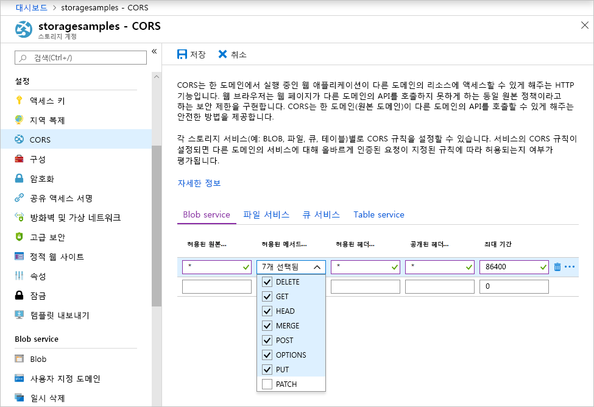

<!-- Customer intent: As a web application developer I want to interface with Azure Blob storage entirely on the client so that I can build a SPA application that is able to upload and delete files on blob storage. -->

# <a name="quickstart-upload-list-and-delete-blobs-using-javascripthtml-in-the-browser"></a>빠른 시작: 브라우저에서 JavaScript/HTML을 사용하여 Blob 업로드, 나열 및 삭제

이 빠른 시작은 브라우저에서 전적으로 실행되는 코드의 Blob을 관리하는 방법을 보여줍니다. 여기에 사용된 방법은 Blob Storage 계정에 대한 보호된 액세스를 보장하도록 필요한 보안 조치를 사용하는 방법을 보여줍니다. 이 빠른 시작을 완료하려면 [Azure 구독](https://azure.microsoft.com/free/?WT.mc_id=A261C142F)이 필요합니다.

## <a name="prerequisites"></a>필수 조건

[!INCLUDE [storage-quickstart-prereq-include](../../../includes/storage-quickstart-prereq-include.md)]

## <a name="setting-up-storage-account-cors-rules"></a>저장소 계정 CORS 규칙 설정 
웹 응용 프로그램이 클라이언트에서 Blob Storage에 액세스하려면 [원본 간 리소스 공유](https://docs.microsoft.com/rest/api/storageservices/cross-origin-resource-sharing--cors--support-for-the-azure-storage-services) 또는 CORS를 사용하도록 계정을 구성해야 합니다. 

Azure Portal로 돌아가서 저장소 계정을 선택합니다. 새 CORS 규칙을 정의하려면 **설정** 섹션으로 돌아가서 **CORS** 링크를 클릭합니다. 그런 다음, **추가** 단추를 클릭하여 **CORS 규칙 추가** 창을 엽니다. 이 빠른 시작의 경우 공개 CORS 규칙을 만듭니다.



다음 표에서는 각 CORS 설정을 설명하고 규칙을 정의하는 데 사용되는 값을 설명합니다.

|설정  |값  | 설명 |
|---------|---------|---------|
| 허용된 원본 | * | 허용 가능한 원본으로 설정된 도메인의 쉼표로 구분된 목록을 허용합니다. 값을 `*`로 설정하면 저장소 계정에 대한 모든 도메인 액세스가 허용됩니다. |
| 허용되는 동사     | delete, get, head, merge, post, options, put | 저장소 계정에 대해 실행하도록 허용된 HTTP 동사를 나열합니다. 이 빠른 시작에서는 사용 가능한 옵션을 모두 선택합니다. |
| 허용된 헤더 | * | 저장소 계정에서 허용하는 요청 헤더(접두 헤더 포함)의 목록을 정의합니다. 값을 `*`로 설정하면 모든 헤더에 액세스할 수 있습니다. |
| 노출된 헤더 | * | 계정에서 허용되는 응답 헤더를 나열합니다. 값을 `*`로 설정하면 계정에서 모든 헤더를 보낼 수 있습니다.  |
| 최대 기간(초) | 86400 | 브라우저에서 실행 전 OPTIONS 요청을 캐시하는 최대 시간입니다. 값이 *86400*이면 하루 동안 캐시를 유지할 수 있습니다. |

> [!IMPORTANT]
> 프로덕션 환경에서 사용하는 모든 설정이 보안 액세스를 유지하기 위해 저장소 계정에 필요한 최소한의 액세스 권한을 노출하는지 확인하십시오. 여기에 설명된 CORS 설정은 관대한 보안 정책을 정의하므로 빠른 시작에 적합합니다. 하지만 이러한 설정은 실제 컨텍스트에서는 적합하지 않습니다.

그런 다음, Azure Cloud Shell을 사용하여 보안 토큰을 만듭니다.

[!INCLUDE [Open the Azure cloud shell](../../../includes/cloud-shell-try-it.md)]

## <a name="create-a-shared-access-signature"></a>공유 액세스 서명 만들기
SAS(공유 액세스 서명)는 Blob Storage에 대한 요청을 인증하기 위해 브라우저에서 실행되는 코드에 사용됩니다. SAS를 사용하면 클라이언트는 계정 액세스 키 또는 연결 문자열 없이 저장소 리소스에 대한 액세스 권한을 부여할 수 있습니다. SAS에 대한 자세한 내용은 [SAS(공유 액세스 서명) 사용](../common/storage-dotnet-shared-access-signature-part-1.md)을 참조하세요.

SAS는 Azure Cloud Shell 또는 Azure Storage Explorer를 통해 Azure CLI를 사용하여 만들 수 있습니다. 다음 표에서는 CLI를 사용하여 SAS를 생성하기 위해 값을 제공해야 하는 매개 변수에 대해 설명합니다.

| 매개 변수      |설명  | Placeholder |
|----------------|-------------|-------------|
| *expiry*       | YYYY-MM-DD 형식의 액세스 토큰 만료 날짜입니다. 빠른 시작에서 사용할 내일 날짜를 입력합니다. | *FUTURE_DATE* |
| *account-name* | 저장소 계정 이름입니다. 이전 단계에서 따로 설정한 이름을 사용합니다. | *YOUR_STORAGE_ACCOUNT_NAME* |
| *account-key*  | 저장소 계정 키입니다. 이전 단계에 따로 설정한 키를 사용합니다. | *YOUR_STORAGE_ACCOUNT_KEY* |

다음 스크립트는 Azure CLI를 사용하여 JavaScript Blob 서비스에 전달할 수 있는 SAS를 만듭니다.

> [!NOTE]
> 최상의 결과를 얻으려면 Azure Cloud Shell에 명령을 붙여넣기 전에 매개 변수 사이에 있는 여분의 공백을 제거합니다.

```bash
az storage account generate-sas
                    --permissions racwdl
                    --resource-types sco
                    --services b
                    --expiry FUTURE_DATE
                    --account-name YOUR_STORAGE_ACCOUNT_NAME
                    --account-key YOUR_STORAGE_ACCOUNT_KEY
```
약간 복잡한 각 매개 변수 뒤에 일련의 값이 있습니다. 이 매개 변수 값은 해당 권한의 첫 문자에서 가져옵니다. 다음 표는 값이 발생한 위치를 설명합니다. 

| 매개 변수        | 값   | 설명  |
|------------------|---------|---------|
| *사용 권한*    | racwdl  | 이 SAS는 *읽기*, *추가*, *만들기*, *쓰기*, *삭제* 및 *나열* 기능을 허용합니다. |
| *resource-types* | sco     | SAS의 영향을 받는 리소스는 서비스, 컨테이너 및 개체입니다. |
| *services*       | b       | SAS의 영향을 받는 서비스는 *Blob* 서비스입니다. |

SAS가 생성되었으니 콘솔에 반환된 값을 텍스트 편집기에 복사합니다. 이 값은 이후 단계에서 사용됩니다.

> [!IMPORTANT]
> 프로덕션 환경에서는 항상 SSL을 사용하여 SAS 토큰을 전달합니다. 또한 SAS 토큰은 서버에서 생성되어 HTML 페이지로 전송되고 Azure Blob Storage로 다시 전달됩니다. 한 가지 고려할 수 있는 방법은 serverless 함수를 사용하여 SAS 토큰을 생성하는 것입니다. Azure Portal에는 JavaScript 함수로 SAS를 생성하는 기능이 있는 함수 템플릿이 포함되어 있습니다.

## <a name="implement-the-html-page"></a>HTML 페이지 구현

### <a name="set-up-the-web-application"></a>웹 애플리케이션 설정
Azure Storage JavaScript 클라이언트 라이브러리는 파일 시스템에서 직접 작동하지 않으므로 웹 서버에서 제공해야 합니다. 따라서 다음 단계에서는 Node.js로 간단한 로컬 웹 서버를 사용하는 방법에 대해 자세히 설명합니다.

> [!NOTE]
> 이 섹션에서는 Node.js가 컴퓨터에 설치되어 있어야 하는 로컬 웹 서버를 만드는 방법을 보여줍니다. Node.js를 설치하지 않으려면 로컬 웹 서버를 실행하는 다른 방법을 사용할 수 있습니다.

먼저 프로젝트에 사용할 새 폴더를 만들고 이름을 *azure-blobs-javascript*라고 지정합니다. 그런 다음, *azure-blobs-javascript* 폴더에서 명령 프롬프트를 열고 다음 명령을 입력하여 애플리케이션이 웹 서버 모듈을 설치하도록 준비합니다.

```bash
npm init -y
```
*init*을 실행하면 웹 서버 모듈 설치에 도움이 되는 파일이 추가됩니다. 모듈을 설치하려면 다음 명령을 입력합니다.

```bash
npm i http-server
```
그런 다음, *package.json* 파일을 편집하고 기존 *scripts* 정의를 다음 코드 조각으로 바꿉니다.

```javascript
"scripts": {
    "start": "http-server"
}
```
마지막으로 명령 프롬프트에 `npm start`를 입력하여 웹 서버를 시작합니다.

```bash
npm start
```

### <a name="get-the-blob-storage-client-library"></a>Blob Storage 클라이언트 라이브러리 가져오기
[JavaScript 클라이언트 라이브러리를 다운로드](https://aka.ms/downloadazurestoragejs)하고 zip의 내용을 추출한 다음 *bundle* 폴더의 스크립트 파일을 *scripts* 폴더에 넣습니다.

### <a name="add-the-client-script-reference-to-the-page"></a>페이지에 클라이언트 스크립트 참조 추가
*azure-blobs-javascript* 폴더의 루트에 HTML 페이지를 만들고 *index.html*이라고 이름을 지정합니다. 페이지가 만들어지면 다음 태그를 페이지에 추가합니다.

```html
<!DOCTYPE html>
<html>
    <body>
        <button id="create-button">Create Container</button>

        <input type="file" id="fileinput" />
        <button id="upload-button">Upload</button>

        <button id="list-button">List</button>
        
        <button id="delete-button">Delete</button>
    </body>
    <script src="scripts/azure-storage.blob.min.js" charset="utf-8"></script>
    <script>
        // Blob-related code goes here
    </script>
</html>
```
이 태그는 페이지에 다음을 추가합니다.

- *scripts/azure-storage.blob.js*에 대한 참조
- 컨테이너를 작성하고, Blob을 업로드, 나열 및 삭제하는 데 사용되는 단추
- 파일을 업로드하는 데 사용되는 *INPUT* 요소
- 저장소 관련 코드를 위한 자리 표시자

### <a name="create-an-instance-of-blobservice"></a>BlobService의 인스턴스 만들기 
[BlobService](https://azure.github.io/azure-storage-node/BlobService.html)는 Azure Blob Storage에 대한 인터페이스를 제공합니다. 서비스 인스턴스를 만들려면 이전 단계에서 만든 저장소 계정 이름과 SAS를 제공해야 합니다.

```javascript
const account = {
    name: YOUR_STORAGE_ACCOUNT_NAME,
    sas:  YOUR_SAS
};

const blobUri = 'https://' + account.name + '.blob.core.windows.net';
const blobService = AzureStorage.Blob.createBlobServiceWithSas(blobUri, account.sas);
```

### <a name="create-a-blob-container"></a>Blob 컨테이너 만들기
Blob 서비스가 생성되면 이제 업로드된 Blob을 보유할 새 컨테이너를 만들 수 있습니다. [createContainerIfNotExists](https://azure.github.io/azure-storage-node/BlobService.html#createContainerIfNotExists__anchor) 메서드는 새 컨테이너를 만들고 컨테이너가 이미 있으면 오류를 반환하지 않습니다.

```javascript
document.getElementById('create-button').addEventListener('click', () => {

    blobService.createContainerIfNotExists('mycontainer',  (error, container) => {
        if (error) {
            // Handle create container error
        } else {
            console.log(container.name);
        }
    });

});
```

### <a name="upload-a-blob"></a>Blob 업로드
HTML 양식의 Blob을 업로드하려면 *INPUT* 요소에서 선택한 파일에 대한 참조를 가져옵니다. 선택한 파일은 요소의 *형식*이 *파일*로 설정된 경우 `files` 배열을 통해 사용할 수 있습니다.

스크립트에서 HTML 요소를 참조하고 선택한 파일을 Blob 서비스에 전달할 수 있습니다.

```javascript
document.getElementById('upload-button').addEventListener('click', () => {

    const file = document.getElementById('fileinput').files[0];

    blobService.createBlockBlobFromBrowserFile('mycontainer', 
                                                file.name, 
                                                file, 
                                                (error, result) => {
                                                    if(error) {
                                                        // Handle blob error
                                                    } else {
                                                        console.log('Upload is successful');
                                                    }
                                                });

});
```

[createBlockBlobFromBrowserFile](https://azure.github.io/azure-storage-node/BlobService.html#createBlockBlobFromBrowserFile__anchor) 메서드는 브라우저 파일을 직접 사용하여 Blob 컨테이너에 업로드합니다.

### <a name="list-blobs"></a>Blob 나열
Blob 컨테이너에 파일을 업로드하면 [listBlobsSegmented](https://azure.github.io/azure-storage-node/BlobService.html#listBlobsSegmented__anchor) 메서드를 사용하여 컨테이너의 Blob 목록에 액세스합니다.

```javascript
document.getElementById('list-button').addEventListener('click', () => {

    blobService.listBlobsSegmented('mycontainer', null, (error, results) => {
        if (error) {
            // Handle list blobs error
        } else {
            results.entries.forEach(blob => {
                console.log(blob.name);
            });
        }
    });
    
});
```

*listBlobsSegmented* 메서드는 Blob의 컬렉션을 반환합니다. 기본적으로 컬렉션 수량은 5,000개의 Blob이지만 이 값을 필요에 맞게 조정할 수 있습니다. [연속 샘플](https://github.com/Azure/azure-storage-node/blob/master/examples/samples/continuationsample.js#L132)은 많은 수의 Blob을 사용하는 방법과 클라이언트 라이브러리에서 페이징을 지원하는 방법을 보여줍니다. 


### <a name="delete-blobs"></a>Blob 삭제
업로드한 Blob은 [deleteBlobIfExists](https://azure.github.io/azure-storage-node/BlobService.html#deleteBlobIfExists__anchor)를 호출하여 삭제할 수 있습니다.

```javascript
document.getElementById('delete-button').addEventListener('click', () => {

    var blobName = YOUR_BLOB_NAME;
    blobService.deleteBlobIfExists('mycontainer', blobName, (error, result) => {
        if (error) {
            // Handle delete blob error
        } else {
            console.log('Blob deleted successfully');
        }
    });
    
});
```
> [!WARNING]
> 이 코드 샘플이 작동하려면 *blobName*에 문자열 값을 제공해야 합니다.

## <a name="clean-up-resources"></a>리소스 정리
빠른 시작 중에 만든 리소스를 정리하려면 [Azure Portal](https://portal.azure.com)로 돌아가서 저장소 계정을 선택합니다. 선택한 후에는 **개요 > 스토리지 계정 삭제**로 이동하여 스토리지 계정을 삭제할 수 있습니다.

## <a name="next-steps"></a>다음 단계
샘플을 탐색하면서 파일 업로드 중에 진행률을 보고하고 Blob을 다운로드하는 방법을 알아봅니다.

> [!div class="nextstepaction"]
> [Blob Storage 클라이언트 라이브러리](https://github.com/Azure/azure-storage-node/tree/master/browser)
