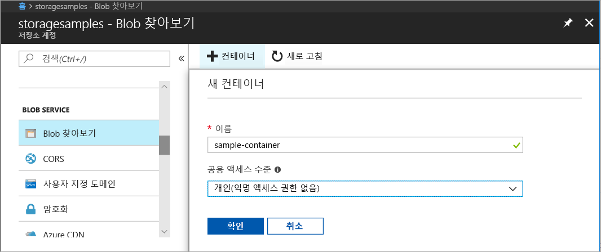
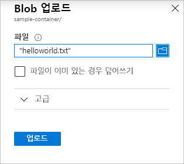
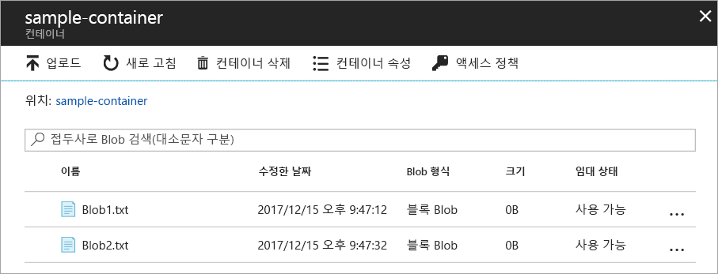
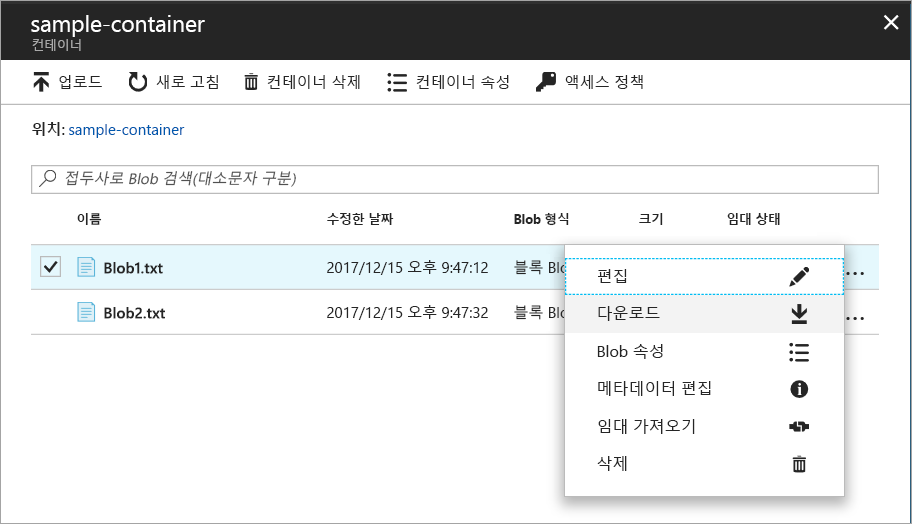
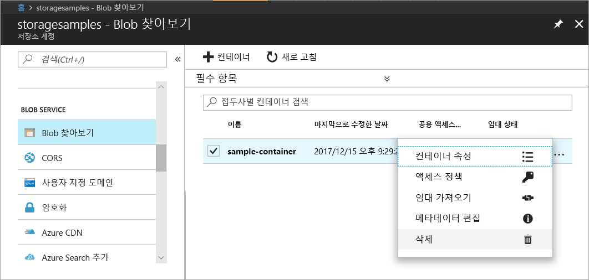

# 빠른 시작: Azure Portal을 사용하여 BLOB 업로드, 다운로드 및 나열

이 빠른 시작에서는 [Azure Portal](https://portal.azure.com/)을 사용하여 Azure Storage에 컨테이너를 만들고 해당 컨테이너에서 블록 Blob을 업로드 및 다운로드하는 방법을 알아봅니다.

## 필수 조건

Azure 구독이 아직 없는 경우 시작하기 전에 [체험 계정](https://azure.microsoft.com/free/?WT.mc_id=A261C142F)을 만듭니다.

[!INCLUDE [storage-create-account-portal-include](../../../includes/storage-create-account-portal-include.md)]

## 컨테이너 만들기

Azure Portal에 컨테이너를 만들려면 다음 단계를 수행합니다.

1. Azure Portal의 새 저장소 계정으로 이동합니다.
2. 저장소 계정의 왼쪽 메뉴에서 **Blob Service** 섹션까지 스크롤하고 **BLOB 찾아보기**를 선택합니다.
3. **컨테이너 추가** 단추를 클릭합니다.
4. 새 컨테이너 이름을 입력합니다. 컨테이너 이름 소문자로, 문자 또는 숫자로 시작해야 하며 문자, 숫자 및 대시(-) 문자만 포함할 수 있습니다. 컨테이너 및 Blob 이름에 대한 자세한 내용은 [컨테이너, Blob, 메타데이터 이름 지정 및 참조](https://docs.microsoft.com/rest/api/storageservices/naming-and-referencing-containers--blobs--and-metadata)를 참조하세요.
5. 컨테이너에 대한 공용 액세스 수준을 설정합니다. 기본 수준은 **개인(익명 액세스 없음)** 입니다.
6. **확인**을 클릭하여 컨테이너를 만듭니다.

    

## 블록 Blob 업로드

블록 blob 데이터는 Blob을 만들기 위해 조합한 데이터 블록으로 구성됩니다. Blob 저장소를 사용하는 대부분의 시나리오에서는 블록 Blob을 사용합니다. 블록 Blob은 텍스트와, 파일, 이미지 및 비디오 같은 바이너리 데이터를 클라우드에 저장하는 데 적합합니다.  이 빠른 시작에서는 블록 Blob 작업 방법을 보여 줍니다. 

블록 Blob을 Azure Portal의 새 컨테이너에 업로드하려면 다음 단계를 수행합니다.

1. Azure Portal에서 이전 섹션에서 만든 컨테이너로 이동합니다.
2. 컨테이너를 선택하여 그 안에 있는 BLOB 목록을 표시합니다. 이 경우 새 컨테이너를 만들었기 때문에 아직 BLOB이 들어 있지 않습니다.
3. **업로드** 단추를 클릭하여 BLOB을 컨테이너에 업로드합니다.
4. 로컬 파일 시스템을 탐색하여 블록 Blob으로 업로드할 파일을 찾고 **업로드**를 클릭합니다.
     
    

5. 이렇게 원하는 만큼의 BLOB을 업로드합니다. 이제 컨테이너 안에 새 BLOB 목록이 나타납니다.

    

## 블록 Blob 다운로드

블록 Blob을 다운로드하여 브라우저에 표시하거나 로컬 파일 시스템에 저장할 수 있습니다. 블록 Blob을 다운로드하려면 다음 단계를 수행합니다.

1. 이전 섹션에서 업로드한 BLOB 목록으로 이동합니다. 
2. 다운로드하려는 BLOB을 선택합니다.
3. **자세히** 단추(**...**)를 마우스 오른쪽 단추로 클릭하고 **다운로드**를 선택합니다. 

## 리소스 정리

이 빠른 시작에서 만든 리소스를 제거하려면 간단히 컨테이너를 삭제하면 됩니다. 컨테이너의 모든 BLOB도 삭제됩니다.

컨테이너를 삭제하려면

1. Azure Portal에서 저장소 계정의 컨테이너 목록으로 이동합니다.
2. 삭제할 컨테이너를 선택합니다.
3. **자세히** 단추(**...**)를 마우스 오른쪽 단추로 클릭하고 **삭제**를 선택합니다.
4. 컨테이너 삭제를 확인합니다.

       

## 다음 단계

이 빠른 시작 가이드에서는 .NET을 사용하여 로컬 디스크와 Azure Blob Storage 간에 파일을 전송하는 방법을 알아보았습니다. Blob Storage를 사용하는 방법을 자세히 알아보려면 계속해서 Blob Storage 방법을 진행하세요.

> [!div class="nextstepaction"]
> [Blob Storage 작업 방법](storage-dotnet-how-to-use-blobs.md)

