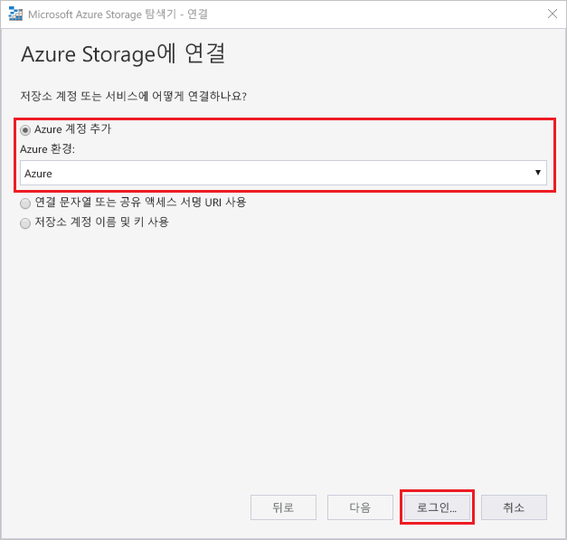
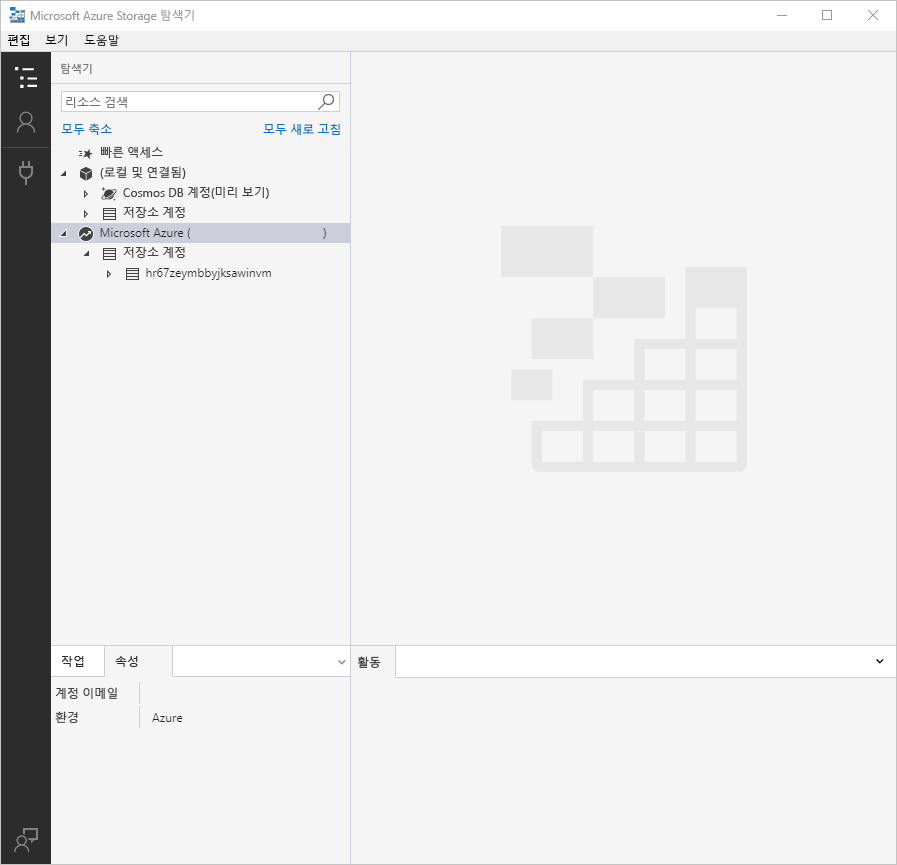
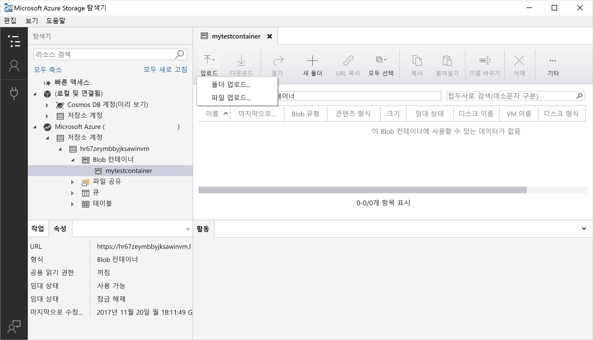
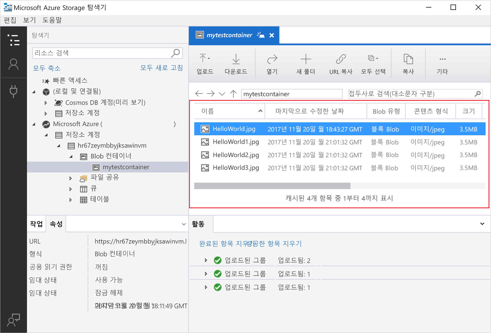
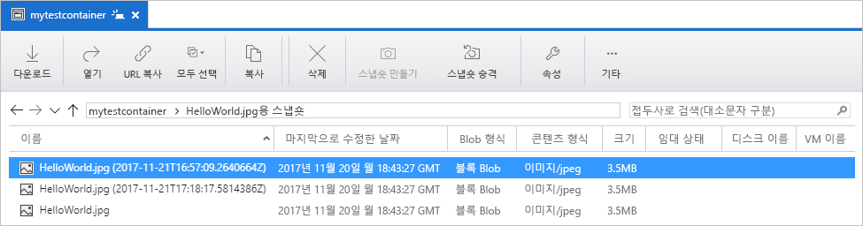
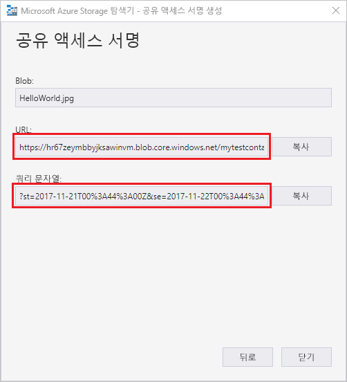

# 빠른 시작: Azure Storage Explorer를 사용하여 개체 스토리지에 Blob 만들기

이 빠른 시작에서는 [Azure Storage Explorer](https://azure.microsoft.com/features/storage-explorer/)를 사용하여 컨테이너 및 Blob을 만드는 방법을 알아봅니다. 그런 다음, Blob을 로컬 컴퓨터로 다운로드하는 방법과 컨테이너의 모든 Blob을 보는 방법을 알아봅니다. 또한 Blob의 스냅샷을 만들고, 컨테이너 액세스 정책을 관리하고, 공유 액세스 서명을 만드는 방법을 알아봅니다.

## 필수 조건

[!INCLUDE [storage-quickstart-prereq-include](../../../includes/storage-quickstart-prereq-include.md)]

이 빠른 시작을 사용하려면 Azure Storage Explore를 설치해야 합니다. Windows, Macintosh 또는 Linux용 Azure Storage Explorer를 설치하려면 [Azure Storage Explorer](https://azure.microsoft.com/features/storage-explorer/)를 참조하세요.

## Storage Explorer에 로그인

처음 시작하는 경우 **Microsoft Azure Storage Explorer - 연결** 창이 표시됩니다. Storage Explorer는 Storage 계정에 연결하는 여러 방법을 제공합니다. 다음 표에는 연결할 수 있는 여러 방법이 나열되어 있습니다.

|Task|목적|
|---|---|
|Azure 계정 추가 | Azure에 인증하기 위해 조직 로그인 페이지로 리디렉션합니다. |
|연결 문자열 또는 공유 액세스 서명 URI 사용 | SAS 토큰 또는 공유 연결 문자열이 있는 컨테이너 또는 저장소 계정에 직접 액세스하는 데 사용할 수 있습니다. |
|저장소 계정 이름 및 키 사용| 스토리지 계정 이름과 스토리지 계정 키를 사용하여 Azure Storage에 연결합니다.|

**Azure 계정 추가**를 선택하고 **로그인..** 을 클릭합니다. 화면 상의 메시지에 따라 Azure 계정에 로그인합니다.

작업이 완료되면 Azure Storage Explorer는 표시된 **탐색기** 탭을 로드합니다. 이 보기는 [Azure Storage 에뮬레이터](../common/storage-use-emulator.md?toc=%2fazure%2fstorage%2fblobs%2ftoc.json), [Cosmos DB](../../cosmos-db/storage-explorer.md?toc=%2fazure%2fstorage%2fblobs%2ftoc.json) 계정 또는 [Azure Stack](/azure-stack/user/azure-stack-storage-connect-se?toc=%2fazure%2fstorage%2fblobs%2ftoc.json) 환경을 통해 구성된 로컬 스토리지뿐만 아니라 모든 Azure Storage 계정에 대한 정보를 제공합니다.

## 컨테이너 만들기

Blob은 항상 컨테이너에 업로드됩니다. 컴퓨터의 폴더에서 파일을 구성하는 것처럼 컨테이너를 사용하여 Blob 그룹을 구성할 수 있습니다.

컨테이너를 만들려면 진행 단계에서 만든 저장소 계정을 확장합니다. **Blob 컨테이너**를 선택하고, 마우스 오른쪽 단추로 클릭하여 **Blob 컨테이너 만들기**를 선택합니다. Blob 컨테이너에 대한 이름을 입력합니다. Blob 컨테이너 이름 명명 규칙 및 제한 사항 목록은 [컨테이너 만들기 및 사용 권한 설정](storage-quickstart-blobs-dotnet.md#create-the-container-and-set-permissions) 섹션을 참조하세요. 완료되면 **Enter**를 눌러 Blob 컨테이너를 만듭니다. Blob 컨테이너가 성공적으로 만들어졌다면 선택한 저장소 계정에 대해 **Blob 컨테이너** 폴더 아래에 표시됩니다.

## 컨테이너에 Blob 업로드

Blob Storage는 블록 Blob, 추가 Blob 및 페이지 Blob을 지원합니다. IaaS VM을 백업하는 데 사용된 VHD 파일은 페이지 Blob입니다. 추가 Blob은 파일에 쓰고 더 많은 정보를 계속해서 추가하려는 경우처럼 로깅에 사용됩니다. Blob Storage에 저장된 대부분의 파일은 블록 Blob입니다.

컨테이너 리본에서 **업로드**를 선택합니다. 이 작업에서는 폴더나 파일을 업로드할 수 있는 옵션이 제공됩니다.

업로드할 파일 또는 폴더를 선택합니다. **Blob 유형**을 선택합니다. 사용할 수 있는 선택 사항은 **추가**, **페이지** 또는 **블록** Blob입니다.

.vhd 또는 .vhdx 파일을 업로드하는 경우 **.vhd/.vhdx 파일을 페이지 blob으로 업로드(권장)** 를 선택합니다.

**폴더에 업로드(선택 사항)** 필드에서 컨테이너 아래 폴더에 파일 또는 폴더를 저장할 폴더 이름을 입력합니다. 폴더를 선택하지 않으면 파일이 컨테이너 바로 아래에 업로드됩니다.

**확인**을 선택하면 선택한 파일들이 업로드 대기 상태가 되고 파일 하나하나가 업로드됩니다. 업로드가 완료되면 결과가 **활동** 창에 표시됩니다.

## 컨테이너에서 Blob 보기

**Azure Storage 탐색기** 응용 프로그램에서 스토리지 계정 아래에 있는 컨테이너를 선택합니다. 기본 창에는 선택한 컨테이너의 Blob 목록이 표시됩니다.

## Blob 다운로드

**Azure Storage 탐색기**에서 Blob을 선택하여 Blob을 다운로드하려면 리본에서 **다운로드**를 선택합니다. 파일 대화 상자가 열리면 파일 이름을 입력할 수 있습니다. **저장**을 선택하면 로컬 위치에 Blob 다운로드가 시작됩니다.

## 스냅샷 관리

Azure Storage Explorer는 Blob의 [스냅숏](storage-blob-snapshots.md)을 가져와서 관리할 수 있는 기능을 제공합니다. Blob 스냅샷을 생성하려면 Blob을 마우스 오른쪽 단추로 클릭하고 **스냅샷 만들기**를 선택합니다. Blob의 스냅샷을 보려면 Blob을 마우스 오른쪽 단추로 클릭하고 **스냅샷 관리**를 선택합니다. Blob의 스냅샷 목록이 현재 탭에 표시됩니다.

## 액세스 정책 관리

Storage Explorer는 사용자 인터페이스 내의 컨테이너에 대한 액세스 정책을 관리하는 기능을 제공합니다. 보안 액세스 정책(SAS)에는 서비스 수준 및 계정 수준의 두 가지 유형이 있습니다. 계정 수준 SAS는 저장소 계정을 대상으로 하며 여러 서비스 및 리소스에 적용할 수 있습니다. 서비스 수준 SAS는 특정 서비스의 리소스에 정의됩니다. 서비스 레벨 SAS를 생성하려면 컨테이너를 마우스 오른쪽 단추로 클릭하고 **액세스 정책 관리...** 를 선택합니다. 계정 수준 SAS를 생성하려면 저장소 계정을 마우스 오른쪽 단추로 클릭합니다.

**추가**를 선택하여 새 액세스 정책을 추가하고 정책에 대한 권한을 정의합니다. 완료되면 **저장**을 선택하여 액세스 정책을 저장합니다. 이 정책은 이제 공유 액세스 서명을 구성할 때 사용할 수 있습니다.

## 공유 액세스 서명으로 작업

SAS(공유 액세스 서명)는 Storage Explorer를 통해 검색할 수 있습니다. 저장소 계정, 컨테이너 또는 Blob를 마우스 오른쪽 버튼으로 클릭하고 **공유 액세스 서명 가져오기...** 를 선택합니다. 시작 및 만료 시간과 SAS URL에 대한 권한을 선택하고 **만들기**를 선택합니다. 쿼리 문자열뿐만 아니라 쿼리 문자열 자체의 전체 URL이 제공되며 다음 화면에서 복사할 수 있습니다.

## 다음 단계

이 빠른 시작에서는 **Azure Storage Explorer**를 사용하여 로컬 디스크와 Azure Blob Storage 간에 파일을 전송하는 방법을 학습했습니다. Blob Storage를 사용하는 방법을 자세히 알아보려면 계속해서 Blob Storage 방법을 진행하세요.

> [!div class="nextstepaction"]
> [Blob Storage 작업 방법](storage-how-to-use-blobs-powershell.md)
