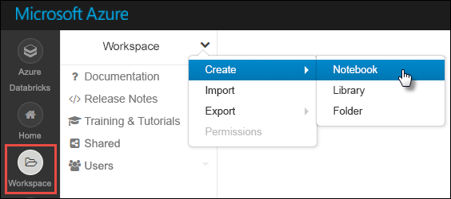
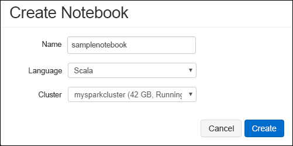

# <a name="tutorial-extract-transform-and-load-data-using-azure-databricks"></a>자습서: Azure Databricks를 사용하여 데이터 추출, 변환 및 로드

이 자습서에서는 Azure DataBraicks를 사용하여 Azure Data Lake Storage Gen2 미리 보기에서 Azure SQL Data Warehouse로 데이터를 이동하는 ETL(추출, 변환 및 데이터 로드) 작업을 수행합니다.

다음 그림에서는 응용 프로그램 흐름을 보여줍니다.


이 자습서에서 다루는 작업은 다음과 같습니다.

> [!div class="checklist"]
> * Azure Databricks 작업 영역 만들기
> * Azure Databricks에 Spark 클러스터 만들기
> * Azure Data Lake Storage Gen2 지원 계정 만들기
> * Azure Data Lake Storage Gen2에 데이터 업로드
> * Azure Databricks에 노트북 만들기
> * Data Lake Storage Gen2에서 데이터 추출
> * Azure Databricks에서 데이터 변환
> * Azure SQL Data Warehouse에 데이터 로드

Azure 구독이 아직 없는 경우 시작하기 전에 [체험](https://azure.microsoft.com/free/) 계정을 만듭니다.

## <a name="prerequisites"></a>필수 조건

이 자습서를 완료하려면 다음이 필요합니다.

* Azure SQL Data Warehouse를 만들고, 서버 수준 방화벽 규칙을 만들고, 서버 관리자로 서버에 연결합니다. [빠른 시작: Azure SQL Data Warehouse 만들기](../../sql-data-warehouse/create-data-warehouse-portal.md)의 지침을 따르세요.
* Azure SQL Data Warehouse에 대한 데이터베이스 마스터 키를 만듭니다. [데이터베이스 마스터 키 만들기](https://docs.microsoft.com/sql/relational-databases/security/encryption/create-a-database-master-key)의 지침을 따르세요.
* [Azure Data Lake Storage Gen2 계정을 만듭니다](quickstart-create-account.md).

## <a name="sign-in-to-the-azure-portal"></a>Azure Portal에 로그인

[Azure 포털](https://portal.azure.com/)에 로그인합니다.

## <a name="create-an-azure-databricks-workspace"></a>Azure Databricks 작업 영역 만들기

이 섹션에서는 Azure Portal을 사용하여 Azure Databricks 작업 영역을 만듭니다. 

1. Azure Portal에서 **리소스 만들기** > **분석** > **Azure Databricks**를 차례로 선택합니다.

    

2. **Azure Databricks 서비스** 아래에서 Databricks 작업 영역을 만들기 위한 값을 제공합니다.

    

    다음 값을 제공합니다.

    |자산  |설명  |
    |---------|---------|
    |**작업 영역 이름**     | Databricks 작업 영역에 대한 이름을 제공합니다.        |
    |**구독**     | 드롭다운에서 Azure 구독을 선택합니다.        |
    |**리소스 그룹**     | 새 리소스 그룹을 만들지, 아니면 기존 그룹을 사용할지 여부를 지정합니다. 리소스 그룹은 Azure 솔루션에 관련된 리소스를 보유하는 컨테이너입니다. 자세한 내용은 [Azure Resource Manager 개요](../../azure-resource-manager/resource-group-overview.md)를 참조하세요. |
    |**위치**:     | **미국 서부 2**를 선택합니다. 사용 가능한 다른 영역은 [지역별 사용 가능한 Azure 서비스](https://azure.microsoft.com/regions/services/)를 참조하세요.        |
    |**가격 책정 계층**     |  **표준** 또는 **프리미엄** 중에서 선택합니다. 이러한 계층에 대한 자세한 내용은 [Databricks 가격 페이지](https://azure.microsoft.com/pricing/details/databricks/)를 참조하세요.       |

    **대시보드에 고정**을 선택한 다음, **만들기**를 선택합니다.

3. 계정 생성에는 몇 분 정도가 소요됩니다. 계정을 만드는 동안 포털의 오른쪽에 **Azure Databricks에 대한 배포 제출**이 표시됩니다. 타일을 보려면 대시보드에서 오른쪽으로 스크롤해야 할 수도 있습니다. 화면 위쪽에 진행률 표시줄이 표시되기도 합니다. 두 영역에서 진행 상태를 볼 수 있습니다.

    

## <a name="create-a-spark-cluster-in-databricks"></a>Databricks에서 Spark 클러스터 만들기

1. Azure Portal에서 사용자가 만든 Databricks 작업 영역으로 이동한 다음, **작업 영역 시작**을 선택합니다.

2. Azure Databricks 포털로 리디렉션됩니다. 포털에서 **클러스터**를 선택합니다.

    

3. **새 클러스터** 페이지에서 값을 제공하여 클러스터를 만듭니다.

    

    다음 필드에 대한 값을 입력하고, 다른 필드에는 기본값을 그대로 적용합니다.

    * 클러스터의 이름을 입력합니다.
    * 이 문서에서는 **4.2** 런타임을 사용하여 클러스터를 만듭니다.
    * **Terminate after ____ minutes of inactivity**(비활성 ____분 후 종료) 확인란을 선택했는지 확인합니다. 클러스터를 사용하지 않는 경우 클러스터를 종료하는 기간(분)을 제공합니다.

    **클러스터 만들기**를 선택합니다. 클러스터가 실행되면 노트북을 클러스터에 첨부하고 Spark 작업을 실행할 수 있습니다.

## <a name="create-storage-account-file-system"></a>저장소 계정 파일 시스템 만들기

이 섹션에서는 Azure Databricks 작업 영역에서 노트북을 만든 다음, 코드 조각을 실행하여 저장소 계정을 구성합니다.

1. [Azure Portal](https://portal.azure.com)에서, 앞에서 만든 Databricks 작업 영역으로 이동한 후 **작업 영역 시작**을 선택합니다.

2. 왼쪽 창에서 **작업 영역**을 선택합니다. **작업 영역** 드롭다운에서 **만들기** > **Notebook**을 차례로 선택합니다.

    

3. **노트북 만들기** 대화 상자에서 노트북 이름을 입력합니다. 언어로 **Scala**를 선택한 다음, 앞에서 만든 Spark 클러스터를 선택합니다.

    

    **만들기**를 선택합니다.

4. 첫 번째 셀에 다음 코드를 입력하고 코드를 실행합니다.

    ```python
    spark.conf.set("fs.azure.account.key.<ACCOUNT_NAME>.dfs.core.windows.net", "<ACCOUNT_KEY>") 
    spark.conf.set("fs.azure.createRemoteFileSystemDuringInitialization", "true")
    dbutils.fs.ls("abfs://<FILE_SYSTEM_NAME>@<ACCOUNT_NAME>.dfs.core.windows.net/")
    spark.conf.set("fs.azure.createRemoteFileSystemDuringInitialization", "false") 
    ```

    **Shift+Enter**를 눌러 코드 셀을 실행합니다.

    이제 저장소 계정에 대한 파일 시스템이 만들어집니다.

## <a name="upload-data-to-the-storage-account"></a>저장소 계정에 데이터 업로드

다음 단계는 나중에 Azure Databricks에서 변환할 샘플 데이터 파일을 저장소 계정에 업로드하는 것입니다. 

1. Data Lake Storage Gen2에 대한 계정을 아직 만들지 않은 경우 빠른 시작에 따라 Data Lake Storage Gen2 계정을 만듭니다.
2. 샘플 데이터(**small_radio_json.json**)는 [U-SQL 예제 및 문제 추적](https://github.com/Azure/usql/blob/master/Examples/Samples/Data/json/radiowebsite/small_radio_json.json) 리포지토리에서 사용할 수 있습니다. JSON 파일을 다운로드하고 해당 파일이 저장되는 경로를 적어 둡니다.
3. 저장소 계정에 데이터를 업로드합니다. 저장소 계정에 데이터를 업로드하는 방법은 HNS(Hierarchical Namespace Service)를 사용할 수 있는지 여부에 따라 달라집니다.

    ADLS Gen2 계정에서 HNS를 사용하도록 설정되어 있는 경우 Azure Data Factory, distp 또는 AzCopy(버전 10)를 사용하여 업로드를 처리할 수 있습니다. AzCopy 버전 10은 고객을 미리 볼 수만 있습니다. Cloud Shell에서 AzCopy를 사용하려면 다음을 수행합니다.

    ```bash
    set ACCOUNT_NAME=<ACCOUNT_NAME>
    set ACCOUNT_KEY=<ACCOUNT_KEY>
    azcopy cp "<DOWNLOAD_PATH>\small_radio_json.json" https://<ACCOUNT_NAME>.dfs.core.windows.net/data --recursive 
    ```
    
## <a name="extract-data-from-azure-storage"></a>Azure Storage에서 데이터 추출

DataBricks Notebook으로 돌아가서 새 셀에 다음 코드를 입력합니다.

1. 빈 코드 셀에 다음 코드 조각을 추가하고, 자리 표시자 값을 이전에 저장소 계정에서 저장한 값으로 바꿉니다.

    ```python
    dbutils.widgets.text("storage_account_name", "STORAGE_ACCOUNT_NAME", "<YOUR_STORAGE_ACCOUNT_NAME>")
    dbutils.widgets.text("storage_account_access_key", "YOUR_ACCESS_KEY", "<YOUR_STORAGE_ACCOUNT_SHARED_KEY>")
    ```

    **Shift+Enter**를 눌러 코드 셀을 실행합니다.

2. 이제 Azure Databricks에서 샘플 json 파일을 데이터 프레임으로 로드할 수 있습니다. 새 셀에 다음 코드를 붙여넣은 다음, 자리 표시자 값을 바꾸려면 **SHIFT+ENTER**를 누릅니다.

    ```python
    val df = spark.read.json("abfs://<FILE_SYSTEM_NAME>@<ACCOUNT_NAME>.dfs.core.windows.net/data/small_radio_json.json")
    ```

3. 데이터 프레임의 내용을 보려면 다음 코드를 실행합니다.

    ```python
    df.show()
    ```

    다음 코드 조각과 유사한 결과가 표시됩니다.

    ```bash
    +---------------------+---------+---------+------+-------------+----------+---------+-------+--------------------+------+--------+-------------+---------+--------------------+------+-------------+------+
    |               artist|     auth|firstName|gender|itemInSession|  lastName|   length|  level|            location|method|    page| registration|sessionId|                song|status|           ts|userId|
    +---------------------+---------+---------+------+-------------+----------+---------+-------+--------------------+------+--------+-------------+---------+--------------------+------+-------------+------+
    | El Arrebato         |Logged In| Annalyse|     F|            2|Montgomery|234.57914| free  |  Killeen-Temple, TX|   PUT|NextSong|1384448062332|     1879|Quiero Quererte Q...|   200|1409318650332|   309|
    | Creedence Clearwa...|Logged In|   Dylann|     M|            9|    Thomas|340.87138| paid  |       Anchorage, AK|   PUT|NextSong|1400723739332|       10|        Born To Move|   200|1409318653332|    11|
    | Gorillaz            |Logged In|     Liam|     M|           11|     Watts|246.17751| paid  |New York-Newark-J...|   PUT|NextSong|1406279422332|     2047|                DARE|   200|1409318685332|   201|
    ...
    ...
    ```

이제 Azure Data Lake Storage Gen2에서 Azure Databricks로 데이터를 추출했습니다.

## <a name="transform-data-in-azure-databricks"></a>Azure Databricks에서 데이터 변환

원시 샘플 데이터 **small_radio_json.json**은 라디오 방송국의 대상을 캡처하며, 다양한 열을 갖고 있습니다. 이 섹션에서는 데이터 집합의 특정 열만 검색하도록 데이터를 변환합니다.

1. 먼저 앞에서 만든 데이터 프레임에서 *이름*, *성*, *성별*, *위치* 및 *수준* 열만 검색합니다.

    ```python
    val specificColumnsDf = df.select("firstname", "lastname", "gender", "location", "level")
    ```

    다음 코드 조각과 같은 출력이 표시됩니다.

    ```bash
    +---------+----------+------+--------------------+-----+
    |firstname|  lastname|gender|            location|level|
    +---------+----------+------+--------------------+-----+
    | Annalyse|Montgomery|     F|  Killeen-Temple, TX| free|
    |   Dylann|    Thomas|     M|       Anchorage, AK| paid|
    |     Liam|     Watts|     M|New York-Newark-J...| paid|
    |     Tess|  Townsend|     F|Nashville-Davidso...| free|
    |  Margaux|     Smith|     F|Atlanta-Sandy Spr...| free|
    |     Alan|     Morse|     M|Chicago-Napervill...| paid|
    |Gabriella|   Shelton|     F|San Jose-Sunnyval...| free|
    |   Elijah|  Williams|     M|Detroit-Warren-De...| paid|
    |  Margaux|     Smith|     F|Atlanta-Sandy Spr...| free|
    |     Tess|  Townsend|     F|Nashville-Davidso...| free|
    |     Alan|     Morse|     M|Chicago-Napervill...| paid|
    |     Liam|     Watts|     M|New York-Newark-J...| paid|
    |     Liam|     Watts|     M|New York-Newark-J...| paid|
    |   Dylann|    Thomas|     M|       Anchorage, AK| paid|
    |     Alan|     Morse|     M|Chicago-Napervill...| paid|
    |   Elijah|  Williams|     M|Detroit-Warren-De...| paid|
    |  Margaux|     Smith|     F|Atlanta-Sandy Spr...| free|
    |     Alan|     Morse|     M|Chicago-Napervill...| paid|
    |   Dylann|    Thomas|     M|       Anchorage, AK| paid|
    |  Margaux|     Smith|     F|Atlanta-Sandy Spr...| free|
    +---------+----------+------+--------------------+-----+
    ```

2.  열 **수준**을 **subscription_type**으로 지정하도록 이 데이터를 추가로 변환할 수 있습니다.

    ```python
    val renamedColumnsDF = specificColumnsDf.withColumnRenamed("level", "subscription_type")
    renamedColumnsDF.show()
    ```

    다음 코드 조각과 같은 출력이 표시됩니다.

    ```bash
    +---------+----------+------+--------------------+-----------------+
    |firstname|  lastname|gender|            location|subscription_type|
    +---------+----------+------+--------------------+-----------------+
    | Annalyse|Montgomery|     F|  Killeen-Temple, TX|             free|
    |   Dylann|    Thomas|     M|       Anchorage, AK|             paid|
    |     Liam|     Watts|     M|New York-Newark-J...|             paid|
    |     Tess|  Townsend|     F|Nashville-Davidso...|             free|
    |  Margaux|     Smith|     F|Atlanta-Sandy Spr...|             free|
    |     Alan|     Morse|     M|Chicago-Napervill...|             paid|
    |Gabriella|   Shelton|     F|San Jose-Sunnyval...|             free|
    |   Elijah|  Williams|     M|Detroit-Warren-De...|             paid|
    |  Margaux|     Smith|     F|Atlanta-Sandy Spr...|             free|
    |     Tess|  Townsend|     F|Nashville-Davidso...|             free|
    |     Alan|     Morse|     M|Chicago-Napervill...|             paid|
    |     Liam|     Watts|     M|New York-Newark-J...|             paid|
    |     Liam|     Watts|     M|New York-Newark-J...|             paid|
    |   Dylann|    Thomas|     M|       Anchorage, AK|             paid|
    |     Alan|     Morse|     M|Chicago-Napervill...|             paid|
    |   Elijah|  Williams|     M|Detroit-Warren-De...|             paid|
    |  Margaux|     Smith|     F|Atlanta-Sandy Spr...|             free|
    |     Alan|     Morse|     M|Chicago-Napervill...|             paid|
    |   Dylann|    Thomas|     M|       Anchorage, AK|             paid|
    |  Margaux|     Smith|     F|Atlanta-Sandy Spr...|             free|
    +---------+----------+------+--------------------+-----------------+
    ```

## <a name="load-data-into-azure-sql-data-warehouse"></a>Azure SQL Data Warehouse에 데이터 로드

이 섹션에서는 변환된 데이터를 Azure SQL Data Warehouse로 업로드합니다. Azure Databricks용 Azure SQL Data Warehouse 커넥터를 사용하여 데이터 프레임을 SQL 데이터 웨어하우스의 테이블로 직접 업로드할 수 있습니다.

앞서 언급했듯이, SQL 데이터 웨어하우스 커넥터는 Azure Blob Storage를 임시 저장소로 사용하여 Azure Databricks와 Azure SQL Data Warehouse 간의 데이터를 업로드합니다. 따라서 저장소 계정에 연결하는 구성을 먼저 제공해야 합니다. 이 문서의 필수 구성 요소로 이미 계정을 만들어 두셨을 것입니다.

1. Azure Databricks에서 Azure Storage 계정에 액세스하기 위한 구성을 입력합니다.

    ```python
    val storageURI = "<STORAGE_ACCOUNT_NAME>.dfs.core.windows.net"
    val fileSystemName = "<FILE_SYSTEM_NJAME>"
    val accessKey =  "<ACCESS_KEY>"
    ```

2. Azure Databricks와 Azure SQL Data Warehouse 간에 데이터를 이동하는 데 사용되는 임시 폴더를 지정합니다.

    ```python
    val tempDir = "abfs://" + fileSystemName + "@" + storageURI +"/tempDirs"
    ```

3. 다음 코드 조각을 실행하여 Azure Blob Storage 액세스 키를 구성에 저장합니다. 이렇게 하면 액세스 키를 노트북에서 일반 텍스트로 유지할 필요가 없습니다.

    ```python
    val acntInfo = "fs.azure.account.key."+ storageURI
    sc.hadoopConfiguration.set(acntInfo, accessKey)
    ```

4. Azure SQL Data Warehouse 인스턴스에 연결하기 위한 값을 입력합니다. 필수 구성 요소의 일부로 SQL 데이터 웨어하우스를 이미 만들어 두셨을 것입니다.

    ```python
    //SQL Data Warehouse related settings
    val dwDatabase = "<DATABASE NAME>"
    val dwServer = "<DATABASE SERVER NAME>" 
    val dwUser = "<USER NAME>"
    val dwPass = "<PASSWORD>"
    val dwJdbcPort =  "1433"
    val dwJdbcExtraOptions = "encrypt=true;trustServerCertificate=true;hostNameInCertificate=*.database.windows.net;loginTimeout=30;"
    val sqlDwUrl = "jdbc:sqlserver://" + dwServer + ".database.windows.net:" + dwJdbcPort + ";database=" + dwDatabase + ";user=" + dwUser+";password=" + dwPass + ";$dwJdbcExtraOptions"
    val sqlDwUrlSmall = "jdbc:sqlserver://" + dwServer + ".database.windows.net:" + dwJdbcPort + ";database=" + dwDatabase + ";user=" + dwUser+";password=" + dwPass
    ```

5. 다음 코드 조각을 실행하여 변환된 데이터 프레임, **renamedColumnsDF**를 SQL 데이터 웨어하우스에 테이블로 로드합니다. 이 코드 조각은 SQL 데이터베이스에 **SampleTable**이라는 테이블을 만듭니다.

    ```python
    spark.conf.set(
        "spark.sql.parquet.writeLegacyFormat",
        "true")
    
    renamedColumnsDF.write
        .format("com.databricks.spark.sqldw")
        .option("url", sqlDwUrlSmall) 
        .option("dbtable", "SampleTable")
        .option( "forward_spark_azure_storage_credentials","True")
        .option("tempdir", tempDir)
        .mode("overwrite")
        .save()
    ```

6. SQL 데이터베이스에 연결하여 **SampleTable**이 보이는지 확인합니다.

    

7. select 쿼리를 실행하여 테이블의 콘텐츠를 확인합니다. **renamedColumnsDF** 데이터 프레임과 똑같은 데이터가 있어야 합니다.

    

## <a name="clean-up-resources"></a>리소스 정리

자습서 실행이 완료되면 클러스터를 종료할 수 있습니다. 이렇게 하려면 왼쪽 창의 Azure Databricks 작업 영역에서 **클러스터**를 선택합니다. 종료하려는 클러스터에서 **작업** 열 아래의 줄임표 위로 커서를 이동한 다음, **종료** 아이콘을 선택합니다.


클러스터를 수동으로 종료하지 않은 경우 클러스터를 만드는 중에 **Terminate after __ minutes of inactivity**(비활성 __분 후 종료) 확인란을 선택하면 자동으로 중지됩니다. 이 경우 지정한 시간 동안 클러스터가 비활성 상태이면 클러스터가 자동으로 중지됩니다.

## <a name="next-steps"></a>다음 단계

이 자습서에서는 다음 방법에 대해 알아보았습니다.

> [!div class="checklist"]
> * Azure Databricks 작업 영역 만들기
> * Azure Databricks에 Spark 클러스터 만들기
> * Azure Data Lake Storage Gen2 지원 계정 만들기
> * Azure Data Lake Storage Gen2에 데이터 업로드
> * Azure Databricks에 노트북 만들기
> * Data Lake Storage Gen2에서 데이터 추출
> * Azure Databricks에서 데이터 변환
> * Azure SQL Data Warehouse에 데이터 로드

다음 자습서로 넘어가서 Azure Event Hubs를 사용하여 Azure Databricks로 실시간 데이터를 스트리밍하는 방법을 알아보세요.

> [!div class="nextstepaction"]
>[Event Hubs를 사용하여 Azure Databricks로 데이터 스트리밍](../../azure-databricks/databricks-stream-from-eventhubs.md)
