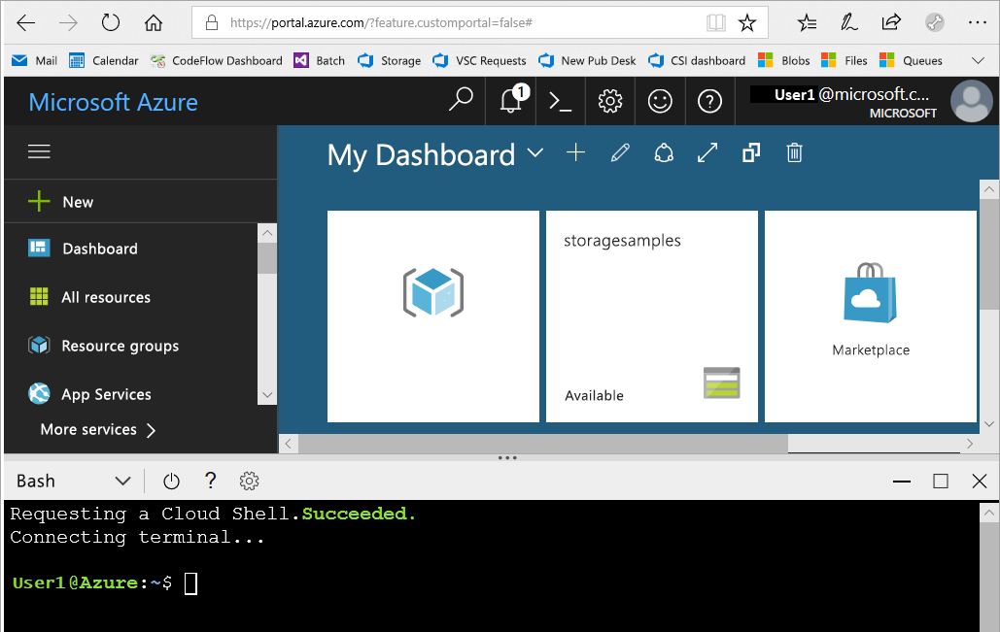
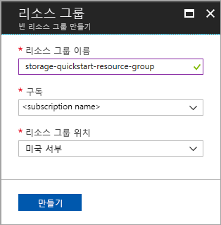
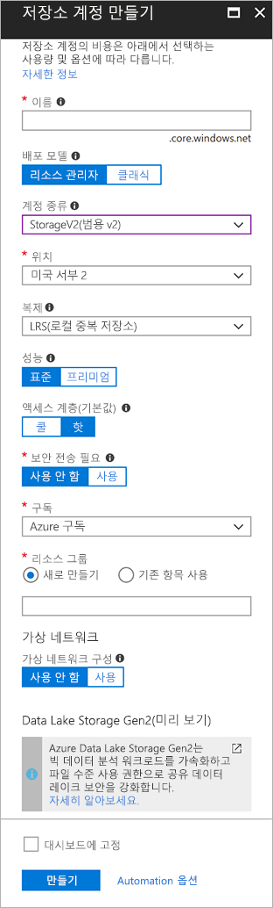

# <a name="quickstart-create-an-azure-data-lake-storage-gen2-preview-storage-account"></a>빠른 시작: Azure Data Lake Storage Gen2 미리 보기 저장소 계정 만들기

Azure Data Lake Storage Gen2 미리 보기 계정은 HDFS(Hadoop 분산 파일 시스템)에서 작동하도록 조정된 네이티브 디렉터리 기반 파일 시스템을 제공하는 [Hierarchical Namespace Service를 지원](introduction.md)합니다. HDFS에서 Data Lake Storage Gen2 데이터에 액세스하려면 [ABFS 드라이버](abfs-driver.md)를 통해 액세스할 수 있습니다.

저장소 계정에서 Data Lake Storage Gen2 기능을 사용하도록 설정하려면 [미리 보기 설문 조사를 작성하여 액세스를 요청](https://aka.ms/adlsgen2signup)합니다. 일단 승인되면 새 Data Lake Storage Gen2 계정을 만들 수 있습니다. 이 빠른 시작에서는 [Azure Portal](https://portal.azure.com/), [Azure PowerShell](https://docs.microsoft.com/powershell/azure/overview) 또는 [Azure CLI](https://docs.microsoft.com/cli/azure?view=azure-cli-latest)를 통해 계정을 만드는 방법을 보여 줍니다.

> [!NOTE]
> Data Lake Storage Gen2 계정을 만들도록 승인되면 Azure Portal에서 계정 만들기 UI가 업데이트됩니다. 마찬가지로, Data Lake Storage Gen2 관련 PowerShell 및 CLI 인수도 미리 보기에 대해 승인을 받은 후에만 작동합니다.

## <a name="prerequisites"></a>필수 조건

Azure 구독이 아직 없는 경우 시작하기 전에 [무료 계정](https://azure.microsoft.com/free/)을 만듭니다.

|           | 필수 요소 |
|-----------|--------------|
|포털     | 없음         |
|PowerShell | 이 빠른 시작에서는 Azure PowerShell 모듈 버전 **5.0.4-preview** 이상이 필요합니다. `Get-Module -ListAvailable AzureRM`을 실행하여 현재 버전을 찾습니다. 설치 또는 업그레이드해야 하는 경우 [Azure PowerShell 모듈 설치](/powershell/azure/install-azurerm-ps)를 참조하세요. |
|CLI        | Azure에 로그인하고 다음 두 방법 중 하나로 Azure CLI 명령을 실행할 수 있습니다. <ul><li>Azure Cloud Shell의 Azure Portal에서 CLI 명령 실행 </li><li>CLI를 설치하고 로컬에서 CLI 실행</li></ul>|

명령줄에서 작업하는 경우 Azure Cloud Shell을 실행하거나 CLI를 로컬로 설치하는 옵션이 제공됩니다.

### <a name="use-azure-cloud-shell"></a>Azure Cloud Shell 사용

Azure Cloud Shell은 Azure Portal에서 직접 실행할 수 있는 평가판 Bash 셸입니다. Azure CLI가 사전 설치되어 계정에서 사용하도록 구성되어 있습니다. Azure Portal 오른쪽 위에 있는 메뉴에서 **Cloud Shell** 버튼을 클릭합니다.

[](https://portal.azure.com)

이 단추는 이 빠른 시작의 단계를 실행하는 데 사용할 수 있는 대화형 셸을 시작합니다.

[](https://portal.azure.com)

### <a name="install-the-cli-locally"></a>로컬에서 CLI 설치

Azure CLI를 로컬에서 설치하여 사용할 수도 있습니다. 이 빠른 시작에서는 Azure CLI 버전 2.0.38 이상을 실행해야 합니다. `az --version`을 실행하여 버전을 찾습니다. 설치 또는 업그레이드해야 하는 경우 [Azure CLI 2.0 설치](/cli/azure/install-azure-cli)를 참조하세요.

## <a name="overview-of-creating-an-azure-data-lake-storage-gen2-account"></a>Azure Data Lake Storage Gen2 계정 만들기에 대한 개요

계정을 만들기 전에 먼저 만드는 저장소 계정 또는 다른 Azure 리소스에 대한 논리 컨테이너 역할을 하는 리소스 그룹을 만듭니다. 이 빠른 시작에서 만든 리소스를 정리하려면 간단히 리소스 그룹을 삭제하면 됩니다. 리소스 그룹을 삭제하면 연결된 저장소 계정과 기타 해당 리소스 그룹에 연결된 다른 모든 리소스가 함께 삭제됩니다. 리소스 그룹에 대한 자세한 내용은 [Azure Resource Manager 개요](../../azure-resource-manager/resource-group-overview.md)를 참조하세요.

> [!NOTE]
> Data Lake Storage Gen2 기능을 활용하려면 새 저장소 계정을 **StorageV2(범용 V2)** 유형으로 만들어야 합니다.  

저장소 계정 유형에 대한 자세한 내용은 [Azure Storage 계정 옵션](../common/storage-account-options.md)을 참조하세요.

저장소 계정의 이름을 지정할 때는 다음 규칙에 유의하세요.

- Storage 계정 이름은 3자에서 24자 사이여야 하고 숫자 및 소문자만 포함할 수 있습니다.
- 저장소 계정 이름은 Azure 내에서 고유해야 합니다. 두 개의 저장소 계정이 같은 이름을 사용할 수 없습니다.

## <a name="create-an-account-using-the-azure-portal"></a>Azure Portal을 사용하여 계정 만들기

[Azure Portal](https://portal.azure.com)에 로그인합니다.

### <a name="create-a-resource-group"></a>리소스 그룹 만들기

Azure Portal에서 리소스 그룹을 만들려면 다음 단계를 수행합니다.

1. Azure Portal에서 왼쪽의 메뉴를 확장하여 서비스의 메뉴를 열고 **리소스 그룹**을 선택합니다.
2. **추가** 단추를 클릭하여 새 리소스 그룹을 추가합니다.
3. 새 리소스 그룹의 이름을 입력합니다.
4. 새 리소스 그룹을 만들려는 구독을 선택합니다.
5. 리소스 그룹의 위치를 선택합니다.
6. **만들기** 단추를 클릭합니다.  



### <a name="create-a-general-purpose-v2-storage-account"></a>범용 v2 저장소 계정 만들기

Azure Portal에서 범용 v2 저장소 계정을 만들려면 다음 단계를 수행합니다.

> [!NOTE]
> 계층 구조 네임스페이스는 미국 동부, 미국 동부 2, 미국 서부, 미국 서부 2, 미국 중서부, 북유럽, 서유럽, 동남 아시아 및 오스트레일리아 동부에서만 사용할 수 있습니다. 저장소 계정을 만들 때는 이러한 위치 중 하나를 지정해야 합니다.

1. Azure Portal에서 왼쪽의 메뉴를 확장하여 서비스의 메뉴를 열고 **모든 서비스**를 선택합니다. 그런 다음 **Storage**로 스크롤하고 **Storage 계정**을 선택합니다. 나타나는 **Storage 계정** 창에서 **추가**를 선택합니다.
2. 저장소 계정의 이름을 입력합니다.
3. **배포 모델**은 기본값으로 그대로 둡니다.
4. **계정 종류** 필드를 **StorageV2(범용 v2)** 로 설정합니다.
5. **위치**를 **미국 서부 2**로 설정합니다.
6. **복제** 필드를 **LRS(로컬 중복 저장소)** 로 설정된 채로 둡니다.
7. 이러한 필드는 기본값인 **복제**, **성능**, **액세스 계층**으로 그대로 둡니다.
8. 저장소 계정을 만들려는 구독을 선택합니다.
9. **리소스 그룹** 섹션에서 **기존 항목 사용**을 선택한 다음 이전 섹션에서 만든 리소스 그룹을 선택합니다.
10. **가상 네트워크**에 대한 기본값은 그대로 유지합니다.
11. **Data Lake Storage Gen2(미리 보기)** 섹션에서 **계층적 네임스페이스**를 **사용**으로 설정합니다.
12. **만들기** 를 클릭하여 저장소 계정을 만들 수 있습니다.



이제 포털을 통해 저장소 계정이 만들어집니다.

### <a name="clean-up-resources"></a>리소스 정리

Azure Portal을 사용하여 리소스 그룹을 제거하려면

1. Azure Portal에서 왼쪽의 메뉴를 확장하여 서비스 메뉴를 열고 **리소스 그룹**을 선택하여 리소스 그룹 목록을 표시합니다.
2. 삭제할 리소스 그룹을 찾아 목록 오른쪽에 있는 **자세히** 단추(**...** )를 마우스 오른쪽 단추로 클릭합니다.
3. **리소스 그룹 삭제**를 선택하고 확인합니다.

## <a name="create-an-account-using-powershell"></a>PowerShell을 사용하여 계정 만들기

`Login-AzureRmAccount` 명령으로 Azure 구독에 로그인하고 화면의 지시에 따라 인증합니다.

```powershell
Login-AzureRmAccount
```

### <a name="upgrade-your-powershell-module"></a>PowerShell 모듈 업그레이드

PowerShell을 통해 Data Lake Storage Gen2와 상호 작용하려면 모듈을 미리 보기 버전으로 업그레이드해야 합니다.

이를 위해서는 관리자 권한 PowerShell을 열고 다음 명령을 입력합니다. `Install-Module AzureRM.Storage –Repository PSGallery -RequiredVersion 5.0.4-preview –AllowPrerelease –AllowClobber –Force `

그런 다음, 셸을 다시 시작합니다.

### <a name="create-a-resource-group"></a>리소스 그룹 만들기

PowerShell에서 새 리소스 그룹을 만들려면 [New-AzureRmResourceGroup](/powershell/module/azurerm.resources/new-azurermresourcegroup) 명령을 사용합니다. 

> [!NOTE]
> 계층 구조 네임스페이스는 미국 동부, 미국 동부 2, 미국 서부, 미국 서부 2, 미국 중서부, 북유럽, 서유럽, 동남 아시아 및 오스트레일리아 동부에서만 사용할 수 있습니다. 저장소 계정을 만들 때는 이러한 위치 중 하나를 지정해야 합니다.

```powershell
# put resource group in a variable so you can use the same group name going forward,
# without hardcoding it repeatedly
$resourceGroup = "storage-quickstart-resource-group"
$location = "westus2"
New-AzureRmResourceGroup -Name $resourceGroup -Location $location
```

### <a name="create-a-general-purpose-v2-storage-account"></a>범용 v2 저장소 계정 만들기

PowerShell에서 LRS(로컬 중복 저장소)를 사용하여 범용 v2 저장소 계정을 만들려면 [New-AzureRmStorageAccount](/powershell/module/azurerm.storage/New-AzureRmStorageAccount) 명령을 사용합니다.

```powershell
Get-AzureRmLocation | select Location 
$location = "westus2"

New-AzureRmStorageAccount -ResourceGroupName $resourceGroup `
  -Name "storagequickstart" `
  -Location $location `
  -SkuName Standard_LRS `
  -Kind StorageV2 
  -EnableHierarchicalNamespace $True
```

### <a name="clean-up-resources"></a>리소스 정리

새 저장소 계정을 포함하여 리소스 그룹과 관련 리소스를 제거하려면 [Remove-AzureRmResourceGroup](/powershell/module/azurerm.resources/remove-azurermresourcegroup) 명령을 사용합니다. 

```powershell
Remove-AzureRmResourceGroup -Name $resourceGroup
```

## <a name="create-an-account-using-azure-cli"></a>Azure CLI를 사용하여 계정 만들기

Azure Cloud Shell을 시작하려면 [Azure Portal](https://portal.azure.com)에 로그인합니다.

CLI의 로컬 설치에 로그인하려면 로그인 명령을 실행합니다.

```cli
az login
```

### <a name="upgrade-your-cli-module"></a>CLI 모듈 업그레이드

CLI를 통해 Data Lake Storage Gen2와 상호 작용하려면 셸에 확장을 추가해야 합니다.

이렇게 하려면 Cloud Shell이나 로컬 셸을 사용하여 다음 명령을 입력합니다. `az extension add --name storage-preview`

### <a name="create-a-resource-group"></a>리소스 그룹 만들기

Azure CLI로 새 리소스 그룹을 만들려면 [az group create](/cli/azure/group#az_group_create) 명령을 사용합니다.

```azurecli-interactive
az group create \
    --name storage-quickstart-resource-group \
    --location westus2
```

> [!NOTE]
> 계층 구조 네임스페이스는 미국 동부, 미국 동부 2, 미국 서부, 미국 서부 2, 미국 중서부, 북유럽, 서유럽, 동남 아시아 및 오스트레일리아 동부에서만 사용할 수 있습니다. 저장소 계정을 만들 때는 이러한 위치 중 하나를 지정해야 합니다.

### <a name="create-a-general-purpose-v2-storage-account"></a>범용 v2 저장소 계정 만들기

Azure CLI에서 로컬 중복 저장소를 사용하여 범용 v2 저장소 계정을 만들려면 [az storage account create](/cli/azure/storage/account#az_storage_account_create) 명령을 사용합니다.

```azurecli-interactive
az storage account create \
    --name storagequickstart \
    --resource-group storage-quickstart-resource-group \
    --location westus2 \
    --sku Standard_LRS \
    --kind StorageV2 \
    --hierarchical-namespace true
```

### <a name="clean-up-resources"></a>리소스 정리

새 저장소 계정을 포함하여 리소스 그룹과 관련 리소스를 제거하려면 [az group delete](/cli/azure/group#az_group_delete) 명령을 사용합니다.

```azurecli-interactive
az group delete --name myResourceGroup
```

## <a name="next-steps"></a>다음 단계

이 빠른 시작에서는 Data Lake Storage Gen2 저장소 계정을 만들었습니다. 저장소 계정에서 Blob을 업로드 및 다운로드하는 방법을 알아보려면 계속해서 Blob 저장소 빠른 시작을 진행합니다.

* [AzCopy를 사용하여 Azure Blob Storage 간 데이터 이동](https://docs.microsoft.com/en-us/azure/machine-learning/team-data-science-process/move-data-to-azure-blob-using-azcopy)