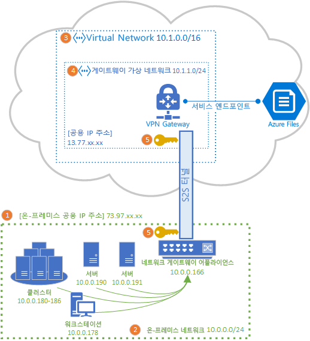
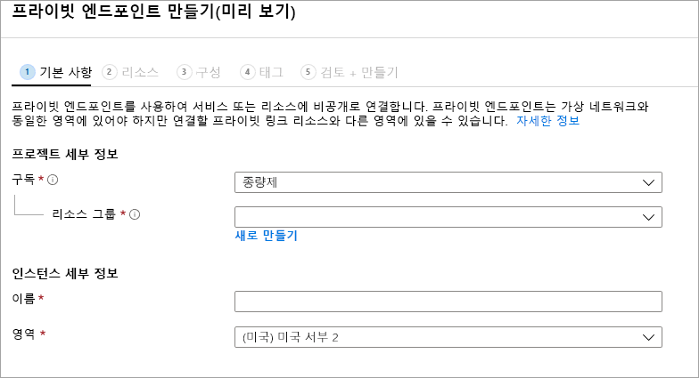

# Azure Files에서 사용할 사이트 간 VPN 구성
S2S(사이트 간) VPN 연결을 사용하여 445 포트를 열지 않고 온-프레미스 네트워크에서 SMB를 통해 Azure 파일 공유를 탑재할 수 있습니다. 사이트 간 VPN은 VPN 서비스를 제공하는 Azure 리소스이며 스토리지 계정 또는 다른 Azure 리소스와 함께 리소스 그룹에 배포되는 [Azure VPN Gateway](../../vpn-gateway/vpn-gateway-about-vpngateways.md)를 사용하여 설정할 수 있습니다.

Azure Files에 사용할 수 있는 네트워킹 옵션에 대해 자세히 알아보려면 이 방법 문서를 계속하기 전에 먼저 [Azure Files 네트워킹 개요](storage-files-networking-overview.md)를 참조하는 것이 좋습니다.

이 문서에서는 Azure 파일 공유를 온-프레미스에 직접 탑재하도록 사이트 간 VPN을 구성하는 단계에 대해 자세히 설명합니다. 사이트 간 VPN을 통해 Azure 파일 동기화의 동기화 트래픽을 라우팅하는 경우 [Azure 파일 동기화 프록시 및 방화벽 설정 구성](storage-sync-files-firewall-and-proxy.md)을 참조하세요.

## 필수 조건
- 온-프레미스에 탑재하려는 Azure 파일 공유. 사이트 간 VPN에서 [표준](storage-how-to-create-file-share.md) 또는 [프리미엄 Azure 파일 공유](storage-how-to-create-premium-fileshare.md)를 사용할 수 있습니다.

- Azure VPN Gateway와 호환되는 온-프레미스 데이터 센터의 네트워크 어플라이언스 또는 서버. Azure Files는 선택한 온-프레미스 네트워크 어플라이언스와는 관련이 없지만, Azure VPN Gateway는 [테스트된 디바이스의 목록](../../vpn-gateway/vpn-gateway-about-vpn-devices.md)을 유지 관리합니다. 다른 네트워크 어플라이언스에서 다양한 기능, 성능 특성 및 관리 기능을 제공하므로 네트워크 어플라이언스를 선택할 때 이러한 기능을 고려해야 합니다.

    기존 네트워크 어플라이언스가 없는 경우 Windows Server에는 온-프레미스 네트워크 어플라이언스로 사용할 수 있는 기본 제공 RRAS(서버 역할, 라우팅 및 원격 액세스)가 포함되어 있습니다. Windows Server에서 라우팅 및 원격 액세스를 구성하는 방법에 대한 자세한 내용은 [RAS 게이트웨이](https://docs.microsoft.com/windows-server/remote/remote-access/ras-gateway/ras-gateway)를 참조하세요.

## VNet에 스토리지 계정 추가
Azure Portal에서 온-프레미스에 탑재하려는 Azure 파일 공유가 포함된 스토리지 계정으로 이동합니다. 스토리지 계정의 목차에서 **방화벽 및 가상 네트워크** 항목을 선택합니다. 가상 네트워크를 만들 때 가상 네트워크를 스토리지 계정에 추가하지 않은 경우 결과 창에는 **모든 네트워크**에 대해 **다음에서 액세스 허용** 라디오 단추가 선택되어 있어야 합니다.

스토리지 계정을 원하는 가상 네트워크에 추가하려면 **선택한 네트워크**를 선택합니다. **가상 네트워크** 부제목 아래에서 원하는 상태에 따라 **+ 기존 가상 네트워크 추가** 또는 **+ 새 가상 네트워크 추가**를 클릭합니다. 새 가상 네트워크를 만들면 새 Azure 리소스가 만들어집니다. 새 VNet 리소스 또는 기존 VNet 리소스는 스토리지 계정과 동일한 리소스 그룹 또는 구독에 있을 필요는 없지만 스토리지 계정과 동일한 지역에 있어야 하며, VNet을 배포하는 리소스 그룹 및 구독은 VPN Gateway를 배포하는 리소스 그룹 및 구독과 일치해야 합니다. 

기존 가상 네트워크를 추가하는 경우 스토리지 계정을 추가해야 하는 해당 가상 네트워크의 서브넷을 하나 이상 선택하라는 메시지가 표시됩니다. 새 가상 네트워크를 선택하는 경우 가상 네트워크 만들기의 일환으로 서브넷을 만들고 나중에 가상 네트워크에 대한 결과 Azure 리소스를 통해 더 많은 서브넷을 추가할 수 있습니다.

이전에 스토리지 계정을 구독에 추가하지 않은 경우 Microsoft.Storage 서비스 엔드포인트를 가상 네트워크에 추가해야 합니다. 이 작업에는 다소 시간이 걸릴 수 있으며, 이 작업이 완료될 때까지 VPN 연결 경유를 포함하여 해당 스토리지 계정 내에서 Azure 파일 공유에 액세스할 수 없습니다. 

## Azure VPN Gateway 배포
Azure Portal의 목차에서 **새 리소스 만들기**를 선택하고 *가상 네트워크 게이트웨이*를 검색합니다. 가상 네트워크 게이트웨이는 이전 단계에서 배포한 가상 네트워크와 동일한 구독, Azure 지역 및 리소스 그룹에 있어야 합니다(가상 네트워크를 선택하면 리소스 그룹이 자동으로 선택됨). 

Azure VPN Gateway를 배포하려면 다음 필드를 채워야 합니다.

- **이름**: VPN Gateway에 대한 Azure 리소스의 이름입니다. 이 이름은 관리하는 데 유용한 이름일 수 있습니다.
- **지역**: VPN Gateway가 배포될 지역입니다.
- **게이트웨이 유형**: 사이트 간 VPN을 배포하려면 **VPN**을 선택해야 합니다.
- **VPN 유형**: VPN 디바이스에 따라 *경로 기반** 또는 **정책 기반** 중 하나를 선택할 수 있습니다. 경로 기반 VPN은 IKEv2를 지원하지만, 정책 기반 VPN은 IKEv1만 지원합니다. 두 가지 유형의 VPN 게이트웨이에 대한 자세한 내용은 [정책 기반 및 경로 기반 VPN 게이트웨이 정보](../../vpn-gateway/vpn-gateway-connect-multiple-policybased-rm-ps.md#about)를 참조하세요.
- **SKU**: SKU는 허용되는 사이트 간 터널 수 및 원하는 VPN 성능을 제어합니다. 사용 사례에 적합한 SKU를 선택하려면 [게이트웨이 SKU](../../vpn-gateway/vpn-gateway-about-vpngateways.md#gwsku) 목록을 참조하세요. 필요한 경우 나중에 VPN Gateway의 SKU를 변경할 수 있습니다.
- **가상 네트워크**: 이전 단계에서 만든 가상 네트워크입니다.
- **공용 IP 주소**: 인터넷에 공개할 VPN Gateway의 IP 주소입니다. 마찬가지로 새 IP 주소를 만들어야 할 수 있지만, 적절한 경우 사용되지 않은 기존 IP 주소를 사용할 수도 있습니다. **새로 만들기**를 선택하면 새 IP 주소 Azure 리소스가 VPN Gateway와 동일한 리소스 그룹에 만들어지며 **공용 IP 주소 이름**은 새로 만든 IP 주소의 이름입니다. **기존 항목 사용**을 선택하는 경우 사용되지 않은 기존 IP 주소를 선택해야 합니다.
- **active-active 모드를 사용하도록 설정**: active-active 게이트웨이 구성을 만드는 경우에만 **사용**을 선택하고, 그렇지 않으면 **사용 안 함**이 선택된 상태로 둡니다. active-active 모드에 대한 자세한 내용은 [고가용성 프레미스 간 및 VNet 간 연결](../../vpn-gateway/vpn-gateway-highlyavailable.md)을 참조하세요.
- **BGP ASN 구성**: 구성에 이 설정이 특별히 필요한 경우에만 **사용**을 선택합니다. 이 설정에 대한 자세한 내용은 [Azure VPN Gateway에서의 BGP 정보](../../vpn-gateway/vpn-gateway-bgp-overview.md)를 참조하세요.

**검토 + 만들기**를 선택하여 VPN Gateway를 만듭니다. VPN Gateway를 완전히 만들고 배포하는 데 최대 45분이 걸릴 수 있습니다.

### 온-프레미스 게이트웨이용 로컬 네트워크 게이트웨이 만들기 
로컬 네트워크 게이트웨이는 온-프레미스 네트워크 어플라이언스를 나타내는 Azure 리소스입니다. Azure Portal의 목차에서 **새 리소스 만들기**를 선택하고 *로컬 네트워크 게이트웨이*를 검색합니다. 로컬 네트워크 게이트웨이는 스토리지 계정, 가상 네트워크 및 VPN Gateway와 함께 배포하는 Azure 리소스이지만, 스토리지 계정과 동일한 리소스 그룹 또는 구독에 있을 필요는 없습니다. 

로컬 네트워크 게이트웨이 리소스를 배포하려면 다음 필드를 채워야 합니다.

- **이름**: 로컬 네트워크 게이트웨이에 대한 Azure 리소스의 이름입니다. 이 이름은 관리하는 데 유용한 이름일 수 있습니다.
- **IP 주소**: 온-프레미스에 대한 로컬 게이트웨이의 공용 IP 주소입니다.
- **주소 공간**: 이 로컬 네트워크 게이트웨이에서 나타내는 네트워크의 주소 범위입니다. 여러 주소 공간 범위를 추가할 수 있지만, 여기서 지정하는 범위가 연결하려는 다른 네트워크의 범위와 겹치지 않도록 합니다. 
- **BGP 설정 구성**: 구성에 이 설정이 필요한 경우에만 BGP 설정을 구성합니다. 이 설정에 대한 자세한 내용은 [Azure VPN Gateway에서의 BGP 정보](../../vpn-gateway/vpn-gateway-bgp-overview.md)를 참조하세요.
- **구독**: 원하는 구독입니다. VPN Gateway 또는 스토리지 계정에 사용되는 구독과 일치할 필요가 없습니다.
- **리소스 그룹**: 원하는 리소스 그룹입니다. VPN Gateway 또는 스토리지 계정에 사용되는 리소스 그룹과 일치할 필요가 없습니다.
- **위치**: 로컬 네트워크 게이트웨이 리소스를 만들어야 하는 Azure 지역입니다. VPN Gateway 및 스토리지 계정에 대해 선택한 지역과 일치해야 합니다.

**만들기**를 선택하여 로컬 네트워크 게이트웨이 리소스를 만듭니다.  

## 온-프레미스 네트워크 어플라이언스 구성
온-프레미스 네트워크 어플라이언스를 구성하는 특정 단계는 조직에서 선택한 네트워크 어플라이언스에 따라 달라집니다. 조직에서 선택한 디바이스에 따라 [테스트된 디바이스의 목록](../../vpn-gateway/vpn-gateway-about-vpn-devices.md)에는 디바이스 공급업체의 Azure VPN Gateway 구성 지침에 대한 링크가 있을 수 있습니다.

## 프라이빗 엔드포인트 만들기(미리 보기)
스토리지 계정에 대한 프라이빗 엔드포인트를 만들면 가상 네트워크의 IP 주소 공간 내에 있는 IP 주소가 스토리지 계정에 제공됩니다. 이 개인 IP 주소를 사용하여 온-프레미스에서 Azure 파일 공유를 탑재하면 VPN 설치에서 자동으로 정의한 회람 규칙이 VPN을 통해 탑재 요청을 스토리지 계정으로 라우팅합니다. 

스토리지 계정 블레이드의 왼쪽 목차에서 **프라이빗 엔드포인트 연결**을 선택하고, **+ 프라이빗 엔드포인트**를 선택하여 새 프라이빗 엔드포인트를 만듭니다. 결과 마법사에는 다음과 같이 완료해야 하는 여러 페이지가 있습니다.

**기본 사항** 탭에서 프라이빗 엔드포인트에 대해 원하는 리소스 그룹, 이름 및 지역을 선택합니다. 이러한 항목은 원하는 대로 지정할 수 있지만 어쨌든 간에 스토리지 계정과 일치할 필요가 없습니다. 그러나 프라이빗 엔드포인트는 해당 프라이빗 엔드포인트를 만들려는 가상 네트워크와 동일한 지역에 만들어야 합니다.

**리소스** 탭에서 **내 디렉터리에서 Azure 리소스에 연결합니다**  라디오 단추를 선택합니다. **리소스 종류** 아래에서 리소스 종류에 대해 **Microsoft.Storage/storageAccounts**를 선택합니다. **리소스** 필드는 연결하려는 Azure 파일 공유가 있는 스토리지 계정입니다. 대상 하위 리소스는 Azure Files용이므로 **파일**입니다.

**구성** 탭에서는 프라이빗 엔드포인트를 추가하려는 특정 가상 네트워크 및 서브넷을 선택할 수 있습니다. 위에서 만든 가상 네트워크를 선택합니다. 위에서 서비스 엔드포인트를 추가한 서브넷과 다른 별도의 서브넷을 선택해야 합니다.

또한 **구성** 탭에서는 프라이빗 DNS 영역을 설정할 수도 있습니다. 이는 필수가 아니지만, IP 주소가 있는 UNC 경로 대신 친숙한 UNC 경로(예: `\\mystorageaccount.privatelink.file.core.windows.net\myshare`)를 사용하여 Azure 파일 공유를 탑재할 수 있습니다. 이 작업은 가상 네트워크 내에서 사용자 고유의 DNS 서버를 사용하여 수행할 수도 있습니다.

**검토 + 만들기**를 클릭하여 프라이빗 엔드포인트를 만듭니다. 프라이빗 엔드포인트가 만들어지면 두 개의 새 리소스, 즉 프라이빗 엔드포인트 리소스 및 쌍으로 연결된 가상 네트워크 인터페이스가 표시됩니다. 가상 네트워크 인터페이스 리소스에는 스토리지 계정의 전용 사설 IP가 있습니다. 

## 사이트 간 연결 만들기
S2S VPN 배포를 완료하려면 온-프레미스 네트워크 어플라이언스(로컬 네트워크 게이트웨이 리소스로 표시됨)와 VPN Gateway 간에 연결을 만들어야 합니다. 이렇게 하려면 위에서 만든 VPN Gateway로 이동합니다. VPN Gateway의 목차에서 **연결**을 선택하고 **추가**를 클릭합니다. 결과 **연결 추가** 창에는 다음 필드가 필요합니다.

- **이름**: 연결의 이름입니다. VPN Gateway는 여러 연결을 호스팅할 수 있으므로 이 특정 연결을 구분할 수 있는 관리에 유용한 이름을 선택합니다.
- **연결 형식**: S2S 연결이므로 드롭다운 목록에서 **사이트 간(IPSec)** 을 선택합니다.
- **가상 네트워크 게이트웨이**: 이 필드는 연결을 설정하려는 VPN Gateway로 자동으로 선택되며 변경할 수 없습니다.
- **로컬 네트워크 게이트웨이**: VPN Gateway에 연결하려는 로컬 네트워크 게이트웨이입니다. 결과 선택 창에는 위에서 만든 로컬 네트워크 게이트웨이의 이름이 있어야 합니다.
- **공유 키(PSK)** : 연결 암호화를 설정하는 데 사용되는 문자와 숫자의 조합입니다. 가상 네트워크와 로컬 네트워크 게이트웨이 모두에서 동일한 공유 키를 사용해야 합니다. 게이트웨이 디바이스에서 제공하지 않으면 여기서 구성하여 디바이스에 제공할 수 있습니다.

**확인**을 선택하여 연결을 만듭니다. **연결** 페이지를 통해 성공적으로 연결되었는지 확인할 수 있습니다.

## Azure 파일 공유 탑재 
S2S VPN을 구성하는 마지막 단계는 이 VPN이 Azure Files에서 작동하는지 확인하는 것입니다. 이 작업은 기본 설정 OS를 통해 Azure 파일 공유를 온-프레미스에 탑재하여 수행할 수 있습니다. OS에서 탑재하는 방법에 대한 지침은 다음을 참조하세요.

- [Windows](storage-how-to-use-files-windows.md)
- [macOS](storage-how-to-use-files-mac.md)
- [Linux](storage-how-to-use-files-linux.md)

## 참고 항목
- [Azure Files 네트워킹 개요](storage-files-networking-overview.md)
- [Azure Files에서 사용할 P2S(지점 및 사이트 간) VPN을 Windows에 구성](storage-files-configure-p2s-vpn-windows.md)
- [Azure Files에서 사용할 P2S(지점 및 사이트 간) VPN을 Linux에 구성](storage-files-configure-p2s-vpn-linux.md)
