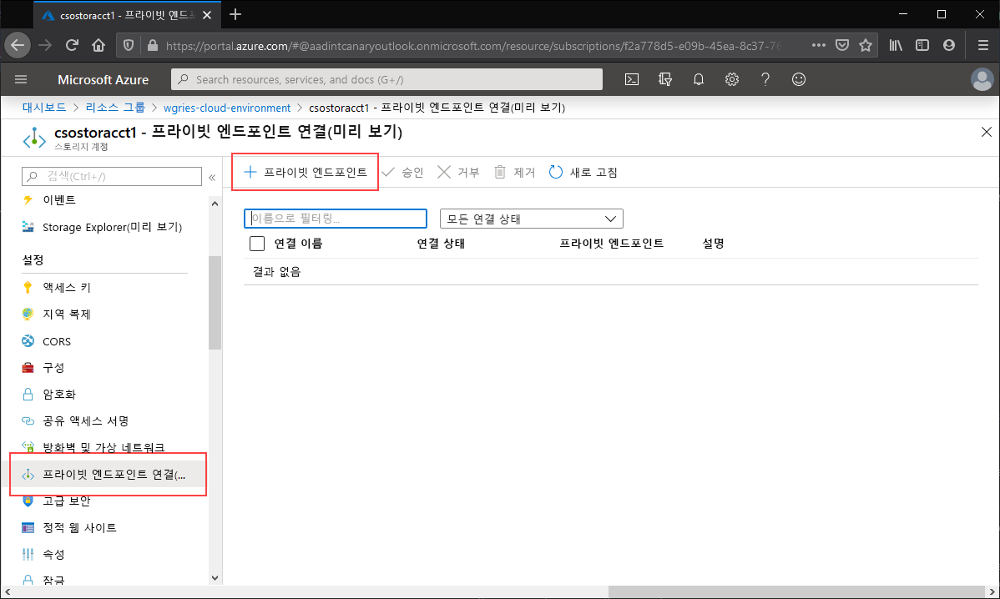
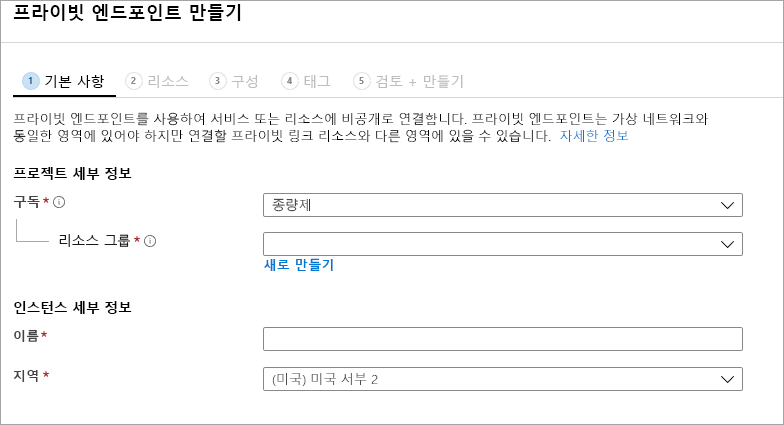
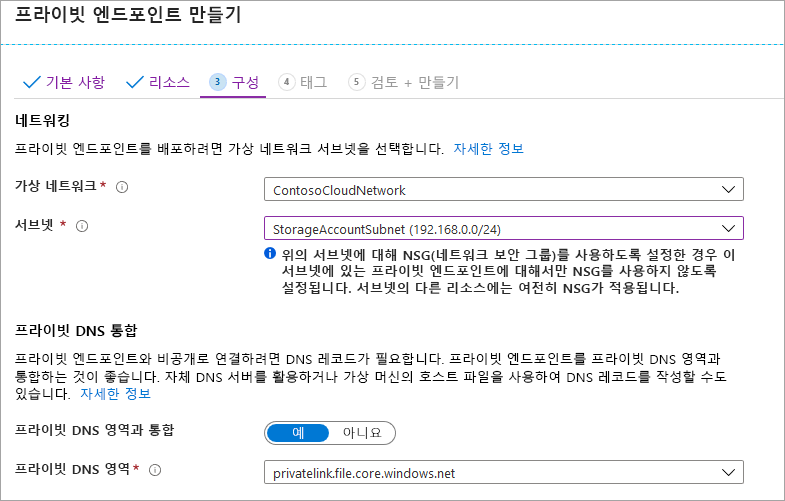
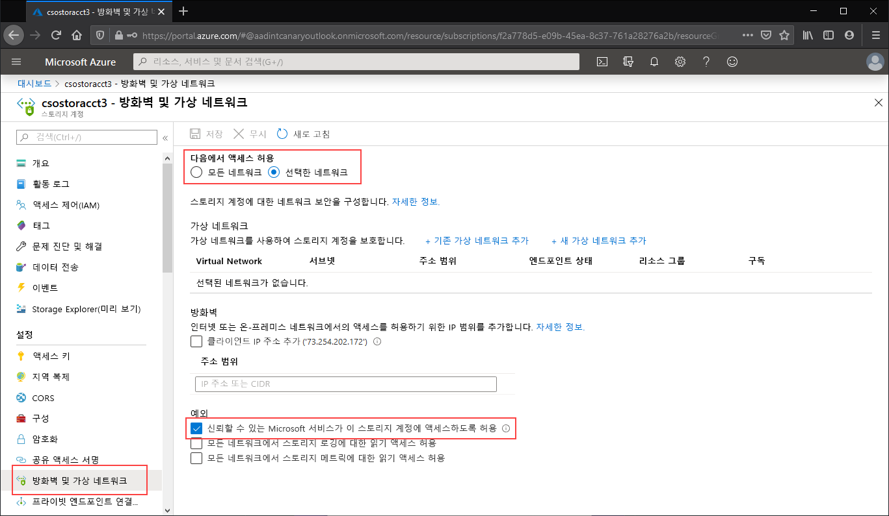
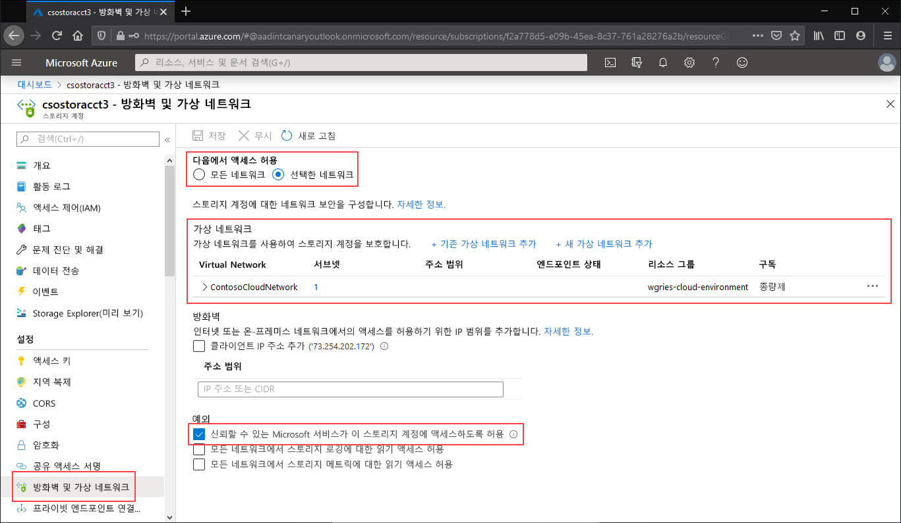

# <a name="configuring-azure-files-network-endpoints"></a>Azure Files 네트워크 엔드포인트 구성
Azure Files는 Azure 파일 공유에 액세스하기 위한 다음과 같은 두 가지 기본 유형의 엔드포인트를 제공합니다. 
- 퍼블릭 엔드포인트 - 공용 IP 주소를 사용하며 전 세계 어디서나 액세스할 수 있습니다.
- 프라이빗 엔드포인트 - 가상 네트워크 내에 존재하며 해당 가상 네트워크의 주소 공간 내에서 개인 IP 주소를 사용합니다.

퍼블릭 엔드포인트와 프라이빗 엔드포인트는 Azure 스토리지 계정에 있습니다. 스토리지 계정은 여러 파일 공유뿐만 아니라 다른 스토리지 리소스(예: Blob 컨테이너 또는 큐)도 배포할 수 있는 공유 스토리지 풀을 나타내는 관리 구조입니다.

이 문서에서는 Azure 파일 공유에 직접 액세스하기 위한 스토리지 계정의 엔드포인트를 구성하는 방법을 중점적으로 설명합니다. 이 문서에 제공된 세부 정보 중 대부분은 Azure 파일 동기화가 스토리지 계정의 퍼블릭 및 프라이빗 엔드포인트와 상호 작용하는 방식에도 적용됩니다. 그러나 Azure 파일 동기화 배포 시 네트워킹 고려 사항에 대한 자세한 내용은 [Azure 파일 동기화 프록시 및 방화벽 설정 구성](storage-sync-files-firewall-and-proxy.md)을 참조하세요.

이 방법 가이드를 읽기 전에 [Azure Files 네트워킹 고려 사항](storage-files-networking-overview.md)을 읽어보는 것이 좋습니다.

## <a name="prerequisites"></a>사전 요구 사항
- 이 문서에서는 독자들이 이미 Azure 구독을 만들었다고 가정합니다. Azure 구독이 아직 없는 경우 시작하기 전에 [체험 계정](https://azure.microsoft.com/free/?WT.mc_id=A261C142F)을 만듭니다.
- 이 문서에서는 독자들이 온-프레미스에서 연결하려는 스토리지 계정에 Azure 파일 공유를 이미 만들었다고 가정합니다. Azure 파일 공유를 만드는 방법을 알아보려면 [Azure 파일 공유 만들기](storage-how-to-create-file-share.md)를 참조하세요.
- Azure PowerShell을 사용하려면 [최신 버전을 설치](https://docs.microsoft.com/powershell/azure/install-az-ps)하세요.
- Azure CLI를 사용하려면 [최신 버전을 설치](https://docs.microsoft.com/cli/azure/install-azure-cli?view=azure-cli-latest)하세요.

## <a name="create-a-private-endpoint"></a>프라이빗 엔드포인트 만들기
스토리지 계정의 프라이빗 엔드포인트를 만들면 다음 Azure 리소스가 배포됩니다.

- **프라이빗 엔드포인트**: 스토리지 계정의 프라이빗 엔드포인트를 나타내는 Azure 리소스입니다. 스토리지 계정과 네트워크 인터페이스를 연결하는 리소스라고 생각하시면 됩니다.
- **NIC(네트워크 인터페이스)** : 지정된 가상 네트워크/서브넷 내에서 개인 IP 주소를 유지 관리하는 네트워크 인터페이스입니다. 가상 머신을 배포할 때 배포되는 것과 정확히 동일한 리소스이지만, VM에 할당되는 것이 아니라 프라이빗 엔드포인트의 소유입니다.
- **프라이빗 DNS 영역**: 이전에 이 가상 네트워크에 대한 프라이빗 엔드포인트를 한 번도 배포하지 않은 경우 가상 네트워크에 대한 새 프라이빗 DNS 영역이 배포됩니다. 이 DNS 영역의 스토리지 계정에 대한 DNS A 레코드도 생성됩니다. 이 가상 네트워크에 프라이빗 엔드포인트를 이미 배포한 경우 스토리지 계정에 대한 새 A 레코드가 기존 DNS 영역에 추가됩니다. DNS 영역을 배포하는 것은 선택 사항이지만 배포할 것을 적극 권장하며, AD 서비스 주체 또는 FileREST API를 사용하여 Azure 파일 공유를 탑재하는 경우에는 필수입니다.

> [!Note]  
> 이 문서에서는 `core.windows.net` Azure 퍼블릭 지역에 대한 스토리지 계정 DNS 접미사를 사용합니다. 이는 Azure US Government 클라우드 및 Azure 중국 클라우드와 같은 Azure 소버린 클라우드에도 적용되며, 사용자 환경에 적합한 접미사로 바꾸기만 하면 됩니다. 

# <a name="portal"></a>[포털](#tab/azure-portal)
프라이빗 엔드포인트를 만들려는 스토리지 계정으로 이동합니다. 스토리지 계정의 목차에서 **프라이빗 엔드포인트 연결**을 선택한 다음, **+ 프라이빗 엔드포인트** 를 선택하여 새 프라이빗 엔드포인트를 만듭니다. 



그 결과로 마법사에는 완료할 페이지가 여러 개 있습니다.

**기본 사항** 블레이드에서 프라이빗 엔드포인트에 원하는 리소스 그룹, 이름 및 지역을 선택합니다. 이러한 항목은 원하는 대로 지정할 수 있지만 어쨌든 간에 스토리지 계정과 일치할 필요가 없습니다. 그러나 프라이빗 엔드포인트는 해당 프라이빗 엔드포인트를 만들려는 가상 네트워크와 동일한 지역에 만들어야 합니다.



**리소스** 블레이드에서 **내 디렉터리에서 Azure 리소스에 연결** 라디오 단추를 선택합니다. **리소스 종류** 아래에서 리소스 종류에 대해 **Microsoft.Storage/storageAccounts**를 선택합니다. **리소스** 필드는 연결하려는 Azure 파일 공유가 있는 스토리지 계정입니다. 대상 하위 리소스는 Azure Files용이므로 **파일**입니다.

**구성** 블레이드에서는 프라이빗 엔드포인트를 추가할 가상 네트워크 및 서브넷을 선택할 수 있습니다. 위에서 만든 가상 네트워크를 선택합니다. 위에서 서비스 엔드포인트를 추가한 서브넷과 다른 별도의 서브넷을 선택해야 합니다. 구성 블레이드에는 프라이빗 DNS 영역을 만들거나 업데이트하기 위한 정보도 포함되어 있습니다. 기본 `privatelink.file.core.windows.net` 영역을 사용하는 것이 좋습니다.



**검토 + 만들기**를 클릭하여 프라이빗 엔드포인트를 만듭니다. 

가상 네트워크 내에 가상 머신이 있거나 [여기](storage-files-networking-dns.md)에 설명된 대로 DNS 전달을 구성한 경우 PowerShell, 명령줄 또는 터미널에서 다음 명령을 실행하여 프라이빗 엔드포인트가 올바르게 설정되었는지 테스트할 수 있습니다(Windows, Linux 또는 macOS에서 작동). 다음과 같이 `<storage-account-name>`을 적절한 스토리지 계정 이름으로 바꿔야 합니다.

```
nslookup <storage-account-name>.file.core.windows.net
```

모든 것이 정상적으로 작동하는 경우 다음과 같은 출력이 표시됩니다. 여기서 `192.168.0.5`는 가상 네트워크의 프라이빗 엔드포인트 개인 IP 주소입니다(Windows에 표시되는 출력).

```Output
Server:  UnKnown
Address:  10.2.4.4

Non-authoritative answer:
Name:    storageaccount.privatelink.file.core.windows.net
Address:  192.168.0.5
Aliases:  storageaccount.file.core.windows.net
```

# <a name="powershell"></a>[PowerShell](#tab/azure-powershell)
스토리지 계정의 프라이빗 엔드포인트를 만들려면 먼저 프라이빗 엔드포인트를 추가하려는 스토리지 계정과 가상 네트워크 서브넷의 참조를 가져와야 합니다. 다음과 같이 `<storage-account-resource-group-name>`, `<storage-account-name>`, `<vnet-resource-group-name>`, `<vnet-name>` 및 `<vnet-subnet-name>`을 바꿉니다.

```PowerShell
$storageAccountResourceGroupName = "<storage-account-resource-group-name>"
$storageAccountName = "<storage-account-name>"
$virtualNetworkResourceGroupName = "<vnet-resource-group-name>"
$virtualNetworkName = "<vnet-name>"
$subnetName = "<vnet-subnet-name>"

# Get storage account reference, and throw error if it doesn't exist
$storageAccount = Get-AzStorageAccount `
        -ResourceGroupName $storageAccountResourceGroupName `
        -Name $storageAccountName `
        -ErrorAction SilentlyContinue

if ($null -eq $storageAccount) {
    $errorMessage = "Storage account $storageAccountName not found "
    $errorMessage += "in resource group $storageAccountResourceGroupName."
    Write-Error -Message $errorMessage -ErrorAction Stop
}

# Get virtual network reference, and throw error if it doesn't exist
$virtualNetwork = Get-AzVirtualNetwork `
        -ResourceGroupName $virtualNetworkResourceGroupName `
        -Name $virtualNetworkName `
        -ErrorAction SilentlyContinue

if ($null -eq $virtualNetwork) {
    $errorMessage = "Virtual network $virtualNetworkName not found "
    $errorMessage += "in resource group $virtualNetworkResourceGroupName."
    Write-Error -Message $errorMessage -ErrorAction Stop
}

# Get reference to virtual network subnet, and throw error if it doesn't exist
$subnet = $virtualNetwork | `
    Select-Object -ExpandProperty Subnets | `
    Where-Object { $_.Name -eq $subnetName }

if ($null -eq $subnet) {
    Write-Error `
            -Message "Subnet $subnetName not found in virtual network $virtualNetworkName." `
            -ErrorAction Stop
}
```

프라이빗 엔드포인트를 만들려면 스토리지 계정에 대한 프라이빗 링크 서비스 연결을 만들어야 합니다. 프라이빗 링크 서비스 연결은 프라이빗 엔드포인트를 만들기 위한 입력입니다. 

```PowerShell
# Disable private endpoint network policies
$subnet.PrivateEndpointNetworkPolicies = "Disabled"
$virtualNetwork | Set-AzVirtualNetwork | Out-Null

# Create a private link service connection to the storage account.
$privateEndpointConnection = New-AzPrivateLinkServiceConnection `
        -Name "$storageAccountName-Connection" `
        -PrivateLinkServiceId $storageAccount.Id `
        -GroupId "file"

# Create a new private endpoint.
$privateEndpoint = New-AzPrivateEndpoint `
        -ResourceGroupName $storageAccountResourceGroupName `
        -Name "$storageAccountName-PrivateEndpoint" `
        -Location $virtualNetwork.Location `
        -Subnet $subnet `
        -PrivateLinkServiceConnection $privateEndpointConnection `
        -ErrorAction Stop
```

Azure 프라이빗 DNS 영역을 만들면 스토리지 계정의 원래 이름(예: `storageaccount.file.core.windows.net`)이 가상 네트워크 내부의 개인 IP로 확인됩니다. 프라이빗 엔드포인트 만들기의 관점에서는 선택 사항이지만, AD 사용자 계정을 사용하여 Azure 파일 공유를 탑재하거나 REST API를 통해 액세스하려면 명시적으로 필요합니다.  

```PowerShell
# Get the desired storage account suffix (core.windows.net for public cloud).
# This is done like this so this script will seamlessly work for non-public Azure.
$storageAccountSuffix = Get-AzContext | `
    Select-Object -ExpandProperty Environment | `
    Select-Object -ExpandProperty StorageEndpointSuffix

# For public cloud, this will generate the following DNS suffix:
# privatelink.file.core.windows.net.
$dnsZoneName = "privatelink.file.$storageAccountSuffix"

# Find a DNS zone matching desired name attached to this virtual network.
$dnsZone = Get-AzPrivateDnsZone | `
    Where-Object { $_.Name -eq $dnsZoneName } | `
    Where-Object {
        $privateDnsLink = Get-AzPrivateDnsVirtualNetworkLink `
                -ResourceGroupName $_.ResourceGroupName `
                -ZoneName $_.Name `
                -ErrorAction SilentlyContinue
        
        $privateDnsLink.VirtualNetworkId -eq $virtualNetwork.Id
    }

if ($null -eq $dnsZone) {
    # No matching DNS zone attached to virtual network, so create new one.
    $dnsZone = New-AzPrivateDnsZone `
            -ResourceGroupName $virtualNetworkResourceGroupName `
            -Name $dnsZoneName `
            -ErrorAction Stop

    $privateDnsLink = New-AzPrivateDnsVirtualNetworkLink `
            -ResourceGroupName $virtualNetworkResourceGroupName `
            -ZoneName $dnsZoneName `
            -Name "$virtualNetworkName-DnsLink" `
            -VirtualNetworkId $virtualNetwork.Id `
            -ErrorAction Stop
}
```

이제 프라이빗 DNS 영역에 대한 참조가 생겼으므로 스토리지 계정에 대한 A 레코드를 만들어야 합니다.

```PowerShell
$privateEndpointIP = $privateEndpoint | `
    Select-Object -ExpandProperty NetworkInterfaces | `
    Select-Object @{ 
        Name = "NetworkInterfaces"; 
        Expression = { Get-AzNetworkInterface -ResourceId $_.Id } 
    } | `
    Select-Object -ExpandProperty NetworkInterfaces | `
    Select-Object -ExpandProperty IpConfigurations | `
    Select-Object -ExpandProperty PrivateIpAddress

$privateDnsRecordConfig = New-AzPrivateDnsRecordConfig `
        -IPv4Address $privateEndpointIP

New-AzPrivateDnsRecordSet `
        -ResourceGroupName $virtualNetworkResourceGroupName `
        -Name $storageAccountName `
        -RecordType A `
        -ZoneName $dnsZoneName `
        -Ttl 600 `
        -PrivateDnsRecords $privateDnsRecordConfig `
        -ErrorAction Stop | `
    Out-Null
```

가상 네트워크 내에 가상 머신이 있거나 [여기](storage-files-networking-dns.md)에 설명된 대로 DNS 전달을 구성한 경우 다음 명령을 사용하여 프라이빗 엔드포인트가 올바르게 설정되었는지 테스트할 수 있습니다.

```PowerShell
$storageAccountHostName = [System.Uri]::new($storageAccount.PrimaryEndpoints.file) | `
    Select-Object -ExpandProperty Host

Resolve-DnsName -Name $storageAccountHostName
```

모든 것이 정상적으로 작동하는 경우 다음과 같은 출력이 표시됩니다. 여기서 `192.168.0.5`는 가상 네트워크의 프라이빗 엔드포인트 개인 IP 주소입니다.

```Output
Name                             Type   TTL   Section    NameHost
----                             ----   ---   -------    --------
storageaccount.file.core.windows CNAME  60    Answer     storageaccount.privatelink.file.core.windows.net
.net

Name       : storageaccount.privatelink.file.core.windows.net
QueryType  : A
TTL        : 600
Section    : Answer
IP4Address : 192.168.0.5
```

# <a name="azure-cli"></a>[Azure CLI](#tab/azure-cli)
스토리지 계정의 프라이빗 엔드포인트를 만들려면 먼저 프라이빗 엔드포인트를 추가하려는 스토리지 계정과 가상 네트워크 서브넷의 참조를 가져와야 합니다. 다음과 같이 `<storage-account-resource-group-name>`, `<storage-account-name>`, `<vnet-resource-group-name>`, `<vnet-name>` 및 `<vnet-subnet-name>`을 바꿉니다.

```bash
storageAccountResourceGroupName="<storage-account-resource-group-name>"
storageAccountName="<storage-account-name>"
virtualNetworkResourceGroupName="<vnet-resource-group-name>"
virtualNetworkName="<vnet-name>"
subnetName="<vnet-subnet-name>"

# Get storage account ID 
storageAccount=$(az storage account show \
        --resource-group $storageAccountResourceGroupName \
        --name $storageAccountName \
        --query "id" | \
    tr -d '"')

# Get virtual network ID
virtualNetwork=$(az network vnet show \
        --resource-group $virtualNetworkResourceGroupName \
        --name $virtualNetworkName \
        --query "id" | \
    tr -d '"')

# Get subnet ID
subnet=$(az network vnet subnet show \
        --resource-group $virtualNetworkResourceGroupName \
        --vnet-name $virtualNetworkName \
        --name $subnetName \
        --query "id" | \
    tr -d '"')
```

프라이빗 엔드포인트를 만들려면 먼저 서브넷의 프라이빗 엔드포인트 네트워크 정책을 해제해야 합니다. 그런 다음, `az network private-endpoint create` 명령을 사용하여 프라이빗 엔드포인트를 만들 수 있습니다.

```bash
# Disable private endpoint network policies
az network vnet subnet update \
        --ids $subnet \
        --disable-private-endpoint-network-policies \
        --output none

# Get virtual network location
region=$(az network vnet show \
        --ids $virtualNetwork \
        --query "location" | \
    tr -d '"')

# Create a private endpoint
privateEndpoint=$(az network private-endpoint create \
        --resource-group $virtualNetworkResourceGroupName \
        --name "$storageAccountName-PrivateEndpoint" \
        --location $region \
        --subnet $subnet \
        --private-connection-resource-id $storageAccount \
        --group-ids "file" \
        --connection-name "$storageAccountName-Connection" \
        --query "id" | \
    tr -d '"')
```

Azure 프라이빗 DNS 영역을 만들면 스토리지 계정의 원래 이름(예: `storageaccount.file.core.windows.net`)이 가상 네트워크 내부의 개인 IP로 확인됩니다. 프라이빗 엔드포인트 만들기의 관점에서는 선택 사항이지만, AD 사용자 계정을 사용하여 Azure 파일 공유를 탑재하거나 REST API를 통해 액세스하려면 명시적으로 필요합니다.  

```bash
# Get the desired storage account suffix (core.windows.net for public cloud).
# This is done like this so this script will seamlessly work for non-public Azure.
storageAccountSuffix=$(az cloud show \
        --query "suffixes.storageEndpoint" | \
    tr -d '"')

# For public cloud, this will generate the following DNS suffix:
# privatelink.file.core.windows.net.
dnsZoneName="privatelink.file.$storageAccountSuffix"

# Find a DNS zone matching desired name attached to this virtual network.
possibleDnsZones=$(az network private-dns zone list \
        --query "[?name == '$dnsZoneName'].id" \
        --output tsv)

for possibleDnsZone in $possibleDnsZones
do
    possibleResourceGroupName=$(az resource show \
            --ids $possibleDnsZone \
            --query "resourceGroup" | \
        tr -d '"')
    
    link=$(az network private-dns link vnet list \
            --resource-group $possibleResourceGroupName \
            --zone-name $dnsZoneName \
            --query "[?virtualNetwork.id == '$virtualNetwork'].id" \
            --output tsv)
    
    if [ -z $link ]
    then
        1 > /dev/null
    else 
        dnsZoneResourceGroup=$possibleResourceGroupName
        dnsZone=$possibleDnsZone
        break
    fi  
done

if [ -z $dnsZone ]
then
    # No matching DNS zone attached to virtual network, so create a new one
    dnsZone=$(az network private-dns zone create \
            --resource-group $virtualNetworkResourceGroupName \
            --name $dnsZoneName \
            --query "id" | \
        tr -d '"')
    
    az network private-dns link vnet create \
            --resource-group $resourceGroupName \
            --zone-name $zoneName \
            --name "$virtualNetworkName-DnsLink" \
            --virtual-network $virtualNetwork \
            --registration-enabled false \
            --output none
fi
```

이제 프라이빗 DNS 영역에 대한 참조가 생겼으므로 스토리지 계정에 대한 A 레코드를 만들어야 합니다.

```bash
privateEndpointNIC=$(az network private-endpoint show \
        --ids $privateEndpoint \
        --query "networkInterfaces[0].id" | \
    tr -d '"')

privateEndpointIP=$(az network nic show \
        --ids $privateEndpointNIC \
        --query "ipConfigurations[0].privateIpAddress" | \
    tr -d '"')

az network private-dns record-set a create \
        --resource-group $dnsZoneResourceGroup \
        --zone-name $dnsZoneName \
        --name $storageAccountName \
        --output none

az network private-dns record-set a add-record \
        --resource-group $dnsZoneResourceGroup \
        --zone-name $dnsZoneName \
        --record-set-name $storageAccountName \
        --ipv4-address $privateEndpointIP \
        --output none
```

가상 네트워크 내에 가상 머신이 있거나 [여기](storage-files-networking-dns.md)에 설명된 대로 DNS 전달을 구성한 경우 다음 명령을 사용하여 프라이빗 엔드포인트가 올바르게 설정되었는지 테스트할 수 있습니다.

```bash
httpEndpoint=$(az storage account show \
        --resource-group $storageAccountResourceGroupName \
        --name $storageAccountName \
        --query "primaryEndpoints.file" | \
    tr -d '"')

hostName=$(echo $httpEndpoint | cut -c7-$(expr length $httpEndpoint) | tr -d "/")
nslookup $hostName
```

모든 것이 정상적으로 작동하는 경우 다음과 같은 출력이 표시됩니다. 여기서 `192.168.0.5`는 가상 네트워크의 프라이빗 엔드포인트 개인 IP 주소입니다. privatelink 경로 대신 파일 공유로 계산하려면 storageaccount.file.core.windows.net을 계속 사용해야 합니다.

```Output
Server:         127.0.0.53
Address:        127.0.0.53#53

Non-authoritative answer:
storageaccount.file.core.windows.net      canonical name = storageaccount.privatelink.file.core.windows.net.
Name:   storageaccount.privatelink.file.core.windows.net
Address: 192.168.0.5
```

---

## <a name="restrict-access-to-the-public-endpoint"></a>퍼블릭 엔드포인트에 대한 액세스 제한
스토리지 계정 방화벽 설정을 사용하여 퍼블릭 엔드포인트에 대한 액세스를 제한할 수 있습니다. 일반적으로 스토리지 계정에 대한 대부분의 방화벽 정책은 하나 이상의 가상 네트워크에 대한 네트워킹 액세스를 제한합니다. 스토리지 계정에 대한 액세스를 가상 네트워크로 제한하는 두 가지 방법은 다음과 같습니다.

- [스토리지 계정에 대한 하나 이상의 프라이빗 엔드포인트를 만들고](#create-a-private-endpoint), 모든 액세스를 퍼블릭 엔드포인트로 제한합니다. 이렇게 하면 원하는 가상 네트워크 내에서 시작된 트래픽만 스토리지 계정 내의 Azure 파일 공유에 액세스할 수 있습니다.
- 퍼블릭 엔드포인트를 하나 이상의 가상 네트워크로 제한합니다. 이는 *서비스 엔드포인트*라는 가상 네트워크의 기능을 사용하여 작동합니다. 서비스 엔드포인트를 통해 스토리지 계정으로의 트래픽을 제한하는 경우에도 공용 IP 주소를 통해 스토리지 계정에 액세스하게 됩니다.

### <a name="restrict-all-access-to-the-public-endpoint"></a>퍼블릭 엔드포인트에 대한 모든 액세스 제한
퍼블릭 엔드포인트에 대한 모든 액세스가 제한된 경우에도 프라이빗 엔드포인트를 통해 스토리지 계정에 액세스할 수 있습니다. 그렇지 않으면 스토리지 계정의 퍼블릭 엔드포인트에 대한 유효한 요청이 거부됩니다. 

# <a name="portal"></a>[포털](#tab/azure-portal)
퍼블릭 엔드포인트에 대한 모든 액세스를 제한하려는 스토리지 계정으로 이동합니다. 스토리지 계정의 목차에서 **방화벽 및 가상 네트워크**를 선택합니다.

페이지 위쪽에서 **선택한 네트워크** 라디오 단추를 선택합니다. 그러면 퍼블릭 엔드포인트의 제한을 제어할 수 있는 여러 설정이 표시됩니다. **신뢰할 수 있는 Microsoft 서비스가 이 서비스 계정에 액세스할 수 있도록 허용**을 선택하여 Azure 파일 동기화와 같은 신뢰할 수 있는 자사 Microsoft 서비스에서 스토리지 계정에 액세스할 수 있도록 허용합니다.



# <a name="powershell"></a>[PowerShell](#tab/azure-powershell)
다음 PowerShell 명령은 스토리지 계정의 퍼블릭 엔드포인트에 대한 모든 트래픽을 거부합니다. 이 명령의 `-Bypass` 매개 변수는 `AzureServices`로 설정되었습니다. 이렇게 설정하면 Azure 파일 동기화와 같은 신뢰할 수 있는 자사 서비스에서 퍼블릭 엔드포인트를 통해 스토리지 계정에 액세스할 수 있습니다.

```PowerShell
# This assumes $storageAccount is still defined from the beginning of this of this guide.
$storageAccount | Update-AzStorageAccountNetworkRuleSet `
        -DefaultAction Deny `
        -Bypass AzureServices `
        -WarningAction SilentlyContinue `
        -ErrorAction Stop | `
    Out-Null
```

# <a name="azure-cli"></a>[Azure CLI](#tab/azure-cli)
다음 CLI 명령은 스토리지 계정의 퍼블릭 엔드포인트에 대한 모든 트래픽을 거부합니다. 이 명령의 `-bypass` 매개 변수는 `AzureServices`로 설정되었습니다. 이렇게 설정하면 Azure 파일 동기화와 같은 신뢰할 수 있는 자사 서비스에서 퍼블릭 엔드포인트를 통해 스토리지 계정에 액세스할 수 있습니다.

```bash
# This assumes $storageAccountResourceGroupName and $storageAccountName 
# are still defined from the beginning of this guide.
az storage account update \
    --resource-group $storageAccountResourceGroupName \
    --name $storageAccountName \
    --bypass "AzureServices" \
    --default-action "Deny" \
    --output none
```
---

### <a name="restrict-access-to-the-public-endpoint-to-specific-virtual-networks"></a>퍼블릭 엔드포인트에 대한 액세스를 특정 가상 네트워크로 제한
스토리지 계정을 특정 가상 네트워크로 제한하면 지정된 가상 네트워크 내에서 퍼블릭 엔드포인트에 요청하는 것을 허용하는 것입니다. 이는 *서비스 엔드포인트*라는 가상 네트워크의 기능을 사용하여 작동합니다. 이 방법에 프라이빗 엔드포인트를 사용해도 되고 사용하지 않아도 됩니다.

# <a name="portal"></a>[포털](#tab/azure-portal)
퍼블릭 엔드포인트를 특정 가상 네트워크로 제안하려는 스토리지 계정으로 이동합니다. 스토리지 계정의 목차에서 **방화벽 및 가상 네트워크**를 선택합니다. 

페이지 위쪽에서 **선택한 네트워크** 라디오 단추를 선택합니다. 그러면 퍼블릭 엔드포인트의 제한을 제어할 수 있는 여러 설정이 표시됩니다. **+기존 가상 네트워크 추가**를 클릭하여 퍼블릭 엔드포인트를 통해 스토리지 계정에 액세스할 수 있도록 허용해야 하는 가상 네트워크를 선택합니다. 이렇게 하려면 가상 네트워크를 선택하고 해당 가상 네트워크의 서브넷을 선택해야 합니다. 

**신뢰할 수 있는 Microsoft 서비스가 이 서비스 계정에 액세스할 수 있도록 허용**을 선택하여 Azure 파일 동기화와 같은 신뢰할 수 있는 자사 Microsoft 서비스에서 스토리지 계정에 액세스할 수 있도록 허용합니다.



# <a name="powershell"></a>[PowerShell](#tab/azure-powershell)
서비스 엔드포인트를 사용하여 스토리지 계정의 퍼블릭 엔드포인트에 대한 액세스를 특정 가상 네트워크로 제한하려면 먼저 스토리지 계정 및 가상 네트워크에 대한 정보를 수집해야 합니다. 이 정보를 수집하기 위해 `<storage-account-resource-group>`, `<storage-account-name>`, `<vnet-resource-group-name>`, `<vnet-name>` 및 `<subnet-name>`을 입력합니다.

```PowerShell
$storageAccountResourceGroupName = "<storage-account-resource-group>"
$storageAccountName = "<storage-account-name>"
$restrictToVirtualNetworkResourceGroupName = "<vnet-resource-group-name>"
$restrictToVirtualNetworkName = "<vnet-name>"
$subnetName = "<subnet-name>"

$storageAccount = Get-AzStorageAccount `
        -ResourceGroupName $storageAccountResourceGroupName `
        -Name $storageAccountName `
        -ErrorAction Stop

$virtualNetwork = Get-AzVirtualNetwork `
        -ResourceGroupName $restrictToVirtualNetworkResourceGroupName `
        -Name $restrictToVirtualNetworkName `
        -ErrorAction Stop

$subnet = $virtualNetwork | `
    Select-Object -ExpandProperty Subnets | `
    Where-Object { $_.Name -eq $subnetName }

if ($null -eq $subnet) {
    Write-Error `
            -Message "Subnet $subnetName not found in virtual network $restrictToVirtualNetworkName." `
            -ErrorAction Stop
}
```

스토리지 계정 퍼블릭 엔드포인트로 이동하기 위해 가상 네트워크의 트래픽을 Azure 네트워크 패브릭에서 허용하려면 가상 네트워크 서브넷의 `Microsoft.Storage` 서비스 엔드포인트가 공개되어야 합니다. 다음 PowerShell 명령은 서브넷에 `Microsoft.Storage` 서비스 엔드포인트가 아직 추가되지 않은 경우 이 서비스 엔드포인트를 추가합니다.

```PowerShell
$serviceEndpoints = $subnet | `
    Select-Object -ExpandProperty ServiceEndpoints | `
    Select-Object -ExpandProperty Service

if ($serviceEndpoints -notcontains "Microsoft.Storage") {
    if ($null -eq $serviceEndpoints) {
        $serviceEndpoints = @("Microsoft.Storage")
    } elseif ($serviceEndpoints -is [string]) {
        $serviceEndpoints = @($serviceEndpoints, "Microsoft.Storage")
    } else {
        $serviceEndpoints += "Microsoft.Storage"
    }

    $virtualNetwork = $virtualNetwork | Set-AzVirtualNetworkSubnetConfig `
            -Name $subnetName `
            -AddressPrefix $subnet.AddressPrefix `
            -ServiceEndpoint $serviceEndpoints `
            -WarningAction SilentlyContinue `
            -ErrorAction Stop | `
        Set-AzVirtualNetwork `
            -ErrorAction Stop
}
```

트래픽을 스토리지 계정으로 제한하기 위한 마지막 단계는 네트워킹 규칙을 만들어서 스토리지 계정의 네트워크 규칙 세트에 추가하는 것입니다.

```PowerShell
$networkRule = $storageAccount | Add-AzStorageAccountNetworkRule `
    -VirtualNetworkResourceId $subnet.Id `
    -ErrorAction Stop

$storageAccount | Update-AzStorageAccountNetworkRuleSet `
        -DefaultAction Deny `
        -Bypass AzureServices `
        -VirtualNetworkRule $networkRule `
        -WarningAction SilentlyContinue `
        -ErrorAction Stop | `
    Out-Null
```

# <a name="azure-cli"></a>[Azure CLI](#tab/azure-cli)
서비스 엔드포인트를 사용하여 스토리지 계정의 퍼블릭 엔드포인트에 대한 액세스를 특정 가상 네트워크로 제한하려면 먼저 스토리지 계정 및 가상 네트워크에 대한 정보를 수집해야 합니다. 이 정보를 수집하기 위해 `<storage-account-resource-group>`, `<storage-account-name>`, `<vnet-resource-group-name>`, `<vnet-name>` 및 `<subnet-name>`을 입력합니다.

```bash
storageAccountResourceGroupName="<storage-account-resource-group>"
storageAccountName="<storage-account-name>"
restrictToVirtualNetworkResourceGroupName="<vnet-resource-group-name>"
restrictToVirtualNetworkName="<vnet-name>"
subnetName="<subnet-name>"

storageAccount=$(az storage account show \
        --resource-group $storageAccountResourceGroupName \
        --name $storageAccountName \
        --query "id" | \
    tr -d '"')

virtualNetwork=$(az network vnet show \
        --resource-group $restrictToVirtualNetworkResourceGroupName \
        --name $restrictToVirtualNetworkName \
        --query "id" | \
    tr -d '"')

subnet=$(az network vnet subnet show \
        --resource-group $restrictToVirtualNetworkResourceGroupName \
        --vnet-name $restrictToVirtualNetworkName \
        --name $subnetName \
        --query "id" | \
    tr -d '"')
```

스토리지 계정 퍼블릭 엔드포인트로 이동하기 위해 가상 네트워크의 트래픽을 Azure 네트워크 패브릭에서 허용하려면 가상 네트워크 서브넷의 `Microsoft.Storage` 서비스 엔드포인트가 공개되어야 합니다. 다음 CLI 명령은 서브넷에 `Microsoft.Storage` 서비스 엔드포인트가 아직 추가되지 않은 경우 이 서비스 엔드포인트를 추가합니다.

```bash
serviceEndpoints=$(az network vnet subnet show \
        --resource-group $restrictToVirtualNetworkResourceGroupName \
        --vnet-name $restrictToVirtualNetworkName \
        --name $subnetName \
        --query "serviceEndpoints[].service" \
        --output tsv)

foundStorageServiceEndpoint=false
for serviceEndpoint in $serviceEndpoints
do
    if [ $serviceEndpoint = "Microsoft.Storage" ]
    then
        foundStorageServiceEndpoint=true
    fi
done

if [ $foundStorageServiceEndpoint = false ] 
then
    serviceEndpointList=""

    for serviceEndpoint in $serviceEndpoints
    do
        serviceEndpointList+=$serviceEndpoint
        serviceEndpointList+=" "
    done
    
    serviceEndpointList+="Microsoft.Storage"

    az network vnet subnet update \
            --ids $subnet \
            --service-endpoints $serviceEndpointList \
            --output none
fi
```

트래픽을 스토리지 계정으로 제한하기 위한 마지막 단계는 네트워킹 규칙을 만들어서 스토리지 계정의 네트워크 규칙 세트에 추가하는 것입니다.

```bash
az storage account network-rule add \
        --resource-group $storageAccountResourceGroupName \
        --account-name $storageAccountName \
        --subnet $subnet \
        --output none

az storage account update \
        --resource-group $storageAccountResourceGroupName \
        --name $storageAccountName \
        --bypass "AzureServices" \
        --default-action "Deny" \
        --output none
```

---

## <a name="see-also"></a>참고 항목
- [Azure Files 네트워킹 고려 사항](storage-files-networking-overview.md)
- [Azure Files에 대한 DNS 전달 구성](storage-files-networking-dns.md)
- [Azure Files에 대한 S2S VPN 구성](storage-files-configure-s2s-vpn.md)
