# 빠른 시작: Windows 가상 머신에서 Azure Files 공유 만들기 및 관리

이 문서에서는 Azure Files 공유를 만들고 사용하기 위한 기본 단계를 설명합니다. 이 빠른 시작에서는 서비스의 작동 원리를 확인할 수 있도록 Azure Files 공유를 신속하게 설정하는 것에 중점을 둡니다. 고유한 환경에서 Azure 파일 공유를 만들고 사용하기 위한 자세한 지침이 필요한 경우 [Windows로 Azure 파일 공유 사용](storage-how-to-use-files-windows.md)를 참조하세요.

Azure 구독이 아직 없는 경우 시작하기 전에 [체험 계정](https://azure.microsoft.com/free/?WT.mc_id=A261C142F)을 만듭니다.

## Azure에 로그인

[Azure Portal](https://portal.azure.com)에 로그인합니다.

## 환경 준비

이 빠른 시작에서는 다음 항목을 설정합니다.

- Azure 스토리지 계정 및 파일 공유
- Windows Server 2016 Datacenter VM

### 저장소 계정 만들기

Azure 파일 공유를 사용하려면 먼저 Azure 스토리지 계정을 만들어야 합니다. 범용 v2 스토리지 계정은 모든 Azure Storage 서비스(BLOB, 파일, 큐, 테이블)에 대한 액세스를 제공합니다. 빠른 시작에서는 범용 v2 스토리지 계정을 만들지만 모든 유형의 스토리지 계정을 만드는 단계는 비슷합니다. 저장소 계정에 포함될 수 있는 공유 수에는 제한이 없습니다. 공유에 저장할 수 있는 파일 수에는 제한이 없으며, 저장소 계정의 최대 용량까지 저장할 수 있습니다.

[!INCLUDE [storage-create-account-portal-include](../../../includes/storage-create-account-portal-include.md)]

### Azure 파일 공유 만들기

이제 파일 공유를 만듭니다.

1. Azure 스토리지 계정 배포가 완료되면 **리소스로 이동**을 선택합니다.
1. 스토리지 계정 창에서 **파일**을 선택합니다.

    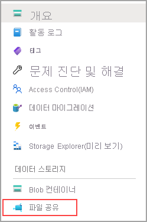

1. **+ 파일 공유**를 선택합니다.

    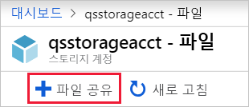

1. 새 파일 공유의 이름을 *qsfileshare*로 지정하고 > **할당량**에 “1”을 입력하고 > **만들기**를 선택합니다. 할당량은 최대 5TiB까지 가능하지만 이 자습서에서는 1GiB만 필요합니다.
1. 로컬 머신에 *qsTestFile*이라는 새 txt 파일을 만듭니다.
1. 새 파일 공유를 선택한 다음, 파일 공유 위치에서 **업로드**를 선택합니다.

    

1. .txt 파일을 만든 위치로 이동하고 > *qsTestFile.txt*를 선택하고 > **업로드**를 선택합니다.

지금까지 Azure에서 Azure 스토리지 계정과, 파일이 하나 있는 파일 공유를 만들었습니다. 이제 이 빠른 시작에서 온-프레미스 서버를 나타내는 Windows Server 2016 Datacenter가 있는 Azure VM을 만들겠습니다.

### VM 배포

1. 이제 포털 왼쪽의 메뉴를 확장하고 Azure Portal 왼쪽 위 모서리에 있는 **리소스 만들기**를 선택합니다.
1. **Azure Marketplace** 리소스 목록 위에 있는 검색 상자에서 **Windows Server 2016 Datacenter**를 검색하고 선택한 다음, **만들기**를 선택합니다.
1. **기본** 탭의 **프로젝트 세부 정보**에서 이 빠른 시작용으로 만든 리소스 그룹을 선택합니다.

   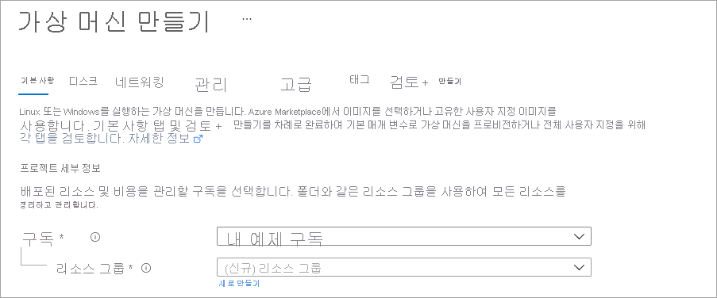

1. **인스턴스 세부 정보**에서 VM 이름을 *qsVM*으로 지정합니다.
1. **지역**, **가용성 옵션**, **이미지** 및 **크기**는 기본 설정을 그대로 둡니다.
1. **관리자 계정**에서 *VMadmin*을 **Username**으로 추가하고 VM에 사용할 **암호**를 입력합니다.
1. **인바운드 포트 규칙**에서 **선택한 포트 허용**을 선택한 다음, 드롭다운에서 **RDP(3389)** 및 **HTTP**를 선택합니다.
1. **검토 + 만들기**를 선택합니다.
1. **만들기**를 선택합니다. 새 VM을 만드는 데 몇 분 정도 걸릴 수 있습니다.

1. VM 배포가 완료되면 **리소스로 이동**을 선택합니다.

지금까지 새 가상 머신을 만들었고 데이터 디스크를 연결했습니다. 이제 VM에 연결해야 합니다.

### VM에 연결

1. 가상 머신 속성 페이지에서 **연결**을 선택합니다.

   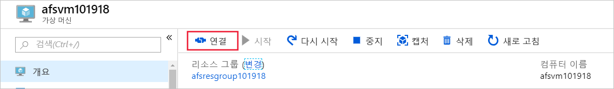

1. **가상 머신에 연결** 페이지에서, **포트 번호** *3389*를 통해 **IP 주소**로 연결하는 기본 옵션을 유지하고 **RDP 파일 다운로드**를 선택합니다.
1. 다운로드한 RDP 파일을 열고 메시지가 표시되면 **연결**을 선택합니다.
1. **Windows 보안** 창에서 **추가 선택 사항** 및 **다른 계정 사용**을 차례로 선택합니다. 사용자 이름으로 *localhost\username*을 입력합니다. 여기서 &lt;username&gt;은 가상 머신에 대해 만든 VM 관리자 사용자 이름입니다. 가상 머신에 대해 만든 암호를 입력한 다음, **확인**을 선택합니다.

   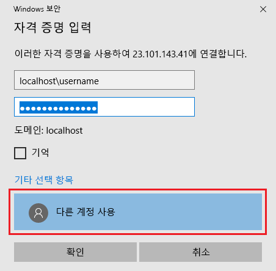

1. 로그인 프로세스 중에 인증서 경고가 나타날 수 있습니다. **예** 또는 **계속**을 선택하여 연결을 만듭니다.

## Azure 파일 공유를 Windows 드라이브로 매핑

1. Azure Portal에서 *qsfileshare* fileshare로 이동하고 **연결**을 선택합니다.
1. 두 번째 상자의 콘텐츠를 복사하고 **메모장**에 붙여넣습니다.

   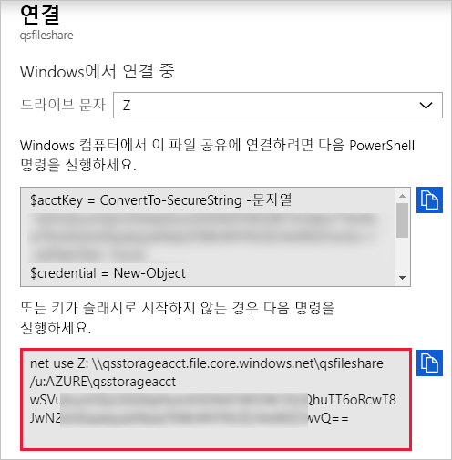

1. VM에서 **파일 탐색기**를 열고 창에서 **이 PC**를 선택합니다. 이렇게 하면 리본에서 사용할 수 있는 메뉴가 변경됩니다. **컴퓨터** 메뉴에서 **네트워크 드라이브 매핑**을 선택합니다.
1. 드라이브 문자를 선택하고 UNC 경로를 입력합니다. 이 빠른 시작에서 명명 제안을 따르는 경우 **메모장**에서 *\\qsstorageacct.file.core.windows.net\qsfileshare*를 복사합니다.

   확인란이 모두 선택되어 있는지 확인합니다.

   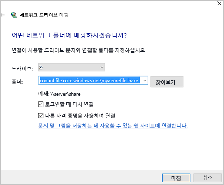

1. **마침**을 선택합니다.
1. **Windows 보안** 대화 상자에서

   - 메모장에서 AZURE\라는 접두어가 붙은 스토리지 계정 이름을 복사하여 **Windows 보안** 대화 상자에 사용자 이름으로 붙여넣습니다. 이 빠른 시작에서 명명 제안을 따른 경우 *AZURE\qsstorageacct*를 복사합니다.
   - 메모장에서 스토리지 계정 키를 복사하여 **Windows 보안** 대화 상자에 암호로 붙여넣습니다.

      

## 공유 스냅샷 만들기

이제 드라이브를 매핑했으므로 스냅샷을 만들 수 있습니다.

1. 포털에서 파일 공유로 이동하고 **스냅샷 만들기**를 선택합니다.

   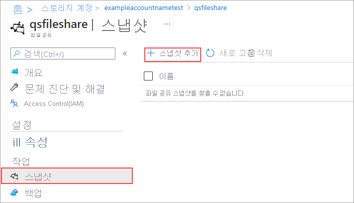

1. VM에서 *qstestfile.txt*를 열고 “이 파일이 수정되었습니다”를 입력하고 > 파일을 저장하고 닫습니다.
1. 다른 스냅샷을 만듭니다.

## 공유 스냅샷 찾아보기

1. 파일 공유에서 **스냅샷 보기**를 선택합니다.
1. **파일 공유 스냅숏** 창에서 목록 중 첫 번째 스냅숏을 선택합니다.

   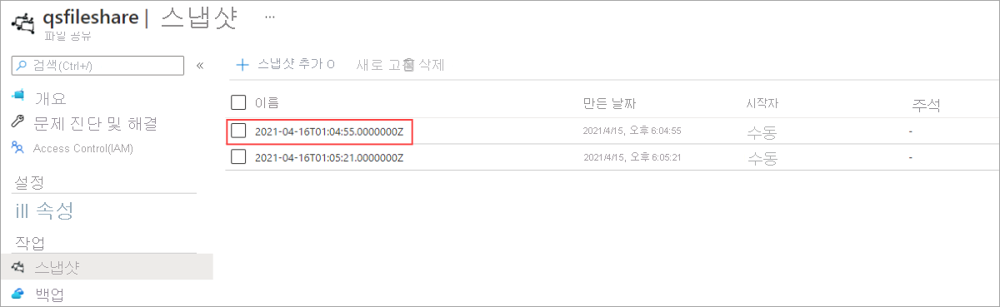

1. 해당 스냅샷에 대한 창에서 *qsTestFile.txt*를 선택합니다.

## 스냅샷에서 복원

1. 파일 공유 스냅샷 블레이드에서 *qsTestFile*을 마우스 오른쪽 단추로 클릭하고 **복원** 단추를 선택합니다.
1. **원본 파일 덮어쓰기**를 선택합니다.

   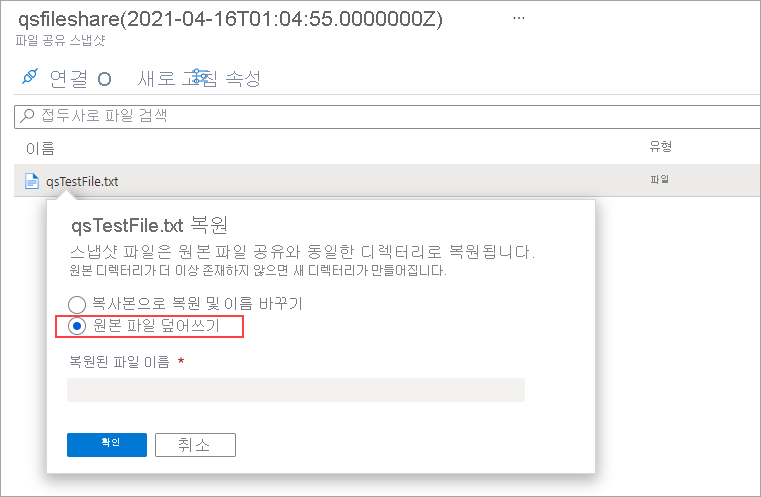

1. VM에서 파일을 엽니다. 수정되지 않은 버전이 복원되었습니다.

## 공유 스냅샷 삭제

1. 파일 공유에서 **스냅샷 보기**를 선택합니다.
1. **파일 공유 스냅숏** 창에서 목록 중 마지막 스냅숏을 선택하고 **삭제**를 클릭합니다.

   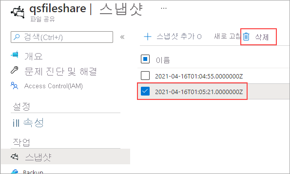

## Windows에서 공유 스냅샷 사용

온-프레미스 VSS 스냅샷과 마찬가지로 이전 버전 탭을 사용하여 탑재된 Azure 파일 공유의 스냅샷을 볼 수 있습니다.

1. 파일 탐색기에서 탑재된 공유를 찾습니다.

   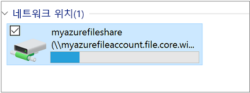

1. *qsTestFile.txt*를 선택하고 > 마우스 오른쪽 단추를 클릭하고 메뉴에서 **속성**을 선택합니다.

   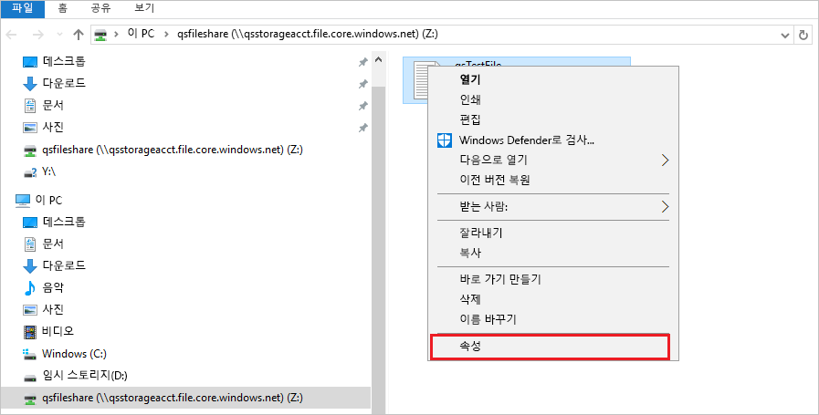

1. **이전 버전**을 선택하여 이 디렉터리에 대한 공유 스냅숏의 목록을 봅니다.

1. **열기**를 선택하여 스냅숏을 엽니다.

   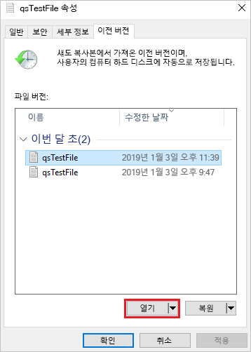

## 이전 버전에서 복원

1. **복원**을 선택합니다. 그러면 공유 스냅샷을 만들 때 전체 디렉터리의 콘텐츠가 원래 위치에 재귀적으로 복사됩니다.

   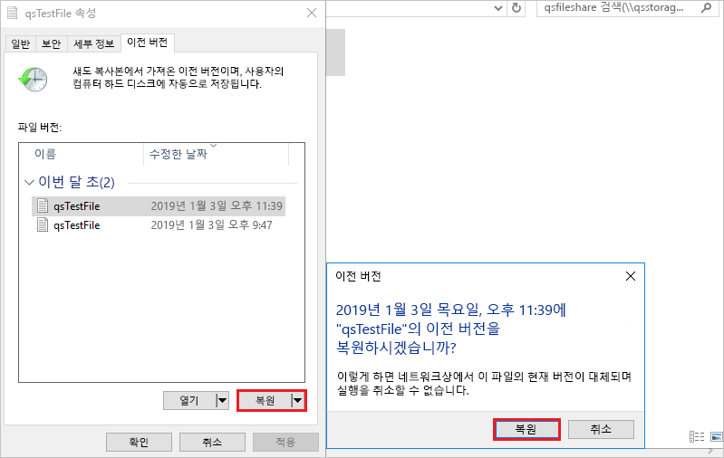

## 리소스 정리

[!INCLUDE [storage-files-clean-up-portal](../../../includes/storage-files-clean-up-portal.md)]

## 다음 단계

> [!div class="nextstepaction"]
> [Windows에서 Azure 파일 공유 사용](storage-how-to-use-files-windows.md)
