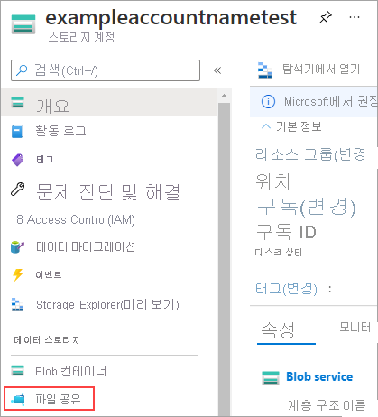
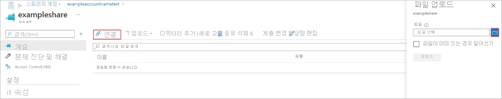

# Azure Portal을 사용하여 Azure 파일 공유 관리 
[Azure Files](storage-files-introduction.md)는 사용하기 쉬운 Microsoft 클라우드 파일 시스템입니다. Azure 파일 공유는 Windows, Linux 및 macOS에 탑재할 수 있습니다. 이 가이드에서는 [Azure Portal](https://portal.azure.com/)을 사용하여 Azure 파일 공유 작업의 기본 사항을 안내합니다. 방법 배우기:

> [!div class="checklist"]
> * 리소스 그룹 및 저장소 계정 만들기
> * Azure 파일 공유 만들기 
> * 디렉터리 만들기
> * 파일 업로드 
> * 파일 다운로드
> * 공유 스냅숏 만들기 및 사용

Azure 구독이 아직 없는 경우 시작하기 전에 [체험 계정](https://azure.microsoft.com/free/?WT.mc_id=A261C142F)을 만들 수 있습니다.

## 저장소 계정 만들기
[!INCLUDE [storage-files-create-storage-account-portal](../../../includes/storage-files-create-storage-account-portal.md)]

## 파일 공유 만들기
파일 공유를 만들려면,

1. 대시보드에서 저장소 계정을 선택합니다.
2. 저장소 계정 페이지의 **서비스** 섹션에서 **파일**을 선택합니다.
    

3. **파일 서비스** 페이지 위쪽의 메뉴에서 **+ 파일 공유**를 클릭합니다. **새 파일 공유** 페이지가 드롭다운 방식으로 펼쳐집니다.
4. **이름**에서 *myshare*를 입력합니다.
5. **확인**을 클릭하여 Azure 파일 공유를 만듭니다.

## Azure 파일 공유의 콘텐츠 작업
이제 Azure 파일 공유를 만들었으므로 SMB를 사용하여 [Windows](storage-how-to-use-files-windows.md), [Linux](storage-how-to-use-files-linux.md) 또는 [macOS](storage-how-to-use-files-mac.md)에 파일 공유를 탑재할 수 있습니다. 또는 Azure Portal을 사용하여 Azure 파일 공유를 작업할 수 있습니다. Azure Portal을 통한 모든 요청은 파일 REST API를 통해 수행되므로 SMB에 액세스하지 않고도 클라이언트에서 파일과 디렉터리를 만들고, 수정하고, 삭제할 수 있습니다.

### 디렉터리 만들기
Azure 파일 공유의 루트에 *myDirectory*라는 새 디렉터리를 만들려면,

1. **파일 서비스** 페이지에서 **myshare** 파일 공유를 선택합니다. 파일 공유 페이지가 열립니다.
2. 페이지 위쪽의 메뉴에서 **+ 디렉터리 추가**를 선택합니다. **새 디렉터리** 페이지가 드롭다운 방식으로 펼쳐집니다.
3. *myDirectory*를 입력한 다음, **확인**을 클릭합니다.

### 파일 업로드 
파일 업로드를 실제로 보여 주려면 먼저 업로드할 파일을 만들거나 선택해야 합니다. 적절하다고 판단되는 어떤 방법으로든 이 작업을 수행할 수 있습니다. 업로드하려는 파일이 선택되면 다음을 수행합니다.

1. **myDirectory** 디렉터리를 클릭합니다. **myDirectory** 패널이 열립니다.
2. 위쪽의 메뉴에서 **업로드**를 클릭합니다. **파일 업로드** 패널이 열립니다.  
    

3. 폴더 아이콘을 클릭하여 로컬 파일을 탐색할 수 있는 창을 엽니다. 
4. 파일을 선택한 다음, **열기**를 클릭합니다. 
5. **파일 업로드** 페이지에서 파일 이름을 확인한 다음, **업로드**를 클릭합니다.
6. 완료되면 파일이 **myDirectory** 페이지의 목록에 표시됩니다.

### 파일 다운로드
파일을 마우스 오른쪽 단추로 클릭하여 업로드한 파일의 복사본을 다운로드할 수 있습니다. 다운로드 단추를 클릭하면 표시되는 정확한 환경은 사용 중인 운영 체제와 브라우저에 따라 다릅니다.

## 공유 스냅숏 만들기 및 수정
Azure 파일 공유를 사용하여 수행할 수 있는 유용한 한 가지 추가 작업은 공유 스냅숏을 만드는 것입니다. 스냅숏은 Azure 파일 공유에 대한 시점을 유지합니다. 공유 스냅숏은 이미 익숙한 다음과 같은 운영 체제 기술과 비슷합니다.
- NTFS 및 ReFS와 같은 Windows 파일 시스템용 [VSS(볼륨 섀도 복사본 서비스)](https://docs.microsoft.com/en-us/windows/desktop/VSS/volume-shadow-copy-service-portal)
- Linux 시스템용 [LVM(논리 볼륨 관리자)](https://en.wikipedia.org/wiki/Logical_Volume_Manager_(Linux)#Basic_functionality) 스냅숏
- macOS용 [APFS(Apple 파일 시스템)](https://developer.apple.com/library/content/documentation/FileManagement/Conceptual/APFS_Guide/Features/Features.html) 스냅숏 

공유 스냅숏을 만들려면:

1. 대시보드 > **파일** > **myshare**에서 저장소 계정을 열어 파일 공유 페이지를 엽니다. 
2. 파일 공유 페이지 위쪽의 메뉴에서 **스냅숏** 단추를 클릭한 다음, **스냅숏 만들기**를 선택합니다.  
    

### 공유 스냅숏 나열 및 찾아보기
스냅숏이 만들어지면 **스냅숏**을 다시 클릭한 다음, **스냅숏 보기**를 선택하여 공유에 대한 스냅숏을 나열할 수 있습니다. 결과 창에는 이 공유에 대한 스냅숏이 표시됩니다. 공유 스냅숏을 클릭하여 찾아봅니다.

### 공유 스냅숏에서 복원
공유 스냅숏에서 파일을 복원하는 방법을 실제로 보여 주려면, 먼저 라이브 Azure 파일 공유에서 파일을 삭제해야 합니다. *myDirectory* 폴더로 이동하고, 업로드한 파일을 마우스 오른쪽 단추로 클릭한 다음, **삭제**를 클릭합니다. 그런 다음, 공유 스냅숏에서 해당 파일을 복원하려면 다음을 수행합니다.

1. 위쪽 메뉴에서 **스냅숏**을 클릭하고 **스냅숏 보기**를 선택합니다. 
2. 이전에 만든 스냅숏을 클릭하면 새 페이지의 내용이 열립니다. 
3. 스냅숏에서 **myDirectory**를 클릭하면 삭제한 파일이 표시됩니다. 
4. 삭제한 파일을 마우스 오른쪽 단추로 클릭하고 **복원**을 선택합니다.
5. 파일을 복사본으로 복원하거나 원래 파일을 덮어쓸지를 선택할 수 있는 팝업이 표시됩니다. 원래 파일을 삭제했으므로 **원본 파일 덮어쓰기**를 선택하여 파일을 삭제하기 전의 상태로 복원할 수 있습니다. **확인**을 클릭하여 Azure 파일 공유에 파일을 복원합니다.  
    

6. 파일 복원이 완료되면 스냅숏 페이지를 닫고 **myshare** > **myDirectory**로 돌아가서 파일을 원래 위치로 다시 두어야 합니다.

### 공유 스냅숏 삭제
공유 스냅숏을 삭제하려면 [공유 스냅숏 목록으로 이동](#list-and-browse-a-share-snapshot)합니다. 공유 스냅숏의 이름 옆에 있는 확인란을 클릭하고 **삭제** 단추를 선택합니다.

## 리소스 정리
[!INCLUDE [storage-files-clean-up-portal](../../../includes/storage-files-clean-up-portal.md)]

## 다음 단계
- [Azure PowerShell을 사용하여 파일 공유 관리](storage-how-to-use-files-powershell.md)
- [Azure CLI를 사용하여 파일 공유 관리](storage-how-to-use-files-cli.md)
- [Azure Storage 탐색기를 사용하여 파일 공유 관리](storage-how-to-use-files-storage-explorer.md)
- [Azure 파일 배포에 대한 계획](storage-files-planning.md)