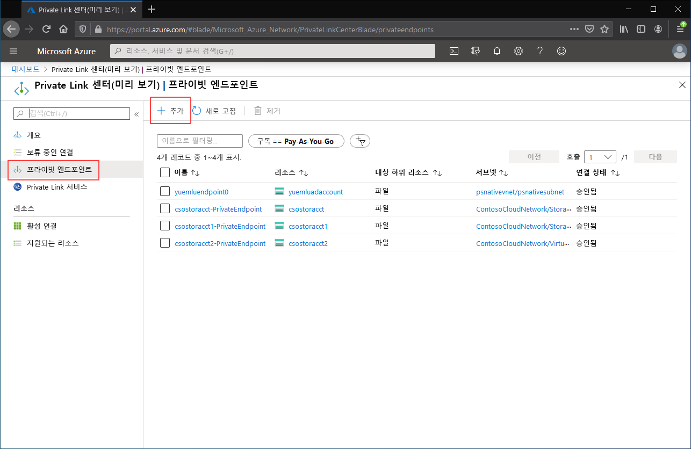
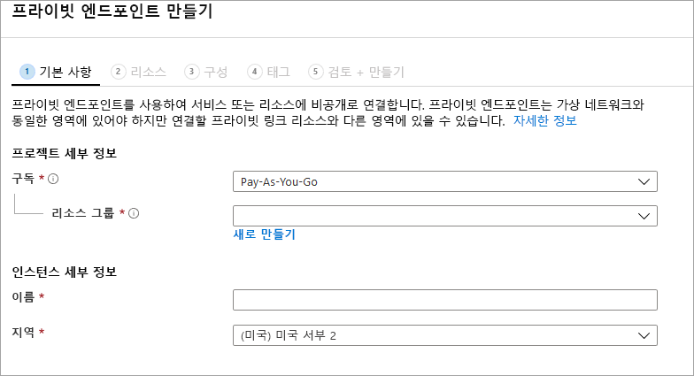

# <a name="configuring-azure-file-sync-network-endpoints"></a>Azure 파일 동기화 네트워크 엔드포인트 구성
Azure Files와 Azure 파일 동기화는 Azure 파일 공유에 액세스하기 위한 다음과 같은 두 가지 기본 유형의 엔드포인트를 제공합니다. 
- 퍼블릭 엔드포인트 - 공용 IP 주소를 사용하며 전 세계 어디서나 액세스할 수 있습니다.
- 프라이빗 엔드포인트 - 가상 네트워크 내에 존재하며 해당 가상 네트워크의 주소 공간 내에서 개인 IP 주소를 사용합니다.

Azure Files와 Azure 파일 동기화에서 모두 Azure 관리 개체, 스토리지 계정 및 스토리지 동기화 서비스가 각각 퍼블릭 엔드포인트와 프라이빗 엔드포인트를 둘 다 제어합니다. 스토리지 계정은 여러 파일 공유뿐만 아니라 다른 스토리지 리소스(예: BLOB 컨테이너 또는 큐)도 배포할 수 있는 공유 스토리지 풀을 나타내는 관리 구조입니다. 스토리지 동기화 서비스는 등록된 서버를 나타내는 관리 구문입니다. 이 등록된 서버는 Azure 파일 동기화와 신뢰 관계가 설정된 Windows 파일 서버와 동기화 관계의 토폴로지를 정의하는 동기화 그룹으로 구성되어 있습니다. 

이 문서에서는 Azure Files 및 Azure 파일 동기화의 네트워킹 엔드포인트를 구성하는 방법을 중점적으로 설명합니다. Azure 파일 동기화로 온-프레미스 캐싱을 사용하는 대신 Azure 파일 공유에 직접 액세스하도록 네트워킹 엔드포인트를 구성하는 방법에 대한 자세한 정보는 [Azure Files 네트워크 엔드포인트 구성](storage-files-networking-endpoints.md)을 참조하세요.

이 방법 가이드를 읽기 전에 [Azure 파일 동기화 네트워킹 고려 사항](storage-sync-files-networking-overview.md)을 읽어보는 것이 좋습니다.

## <a name="prerequisites"></a>필수 구성 요소 
이 문서에서는 다음을 가정합니다.
- Azure 구독이 있습니다. Azure 구독이 아직 없는 경우 시작하기 전에 [체험 계정](https://azure.microsoft.com/free/?WT.mc_id=A261C142F)을 만듭니다.
- 온-프레미스에서 연결하려는 스토리지 계정에 Azure 파일 공유를 이미 만들었습니다. Azure 파일 공유를 만드는 방법을 알아보려면 [Azure 파일 공유 만들기](storage-how-to-create-file-share.md)를 참조하세요.
- 스토리지 동기화 서비스를 이미 만들었으며 이 서비스를 사용하여 Windows 파일 서버를 등록했습니다. Azure 파일 동기화를 배포하는 방법은 [Azure 파일 동기화 배포](storage-sync-files-deployment-guide.md)를 참조하세요.

또한 다음 작업도 수행해야 합니다.
- Azure PowerShell을 사용하려면 [최신 버전을 설치](https://docs.microsoft.com/powershell/azure/install-az-ps)하세요.
- Azure CLI를 사용하려면 [최신 버전을 설치](https://docs.microsoft.com/cli/azure/install-azure-cli?view=azure-cli-latest)하세요.

## <a name="create-the-private-endpoints"></a>프라이빗 엔드포인트 만들기
Azure 리소스의 프라이빗 엔드포인트를 만들 때 배포되는 리소스는 다음과 같습니다.

- **프라이빗 엔드포인트**: 스토리지 계정 또는 스토리지 동기화 서비스의 프라이빗 엔드포인트를 나타내는 Azure 리소스입니다. Azure 리소스와 네트워크 인터페이스를 연결하는 리소스라고 생각하면 됩니다.
- **NIC(네트워크 인터페이스)** : 지정된 가상 네트워크/서브넷 내에서 개인 IP 주소를 유지 관리하는 네트워크 인터페이스입니다. 가상 머신을 배포할 때 배포되는 것과 정확히 동일한 리소스이지만, VM에 할당되는 것이 아니라 프라이빗 엔드포인트의 소유입니다.
- **프라이빗 DNS 영역**: 이전에 이 가상 네트워크에 대한 프라이빗 엔드포인트를 한 번도 배포하지 않은 경우 가상 네트워크에 대한 새 프라이빗 DNS 영역이 배포됩니다. 이 DNS 영역의 Azure 리소스에 대한 DNS A 레코드도 생성됩니다. 이 가상 네트워크에 프라이빗 엔드포인트를 이미 배포했으면 Azure 리소스에 대한 새로운 A 레코드가 기존 DNS 영역에 추가됩니다. DNS 영역 배포는 선택 사항이지만 필요한 DNS 관리를 간소화하기 위해 적극 권장됩니다.

> [!Note]  
> 이 문서에서는 Azure 공용 지역에 DNS 접미사를 사용하며 스토리지 계정에는 `core.windows.net`, 스토리지 동기화 서비스에는 `afs.azure.net`을 사용합니다. 이는 Azure US Government 클라우드와 같은 Azure 소버린 클라우드에도 적용되며, 사용자 환경에 적합한 접미사로 바꾸기만 하면 됩니다.

### <a name="create-the-storage-account-private-endpoint"></a>스토리지 계정 프라이빗 엔드포인트 만들기
# <a name="portal"></a>[포털](#tab/azure-portal)
[!INCLUDE [storage-files-networking-endpoints-private-portal](../../../includes/storage-files-networking-endpoints-private-portal.md)]

가상 네트워크 내에 가상 머신이 있거나 [Azure Files에 대한 DNS 전달 구성](storage-files-networking-dns.md)에 설명된 대로 DNS 전달을 구성한 경우, PowerShell, 명령줄 또는 터미널에서 다음 명령을 실행하여 프라이빗 엔드포인트가 올바르게 설정되었는지 테스트할 수 있습니다(Windows, Linux 또는 macOS에서 작동). 다음과 같이 `<storage-account-name>`을 적절한 스토리지 계정 이름으로 바꿔야 합니다.

```
nslookup <storage-account-name>.file.core.windows.net
```

모든 것이 정상적으로 작동하는 경우 다음과 같은 출력이 표시됩니다. 여기서 `192.168.0.5`는 가상 네트워크의 프라이빗 엔드포인트 개인 IP 주소입니다(Windows에 표시되는 출력).

```Output
Server:  UnKnown
Address:  10.2.4.4

Non-authoritative answer:
Name:    storageaccount.privatelink.file.core.windows.net
Address:  192.168.0.5
Aliases:  storageaccount.file.core.windows.net
```

# <a name="powershell"></a>[PowerShell](#tab/azure-powershell)
[!INCLUDE [storage-files-networking-endpoints-private-powershell](../../../includes/storage-files-networking-endpoints-private-powershell.md)]

가상 네트워크 내에 가상 머신이 있거나 [Azure Files에 대한 DNS 전달 구성](storage-files-networking-dns.md)에 설명된 대로 DNS 전달을 구성한 경우, 다음 명령을 사용하여 프라이빗 엔드포인트가 올바르게 설정되었는지 테스트할 수 있습니다.

```PowerShell
$storageAccountHostName = [System.Uri]::new($storageAccount.PrimaryEndpoints.file) | `
    Select-Object -ExpandProperty Host

Resolve-DnsName -Name $storageAccountHostName
```

모든 것이 정상적으로 작동하는 경우 다음과 같은 출력이 표시됩니다. 여기서 `192.168.0.5`는 가상 네트워크의 프라이빗 엔드포인트 개인 IP 주소입니다.

```Output
Name                             Type   TTL   Section    NameHost
----                             ----   ---   -------    --------
storageaccount.file.core.windows CNAME  60    Answer     storageaccount.privatelink.file.core.windows.net
.net

Name       : storageaccount.privatelink.file.core.windows.net
QueryType  : A
TTL        : 600
Section    : Answer
IP4Address : 192.168.0.5
```

# <a name="azure-cli"></a>[Azure CLI](#tab/azure-cli)
[!INCLUDE [storage-files-networking-endpoints-private-cli](../../../includes/storage-files-networking-endpoints-private-cli.md)]

가상 네트워크 내에 가상 머신이 있거나 [Azure Files에 대한 DNS 전달 구성](storage-files-networking-dns.md)에 설명된 대로 DNS 전달을 구성한 경우, 다음 명령을 사용하여 프라이빗 엔드포인트가 올바르게 설정되었는지 테스트할 수 있습니다.

```bash
httpEndpoint=$(az storage account show \
        --resource-group $storageAccountResourceGroupName \
        --name $storageAccountName \
        --query "primaryEndpoints.file" | \
    tr -d '"')

hostName=$(echo $httpEndpoint | cut -c7-$(expr length $httpEndpoint) | tr -d "/")
nslookup $hostName
```

모든 것이 정상적으로 작동하는 경우 다음과 같은 출력이 표시됩니다. 여기서 `192.168.0.5`는 가상 네트워크의 프라이빗 엔드포인트 개인 IP 주소입니다.

```Output
Server:         127.0.0.53
Address:        127.0.0.53#53

Non-authoritative answer:
storageaccount.file.core.windows.net      canonical name = storageaccount.privatelink.file.core.windows.net.
Name:   storageaccount.privatelink.file.core.windows.net
Address: 192.168.0.5
```

---

### <a name="create-the-storage-sync-private-endpoint"></a>스토리지 동기화 프라이빗 엔드포인트 만들기
> [!Important]  
> 스토리지 동기화 서비스 리소스에서 프라이빗 엔드포인트를 사용하려면 Azure 파일 동기화 에이전트 버전 10.1 이상을 사용해야 합니다. 에이전트 버전 10.1 이전 버전은 스토리지 동기화 서비스에서 프라이빗 엔드포인트를 지원하지 않습니다. 모든 이전 에이전트 버전은 스토리지 계정 리소스에서 프라이빗 엔드포인트를 지원합니다.

# <a name="portal"></a>[포털](#tab/azure-portal)
Azure Portal 상단의 검색 창에 *Private Link*를 입력하여 **Private Link 센터**로 이동합니다. Private Link 센터의 목차에서 **프라이빗 엔드포인트**를 선택한 다음, **+ 추가**를 선택하여 새 프라이빗 엔드포인트를 만듭니다.

[](media/storage-sync-files-networking-endpoints/create-storage-sync-private-endpoint-0.png#lightbox)

그 결과로 마법사에는 완료할 페이지가 여러 개 있습니다.

**기본 사항** 블레이드에서 프라이빗 엔드포인트에 원하는 리소스 그룹, 이름 및 지역을 선택합니다. 이러한 항목은 원하는 대로 지정할 수 있지만 스토리지 동기화 서비스와 일치할 필요는 없습니다. 그러나 프라이빗 엔드포인트는 프라이빗 엔드포인트를 만들 가상 네트워크와 동일한 지역에 만들어야 합니다.



**리소스** 블레이드에서 **내 디렉터리에서 Azure 리소스에 연결** 라디오 단추를 선택합니다. **리소스 종류** 아래에서 리소스 종류에 대해 **Microsoft.StorageSync/storageSyncServices**를 선택합니다. 

**구성** 블레이드에서는 프라이빗 엔드포인트를 추가할 가상 네트워크 및 서브넷을 선택할 수 있습니다. 위의 스토리지 계정에 사용한 것과 동일한 가상 네트워크를 선택합니다. 구성 블레이드에는 프라이빗 DNS 영역을 만들거나 업데이트하기 위한 정보도 포함되어 있습니다.

**검토 + 만들기**를 클릭하여 프라이빗 엔드포인트를 만듭니다.

PowerShell에서 다음 명령을 실행하여 프라이빗 엔드포인트가 올바르게 설정되었는지 테스트할 수 있습니다. 

```powershell
$privateEndpointResourceGroupName = "<your-private-endpoint-resource-group>"
$privateEndpointName = "<your-private-endpoint-name>"

Get-AzPrivateEndpoint `
        -ResourceGroupName $privateEndpointResourceGroupName `
        -Name $privateEndpointName `
        -ErrorAction Stop | `
    Select-Object -ExpandProperty NetworkInterfaces | `
    Select-Object -ExpandProperty Id | `
    ForEach-Object { Get-AzNetworkInterface -ResourceId $_ } | `
    Select-Object -ExpandProperty IpConfigurations | `
    Select-Object -ExpandProperty PrivateLinkConnectionProperties | `
    Select-Object -ExpandProperty Fqdns | `
    ForEach-Object { Resolve-DnsName -Name $_ } | `
    Format-List
```

모든 것이 정상적으로 작동하는 경우 다음과 같은 출력이 표시됩니다. 여기서 `192.168.1.4`, `192.168.1.5`, `192.168.1.6`, `192.168.1.7`는 프라이빗 엔드포인트에 할당된 개인 IP 주소입니다.

```Output
Name     : mysssmanagement.westus2.afs.azure.net
Type     : CNAME
TTL      : 60
Section  : Answer
NameHost : mysssmanagement.westus2.privatelink.afs.azure.net


Name       : mysssmanagement.westus2.privatelink.afs.azure.net
QueryType  : A
TTL        : 60
Section    : Answer
IP4Address : 192.168.1.4

Name     : myssssyncp.westus2.afs.azure.net
Type     : CNAME
TTL      : 60
Section  : Answer
NameHost : myssssyncp.westus2.privatelink.afs.azure.net


Name       : myssssyncp.westus2.privatelink.afs.azure.net
QueryType  : A
TTL        : 60
Section    : Answer
IP4Address : 192.168.1.5

Name     : myssssyncs.westus2.afs.azure.net
Type     : CNAME
TTL      : 60
Section  : Answer
NameHost : myssssyncs.westus2.privatelink.afs.azure.net


Name       : myssssyncs.westus2.privatelink.afs.azure.net
QueryType  : A
TTL        : 60
Section    : Answer
IP4Address : 192.168.1.6

Name     : mysssmonitoring.westus2.afs.azure.net
Type     : CNAME
TTL      : 60
Section  : Answer
NameHost : mysssmonitoring.westus2.privatelink.afs.azure.net


Name       : mysssmonitoring.westus2.privatelink.afs.azure.net
QueryType  : A
TTL        : 60
Section    : Answer
IP4Address : 192.168.1.7

```

# <a name="powershell"></a>[PowerShell](#tab/azure-powershell)
스토리지 동기화 서비스의 프라이빗 엔드포인트를 만들려면 먼저 스토리지 동기화 서비스에 대한 참조를 가져와야 합니다. `<storage-sync-service-resource-group>` 및 `<storage-sync-service>`를 사용자 환경에 적합한 값으로 바꿔야 합니다. 다음 PowerShell 명령은 사용자가 이미 위의 가상 네트워크 정보를 입력한 것으로 가정합니다. 

```powershell
$storageSyncServiceResourceGroupName = "<storage-sync-service-resource-group>"
$storageSyncServiceName = "<storage-sync-service>"

$storageSyncService = Get-AzStorageSyncService `
        -ResourceGroupName $storageSyncServiceResourceGroupName `
        -Name $storageSyncServiceName `
        -ErrorAction SilentlyContinue

if ($null -eq $storageSyncService) {
    $errorMessage = "Storage Sync Service $storageSyncServiceName not found "
    $errorMessage += "in resource group $storageSyncServiceResourceGroupName."
    Write-Error -Message $errorMessage -ErrorAction Stop
}
```

프라이빗 엔드포인트를 만들려면 스토리지 동기화 서비스에 대한 프라이빗 링크 서비스 연결을 만들어야 합니다. 프라이빗 링크 연결은 프라이빗 엔드포인트를 만들기 위한 입력입니다.

```PowerShell 
# Disable private endpoint network policies
$subnet.PrivateEndpointNetworkPolicies = "Disabled"
$virtualNetwork = $virtualNetwork | `
    Set-AzVirtualNetwork -ErrorAction Stop

# Create a private link service connection to the storage account.
$privateEndpointConnection = New-AzPrivateLinkServiceConnection `
        -Name "$storageSyncServiceName-Connection" `
        -PrivateLinkServiceId $storageSyncService.ResourceId `
        -GroupId "Afs" `
        -ErrorAction Stop

# Create a new private endpoint.
$privateEndpoint = New-AzPrivateEndpoint `
        -ResourceGroupName $storageSyncServiceResourceGroupName `
        -Name "$storageSyncServiceName-PrivateEndpoint" `
        -Location $virtualNetwork.Location `
        -Subnet $subnet `
        -PrivateLinkServiceConnection $privateEndpointConnection `
        -ErrorAction Stop
```

Azure 프라이빗 DNS 영역을 만들면 `mysssmanagement.westus2.afs.azure.net`과 같은 스토리지 동기화 서비스의 호스트 이름이 가상 네트워크 안의 스토리지 동기화 서비스에 대한 올바른 개인 IP로 확인될 수 있습니다. 이는 프라이빗 엔드포인트 만들기의 관점에서는 선택 사항이지만, Azure 파일 동기화 에이전트가 스토리지 동기화 서비스에 액세스하려면 명시적으로 필요합니다. 

```powershell
# Get the desired Storage Sync Service suffix (afs.azure.net for public cloud).
# This is done like this so this script will seamlessly work for non-public Azure.
$azureEnvironment = Get-AzContext | `
    Select-Object -ExpandProperty Environment | `
    Select-Object -ExpandProperty Name

switch($azureEnvironment) {
    "AzureCloud" {
        $storageSyncSuffix = "afs.azure.net"
    }

    "AzureUSGovernment" {
        $storageSyncSuffix = "afs.azure.us"
    }
    
    default {
        Write-Error 
                -Message "The Azure environment $_ is not currently supported by Azure File Sync." `
                -ErrorAction Stop
    }
}

# For public cloud, this will generate the following DNS suffix:
# privatelink.afs.azure.net
$dnsZoneName = "privatelink.$storageSyncSuffix"

# Find a DNS zone matching desired name attached to this virtual network.
$dnsZone = Get-AzPrivateDnsZone | `
    Where-Object { $_.Name -eq $dnsZoneName } | `
    Where-Object {
        $privateDnsLink = Get-AzPrivateDnsVirtualNetworkLink `
                -ResourceGroupName $_.ResourceGroupName `
                -ZoneName $_.Name `
                -ErrorAction SilentlyContinue
        
        $privateDnsLink.VirtualNetworkId -eq $virtualNetwork.Id
    }

if ($null -eq $dnsZone) {
    # No matching DNS zone attached to virtual network, so create new one.
    $dnsZone = New-AzPrivateDnsZone `
            -ResourceGroupName $virtualNetworkResourceGroupName `
            -Name $dnsZoneName `
            -ErrorAction Stop

    $privateDnsLink = New-AzPrivateDnsVirtualNetworkLink `
            -ResourceGroupName $virtualNetworkResourceGroupName `
            -ZoneName $dnsZoneName `
            -Name "$virtualNetworkName-DnsLink" `
            -VirtualNetworkId $virtualNetwork.Id `
            -ErrorAction Stop
}
```
이제 프라이빗 DNS 영역에 대한 참조가 생겼으므로 스토리지 동기화 서비스에 대한 A 레코드를 만들어야 합니다.

```PowerShell 
$privateEndpointIpFqdnMappings = $privateEndpoint | `
    Select-Object -ExpandProperty NetworkInterfaces | `
    Select-Object -ExpandProperty Id | `
    ForEach-Object { Get-AzNetworkInterface -ResourceId $_ } | `
    Select-Object -ExpandProperty IpConfigurations | `
    ForEach-Object { 
        $privateIpAddress = $_.PrivateIpAddress; 
        $_ | `
            Select-Object -ExpandProperty PrivateLinkConnectionProperties | `
            Select-Object -ExpandProperty Fqdns | `
            Select-Object `
                @{ 
                    Name = "PrivateIpAddress"; 
                    Expression = { $privateIpAddress } 
                }, `
                @{ 
                    Name = "FQDN"; 
                    Expression = { $_ } 
                } 
    }

foreach($ipFqdn in $privateEndpointIpFqdnMappings) {
    $privateDnsRecordConfig = New-AzPrivateDnsRecordConfig `
        -IPv4Address $ipFqdn.PrivateIpAddress
    
    $dnsEntry = $ipFqdn.FQDN.Substring(0, 
        $ipFqdn.FQDN.IndexOf(".", $ipFqdn.FQDN.IndexOf(".") + 1))

    New-AzPrivateDnsRecordSet `
            -ResourceGroupName $virtualNetworkResourceGroupName `
            -Name $dnsEntry `
            -RecordType A `
            -ZoneName $dnsZoneName `
            -Ttl 600 `
            -PrivateDnsRecords $privateDnsRecordConfig `
            -ErrorAction Stop | `
        Out-Null
}
```

# <a name="azure-cli"></a>[Azure CLI](#tab/azure-cli)
스토리지 동기화 서비스의 프라이빗 엔드포인트를 만들려면 먼저 스토리지 동기화 서비스에 대한 참조를 가져와야 합니다. `<storage-sync-service-resource-group>` 및 `<storage-sync-service>`를 사용자 환경에 적합한 값으로 바꿔야 합니다. 다음 CLI 명령은 사용자가 이미 위의 가상 네트워크 정보를 입력한 것으로 가정합니다. 

```bash
storageSyncServiceResourceGroupName="<storage-sync-service-resource-group>"
storageSyncServiceName="<storage-sync-service>"

storageSyncService=$(az resource show \
        --resource-group $storageSyncServiceResourceGroupName \
        --name $storageSyncServiceName \
        --resource-type "Microsoft.StorageSync/storageSyncServices" \
        --query "id" | \
    tr -d '"')

storageSyncServiceRegion=$(az resource show \
        --resource-group $storageSyncServiceResourceGroupName \
        --name $storageSyncServiceName \
        --resource-type "Microsoft.StorageSync/storageSyncServices" \
        --query "location" | \
    tr -d '"')
```

프라이빗 엔드포인트를 만들려면 먼저 서브넷의 프라이빗 엔드포인트 네트워크 정책을 해제해야 합니다. 그런 다음, `az network private-endpoint create` 명령을 사용하여 프라이빗 엔드포인트를 만들 수 있습니다.

```bash
# Disable private endpoint network policies
az network vnet subnet update \
        --ids $subnet \
        --disable-private-endpoint-network-policies \
        --output none

# Get virtual network location
region=$(az network vnet show \
        --ids $virtualNetwork \
        --query "location" | \
    tr -d '"')

# Create a private endpoint
privateEndpoint=$(az network private-endpoint create \
        --resource-group $storageSyncServiceResourceGroupName \
        --name "$storageSyncServiceName-PrivateEndpoint" \
        --location $region \
        --subnet $subnet \
        --private-connection-resource-id $storageSyncService \
        --group-id "Afs" \
        --connection-name "$storageSyncServiceName-Connection" \
        --query "id" | \
    tr -d '"')
```

Azure 프라이빗 DNS 영역을 만들면 `mysssmanagement.westus2.afs.azure.net`과 같은 스토리지 동기화 서비스의 호스트 이름이 가상 네트워크 안의 스토리지 동기화 서비스에 대한 올바른 개인 IP로 확인될 수 있습니다. 이는 프라이빗 엔드포인트 만들기의 관점에서는 선택 사항이지만, Azure 파일 동기화 에이전트가 스토리지 동기화 서비스에 액세스하려면 명시적으로 필요합니다. 

```bash
# Get the desired storage account suffix (afs.azure.net for public cloud).
# This is done like this so this script will seamlessly work for non-public Azure.
azureEnvironment=$(az cloud show \
        --query "name" |
    tr -d '"')

storageSyncSuffix=""
if [ $azureEnvironment == "AzureCloud" ]
then
    storageSyncSuffix="afs.azure.net"
elif [ $azureEnvironment == "AzureUSGovernment" ]
then
    storageSyncSuffix="afs.azure.us"
else
    echo "Unsupported Azure environment $azureEnvironment."
fi

# For public cloud, this will generate the following DNS suffix:
# privatelinke.afs.azure.net.
dnsZoneName="privatelink.$storageSyncSuffix"

# Find a DNS zone matching desired name attached to this virtual network.
possibleDnsZones=""
possibleDnsZones=$(az network private-dns zone list \
        --query "[?name == '$dnsZoneName'].id" \
        --output tsv)

dnsZone=""
possibleDnsZone=""
for possibleDnsZone in $possibleDnsZones
do
    possibleResourceGroupName=$(az resource show \
            --ids $possibleDnsZone \
            --query "resourceGroup" | \
        tr -d '"')
    
    link=$(az network private-dns link vnet list \
            --resource-group $possibleResourceGroupName \
            --zone-name $dnsZoneName \
            --query "[?virtualNetwork.id == '$virtualNetwork'].id" \
            --output tsv)
    
    if [ -z $link ]
    then
        echo "1" > /dev/null
    else 
        dnsZoneResourceGroup=$possibleResourceGroupName
        dnsZone=$possibleDnsZone
        break
    fi  
done

if [ -z $dnsZone ]
then
    # No matching DNS zone attached to virtual network, so create a new one
    dnsZone=$(az network private-dns zone create \
            --resource-group $virtualNetworkResourceGroupName \
            --name $dnsZoneName \
            --query "id" | \
        tr -d '"')
    
    az network private-dns link vnet create \
            --resource-group $virtualNetworkResourceGroupName \
            --zone-name $dnsZoneName \
            --name "$virtualNetworkName-DnsLink" \
            --virtual-network $virtualNetwork \
            --registration-enabled false \
            --output none
    
    dnsZoneResourceGroup=$virtualNetworkResourceGroupName
fi
```

이제 프라이빗 DNS 영역에 대한 참조가 생겼으므로 스토리지 동기화 서비스에 대한 A 레코드를 만들어야 합니다.

```bash
privateEndpointNIC=$(az network private-endpoint show \
        --ids $privateEndpoint \
        --query "networkInterfaces[0].id" | \
    tr -d '"')

privateIpAddresses=$(az network nic show \
        --ids $privateEndpointNIC \
        --query "ipConfigurations[].privateIpAddress" \
        --output tsv) 

hostNames=$(az network nic show \
        --ids $privateEndpointNIC \
        --query "ipConfigurations[].privateLinkConnectionProperties.fqdns[]" \
        --output tsv)

i=0
for privateIpAddress in $privateIpAddresses
do
    j=0
    targetHostName=""
    for hostName in $hostNames
    do
        if [ $i == $j ]
        then
            targetHostName=$hostName
            break
        fi

        j=$(expr $j + 1)
    done

    endpointName=$(echo $targetHostName | \
        cut -c1-$(expr $(expr index $targetHostName ".") - 1))

    az network private-dns record-set a create \
        --resource-group $dnsZoneResourceGroup \
        --zone-name $dnsZoneName \
        --name "$endpointName.$storageSyncServiceRegion" \
        --output none
    
    az network private-dns record-set a add-record \
        --resource-group $dnsZoneResourceGroup \
        --zone-name $dnsZoneName \
        --record-set-name "$endpointName.$storageSyncServiceRegion" \
        --ipv4-address $privateIpAddress \
        --output none

    i=$(expr $i + 1)
done
```
---

## <a name="restrict-access-to-the-public-endpoints"></a>퍼블릭 엔드포인트에 대한 액세스 제한
스토리지 계정 및 스토리지 동기화 서비스의 퍼블릭 엔드포인트에 대한 액세스를 제한할 수 있습니다. 퍼블릭 엔드포인트에 대한 액세스를 제한하면 네트워크 패킷이 승인된 위치에서만 수락되어 추가 보안이 제공됩니다. 

### <a name="restrict-access-to-the-storage-account-public-endpoint"></a>스토리지 계정 퍼블릭 엔드포인트에 대한 액세스 제한
퍼블릭 엔드포인트에 대한 액세스 제한은 스토리지 계정 방화벽 설정을 사용하여 이루어집니다. 일반적으로 스토리지 계정에 대한 대부분의 방화벽 정책은 하나 이상의 가상 네트워크에 대한 네트워킹 액세스를 제한합니다. 스토리지 계정에 대한 액세스를 가상 네트워크로 제한하는 두 가지 방법은 다음과 같습니다.

- [스토리지 계정에 대한 하나 이상의 프라이빗 엔드포인트를 만들고](#create-the-storage-account-private-endpoint) 퍼블릭 엔드포인트에 대한 액세스를 사용하지 않도록 설정합니다. 이렇게 하면 원하는 가상 네트워크 내에서 시작된 트래픽만 스토리지 계정 내의 Azure 파일 공유에 액세스할 수 있습니다.
- 퍼블릭 엔드포인트를 하나 이상의 가상 네트워크로 제한합니다. 이는 *서비스 엔드포인트*라는 가상 네트워크의 기능을 사용하여 작동합니다. 서비스 엔드포인트를 통해 스토리지 계정으로의 트래픽을 제한하는 경우에도 공용 IP 주소를 통해 스토리지 계정에 액세스하게 됩니다.

#### <a name="disable-access-to-the-storage-account-public-endpoint"></a>스토리지 계정 퍼블릭 엔드포인트에 대한 액세스 사용 안 함
퍼블릭 엔드포인트에 대한 액세스를 사용하지 않도록 설정한 경우에도 프라이빗 엔드포인트를 통해 스토리지 계정에 액세스할 수 있습니다. 그렇지 않으면 스토리지 계정의 퍼블릭 엔드포인트에 대한 유효한 요청이 거부됩니다. 

# <a name="portal"></a>[포털](#tab/azure-portal)
[!INCLUDE [storage-files-networking-endpoints-public-disable-portal](../../../includes/storage-files-networking-endpoints-public-disable-portal.md)]

# <a name="powershell"></a>[PowerShell](#tab/azure-powershell)
[!INCLUDE [storage-files-networking-endpoints-public-disable-powershell](../../../includes/storage-files-networking-endpoints-public-disable-powershell.md)]

# <a name="azure-cli"></a>[Azure CLI](#tab/azure-cli)
[!INCLUDE [storage-files-networking-endpoints-public-disable-cli](../../../includes/storage-files-networking-endpoints-public-disable-cli.md)]

---

#### <a name="restrict-access-to-the-storage-account-public-endpoint-to-specific-virtual-networks"></a>스토리지 계정 퍼블릭 엔드포인트에 대한 액세스를 특정 가상 네트워크로 제한
스토리지 계정을 특정 가상 네트워크로 제한하면 지정된 가상 네트워크 내에서 퍼블릭 엔드포인트에 요청하는 것을 허용하는 것입니다. 이는 *서비스 엔드포인트*라는 가상 네트워크의 기능을 사용하여 작동합니다. 이 방법에 프라이빗 엔드포인트를 사용해도 되고 사용하지 않아도 됩니다.

# <a name="portal"></a>[포털](#tab/azure-portal)
[!INCLUDE [storage-files-networking-endpoints-public-restrict-portal](../../../includes/storage-files-networking-endpoints-public-restrict-portal.md)]

# <a name="powershell"></a>[PowerShell](#tab/azure-powershell)
[!INCLUDE [storage-files-networking-endpoints-public-restrict-powershell](../../../includes/storage-files-networking-endpoints-public-restrict-powershell.md)]

# <a name="azure-cli"></a>[Azure CLI](#tab/azure-cli)
[!INCLUDE [storage-files-networking-endpoints-public-restrict-cli](../../../includes/storage-files-networking-endpoints-public-restrict-cli.md)]

---

### <a name="disable-access-to-the-storage-sync-service-public-endpoint"></a>스토리지 동기화 서비스 퍼블릭 엔드포인트에 대한 액세스 사용 안 함
Azure 파일 동기화를 사용하면 특정 가상 네트워크에 대한 액세스를 프라이빗 엔드포인트를 통해서만 가능하도록 제한할 수 있습니다. Azure 파일 동기화는 퍼블릭 엔드포인트에 대한 액세스를 특정 가상 네트워크로 제한하기 위한 서비스 엔드포인트를 지원하지 않습니다. 즉 스토리지 동기화 서비스의 퍼블릭 엔드포인트에 대한 두 가지 상태가 사용 및 사용 안 함입니다.

# <a name="portal"></a>[포털](#tab/azure-portal)
Azure Portal에서는 불가능합니다. 스토리지 동기화 서비스 퍼블릭 엔드포인트를 사용하지 않도록 설정하는 방법에 대한 지침을 보려면 Azure PowerShell 또는 Azure CLI 탭 지침을 선택하세요. 

# <a name="powershell"></a>[PowerShell](#tab/azure-powershell)
스토리지 동기화 서비스의 퍼블릭 엔드포인트에 대한 액세스를 사용하지 않도록 설정하려면 스토리지 동기화 서비스에서 `incomingTrafficPolicy` 속성을 `AllowVirtualNetworksOnly`로 설정합니다. 스토리지 동기화 서비스의 퍼블릭 엔드포인트에 대한 액세스를 사용하도록 설정하려면 `incomingTrafficPolicy`를 `AllowAllTraffic`으로 설정합니다. `<storage-sync-service-resource-group>` 및 `<storage-sync-service>`를 대체해야 합니다.

```powershell
$storageSyncServiceResourceGroupName = "<storage-sync-service-resource-group>"
$storageSyncServiceName = "<storage-sync-service>"

$storageSyncService = Get-AzResource `
        -ResourceGroupName $storageSyncServiceResourceGroupName `
        -ResourceName $storageSyncServiceName `
        -ResourceType "Microsoft.StorageSync/storageSyncServices"

$storageSyncService.Properties.incomingTrafficPolicy = "AllowVirtualNetworksOnly"
$storageSyncService = $storageSyncService | Set-AzResource -Confirm:$false -Force
```

# <a name="azure-cli"></a>[Azure CLI](#tab/azure-cli)
스토리지 동기화 서비스의 퍼블릭 엔드포인트에 대한 액세스를 사용하지 않도록 설정하려면 스토리지 동기화 서비스에서 `incomingTrafficPolicy` 속성을 `AllowVirtualNetworksOnly`로 설정합니다. 스토리지 동기화 서비스의 퍼블릭 엔드포인트에 대한 액세스를 사용하도록 설정하려면 `incomingTrafficPolicy`를 `AllowAllTraffic`으로 설정합니다. `<storage-sync-service-resource-group>` 및 `<storage-sync-service>`를 대체해야 합니다.

```bash
storageSyncServiceResourceGroupName="<storage-sync-service-resource-group>"
storageSyncServiceName="<storage-sync-service>"

az resource update \
        --resource-group $storageSyncServiceResourceGroupName \
        --name $storageSyncServiceName \
        --resource-type "Microsoft.StorageSync/storageSyncServices" \
        --set "properties.incomingTrafficPolicy=AllowVirtualNetworksOnly" \
        --output none
```
---

## <a name="see-also"></a>참고 항목
- [Azure 파일 동기화 배포에 대한 계획](storage-sync-files-planning.md)
- [Azure 파일 동기화 배포](storage-sync-files-deployment-guide.md)