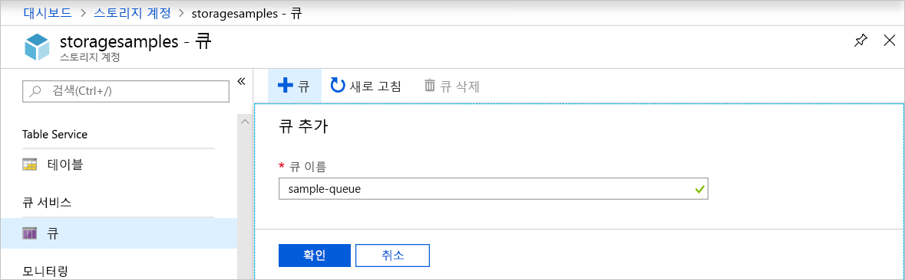
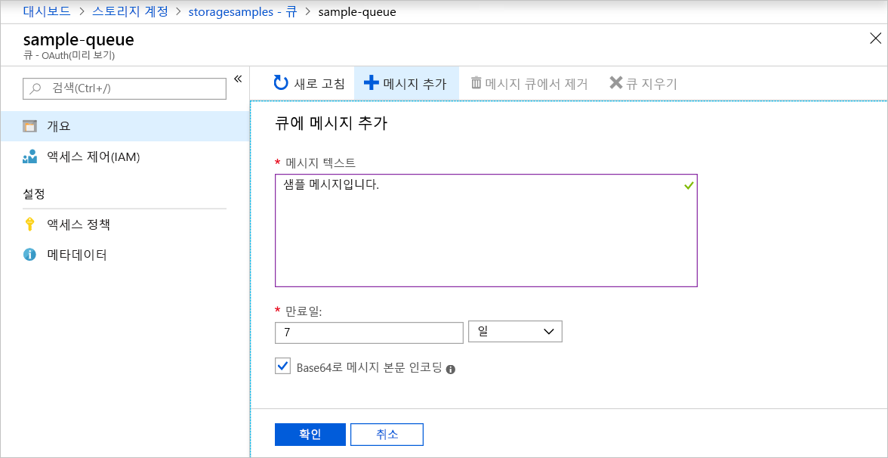
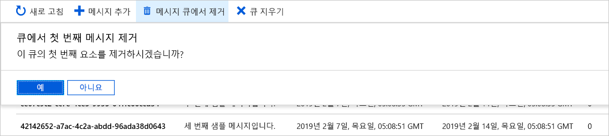

# 빠른 시작: Azure Portal을 사용하여 큐를 만들어서 메시지 추가하기

이 빠른 시작에서는 [Azure Portal](https://portal.azure.com/)을 사용하여 Azure Storage에 큐를 만들고 메시지를 큐에 추가하고 제거하는 방법을 알아봅니다.

## 필수 조건

[!INCLUDE [storage-quickstart-prereq-include](../../../includes/storage-quickstart-prereq-include.md)]

## 큐 만들기

Azure Portal에서 큐를 만들려면 다음 단계를 수행합니다.

1. Azure Portal의 새 저장소 계정으로 이동합니다.
2. 스토리지 계정의 왼쪽 메뉴에서 **큐 서비스** 섹션이 나올 때까지 스크롤한 다음, **큐**를 선택합니다.
3. **+ 큐** 단추를 선택합니다.
4. 새 큐의 이름을 입력합니다. 큐 이름은 소문자여야 하고, 문자 또는 숫자로 시작해야 하며, 문자, 숫자 및 대시(-) 문자만 포함할 수 있습니다.
6. **확인**을 선택하여 큐를 만듭니다.

    

## 메시지 추가

다음으로, 새 큐에 메시지를 추가합니다. 메시지의 크기는 최대 64KB입니다.

1. 스토리지 계정의 큐 목록에서 새 큐를 선택합니다.
1. **+ 메시지 추가** 단추를 선택하여 큐에 메시지를 추가합니다. **메시지 텍스트** 필드에 메시지를 입력합니다. 
1. 메시지가 만료되는 시점을 지정합니다. 메시지가 큐에 남아 있을 수 있는 최대 시간은 7일입니다.
1. 메시지를 Base64로 인코딩할지 여부를 나타냅니다. 이진 데이터는 인코딩하는 것이 좋습니다.
1. **확인** 단추를 선택하여 메시지를 추가합니다.

    

## 메시지 속성 보기

메시지를 추가하면 Azure Portal에 큐의 모든 메시지 목록이 표시됩니다. 메시지 ID, 메시지 콘텐츠, 메시지 삽입 시간 및 메시지 만료 시간을 볼 수 있습니다. 이 메시지가 큐에서 제거된 횟수도 확인할 수 있습니다.

## 메시지를 큐에서 제거

Azure Portal 큐의 앞쪽부터 메시지를 제거할 수 있습니다. 메시지를 큐에서 제거하면 메시지가 삭제됩니다. 

큐에서 제거 작업은 항상 큐에서 가장 오래된 메시지를 제거합니다. 

## 다음 단계

이 빠른 시작에서는 Azure Portal에서 큐를 만들고, 메시지를 추가하고, 메시지 속성을 살펴보고, 메시지를 큐에서 제거하는 방법을 알아보았습니다.

> [!div class="nextstepaction"]
> [Azure Queues란?](storage-queues-introduction.md)
