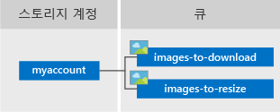

# <a name="quickstart-azure-queue-storage-client-library-v12-for-python"></a>빠른 시작: Python용 Azure Queue storage 클라이언트 라이브러리 v12

Python용 Azure Queue storage 클라이언트 라이브러리 버전 12를 시작합니다. Azure Queue storage는 나중에 검색하고 처리할 수 있도록 대량의 메시지를 저장하는 서비스입니다. 다음 단계에 따라 패키지를 설치하고 기본 작업에 대한 예제 코드를 사용해보십시오.

Python용 Azure Queue storage 클라이언트 라이브러리 v12를 사용하여 다음을 수행할 수 있습니다.

* 큐 만들기
* 큐에 메시지 추가
* 큐의 메시지 피킹(Peeking)
* 큐의 메시지 업데이트
* 큐에서 메시지 받기
* 큐에서 메시지 삭제
* 큐 삭제

추가 리소스:

* [API 참조 설명서](https://docs.microsoft.com/python/api/azure-storage-queue/index)
* [라이브러리 소스 코드](https://github.com/Azure/azure-sdk-for-python/tree/master/sdk/storage/azure-storage-queue)
* [패키지(Python 패키지 인덱스)](https://pypi.org/project/azure-storage-queue/)
* [샘플](https://docs.microsoft.com/azure/storage/common/storage-samples-python?toc=%2fazure%2fstorage%2fqueues%2ftoc.json#queue-samples)

## <a name="prerequisites"></a>필수 구성 요소

* Azure 구독 - [체험 구독 만들기](https://azure.microsoft.com/free/)
* Azure Storage 계정 - [스토리지 계정 만들기](https://docs.microsoft.com/azure/storage/common/storage-quickstart-create-account)
* 운영 체제에 맞는 [Python](https://www.python.org/downloads/) - 2.7, 3.5 이상

## <a name="setting-up"></a>설치

이 섹션에서는 Python용 Azure Queue storage 클라이언트 라이브러리 v12를 사용하는 프로젝트 준비 과정을 안내합니다.

### <a name="create-the-project"></a>프로젝트 만들기

*queues-quickstart-v12*라는 Python 애플리케이션을 만듭니다.

1. 콘솔 창(예: cmd, PowerShell 또는 Bash)에서 프로젝트에 대한 새 디렉터리를 만듭니다.

    ```console
    mkdir queues-quickstart-v12
    ```

1. 새로 만든 *queues-quickstart-v12* 디렉터리로 전환합니다.

    ```console
    cd queues-quickstart-v12
    ```

### <a name="install-the-package"></a>패키지 설치

`pip install` 명령을 사용하여 Python용 Azure Blob Storage 클라이언트 라이브러리 패키지를 설치합니다.

```console
pip install azure-storage-queue
```

이 명령은 Python용 Azure Queue storage 클라이언트 라이브러리 패키지와 이 패키지가 종속된 모든 라이브러리를 설치합니다. 이 경우에는 Python용 Azure 핵심 라이브러리만 설치합니다.

### <a name="set-up-the-app-framework"></a>앱 프레임워크 설정

1. 코드 편집기에서 새 텍스트 파일 열기
1. `import` 문 추가
1. 매우 기본적인 예외 처리를 포함하여 프로그램의 구조 만들기

    코드는 다음과 같습니다.

    ```python
    import os, uuid
    from azure.storage.queue import QueueServiceClient, QueueClient, QueueMessage

    try:
        print("Azure Queue storage v12 - Python quickstart sample")
        # Quick start code goes here
    except Exception as ex:
        print('Exception:')
        print(ex)

    ```

1. 새 파일을 *queues-quickstart-v12* 디렉터리에 *queues-quickstart-v12.py*로 저장합니다.

[!INCLUDE [storage-quickstart-credentials-include](../../../includes/storage-quickstart-credentials-include.md)]

## <a name="object-model"></a>개체 모델

Azure Queue storage는 대량의 메시지를 저장하기 위한 서비스입니다. 큐 메시지의 크기는 최대 64KB입니다. 큐는 스토리지 계정의 용량 제한에 도달할 때까지 수백만 개의 메시지를 포함할 수 있습니다. 큐는 비동기적으로 처리할 작업의 백로그를 만드는 데 일반적으로 사용됩니다. Queue storage는 다음 세 가지 유형의 리소스를 제공합니다.

* 스토리지 계정
* 스토리지 계정의 큐
* 큐 내의 메시지

다음 다이어그램에서는 이러한 리소스 간의 관계를 보여줍니다.



다음 Python 클래스를 사용하여 이러한 리소스와 상호 작용합니다.

* [QueueServiceClient](https://docs.microsoft.com/python/api/azure-storage-queue/azure.storage.queue.queueserviceclient): `QueueServiceClient`를 사용하면 스토리지 계정의 모든 큐를 관리할 수 있습니다.
* [QueueClient](https://docs.microsoft.com/python/api/azure-storage-queue/azure.storage.queue.queueclient): `QueueClient` 클래스를 사용하면 개별 큐와 해당 메시지를 관리하고 조작할 수 있습니다.
* [QueueMessage](https://docs.microsoft.com/python/api/azure-storage-queue/azure.storage.queue.queuemessage): `QueueMessage` 클래스는 큐에서 [receive_messages](https://docs.microsoft.com/python/api/azure-storage-queue/azure.storage.queue.queueclient#receive-messages---kwargs-)를 호출할 때 반환되는 개별 개체를 나타냅니다.

## <a name="code-examples"></a>코드 예제

다음 예제 코드 조각은 Python용 Azure Queue storage 클라이언트 라이브러리를 사용하여 다음 작업을 수행하는 방법을 보여줍니다.

* [연결 문자열 가져오기](#get-the-connection-string)
* [큐 만들기](#create-a-queue)
* [큐에 메시지 추가](#add-messages-to-a-queue)
* [큐의 메시지 피킹(Peeking)](#peek-at-messages-in-a-queue)
* [큐의 메시지 업데이트](#update-a-message-in-a-queue)
* [큐에서 메시지 받기](#receive-messages-from-a-queue)
* [큐에서 메시지 삭제](#delete-messages-from-a-queue)
* [큐 삭제](#delete-a-queue)

### <a name="get-the-connection-string"></a>연결 문자열 가져오기

아래 코드는 스토리지 계정에 대한 연결 문자열을 검색합니다. 연결 문자열은 [스토리지 연결 문자열 구성](#configure-your-storage-connection-string) 섹션에서 생성된 환경 변수에 저장됩니다.

다음 코드를 `try` 블록 내에 추가합니다.

```python
    # Retrieve the connection string for use with the application. The storage
    # connection string is stored in an environment variable on the machine
    # running the application called AZURE_STORAGE_CONNECTION_STRING. If the
    # environment variable is created after the application is launched in a
    # console or with Visual Studio, the shell or application needs to be
    # closed and reloaded to take the environment variable into account.
    connect_str = os.getenv('AZURE_STORAGE_CONNECTION_STRING')
```

### <a name="create-a-queue"></a>큐 만들기

새 큐의 이름을 결정합니다. 아래 코드는 큐 이름의 고유성을 보장하기 위해 이름에 UUID 값을 추가합니다.

> [!IMPORTANT]
> 큐 이름은 소문자, 숫자 및 하이픈만 포함할 수 있으며 문자나 숫자로 시작해야 합니다. 각 하이픈의 앞과 뒤에는 하이픈이 아닌 문자가 있어야 합니다. 이름의 길이는 3~63자 사이여야 합니다. 큐 이름 지정에 대한 자세한 내용은 [큐 및 메타데이터 이름 지정](https://docs.microsoft.com/rest/api/storageservices/naming-queues-and-metadata)을 참조하세요.

[QueueClient](https://docs.microsoft.com/python/api/azure-storage-queue/azure.storage.queue.queueclient) 클래스 인스턴스를 만듭니다. 그런 다음, [create_queue](https://docs.microsoft.com/python/api/azure-storage-queue/azure.storage.queue.queueclient#create-queue---kwargs-) 메서드를 호출하여 스토리지 계정에 큐를 만듭니다.

이 코드를 `try` 블록의 끝에 추가합니다.

```python
    # Create a unique name for the queue
    queue_name = "quickstartqueues-" + str(uuid.uuid4())

    print("Creating queue: " + queue_name)

    # Instantiate a QueueClient which will be
    # used to create and manipulate the queue
    queue_client = QueueClient.from_connection_string(connect_str, queue_name)

    # Create the queue
    queue_client.create_queue()
```

### <a name="add-messages-to-a-queue"></a>큐에 메시지 추가

다음 코드 조각은 [send_message](https://docs.microsoft.com/python/api/azure-storage-queue/azure.storage.queue.queueclient#send-message-content----kwargs-) 메서드를 호출하여 큐에 메시지를 추가합니다. 또한, 세 번째 `send_message` 호출에서 반환된 [QueueMessage](https://docs.microsoft.com/python/api/azure-storage-queue/azure.storage.queue.queuemessage)를 저장합니다. `saved_message`는 나중에 프로그램에서 메시지 콘텐츠를 업데이트하는 데 사용됩니다.

이 코드를 `try` 블록의 끝에 추가합니다.

```python
    print("\nAdding messages to the queue...")

    # Send several messages to the queue
    queue_client.send_message(u"First message")
    queue_client.send_message(u"Second message")
    saved_message = queue_client.send_message(u"Third message")
```

### <a name="peek-at-messages-in-a-queue"></a>큐의 메시지 피킹(Peeking)

[peek_messages](https://docs.microsoft.com/python/api/azure-storage-queue/azure.storage.queue.queueclient#peek-messages-max-messages-none----kwargs-) 메서드를 호출하여 큐의 메시지를 피킹합니다. `peek_messages` 메서드는 큐 앞에서 하나 이상의 메시지를 검색하지만 메시지의 표시 유형을 변경하지는 않습니다.

이 코드를 `try` 블록의 끝에 추가합니다.

```python
    print("\nPeek at the messages in the queue...")

    # Peek at messages in the queue
    peeked_messages = queue_client.peek_messages(max_messages=5)

    for peeked_message in peeked_messages:
        # Display the message
        print("Message: " + peeked_message.content)
```

### <a name="update-a-message-in-a-queue"></a>큐의 메시지 업데이트

[update_message](https://docs.microsoft.com/python/api/azure-storage-queue/azure.storage.queue.queueclient#update-message-message--pop-receipt-none--content-none----kwargs-) 메서드를 호출하여 메시지 콘텐츠를 업데이트합니다. `update_message` 메서드는 메시지의 표시 여부 시간 제한 및 콘텐츠를 변경할 수 있습니다. 메시지 콘텐츠는 크기가 최대 64KB인 UTF-8 인코딩 문자열이어야 합니다. 신규 콘텐츠와 함께 이전에 코드에 저장된 메시지의 값을 전달합니다. `saved_message` 값은 업데이트할 메시지를 식별합니다.

```python
    print("\nUpdating the third message in the queue...")

    # Update a message using the message saved when calling send_message earlier
    queue_client.update_message(saved_message, pop_receipt=saved_message.pop_receipt, \
        content="Third message has been updated")
```

### <a name="receive-messages-from-a-queue"></a>큐에서 메시지 받기

[receive_messages](https://docs.microsoft.com/python/api/azure-storage-queue/azure.storage.queue.queueclient#receive-messages---kwargs-) 메서드를 호출하여 이전에 추가한 메시지를 다운로드합니다.

이 코드를 `try` 블록의 끝에 추가합니다.

```python
    print("\nReceiving messages from the queue...")

    # Get messages from the queue
    messages = queue_client.receive_messages(messages_per_page=5)
```

### <a name="delete-messages-from-a-queue"></a>큐에서 메시지 삭제

메시지를 받아서 처리한 후 큐에서 메시지를 삭제합니다. 이 경우 처리는 콘솔에 메시지를 표시하는 것뿐입니다.

앱은 메시지를 처리하고 삭제하기 전에 `input`을 호출하여 사용자 입력을 위해 일시 중지합니다. 리소스가 삭제되기 전에 [Azure Portal](https://portal.azure.com)에서 리소스가 제대로 생성되었는지 확인합니다. 명시적으로 삭제되지 않은 메시지는 다시 처리될 수 있도록 큐에 다시 표시됩니다.

이 코드를 `try` 블록의 끝에 추가합니다.

```python
    print("\nPress Enter key to 'process' messages and delete them from the queue...")
    input()

    for msg_batch in messages.by_page():
            for msg in msg_batch:
                # "Process" the message
                print(msg.content)
                # Let the service know we're finished with
                # the message and it can be safely deleted.
                queue_client.delete_message(msg)
```

### <a name="delete-a-queue"></a>큐 삭제

다음 코드는 [delete_queue](https://docs.microsoft.com/python/api/azure-storage-queue/azure.storage.queue.queueclient#delete-queue---kwargs-) 메서드를 사용하여 큐를 삭제하여 앱이 만든 리소스를 정리합니다.

이 코드를 `try` 블록의 끝에 추가하고 파일을 저장합니다.

```python
    print("\nPress Enter key to delete the queue...")
    input()

    # Clean up
    print("Deleting queue...")
    queue_client.delete_queue()

    print("Done")
```

## <a name="run-the-code"></a>코드 실행

이 앱은 메시지 세 개를 만들어서 Azure 큐에 추가합니다. 이 코드는 큐의 메시지를 나열한 다음, 검색하고 삭제한 후 최종적으로 큐를 삭제합니다.

콘솔 창에서 *queues-quickstart-v12.py* 파일이 포함된 디렉터리로 이동한 후 다음 `python` 명령을 실행하여 앱을 실행합니다.

```console
python queues-quickstart-v12.py
```

앱의 출력은 다음 예제 출력과 유사합니다.

```output
Azure Queue storage v12 - Python quickstart sample
Creating queue: quickstartqueues-cac365be-7ce6-4065-bd65-3756ea052cb8

Adding messages to the queue...

Peek at the messages in the queue...
Message: First message
Message: Second message
Message: Third message

Updating the third message in the queue...

Receiving messages from the queue...

Press Enter key to 'process' messages and delete them from the queue...

First message
Second message
Third message has been updated

Press Enter key to delete the queue...

Deleting queue...
Done
```

메시지를 받기 전에 앱이 일시 중지되면 [Azure Portal](https://portal.azure.com)에서 스토리지 계정을 확인합니다. 메시지가 큐에 있는지 확인합니다.

**Enter** 키를 눌러서 메시지를 받고 삭제합니다. 메시지가 표시되면 **Enter** 키를 다시 눌러서 큐를 삭제하고 데모를 마칩니다.

## <a name="next-steps"></a>다음 단계

이 빠른 시작에서는 Python 코드를 사용하여 큐를 만들고 큐에 메시지를 추가하는 방법을 알아보았습니다. 그런 다음, 메시지를 피킹하고 검색하고 삭제하는 방법을 알아보았습니다. 마지막으로 메시지 큐를 삭제하는 방법을 알아보았습니다.

자습서, 샘플, 빠른 시작 및 기타 설명서는 다음을 참조하세요.

> [!div class="nextstepaction"]
> [Python 개발자용 Azure](https://docs.microsoft.com/azure/python/)

* 자세한 내용은 [Python용 Azure Storage 라이브러리](https://github.com/Azure/azure-sdk-for-python/tree/master/sdk/storage)를 참조하세요.
* 더 많은 Azure Queue storage 샘플 앱을 보려면 [Azure Queue storage v12 Python 클라이언트 라이브러리 샘플](https://github.com/Azure/azure-sdk-for-python/tree/master/sdk/storage/azure-storage-queue/samples)을 계속 진행하세요.
