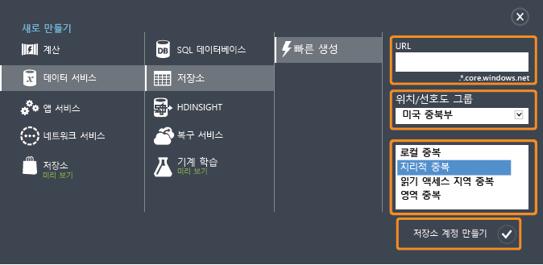
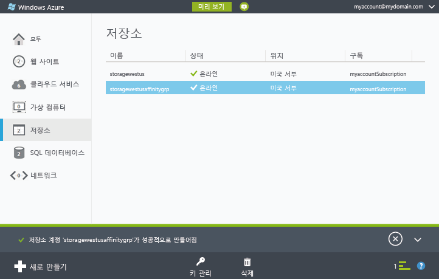
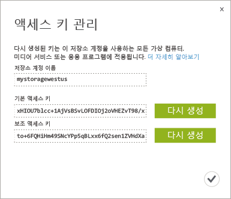

<properties
	pageTitle="Azure 클래식 포털에서 저장소 계정을 만들거나, 관리하거나, 삭제하는 방법 | Microsoft Azure"
	description="Azure 포털에서 새 저장소 계정을 만들고 계정 액세스 키를 관리하거나 저장소 계정을 삭제합니다. 표준 및 프리미엄 저장소 계정에 대해 알아봅니다."
	services="storage"
	documentationCenter=""
	authors="robinsh"
	manager="carmonm"
	editor="tysonn"/>

<tags
	ms.service="storage"
	ms.workload="storage"
	ms.tgt_pltfrm="na"
	ms.devlang="na"
	ms.topic="get-started-article"
	ms.date="07/26/2016"
	ms.author="micurd;robinsh"/>

# Azure 저장소 계정 정보

[AZURE.INCLUDE [storage-selector-portal-create-storage-account](../../includes/storage-selector-portal-create-storage-account.md)]
 
[AZURE.INCLUDE [storage-try-azure-tools](../../includes/storage-try-azure-tools.md)]

## 개요

Azure 저장소 계정은 Azure 저장소의 Azure Blob, 큐, 테이블 및 파일 서비스에 대한 액세스 권한을 제공합니다. 저장소 계정은 Azure 저장소 데이터 개체에 고유한 네임스페이스를 제공합니다. 기본적으로 계정에 대한 데이터는 사용자 계정 소유자에만 사용할 수 있습니다.

저장소 계정에는 다음과 같은 두 종류가 있습니다.

- 표준 저장소 계정에는 Blob, 테이블, 큐 및 파일 저장소가 포함됩니다.
- 프리미엄 저장소 계정은 현재 Azure 가상 컴퓨터 디스크만 지원합니다. 프리미엄 저장소의 자세한 개요는 [프리미엄 저장소: Azure 가상 컴퓨터 작업을 위한 고성능 저장소](storage-premium-storage.md)를 참조하세요.

## 저장소 계정 사용 비용

Azure 저장소 사용 비용은 저장소 계정에 따라 청구됩니다. 저장소 비용은 저장소 용량, 복제 체계, 저장소 트랜잭션 및 데이터 송신의 네 가지 요소를 기반으로 합니다.

- 저장소 용량은 데이터를 저장하는 데 사용하는 저장소 계정 서비스 단위가 어느 정도인지를 나타냅니다. 단순히 데이터를 저장하는 비용은 저장하는 데이터의 양과 복제 방법에 따라 결정됩니다.
- 복제에 따라 한 번에 유지 관리되는 데이터의 복사본 수 및 위치가 결정됩니다.
- 트랜잭션은 Azure 저장소에 대한 모든 읽기 및 쓰기 작업을 나타냅니다.
- 데이터 송신은 Azure 지역 외부에서 전송되는 데이터를 나타냅니다. 저장소 계정의 데이터에 동일한 지역에서 실행되지 않는 응용 프로그램이 액세스하는 경우 해당 응용 프로그램이 클라우드 서비스인지 다른 유형의 응용 프로그램인지 여부에 상관없이 데이터 송신 요금이 부과됩니다. Azure 서비스의 경우 데이터 송신 요금을 줄이거나 제거하기 위해 동일한 데이터 센터의 데이터와 서비스를 그룹화하는 조치를 취할 수 있습니다.

[Azure 저장소 가격 책정](https://azure.microsoft.com/pricing/details/storage) 페이지는 저장소 용량, 복제 및 트랜잭션에 대한 자세한 가격 책정 정보를 제공합니다. [데이터 전송 가격 책정 세부 정보](https://azure.microsoft.com/pricing/details/data-transfers/) 페이지는 데이터 송신에 대한 자세한 가격 책정 정보를 제공합니다.

저장소 계정 용량 및 성능 목표에 대한 자세한 내용은 [Azure 저장소 확장성 및 성능 목표](storage-scalability-targets.md)를 참조하세요.

> [AZURE.NOTE] Azure 가상 컴퓨터를 만드는 경우 배포 위치에 저장소 계정이 아직 없으면 해당 위치에서 자동으로 저장소 계정이 만들어집니다. 따라서 가상 컴퓨터 디스크에 대한 저장소 계정을 만들기 위해 아래 단계를 수행할 필요가 없습니다. 저장소 계정 이름은 가상 컴퓨터 이름을 기반으로 합니다. 자세한 내용은 [Azure 가상 컴퓨터 설명서](https://azure.microsoft.com/documentation/services/virtual-machines/)를 참조하세요.

## 저장소 계정 만들기

1. [Azure 클래식 포털](https://manage.windowsazure.com)에 로그인합니다.

2. 페이지 아래쪽의 작업 표시줄에서 **새로 만들기**를 클릭합니다. **데이터 서비스** | **저장소**를 선택한 다음 **빠른 생성**을 클릭합니다.

	

3. **URL**에 저장소 계정의 이름을 입력합니다.

	> [AZURE.NOTE] 저장소 계정 이름은 3자에서 24자 사이여야 하고 숫자 및 소문자만 포함할 수 있습니다.
	>  
	> 저장소 계정 이름은 Azure 내에서 고유해야 합니다. 선택한 저장소 계정 이름이 이미 사용된 경우 Azure 클래식 포털에 표시됩니다.

	저장소 계정 이름이 Azure 저장소에서 개체를 처리하는 데 사용되는 방법에 대한 자세한 내용은 아래 [저장소 계정 끝점](#storage-account-endpoints)을 참조하세요.

4. **위치/선호도 그룹**에서 사용자 또는 사용자의 고객에게 가까운 저장소 계정의 위치를 선택합니다. Azure 가상 컴퓨터 또는 클라우드 서비스와 같은 다른 Azure 서비스에서 저장소 계정의 데이터에 액세스할 경우 목록에서 선호도 그룹을 선택하여 동일한 데이터 센터의 저장소 계정을 사용 중인 다른 Azure 서비스와 그룹화하면 성능을 향상시키고 비용을 절감할 수 있습니다.

	저장소 계정을 만들 때 선호도 그룹을 선택해야 합니다. 기존 계정을 선호도 그룹으로 이동할 수 없습니다. 선호도 그룹에 대한 자세한 내용은 아래의 [선호도 그룹과 서비스 공동 배치](#service-co-location-with-an-affinity-group)를 참조하세요.

	>[AZURE.IMPORTANT] 구독할 수 있는 위치를 확인하려면 [모든 리소스 공급자 나열](https://msdn.microsoft.com/library/azure/dn790524.aspx) 작업을 호출할 수 있습니다. PowerShell의 공급자를 나열하려면 [Get-AzureLocation](https://msdn.microsoft.com/library/azure/dn757693.aspx)을 호출합니다. .NET에서는 ProviderOperationsExtensions 클래스의 [List](https://msdn.microsoft.com/library/azure/microsoft.azure.management.resources.provideroperationsextensions.list.aspx) 메서드를 사용합니다.
	>
	>또한 어떤 지역에서 어떤 서비스가 가능한지에 대한 자세한 정보는 [Azure 지역](https://azure.microsoft.com/regions/#services)을 참조하세요.

5. Azure 구독이 두 개 이상인 경우 **구독** 필드가 표시됩니다. **구독**에서 저장소 계정을 사용할 Azure 구독을 입력합니다.

6. **복제**에서 저장소 계정에 원하는 복제 수준을 선택합니다. 권장되는 복제 옵션은 지역 중복 복제이며, 데이터에 최대 내구성을 제공합니다. Azure 저장소 복제 옵션에 대한 자세한 내용은 아래의 [Azure 저장소 복제](storage-redundancy.md)를 참조하세요.

6. **Create Storage Account**를 클릭합니다.

	저장소 계정을 만드는 데 몇 분 정도 걸릴 수 있습니다. 상태를 확인하려면 Azure 클래식 포털 화면의 아래쪽에서 알림을 모니터링할 수 있습니다. 저장소 계정이 만들어지면 새 저장소 계정이 **온라인** 상태가 되고 새 저장소 계정을 사용할 준비가 됩니다.

### 저장소 계정 끝점

Azure 저장소에 저장되는 모든 개체에는 고유한 URL 주소가 있습니다. 저장소 계정 이름은 해당 주소의 하위 도메인을 구성합니다. 하위 도메인과 도메인 이름의 조합은 각 서비스와 관련되며 저장소 계정의 *끝점* 을 구성합니다.

예를 들어 저장소 계정의 이름이 *mystorageaccount* 일 경우 저장소 계정의 기본 끝점은 다음과 같습니다.

- Blob 서비스: http://*mystorageaccount*.blob.core.windows.net

- 테이블 서비스: http://*mystorageaccount*.table.core.windows.net

- 큐 서비스: http://*mystorageaccount*.queue.core.windows.net

- 파일 서비스: http://*mystorageaccount*.file.core.windows.net

계정을 만든 다음에는 [Azure 클래식 포털](https://manage.windowsazure.com)의 저장소 대시보드에서 저장소 계정의 끝점을 확인할 수 있습니다.

저장소 계정의 개체에 액세스하기 위한 URL은 저장소 계정의 개체 위치를 끝점에 추가하여 작성됩니다. 예를 들어 Blob 주소의 형식은 다음과 같습니다. http://*mystorageaccount*.blob.core.windows.net/ *mycontainer* / *myblob*

사용자 지정 도메인 이름을 구성하여 저장소 계정에서 사용할 수도 있습니다. 자세한 내용은 [Blob 저장소 끝점에 대한 사용자 지정 도메인 이름 구성](storage-custom-domain-name.md)을 참조하세요.

### 선호도 그룹과 서비스 공동 배치

*선호도 그룹*은 Azure 저장소 계정을 사용하여 Azure 서비스와 VM을 지리적으로 그룹화한 것을 말합니다. 선호도 그룹은 동일한 데이터 센터 또는 대상 사용자 그룹 인근의 컴퓨터 작업을 찾아 서비스 성능을 향상시킬 수 있습니다. 또한 같은 선호도 그룹에 속한 다른 서비스에서 저장소 계정의 데이터에 액세스할 경우 송신 요금이 청구되지 않습니다.

> [AZURE.NOTE]  선호도 그룹을 만들려면 [Azure 클래식 포털](https://manage.windowsazure.com)의 <b>설정</b> 영역을 열고 <b>선호도 그룹</b>을 클릭한 다음 <b>선호도 그룹 추가</b> 또는 <b>추가</b> 단추를 클릭합니다. Azure 서비스 관리 API를 사용하여 선호도 그룹을 만들고 관리할 수도 있습니다. 자세한 내용은 <a href="http://msdn.microsoft.com/library/azure/ee460798.aspx">선호도 그룹 작업</a>을 참조하세요.

## 저장소 액세스 키 보기, 복사 및 다시 생성을 참조하세요.

저장소 계정을 만들면 Azure에서 두 개의 512비트 저장소 액세스 키를 생성합니다. 이 키는 저장소 계정에 액세스하는 경우 인증에 사용됩니다. Azure에서는 두 개의 저장소 액세스 키를 제공하므로 저장소 서비스나 해당 서비스에 대한 액세스 중단 없이 키를 다시 생성할 수 있습니다.

> [AZURE.NOTE] 저장소 액세스 키를 다른 사람과 공유하지 않는 것이 좋습니다. 액세스 키를 제공하지 않고 저장소 리소스에 대한 액세스를 허용하려는 경우에는 *공유 액세스 서명*을 사용할 수 있습니다. 공유 액세스 서명에서는 정의된 간격으로 지정된 권한을 사용하여 계정의 리소스에 액세스할 수 있습니다. 자세한 내용은 [SAS(공유 액세스 서명) 사용](storage-dotnet-shared-access-signature-part-1.md)을 참조하세요.

[Azure 클래식 포털](https://manage.windowsazure.com)에서 대시보드 또는 **저장소** 페이지의 **키 관리**를 사용하여 Blob, 테이블 및 큐 서비스에 액세스하는 데 사용되는 저장소 액세스 키를 보고, 복사하고, 다시 생성합니다.

### 저장소 액세스 키 복사  

**키 관리**를 사용하여 연결 문자열에 사용할 저장소 액세스 키를 복사할 수 있습니다. 연결 문자열에는 인증에 사용할 저장소 계정 이름과 키가 있어야 합니다. Azure 저장소 서비스에 액세스하기 위한 연결 문자열 구성에 대한 자세한 내용은 [Azure 저장소 연결 문자열 구성](storage-configure-connection-string.md)을 참조하세요.

1. [Azure 클래식 포털](https://manage.windowsazure.com)에서 **저장소**를 클릭한 후 대시보드를 열 저장소 계정 이름을 클릭합니다.

2. **키 관리**를 클릭합니다.

 	**액세스 키 관리**가 열립니다.

	

3. 저장소 액세스 키를 복사하려면 키 텍스트를 선택합니다. 그런 다음 마우스 오른쪽 단추를 클릭하고 **복사**를 클릭합니다.

### 저장소 액세스 키 다시 생성
저장소 연결을 안전하게 유지하는 데 도움이 되도록 정기적으로 저장소 계정의 액세스 키를 변경하는 것이 좋습니다. 두 개의 액세스 키가 할당되므로 하나의 액세스 키를 다시 생성하는 동안 다른 액세스 키를 사용하여 저장소 계정에 대한 연결을 유지할 수 있습니다.

> [AZURE.WARNING] 액세스 키를 다시 생성하면 저장소 계정에 종속된 모든 자체 응용 프로그램과 Azure의 서비스에 영향을 미칩니다. 액세스 키를 사용하여 저장소 계정에 액세스하는 모든 클라이언트에서 새 키를 사용하도록 업데이트해야 합니다.

**미디어 서비스** - 저장소 계정에 종속된 미디어 서비스가 있는 경우 키를 다시 생성한 후 미디어 서비스와 액세스 키를 다시 동기화해야 합니다.

**응용 프로그램** - 저장소 계정을 사용하는 웹 응용 프로그램이나 클라우드 서비스가 있는 경우 키를 롤링하지 않고 키를 다시 생성하면 연결이 끊어집니다.

**저장소 탐색기** - [저장소 탐색기 응용 프로그램](storage-explorers.md)을 사용할 경우 해당 응용 프로그램에서 사용하는 저장소 키를 업데이트해야 할 수 있습니다.

저장소 액세스 키를 회전하기 위한 프로세스는 다음과 같습니다.

1. 저장소 계정의 보조 액세스 키를 참조하도록 응용 프로그램 코드의 연결 문자열을 업데이트합니다.

2. 저장소 계정의 기본 액세스 키를 다시 생성합니다. [Azure 클래식 포털](https://manage.windowsazure.com)의 대시보드 또는 **구성** 페이지에서 **키 관리**를 클릭합니다. 기본 선택키 아래의 **다시 생성**을 클릭하고 **예**를 클릭하여 새 키 생성을 확인합니다.

3. 새 기본 액세스 키를 참조하도록 코드의 연결 문자열을 업데이트합니다.

4. 보조 액세스 키를 다시 생성합니다.

## 저장소 계정 삭제

더 이상 사용하지 않는 저장소 계정을 제거하려면 대시보드 또는 **구성** 페이지에서 **삭제**를 사용합니다. **삭제**는 계정의 모든 Blob, 테이블, 큐를 포함한 전체 저장소 계정을 삭제합니다.

> [AZURE.WARNING] 삭제된 저장소 계정을 복원할 수 없거나 삭제 전에 포함된 콘텐츠를 검색할 수 없습니다. 계정을 삭제하기 전에 저장할 내용을 백업했는지 확인합니다. 또한 해당 계정의 리소스에 대해 true를 유지합니다. Blob, 테이블, 큐 또는 파일을 삭제하면 영구적으로 삭제됩니다.
>
> 저장소 계정에 Azure 가상 컴퓨터의 VHD 파일이 포함되어 있는 경우 우선 해당 VHD 파일을 사용하는 이미지 및 디스크를 모두 삭제해야 저장소 계정을 삭제할 수 있습니다. 먼저 가상 컴퓨터가 실행 중인 경우 중지한 다음 삭제합니다. 디스크를 삭제하려면 **디스크** 탭으로 이동하여 저장소 계정에 포함된 모든 디스크를 삭제합니다. 이미지를 삭제하려면 **이미지** 탭으로 이동하여 계정에 저장된 모든 이미지를 삭제합니다.

1. [Azure 클래식 포털](https://manage.windowsazure.com)에서 **저장소**를 클릭합니다.

2. 저장소 계정 항목에서 이름을 제외한 임의의 항목을 클릭하고 **삭제**를 클릭합니다.

	 -또는-

	대시보드를 열 저장소 계정 이름을 클릭하고 **삭제**를 클릭합니다.

3. **예**를 클릭하여 저장소 계정 삭제를 확인합니다.

## 다음 단계

- Azure 저장소에 대한 자세한 내용은 [Azure 저장소 설명서](https://azure.microsoft.com/documentation/services/storage/)를 참조하세요.
- [Azure 저장소 팀 블로그](http://blogs.msdn.com/b/windowsazurestorage/)(영문)를 방문하세요.
- [AzCopy 명령줄 유틸리티로 데이터 전송](storage-use-azcopy.md)

<!---HONumber=AcomDC_0928_2016-->