# <a name="get-started-with-azure-file-storage-on-windows"></a>Windows에서 Azure 파일 저장소 시작
[!INCLUDE [storage-selector-file-include](../../includes/storage-selector-file-include.md)]

[!INCLUDE [storage-check-out-samples-dotnet](../../includes/storage-check-out-samples-dotnet.md)]

[!INCLUDE [storage-file-overview-include](../../includes/storage-file-overview-include.md)]

Linux에서 파일 저장소 사용에 대한 자세한 내용은 [Linux에서 Azure 파일 저장소 사용 방법](storage-how-to-use-files-linux.md)을 참조하세요.

파일 저장소의 확장성 및 성능 목표에 대한 자세한 내용은 [Azure 저장소 확장성 및 성능 목표](storage-scalability-targets.md#scalability-targets-for-blobs-queues-tables-and-files)를 참조하세요.

[!INCLUDE [storage-dotnet-client-library-version-include](../../includes/storage-dotnet-client-library-version-include.md)]

[!INCLUDE [storage-file-concepts-include](../../includes/storage-file-concepts-include.md)]

## <a name="video-using-azure-file-storage-with-windows"></a>비디오: Windows에서 Azure 파일 저장소 사용
Windows에서 Azure 파일 공유를 만들고 사용하는 방법을 보여주는 비디오는 다음과 같습니다.

> [!VIDEO https://channel9.msdn.com/Blogs/Azure/Azure-File-Storage-with-Windows/player]
> 
> 

## <a name="about-this-tutorial"></a>이 자습서 정보
이 시작 자습서에서는 Microsoft Azure 파일 저장소 사용에 대한 기본 사항을 설명합니다. 이 자습서에서는 다음 작업을 수행합니다.

* Azure Portal 또는 PowerShell을 사용하여 새 Azure File 공유를 만들고, 디렉터리를 추가하고, 로컬 파일을 공유에 업로드하고, 디렉터리에 있는 파일을 나열합니다.
* SMB 공유와 마찬가지로 파일 공유를 마운트합니다.
* .NET용 Azure 저장소 클라이언트 라이브러리를 사용하여 온-프레미스 응용 프로그램에서 파일 공유에 액세스할 수 있습니다. 콘솔 응용 프로그램을 만들고 파일 공유를 사용하여 다음과 같은 작업을 수행합니다.
  * 콘솔 창에 공유의 파일 내용 쓰기
  * 파일 공유에 대한 할당량(최대 크기) 설정
  * 공유에 정의된 공유 액세스 정책을 사용하는 파일에 대해 공유 액세스 서명 만들기
  * 동일한 저장소 계정의 다른 파일로 파일 복사
  * 동일한 저장소 계정의 blob으로 파일 복사
* 문제 해결을 위해 Azure 저장소 메트릭 사용

파일 저장소는 이제 모든 저장소 계정에 대해 지원되므로 기존 저장소 계정을 사용하거나 새 저장소 계정을 만들 수 있습니다. 새 저장소 계정 만들기에 대한 자세한 내용은 [저장소 계정을 만드는 방법](storage-create-storage-account.md#create-a-storage-account) (영문)을 참조하세요.

## <a name="use-the-azure-portal-to-manage-a-file-share"></a>Azure Portal을 사용하여 파일 공유 관리
[Azure Portal](https://portal.azure.com)은 고객이 파일 공유를 관리하기 위한 사용자 인터페이스를 제공합니다. 포털에서 다음을 수행할 수 있습니다.

* 파일 공유 만들기
* 파일 공유에 대해 파일 업로드 및 다운로드
* 각 파일 공유의 실제 사용량 모니터링
* 공유 크기 할당량 조정
* `net use` 명령을 가져와서 Windows 클라이언트에서 파일 공유를 마운트하는 데 사용

### <a name="create-file-share"></a>파일 공유 만들기
1. Azure 포털에 로그인합니다.
2. 탐색 메뉴에서 **저장소 계정** 또는 **저장소 계정(클래식)**을 클릭합니다.
   
    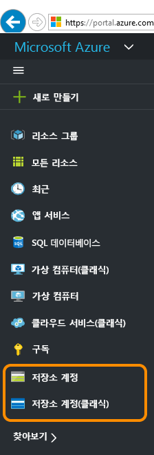
3. 저장소 계정 선택
   
    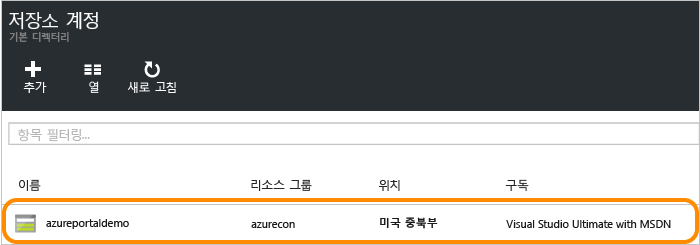
4. "파일" 서비스를 선택합니다.
   
    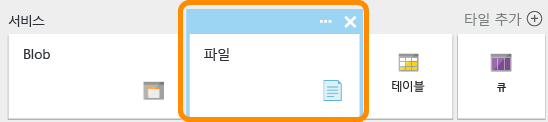
5. "파일 공유"를 클릭하고 링크를 따라 첫 번째 파일 공유를 만듭니다.
   
    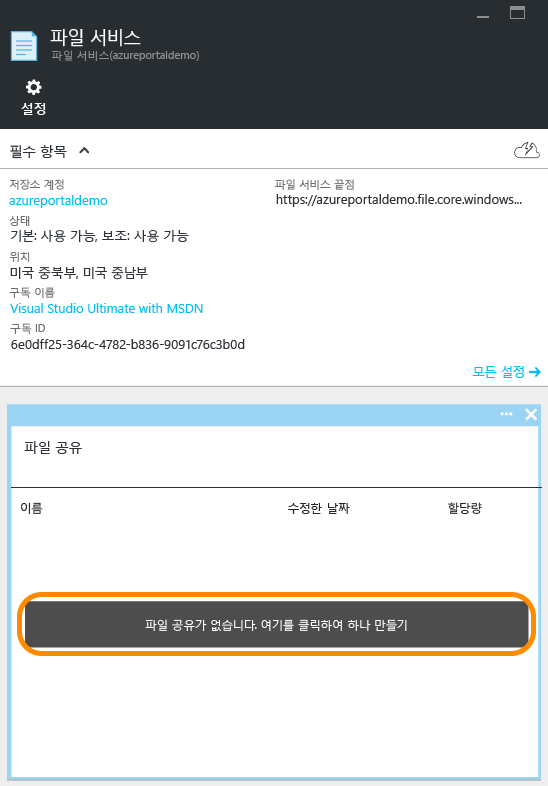
6. 파일 공유 이름 및 파일 공유 파일의 크기(최대 5120GB)를 입력하여 첫 번째 파일 공유를 만듭니다. 파일 공유가 만들어지면 SMB 2.1 또는 SMB 3.0을 지원하는 모든 파일 시스템에서 마운트할 수 있습니다.
   
    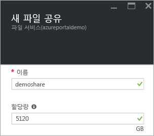

### <a name="upload-and-download-files"></a>파일 업로드 및 다운로드
1. 이미 만들어진 파일 공유를 하나 선택합니다.
   
    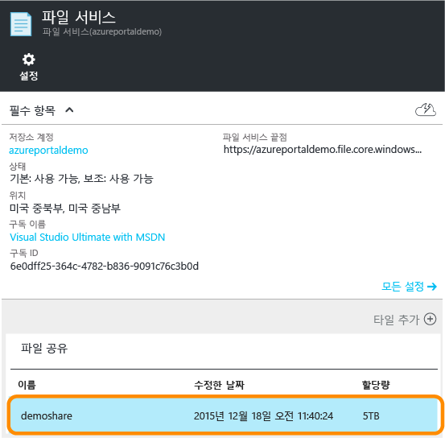
2. **업로드** 를 클릭하여 업로드하는 파일에 대한 사용자 인터페이스를 엽니다.
   
    
3. 파일 하나를 마우스 오른쪽 단추로 클릭하고 **다운로드** 를 선택하여 로컬에 다운로드합니다.
   
    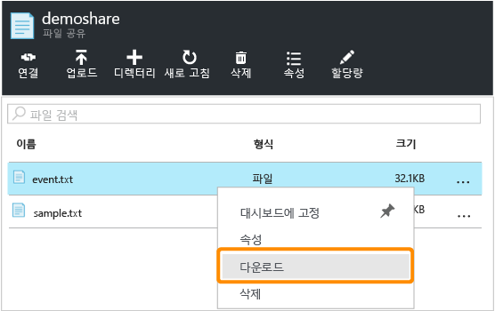

### <a name="manage-file-share"></a>파일 공유 관리
1. **할당량** 을 클릭하여 파일 공유의 크기를 변경합니다(최대 5120GB).
   
    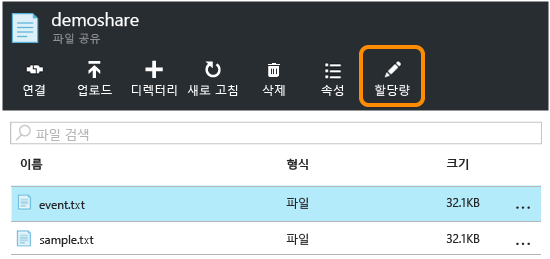
2. **연결** 을 클릭하여 Windows에서 파일 공유를 마운트하기 위한 명령줄을 가져옵니다.
   
    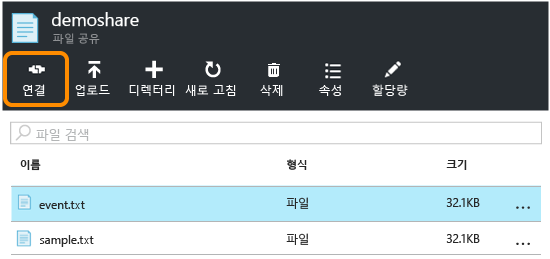
   
    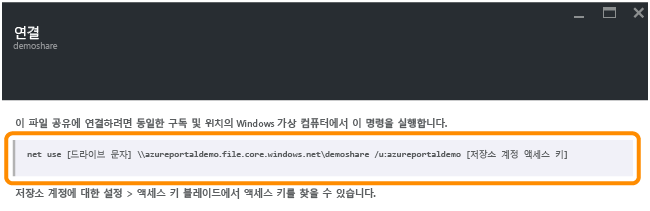
   
   > [!TIP]
   > 마운트를 위한 저장소 계정 선택키를 찾으려면 저장소 계정의 **설정**을 클릭한 다음 **선택키**를 클릭합니다.
   > 
   > 
   
    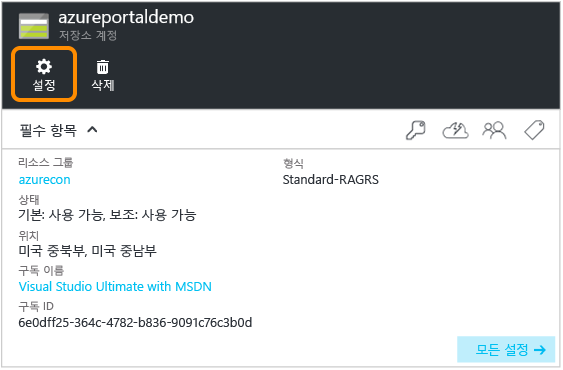
   
    

## <a name="use-powershell-to-manage-a-file-share"></a>PowerShell을 사용하여 파일 공유 관리하기
또는 Azure PowerShell을 사용하여 파일 공유를 만들고 관리할 수 있습니다.

### <a name="install-the-powershell-cmdlets-for-azure-storage"></a>Azure 저장소에 대한 PowerShell cmdlet 설치
PowerShell 사용을 준비하려면 Azure PowerShell cmdlet을 다운로드하여 설치합니다. 설치 지점 및 설치 지침에 대해서는 [Azure PowerShell 설치 및 구성 방법](/powershell/azureps-cmdlets-docs) 을 참조하세요.

> [!NOTE]
> 최신 Azure PowerShell 모듈을 다운로드하여 설치하거나 최신 모듈로 업그레이드하는 것이 좋습니다.
> 
> 

**시작**을 클릭하고 **Windows PowerShell**을 입력하여 Azure PowerShell 창을 엽니다. PowerShell 창에 Azure Powershell 모듈이 로드됩니다.

### <a name="create-a-context-for-your-storage-account-and-key"></a>저장소 계정 및 키에 대한 컨텍스트 만들기
이제 저장소 계정 컨텍스트를 만듭니다. 이 컨텍스트는 저장소 계정 이름 및 계정 키를 캡슐화합니다. [Azure Portal](https://portal.azure.com)에서 계정 키를 복사하는 방법에 대한 지침은 [저장소 액세스 키 보기 및 복사](storage-create-storage-account.md#view-and-copy-storage-access-keys)를 참조하세요.

다음 예제에서 `storage-account-name` 및 `storage-account-key`을(를) 본인의 저장소 계정 이름 및 키로 바꿉니다.

```powershell
# create a context for account and key
$ctx=New-AzureStorageContext storage-account-name storage-account-key
```

### <a name="create-a-new-file-share"></a>새 파일 공유 만들기
다음에는 `logs`(이)라는 새 공유를 만듭니다.

```powershell
# create a new share
$s = New-AzureStorageShare logs -Context $ctx
```

이제 파일 저장소에 파일 공유가 있습니다. 다음에는 디렉터리와 파일을 추가할 것입니다.

> [!IMPORTANT]
> 파일 공유의 이름은 모두 소문자여야 합니다. 파일 공유 및 파일 이름 지정에 대한 자세한 내용은 [공유, 디렉터리, 파일 및 메타데이터 이름 지정 및 참조](https://msdn.microsoft.com/library/azure/dn167011.aspx)를 참조하세요.
> 
> 

### <a name="create-a-directory-in-the-file-share"></a>파일 공유에 디렉터리 만들기
다음에는 공유에 디렉터리를 만듭니다. 다음 예제에서 디렉터리 이름은 `CustomLogs`입니다.

```powershell
# create a directory in the share
New-AzureStorageDirectory -Share $s -Path CustomLogs
```

### <a name="upload-a-local-file-to-the-directory"></a>디렉터리에 로컬 파일 업로드
이제 디렉터리에 로컬 파일을 업로드합니다. 다음 예제에서는 `C:\temp\Log1.txt`에서 파일을 업로드합니다. 로컬 컴퓨터의 유효한 파일을 가리키도록 파일 경로를 편집합니다.

```powershell
# upload a local file to the new directory
Set-AzureStorageFileContent -Share $s -Source C:\temp\Log1.txt -Path CustomLogs
```

### <a name="list-the-files-in-the-directory"></a>디렉터리의 파일 나열
디렉터리의 파일을 보려면 디렉터리의 파일을 모두 나열할 수 있습니다. 이 명령은 CustomLogs 디렉터리에서 파일 및 하위 디렉터리(있는 경우)를 반환합니다.

```powershell
# list files in the new directory
Get-AzureStorageFile -Share $s -Path CustomLogs | Get-AzureStorageFile
```

Get-AzureStorageFile은 디렉터리 개체가 전달되는 파일 및 디렉터리의 목록을 반환합니다. "Get-AzureStorageFile -Share $s"는 루트 디렉터리에 파일 및 디렉터리의 목록을 반환합니다. 하위 디렉터리에 있는 파일의 목록을 가져오려면 Get-AzureStorageFile에 하위 디렉터리를 전달해야 합니다. 즉, 파이프에 대한 명령의 첫 번째 부분은 CustomLogs 하위 디렉터리의 디렉터리 인스턴스를 반환하는 기능을 갖습니다. 그런 다음 Get-AzureStorageFile에 전달되고 이는 CustomLogs에 파일 및 디렉터리를 반환합니다.

### <a name="copy-files"></a>파일 복사
Azure PowerShell 버전 0.9.7부터 파일을 다른 파일로, 파일을 Blob으로 또는 Blob을 파일로 복사할 수 있습니다. 아래에는 PowerShell Cmdlet을 사용하여 이러한 복사 작업을 수행하는 방법이 나와 있습니다.

```powershell
# copy a file to the new directory
Start-AzureStorageFileCopy -SrcShareName srcshare -SrcFilePath srcdir/hello.txt -DestShareName destshare -DestFilePath destdir/hellocopy.txt -Context $srcCtx -DestContext $destCtx

# copy a blob to a file directory
Start-AzureStorageFileCopy -SrcContainerName srcctn -SrcBlobName hello2.txt -DestShareName hello -DestFilePath hellodir/hello2copy.txt -DestContext $ctx -Context $ctx
```

## <a name="mount-the-file-share"></a>파일 공유 마운트
SMB 3.0에 대한 지원을 통해 파일 저장소는 이제 SMB 3.0 클라이언트에서 암호화 및 영구 핸들을 지원합니다. 암호화 지원은 SMB 3.0 클라이언트가 다음을 포함한 어디에서나 파일 공유를 마운트할 수 있음을 의미합니다.

* 동일한 지역의 Azure 가상 컴퓨터(SMB 2.1에서도 지원됨)
* 다른 지역의 Azure 가상 컴퓨터(SMB 3.0에만 해당)
* 온-프레미스 클라이언트 응용 프로그램(SMB 3.0에만 해당)

클라이언트가 파일 저장소에 액세스하면 사용되는 SMB 버전은 운영 체제에서 지원하는 SMB 버전에 따라 달라집니다. 아래 표에 Windows 클라이언트에 대한 지원에 대한 요약을 제공합니다. [SMB 버전](http://blogs.technet.com/b/josebda/archive/2013/10/02/windows-server-2012-r2-which-version-of-the-smb-protocol-smb-1-0-smb-2-0-smb-2-1-smb-3-0-or-smb-3-02-you-are-using.aspx)에 대한 자세한 내용은 이 블로그를 참조합니다.

| Windows 클라이언트 | 지원되는 SMB 버전 |
|:--- |:--- |
| Windows 7 |SMB 2.1 |
| Windows Server 2008 R2 |SMB 2.1 |
| Windows 8 |SMB 3.0 |
| Windows Server 2012 |SMB 3.0 |
| Windows Server 2012 R2 |SMB 3.0 |
| Windows 10 |SMB 3.0 |

### <a name="mount-the-file-share-from-an-azure-virtual-machine-running-windows"></a>Windows를 실행하는 Azure 가상 컴퓨터에서 공유 마운트
Azure 파일 공유를 마운트하는 방법을 보여 주기 위해 Windows를 실행하는 Azure 가상 컴퓨터를 만든 후 원격으로 연결하여 공유를 마운트하겠습니다.

1. 먼저 [Azure Portal에서 Windows 가상 컴퓨터 만들기](../virtual-machines/virtual-machines-windows-hero-tutorial.md?toc=%2fazure%2fvirtual-machines%2fwindows%2ftoc.json)의 지침에 따라 새 Azure 가상 컴퓨터를 만듭니다.
2. 다음으로 [Azure Portal을 사용하여 Windows 가상 컴퓨터에 로그온](../virtual-machines/virtual-machines-windows-connect-logon.md?toc=%2fazure%2fvirtual-machines%2fwindows%2ftoc.json)의 지침에 따라 가상 컴퓨터에 원격으로 연결합니다.
3. 가상 컴퓨터에서 PowerShell 창을 엽니다.

### <a name="persist-your-storage-account-credentials-for-the-virtual-machine"></a>가상 컴퓨터의 저장소 계정 자격 증명 유지
파일 공유에 마운트하기 전에 먼저 가상 컴퓨터에서 저장소 계정 자격 증명을 유지합니다. 이 단계를 진행하면 Windows는 가상 컴퓨터가 다시 부팅될 때 파일 공유에 자동으로 다시 연결될 수 있습니다. 계정 자격 증명을 유지하려면 가상 컴퓨터의 PowerShell 창에서 `cmdkey` 명령을 실행합니다. `<storage-account-name>`를 저장소 계정의 이름으로 바꾸고 `<storage-account-key>`를 저장소 계정 키로 바꿉니다. 아래 예제와 같이 "AZURE" 도메인을 명시적으로 지정해야 합니다. 

```
cmdkey /add:<storage-account-name>.file.core.windows.net /user:AZURE\<storage-account-name> /pass:<storage-account-key>
```

이제 Windows는 가상 컴퓨터가 다시 부팅될 때 해당 파일 공유에 다시 연결됩니다. PowerShell 창에서 `net use` 명령을 실행하여 공유에 다시 연결되었는지 확인할 수 있습니다.

참고로 자격 증명은 `cmdkey`이 실행되는 컨텍스트에서만 유지됩니다. 서비스로 실행하는 응용 프로그램을 개발하는 경우 해당 컨텍스트에서도 자격 증명을 유지해야 합니다.

### <a name="mount-the-file-share-using-the-persisted-credentials"></a>유지된 자격 증명을 사용하여 파일 공유 마운트
가상 컴퓨터에 원격으로 연결되면 `net use` 명령의 다음 구문을 사용하여 파일 공유를 마운트할 수 있습니다. `<storage-account-name>`를 저장소 계정의 이름으로 바꾸고 `<share-name>`을 파일 저장소 공유의 이름으로 바꿉니다.

```
net use <drive-letter>: \\<storage-account-name>.file.core.windows.net\<share-name>

example :
net use z: \\samples.file.core.windows.net\logs
```

이전 단계의 저장소 계정 자격 증명을 저장했으므로 `net use` 명령에 이러한 자격 증명을 제공할 필요가 없습니다. 자격 증명을 저장하지 않은 경우 다음 예제와 같이 `net use` 명령에 전달되는 매개 변수로 포함합니다.

```
net use <drive-letter>: \\<storage-account-name>.file.core.windows.net\<share-name> /u:AZURE\<storage-account-name> <storage-account-key>

example :
net use z: \\samples.file.core.windows.net\logs /u:AZURE\samples <storage-account-key>
```

이제 다른 드라이브의 경우처럼 가상 컴퓨터에서 파일 저장소 공유를 사용할 수 있습니다. 명령 프롬프트에서 표준 파일 명령을 실행하거나 파일 탐색기에서 마운트된 공유 및 해당 내용을 확인할 수 있습니다. .NET Framework의 [System.IO 네임스페이스](http://msdn.microsoft.com/library/gg145019.aspx) 에서 제공하는 것과 같은 표준 Windows 파일 I/O API를 사용하여 파일 공유에 액세스하는 가상 컴퓨터 내에서 코드를 실행할 수도 있습니다.

역할에 원격으로 연결하여 Azure 클라우드 서비스에서 실행되는 역할에서 파일 공유를 마운트할 수도 있습니다.

### <a name="mount-the-file-share-from-an-on-premises-client-running-windows"></a>Windows를 실행하는 온-프레미스 클라이언트에서 파일 공유 마운트
온-프레미스 클라이언트에서 파일 공유를 마운트하려면 먼저 다음 단계를 수행해야 합니다.

* SMB 3.0을 지 원하는 Windows 버전을 설치합니다. Windows는 SMB 3.0 암호화를 활용하여 온-프레미스 클라이언트와 클라우드의 Azure 파일 공유 사이에 데이터를 안전하게 전송합니다.
* SMB 프로토콜에 필요하므로 로컬 네트워크에서 포트 445(TCP 아웃바운드)에 대한 인터넷 액세스를 엽니다.

> [!NOTE]
> 일부 인터넷 서비스 공급자는 포트 445를 차단할 수 있으므로 서비스 공급자에게 확인해야 할 수 있습니다.
> 
> 

## <a name="develop-with-file-storage"></a>파일 저장소를 사용하여 개발
파일 저장소를 호출하는 코드를 작성하려면 .NET 및 Java 또는 Azure 저장소 REST API용 저장소 클라이언트 라이브러리를 사용할 수 있습니다. 이 섹션의 예제에서는 데스크톱에서 실행 중인 간단한 콘솔 응용 프로그램에서 [.NET용 Azure 저장소 클라이언트 라이브러리](https://msdn.microsoft.com/library/mt347887.aspx) 를 사용하여 파일 공유로 작업하는 방법을 설명합니다.

### <a name="create-the-console-application-and-obtain-the-assembly"></a>콘솔 응용 프로그램 만들기 및 어셈블리 가져오기
Visual Studio에서 새로운 Windows 콘솔 응용 프로그램을 만듭니다. 다음 단계에서는 Visual Studio 2017에서 콘솔 응용 프로그램을 만드는 방법을 보여 줍니다. 이 단계는 다른 버전의 Visual Studio에서도 유사합니다.

1. **파일** > **새로 만들기** > **프로젝트**를 선택합니다.
2. **설치됨** > **템플릿** > **Visual C#** > **Windows 기본 바탕 화면**을 선택합니다.
3. **콘솔 앱(.NET Framework)**를 선택합니다.
4. **이름:** 필드에서 응용 프로그램의 이름을 입력합니다.
5. **확인**을 선택합니다.

이 자습서의 모든 코드 예제는 콘솔 응용 프로그램에 있는 `Program.cs` 파일의 `Main()` 메서드에 추가될 수 있습니다.

Azure 클라우드 서비스, 웹앱, 데스크톱 및 모바일 응용 프로그램을 포함하여 .NET 응용 프로그램의 모든 형식에서 Azure Storage 클라이언트 라이브러리를 사용할 수 있습니다. 이 가이드에서는 편의상 콘솔 응용 프로그램을 사용합니다.

### <a name="use-nuget-to-install-the-required-packages"></a>NuGet을 사용하여 필요한 패키지 설치
이 자습서를 완료하기 위해 프로젝트에서 참조해야 하는 두 개의 패키지가 있습니다.

* [.NET용 Microsoft Azure 저장소 클라이언트 라이브러리](https://www.nuget.org/packages/WindowsAzure.Storage/): 이 패키지는 저장소 계정에서 데이터 리소스에 프로그래밍 방식의 액세스를 제공합니다.
* [.NET용 Microsoft Azure 구성 관리자 라이브러리](https://www.nuget.org/packages/Microsoft.WindowsAzure.ConfigurationManager/): 이 패키지는 응용 프로그램을 실행하는 위치에 관계없이 구성 파일에서 연결 문자열을 구문 분석하기 위한 클래스를 제공합니다.

NuGet을 사용하여 패키지를 모두 가져올 수 있습니다. 다음 단계를 수행하세요.

1. **솔루션 탐색기**에서 프로젝트를 마우스 오른쪽 단추로 클릭하고 **NuGet 패키지 관리**를 선택합니다.
2. 온라인에서 "WindowsAzure.Storage"를 검색하고 **설치** 를 클릭하여 저장소 클라이언트 라이브러리와 종속성을 설치합니다.
3. 온라인에서 "WindowsAzure.ConfigurationManager"를 검색하고 **설치**를 클릭하여 Azure 구성 관리자를 설치합니다.

### <a name="save-your-storage-account-credentials-to-the-appconfig-file"></a>저장소 계정 자격 증명을 app.config 파일에 저장
다음에는 프로젝트의 app.config 파일에 자격 증명을 저장합니다. 다음과 비슷하게 app.config 파일을 편집합니다. 여기서는 `myaccount`을(를) 저장소 계정 이름으로 바꾸고 `mykey`을(를) 저장소 계정 키로 바꿉니다.

```xml
<?xml version="1.0" encoding="utf-8" ?>
<configuration>
    <startup>
        <supportedRuntime version="v4.0" sku=".NETFramework,Version=v4.5" />
    </startup>
    <appSettings>
        <add key="StorageConnectionString" value="DefaultEndpointsProtocol=https;AccountName=myaccount;AccountKey=StorageAccountKeyEndingIn==" />
    </appSettings>
</configuration>
```

> [!NOTE]
> 최신 버전의 Azure 저장소 에뮬레이터는 파일 저장소를 지원하지 않습니다. 연결 문자열은 파일 저장소를 다룰 Azure 저장소 계정을 대상으로 해야 합니다.
> 
> 

### <a name="add-using-directives"></a>지시문을 사용하여 추가
솔루션 탐색기에서 `Program.cs` 파일을 열고 지시문을 사용하여 파일 맨 위에 다음을 추가합니다.

```csharp
using Microsoft.Azure; // Namespace for Azure Configuration Manager
using Microsoft.WindowsAzure.Storage; // Namespace for Storage Client Library
using Microsoft.WindowsAzure.Storage.Blob; // Namespace for Blob storage
using Microsoft.WindowsAzure.Storage.File; // Namespace for File storage
```

[!INCLUDE [storage-cloud-configuration-manager-include](../../includes/storage-cloud-configuration-manager-include.md)]

### <a name="access-the-file-share-programmatically"></a>프로그래밍 방식으로 파일 공유 액세스
다음에는 위에 표시된 코드 뒤에 나오는 `Main()` 메서드에 다음 코드를 추가하여 연결 문자열을 검색합니다. 이 코드는 이전에 만든 파일에 대한 참조를 가져오고 해당 내용을 콘솔 창에 출력합니다.

```csharp
// Create a CloudFileClient object for credentialed access to File storage.
CloudFileClient fileClient = storageAccount.CreateCloudFileClient();

// Get a reference to the file share we created previously.
CloudFileShare share = fileClient.GetShareReference("logs");

// Ensure that the share exists.
if (share.Exists())
{
    // Get a reference to the root directory for the share.
    CloudFileDirectory rootDir = share.GetRootDirectoryReference();

    // Get a reference to the directory we created previously.
    CloudFileDirectory sampleDir = rootDir.GetDirectoryReference("CustomLogs");

    // Ensure that the directory exists.
    if (sampleDir.Exists())
    {
        // Get a reference to the file we created previously.
        CloudFile file = sampleDir.GetFileReference("Log1.txt");

        // Ensure that the file exists.
        if (file.Exists())
        {
            // Write the contents of the file to the console window.
            Console.WriteLine(file.DownloadTextAsync().Result);
        }
    }
}
```

콘솔 응용 프로그램을 실행하여 출력을 확인합니다.

### <a name="set-the-maximum-size-for-a-file-share"></a>파일 공유에 대한 최대 크기 설정
Azure 저장소 클라이언트 라이브러리 버전 5.x부터 파일 공유에 대한 할당량(또는 최대 크기)을 기가바이트 단위로 설정할 수 있습니다. 또한 공유에 현재 저장된 데이터의 양도 확인할 수 있습니다.

공유에 대한 할당량을 설정하여 공유에 저장되는 파일의 전체 크기를 제한할 수 있습니다. 공유에 있는 파일의 총 크기가 공유에 대해 설정된 할당량을 초과하면 클라이언트는 해당 파일이 비어 있지 않는 한, 기존 파일의 크기를 늘리거나 새 파일을 만들 수 없습니다.

아래 예제에서는 공유에 대한 현재 사용량을 확인하고 공유에 대해 할당량을 설정하는 방법을 보여 줍니다.

```csharp
// Parse the connection string for the storage account.
CloudStorageAccount storageAccount = CloudStorageAccount.Parse(
    Microsoft.Azure.CloudConfigurationManager.GetSetting("StorageConnectionString"));

// Create a CloudFileClient object for credentialed access to File storage.
CloudFileClient fileClient = storageAccount.CreateCloudFileClient();

// Get a reference to the file share we created previously.
CloudFileShare share = fileClient.GetShareReference("logs");

// Ensure that the share exists.
if (share.Exists())
{
    // Check current usage stats for the share.
    // Note that the ShareStats object is part of the protocol layer for the File service.
    Microsoft.WindowsAzure.Storage.File.Protocol.ShareStats stats = share.GetStats();
    Console.WriteLine("Current share usage: {0} GB", stats.Usage.ToString());

    // Specify the maximum size of the share, in GB.
    // This line sets the quota to be 10 GB greater than the current usage of the share.
    share.Properties.Quota = 10 + stats.Usage;
    share.SetProperties();

    // Now check the quota for the share. Call FetchAttributes() to populate the share's properties.
    share.FetchAttributes();
    Console.WriteLine("Current share quota: {0} GB", share.Properties.Quota);
}
```

### <a name="generate-a-shared-access-signature-for-a-file-or-file-share"></a>파일 또는 파일 공유에 대한 공유 액세스 서명 생성
Azure 저장소 클라이언트 라이브러리 버전 5.x부터 파일 공유 또는 개별 파일에 대해 SAS(공유 액세스 서명)를 생성할 수 있습니다. 또한 파일 공유에 대해 공유 액세스 정책을 만들어 공유 액세스 서명을 관리할 수도 있습니다. 공유 액세스 정책을 만들면 노출된 SAS를 해지할 수 있으므로 권장됩니다.

다음 예제에서는 공유에 대해 공유 액세스 정책을 만들고 해당 정책을 사용하여 공유의 파일에 대해 SAS에 대한 제약 조건을 제공합니다.

```csharp
// Parse the connection string for the storage account.
CloudStorageAccount storageAccount = CloudStorageAccount.Parse(
    Microsoft.Azure.CloudConfigurationManager.GetSetting("StorageConnectionString"));

// Create a CloudFileClient object for credentialed access to File storage.
CloudFileClient fileClient = storageAccount.CreateCloudFileClient();

// Get a reference to the file share we created previously.
CloudFileShare share = fileClient.GetShareReference("logs");

// Ensure that the share exists.
if (share.Exists())
{
    string policyName = "sampleSharePolicy" + DateTime.UtcNow.Ticks;

    // Create a new shared access policy and define its constraints.
    SharedAccessFilePolicy sharedPolicy = new SharedAccessFilePolicy()
        {
            SharedAccessExpiryTime = DateTime.UtcNow.AddHours(24),
            Permissions = SharedAccessFilePermissions.Read | SharedAccessFilePermissions.Write
        };

    // Get existing permissions for the share.
    FileSharePermissions permissions = share.GetPermissions();

    // Add the shared access policy to the share's policies. Note that each policy must have a unique name.
    permissions.SharedAccessPolicies.Add(policyName, sharedPolicy);
    share.SetPermissions(permissions);

    // Generate a SAS for a file in the share and associate this access policy with it.
    CloudFileDirectory rootDir = share.GetRootDirectoryReference();
    CloudFileDirectory sampleDir = rootDir.GetDirectoryReference("CustomLogs");
    CloudFile file = sampleDir.GetFileReference("Log1.txt");
    string sasToken = file.GetSharedAccessSignature(null, policyName);
    Uri fileSasUri = new Uri(file.StorageUri.PrimaryUri.ToString() + sasToken);

    // Create a new CloudFile object from the SAS, and write some text to the file.
    CloudFile fileSas = new CloudFile(fileSasUri);
    fileSas.UploadText("This write operation is authenticated via SAS.");
    Console.WriteLine(fileSas.DownloadText());
}
```

공유 액세스 서명을 생성하고 사용하는 방법에 대한 자세한 내용은 [SAS(공유 액세스 서명) 사용](storage-dotnet-shared-access-signature-part-1.md) 및 [Blob Storage로 SAS 생성 및 사용](storage-dotnet-shared-access-signature-part-2.md)을 참조하세요.

### <a name="copy-files"></a>파일 복사
Azure 저장소 클라이언트 라이브러리 버전 5.x부터 파일을 다른 파일로, 파일을 blob으로 또는 blob을 파일로 복사할 수 있습니다. 다음 섹션에는 이러한 복사 작업을 프로그래밍 방식으로 수행하는 방법이 나와 있습니다.

AzCopy를 사용하여 파일을 다른 파일로 복사하거나 blob을 파일로 복사할 수도 있고 그 반대로 복사할 수도 있습니다. [AzCopy 명령줄 유틸리티로 데이터 전송](storage-use-azcopy.md)을 참조하세요.

> [!NOTE]
> blob을 파일에 복사하거나 파일을 blob에 복사하는 경우 두 항목이 동일한 저장소 계정 내에 있더라도 SAS(공유 액세스 서명)를 사용하여 원본 개체를 인증해야 합니다.
> 
> 

**파일을 다른 파일에 복사**

다음 예제에서는 파일을 동일한 공유의 다른 파일에 복사합니다. 이 복사 작업은 동일한 저장소 계정의 파일 간에 복사를 수행하므로 공유 키 인증을 사용하여 복사를 수행할 수 있습니다.

```csharp
// Parse the connection string for the storage account.
CloudStorageAccount storageAccount = CloudStorageAccount.Parse(
    Microsoft.Azure.CloudConfigurationManager.GetSetting("StorageConnectionString"));

// Create a CloudFileClient object for credentialed access to File storage.
CloudFileClient fileClient = storageAccount.CreateCloudFileClient();

// Get a reference to the file share we created previously.
CloudFileShare share = fileClient.GetShareReference("logs");

// Ensure that the share exists.
if (share.Exists())
{
    // Get a reference to the root directory for the share.
    CloudFileDirectory rootDir = share.GetRootDirectoryReference();

    // Get a reference to the directory we created previously.
    CloudFileDirectory sampleDir = rootDir.GetDirectoryReference("CustomLogs");

    // Ensure that the directory exists.
    if (sampleDir.Exists())
    {
        // Get a reference to the file we created previously.
        CloudFile sourceFile = sampleDir.GetFileReference("Log1.txt");

        // Ensure that the source file exists.
        if (sourceFile.Exists())
        {
            // Get a reference to the destination file.
            CloudFile destFile = sampleDir.GetFileReference("Log1Copy.txt");

            // Start the copy operation.
            destFile.StartCopy(sourceFile);

            // Write the contents of the destination file to the console window.
            Console.WriteLine(destFile.DownloadText());
        }
    }
}
```

**파일을 Blob에 복사**

다음 예제에서는 파일을 만들고 동일한 저장소 계정 내의 blob에 복사합니다. 이 예제에서 서비스는 복사 작업 동안 원본 파일에 대한 액세스를 인증하는 데 사용하는 소스 파일용 SAS를 만듭니다.

```csharp
// Parse the connection string for the storage account.
CloudStorageAccount storageAccount = CloudStorageAccount.Parse(
    Microsoft.Azure.CloudConfigurationManager.GetSetting("StorageConnectionString"));

// Create a CloudFileClient object for credentialed access to File storage.
CloudFileClient fileClient = storageAccount.CreateCloudFileClient();

// Create a new file share, if it does not already exist.
CloudFileShare share = fileClient.GetShareReference("sample-share");
share.CreateIfNotExists();

// Create a new file in the root directory.
CloudFile sourceFile = share.GetRootDirectoryReference().GetFileReference("sample-file.txt");
sourceFile.UploadText("A sample file in the root directory.");

// Get a reference to the blob to which the file will be copied.
CloudBlobClient blobClient = storageAccount.CreateCloudBlobClient();
CloudBlobContainer container = blobClient.GetContainerReference("sample-container");
container.CreateIfNotExists();
CloudBlockBlob destBlob = container.GetBlockBlobReference("sample-blob.txt");

// Create a SAS for the file that's valid for 24 hours.
// Note that when you are copying a file to a blob, or a blob to a file, you must use a SAS
// to authenticate access to the source object, even if you are copying within the same
// storage account.
string fileSas = sourceFile.GetSharedAccessSignature(new SharedAccessFilePolicy()
{
    // Only read permissions are required for the source file.
    Permissions = SharedAccessFilePermissions.Read,
    SharedAccessExpiryTime = DateTime.UtcNow.AddHours(24)
});

// Construct the URI to the source file, including the SAS token.
Uri fileSasUri = new Uri(sourceFile.StorageUri.PrimaryUri.ToString() + fileSas);

// Copy the file to the blob.
destBlob.StartCopy(fileSasUri);

// Write the contents of the file to the console window.
Console.WriteLine("Source file contents: {0}", sourceFile.DownloadText());
Console.WriteLine("Destination blob contents: {0}", destBlob.DownloadText());
```

동일한 방식으로 blob을 파일에 복사할 수 있습니다. 원본 개체가 blob인 경우 복사 작업 동안 해당 blob에 대한 액세스를 인증하는 SAS를 만듭니다.

## <a name="troubleshooting-file-storage-using-metrics"></a>메트릭을 사용하여 파일 저장소 문제 해결
이제 Azure 저장소 분석이 파일 저장소에 대한 메트릭을 지원합니다. 메트릭 데이터를 사용하여 요청을 추적하고 문제를 진단할 수 있습니다.

[Azure Portal](https://portal.azure.com)에서 File Storage에 대한 메트릭을 사용하도록 설정할 수 있습니다. 또한 REST API 또는 저장소 클라이언트 라이브러리의 유사한 기능 중 하나를 통해 파일 서비스 설정 속성을 호출하여 프로그래밍 방식으로 메트릭을 사용하도록 설정할 수도 있습니다.

다음 코드 예제에서는 .NET용 저장소 클라이언트 라이브러리를 사용하여 파일 저장소에 대한 메트릭을 사용하도록 설정하는 방법을 보여줍니다.

먼저 위에서 추가한 항목 외에도 다음 `using` 지시문을 `Program.cs` 파일에 추가합니다.

```csharp
using Microsoft.WindowsAzure.Storage.File.Protocol;
using Microsoft.WindowsAzure.Storage.Shared.Protocol;
```

Blob, 테이블 및 큐 저장소가 `Microsoft.WindowsAzure.Storage.Shared.Protocol` 네임스페이스에서 공유 `ServiceProperties` 형식을 사용하는 반면 파일 저장소는 `Microsoft.WindowsAzure.Storage.File.Protocol` 네임스페이스에서 고유한 `FileServiceProperties` 형식을 사용합니다. 그러나 두 네임스페이스는 컴파일할 다음 코드의 경우 코드에서 참조되어야 합니다.

```csharp
// Parse your storage connection string from your application's configuration file.
CloudStorageAccount storageAccount = CloudStorageAccount.Parse(
        Microsoft.Azure.CloudConfigurationManager.GetSetting("StorageConnectionString"));
// Create the File service client.
CloudFileClient fileClient = storageAccount.CreateCloudFileClient();

// Set metrics properties for File service.
// Note that the File service currently uses its own service properties type,
// available in the Microsoft.WindowsAzure.Storage.File.Protocol namespace.
fileClient.SetServiceProperties(new FileServiceProperties()
{
    // Set hour metrics
    HourMetrics = new MetricsProperties()
    {
        MetricsLevel = MetricsLevel.ServiceAndApi,
        RetentionDays = 14,
        Version = "1.0"
    },
    // Set minute metrics
    MinuteMetrics = new MetricsProperties()
    {
        MetricsLevel = MetricsLevel.ServiceAndApi,
        RetentionDays = 7,
        Version = "1.0"
    }
});

// Read the metrics properties we just set.
FileServiceProperties serviceProperties = fileClient.GetServiceProperties();
Console.WriteLine("Hour metrics:");
Console.WriteLine(serviceProperties.HourMetrics.MetricsLevel);
Console.WriteLine(serviceProperties.HourMetrics.RetentionDays);
Console.WriteLine(serviceProperties.HourMetrics.Version);
Console.WriteLine();
Console.WriteLine("Minute metrics:");
Console.WriteLine(serviceProperties.MinuteMetrics.MetricsLevel);
Console.WriteLine(serviceProperties.MinuteMetrics.RetentionDays);
Console.WriteLine(serviceProperties.MinuteMetrics.Version);
```

또한 종단 간 문제 해결 지침에 대해서는 [Azure 파일 문제 해결 문서](storage-troubleshoot-file-connection-problems.md)를 참조할 수 있습니다. 

## <a name="file-storage-faq"></a>파일 저장소 FAQ
1. **파일 저장소에서 Active Directory 기반 인증을 지원합니까?**
   
    우리는 현재 AD 기반 인증 또는 ACL을 지원하지 않지만 우리의 기능 요청 목록에 해당 기능을 포함합니다. 현재 Azure 저장소 계정 키는 파일 공유에 대한 인증을 제공합니다. REST API 또는 클라이언트 라이브러리를 통해 공유 액세스 서명(SAS)을 사용하여 해결 방법을 제공합니다. SAS를 사용하면 지정된 시간 간격에 대해 유효한 특정 권한을 가진 토큰을 생성할 수 있습니다. 예를 들어 지정된 파일에 대한 읽기 전용 액세스 권한을 가진 토큰을 생성할 수 있습니다. 이 토큰이 유효한 동안 이 토큰을 가진 누구나 해당 파일에 대한 읽기 전용 액세스 권한을 갖습니다.
   
    SAS는 REST API 또는 클라이언트 라이브러리를 통해서만 지원됩니다. SMB 프로토콜을 통해 파일 공유를 마운트할 때 SAS를 사용하여 해당 콘텐츠에 대한 액세스를 위임할 수 없습니다. 

2. **웹 브라우저를 통해 특정 파일에 대한 액세스를 어떻게 제공할 수 있습니까?**
   SAS를 사용하면 지정된 시간 간격에 대해 유효한 특정 권한을 가진 토큰을 생성할 수 있습니다. 예를 들어, 특정 기간 동안 특정 파일에 대해 읽기 전용 액세스 권한이 있는 토큰을 생성할 수 있습니다. 이 URL을 소유한 사람은 토큰이 유효한 동안 모든 웹 브라우저에서 직접 다운로드할 수 있습니다. 저장소 탐색기 같은 UI에서 SAS 키를 쉽게 생성할 수 있습니다.

3.   **Azure File Storage의 파일에 액세스하는 다른 방법은 무엇입니까?**
    SMB 3.0 프로토콜을 사용하여 로컬 컴퓨터에서 파일 공유를 마운트하거나 [저장소 탐색기](http://storageexplorer.com/) 또는 Cloudberry 같은 도구를 사용하여 파일 공유의 파일을 액세스할 수 있습니다. 응용 프로그램에서 클라이언트 라이브러리, REST API 또는 Powershell을 사용하여 Azure 파일 공유의 파일에 액세스할 수 있습니다.
    
4.   **내 로컬 컴퓨터에서 Azure 파일 공유를 어떻게 마운트할 수 있습니까?** 포트 445(TCP 아웃바운드)가 열려 있고 클라이언트가 SMB 3.0 프로토콜을 지원하는 한(*예:* Windows 8 또는 Windows Server 2012) SMB 프로토콜을 통해 파일 공유를 마운트할 수 있습니다. 로컬 ISP 공급자를 사용하여 포트의 차단을 해제합니다. 일시적으로 저장소 탐색기 또는 Cloudberry와 같은 타사 프로그램을 사용하여 파일을 볼 수 있습니다.

5. **Azure 가상 컴퓨터와 파일 공유 사이의 네트워크 트래픽을 구독에 대해 비용이 청구되는 외부 대역폭으로 계산합니까?**
   
    파일 공유와 가상 컴퓨터가 서로 다른 지역에 있는 경우 이들 사이의 트래픽은 외부 대역폭으로 비용 청구됩니다.
6. **네트워크 트래픽이 같은 지역의 가상 컴퓨터와 파일 공유 사이에 있는 경우 무료입니까?**
   
    예. 트래픽은 동일한 지역에 있는 경우 무료입니다.
7. **온-프레미스 가상 컴퓨터에서 Azure 파일 저장소로 연결하는 것은 Azure Express 경로에 따라 달라집니까?**
   
    아니요. Express 경로가 없더라도 인터넷 액세스를 위해 포트 445(TCP 아웃바운드)를 열어 놓기만 하면 온-프레미스에서 여전히 파일 공유에 액세스할 수 있습니다. 그러나 원하는 경우 Express 경로를 파일 저장소와 함께 사용할 수 있습니다.
8. **장애 조치 클러스터에 대한 "파일 공유 감시"는 Azure 파일 저장소의 사용 사례 중 하나입니까?**
   
    이 기능은 현재 지원되지 않습니다.
9. **파일 저장소는 지금 바로 LRS 또는 GRS를 통해서만 복제됩니다. 맞습니까?**  
   
    우리는 RA-GRS를 지원할 계획이지만 아직 공유할 일정이 없습니다.
10. **Azure 파일 저장소에 대한 기존 저장소 계정을 언제 사용할 수 있습니까?**
   
    Azure 파일 저장소는 이제 모든 저장소 계정에 대해 사용하도록 설정되었습니다.
11. **이름 바꾸기 작업도 REST API에 추가됩니까?**
   
    이름 바꾸기는 우리의 REST API에서 아직 지원되지 않습니다.
12. **포함된 공유를 지정할 수 있습니까, 다시 말해서 공유 밑에 공유를 지정할 수 있습니까?**
    
    아니요. 파일 공유는 마운트할 수 있는 가상 드라이버이므로 포함된 공유는 지원되지 않습니다.
13. **공유 내의 폴더에 대한 읽기 전용 또는 쓰기 전용 권한을 지정할 수 있습니까?**
    
    SMB를 통해 파일 공유를 마운트하는 경우 이 수준의 사용 권한 제어는 없습니다. 그러나 REST API 또는 클라이언트 라이브러리를 통해 공유 액세스 서명(SAS)를 만들어 이 목적을 달성할 수 있습니다.  
14. **파일 저장소의 파일의 압축을 풀려고 하면 성능이 느려집니다. 어떻게 해야 하나요?**
    
    다수의 파일을 파일 저장소로 전송하려면 네트워크 전송을 위해 최적화된 도구인 AzCopy, Azure Powershell(Windows) 또는 Azure CLI(Linux/Unix)를 사용하는 것이 좋습니다.
15. **Azure 파일로 성능 저하 문제를 해결하기 위해 출시된 패치**
    
    Windows 팀은 고객이 Windows 8.1 또는 Windows Server 2012 R2에서 Azure 파일 저장소에 액세스할 때 발생하는 성능 저하 문제를 해결하기 위해 최근에 패치를 출시했습니다. 자세한 내용은 관련된 KB 문서인 [Windows 8.1 또는 Server 2012 R2에서 Azure Files Storage에 액세스할 때 성능 저하](https://support.microsoft.com/kb/3114025)를 확인하세요.
16. **IBM MQ로 Azure 파일 저장소 사용**
    
    IBM은 해당 서비스로 Azure 파일 저장소를 구성할 때 IBM MQ 고객을 안내하는 문서를 출시했습니다. 자세한 내용은 [Microsoft Azure 파일 서비스와 IBM MQ 다중 인스턴스 큐 관리자를 설치하는 방법](https://github.com/ibm-messaging/mq-azure/wiki/How-to-setup-IBM-MQ-Multi-instance-queue-manager-with-Microsoft-Azure-File-Service)을 참조하세요.
17. **Azure File Storage 오류를 어떻게 해결합니까?**
    
    종단 간 문제 해결 지침에 대해서는 [Azure 파일 문제 해결 문서](storage-troubleshoot-file-connection-problems.md)를 참조할 수 있습니다.               

18. **Azure Files에서 서버 쪽 암호화를 사용하하려면 어떻게 해야 하나요?**

    Azure Files에서 [서버 쪽 암호화](storage-service-encryption.md)는 현재 미리 보기 상태입니다. 미리 보기 중에 [Azure Portal](https://portal.azure.com)을 사용하여 만든 Azure Resource Manager 저장소 계정에서 이 기능을 사용할 수 있습니다. 이 기능을 사용하는 추가 비용은 없습니다. Azure File Storage에 저장소 서비스 암호화를 사용하도록 설정하면 데이터가 자동으로 암호화됩니다. 
    
    나중에 [Azure PowerShell](/powershell/resourcemanager/azurerm.storage/v2.7.0/azurerm.storage), [Azure CLI](storage-azure-cli.md) 또는 [Microsoft Azure Storage 리소스 공급자 API](/rest/api/storagerp/storageaccounts)에서 File Storage에 대한 암호화를 지원할 예정입니다. 
    Azure Storage에서 휴지 상태인 암호화에 대한 자세한 정보는 [저장소 서비스 암호화](storage-service-encryption.md)를 참조하고 미리 보기 중에 질문이 있는 경우 ssediscussions@microsoft.com에 문의하시면 됩니다.

## <a name="next-steps"></a>다음 단계
Azure 파일 저장소에 대한 자세한 내용은 다음 링크를 참조합니다.

### <a name="conceptual-articles-and-videos"></a>개념 문서 및 비디오
* [Azure 파일 저장소: Windows 및 Linux을 위한 원활한 클라우드 SMB 파일 시스템](https://azure.microsoft.com/documentation/videos/azurecon-2015-azure-files-storage-a-frictionless-cloud-smb-file-system-for-windows-and-linux/)
* [Linux에서 Azure 파일 저장소 사용 방법](storage-how-to-use-files-linux.md)

### <a name="tooling-support-for-file-storage"></a>파일 저장소용 도구 지원
* [Azure 저장소와 함께 Azure PowerShell 사용](storage-powershell-guide-full.md)
* [Microsoft Azure 저장소와 함께 AzCopy를 사용하는 방법](storage-use-azcopy.md)
* [Azure 저장소에서 Azure CLI 사용](storage-azure-cli.md#create-and-manage-file-shares)
* [Azure File Storage 문제 해결](https://docs.microsoft.com/azure/storage/storage-troubleshoot-file-connection-problems)

### <a name="reference"></a>참조
* [Storage Client Library for .NET 참조](https://msdn.microsoft.com/library/azure/dn261237.aspx)
* [파일 서비스 REST API 참조](http://msdn.microsoft.com/library/azure/dn167006.aspx)

### <a name="blog-posts"></a>블로그 게시물
* [Azure 파일 저장소 일반적으로 사용 가능(영문)](https://azure.microsoft.com/blog/azure-file-storage-now-generally-available/)
* [Azure 파일 저장소의 내면(영문)](https://azure.microsoft.com/blog/inside-azure-file-storage/)
* [Microsoft Azure 파일 서비스 소개](http://blogs.msdn.com/b/windowsazurestorage/archive/2014/05/12/introducing-microsoft-azure-file-service.aspx)
* [Microsoft Azure 파일에 대한 연결 유지](http://blogs.msdn.com/b/windowsazurestorage/archive/2014/05/27/persisting-connections-to-microsoft-azure-files.aspx)

