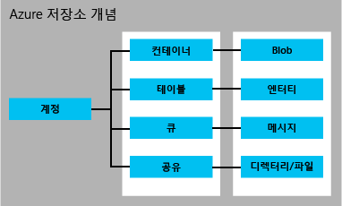

<properties
	pageTitle="저장소 소개 | Microsoft Azure"
	description="클라우드의 Azure 저장소, Microsoft 온라인 데이터 저장소에 대한 개요 응용 프로그램에서 사용 가능한 최상의 클라우드 저장소 솔루션을 사용하는 방법을 알아봅니다."
	services="storage"
	documentationCenter=""
	authors="tamram"
	manager="carmonm"
	editor="tysonn"/>

<tags
	ms.service="storage"
	ms.workload="storage"
	ms.tgt_pltfrm="na"
	ms.devlang="na"
	ms.topic="get-started-article"
	ms.date="02/24/2016"
	ms.author="tamram"/>

# Microsoft Azure 저장소 소개

## 개요

Azure 저장소는 내구성, 가용성, 확장성을 활용하여 고객의 요구 사항을 충족하는 최신 응용 프로그램을 위한 클라우드 저장소 솔루션입니다. 이 문서를 통해 개발자, IT 전문가 및 비즈니스 의사 결정자는 다음에 대한 내용을 배울 수 있습니다.

- Azure 저장소의 정의 및 클라우드, 모바일, 서버 및 데스크톱 응용 프로그램에서 Azure 저장소를 활용할 수 있는 방법
- Azure 저장소 서비스에서 저장할 수 있는 데이터의 종류: blob(개체) 데이터, NoSQL 테이블 데이터, 큐 메시지 및 파일 공유
- Azure 저장소의 데이터에 대한 액세스를 관리하는 방법
- 중복 및 복제를 통해 Azure 저장소 데이터를 보호하는 방법
- 첫 Azure 저장소 응용 프로그램을 작성하기 위한 다음 단계

Azure 저장소를 빠르게 시작 및 실행하려면 [5분 만에 Azure 저장소 시작](storage-getting-started-guide.md)을 참조하세요.

Azure 저장소 작업을 위한 도구, 라이브러리 및 기타 리소스는 아래 [다음 단계](#next-steps)를 참조하세요.

## Azure 저장소란?

클라우드 컴퓨팅은 확장 가능하고 내구성이 우수한 고가용성 데이터 저장소가 필요한 응용 프로그램이 요구되는 새로운 시나리오를 지원합니다. Microsoft는 이러한 맥락에서 Azure 저장소를 개발했습니다. Azure 저장소는 개발자가 새로운 시나리오를 지원할 대규모 응용 프로그램을 빌드할 수 있게 할 뿐만 아니라 Azure 가상 컴퓨터의 저장소 기반을 제공하여 견고성을 입증합니다.

Azure 저장소는 대규모로 확장할 수 있으므로, 수백 테라바이트의 데이터를 저장 및 처리함으로써 과학, 재무 분석 및 미디어 응용 프로그램에 필요한 빅 데이터 시나리오를 지원할 수 있습니다. 또는 소규모 비즈니스 웹 사이트에 필요한 소량의 데이터를 저장할 수도 있습니다. 저장소 요구량이 줄면 저장하는 데이터에 대해서만 비용을 지불하면 됩니다. Azure 저장소는 현재 수십조에 달하는 고유한 고객 개체를 저장하고 초당 평균 수백만 건의 요청을 처리합니다.

Azure 저장소는 탄력적이므로 세계 곳곳의 수많은 대상 고객에 맞추어 응용 프로그램을 디자인하고, 저장하는 데이터양과 데이터 저장 요청 수 등 측면에서 필요에 따라 응용 프로그램을 확장할 수 있습니다. 사용량에 대해서만, 그리고 사용하는 경우에만 지불합니다.

Azure 저장소는 트래픽을 기반으로 자동으로 데이터 부하를 분산하는 자동 분할 시스템을 사용합니다. 다시 말해서, 응용 프로그램에 대한 수요가 증가하면 Azure 저장소가 이에 부합하는 적합한 리소스를 자동으로 할당합니다.

Azure 저장소에는 전 세계 어디에서나 클라우드, 데스크톱, 온-프레미스 서버, 모바일 또는 태블릿 장치 등 어떤 종류의 응용 프로그램에서나 액세스할 수 있습니다. 응용 프로그램이 장치에 데이터 하위 집합을 저장하고 이를 클라우드에 저장된 전체 데이터 집합과 동기화하는 모바일 시나리오에서 Azure 저장소를 사용할 수 있습니다.

Azure 저장소는 편리한 개발을 위해 다양한 운영 체제 집합(Windows 및 Linux 포함) 및 다양한 프로그래밍 언어(.NET, Java 및 C++ 포함)를 사용하는 클라이언트를 지원합니다. 또한 Azure 저장소는 간단한 REST API를 통해 데이터를 노출하며, 이 API는 HTTP/HTTPS를 통해 데이터를 송수신할 수 있는 클라이언트에서 사용할 수 있습니다.

Azure 프리미엄 저장소는 Azure 가상 컴퓨터에서 실행되는 I/O 사용량이 많은 작업을 지원하는 짧은 대기 시간의 고성능 디스크를 제공합니다. Azure 프리미엄 저장소를 사용하면 여러 영구 데이터 디스크를 가상 컴퓨터에 연결하여 성능 요구 사항을 충족하도록 구성할 수 있습니다. 각 데이터 디스크는 Azure 프리미엄 저장소에서 SSD 디스크의 지원을 받으며 최대 I/O 성능을 제공합니다. 자세한 내용은 [프리미엄 저장소: Azure 가상 컴퓨터 작업을 위한 고성능 저장소](storage-premium-storage.md)를 참조하세요.

## Azure 저장소 서비스 소개

Azure 저장소 계정은 Azure 저장소의 서비스에 대한 액세스 권한을 제공하는 보안 계정입니다. 저장소 계정은 저장소 리소스에 고유한 네임스페이스를 제공합니다. 저장소 계정에는 다음과 같은 두 종류가 있습니다.

- 표준 저장소 계정에는 Blob, 테이블, 큐 및 파일 저장소가 포함됩니다.
- 프리미엄 저장소 계정은 현재 Azure 가상 컴퓨터 디스크만 지원합니다.

저장소 계정을 만들려면 먼저 다양한 Azure 서비스에 대한 액세스 권한을 제공하는 계획인 Azure 구독이 있어야 합니다. 단일 구독으로 고유하게 명명된 저장소 계정을 100개까지 만들 수 있습니다. 저장소 계정 제한에 대한 자세한 내용은 [Azure 저장소 확장성 및 성능 목표](storage-scalability-targets.md)를 참조하세요. 볼륨 가격에 대한 자세한 내용은 [Azure 저장소 가격 정보](https://azure.microsoft.com/pricing/details/storage/)를 참조하세요.

[무료 계정](https://azure.microsoft.com/pricing/free-trial/)으로 Azure를 시작할 수 있습니다. 구독 계획을 구매하기로 결정하는 경우 다양한 [구입 옵션](https://azure.microsoft.com/pricing/purchase-options/) 중에서 선택할 수 있습니다. [MSDN 구독자](https://azure.microsoft.com/pricing/member-offers/msdn-benefits-details/)는 Azure 저장소를 포함한 Azure 서비스에 사용할 수 있는 무료 월별 크레딧을 받습니다.

### 표준 저장소 계정

표준 저장소 계정은 Blob 저장소, 테이블 저장소, 큐 저장소 및 파일 저장소 등 Azure 저장소 데이터 서비스에 대한 액세스 권한을 제공합니다.

- **Blob 저장소**는 파일 데이터를 저장합니다. Blob은 문서, 미디어 파일 또는 응용 프로그램 설치 프로그램 등 모든 종류의 텍스트 또는 이진 데이터일 수 있습니다. Blob 저장소를 개체 저장소라고도 합니다.
- **테이블 저장소**는 구조화된 데이터 집합을 저장합니다. 테이블 저장소는 신속한 개발과 대량 데이터에 대한 빠른 액세스를 가능하게 하는 NoSQL 키-특성 데이터 저장소입니다.
- **큐 저장소**는 워크플로 처리 및 클라우드 서비스 구성 요소 사이의 통신을 위한 안정적인 메시지를 제공합니다.
- **파일 저장소**는 표준 SMB 프로토콜을 사용하여 레거시 응용 프로그램을 위한 공유 저장소를 제공합니다. Azure 가상 컴퓨터 및 클라우드 서비스는 탑재된 공유를 통해 여러 응용 프로그램 구성 요소에서 파일 데이터를 공유할 수 있으며 온-프레미스 응용 프로그램은 파일 서비스 REST API를 통해 공유의 파일 데이터에 액세스할 수 있습니다.

각 표준 저장소 계정은 Blob, 큐, 테이블 및 파일 데이터를 합해서 최대 500TB까지 포함할 수 있습니다. 표준 저장소 계정 용량에 대한 자세한 내용은 [Azure 저장소 확장성 및 성능 목표](storage-scalability-targets.md)를 참조하세요.

아래 이미지에서는 표준 저장소 계정에서 Azure 저장소 리소스 간의 관계의 보여 줍니다.

표준 저장소 계정을 만드는 방법을 알아보려면 [저장소 계정 만들기](storage-create-storage-account.md#create-a-storage-account)를 참조하세요.

### 프리미엄 저장소 계정

Azure 프리미엄 저장소는 현재 Azure 가상 컴퓨터 디스크만 지원합니다. Azure 프리미엄 저장소의 자세한 개요는 [프리미엄 저장소: Azure 가상 컴퓨터 작업을 위한 고성능 저장소](storage-premium-storage.md)를 참조하세요.

[AZURE.INCLUDE [storage-versions-include](../../includes/storage-versions-include.md)]

## Blob 저장소

클라우드에 저장할 대량의 구조화되지 않은 데이터를 가진 사용자에게 Blob 저장소는 비용 효율적이고 확장성 있는 솔루션이 됩니다. Blob 저장소를 사용하여 다음과 같은 콘텐츠를 저장할 수 있습니다.

- 문서
- 사진, 비디오, 음악, 블로그 등의 소셜 데이터
- 파일, 컴퓨터, 데이터베이스 및 장치의 백업
- 웹 응용 프로그램의 이미지 및 텍스트
- 클라우드 응용 프로그램의 구성 데이터
- 로그 및 기타 대규모 데이터 집합과 같은 빅 데이터

모든 Blob은 컨테이너로 구성됩니다. 컨테이너를 통해 유용하게 개체 그룹에 보안 정책을 할당할 수도 있습니다. 저장소 계정에 포함할 수 있는 컨테이너 수에는 제한이 없으며, 컨테이너에 포함할 수 있는 Blob의 수에는 저장소 계정의 최대 500TB 용량 한도까지 제한이 없습니다.

Blob 저장소에는 블록 Blob, 추가 Blob 및 페이지 Blob(디스크)의 세 가지 Blob 유형이 있습니다. 블록 Blob은 클라우드 개체 스트리밍 및 저장을 위해 최적화되며 문서, 미디어 파일, 백업 등을 저장하는 데 적합합니다. 추가 Blob은 블록 Blob과 유사하지만 추가 작업에 최적화되어 있습니다. 새 블록을 끝에 추가해야만 추가 Blob을 업데이트할 수 있습니다. 추가 Blob은 Blob 끝에만 새 데이터를 써야 하는 로깅과 같은 시나리오에 적합합니다.

페이지 Blob은 IaaS 디스크를 나타내고 임의 쓰기를 지원하기 위해 최적화되며 크기가 최대 1TB일 수 있습니다. Azure 가상 컴퓨터 네트워크에 추가된 IaaS 디스크는 페이지 Blob으로 저장된 VHD입니다.

네트워크 제약 조건으로 인해 네트워크를 통해 Blob 저장소를 대상으로 데이터를 업로드하거나 다운로드하는 것이 불가능한 대규모 데이터 집합의 경우, 하드 드라이브를 Microsoft로 운송하여 데이터 센터에서 바로 데이터를 가져오거나 내보내도록 요청할 수 있습니다. [Microsoft Azure 가져오기/내보내기 서비스를 사용하여 Blob 저장소로 데이터 전송](storage-import-export-service.md)을 참조하세요.

## 테이블 저장소

최신 응용 프로그램은 이전 세대 소프트웨어가 요구하는 것보다 확장성과 유연성이 더 높은 데이터 저장소를 요구하는 경우가 많습니다. 테이블 저장소는 가용성이 높고 확장성이 큰 저장소를 제공하므로, 응용 프로그램이 사용자 요구에 맞게 자동으로 확장할 수 있습니다. 테이블 저장소는 Microsoft의 NoSQL 키/특성 저장소로, 스키마 없이 디자인되어 전통적인 관계형 데이터베이스와 차이가 있습니다. 스키마 없는 데이터 저장소 덕분에 응용 프로그램의 요구 사항이 변화함에 따라 데이터를 쉽게 적응시킬 수 있습니다. 테이블 저장소는 쉽게 사용할 수 있어, 개발자가 신속하게 응용 프로그램을 만들 수 있습니다. 모든 종류의 응용 프로그램에서 빠르고 비용 효율적으로 데이터에 액세스할 수 있습니다. 비슷한 양의 데이터일 때 테이블 저장소는 일반적으로 전통적인 SQL에 비해 비용이 매우 낮습니다.

테이블 저장소는 키-특성 저장소입니다. 다시 말해서, 테이블의 모든 값이 입력된 속성 이름을 사용하여 저장됩니다. 이 속성 이름은 선택 조건을 필터링하고 지정하는 데 사용할 수 있습니다. 속성 모음과 해당 값은 함께 엔터티를 구성합니다. 테이블 저장소에 스키마가 없기 때문에 동일한 테이블의 두 엔터티에 다양한 속성 모음이 포함될 수 있으며, 이 속성은 그 유형이 서로 다를 수 있습니다.

테이블 저장소를 사용하여 웹 응용 프로그램의 사용자 데이터, 주소록, 장치 정보 및 서비스에 필요한 다른 유형의 메타데이터와 같은 유연한 데이터 집합을 저장할 수 있습니다. 테이블에 저장할 수 있는 엔터티 수에는 제한이 없으며, 저장소 계정에 포함할 수 있는 테이블의 수에는 저장소 계정의 최대 용량 한도까지 제한이 없습니다.

Blob 및 큐와 같이, 개발자는 표준 REST 프로토콜을 사용하여 테이블 저장소를 관리 및 액세스할 수 있습니다. 하지만 테이블 저장소는 OData 프로토콜 하위 집합도 지원하여 고급 쿼리 기능을 간소화하고 JSON 및 AtomPub(XML 기반) 형식을 사용할 수 있게 합니다.

최신 인터넷 기반 응용 프로그램의 경우, 테이블 저장소와 같은 NoSQL 데이터베이스는 전통적인 관계형 데이터베이스를 대신하여 많이 사용됩니다.

## 큐 저장소

규모를 고려하여 응용 프로그램을 디자인할 때는 응용 프로그램 구성 요소를 개별적으로 확장할 수 있도록 각 구성 요소를 분리하는 경우가 많습니다. 큐 저장소는 클라우드, 데스크톱, 온-프레미스 서버 또는 모바일 장치에서 실행 중인 응용 프로그램 구성 요소 사이의 비동기 통신을 위한 안정적인 메시징 솔루션을 제공합니다. 큐 저장소는 또한 비동기 작업 관리와 프로세스 워크플로 작성을 지원합니다.

저장소 계정에 포함할 수 있는 큐의 수에는 제한이 없습니다. 큐에 포함할 수 있는 메시지 수에는 저장소 계정의 최대 용량 한도까지 제한이 없습니다. 개별 메시지는 크기가 최대 64KB일 수 있습니다.

## 파일 저장소

Azure 파일 저장소는 클라우드 기반 SMB 파일 공유를 제공하므로 파일 공유에 의존하는 레거시 응용 프로그램을 비경제적인 다시 쓰기 작업 없이 신속하게 Azure로 마이그레이션할 수 있습니다. Azure 파일 저장소와 함께, Azure 가상 컴퓨터나 클라우드 서비스에서 실행되는 응용 프로그램은 데스크톱 응용 프로그램이 일반적인 SMB 공유를 탑재하는 것처럼 클라우드에 파일 공유를 탑재할 수 있습니다. 파일 저장소 공유를 동시에 탑재하고 액세스할 수 있는 응용 프로그램 구성 요소 수에는 제한이 없습니다.

파일 저장소 공유는 표준 SMB 파일 공유이므로 Azure에서 실행되는 응용 프로그램은 파일 시스템 I/O API를 통해 공유의 데이터에 액세스할 수 있습니다. 따라서 개발자는 기존의 코드와 기술을 이용하여 기존 응용 프로그램을 마이그레이션할 수 있습니다. IT 전문가는 PowerShell cmdlet을 사용하여 Azure 응용 프로그램 관리의 일부로 파일 저장소 공유를 만들고 탑재하고 관리할 수 있습니다.

다른 Azure 저장소 서비스와 마찬가지로, 파일 저장소는 공유의 데이터에 액세스하기 위한 REST API를 제공합니다. 온-프레미스 응용 프로그램은 파일 저장소 REST API를 호출하여 파일 공유의 데이터에 액세스할 수 있습니다. 이러한 방식으로 엔터프라이즈는 일부 레거시 응용 프로그램을 Azure로 마이그레이션하고 자체 조직 내에서 다른 응용 프로그램을 계속 실행하도록 선택할 수 있습니다. 파일 공유 탑재는 Azure에서 실행되는 응용 프로그램에서만 가능하며 온-프레미스 응용 프로그램은 REST API를 통해 파일 공유에 액세스할 수만 있습니다.

분산 응용 프로그램은 파일 저장소를 사용하여 유용한 응용 프로그램 데이터와 개발 및 테스트 도구를 저장하고 공유할 수 있습니다. 예를 들어 응용 프로그램은 로그, 메트릭 및 크래시 덤프와 같은 구성 파일 및 진단 데이터를 파일 저장소 공유에 저장할 수 있으므로 이러한 데이터를 여러 가상 컴퓨터나 역할에서 사용할 수 있습니다. 개발자와 관리자는 응용 프로그램을 빌드하거나 관리하는 데 필요한 유틸리티를 모든 가상 컴퓨터나 역할 인스턴스에 다 설치하지 않고, 모든 구성 요소에서 사용할 수 있는 파일 저장소 공유에 저장할 수 있습니다.

## Blob, 테이블, 큐 및 파일 리소스 액세스

기본적으로 저장소 계정 소유자만 저장소 계정의 리소스에 액세스할 수 있습니다. 데이터 보안을 위해 계정의 리소스에 대해 이루어지는 모든 요청은 인증을 받아야 합니다. 인증에는 공유 키 모델이 사용됩니다. 익명 인증을 지원하도록 Blob을 구성할 수도 있습니다.

생성 시 저장소 계정에 인증을 위해 사용되는 2개의 개인 선택키가 할당됩니다. 2개의 키는 일반 보안 키 관리 방법의 일환으로 키를 정기적으로 다시 생성할 때 응용 프로그램을 계속 사용할 수 있도록 합니다.

저장소 리소스에 대한 제어된 액세스를 사용자에게 허용할 필요가 없는 경우 공유 액세스 서명을 만들 수 있습니다. SAS(공유 액세스 서명)는 저장소 리소스에 대해 위임된 액세스를 허용하는 URL에 추가할 수 있는 토큰입니다. 토큰을 소유한 사람은 토큰 유효 기간 동안 토큰이 가리키는 리소스에 토큰이 지정하는 권한으로 액세스할 수 있습니다. 버전 2015-04-05부터 Azure 저장소는 두 가지 공유 액세스 서명(서비스 SAS, 계정 SAS)을 지원합니다.

서비스 SAS는 저장소 서비스(Blob, 큐, 테이블, 파일 서비스) 중 하나의 리소스에만 액세스 권한을 위임합니다.

계정 SAS는 하나 이상의 저장소 서비스에서 리소스에 대한 액세스 권한을 위임합니다. 서비스 SAS를 사용할 수 없는 서비스 수준 작업에 대해 액세스 권한을 위임할 수 있습니다. 또한 서비스 SAS로 허용되지 않는 Blob 컨테이너, 테이블, 큐, 파일 공유에서 읽기, 쓰기, 삭제 작업에 대한 액세스 권한을 위임할 수 있습니다.

마지막으로, 컨테이너 및 해당 Blob 또는 특정 Blob을 공개적으로 액세스할 수 있게 지정할 수 있습니다. 컨테이너 또는 Blob을 공개로 지정하면 모든 사용자가 이 컨테이너 또는 Blob를 익명으로 읽을 수 있으며 인증이 필요 없습니다. 공용 컨테이너 및 Blob은 웹 사이트에서 호스트되는 미디어 및 문서와 같은 리소스를 노출하는 데 유용합니다. 전 세계의 대상을 위한 네트워크 대기 시간을 줄이려면 Azure CDN으로 웹 사이트에서 사용되는 Blob 데이터를 캐시할 수 있습니다.

공유 액세스 서명에 대한 자세한 내용은 [공유 액세스 서명: SAS 모델이해](storage-dotnet-shared-access-signature-part-1.md)를 참조하세요. 저장소 계정에 대한 안전한 액세스 정보를 보려면 [컨테이너 및 Blob에 대한 익명 읽기 권한 관리](storage-manage-access-to-resources.md) 및 [Azure 저장소 서비스에 대한 인증](https://msdn.microsoft.com/library/azure/dd179428.aspx)을 참조하세요.

## 내구성 및 고가용성을 위한 복제

[AZURE.INCLUDE [storage-replication-options-include](../../includes/storage-replication-options-include.md)]

## Azure 저장소에서의 데이터 전송

AzCopy 명령줄 유틸리티를 사용하여 저장소 계정 내에서 또는 저장소 계정 간에 Blob, 파일 및 테이블 데이터를 복사할 수 있습니다. 자세한 내용은 [AzCopy 명령줄 유틸리티로 데이터 전송](storage-use-azcopy.md)을 참조하세요.

AzCopy는 [Azure 데이터 이동 라이브러리](https://www.nuget.org/packages/Microsoft.Azure.Storage.DataMovement/)를 기반으로 구축되며 현재 미리 보기에서 사용할 수 있습니다.

Azure 가져오기/내보내기 서비스는 Azure 데이터 센터에 우편으로 보낸 하드 드라이브 디스크를 통해 저장소 계정에서 Blob 데이터를 가져오고 내보내는 방법을 제공합니다. 가져오기/내보내기 서비스에 대한 자세한 내용은 [Microsoft Azure 가져오기/내보내기 서비스를 사용하여 Blob 저장소에 데이터 전송](storage-import-export-service.md)을 참조하세요.

## 가격

Azure 저장소에 대한 요금은 사용한 저장소 용량, 선택한 복제 옵션, 서비스에 대한 요청 수, 데이터 송신의 4가지 요소에 따라 부과됩니다.

저장소 용량은 데이터를 저장하는 데 사용하는 저장소 계정 서비스 단위가 어느 정도인지를 나타냅니다. 단순히 데이터를 저장하는 비용은 저장하는 데이터의 양과 복제 방법에 따라 결정됩니다. Azure 저장소에 대한 모든 읽기 및 쓰기 작업은 Azure 서비스에 대해 요청을 생성합니다. 데이터 송신은 Microsoft Azure 지역 외부에서 전송되는 데이터를 나타냅니다. 저장소 계정의 데이터에 동일한 지역에서 실행되지 않는 응용 프로그램이 액세스하는 경우 해당 응용 프로그램이 클라우드 서비스인지 다른 유형의 응용 프로그램인지 여부에 상관없이 데이터 송신 요금이 부과됩니다. Microsoft Azure 서비스의 경우 프로세스 및 데이터 송신 요금을 줄이거나 제거하기 위해 동일한 데이터 센터의 데이터와 서비스를 그룹화하는 조치를 취할 수 있습니다.

[Azure 저장소 가격 책정](https://azure.microsoft.com/pricing/details/storage/) 페이지에서 저장소 용량, 복제 및 트랜잭션에 대한 자세한 가격 정보를 제공합니다. [데이터 전송 가격 정보](https://azure.microsoft.com/pricing/details/data-transfers/)에서는 데이터 송신에 대한 자세한 가격 정보를 제공합니다. [Azure 저장소 가격 계산기](https://azure.microsoft.com/pricing/calculator/?scenario=data-management)를 사용하여 비용을 예측할 수 있습니다.

## 저장소 API, 라이브러리 및 도구

Azure 저장소 리소스는 HTTP/HTTPS 요청을 수행할 수 있는 모든 언어로 액세스할 수 있습니다. 또한 Azure 저장소는 많이 사용되는 몇 가지 언어를 위한 프로그래밍 라이브러리를 제공합니다. 이 라이브러리는 동기/비동기 호출, 작업 일괄 처리, 예외 관리, 자동 재시도, 작업자 동작 등과 같은 세부 사항을 처리하여 Azure 저장소 작업의 많은 측면을 간소화합니다. 현재 이 라이브러리는 파이프라인의 다른 라이브러리와 함께 다음 언어 및 플랫폼에 대해 사용할 수 있습니다.

### Azure 저장소 데이터 서비스

- [저장소 서비스 REST API](http://msdn.microsoft.com/library/azure/dd179355.aspx)
- [.NET, Windows Phone 및 Windows 런타임용 저장소 클라이언트 라이브러리](https://www.nuget.org/packages/WindowsAzure.Storage/)
- [Storage Client Library for C++](https://github.com/Azure/azure-storage-cpp)
- [Java/Android용 저장소 클라이언트 라이브러리](/develop/java/)
- [Node.js용 저장소 클라이언트 라이브러리](http://dl.windowsazure.com/nodestoragedocs/index.html)
- [PHP용 저장소 클라이언트 라이브러리](/develop/php/)
- [Ruby용 저장소 클라이언트 라이브러리](/develop/ruby/)
- [Python용 저장소 클라이언트 라이브러리](/develop/python/)
- [PowerShell 1.0용 저장소 Cmdlet](https://msdn.microsoft.com/library/azure/mt269418.aspx)

### Azure 저장소 관리 서비스

- [저장소 리소스 공급자 REST API 참조](https://msdn.microsoft.com/library/azure/mt163683.aspx)
- [.NET용 저장소 리소스 공급자 클라이언트 라이브러리](https://msdn.microsoft.com/library/azure/mt131037.aspx)
- [PowerShell 1.0용 저장소 리소스 공급자 Cmdlet](https://msdn.microsoft.com/library/azure/mt607151.aspx)
- [저장소 서비스 관리 REST API(클래식](https://msdn.microsoft.com/library/azure/ee460790.aspx)

### Azure 저장소 데이터 이동 서비스 

- [저장소 가져오기/내보내기 서비스 REST API](https://msdn.microsoft.com/library/azure/dn529096.aspx)
- [.NET용 저장소 데이터 이동 클라이언트 라이브러리](https://www.nuget.org/packages/Microsoft.Azure.Storage.DataMovement/)

### 도구 및 유틸리티

- [Azure SDK 및 도구](https://azure.microsoft.com/downloads/)
- [Azure 저장소 에뮬레이터](http://www.microsoft.com/download/details.aspx?id=43709)
- [Azure PowerShell](../powershell-install-configure.md)
- [AzCopy 명령줄 유틸리티](http://aka.ms/downloadazcopy)

## 다음 단계

Azure 저장소에 대한 자세한 내용은 다음 리소스를 살펴보세요.

### 설명서

- [Azure 저장소 설명서](https://azure.microsoft.com/documentation/services/storage/)

### PowerShell 사용자

- [Azure 저장소와 함께 Azure PowerShell 사용](storage-powershell-guide-full.md)

### .NET 개발자

- [.NET을 사용하여 Azure Blob 저장소 시작](storage-dotnet-how-to-use-blobs.md)
- [.NET을 사용하여 Azure 테이블 저장소 시작](storage-dotnet-how-to-use-tables.md)
- [.NET을 사용하여 Azure 큐 저장소 시작](storage-dotnet-how-to-use-queues.md)
- [Windows에서 Azure 파일 저장소 시작](storage-dotnet-how-to-use-files.md)

### Java/Android 개발자

- [Java에서 Blob 저장소를 사용하는 방법](storage-java-how-to-use-blob-storage.md)
- [Java에서 테이블 저장소를 사용하는 방법](storage-java-how-to-use-table-storage.md)
- [Java에서 큐 저장소를 사용하는 방법](storage-java-how-to-use-queue-storage.md)
- [Java에서 파일 저장소를 사용하는 방법](storage-java-how-to-use-file-storage.md) 

### Node.js 개발자

- [Node.js에서 Blob 저장소를 사용하는 방법](storage-nodejs-how-to-use-blob-storage.md)
- [Node.js에서 테이블 저장소를 사용하는 방법](storage-nodejs-how-to-use-table-storage.md)
- [Node.js에서 큐 저장소를 사용하는 방법](storage-nodejs-how-to-use-queues.md)

### PHP 개발자

- [PHP에서 Blob 저장소를 사용하는 방법](storage-php-how-to-use-blobs.md)
- [PHP에서 테이블 저장소를 사용하는 방법](storage-php-how-to-use-table-storage.md)
- [PHP에서 큐 저장소를 사용하는 방법](storage-php-how-to-use-queues.md)

### Ruby 개발자

- [Ruby에서 Blob 저장소를 사용하는 방법](storage-ruby-how-to-use-blob-storage.md)
- [Ruby에서 테이블 저장소를 사용하는 방법](storage-ruby-how-to-use-table-storage.md)
- [Ruby에서 큐 저장소를 사용하는 방법](storage-ruby-how-to-use-queue-storage.md)

### Python 개발자

- [Python에서 Blob 저장소를 사용하는 방법](storage-python-how-to-use-blob-storage.md)
- [Python에서 테이블 저장소를 사용하는 방법](storage-python-how-to-use-table-storage.md)
- [Python에서 큐 저장소를 사용하는 방법](storage-python-how-to-use-queue-storage.md)
- [Python에서 파일 저장소를 사용하는 방법](storage-python-how-to-use-file-storage.md)

<!----HONumber=AcomDC_0309_2016-->