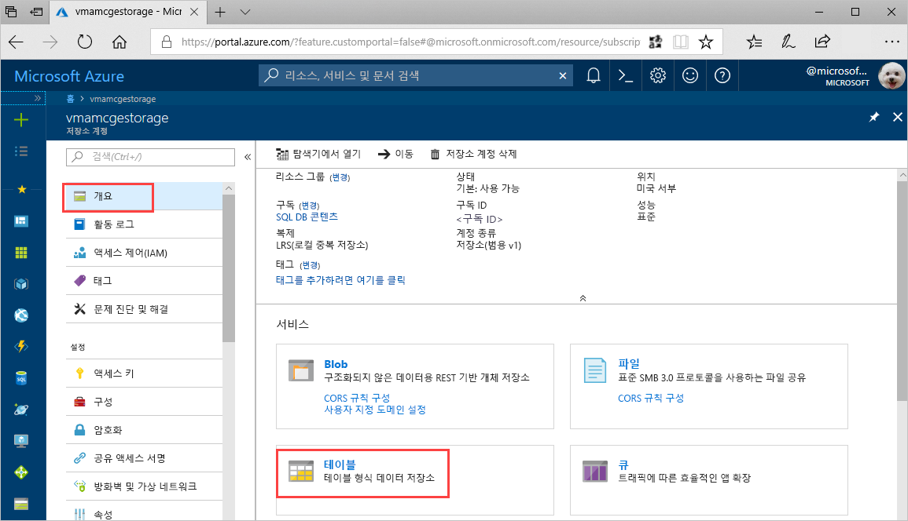
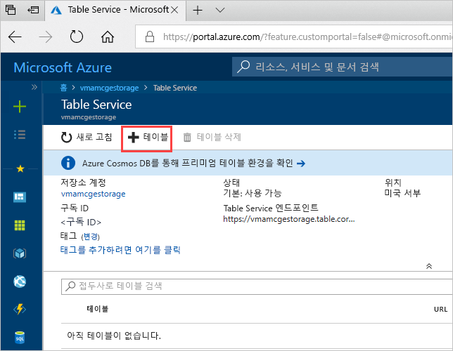
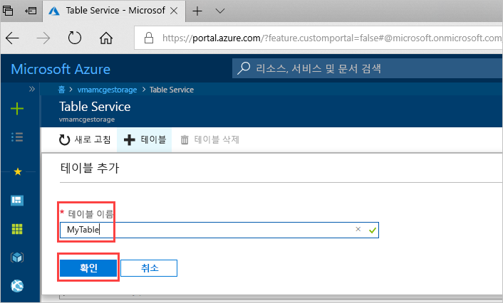

# 빠른 시작: Azure Portal에서 Azure Storage 테이블 만들기 

이 빠른 시작에서는 웹 기반 Azure Portal에서 테이블과 엔터티를 만드는 방법을 보여 줍니다. 또한 Azure 저장소 계정을 만드는 방법도 보여 줍니다.

[!INCLUDE [quickstarts-free-trial-note](../../../includes/quickstarts-free-trial-note.md)]

## 필수 조건

이 빠른 시작을 완료하려면 먼저 [Azure Portal](https://portal.azure.com/#create/Microsoft.StorageAccount-ARM)에서 Azure 저장소 계정을 만듭니다. 저장소 계정을 만드는 데 도움이 필요한 경우 [저장소 계정 만들기](../common/storage-quickstart-create-account.md)를 참조하세요.

## 테이블 추가

이제 Azure Portal에서 Table service를 사용하여 테이블을 만들 수 있습니다.

1. 개요 > 테이블을 차례로 클릭합니다.

   

2. **+ 테이블**을 클릭합니다.

   

3. **테이블 이름** 상자에서 테이블 이름을 입력한 다음, **확인**을 클릭합니다. 

   

## 다음 단계

- [테이블 디자인 지침](table-storage-design-guidelines.md)
