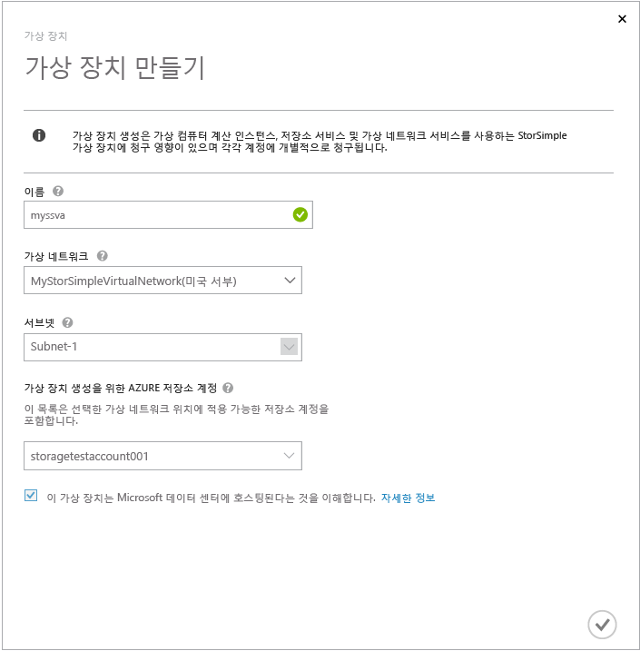
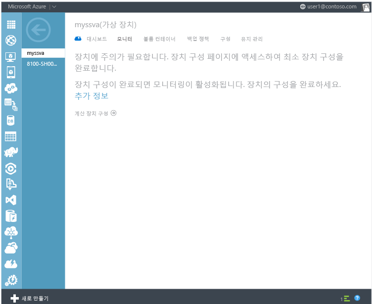
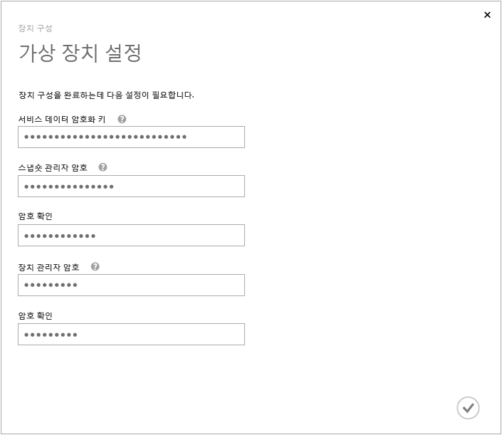
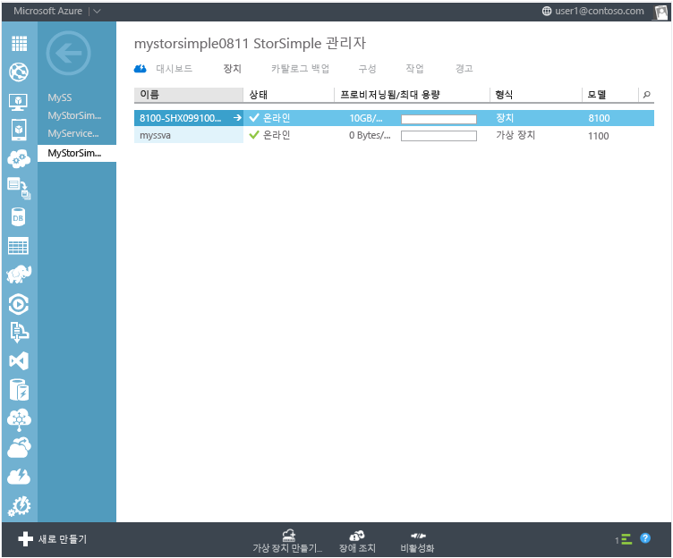

<properties
   pageTitle="StorSimple 가상 장치 | Microsoft Azure"
   description="StorSimple 가상 장치를 만들고 구성, 관리하는 방법을 설명합니다."
   services="storsimple"
   documentationCenter=""
   authors="alkohli"
   manager="adinah"
   editor="" />
<tags
   ms.service="storsimple"
   ms.devlang="NA"
   ms.topic="hero-article"
   ms.tgt_pltfrm="NA"
   ms.workload="NA"
   ms.date="08/13/2015"
   ms.author="alkohli" />

# StorSimple 가상 장치

[AZURE.INCLUDE [storsimple-version-selector-sva](../../includes/storsimple-version-selector-sva.md)]

##개요
StorSimple 가상 장치는 Microsoft Azure StorSimple 솔루션과 함께 제공되는 추가 기능입니다. StorSimple 가상 장치는 Microsoft Azure 가상 네트워크의 가상 컴퓨터에서 실행되며, 이 장치를 사용하여 호스트에서 데이터를 백업하고 복제할 수 있습니다. 이 문서에서 다음 항목은 StorSimple 가상 장치에 대해 배우고 구성하고 사용하는 데 도움이 됩니다.

- 가상 장치와 물리적 장치의 차이

- 가상 장치를 사용하기 위한 보안 고려 사항

- 가상 장치에 대한 필수 구성 요소

- 가상 장치 만들기 및 구성

- 가상 장치 작업

- 가상 장치에 대한 장애 조치

- 가상 장치를 종료하거나 삭제합니다.

## 가상 장치와 물리적 장치의 차이

StorSimple 가상 장치는 Microsoft Azure 가상 컴퓨터의 단일 노드에서 실행되는 StorSimple의 소프트웨어 전용 버전입니다. 가상 장치는 물리적 장치를 사용할 수 없으며 클라우드 개발 및 테스트 시나리오에서 사용하기 위해 적합 한 재해 복구 시나리오를 지원합니다.

다음은 StorSimple 가상 장치 및 물리적 장치 간의 몇 가지 주요 차이점입니다.

- 가상 장치에는 하나의 네트워크 인터페이스, 데이터 0만 있습니다. 물리적 장치에는 DATA 0에서 DATA 5까지의 6개의 네트워크 인터페이스가 있습니다.
- 가상 장치는 별도 작업이 아니라 구성 단계 중 등록됩니다.
- 가상 장치에서 서비스 데이터 암호화 키를 다시 생성할 수 없습니다. 키 롤오버 중 물리적 장치에서 키를 다시 생성한 다음 새 키로 가상 장치를 업데이트합니다.
- 업데이트를 가상 장치에 적용해야 하는 경우 일부 작동 중단 시간이 있지만 물리적 장치에는 없습니다.

## 가상 장치를 사용하기 위한 보안 고려 사항

StorSimple 가상 장치를 사용하는 경우 다음 보안 고려 사항을 염두에 두세요.

- 가상 장치는 Microsoft Azure 구독을 통해 보안이 설정됩니다. 가상 장치를 사용하고 Azure 구독이 손상되는 경우, 가상 장치에 저장된 데이터도 노출되기 쉬움을 의미합니다.

- Azure StorSimple에 저장된 데이터를 암호화하는데 사용되는 인증서의 공개키는 Microsoft Azure 관리 포털에서 안전하게 사용할 수 있으며 개인 키는 StorSimple 장치에 유지됩니다. StorSimple 가상 장치에서 공개 및 개인 키는 모두 Azure에 저장됩니다.

- 가상 장치는 Microsoft Azure 데이터 센터에서 호스팅됩니다.

## 가상 장치에 대한 필수 구성 요소

다음 섹션에서는 StorSimple 가상 장치 사용을 준비하는데 도움이 됩니다.

### Azure 요구 사항

가상 장치를 프로비전하기 전에 Azure 환경에서 다음 준비를 확인해야 합니다.

- 가상 장치의 경우, [Azure에서 가상 네트워크를 구성합니다](virtual-networks-create-vnet.md).
- 사용자 고유의 DNS 서버 이름을 지정하는 대신 Azure에서 제공하는 기본 DNS 서버를 사용하는 것이 좋습니다. DNS 서버 이름이 올바르지 않으면 가상 장치 만들기에 실패합니다.
- 지점 대 사이트간 및 사이트 대 사이트는 선택적이지만 필수는 아닙니다. 원하는 경우, 고급 시나리오에 대해 이 옵션을 구성할 수 있습니다.

>[AZURE.IMPORTANT]**가상 네트워크가 가상 장치와 사용 하려는 클라우드 저장소 계정과 동일한 지역에 있는지 확인합니다.**

- 가상 장치에 표시된 볼륨을 사용할 수 있는 [Azure 가상 컴퓨터](https://msdn.microsoft.com/library/azure/jj156003.aspx)(호스트 서버)를 가상 네트워크에 만들 수 있습니다. 이 서버는 다음 요구 사항을 충족해야 합니다.
	- iSCSI 초기자 소프트웨어가 설치된 Windows 또는 Linux VM입니다.
	- 가상 장치와 동일한 가상 네트워크에서 실행 중입니다.
	- 가상 장치의 내부 IP 주소를 통해 가상 장치의 iSCSI 대상에 연결할 수 없습니다.

- 동일한 가상 네트워크에서 iSCSI 및 클라우드 트래픽에 대한 지원을 구성했는지 확인합니다.

### StorSimple 요구 사항

가상 장치를 만들기 전에 Azure StorSimple 서비스에 대한 다음 업데이트를 확인합니다.

- 가상 장치에 대해 호스트 서버가 될 VM에 대해 [액세스 제어 레코드](storsimple-manage-acrs.md)를 추가합니다.

- 가상 장치와 동일한 지역에 [저장소 계정](storsimple-manage-storage-accounts.md#add-a-storage-account)이 있는지 확인합니다. 다른 영역의 저장소 계정으로 성능이 저하될 수 있습니다.

- 데이터에 사용된 계정이 아닌 가상 장치 생성을 위해 다른 저장소 계정을 사용하는지 확인합니다. 동일한 저장소 계정을 사용하면 성능이 저하될 수 있습니다.

시작하기 전에 다음 정보가 있는지 확인합니다.

- 액세스 자격 증명이 있는 Azure 포털 계정이 필요합니다.

- 액세스 자격 증명이 있는 Azure 저장소 계정이 필요합니다.

- 물리적 장치의 서비스 데이터 암호화 키의 복사본이 있습니다.

- 각 볼륨 컨테이너에 대한 클라우드 서비스 암호화 키의 복사본이 있습니다.

## 가상 장치 만들기 및 구성

이러한 절차를 수행하기 전에 [가상 장치에 대한 필수 구성 요소](#prerequisites-for-the-virtual-device)를 충족하는지 확인합니다.

이 절차를 완료하면 [가상 장치를 작업할](#work-with-the-storsimple-virtual-device) 준비가 된 것입니다.

### 가상 장치 만들기

가상 네트워크를 만들고, StorSimple 관리자 서비스를 구성하고 해당 서비스로 물리적 StorSimple 장치를 등록한 후, 다음 단계에 따라 StorSimple 가상 장치를 만들 수 있습니다.

다음 단계에 따라 StorSimple 가상 장치를 만듭니다.

1.  Azure 포털에서 **StorSimple 관리자** 서비스로 이동합니다.

- **장치** 페이지로 이동합니다.

- **가상 장치 만들기 대화 상자**에서 다음을 지정합니다.

	

	a. **이름** – 가상 장치에 대한 고유 이름입니다.

	b. **가상 네트워크** –이 가상 장치에 사용하려는 가상 네트워크의 이름입니다.

	c. **서브넷** – 가상 장치에 사용하기 위한 가상 네트워크의 서브넷입니다.

	d. **가상 장치를 만들기 위한 저장소 계정** – 프로비전하는 동안 가상 장치의 이미지를 저장하는데 사용할 저장소 계정입니다. 이 저장소 계정은 가상 장치 및 가상 네트워크와 동일한 지역에 있어야 합니다. 물리적 장치나 가상 장치에서 데이터 저장소에 대해 사용되어서는 안됩니다. 기본적으로 새 저장소 계정은 이 용도로 만들어집니다. 그러나 이 용도에 적합한 저장소 계정을 이미 알고 있는 경우 목록에서 선택할 수 있습니다.

- 가상 장치에 저장된 데이터를 Microsoft 데이터 센터에서 호스팅함을 이해했음을 표시하려면 확인 표시를 클릭합니다. 이제 가상 장치가 만들어집니다. 가상 장치를 만드는데 45분에서 1시간까지 걸릴 수 있습니다.

물리적 장치만 사용하는 경우, 암호화 키는 사용자 장치와 함께 유지되므로 Microsoft는 해독할 수 없습니다. 가상 장치를 사용하면 Microsoft Azure에 암호화 키와 암호 해독 키 모두가 저장됩니다. 자세한 내용은 [가상 장치를 사용하기 위한 보안 고려 사항](#security-considerations-for-using-a-virtual-device)을 참조하세요.

### 가상 장치 구성 및 등록

이 절차를 시작하기 전에 서비스 데이터 암호화 키의 복사본을 가지고 있는지 확인합니다. 첫 번째 StorSimple 물리적 장치를 구성하고 안전한 위치에 저장하도록 명령한 경우, 서비스 데이터 암호화 키가 만들어집니다. 서비스 데이터 암호화 키의 복사본이 없는 경우 [Microsoft 지원에 문의](storsimple-contact-microsoft-support.md)해야 합니다.

다음 단계에 따라 StorSimple 가상 장치를 구성하고 등록합니다.

1. **장치** 페이지에서 방금 만든 **StorSimple 가상 장치**를 선택합니다.
2. **장치 구성 완료**를 클릭합니다. 그러면 장치 구성 마법사가 시작됩니다.
 
	

1. 장치 구성 마법사:

	1. **서비스 데이터 암호화 키**를 제공한 공간에 입력합니다.
	2. **스냅숏 관리자 암호**를 입력합니다. **스냅숏 관리자 암호**는 14 또는 15자여야 하며 대문자, 소문자, 숫자 및 특수 문자의 조합이 포함되어야 합니다.
	3. **장치 관리자 암호**를 입력합니다. **장치 관리자 암호**는 8\~15자여야 하며 대문자, 소문자, 숫자 및 특수 문자의 조합이 포함되어야 합니다.
	4. 가상 장치의 초기 구성 및 등록을 완료하려면 확인 아이콘을 클릭합니다. 
	
		

구성 및 등록이 완료된 후에 장치가 온라인 상태가 됩니다. 장치가 온라인 상태가 되는데 몇 분 정도 걸릴 수 있습니다.

### 장치 구성 설정 수정 

다음 섹션에서는 StorSimple 가상 장치에 대한 구성에 필요한 장치 구성 설정을 설명합니다. 이러한 설정은 CHAP, StorSimple 스냅숏 관리자 암호 또는 장치 관리자 암호를 포함합니다.

#### CHAP 개시 장치 구성(선택 사항)

이 매개 변수는 볼륨 액세스를 시도 중인 초기자(서버)에서 가상 장치(대상)가 예상하는 자격 증명을 포함합니다. 초기자는 CHAP 사용자 이름 및 CHAP 암호를 제공하여 인증 중 장치를 자체적으로 식별합니다.

#### CHAP 대상 구성(선택 사항)

이 매개 변수는 CHAP 지원 초기자가 상호 또는 양방향 인증을 요청하면 가상 장치를 사용하는 자격 증명을 포함합니다. 가상 장치는 이 인증 프로세스 중 시작자에게 자체 식별을 위해 역방향 CHAP 사용자 이름 및 역방향 CHAP 암호를 사용합니다. CHAP 대상 설정은 전역 설정입니다. 이 설정을 적용하면 저장소 가상 장치에 연결된 모든 볼륨이 CHAP 인증을 사용합니다.

#### StorSimple 스냅숏 관리자 구성(선택 사항)

StorSimple 스냅숏 관리자 소프트웨어는 Windows 호스트에 상주하며 관리자가 로컬 및 클라우드 스냅숏의 형태로 StorSimple 장치의 백업을 관리할 수 있습니다.

>[AZURE.NOTE]**가상 장치의 경우, Windows 호스트는 Azure VM입니다.**

StorSimple 스냅숏 관리자에서 장치를 구성하면, StorSimple 장치 IP 주소 및 암호를 입력하여 저장소 장치를 인증하라는 메시지가 표시됩니다. 이 암호는 Windows PowerShell 인터페이스를 통해 처음 구성됩니다.

다음 단계를 수행하여 StorSimple 가상 장치를 사용하는 경우 StorSimple 스냅숏 관리자를 변경합니다.

1. 가상 장치에서 **장치 > 구성**으로 이동합니다.

- **스냅숏 관리자** 섹션으로 스크롤합니다. 14자 또는 15자인 암호를 입력합니다. 암호에 대문자, 소문자, 숫자 및 특수 문자의 조합이 포함되어 있는지 확인합니다.

- 암호를 확인합니다.

- 페이지 맨 아래에서 **저장**을 클릭합니다.

StorSimple 스냅숏 관리자 암호는 이제 업데이트되어 Windows 호스트를 인증할 때 사용할 수 있습니다.

#### 장치 관리자 암호 구성

Windows PowerShell 인터페이스를 사용하여 가상 장치에 액세스할 때 장치 관리자 암호를 입력해야 합니다. 데이터의 보안을 위해, 가상 장치를 사용하려면 먼저 이 암호를 변경해야 합니다.

다음 단계에 따라 StorSimple 가상 장치에 대한 장치 관리자 암호를 변경합니다.

1. 가상 장치에서 **장치 > 구성**으로 이동합니다.

1. **장치 관리자 암호** 섹션으로 스크롤합니다. 8자에서 15자를 포함하는 관리자 암호를 입력합니다. 암호는 대문자, 소문자, 숫자 및 특수 문자의 조합이어야 합니다.

1. 암호를 확인합니다.

1. 페이지 맨 아래에서 **저장**을 클릭합니다.

이제 장치 관리자 암호를 업데이트해야 합니다. 이 수정된 암호를 사용하여 가상 장치의 Windows PowerShell 인터페이스에 액세스합니다.

#### 원격 관리 구성(선택 사항)

Windows PowerShell 인터페이스를 통해 가상 장치에 대한 원격 액세스를 기본적으로 사용할 수 없습니다. 먼저, 가상 장치에서 원격 관리를 사용한 다음 가상 장치에 액세스하는데 사용할 클라이언트에서 사용하도록 설정해야 합니다.

HTTP 또는 HTTPS를 통해 연결하도록 선택할 수 있습니다. 보안상의 이유로 가상 장치에 연결 하는 자체 서명된 인증서와 HTTPS를 사용하는 것이 좋습니다.

다음 단계에 따라 StorSimple 가상 장치에 대한 원격 관리를 구성합니다.

1. 가상 장치에서 **장치 > 구성**으로 이동합니다.

2. **원격 관리** 섹션으로 스크롤합니다.

3. **원격 관리 사용**을 **예**로 설정합니다.

4. 이제 HTTP를 사용하여 연결하도록 선택할 수 있습니다. 기본값은 HTTPS를 통해 연결합니다. HTTP를 통한 연결은 신뢰할 수 있는 네트워크에서만 허용됩니다.

5. **원격 관리 인증서 다운로드**를 클릭하여 원격 관리 인증서를 다운로드합니다. 이 파일을 저장하는 위치를 지정합니다. 그런 다음 이 인증서는 가상 장치에 연결 하는데 사용할 클라이언트 또는 호스트 컴퓨터에 설치해야 합니다.

6. 페이지 맨 아래에서 **저장**을 클릭합니다.

## StorSimple 가상 장치 작업

StorSimple 가상 장치를 만들고 구성했으므로 작업을 시작할 준비가 되었습니다. 물리적 StorSimple 장치에서와 같이 가상 장치에서 볼륨 컨테이너, 볼륨 및 백업 정책을 작업할 수 있습니다. 유일한 차이점은 장치 목록에서 가상 장치를 선택했는지 확인해야 한다는 것입니다. 관련된 작업에 대한 지침은 다음 섹션을 참조하세요.

- [볼륨 컨테이너](storsimple-manage-volume-containers.md)

- [볼륨](storsimple-manage-volumes.md)

- [백업 정책](storsimple-manage-backup-policies)

다음 섹션에서는 가상 장치를 작업할 때 발생하는 차이점 중 일부에 대해 설명합니다.

### StorSimple 가상 장치 유지 관리

소프트웨어 전용 장치이기 때문에 물리적 장치에 대한 유지 관리와 비교할 때 가상 장치의 유지 관리는 최소입니다. 다음 옵션이 있습니다.

- **소프트웨어 업데이트** – 업데이트 상태 메시지와 함께 소프트웨어가 마지막으로 업데이트된 날짜를 볼 수 있습니다. 새 업데이트를 확인하려는 경우 수동 검사를 수행하려면 페이지 맨아래에 있는 업데이트 검색 단추를 사용할 수 있습니다.
- **지원 패키지** – 지원 패키지를 만들고 업데이트하여 Microsoft 지원이 가상 장치의 문제를 해결할 수 있도록 합니다.

### 가상 장치에 대한 저장소 계정

저장소 계정은 StorSimple Manager 서비스, 가상 장치 및 물리적 장치에서 사용하기 위해 만듭니다. 저장소 계정을 만들면 영역은 모든 시스템 구성 요소 전체에 걸쳐 일관성을 보장 하도록 친숙한 이름의 지역 식별자를 사용하는 것이 좋습니다. 가상 장치의 경우, 성능 문제를 방지하도록 모든 구성 요소가 동일한 영역에 있는 것이 중요합니다.

### StorSimple 가상 장치 비활성화

가상 장치를 비활성화하면 프로비전 시 만들어진 VM 및 리소스를 삭제합니다. 가상 장치가 비활성화된 후 이전 상태로 복원할 수 없습니다. 가상 장치를 비활성화하기 전에 가상 장치에 의존하는 클라이언트와 호스트를 중지하거나 삭제했는지 확인합니다.

가상 장치를 비활성화하면 다음 작업이 수행됩니다.

- 가상 장치가 제거됩니다.

- OS 디스크 및 가상 장치에 대해 만든 데이터 디스크가 제거됩니다.

- 프로비전 중 호스팅된 서비스 및 가상 네트워크가 유지됩니다. 사용하지 않는 경우 수동으로 삭제해야 합니다.

- 가상 장치에 대해 생성된 클라우드 스냅숏이 보존됩니다.

장치가 StorSimple 관리자 서비스 페이지에서 비활성화로 표시되는 즉시, StorSimple Manager 서비스 장치 목록에서 가상 장치를 삭제할 수 있습니다.

### StorSimple 가상 장치에 원격으로 연결

StorSimple 장치 구성 페이지에서 활성화한 후, Windows PowerShell 원격을 사용하여 동일한 가상 네트워크 내 다른 가상 컴퓨터에서 가상 장치에 연결할 수 있습니다. 예를 들어, iSCSI에 연결하도록 구성되고 사용된 호스트 VM에서 연결할 수 있습니다. 대부분의 배포에서는 가상 장치에 액세스하기 위해 사용할 수 있는 호스트 VM에 액세스하기 위해 이미 공용 끝점이 열려 있습니다.

>[AZURE.WARNING]**보안 강화를 위해 끝점에 연결할 때 HTTPS를 사용하고 PowerShell 원격 세션을 완료한 후 끝점을 삭제하는 것이 좋습니다.**

[Windows PowerShell을 사용하여 원격으로 연결](storsimple-remote-connect.md)의 절차에 따라 가상 장치에 대한 원격 서비스를 설정해야 합니다.

그러나 Microsoft Azure 환경 외부 또는 가상 네트워크 외부의 다른 컴퓨터에서 가상 장치에 직접 연결 하려는 경우 다음 절차에서 설명한 대로 추가 끝점을 만들어야 합니다.

가상 장치에 공용 끝점을 만들려면 다음 단계를 수행합니다.

1. Azure 포털에 로그인합니다.

- **가상 컴퓨터**를 클릭한 다음 가상 장치로 사용 중인 가상 컴퓨터를 선택합니다.

- **Endpoints**를 클릭합니다. 끝점 페이지에는 가상 컴퓨터에 대한 모든 끝점이 나열됩니다.

- **추가**를 클릭합니다. 끝점 추가 대화 상자가 나타납니다. 화살표를 클릭하여 계속합니다.

- **이름**의 경우, 끝점에 대해 **WinRMHttps**를 입력합니다.

- **프로토콜**의 경우 **TCP**를 지정합니다.

- **공용 포트**의 경우, 연결에 사용할 포트 번호를 입력합니다.

- **개인 포트**로 **5986**을 입력합니다.

- 확인 표시를 클릭하여 끝점을 만듭니다.

끝점이 생성되면, 세부 정보를 보고 공용 가상 IP(VIP) 주소를 확인할 수 있습니다. 이 주소를 기록합니다.

가상 네트워크의 공용 끝점의 수를 최소화하기 때문에 동일한 가상 네트워크 내 다른 가상 컴퓨터에서 연결하는 것이 좋습니다. 이 메서드를 사용하면, 원격 데스크톱 세션을 통해 연결한 다음 로컬 네트워크의 다른 Windows 클라이언트와 같이 가상 컴퓨터를 사용하도록 구성하면 됩니다. 포트를 이미 알 수 있으므로 공용 포트 번호를 추가할 필요가 없습니다.

### 중지 및 다시 시작

물리적 StorSimple 장치와 달리, StorSimple 가상 장치에서 누를 전원 켜짐 또는 꺼짐 단추가 없습니다. 그러나 가상 장치를 중지하고 다시 시작해야 하는 경우가 있을 수 있습니다. 예를 들어, 일부 업데이트에서는 VM을 다시 시작해야 업데이트 프로세스를 완료할 수 있습니다. 가상 장치를 가장 쉽게 시작, 중지 및 다시 시작할 수 있는 방법은 가상 컴퓨터 관리 콘솔을 사용하는 것입니다.

관리 콘솔을 보면 가상 장치가 생성된 후 시작되기 때문에 상태는 **실행 중**입니다. 언제든지 가상 컴퓨터를 중지하고 다시 시작할 수 있습니다.

가상 장치를 중지하려면 해당 이름을 클릭하고 **종료**를 클릭합니다. 가상 장치를 종료하는 동안 상태는 **중지**입니다. 가상 장치가 중지된 후 상태는 **중지됨**입니다.

가상 장치를 실행하고 다시 시작하려면 해당 이름을 클릭하고 **다시 시작**을 클릭합니다. 가상 장치를 다시 시작하는 동안 상태는 **다시 시작 중**입니다. 가상 장치가 사용할 준비가 되면 상태는 **실행 중**입니다.

다음 Windows PowerShell cmdlet을 사용하여 가상 장치를 시작, 중지 및 다시 시작할 수도 있습니다. 각 cmdlet 예제는 다음과 같습니다.

`Start-AzureVMC:\PS>Start-AzureVM -ServiceName "MyStorSimpleservice1" -Name "MyStorSimpleDevice"`

`Stop-AzureVMC:\PS>Stop-AzureVM -ServiceName "MyStorSimpleservice1" -Name "MyStorSimpleDevice"`

`Restart-AzureVMC:\PS>Restart-AzureVM -ServiceName "MyStorSimpleservice1" -Name "MyStorSimpleDevice"`

### 공장 기본값으로 재설정

가상 장치로 다시 시작하려는 지를 결정한 경우 비활성화하고 삭제한 다음 새 가상 장치를 만들면 됩니다. 물리적 장치를 재설정할 때와 마찬가지로, 새 가상 장치에는 설치된 업데이트가 없으므로 사용하기 전에 업데이트를 확인해야 합니다.

## 가상 장치에 대한 장애 조치

DR(재해 복구)는 StorSimple 가상 장치가 설계된 주요 시나리오 중 하나입니다. 이 시나리오에서는 물리적 StorSimple 장치 또는 전체 데이터 센터를 사용하지 못할 수 있습니다. 다행스럽게도 가상 장치를 사용하여 다른 위치에서 작업을 복원할 수 있습니다. DR 중, 원본 장치의 볼륨 컨테이너는 소유권을 변경하고 가상 장치로 전송됩니다. DR에 대한 필수 구성 요소는 가상 장치가 작성되고 구성되었는지, 볼륨 컨테이너 내의 모든 볼륨을 오프라인으로 전환했는지 및 볼륨 컨테이너에 연결된 클라우드 스냅숏이 있는지 입니다.

### StorSimple 가상 장치로 물리적 장치를 복원하려면

1. 장애 조치하려는 볼륨 컨테이너에 연결된 클라우드 스냅숏이 있는지 확인합니다.

- **장치** 페이지를 연 다음 **볼륨 컨테이너** 탭을 클릭합니다.

- 가상 장치에 장애 조치하려는 볼륨 컨테이너를 선택합니다. 볼륨 컨테이너를 클릭하여 컨테이너 내에 볼륨의 목록을 표시합니다. 볼륨을 선택하고 **오프라인으로 전환**을 클릭하여 볼륨을 오프라인으로 전환합니다. 볼륨 컨테이너의 모든 볼륨에 이 프로세스를 반복합니다.

- 가상 장치에 장애 조치하려는 모든 볼륨 컨테이너에 대해 이전 단계를 반복합니다.

- **장치** 페이지에서 장애 조치해야 하는 장치를 선택한 다음 **장애 조치**를 클릭하여 **장치 장애 조치** 마법사를 엽니다.

- **장애 조치가 가능 하도록 볼륨 컨테이너 선택**에서, 장애 조치하려는 볼륨 컨테이너를 선택합니다. 이 목록에 표시하기 위해, 볼륨 컨테이너에 클라우드 스냅숏이 포함하고 오프라인 상태가 되어야 합니다. 표시될 볼륨 컨테이너가 나타나지 않으면, 마법사를 취소하고 오프라인 상태인지 확인합니다.

- 다음 페이지에 있는 **볼륨에 대한 대상 장치 선택**의 선택된 컨테이너에서 사용 가능한 장치의 드롭다운 목록에서 가상 장치를 선택합니다. 사용할 용량이 있는 장치만 목록에 표시됩니다.

- **장애 조치 확인** 페이지에서 모든 장애 조치 설정을 검토합니다. 올바른 경우 확인 아이콘을 클릭합니다.

장애 조치 프로세스가 시작됩니다. 장애 조치가 완료되면 장치 페이지로 이동하고 장애 조치 프로세스에 대한 대상으로 사용된 가상 장치를 선택합니다. 볼륨 컨테이너 페이지로 이동합니다. 이전 장치의 볼륨과 함께 모든 볼륨 컨테이너에서 표시되어야 합니다.

>[AZURE.NOTE]**가상 장치에서 지원하는 저장소 용량은 30TB입니다.**

## 가상 장치를 종료하거나 삭제합니다.

StorSimple 가상 장치를 이전에 구성하고 사용했지만 이제 용도에 맞게 계산 비용 발생을 중지하려는 경우, 가상 장치를 종료할 수 있습니다. 가상 장치를 종료해도 저장소에서 해당 운영 체제 또는 데이터 디스크를 삭제하지 않습니다. 구독으로 발생하는 요금을 중지하지만 OS 및 데이터 디스크에 대한 저장소 비용은 계속 청구됩니다.

가상 장치를 삭제하거나 종료하는 경우 StorSimple Manager 서비스의 장치 페이지에 **오프라인**으로 표시됩니다. 가상 장치에서 만든 백업도 삭제하려는 경우, 장치에 따라 삭제하거나 비활성화하도록 선택할 수 있습니다. 자세한 내용은 [비활성화](storsimple-deactivate-and-delete-device.md#deactivate-a-device)를 참조하세요.

### StorSimple 가상 장치를 종료하려면

1. Azure 포털에 로그인합니다.

2. **가상 컴퓨터**를 클릭한 다음 가상 장치를 선택합니다.

3. **종료**를 클릭합니다.

### StorSimple 가상 장치를 삭제하려면

1. 관리 포털에 로그인합니다.

- **가상 컴퓨터**를 클릭한 다음 가상 장치를 선택합니다.

- **삭제**를 클릭하고 모든 가상 컴퓨터 디스크를 삭제하도록 선택합니다.

## 다음 단계

가상 장치를 관리하려면 [StorSimple 장치 관리](storsimple-manager-service-administration.md#administer-storsimple-device-using-storsimple-manager-service)에서 워크플로의 자세한 목록을 참조하세요.

 

<!---HONumber=August15_HO7-->