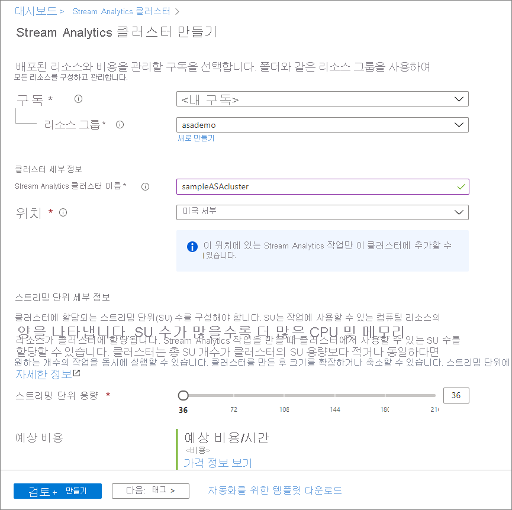

# 빠른 시작: Azure Portal을 사용하여 전용 Azure Stream Analytics 클러스터 만들기

Azure Portal을 사용하여 Azure Stream Analytics 클러스터를 만듭니다. [Stream Analytics 클러스터](cluster-overview.md)는 복잡하고 까다로운 스트리밍 사용 사례에 사용할 수 있는 단일 테넌트 배포입니다. Stream Analytics 클러스터에서 여러 Stream Analytics 작업을 실행할 수 있습니다.

## 사전 요구 사항

* 활성 구독이 있는 Azure 계정. [체험 계정을 만듭니다](https://azure.microsoft.com/free/?WT.mc_id=A261C142F).
* [빠른 시작: Azure Portal을 사용하여 Stream Analytics 작업 만들기](stream-analytics-quick-create-portal.md)를 완료합니다.

## Stream Analytics 클러스터 만들기

이 섹션에서는 Stream Analytics 클러스터 리소스를 만듭니다.

1. [Azure Portal](https://portal.azure.com)에 로그인합니다.

1. **리소스 만들기**를 선택합니다. *Marketplace 검색* 검색 상자에 **Stream Analytics 클러스터**를 입력하고 선택합니다. 그런 다음, **추가**를 선택합니다.

   :::image type="content" source="./media/create-cluster/search-result.png" alt-text="Stream Analytics 클러스터 검색 결과.":::

1. **Stream Analytics 클러스터 만들기** 페이지에서 새 클러스터에 대한 기본 설정을 입력합니다.

   |설정|값|Description |
   |---|---|---|
   |Subscription|구독 이름|이 Stream Analytics 클러스터에 사용하려는 Azure 구독을 선택합니다. |
   |리소스 그룹|리소스 그룹 이름|리소스 그룹을 선택하거나 **새로 만들기**를 선택한 후, 새 리소스 그룹에 고유한 이름을 입력합니다. |
   |클러스터 이름|고유한 이름|Stream Analytics 클러스터를 식별하는 이름을 입력합니다.|
   |위치|데이터 원본 및 싱크에 가장 가까운 지역입니다.|Stream Analytics 클러스터를 호스트할 수 있는 지리적 위치를 선택합니다. 낮은 대기 시간 분석을 위해 데이터 원본 및 싱크에 가장 가까운 위치를 사용합니다.|
   |스트리밍 단위 용량|36 ~ 216 |실행할 Stream Analytics 작업 수와 작업에 필요한 총 SU 수를 예측하여 클러스터 크기를 확인합니다. 36 SU로 시작하고 필요에 따라 나중에 확장 또는 축소할 수 있습니다.|

   

1. **검토 + 만들기**를 선택합니다. **태그** 섹션은 건너뛸 수 있습니다.

1. 클러스터 설정을 검토한 다음, **만들기**를 선택합니다. 클러스터 만들기는 장기 실행 작업이므로 완료하는 데 60분 정도 걸릴 수 있습니다. 포털 페이지에 **배포가 완료됨**이 표시되기를 기다립니다. 그 동안에는 이 클러스터에서 실행하려는 [Stream Analytics 작업](stream-analytics-quick-create-portal.md#create-a-stream-analytics-job)을 만들고 개발할 수 있습니다(아직 없는 경우).

1. **리소스로 이동**을 선택하여 Stream Analytics 클러스터 페이지로 이동합니다.

## 클러스터 삭제

Stream Analytics 작업을 실행할 계획이 없는 경우 Stream Analytics 클러스터를 삭제할 수 있습니다. Azure Portal에서 다음 단계를 수행하여 클러스터를 삭제합니다.

1. **설정**에서 **Stream Analytics 작업**으로 이동하고 실행 중인 모든 작업을 중지합니다.

1. 클러스터의 **개요**로 이동합니다. **삭제**를 선택하고 지침에 따라 클러스터를 삭제합니다.

## 다음 단계

이 빠른 시작에서는 Azure Stream Analytics 클러스터를 만드는 방법을 알아보았습니다. 클러스터에서 Stream Analytics 작업을 실행하는 방법을 알아보려면 다음 문서로 이동합니다.

> [!div class="nextstepaction"]
> [Stream Analytics 클러스터에서 Stream Analytics 작업 관리](manage-jobs-cluster.md)
