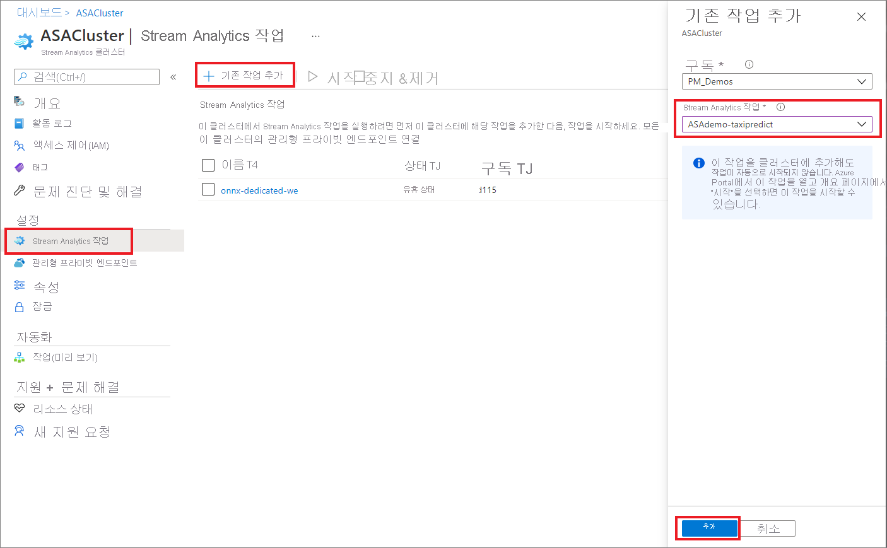
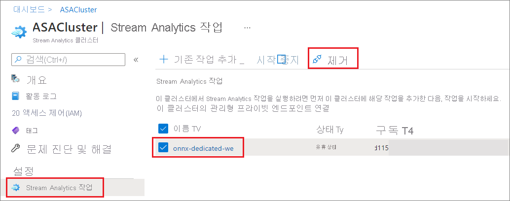

# Azure Stream Analytics 클러스터에서 작업 만들기 및 삭제

Stream Analytics 클러스터에서 여러 Azure Stream Analytics 작업을 실행할 수 있습니다. 클러스터에서 작업을 실행하는 것은 클러스터에 작업을 추가하고 작업을 시작하는 간단한 2단계 프로세스입니다. 이 문서에서는 기존 클러스터에서 작업을 추가하고 제거하는 방법을 보여 줍니다. 아직 없는 경우 빠른 시작을 수행하여 [Stream Analytics 클러스터를 만듭니다](create-cluster.md).

## 클러스터에 Stream Analytics 작업 추가

기존 Stream Analytics 작업만 클러스터에 추가할 수 있습니다. Azure Portal을 사용하여 [작업을 만드는 방법을 알아보려면](stream-analytics-quick-create-portal.md) 빠른 시작을 수행합니다. 클러스터에 추가하려는 작업이 있으면 다음 단계를 사용하여 클러스터에 작업을 추가합니다.

1. Azure Portal에서 Stream Analytics 클러스터를 찾아 선택합니다.

1. **설정**에서 **Stream Analytics 작업**을 선택합니다. 그런 다음, **기존 작업 추가**를 선택합니다.

1. 클러스터에 추가하려는 구독 및 Stream Analytics 작업을 선택합니다. 클러스터와 동일한 지역에 있는 Stream Analytics 작업만 클러스터에 추가할 수 있습니다.

   

1. 클러스터에 작업을 추가한 후 작업 리소스로 이동하여 [작업을 시작](start-job.md#azure-portal)합니다. 그러면 작업이 클러스터에서 실행되기 시작합니다.

Stream Analytics 작업 리소스 페이지에서 모니터링, 경고 및 진단 로그와 같은 기타 모든 작업을 수행할 수 있습니다.

## 클러스터에서 Stream Analytics 작업 제거

Stream Analytics 작업은 중지된 상태여야 클러스터에서 제거할 수 있습니다. 작업이 계속 실행 중인 경우 다음 단계를 진행하기 전에 작업을 중지합니다.

1. Stream Analytics 클러스터를 찾아 선택합니다.

1. **설정**에서 **Stream Analytics 작업**을 선택합니다.

1. 클러스터에서 제거할 작업을 선택한 다음, **제거**를 선택합니다.

   

   작업이 Stream Analytics 클러스터에서 제거되면 표준 다중 테넌트 환경으로 돌아갑니다.

## 다음 단계

이제 Azure Stream Analytics 클러스터에서 작업을 추가하고 제거하는 방법을 알았습니다. 다음으로 프라이빗 엔드포인트를 관리하고 클러스터를 확장하는 방법을 배울 수 있습니다.

* [Azure Stream Analytics 클러스터 크기 조정](scale-cluster.md)
* [Azure Stream Analytics 클러스터에서 프라이빗 엔드포인트 관리](private-endpoints.md)