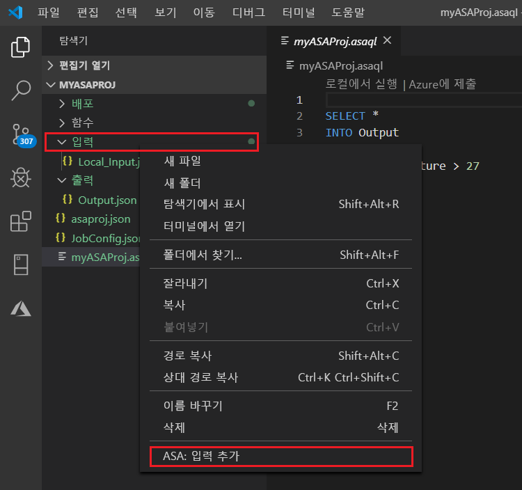
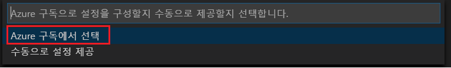
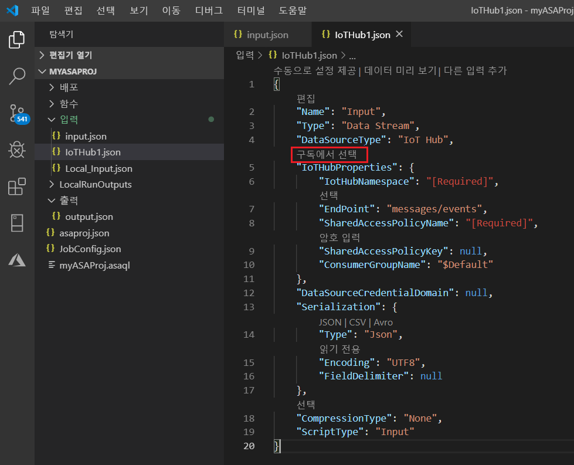
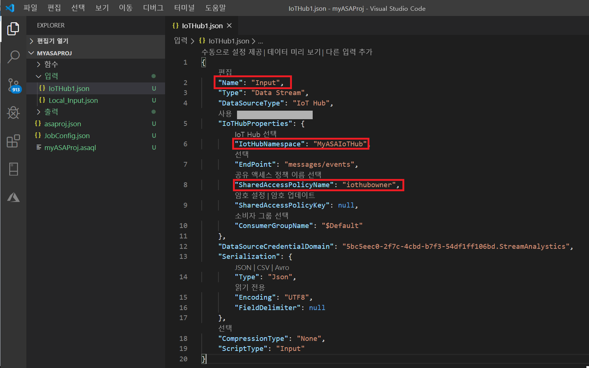
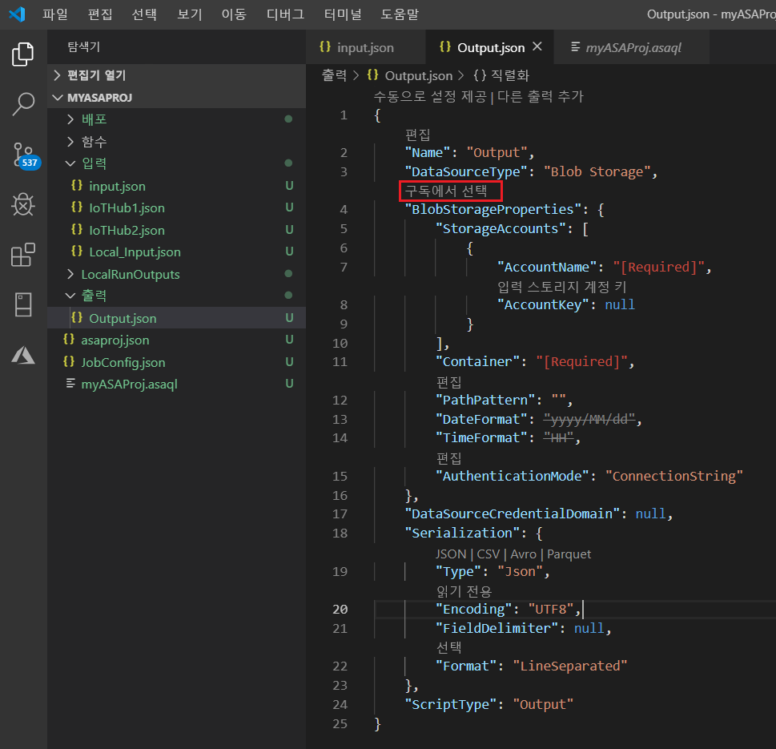

# <a name="quickstart-create-an-azure-stream-analytics-job-in-visual-studio-code-preview"></a>빠른 시작: Visual Studio Code에서 Azure Stream Analytics 작업 만들기(미리 보기)

이 빠른 시작에서는 Visual Studio Code용 Azure Stream Analytics Tools 확장을 사용하여 Azure Stream Analytics 작업을 만들고 실행하는 방법을 보여 줍니다. 예제 작업은 Azure IoT Hub 디바이스에서 스트리밍 데이터를 읽습니다. 27°를 초과할 때 평균 온도를 계산하고 Blob 스토리지의 새 파일에 결과 출력 이벤트를 작성하는 작업을 정의합니다.

## <a name="before-you-begin"></a>시작하기 전에

* Azure 구독이 아직 없는 경우 [체험 계정](https://azure.microsoft.com/free/)을 만듭니다.

* [Azure Portal](https://portal.azure.com/)에 로그인합니다.

* [Visual Studio Code](https://code.visualstudio.com/)를 설치합니다.

## <a name="install-the-azure-stream-analytics-tools-extension"></a>Azure Stream Analytics Tools 확장 설치

1. Visual Studio Code를 엽니다.

2. 왼쪽 창의 **확장**에서 **Stream Analytics**를 검색하고, **Azure Stream Analytics Tools** 확장에서 **설치**를 선택합니다.

3. 확장이 설치되면 **Azure Stream Analytics Tools**가 **사용하도록 설정된 확장**에 표시되는지 확인합니다.

   

## <a name="activate-the-azure-stream-analytics-tools-extension"></a>Azure Stream Analytics Tools 확장 활성화

1. Visual Studio Code 작업 막대에서 **Azure** 아이콘을 선택합니다. 사이드바의 **Stream Analytics** 아래에서 **Azure에 로그인**을 선택합니다.

   

2. 로그인되면 Azure 계정 이름이 Visual Studio Code 창의 왼쪽 아래 모서리에 있는 상태 표시줄에 표시됩니다.

> [!NOTE]
> 로그아웃하지 않으면 다음 번에 Azure Stream Analytics Tools 확장에 자동으로 로그인됩니다. 계정에 2단계 인증이 있는 경우 PIN 대신 전화 인증을 사용하는 것이 좋습니다.
> 리소스를 나열하는 데 문제가 있는 경우 일반적으로 로그아웃했다가 다시 로그인하면 도움이 됩니다. 로그아웃하려면 `Azure: Sign Out` 명령을 입력합니다.

## <a name="prepare-the-input-data"></a>입력 데이터 준비

Stream Analytics 작업을 정의하기 전에 나중에 작업 입력으로 구성되는 데이터를 준비해야 합니다. 작업에 필요한 입력 데이터를 준비하려면 다음 단계를 완료합니다.

1. [Azure Portal](https://portal.azure.com/)에 로그인합니다.

2. **리소스 만들기** > **사물 인터넷** > **IoT Hub**를 선택합니다.

3. **IoT Hub** 창에서 다음 정보를 입력합니다.

   |**설정**  |**제안 값**  |**설명**  |
   |---------|---------|---------|
   |Subscription  | \<구독\> |  사용할 Azure 구독을 선택합니다. |
   |리소스 그룹   |   asaquickstart-resourcegroup  |   **새로 만들기**를 선택하고 계정의 새로운 리소스 그룹 이름을 입력합니다. |
   |지역  |  \<사용자와 가장 가까운 지역 선택\> | IoT 허브를 호스팅할 수 있는 지리적 위치를 선택합니다. 사용자와 가장 가까운 위치를 사용합니다. |
   |IoT Hub 이름  | MyASAIoTHub  |   IoT 허브의 이름을 선택합니다.   |

   

4. 완료되면 **다음: 크기 및 규모 설정**을 선택합니다.

5. **가격 및 크기 계층**을 선택합니다. 이 빠른 시작의 경우 구독에서 아직 사용할 수 있다면 **F1 - 무료** 계층을 선택합니다. 체험 계층을사용 할 수 없는 경우 가능한 가장 낮은 계층을 선택합니다. 자세한 내용은 [Azure IoT Hub 가격 책정](https://azure.microsoft.com/pricing/details/iot-hub/)을 참조하세요.

   

6. **검토 + 만들기**를 선택합니다. IoT 허브 정보를 검토하고, **만들기**를 선택합니다. IoT Hub를 만드는 데 몇 분 정도 걸릴 수 있습니다. **알림** 창에서 진행 상황을 모니터링할 수 있습니다.

7. IoT 허브 탐색 메뉴의 **IoT 디바이스** 아래에서 **추가**를 선택합니다. **디바이스 ID**에 대한 ID를 추가하고, **저장**을 선택합니다.

   

8. 디바이스가 만들어지면 **IoT 디바이스** 목록에서 디바이스를 엽니다. 나중에 사용할 수 있도록 **연결 문자열(기본 키)** 의 문자열을 복사하여 메모장에 저장합니다.

   

## <a name="run-the-iot-simulator"></a>IoT 시뮬레이터 실행

1. 새 브라우저 탭 또는 창에서 [Raspberry Pi Azure IoT 온라인 시뮬레이터](https://azure-samples.github.io/raspberry-pi-web-simulator/)를 엽니다.

2. 15번째 줄의 자리 표시자를 이전에 저장한 IoT 허브 디바이스 연결 문자열로 바꿉니다.

3. **실행**을 선택합니다. IoT 허브로 보내는 센서 데이터와 메시지가 출력에 표시됩니다.

   

## <a name="create-blob-storage"></a>Blob Storage 만들기

1. Azure Portal의 왼쪽 위 모서리에서 **리소스 만들기** > **스토리지** > **스토리지 계정**을 차례로 선택합니다.

2. **스토리지 계정 만들기** 창에서 스토리지 계정 이름, 위치 및 리소스 그룹을 입력합니다. 만든 IoT 허브와 동일한 위치 및 리소스 그룹을 선택합니다. 그런 다음, **검토 + 만들기**를 선택하여 계정을 만듭니다.

   

3. 스토리지 계정이 만들어지면 **개요** 창에서 **Blob** 타일을 선택합니다.

   

4. **Blob 서비스** 페이지에서 **컨테이너**를 선택하고, 컨테이너에 **container1**과 같은 이름을 지정합니다. **퍼블릭 액세스 수준**을 **프라이빗(익명 권한 없음)** 으로 유지하고, **확인**을 선택합니다.

   

## <a name="create-a-stream-analytics-project"></a>Stream Analytics 프로젝트 만들기

1. Visual Studio Code에서 **Ctrl+Shift+P**를 선택하여 명령 팔레트를 엽니다. 그런 다음, **ASA**를 입력하고 **ASA: 새 프로젝트 만들기**를 선택합니다.

   

2. 프로젝트 이름(예: **myASAproj**)을 입력하고, 프로젝트의 폴더를 선택합니다.

    

3. 새 프로젝트가 작업 영역에 추가됩니다. Stream Analytics 프로젝트는 **Inputs**, **Outputs** 및 **Functions**의 3개 폴더로 구성됩니다. 또한 쿼리 스크립트 **(*.asaql)** , **JobConfig.json** 파일 및 **asaproj.json** 구성 파일이 있습니다.

    **asaproj.json** 구성 파일에는 Azure에 Stream Analytics 작업을 제출하는 데 필요한 입력, 출력 및 작업 구성 파일 정보가 포함되어 있습니다.

    

> [!Note]
> 명령 팔레트에서 입력 및 출력을 추가하면 해당 경로가 **asaproj.json**에 자동으로 추가됩니다. 입력 또는 출력을 추가하거나 제거할 때 **asaproj.json**에서 수동으로 추가 또는 제거해야 합니다. 입력 및 출력을 한 곳에 배치한 다음, 각 **asaproj.json** 파일에서 경로를 지정하여 다른 작업에서 참조하도록 선택할 수 있습니다.

## <a name="define-the-transformation-query"></a>변환 쿼리 정의

1. 프로젝트 폴더의 **myASAproj.asaql** 파일을 엽니다.

2. 다음 쿼리를 추가합니다.

   ```sql
   SELECT *
   INTO Output
   FROM Input
   HAVING Temperature > 27
   ```

## <a name="test-the-query-locally-with-sample-data"></a>샘플 데이터를 사용하여 로컬로 쿼리 테스트

클라우드에서 쿼리를 실행하기 전에 로컬 샘플 데이터 파일 또는 라이브 입력에서 캡처한 데이터를 사용하여 쿼리를 로컬로 테스트하여 쿼리 논리를 확인할 수 있습니다.

자세한 내용은 [샘플 데이터를 사용하여 로컬로 쿼리 테스트](visual-studio-code-local-run.md)의 지침을 따르세요.

 

## <a name="define-a-live-input"></a>라이브 입력 정의

1. Stream Analytics 프로젝트에서 마우스 오른쪽 단추로 **Inputs** 폴더를 클릭합니다. 그런 다음, 상황에 맞는 메뉴에서 **ASA: 입력 추가**를 선택합니다.

    

    또는 **Ctrl+Shift+P**를 선택하여 명령 팔레트를 열고, **ASA: Add Input**을 입력합니다.

   

2. 입력 형식으로 **IoT Hub**를 선택합니다.

   

3. 명령 팔레트에서 입력을 추가한 경우 해당 입력을 사용할 Stream Analytics 쿼리 스크립트를 선택합니다. 그러면 **myASAproj.asaql**의 파일 경로로 자동으로 채워집니다.

   

4. 드롭다운 메뉴에서 **Azure 구독에서 선택**을 선택합니다.

    

5. 다음 값을 사용하여 새로 생성된 **IoTHub1.json** 파일을 편집합니다. 여기서 설명되지 않은 필드의 경우 기본값을 유지합니다.

   |설정|제안 값|Description|
   |-------|---------------|-----------|
   |속성|입력|작업의 입력을 식별하는 이름을 입력합니다.|
   |IotHubNamespace|MyASAIoTHub|IoT 허브의 이름을 선택하거나 입력합니다. IoT 허브 이름이 동일한 구독에 만들어지면 자동으로 검색됩니다.|
   |SharedAccessPolicyName|iothubowner| |

   CodeLens 기능을 사용하여 문자열을 입력하거나, 드롭다운 목록에서 선택하거나, 파일에서 텍스트를 직접 변경할 수 있습니다. 다음 스크린샷에서는 **구독에서 선택**을 예로 보여 줍니다. 자격 증명은 자동으로 나열되고 로컬 자격 증명 관리자에 저장됩니다.

   

   

## <a name="preview-input"></a>입력 미리 보기

**IoTHub1.json**의 위쪽 줄에서 **데이터 미리 보기**를 선택합니다. 일부 입력 데이터는 IoT 허브에서 가져와서 미리 보기 창에 표시됩니다. 이 프로세스에는 시간이 좀 걸릴 수 있습니다.

 

## <a name="define-an-output"></a>출력 정의

1. **Ctrl+Shift+P** 키를 선택하여 명령 팔레트를 엽니다. **ASA: Add Output**을 입력합니다.

   

2. 싱크 유형으로 **Blob Storage**를 선택합니다.

3. 이 입력을 사용할 Stream Analytics 쿼리 스크립트를 선택합니다.

4. 출력 파일 이름을 **BlobStorage**로 입력합니다.

5. 다음 값을 사용하여 **BlobStorage**를 편집합니다. 여기서 설명되지 않은 필드의 경우 기본값을 유지합니다. CodeLens 기능을 사용하여 드롭다운 목록에서 선택하거나 문자열을 입력할 수 있습니다.

   |설정|제안 값|Description|
   |-------|---------------|-----------|
   |속성|출력| 작업의 출력을 식별하는 이름을 입력합니다.|
   |스토리지 계정|asaquickstartstorage|스토리지 계정의 이름을 선택하거나 입력합니다. 스토리지 계정 이름이 동일한 구독에 만들어지면 자동으로 검색됩니다.|
   |컨테이너|container1|스토리지 계정에서 만든 기존 컨테이너를 선택합니다.|
   |경로 패턴|output|컨테이너 내에서 만들 파일 경로 이름을 입력합니다.|

   

## <a name="compile-the-script"></a>스크립트 컴파일

스크립트 컴파일은 구문을 확인하고, 자동 배포를 위한 Azure Resource Manager 템플릿을 생성합니다.

다음과 같은 두 가지 방법으로 스크립트 컴파일을 트리거할 수 있습니다.

- 작업 영역에서 스크립트를 선택한 다음, 명령 팔레트에서 컴파일합니다.

   

- 마우스 오른쪽 단추로 스크립트를 클릭하고, **ASA: Compile Script**를 입력합니다.

    

컴파일이 완료되면 프로젝트의 **Deploy** 폴더에서 생성된 두 개의 Azure Resource Manager 템플릿을 확인할 수 있습니다. 이러한 두 파일은 자동 배포에 사용됩니다.


## <a name="submit-a-stream-analytics-job-to-azure"></a>Azure에 Stream Analytics 작업 제출

1. 쿼리 스크립트의 스크립트 편집기 창에서 **Azure에 제출**을 선택합니다.

   ![스크립트 편집기의 [구독에서 선택] 텍스트](./media/quick-create-vs-code/submit-job.png)

2. 팝업 목록에서 구독을 선택합니다.

3. **작업 선택**을 선택합니다. 그런 다음, **새 작업 만들기**를 선택합니다.

4. 작업 이름으로 **myASAjob**을 입력합니다. 그런 다음, 지침에 따라 리소스 그룹과 위치를 선택합니다.

5. **Azure에 제출**을 선택합니다. 그러면 출력 창에서 로그를 확인할 수 있습니다. 

6. 작업이 만들어지면 **Stream Analytics 탐색기**에서 확인할 수 있습니다.

    

## <a name="start-the-stream-analytics-job-and-check-output"></a>Stream Analytics 작업 시작 및 출력 확인

1. Visual Studio Code에서 **Stream Analytics 탐색기**를 열고 **myASAJob** 작업을 찾습니다.

2. 마우스 오른쪽 단추로 작업 이름을 클릭합니다. 팝업 메뉴에서 **시작**을 선택합니다.

   

3. 팝업 창에서 **지금**을 선택하여 작업을 시작합니다.

4. 작업 상태가 **실행 중**으로 변경되었습니다. 마우스 오른쪽 단추로 작업 이름을 클릭하고, **포털에서 작업 보기 열기**를 선택하여 입력 및 출력 이벤트 메트릭을 확인합니다. 이 작업에는 몇 분 정도 걸릴 수 있습니다.

5. 결과를 보려면 Visual Studio Code 확장 또는 Azure Portal에서 Blob 스토리지를 엽니다.

## <a name="clean-up-resources"></a>리소스 정리

더 이상 필요하지 않은 경우 리소스 그룹, 스트리밍 작업 및 모든 관련 리소스를 삭제합니다. 작업을 삭제하면 작업에서 사용하는 스트리밍 단위에 대한 요금이 청구되지 않습니다. 

나중에 작업을 사용하려는 경우 해당 작업을 중지하고 나중에 다시 시작할 수 있습니다. 이 작업을 다시 사용하지 않으려는 경우 다음 단계를 사용하여 이 빠른 시작에서 만든 모든 리소스를 삭제합니다.

1. Azure Portal의 왼쪽 메뉴에서 **리소스 그룹**을 선택한 다음, 만든 리소스의 이름을 선택합니다.  

2. 리소스 그룹 페이지에서 **삭제**를 선택합니다. 텍스트 상자에서 삭제할 리소스의 이름을 입력한 다음, **삭제**를 선택합니다.

## <a name="next-steps"></a>다음 단계

이 빠른 시작에서는 Visual Studio Code를 사용하여 간단한 Stream Analytics 작업을 배포했습니다. [Azure Portal](stream-analytics-quick-create-portal.md), [PowerShell](stream-analytics-quick-create-powershell.md) 및 [Visual Studio](stream-analytics-quick-create-vs.md)를 사용하여 Stream Analytics 작업을 배포할 수도 있습니다.

Visual Studio Code용 Azure Stream Analytics Tools에 대해 알아보려면 다음 문서로 계속 진행하세요.

* [Visual Studio Code를 사용하여 라이브 입력에 대해 로컬로 Azure Stream Analytics 작업 테스트](visual-studio-code-local-run-live-input.md)

* [Visual Studio Code를 사용하여 Azure Stream Analytics 작업 보기](visual-studio-code-explore-jobs.md)

* [npm 패키지를 사용하여 CI/CD 파이프라인 설정](setup-cicd-vs-code.md)
