# <a name="quickstart-create-an-azure-stream-analytics-cloud-job-in-visual-studio-code-preview"></a>빠른 시작: Visual Studio Code(미리 보기)에서 Azure Stream Analytics 클라우드 작업 만들기

이 빠른 시작에서는 Visual Studio Code용 Azure Stream Analytics 확장을 사용하여 Stream Analytics 작업을 만들고 실행하는 방법을 보여줍니다. 예제 작업에서는 IoT Hub 서비스에서 스트리밍 데이터를 읽습니다. 27°를 초과할 때 평균 온도를 계산하고 Blob 스토리지의 새 파일에 결과 출력 이벤트를 작성하는 작업을 정의합니다.

## <a name="before-you-begin"></a>시작하기 전에

* Azure 구독이 아직 없는 경우 [체험 계정](https://azure.microsoft.com/free/)을 만듭니다.

* [Azure Portal](https://portal.azure.com/)에 로그인합니다.

* [Visual Studio Code](https://code.visualstudio.com/)를 설치합니다.

## <a name="install-the-azure-stream-analytics-extension"></a>Azure Stream Analytics 확장 설치

1. Visual Studio Code를 엽니다.

2. 왼쪽 창의 **확장**에서 **Stream Analytics**를 검색하고, **Azure Stream Analytics** 확장에서 **설치**를 선택합니다.

3. 확장이 설치되면 **Azure Stream Analytics Tools**가 **확장 사용**에 표시되는지 확인합니다.

   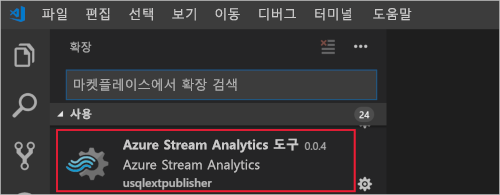

## <a name="activate-the-azure-stream-analytics-extension"></a>Azure Stream Analytics 확장 활성화

1. VS Code 작업 표시줄에서 **Azure** 아이콘을 선택합니다. 사이드바에 **Stream Analytics**가 표시됩니다. **Stream Analytics** 아래에서 **Azure에 로그인**을 선택합니다. 

   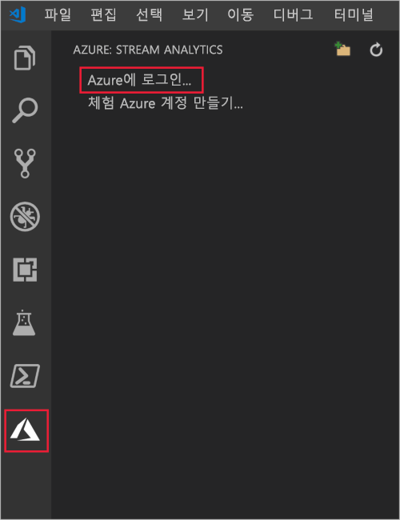

2. 로그인되면 Azure 계정 이름이 VS Code 창의 왼쪽 아래 모서리에 있는 상태 표시줄에 나타납니다.

> [!NOTE]
> 로그아웃하지 않으면 다음에 Azure Stream Analytics Tools에 자동으로 로그인됩니다. 계정에 2단계 인증이 설정된 경우 PIN보다는 전화 인증을 사용하는 것이 좋습니다.
> 리소스를 나열하는 데 이슈가 있는 경우 로그아웃했다가 다시 로그인하면 대부분 해결됩니다. 로그아웃하려면 `Azure: Sign Out` 명령을 입력합니다.

## <a name="prepare-the-input-data"></a>입력 데이터 준비

Stream Analytics 작업을 정의하기 전에 나중에 작업 입력으로 구성될 데이터를 준비해야 합니다. 작업에 필요한 입력 데이터를 준비하려면 다음 단계를 완료합니다.

1. [Azure Portal](https://portal.azure.com/)에 로그인합니다.

2. **리소스 만들기** > **사물 인터넷** > **IoT Hub**를 선택합니다.

3. **IoT Hub** 창에서 다음 정보를 입력합니다.
   
   |**설정**  |**제안 값**  |**설명**  |
   |---------|---------|---------|
   |구독  | \<구독\> |  사용할 Azure 구독을 선택합니다. |
   |리소스 그룹   |   asaquickstart-resourcegroup  |   **새로 만들기**를 선택하고 계정의 새로운 리소스 그룹 이름을 입력합니다. |
   |지역  |  \<사용자와 가장 가까운 지역 선택\> | IoT Hub를 호스트할 수 있는 지리적 위치를 선택합니다. 사용자와 가장 가까운 위치를 사용합니다. |
   |IoT Hub 이름  | MyASAIoTHub  |   IoT Hub의 이름을 선택합니다.   |

   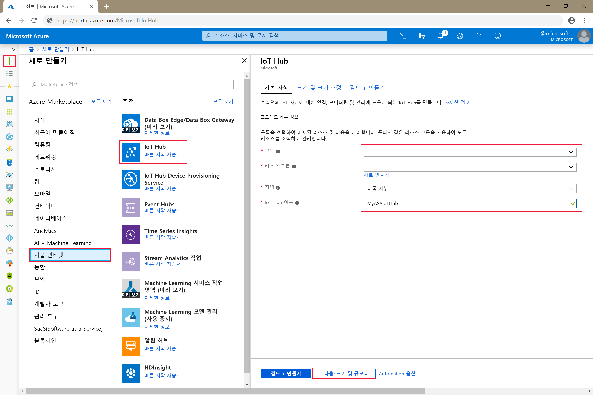

4. 완료되면 **다음: 크기 및 규모 설정**을 선택합니다.

5. **가격 책정 및 규모 계층**을 선택합니다. 이 빠른 시작의 경우 구독에서 아직 사용할 수 있다면 **F1 - 무료** 계층을 선택합니다. 체험 계층을사용 할 수 없는 경우 가능한 가장 낮은 계층을 선택합니다. 자세한 내용은 [IoT Hub 가격 책정](https://azure.microsoft.com/pricing/details/iot-hub/)을 참조하세요.

   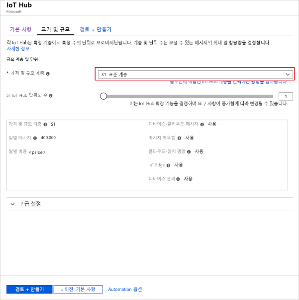

6. **검토 + 만들기**를 선택합니다. IoT Hub 정보를 검토하고 **만들기**를 클릭합니다. IoT Hub를 만드는 데 몇 분 정도 걸릴 수 있습니다. **알림** 창에서 진행 상황을 모니터링할 수 있습니다.

7. IoT Hub 탐색 메뉴의 **IoT 디바이스** 아래에서 **추가**를 클릭합니다. **디바이스 ID**를 추가하고 **저장**을 클릭합니다.

   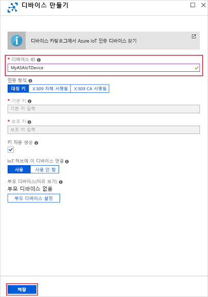

8. 디바이스가 만들어진 후에 **IoT 디바이스** 목록에서 디바이스를 엽니다. 나중에 사용하기 위해 **연결 문자열---기본 키**를 복사하고 메모장에 저장합니다.

   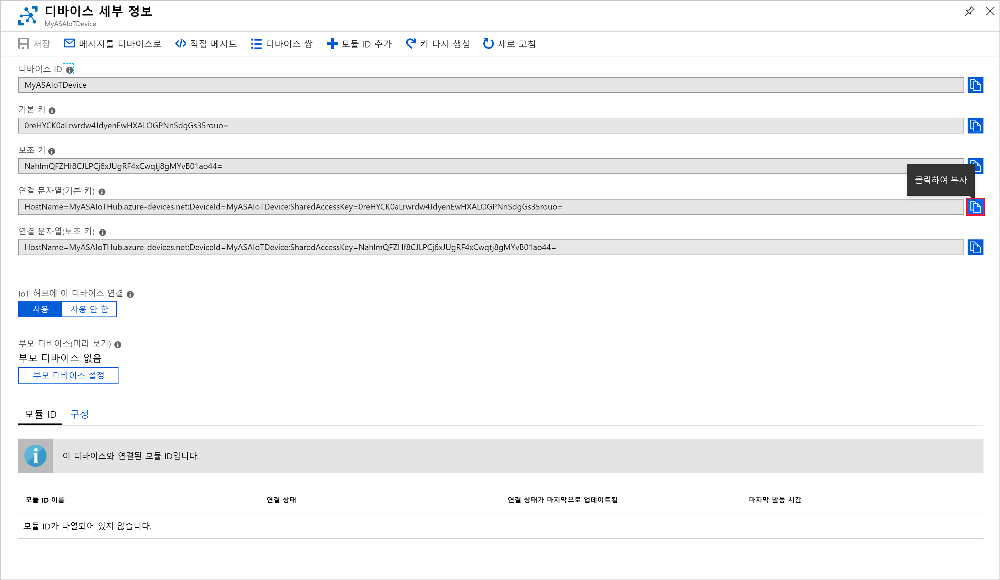

## <a name="create-blob-storage"></a>Blob Storage 만들기

1. Azure Portal의 왼쪽 위 모서리에서 **리소스 만들기** > **저장소** > **저장소 계정**을 선택합니다.

2. **스토리지 계정 만들기** 창에서 스토리지 계정 이름, 위치 및 리소스 그룹을 입력합니다. 자신이 만든 IoT Hub와 동일한 위치 및 리소스 그룹을 선택합니다. 그런 다음, **검토 + 만들기**를 클릭하여 계정을 만듭니다.

   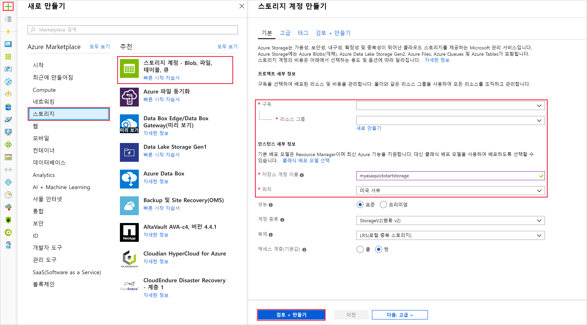

3. 스토리지 계정이 생성되면 **개요** 창에서 **Blob** 타일을 선택합니다.

   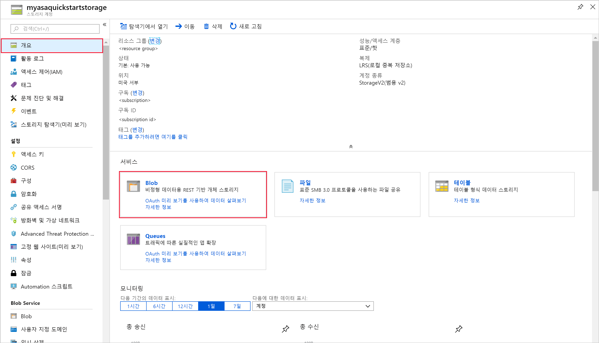

4. **Blob 서비스** 페이지에서 **컨테이너**를 선택하고, 컨테이너에 *container1*과 같은 이름을 지정합니다. **공용 액세스 수준**을 **개인(익명 액세스 없음)** 으로 유지하고 **확인**을 선택합니다.

   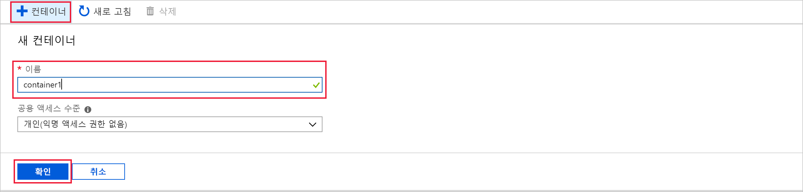

## <a name="create-a-stream-analytics-project"></a>Stream Analytics 프로젝트 만들기

1. Visual Studio Code에서 **Ctrl+Shift+P** 키를 눌러 명령 팔레트를 엽니다. **ASA**를 입력하고 **ASA: 새 프로젝트 만들기**를 선택합니다.

   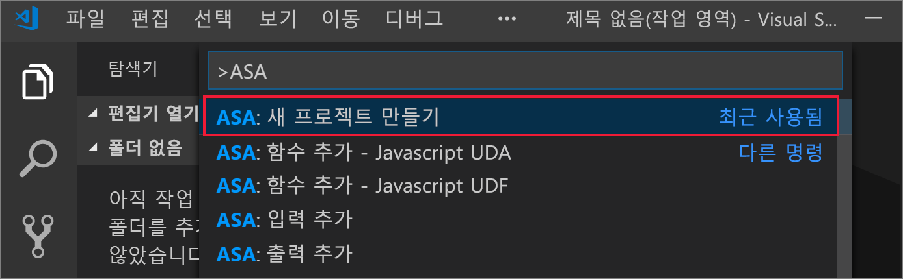

2. 프로젝트 이름을 입력하고(예: **myASAproj**) 프로젝트의 폴더를 선택합니다.

    

3. 새 프로젝트는 작업 영역에 추가됩니다. ASA 프로젝트는 쿼리 스크립트 **(*.asaql)**, **JobConfig.json** 파일 및 **asaproj.json** 구성 파일로 이루어집니다.

   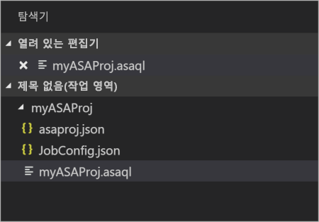

4. **asaproj.json** 구성 파일에는 Azure에 Stream Analytics 작업을 제출하는 데 필요한 입력, 출력 및 작업 구성 파일 정보가 포함되어 있습니다.

   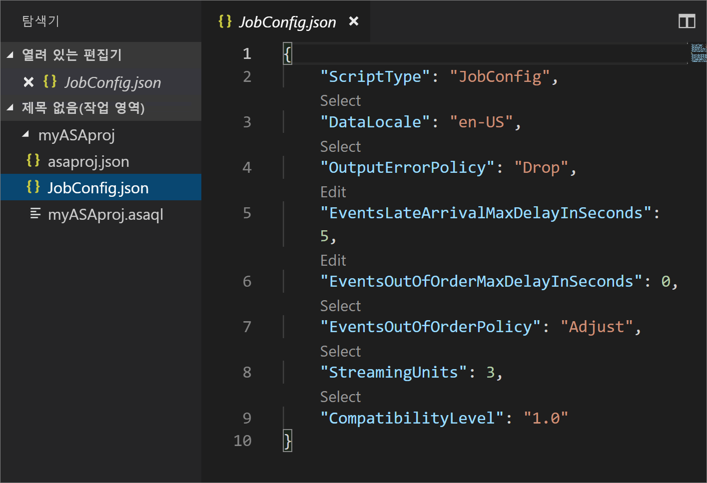

> [!Note]
> 명령 팔레트에서 입력 및 출력을 추가할 때 해당 경로가 **asaproj.json**에 자동으로 추가됩니다. 입력 또는 출력을 추가하거나 제거할 때 **asaproj.json**에서 수동으로 추가 또는 제거해야 합니다. 각 **asaproj.json**에서 경로를 지정하여 입력 및 출력을 한 장소에 배치하고 여러 작업에서 참조할 수 있습니다.

## <a name="define-an-input"></a>입력 정의

1. **Ctrl+Shift+P** 키를 선택하여 명령 팔레트를 열고 **ASA: Add Input**을 입력합니다.

   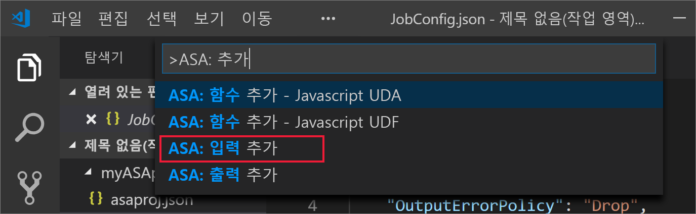

2. 입력 형식으로 **IoT Hub**를 선택합니다.

   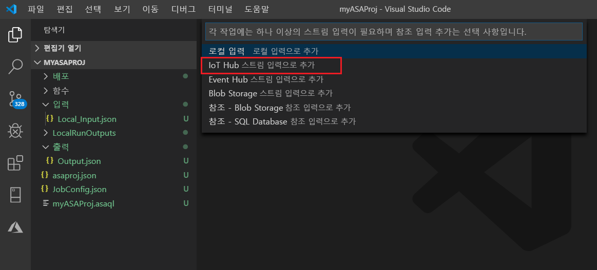

3. 입력을 사용할 ASA 쿼리 스크립트를 선택합니다. **myASAproj.asaql** 파일 경로가 자동으로 채워집니다.

   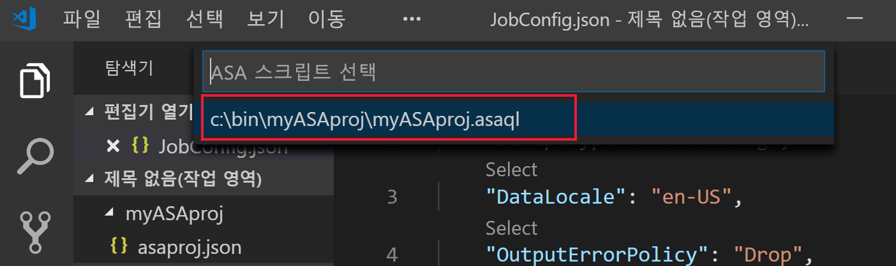

4. 입력 파일 이름을 **IotHub.json**으로 입력합니다.

5. **IoTHub.json**을 다음 값으로 편집합니다. 아래에 언급되지 않은 필드는 기본값을 유지합니다. CodeLens를 사용하여 문자열을 입력하거나, 드롭다운 목록에서 선택하거나, 파일에서 직접 텍스트를 변경할 수 있습니다.

   |설정|제안 값|설명|
   |-------|---------------|-----------|
   |Name|입력|작업의 입력을 식별하는 이름을 입력합니다.|
   |IotHubNamespace|MyASAIoTHub|IoT Hub의 이름을 선택하거나 입력합니다. IoT Hub 이름은 동일한 구독에 만들어진 경우에 자동으로 감지됩니다.|
   |엔드포인트|메시징| |
   |SharedAccessPolicyName|iothubowner| |

## <a name="define-an-output"></a>출력 정의

1. **Ctrl+Shift+P** 키를 선택하여 명령 팔레트를 엽니다. **ASA: Add Output**을 입력합니다.

   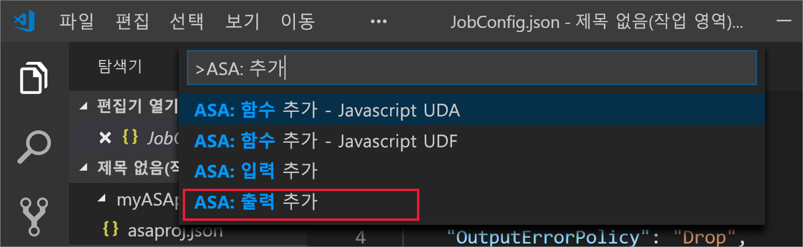

2. 싱크 유형으로 **Blob Storage**를 선택합니다.

3. 이 출력을 사용할 ASA 쿼리 스크립트를 선택합니다.

4. 출력 파일 이름을 **BlobStorage.json**으로 입력합니다.

5. **BlobStorage.json**을 다음 값으로 편집합니다. 아래에 언급되지 않은 필드는 기본값을 유지합니다. CodeLens를 사용하여 문자열을 입력하거나 드롭다운 목록에서 선택할 수 있습니다.

   |설정|제안 값|설명|
   |-------|---------------|-----------|
   |Name|출력| 작업의 출력을 식별하는 이름을 입력합니다.|
   |Storage 계정|asaquickstartstorage|스토리지 계정의 이름을 선택하거나 입력합니다. 저장소 계정 이름은 동일한 구독에 만들어진 경우에 자동으로 감지됩니다.|
   |컨테이너|container1|저장소 계정에서 만든 기존 컨테이너를 선택합니다.|
   |경로 패턴|output|컨테이너 내에서 만들 파일 경로 이름을 입력합니다.|

## <a name="define-the-transformation-query"></a>변환 쿼리 정의

1. 프로젝트 폴더의 **myASAproj.asaql** 파일을 엽니다.

2. 다음 쿼리를 추가합니다.

   ```sql
   SELECT * 
   INTO Output
   FROM Input
   HAVING Temperature > 27
   ```

## <a name="compile-the-script"></a>스크립트 컴파일

스크립트 컴파일은 자동 배포를 위한 구문을 검사하고 Azure Resource Manager 템플릿을 생성하는 두 가지 일을 합니다.

다음과 같은 두 가지 방법으로 스크립트 컴파일을 트리거할 수 있습니다.

1. 작업 영역에서 스크립트를 선택한 다음, 명령 팔레트에서 컴파일을 트리거합니다. 

   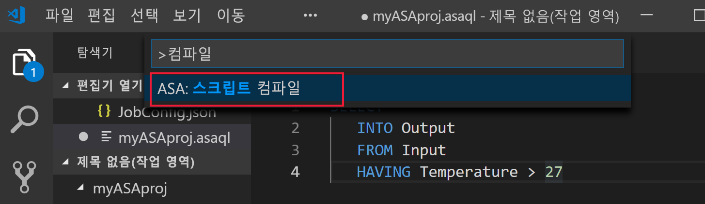

2. 스크립트를 마우스 오른쪽 단추로 클릭하고 **ASA: compile script**를 선택합니다.

    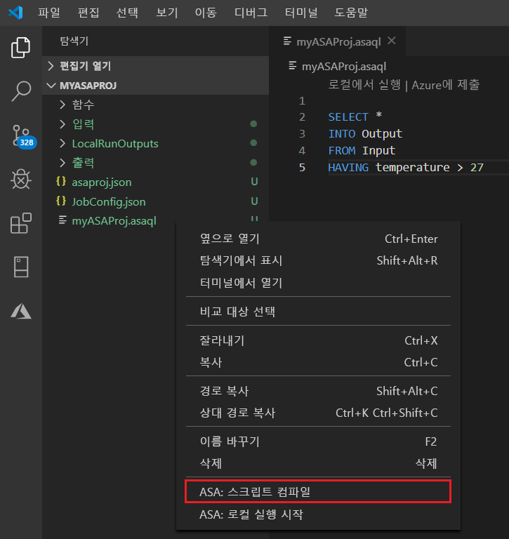

3. 컴파일이 끝나면 프로젝트의 **Deploy** 폴더에 Azure Resource Manager 템플릿 2개가 생성되어 있습니다. 두 파일은 자동 배포에 사용됩니다.

    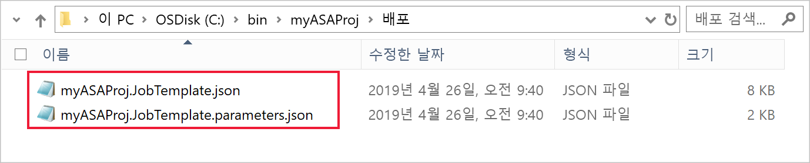

## <a name="submit-a-stream-analytics-job-to-azure"></a>Azure에 Stream Analytics 작업 제출

1. Visual Studio Code의 스크립트 편집기 창에서 **구독에서 선택**을 선택합니다.

   ![스크립트 편집기의 [구독에서 선택] 텍스트](./media/quick-create-vs-code/select-subscription.png)

2. 팝업 목록에서 구독을 선택합니다.

3. 작업을 선택합니다**. [새 작업 만들기]를 선택합니다.

4. 작업 이름으로 **myASAjob**을 입력하고, 지침에 따라 리소스 그룹 및 위치를 선택합니다.

5. **Azure에 제출**을 선택합니다. 출력 창에서 로그를 볼 수 있습니다. 

6. 작업이 만들어지면 Stream Analytics 탐색기에서 볼 수 있습니다.

## <a name="run-the-iot-simulator"></a>IoT 시뮬레이터 실행

1. 새 브라우저 탭 또는 창에서 [Raspberry Pi Azure IoT 온라인 시뮬레이터](https://azure-samples.github.io/raspberry-pi-web-simulator/)를 엽니다.

2. 15행의 자리 표시자를 이전 섹션에서 저장한 Azure IoT Hub 디바이스 연결 문자열로 대체합니다.

3. **실행**을 클릭합니다. IoT Hub로 전송 중인 센서 데이터와 메시지가 출력에 표시되어야 합니다.

   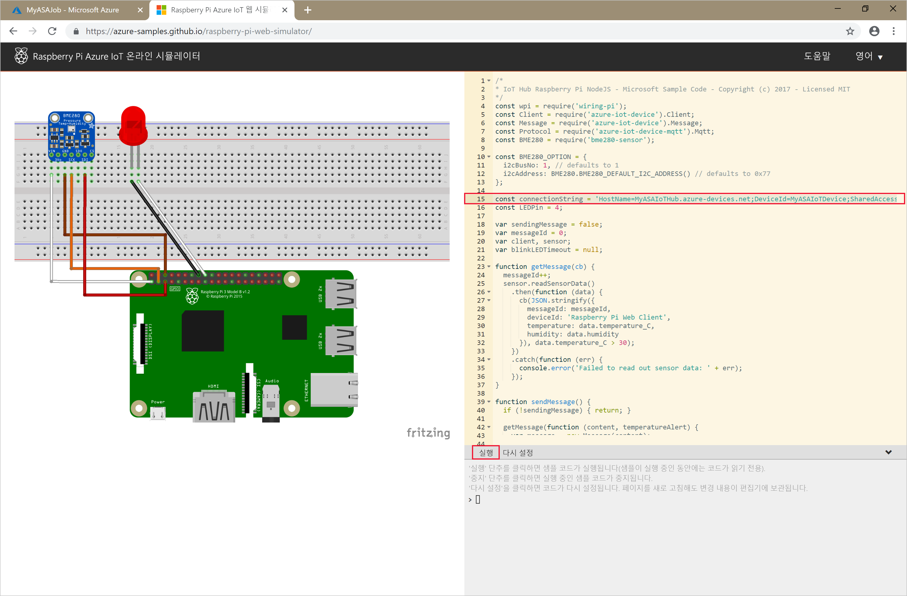

## <a name="start-the-stream-analytics-job-and-check-output"></a>Stream Analytics 작업 시작 및 출력 확인

1. Visual Studio Code에서 **Stream Analytics 탐색기**를 열고 **myASAJob** 작업을 찾습니다.

2. 작업 이름을 마우스 오른쪽 단추로 클릭합니다. 팝업 메뉴에서 **시작**을 선택합니다.

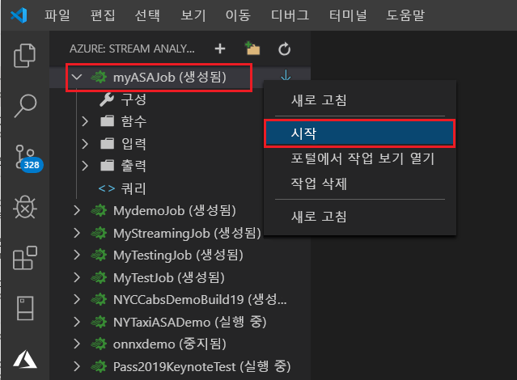

3. 팝업 창에서 **지금**을 선택하여 작업을 시작합니다.

4. 작업 상태가 **실행** 중으로 변경됩니다. 작업 이름을 마우스 오른쪽 단추로 클릭하고, **포털에서 작업 보기 열기**를 선택하여 입력 및 출력 이벤트 메트릭을 봅니다. 이 작업은 몇 분 정도 걸릴 수 있습니다.

5. 결과를 보려면 Visual Studio Code 확장 또는 Azure Portal에서 Blob 스토리지를 엽니다.

## <a name="clean-up-resources"></a>리소스 정리

더 이상 필요하지 않으면 리소스 그룹, 스트리밍 작업 및 모든 관련 리소스를 삭제합니다. 작업을 삭제하면 작업에서 사용된 스트리밍 단위에 대한 청구를 방지합니다. 작업을 나중에 사용하려는 경우 중지하고 나중에 필요할 때 다시 시작할 수 있습니다. 이 작업을 계속 사용하지 않으려면 다음 단계를 사용하여 이 빠른 시작에서 만든 리소스를 모두 삭제합니다.

1. Azure Portal의 왼쪽 메뉴에서 **리소스 그룹**을 선택한 다음, 만든 리소스의 이름을 선택합니다.  

2. 리소스 그룹 페이지에서 **삭제**를 선택하고 텍스트 상자에서 삭제할 리소스의 이름을 입력한 다음, **삭제**를 선택합니다.

## <a name="next-steps"></a>다음 단계

이 빠른 시작에서는 Visual Studio Code를 사용하여 간단한 Stream Analytics 작업을 배포했습니다. [Azure Portal](stream-analytics-quick-create-portal.md), [PowerShell](stream-analytics-quick-create-powershell.md) 및 Visual Studio(stream-analytics-quick-create-vs.md)를 사용하여 Stream Analytics 작업을 배포할 수도 있습니다. 

Azure Stream Analytics tools for Visual Studio를 알아보려면 다음 문서를 계속 합니다.

> [!div class="nextstepaction"]
> [Visual Studio를 사용하여 Azure Stream Analytics 작업 보기](stream-analytics-vs-tools.md)