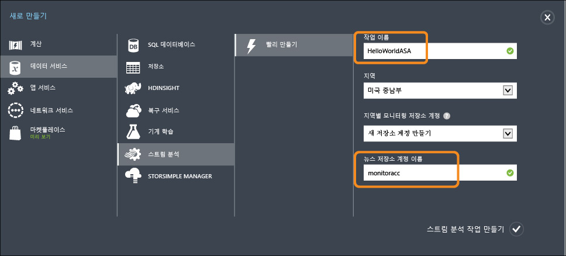
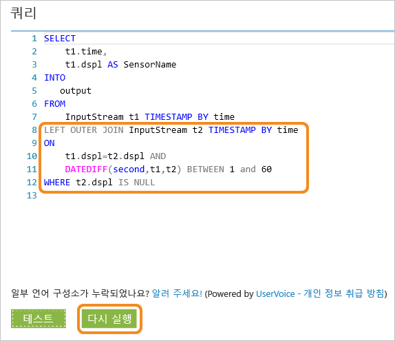
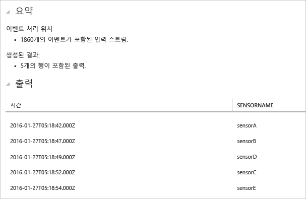

<properties
	pageTitle="IoT 장치에서 데이터를 처리하도록 Azure 스트림 분석 시작 | Stream Analytics"
	description="스트림 분석 및 실시간 데이터 처리와 IoT 센서 태그 및 데이터 스트림"
    keywords="IoT 솔루션, IoT 시작"
	services="stream-analytics"
	documentationCenter=""
	authors="jeffstokes72"
	manager="jhubbard"
	editor="cgronlun"
/>

<tags 
	ms.service="stream-analytics" 
	ms.devlang="na" 
	ms.topic="hero-article" 
	ms.tgt_pltfrm="na" 
	ms.workload="data-services" 
	ms.date="09/26/2016"
	ms.author="jeffstok"
/>

# IoT 장치에서 데이터를 처리하도록 Azure 스트림 분석 시작

이 자습서에서는 IoT(사물 인터넷) 장치에서 데이터를 수집하기 위한 스트림 처리 논리를 만드는 방법을 배웁니다. 실제, IoT(사물 인터넷) 사용 사례를 사용하여 솔루션을 신속하고 경제적으로 구축하는 방법을 보여 줍니다.

## 필수 조건

-   [Azure 구독](https://azure.microsoft.com/pricing/free-trial/)
-   샘플 쿼리 및 데이터 파일은 [GitHub](https://aka.ms/azure-stream-analytics-get-started-iot)에서 다운로드 가능

## 시나리오

Contoso는 산업용 자동화 공간의 회사로, 제조 프로세스를 완전히 자동화했습니다. 이 공장의 기계에는 실시간으로 데이터 스트림을 내보낼 수 있는 센서가 있습니다. 이 시나리오에서 생산 작업장 관리자는 센서 데이터로부터 실시간으로 정보를 얻어 패턴을 파악하고 조치를 취하고 싶어합니다. 센서 데이터에 대해 SAQL(스트림 분석 쿼리 언어)를 사용하여 들어오는 스트림 데이터를 통해 주목할 만한 패턴을 파악합니다.

여기서 데이터는 Texas Instrument 센서 태그 장치로부터 생성됩니다.

데이터의 페이로드는 JSON 형식이며 다음과 같습니다.

    
	{
    	"time": "2016-01-26T20:47:53.0000000",  
	    "dspl": "sensorE",  
    	"temp": 123,  
	    "hmdt": 34  
	}  
    
실제 시나리오에서는 이러한 센서가 수백 개 있으며 이벤트를 스트림으로 생성할 수 있습니다. 이상적으로 이러한 이벤트를 [Azure 이벤트 허브](https://azure.microsoft.com/services/event-hubs/) 또는 [Azure IoT Hub](https://azure.microsoft.com/services/iot-hub/)로 푸시하는 코드를 실행하는 게이트웨이 장치가 있을 것입니다. 스트림 분석 작업은 이벤트 허브에서 이러한 이벤트를 수집하고 스트림에 대해 실시간 분석 쿼리를 실행합니다. [지원되는 출력](stream-analytics-define-outputs.md) 중 하나에 결과를 보낼 수 있습니다.

편의를 위해 이 시작 가이드에서는 실제 SensorTag 장치에서 캡처한 샘플 데이터 파일을 제공하며 여기에서 다양한 쿼리를 실행하고 결과를 볼 수 있습니다. 이후 자습서에서는 작업을 입력 및 출력에 연결하고 이를 Azure 서비스에 배포하는 방법을 알아봅니다.

## 스트림 분석 작업 만들기

[Azure 포털](http://manage.windowsazure.com)에서 스트림 분석을 선택하고 페이지의 왼쪽 아래에 있는 **"새로 만들기"**를 클릭하여 새 분석 작업을 만듭니다.

"**빠른 생성**"을 클릭합니다.

**"지역별 모니터링 저장소 계정"** 설정에 대해 **"새 저장소 계정 만들기"**를 선택하고 고유한 이름을 지정합니다. Azure 스트림 분석은 이 계정을 사용하여 이후의 모든 작업에 대해 모니터링 정보를 저장합니다.

> [AZURE.NOTE] 이 저장소 계정은 하위 지역당 하나만 만들어야 하며 이 저장소는 해당 하위 지역에서 만든 모든 스트림 분석 작업에서 공유됩니다.

페이지 맨 아래에 "**스트림 분석 작업 만들기**"를 클릭합니다.

## Azure 스트림 분석 쿼리

쿼리 탭을 클릭하여 쿼리 편집기로 이동합니다. 쿼리 탭에는 들어오는 이벤트 데이터에 대해 변환을 수행하는 T-SQL 쿼리가 있습니다.

## 원시 데이터 보관

가장 간단한 형태의 쿼리는 모든 입력 데이터를 지정된 출력에 보관하는 통과 쿼리입니다.

이제 [GitHub](https://aka.ms/azure-stream-analytics-get-started-iot)에서 샘플 데이터 파일을 컴퓨터의 위치로 다운로드합니다. **PassThrough.txt** 파일에서 쿼리를 복사 및 붙여넣기합니다. 아래 테스트 단추를 클릭하고 다운로드한 위치에서 **HelloWorldASA-InputStream.json**이라는 이름의 데이터 파일을 선택합니다.

아래와 같이 브라우저에서 쿼리 결과를 볼 수 있습니다.

## 조건에 따라 데이터를 필터링합니다.

조건에 따라 결과를 필터링해 보겠습니다. "SensorA"에서 가져온 해당 이벤트에 대한 결과만 표시하려고 합니다. 쿼리는 **Filtering.txt** 파일에 있습니다.

여기서는 문자열 값과 대/소문자를 비교합니다. **다시 실행** 단추를 클릭하여 쿼리를 실행합니다. 쿼리는 1860개 이벤트 중 389행만 반환합니다.

## 비즈니스 워크플로 트리거 경고

이제 쿼리를 더 자세히 만들겠습니다. 모든 유형의 센서에 대해 30초 기간당 평균 온도를 모니터링하고 평균 온도가 100도를 초과하는 경우만 결과를 표시하려면 아래 쿼리를 작성한 후 **다시 실행**을 클릭하여 결과를 확인합니다. 쿼리는 **ThresholdAlerting.txt** 파일에 있습니다.

이제 결과에서 245행만 포함하고 평균 온도가 100도를 넘는 해당 센서를 나열하게 됩니다. 이 쿼리에서 이벤트 스트림을 센서 이름인 **dspl**과 30초 동안의 **연속 창**으로 그룹화했습니다. 이러한 임시 쿼리를 수행할 때는 진행할 시간을 명시하는 것이 중요합니다. **TIMESTAMP BY** 절을 사용하여 모든 임시 계산에 대한 시간 진행 방법을 나타내기 위해 "time" 열을 지정했습니다. 자세한 정보에는 MSDN 토픽 [시간 관리](https://msdn.microsoft.com/library/azure/mt582045.aspx) 및 [기간 이동 기능](https://msdn.microsoft.com/library/azure/dn835019.aspx)을 참조하세요.

## 이벤트의 부재 감지

이벤트의 부족을 찾기 위해 어떻게 쿼리를 작성할 수 있나요? 상당히 쉽습니다. 센서가 데이터를 전송한 다음 1분 동안 어떠한 이벤트도 보내지 않은 마지막 시간을 살펴보겠습니다. 쿼리는 **AbsenseOfEvent.txt** 파일에 있습니다.

여기서는 동일한 데이터 스트림에 대해 **LEFT OUTER JOIN**을 사용합니다(자체 조인). 내부 조인의 경우 결과는 일치 항목이 있는 경우에만 반환됩니다. 하지만 **LEFT OUTER** 조인의 경우 조인 왼쪽의 이벤트가 일치하지 않는 경우 오른쪽 행의 모든 열에 대해 NULL이 있는 행이 반환됩니다. 이 방법은 이벤트의 부재를 찾는 데 매우 유용합니다. [조인](https://msdn.microsoft.com/library/azure/dn835026.aspx)에 대한 자세한 내용은 MSDN 설명서를 참조하세요.

## 결론

이 자습서의 목적은 다른 스트림 분석 쿼리 언어 쿼리를 작성하고 브라우저에서 결과를 확인하는 방법을 보여 주는 것입니다. 그러나 이 과정은 시작일 뿐입니다. 스트림 분석으로 수행할 수 있는 작업은 훨씬 많습니다. 스트림 분석은 다양한 입력 및 출력을 지원하고 Azure 기계 학습에서 함수를 사용하여 데이터 스트림을 분석하는 강력한 도구로 만들 수 있습니다. [학습 맵](https://azure.microsoft.com/documentation/learning-paths/stream-analytics/)을 사용하여 스트림 분석에 대해 보다 자세히 알아보고 쿼리 작성에 대한 자세한 내용은 [일반적인 쿼리 패턴](./stream-analytics-stream-analytics-query-patterns.md)에 대한 문서를 참고합니다.

<!---HONumber=AcomDC_0928_2016-->