# <a name="get-started-with-azure-stream-analytics-to-process-data-from-iot-devices"></a>IoT 디바이스에서 데이터를 처리하도록 Azure Stream Analytics 시작
이 자습서에서는 IoT(사물 인터넷) 디바이스에서 데이터를 수집하기 위한 스트림 처리 논리를 만드는 방법을 배웁니다. 실제, IoT(사물 인터넷) 사용 사례를 사용하여 솔루션을 신속하고 경제적으로 구축하는 방법을 보여 줍니다.

## <a name="prerequisites"></a>필수 조건
* [Azure 구독](https://azure.microsoft.com/pricing/free-trial/)
* 샘플 쿼리 및 데이터 파일은 [GitHub](https://aka.ms/azure-stream-analytics-get-started-iot)

## <a name="scenario"></a>시나리오
Contoso는 산업용 자동화 공간의 회사로, 제조 프로세스를 완전히 자동화했습니다. 이 공장의 기계에는 실시간으로 데이터 스트림을 내보낼 수 있는 센서가 있습니다. 이 시나리오에서 생산 작업장 관리자는 센서 데이터로부터 실시간으로 정보를 얻어 패턴을 파악하고 조치를 취하고 싶어합니다. 센서 데이터에 대해 SAQL(Stream Analytics 쿼리 언어)를 사용하여 들어오는 스트림 데이터에서 주목할 만한 패턴을 파악합니다.

여기서 데이터는 Texas Instrument 센서 태그 디바이스에서 생성됩니다. 데이터의 페이로드는 JSON 형식이며 다음과 같습니다.

```json
{
    "time": "2016-01-26T20:47:53.0000000",  
    "dspl": "sensorE",  
    "temp": 123,  
    "hmdt": 34  
}  
```

실제 시나리오에서는 이러한 센서가 수백 개 있으며 이벤트를 스트림으로 생성할 수 있습니다. 이상적으로 게이트웨이 디바이스는 이러한 이벤트를 [Azure Event Hubs](https://azure.microsoft.com/services/event-hubs/) 또는 [Azure IoT Hubs](https://azure.microsoft.com/services/iot-hub/)로 푸시하는 코드를 실행합니다. Stream Analytics 작업은 Event Hubs에서 이러한 이벤트를 수집하고 스트림에 대해 실시간 분석 쿼리를 실행합니다. [지원되는 출력](stream-analytics-define-outputs.md) 중 하나에 결과를 보낼 수 있습니다.

사용 편의성을 위해 이 시작 가이드는 실제 센서 태그 디바이스에서 캡처된 샘플 데이터 파일을 제공합니다. 샘플 데이터에서 쿼리를 실행하고 결과를 볼 수 있습니다. 이후 자습서에서는 작업을 입력 및 출력에 연결하고 이를 Azure 서비스에 배포하는 방법을 알아봅니다.

## <a name="create-a-stream-analytics-job"></a>Stream Analytics 작업 만들기
1. [Azure 포털](https://portal.azure.com)에서 더하기 기호를 클릭한 다음 오른쪽에 있는 텍스트 창에서 **Stream Analytics**을 입력합니다. 그런 다음 결과 목록에서 **Stream Analytics 작업**을 선택합니다.
   
    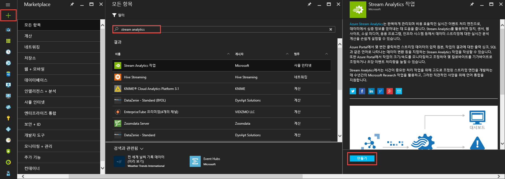
2. 고유한 작업 이름을 입력하고 해당 작업에 대한 구독이 유효한지 확인합니다. 그런 다음 새 리소스 그룹을 만들거나 구독에 속한 기존 리소스 그룹을 선택합니다.
3. 작업의 위치를 선택합니다. 데이터 전송의 처리 속도와 비용 감소를 위해 리소스 그룹 및 의도한 저장소 계정으로 동일한 위치를 선택하는 것이 좋습니다.
   
    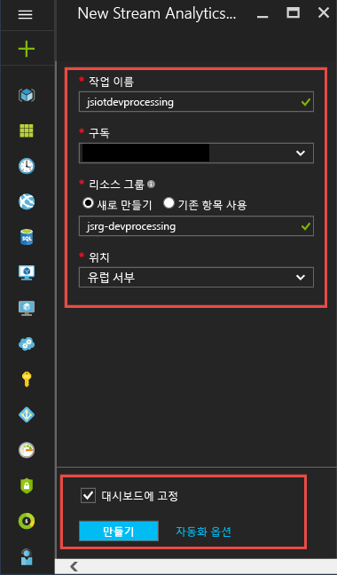
   
   > [!NOTE]
   > 이 저장소 계정은 지역당 한 번만 만들어야 합니다. 이 저장소는 해당 지역에 생성되는 모든 Stream Analytics 작업에서 공유됩니다.
   > 
   > 
4. 대시보드에서 작업을 배치할 확인란을 선택한 다음 **만들기**를 클릭합니다.
   
    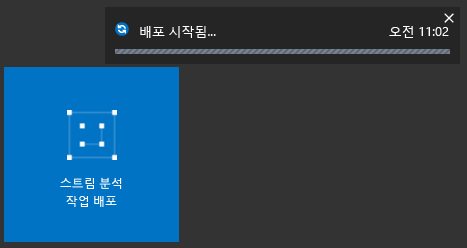
5. 브라우저 창의 오른쪽 위에서 '배포를 시작했습니다.'라고 표시됩니다. 그리고는 곧 아래와 같이 완료된 창으로 바뀝니다.
   
    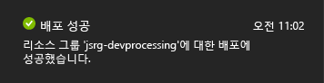

## <a name="create-an-azure-stream-analytics-query"></a>Azure Stream Analytics 쿼리 만들기
작업이 만들어졌으면 이제는 해당 작업을 열고 쿼리를 빌드할 시간입니다. 작업의 타일을 클릭하면 해당 작업에 쉽게 액세스할 수 있습니다.

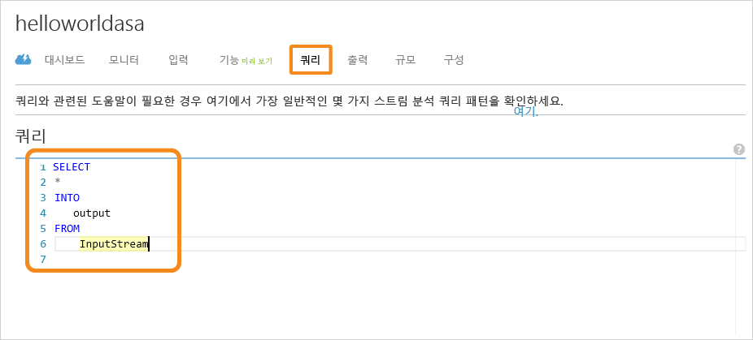

**작업 토폴로지** 창에서 **쿼리** 상자를 클릭하여 쿼리 편집기로 이동합니다. **쿼리** 편집기에서는 들어오는 이벤트 데이터에 대해 변환을 수행하는 T-SQL 쿼리를 입력할 수 있습니다.

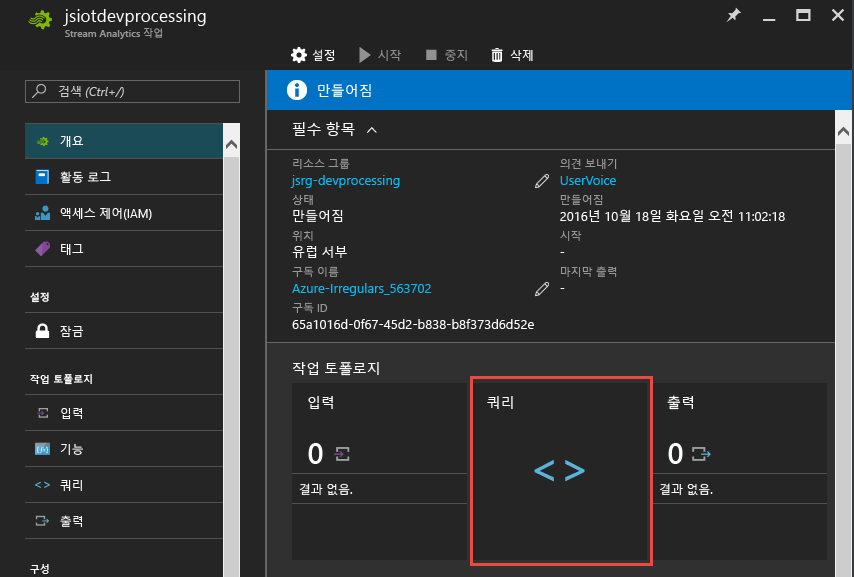

### <a name="query-archive-your-raw-data"></a>쿼리: 원시 데이터 보관
가장 간단한 형태의 쿼리는 모든 입력 데이터를 지정된 출력에 보관하는 통과 쿼리입니다. [GitHub](https://aka.ms/azure-stream-analytics-get-started-iot)에서 컴퓨터의 위치로 샘플 데이터 파일을 다운로드합니다. 

1. PassThrough.txt 파일에서 쿼리를 붙여 넣습니다. 
   
    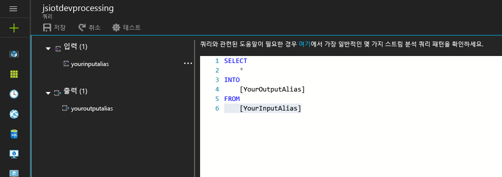
2. 사용자의 입력 옆에 있는 점 세 개를 클릭하고 **파일에서 샘플 데이터 업로드** 상자를 선택합니다.
   
    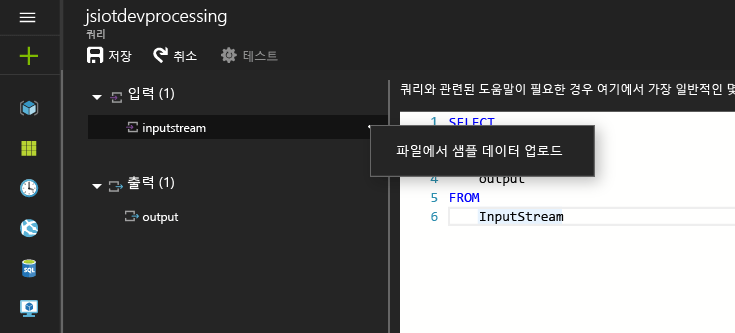
3. 오른쪽에 열리는 결과 창에서 다운로드 위치에 있는 HelloWorldASA InputStream.json 데이터 파일을 선택하고 창 맨 아래의 **확인**을 클릭합니다.
   
    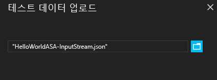
4. 그런 다음, 창의 왼쪽 위에 있는 **테스트** 기어를 클릭하여 샘플 데이터 세트에 대한 테스트 쿼리를 처리합니다. 처리가 완료되면 쿼리 아래에 결과 창이 열립니다.
   
    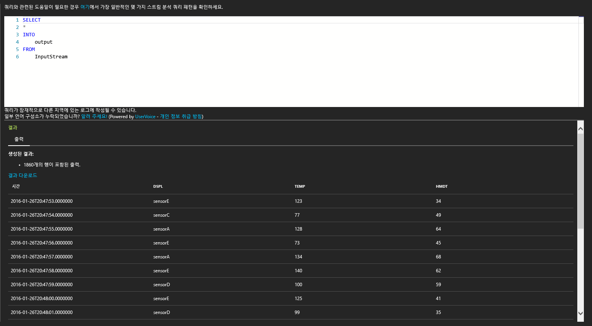

### <a name="query-filter-the-data-based-on-a-condition"></a>쿼리: 조건에 따라 데이터 필터링
조건에 따라 결과를 필터링해 보겠습니다. “sensorA”에서 가져온 해당 이벤트에 대한 결과만 표시하려고 합니다. 쿼리는 Filtering.txt 파일에 있습니다.

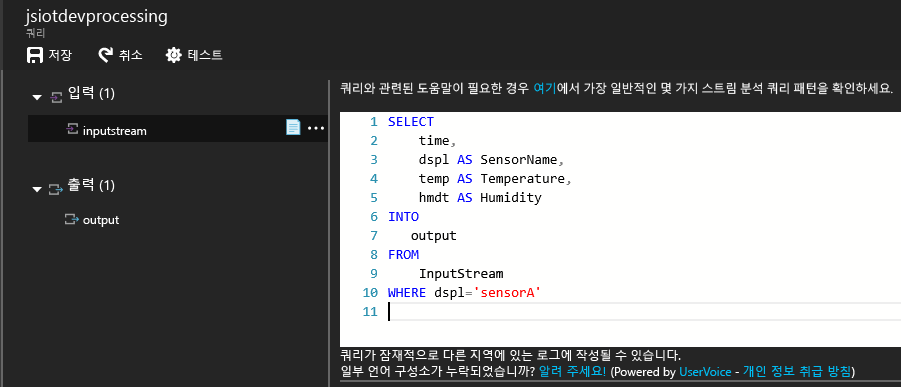

대/소문자를 구분하는 쿼리는 문자열 값을 비교합니다. **테스트** 기어를 다시 클릭하여 쿼리를 실행합니다. 쿼리는 1860개 이벤트 중 389행만 반환해야 합니다.

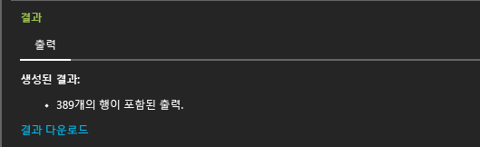

### <a name="query-alert-to-trigger-a-business-workflow"></a>쿼리: 비즈니스 워크플로를 트리거하는 경고
쿼리를 더 자세히 만들겠습니다. 모든 유형의 센서에 대해 30초 기간당 평균 온도를 모니터링하고 평균 온도가 100도를 초과하는 경우만 결과를 표시하려고 합니다. 다음 쿼리를 작성한 후 **테스트**를 클릭하여 결과를 확인합니다. 쿼리는 ThresholdAlerting.txt 파일에 있습니다.

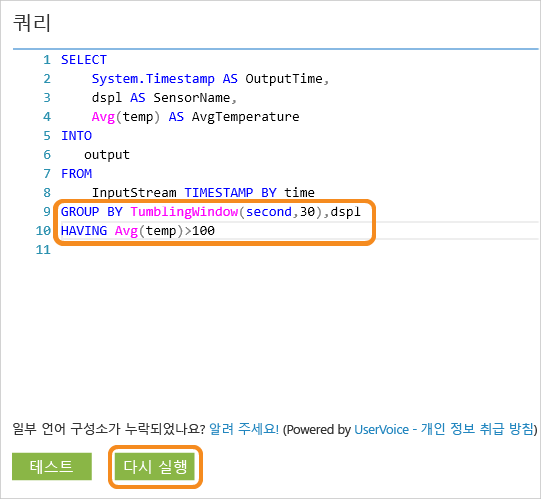

이제 결과에서 245행 및 평균 온도가 100도를 넘는 센서의 이름을 표시해야 합니다. 이 쿼리는 이벤트의 스트림을 30초 동안의 **연속 창**에서 센서 이름인 **dspl**로 그룹화합니다. 임시 쿼리는 시간을 진행할 방법을 명시해야 합니다. **TIMESTAMP BY** 절을 사용하여 모든 임시 계산과 시간을 연결하는 **OUTPUTTIME** 열을 지정했습니다. 자세한 정보는 [시간 관리](https://msdn.microsoft.com/library/azure/mt582045.aspx) 및 [기간 이동 기능](https://msdn.microsoft.com/library/azure/dn835019.aspx)에 대한 MSDN 문서를 참조하세요.

### <a name="query-detect-absence-of-events"></a>쿼리: 이벤트의 부재 감지
이벤트의 부족을 찾기 위해 어떻게 쿼리를 작성할 수 있나요? 센서에서 데이터를 보낸 이후 5초 동안 이벤트를 보내지 않은 마지막 시간을 알아보겠습니다. 쿼리는 AbsenceOfEvent.txt 파일에 있습니다.


여기서는 동일한 데이터 스트림에 대해 **왼쪽 외부** 조인을 사용합니다(자체 조인). **내부** 조인의 경우 결과는 일치 항목이 있는 경우에만 반환됩니다.  하지만 **왼쪽 외부** 조인의 경우 조인 왼쪽의 이벤트가 일치하지 않는 경우 오른쪽 행의 모든 열에 대해 NULL이 있는 행이 반환됩니다. 이 방법은 이벤트의 부재를 찾는 데 매우 유용합니다. [조인](https://msdn.microsoft.com/library/azure/dn835026.aspx)에 대한 자세한 내용은 MSDN 설명서를 참조하세요.

## <a name="conclusion"></a>결론
이 자습서의 목적은 다른 Stream Analytics 쿼리 언어 쿼리를 작성하고 브라우저에서 결과를 확인하는 방법을 보여 주는 것입니다. 그러나 이 과정은 시작일 뿐입니다. Stream Analytics으로 많은 작업을 수행할 수 있습니다. Stream Analytics은 다양한 입력 및 출력을 지원하고 Azure Machine Learning에서 함수를 사용하여 데이터 스트림을 분석하는 강력한 도구로 만들 수 있습니다. [학습 맵](https://docs.microsoft.com/azure/stream-analytics/)을 사용하여 Stream Analytics에 대한 탐색을 시작할 수 있습니다. 쿼리를 작성하는 방법에 대한 자세한 내용은 [일반적인 쿼리 패턴](stream-analytics-stream-analytics-query-patterns.md)에 대한 문서를 참조하세요.

