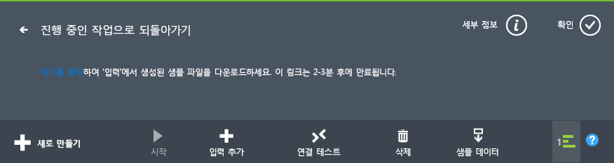
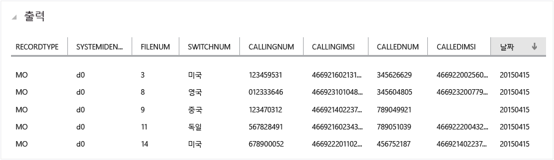
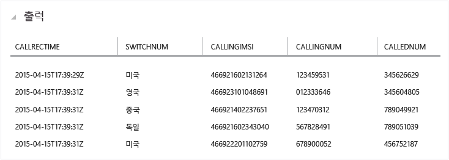
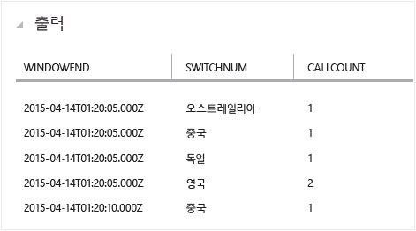
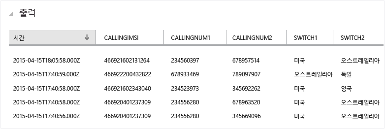
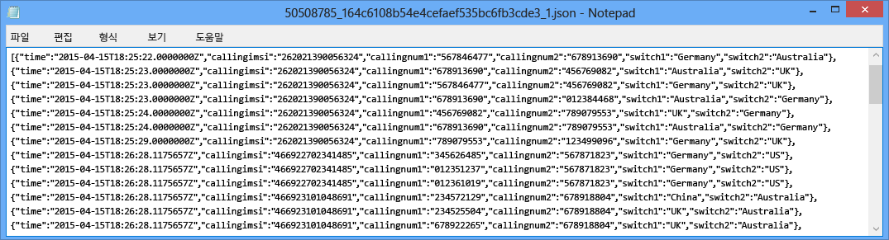

<properties
	pageTitle="Azure 스트림 분석 사용 시작 : 실시간 부정 행위 감지 | Microsoft Azure"
	description="스트림 분석으로 실시간 부정 행위 감지 솔루션을 만드는 방법에 대해 알아봅니다. 이벤트 허브를 사용하여 실시간 이벤트를 처리합니다."
	keywords="이상 감지, 부정 행위 감지, 실시간 이상 감지"
	services="stream-analytics"
	documentationCenter=""
	authors="jeffstokes72"
	manager="jhubbard"
	editor="cgronlun" />

<tags
	ms.service="stream-analytics"
	ms.devlang="na"
	ms.topic="article"
	ms.tgt_pltfrm="na"
	ms.workload="data-services"
	ms.date="07/27/2016"
	ms.author="jeffstok" />

# Azure 스트림 분석 사용 시작 : 실시간 부정 행위 감지

Azure 스트림 분석으로 실시간 부정 행위 검색에 대한 종단간 솔루션을 만드는 방법에 대해 알아봅니다. Azure 이벤트 허브로 이벤트를 가져와서 집계 및 경고에 대한 스트림 분석 쿼리를 작성한 다음 출력 싱크로 결과를 보내 실시간 처리로 데이터에 대한 정보를 파악합니다. 통신에 대한 실시간 이상 감지를 다루고 있지만 예제 기술은 신용 카드 또는 ID 도용 시나리오 같은 다른 유형의 부정 행위 감지에도 똑같이 적합합니다.

스트림 분석은 완전히 관리되는 서비스로, 클라우드의 스트리밍 데이터에 대해 대기 시간이 짧고 확장성이 뛰어난 고가용성의 복합 이벤트 처리 기능을 제공합니다. 자세한 내용은 [Azure 스트림 분석 소개](stream-analytics-introduction.md)를 참조하세요.

## 시나리오: 실시간으로 통신 및 SIM 사기 감지

통신 회사에는 많은 양의 들어오는 호출 데이터가 있습니다. 회사는 데이터에 다음과 같은 사항이 필요합니다.
* 이 데이터를 관리하기 쉬운 양으로 줄이고 시간 및 지리적 지역에 따른 고객 사용량에 대한 정보를 파악하고자 합니다.
* 실시간으로 SIM 사기(지역적으로 다른 위치에 있지만 동일한 시간대에 동일한 ID에서 발생한 다중 호출)를 감지하여 고객에게 알리거나 서비스를 중단하여 쉽게 대응할 수 있도록 해야 합니다.

정식 IoT(사물 인터넷) 시나리오에는 생성되고 있는 원격 분석 또는 센서 데이터가 엄청나게 많이 있으며 고객들은 이를 집계하거나 이상 활동에 대해 실시간으로 경고하기를 원합니다.

## 필수 조건

- Microsoft 다운로드 센터에서 [TelcoGenerator.zip](http://download.microsoft.com/download/8/B/D/8BD50991-8D54-4F59-AB83-3354B69C8A7E/TelcoGenerator.zip)을 다운로드합니다.
- 선택 사항: [GitHub](https://github.com/Azure/azure-stream-analytics/tree/master/DataGenerators/TelcoGenerator)에서 가져온 이벤트 생성기 소스 코드

## Azure 이벤트 허브 입력 및 소비자 그룹 만들기

샘플 응용 프로그램은 실시간 처리에 대해 이벤트를 생성하여 이벤트 허브 인스턴스에 푸시합니다. 서비스 버스 이벤트 허브는 스트림 분석에 대한 이벤트 수집에 있어 선호하는 방법이며 [Azure 서비스 버스 설명서](/documentation/services/service-bus/)에서 이벤트 허브에 대한 자세한 내용을 알아볼 수 있습니다.

이벤트 허브를 만들려면:

1.	[Azure 포털](https://manage.windowsazure.com/)에서 **새로 만들기** > **앱 서비스** > **서비스 버스** > **이벤트 허브** > **빠른 생성**을 차례대로 클릭합니다. 이름, 지역 및 기존 또는 새 네임스페이스를 제공하여 새 이벤트 허브를 만듭니다.
2.	각 스트림 분석 작업이 단일 이벤트 허브 소비자 그룹에서 읽는 것이 가장 좋습니다. 아래에서 소비자 그룹을 만드는 프로세스를 안내하고자 합니다. [소비자 그룹에 대해 자세히 알아볼](https://msdn.microsoft.com/library/azure/dn836025.aspx) 수 있습니다. 소비자 그룹을 만들려면 새로 만든 이벤트 허브로 이동하여 **소비자 그룹** 탭을 클릭한 다음 페이지 아래쪽에서 **만들기**를 클릭하고 소비자 그룹의 이름을 입력합니다.
3.	이벤트 허브에 대한 액세스 권한을 부여하려면 공유 액세스 정책을 만들어야 합니다. 이벤트 허브의 **구성** 탭을 클릭합니다.
4.	**공유 액세스 정책**에서 **관리** 권한을 사용하여 새 정책을 만듭니다.

	

5.	페이지 맨 아래에서 **저장**을 클릭합니다.
6.	**대시보드**로 이동하여 페이지 아래쪽에서 **연결 정보**를 클릭한 다음 연결 정보를 복사 및 저장합니다.

## 이벤트 생성기 응용 프로그램 구성 및 시작

들어오는 호출 메타데이터의 샘플을 생성하고 이를 이벤트 허브에 푸시하는 클라이언트 응용 프로그램을 제공했습니다. 이 응용 프로그램을 설치하려면 아래 단계를 따릅니다.

1.	[TelcoGenerator.zip 파일](http://download.microsoft.com/download/8/B/D/8BD50991-8D54-4F59-AB83-3354B69C8A7E/TelcoGenerator.zip)을 다운로드합니다. 그런 다음 디렉터리에 압축을 풉니다.

    **참고**: Windows는 다운로드한 zip 파일을 차단할 수 있습니다. 파일을 마우스 오른쪽 단추로 클릭하고 속성을 선택합니다. "이 파일은 다른 컴퓨터로부터 왔으며 사용자의 컴퓨터를 보호하기 위해 차단되었을 수도 있습니다."라는 메시지가 표시되면 "차단 해제" 상자를 선택하여 압축 파일에 대해 적용을 클릭합니다.

2.	**telcodatagen.exe.config**에서 Microsoft.ServiceBus.ConnectionString 및 EventHubName 값을 이벤트 허브 연결 문자열 및 이름으로 바꿉니다.

    **참고**: Azure 포털에서 복사한 연결 문자열을 끝에 있는 연결 이름에 넣습니다. add key= 필드에서 ";EntityPath=<value>"를 제거해야 합니다.

3.	응용 프로그램을 시작합니다. 사용법은 다음과 같습니다.

   telcodatagen.exe [#NumCDRsPerHour] [SIM Card Fraud Probability] [#DurationHours]

다음 예에서는 2시간에 걸쳐 사기 확률이 20%인 1000개의 이벤트를 생성합니다.

    telcodatagen.exe 1000 .2 2

이벤트 허브에 전송되는 레코드를 볼 수 있습니다. 이 실시간 사기 감지 응용 프로그램에서 사용할 수 있는 일부 키 필드를 여기에서 정의합니다.

| 레코드 | 정의 |
| ------------- | ------------- |
| CallrecTime | 호출 시작 시간에 대한 타임스탬프 |
| SwitchNum | 호출 연결에 사용되는 전화 스위치 |
| CallingNum | 호출자의 전화번호 |
| CallingIMSI | 국제 모바일 구독자 ID(IMSI) 호출자의 고유 식별자 |
| CalledNum | 호출 수신자의 전화번호 |
| CalledIMSI | 국제 모바일 구독자 ID(IMSI) 호출 수신자의 고유 식별자 |

## 스트림 분석 작업 만들기
이제 통신 이벤트 스트림을 만들었으므로 이러한 이벤트를 실시간으로 분석하도록 스트림 분석 작업을 설정할 수 있습니다.

### 스트림 분석 작업 프로비전

1.	Azure 포털에서 **새로 만들기 > 데이터 서비스 > 스트림 분석 > 빠른 생성**을 클릭합니다.
2.	다음 값을 지정하고 **스트림 분석 작업 만들기**를 클릭합니다.

	* **작업 이름**: 작업 이름을 입력합니다.

	* **지역**: 작업을 실행할 지역을 선택합니다. 더 나은 성능을 보장하고 비용 부담 없이 지역 간에 데이터를 전송하려면 동일한 지역에 작업 및 이벤트 허브를 배치하는 것이 좋습니다.

	* **저장소 계정**: 이 지역 내에서 실행되는 모든 스트림 분석 작업에 대한 모니터링 데이터를 저장하는 데 사용하려는 Azure 저장소 계정을 선택합니다. 기존 저장소 계정을 선택하거나 새 계정을 만들 수 있습니다.

3.	왼쪽 창에서 **스트림 분석**을 클릭하여 스트림 분석 작업을 표시합니다.

	

4.	새 작업이 **생성됨** 상태로 표시됩니다. 페이지 맨 아래의 **시작** 단추가 비활성화됩니다. 작업을 시작하려면 먼저 작업 입력, 출력 및 쿼리를 구성해야 합니다.

### 작업 입력 지정
1.	스트림 분석 작업의 페이지 위쪽에서 **입력**을 클릭하고 **입력 추가**를 클릭합니다. 열리는 대화 상자에서 다양한 단계를 진행하면서 입력을 설정하게 됩니다.
2.	**데이터 스트림**을 선택한 다음 오른쪽 단추를 클릭합니다.
3.	**이벤트 허브**를 선택한 다음 오른쪽 단추를 클릭합니다.
4.	세 번째 페이지에서 다음 값을 입력하거나 선택합니다.

	* **입력 별칭** - 이 작업 입력의 이름(예: *CallStream*)을 입력합니다. 이 이름은 나중에 쿼리에서 사용하게 됩니다.
	* **이벤트 허브**: 만든 이벤트 허브가 스트림 분석 작업과 동일한 구독에 포함된 경우 이벤트 허브가 있는 네임스페이스를 선택합니다.

	이벤트 허브가 다른 구독에 있으면 **다른 구독의 이벤트 허브 사용**을 선택하고 **서비스 버스 네임스페이스**, **이벤트 허브 이름**, **이벤트 허브 정책 이름**, **이벤트 허브 정책 키** 및 **이벤트 허브 하티션 수**에 대한 정보를 수동으로 입력합니다.

	* **이벤트 허브 이름**: 이벤트 허브의 이름을 선택합니다.

	* **이벤트 허브 정책 이름**: 이 자습서의 앞부분에서 만든 이벤트 허브 정책을 선택합니다.

	* **이벤트 허브 소비자 그룹**: 이 자습서의 앞부분에서 만든 소비자 그룹을 입력합니다.
5.	오른쪽 단추를 클릭합니다.
6.	다음 값을 지정합니다.

	* **이벤트 직렬 변환기 형식**: JSON
	* **인코딩**: UTF8
7.	확인 단추를 클릭하여 이 소스를 추가하고 스트림 분석이 이벤트 허브에 성공적으로 연결될 수 있는지 확인합니다.

### 작업 쿼리 지정

스트림 분석은 실시간 처리에 대해 변환을 설명하는 간단하고 선언적인 쿼리 모델을 지원합니다. 이 언어에 대한 자세한 내용은 [Azure 스트림 분석 쿼리 언어 참조](https://msdn.microsoft.com/library/dn834998.aspx)를 참조하세요. 이 자습서에서는 호출 데이터의 실시간 스트림에 대해 여러 쿼리를 작성하고 테스트하도록 도와줍니다.

#### 선택 사항: 샘플 입력 데이터
실제 작업 데이터에 대해 쿼리 유효성을 검사하기 위해 **샘플 데이터** 기능을 사용하여 스트림에서 이벤트를 추출하고 테스트할 이벤트의 .JSON 파일을 만들 수 있습니다. 다음 단계에서는 이 작업을 수행하는 방법을 보여 주며 테스트 목적으로 샘플 [telco.json](https://github.com/Azure/azure-stream-analytics/blob/master/Sample%20Data/telco.json) 파일을 제공합니다.

1.	이벤트 허브 입력을 선택하고 페이지 아래쪽에서 **샘플 데이터**를 클릭합니다.
2.	대화 상자가 표시되면 데이터 수집을 시작할 **시작 시간** 및 소비할 추가 데이터의 양에 대한 **기간**을 지정합니다.
3.	입력에서 샘플링 데이터를 시작하려면 확인 단추를 클릭합니다. 데이터 파일 생성에 1~2분 정도 소요될 수 있습니다. 프로세스가 완료되면 **세부 정보**를 클릭하고 생성된 .JSON 파일을 다운로드하여 저장합니다.

	

#### 통과 쿼리

모든 이벤트를 보관하려는 경우 통과 쿼리를 사용하여 이벤트 또는 메시지의 페이로드에서 모든 필드를 읽을 수 있습니다. 먼저 이벤트의 모든 필드를 프로젝션하는 간단한 통과 쿼리를 수행합니다.

1.	스트림 분석 작업 페이지의 위쪽에서 **쿼리**를 클릭합니다.
2.	코드 편집기에 다음을 추가합니다.

		SELECT * FROM CallStream

	> 입력 소스의 이름이 앞에서 지정한 입력의 이름과 일치하는지 확인합니다.

3.	쿼리 편집기에서 **테스트**를 클릭합니다.
4.	이전 단계 또는 [telco.json](https://github.com/Azure/azure-stream-analytics/blob/master/Sample%20Data/telco.json)을 사용하여 만든 테스트 파일을 제공합니다.
5.	확인 단추를 클릭하고 쿼리 정의 아래에 표시되는 결과를 확인합니다.

	

### 열 프로젝션

이제 더 작은 집합으로 반환되는 필드를 줄입니다.

1.	코드 편집기에서 쿼리를 다음으로 변경합니다.

		SELECT CallRecTime, SwitchNum, CallingIMSI, CallingNum, CalledNum
		FROM CallStream

2.	쿼리 편집기에서 **다시 실행**을 클릭하여 쿼리 결과를 확인합니다.

	

### 지역별로 들어오는 호출 수: 집계를 포함하는 연속 창

지역당 들어오는 호출의 양을 비교하려면 [TumblingWindow](https://msdn.microsoft.com/library/azure/dn835055.aspx)를 활용하여 5초마다 SwitchNum으로 그룹화된 들어오는 호출의 수를 가져옵니다.

1.	코드 편집기에서 쿼리를 다음으로 변경합니다.

		SELECT System.Timestamp as WindowEnd, SwitchNum, COUNT(*) as CallCount
		FROM CallStream TIMESTAMP BY CallRecTime
		GROUP BY TUMBLINGWINDOW(s, 5), SwitchNum

	이 쿼리에서는 **TIMESTAMP BY** 키워드를 사용하여 임시 계산에서 사용할 페이로드에 타임스탬프 필드를 지정합니다. 이 필드를 지정하지 않으면 각 이벤트가 이벤트 허브에 도착한 시간을 사용하여 창 작업이 수행됩니다. [스트림 분석 쿼리 참조에서 “도착 시간과 응용 프로그램 시간”](https://msdn.microsoft.com/library/azure/dn834998.aspx)을 참조하세요.

	**System.Timestamp** 속성을 사용하여 각 창 끝부분의 타임스탬프에 액세스할 수 있습니다.

2.	쿼리 편집기에서 **다시 실행**을 클릭하여 쿼리 결과를 확인합니다.

	

### 자체 조인과 함께 SIM 부정 행위 감지

잠재적인 사기성 사용을 식별하려면 5초 미만 동안 동일한 사용자로부터 발생했지만 다른 지역에서 발생한 호출을 조회합니다. 이러한 경우 직접 확인하기 위해 호출 이벤트 스트림에 [조인](https://msdn.microsoft.com/library/azure/dn835026.aspx)합니다.

1.	코드 편집기에서 쿼리를 다음으로 변경합니다.

		SELECT System.Timestamp as Time, CS1.CallingIMSI, CS1.CallingNum as CallingNum1,
		CS2.CallingNum as CallingNum2, CS1.SwitchNum as Switch1, CS2.SwitchNum as Switch2
		FROM CallStream CS1 TIMESTAMP BY CallRecTime
		JOIN CallStream CS2 TIMESTAMP BY CallRecTime
		ON CS1.CallingIMSI = CS2.CallingIMSI
		AND DATEDIFF(ss, CS1, CS2) BETWEEN 1 AND 5
		WHERE CS1.SwitchNum != CS2.SwitchNum

2.	쿼리 편집기에서 **다시 실행**을 클릭하여 쿼리 결과를 확인합니다.

	

### 출력 싱크 만들기

이제 이벤트 스트림, 이벤트를 수집할 이벤트 허브 입력 및 스트림 변환을 수행할 쿼리를 정의했으므로 마지막 단계는 작업의 출력 싱크를 정의하는 것입니다. Blob 저장소에 사기 행위에 대한 이벤트를 작성합니다.

Blob 저장소의 컨테이너가 없는 경우 아래 단계에 따라 만듭니다.

1.	기존 저장소 계정을 사용하거나, **새로 만들기 > 데이터 서비스 > 저장소 > 빠른 생성**을 클릭하고 화면의 지침에 따라 새 저장소 계정을 만듭니다.
2.	저장소 계정을 선택하고 페이지 위쪽에서 **컨테이너**를 클릭한 다음 **추가**를 클릭합니다.
3.	컨테이너 **이름**을 지정하고 해당 **액세스**를 공용 Blob으로 설정합니다.

## 작업 출력 지정

1.	스트림 분석 작업에서 페이지 위쪽의 **출력**을 클릭한 다음 **출력 추가**를 클릭합니다. 열리는 대화 상자에서 다양한 단계를 진행하면서 출력을 설정하게 됩니다.
2.	**Blob 저장소**를 선택하고 오른쪽 단추를 클릭합니다.
3.	세 번째 페이지에서 다음 값을 입력하거나 선택합니다.

	* **출력 별칭** : 이 작업 출력의 이름을 입력합니다.
	* **구독**: 만든 Blob 저장소가 스트림 분석 작업과 동일한 구독에 있으면 **현재 구독에서 저장소 계정 사용**을 선택합니다. 저장소가 다른 구독에 있으면 **다른 구독에서 저장소 계정 사용**을 선택하고 **저장소 계정**, **저장소 계정 키**, **컨테이너**에 대한 정보를 직접 입력합니다.
	* **저장소 계정**: 저장소 계정의 이름을 선택합니다.
	* **컨테이너**: 컨테이너의 이름을 선택합니다.
	* **파일 이름 접두사**: Blob 출력을 작성할 때 사용할 파일 접두사를 입력합니다.

4.	오른쪽 단추를 클릭합니다.
5.	다음 값을 지정합니다.

	* **이벤트 직렬 변환기 형식**: JSON
	* **인코딩**: UTF8

6.	확인 단추를 클릭하여 이 소스를 추가하고 스트림 분석이 저장소 계정에 성공적으로 연결될 수 있는지 확인합니다.

## 실시간 처리에 대한 작업 시작

작업 입력, 쿼리 및 출력을 모두 지정했으므로 이제 실시간 사기 감지에 대한 스트림 분석 작업을 시작할 준비가 완료되었습니다.

1.	작업 **대시보드**의 페이지 아래쪽에서 **시작**을 클릭합니다.
2.	대화 상자가 표시되면 **작업 시작 시간**을 선택하고 대화 상자 아래쪽에 있는 확인 단추를 클릭합니다. 작업 상태가 **시작 중**으로 변경되었다가 곧 **실행 중**으로 변경됩니다.

## 사기 감지 출력 보기

[Azure 저장소 탐색기](https://azurestorageexplorer.codeplex.com/) 또는 [Azure 탐색기](http://www.cerebrata.com/products/azure-explorer/introduction)와 같은 도구를 사용하여 출력에 작성되는 대로 사기성 이벤트를 실시간으로 볼 수 있습니다.

## 지원 받기
추가 지원이 필요한 경우 [Azure 스트림 분석 포럼](https://social.msdn.microsoft.com/Forums/ko-KR/home?forum=AzureStreamAnalytics)을 참조하세요.

## 다음 단계

- [Azure 스트림 분석 소개](stream-analytics-introduction.md)
- [Azure 스트림 분석 사용 시작](stream-analytics-get-started.md)
- [Azure 스트림 분석 작업 규모 지정](stream-analytics-scale-jobs.md)
- [Azure 스트림 분석 쿼리 언어 참조](https://msdn.microsoft.com/library/azure/dn834998.aspx)
- [Azure 스트림 분석 관리 REST API 참조](https://msdn.microsoft.com/library/azure/dn835031.aspx)

<!---HONumber=AcomDC_0921_2016-->