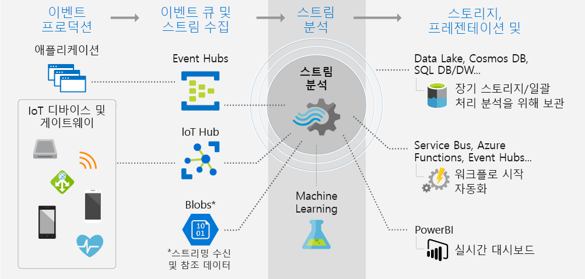

# Azure Stream Analytics란?

Azure Stream Analytics는 대량의 스트리밍 데이터를 검사하도록 설계된 이벤트 처리 엔진입니다. 패턴과 관계는 디바이스, 센서, 웹 사이트, 소셜 미디어 피드 및 애플리케이션을 포함한 여러 입력 원본에서 추출한 정보에서 식별할 수 있습니다. 이러한 패턴을 사용하여 경고를 만들거나, 보고 도구에 정보를 공급하거나, 나중에 사용할 수 있도록 변환된 데이터를 저장하는 등의 다른 작업 다운스트림을 트리거할 수 있습니다.

다음 시나리오는 Azure Stream Analytics를 사용할 수 있는 경우의 예입니다.

* IoT(사물 인터넷) 센서 융합 및 디바이스 원격 분석에 대한 실시간 분석
* 웹 로그/클릭 스트림 분석
* fleet 관리 및 드라이버가 없는 자동차에 대한 지리 공간적 분석
* 원격 모니터링 및 높은 가치 자산의 예측 유지 관리
* 인벤토리 제어 및 변칙 검색에 대한 판매 시점 데이터에 대한 실시간 분석

## Stream Analytics는 어떻게 작동합니까?

Azure Stream Analytics 작업은 입력, 변환 쿼리 및 출력으로 구성됩니다. Azure Event Hubs, Azure IoT Hub 또는 Azure Blob Storage에서 소프트웨어 또는 디바이스의 이벤트를 수집하는 경우 이러한 서비스 중 하나 이상을 작업에 대한 입력 원본으로 지정할 수 있습니다. SQL 쿼리 언어를 기반으로 하는 변환 쿼리는 일정 기간 동안 스트리밍 데이터를 쉽게 필터링, 정렬, 집계 및 조인하는 데 사용됩니다. 집계 작업을 수행할 때 이벤트 순서 지정 옵션 및 시간 범위 기간을 조정할 수 있습니다.

각 작업에는 변환된 데이터에 대한 출력이 있으며, 분석한 정보에 대한 응답으로 수행되는 작업을 제어 할 수 있습니다. 예를 들어 다음을 수행할 수 있습니다.

* 모니터링되는 큐에 데이터를 보내 경고 또는 사용자 지정 워크플로 다운스트림을 트리거합니다.
* 실시간 시각화를 위해 데이터를 Power BI 대시보드에 보냅니다.
* 기록 데이터를 기반으로 하여 기계 학습 모델을 학습시키거나 일괄 처리 분석을 수행할 수 있도록 데이터를 다른 Azure 스토리지 서비스에 저장합니다.

다음 이미지에서는 데이터를 Stream Analytics에 보내고, 스토리지 또는 프레젠테이션과 같은 다른 작업을 위해 분석하고 보내는 방법을 보여 줍니다.

## 주요 기능 및 이점

Azure Stream Analytics는 사용하기 쉽고 유연하며 안정적이고 작업의 규모에 맞게 확장 가능하도록 설계되었습니다. 여러 Azure 지역에서 사용할 수 있습니다. 다음 이미지에서는 Azure Stream Analytics의 주요 기능을 보여 줍니다.

## 시작의 용이성

Azure Stream Analytics는 쉽게 시작할 수 있습니다. 몇 번의 클릭만으로 여러 원본 및 싱크에 연결하여 엔드투엔드 파이프라인을 만듭니다. Stream Analytics는 [Azure Event Hubs](/azure/event-hubs/) 및 [Azure IoT Hub](/azure/iot-hub/)에 연결하여 데이터 수집을 스트리밍할 수 있으며, [Azure Blob 스토리지](/azure/storage/storage-introduction)에 연결하여 기록 데이터를 수집할 수 있습니다. 또한 작업 입력에는 스트리밍 데이터에 조인하여 조회 작업을 수행할 수 있는 Azure Blob 스토리지 또는 [SQL Database](stream-analytics-use-reference-data.md#azure-sql-database)의 정적 또는 느리게 변경되는 참조 데이터가 포함될 수 있습니다.

Stream Analytics는 작업 출력을 [Azure Blob 스토리지](/azure/storage/storage-introduction), [Azure SQL Database](/azure/sql-database/), [Azure Data Lake Store](/azure/data-lake-store/) 또는 [Azure Cosmos DB](/azure/cosmos-db/introduction)와 같은 많은 스토리지 시스템으로 라우팅할 수 있습니다. Azure HDInsight를 사용하여 저장된 출력에 대해 일괄 처리 분석을 실행하거나, 사용을 위해 Event Hubs 또는 실시간 시각화를 위해 [Power BI](https://docs.microsoft.com/power-bi/)와 같은 다른 서비스로 출력을 보낼 수 있습니다.

Stream Analytics 출력의 전체 목록은 [Azure Stream Analytics의 출력 이해](stream-analytics-define-outputs.md)를 참조하세요.

## 프로그래머 생산성

Azure Stream Analytics는 강력한 임시 제약 조건으로 강화된 간단한 SQL 기반 쿼리 언어를 사용하여 이동 중인 데이터를 분석합니다. 작업 변환을 정의하려면 간단한 SQL 구문을 사용하여 복잡한 임시 쿼리 및 분석을 작성하도록 하는 간단하고 선언적인 [Stream Analytics 쿼리 언어](https://docs.microsoft.com/stream-analytics-query/stream-analytics-query-language-reference)를 사용합니다. Stream Analytics 쿼리 언어는 SQL 언어와 일치하므로 SQL에 익숙하면 작업 만들기를 시작하는 데도 충분히 익숙합니다. 또한 작업은 Azure PowerShell, [Stream Analytics Visual Studio 도구](stream-analytics-tools-for-visual-studio-install.md), [Stream Analytics Visual Studio Code 확장](quick-create-vs-code.md) 또는 Azure Resource Manager 템플릿과 같은 개발자 도구를 사용하여 만들 수 있습니다. 개발자 도구를 사용하면 변환 쿼리를 오프라인에서 개발하고 [CI/CD 파이프라인](stream-analytics-tools-for-visual-studio-cicd.md)을 사용하여 Azure에 작업을 제출할 수 있습니다.

Stream Analytics 쿼리 언어는 스트리밍 데이터를 분석하고 처리하기 위한 다양한 배열의 함수를 제공합니다. 이 쿼리 언어는 간단한 데이터 조작, 집계 함수 및 복잡한 지리 공간적 함수를 지원합니다. 포털에서 쿼리를 편집하고 라이브 스트림에서 추출된 샘플 데이터를 사용하여 테스트할 수 있습니다.

추가 함수를 정의하고 호출하여 쿼리 언어의 기능을 확장할 수 있습니다. Azure Machine Learning Service에서 함수 호출을 정의하여 Azure Machine Learning 솔루션을 활용하고, JavaScript/C# UDF(사용자 정의 함수) 또는 사용자 정의 집계를 통합하여 Stream Analytics 쿼리의 일환으로 복잡한 계산을 수행할 수 있습니다.

## 완전히 관리

Azure Stream Analytics는 Azure에서 완벽하게 관리되는 서버가 없는(PaaS) 제품입니다. 모든 하드웨어를 프로비저닝하거나 작업을 실행하는 클러스터를 관리할 필요가 없습니다. Azure Stream Analytics는 클라우드에서 복잡한 컴퓨팅 클러스터를 설정하고 작업을 실행하는 데 필요한 성능 튜닝을 처리하여 작업을 완벽하게 관리합니다. Azure Event Hubs 및 Azure IoT Hub와 통합하면 작업에서 연결된 디바이스, 클릭 스트림 및 로그 파일을 포함하여 여러 원본에서 나오는 초당 수백만 개의 이벤트를 수집할 수 있습니다. Event Hubs의 분할 기능을 사용하면 계산을 논리 단계로 분할할 수 있고, 각각의 단계를 더 자세히 분할하여 확장성을 높일 수 있습니다.

## 클라우드 또는 인텔리전트 에지에서 실행

Azure Stream Analytics는 대규모 분석을 위해 클라우드에서 실행하거나, 대기 시간이 매우 짧은 분석을 위해 IoT Edge에서 실행할 수 있습니다. Azure Stream Analytics는 클라우드와 에지 모두에서 동일한 쿼리 언어를 사용하므로 개발자가 스트림 처리를 위한 진정한 하이브리드 아키텍처를 구축할 수 있습니다.

## 낮은 총 소유 비용

클라우드 서비스인 Stream Analytics는 비용에 최적화되어 있습니다. 선불 비용이 없습니다. [사용하는 스트리밍 단위](stream-analytics-streaming-unit-consumption.md) 및 처리된 데이터의 양에 대해서만 지불하면 됩니다. 약정 또는 클러스터 프로비저닝이 필요하지 않으며 비즈니스 요구 사항에 따라 작업을 강화하거나 규모 축소할 수 있습니다.

## 중요 업무에 적합

Azure Stream Analytics는 전세계 여러 지역에서 사용할 수 있으며 안정성, 보안 및 규정 준수 요구 사항을 지원하여 중요 업무용 워크로드를 실행하도록 설계되었습니다.

### 안정성

Azure Stream Analytics는 이벤트를 정확히 한 번 처리하고 이벤트를 한 번만 전달하기 때문에 이벤트가 손실되지 않습니다. 정확히 한 번 처리는 [이벤트 전송 보장](/stream-analytics-query/event-delivery-guarantees-azure-stream-analytics)에서 설명한 대로 선택한 출력을 사용하여 보장됩니다.

Azure Stream Analytics에는 이벤트 전달이 실패할 경우를 대비하여 복구 기능이 내장되어 있습니다. 또한 Stream Analytics는 기본 제공 검사점을 제공하여 작업 상태를 유지하고, 반복 가능한 결과를 제공합니다.

관리형 서비스인 Stream Analytics는 분 수준에서 에서 99.9%의 가용성으로 이벤트 처리를 보장합니다. 자세한 내용은 [Stream Analytics SLA](https://azure.microsoft.com/support/legal/sla/stream-analytics/v1_0/) 페이지를 참조하세요. 

### 보안

보안 측면에서 Azure Stream Analytics는 들어오고 나가는 모든 통신을 암호화하고 TLS 1.2를 지원합니다. 기본 제공 검사점도 암호화됩니다. 모든 처리가 메모리에서 완료되기 때문에 Stream Analytics는 들어오는 데이터를 저장하지 않습니다.

### 규정 준수

Azure Stream Analytics는 [Azure 규정 준수 개요](https://gallery.technet.microsoft.com/Overview-of-Azure-c1be3942)에 설명된 대로 여러 규정 준수 인증을 따릅니다. 

## 성능

Stream Analytics는 매초 수백만 개의 이벤트를 처리할 수 있으며 짧은 대기 시간으로 결과를 제공할 수 있습니다. 복잡한 대규모 실시간 이벤트 처리 애플리케이션을 처리할 수 있도록 스케일 업 및 스케일 아웃할 수 있습니다. Stream Analytics는 분할을 통해 성능을 지원하므로 복잡한 쿼리를 여러 스트리밍 노드에서 병렬로 처리하고 실행할 수 있습니다. Azure Stream Analytics는 Microsoft Research와의 협업을 통해 개발된 고성능 메모리 내 스트리밍 분석 엔진인 [Trill](https://github.com/Microsoft/Trill)을 기반으로 합니다.

## 다음 단계

이제 Azure Stream Analytics의 개요를 살펴봤습니다. 다음으로 심층적으로 알아보고 첫 번째 Stream Analytics 작업을 만들 수 있습니다.

* [Azure Portal을 사용하여 Stream Analytics 작업 만들기](stream-analytics-quick-create-portal.md)
* [Azure PowerShell을 사용하여 Stream Analytics 작업 만들기](stream-analytics-quick-create-powershell.md)
* [Visual Studio를 사용하여 Stream Analytics 작업 만들기](stream-analytics-quick-create-vs.md)
* [Visual Studio Code를 사용하여 Stream Analytics 작업 만들기](quick-create-vs-code.md)
