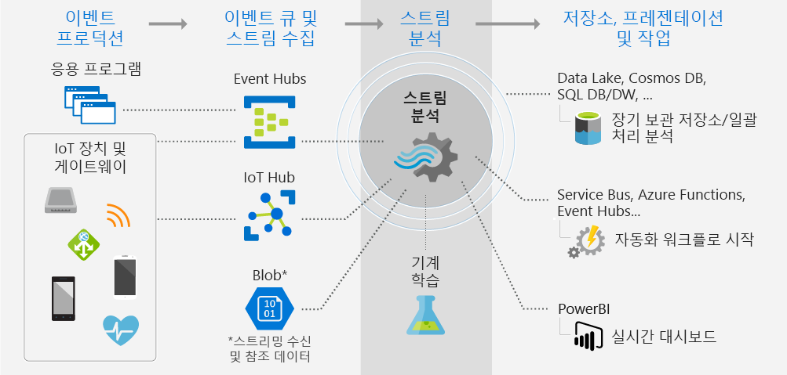

# Stream Analytics란 무엇인가요?

Azure Stream Analytics는 스트리밍 데이터에 대한 실시간 분석 계산 작업을 설정하는 관리되는 이벤트 처리 엔진입니다. 데이터는 장치, 센서, 웹 사이트, 소셜 미디어 피드, 응용 프로그램, 인프라 시스템 등에서 가져올 수 있습니다. 

Stream Analytics를 사용하여 장치 또는 프로세스에서 대용량 데이터 스트리밍을 검사하고, 데이터 스트림에서 정보를 추출하며, 패턴, 추세 및 관계를 식별합니다. 이러한 패턴을 사용하여 다른 프로세스 또는 경고, 자동화 워크플로, 보고 도구에 대한 피드 정보와 같은 작업을 트리거하거나 향후 조사를 위해 저장합니다. 

일부 사례:

* 주식 거래 분석 및 경고
* 부정 행위 감지, 데이터 및 보호 식별 
* 포함된 센서 및 작동기 분석
* 웹 클릭 동향 분석

## Stream Analytics는 어떻게 작동합니까?

이 다이어그램에서는 프레젠테이션 또는 작업을 위해 데이터를 수집하고, 분석하고, 보내는 방식을 설명하는 Stream Analytics 파이프라인을 보여 줍니다. 

Stream Analytics는 스트리밍 데이터의 원본으로 시작합니다. Azure Event Hub 또는 IoT Hub를 사용하는 장치에서 Azure로 데이터를 수집할 수 있습니다. Azure Blob Storage와 같은 데이터 저장소에서 데이터를 가져올 수도 있습니다. 

스트림을 검사하려면 데이터 출처를 지정하는 Stream Analytics *작업*을 만듭니다. 작업은 또한 *변환*; 데이터, 패턴 또는 관계를 검색하는 방법을 지정합니다. 이 작업의 경우 Stream Analytics는 일정 시간 동안 스트리밍 데이터를 필터링, 정렬, 집계 및 조인하는 SQL 방식 쿼리 언어를 지원합니다.

마지막으로, 작업은 변환된 해당 데이터에 대한 출력을 지정합니다. 분석한 정보에 대해 수행할 작업을 제어합니다. 예를 들어 분석에 대해 다음을 수행할 수 있습니다.

* 장치 설정을 변경하는 명령을 보냅니다. 
* 결과에 따라 추가 작업을 위해 모니터링되는 큐에 데이터를 보냅니다. 
* Power BI 대시보드에 데이터를 보냅니다.
* Data Lake Store, Azure SQL Database 또는 Azure Blob 저장소와 같은 저장소에 데이터를 보냅니다.

작업이 실행되는 동안 초당 처리된 이벤트 수를 조정할 수 있습니다. 문제 해결을 위한 진단 로그를 생성할 수도 있습니다.

## 주요 기능 및 이점

Stream Analytics는 사용하기 쉽고 유연하며 작업의 규모에 맞게 확장 가능하도록 설계되었습니다.

### 입력 및 출력 연결

Stream Analytics는 스트림 수집을 위해 [Azure Event Hubs](https://azure.microsoft.com/services/event-hubs/) 및 [Azure IoT Hub](https://azure.microsoft.com/services/iot-hub/)에, 기록 데이터 수집을 위해 [Azure Blob 저장소 서비스](https://docs.microsoft.com/azure/storage/storage-introduction#blob-storage-accounts)에 직접 연결됩니다. Stream Analytics를 사용하여 이벤트 허브의 데이터를 다른 데이터 원본 및 처리 엔진과 결합합니다. 작업 입력은 참조 데이터(정적 또는 느리게 변하는 데이터)를 포함할 수도 있습니다. 데이터베이스 쿼리와 동일한 방식으로 조회 작업을 수행하기 위해 스트리밍 데이터를 이 참조 데이터에 조인시킬 수 있습니다.

여러 방향으로 Stream Analytics 작업 출력을 라우팅합니다. Azure Blob, Azure SQL Database, Azure Data Lake Store 또는 Azure Cosmos DB와 같은 저장소에 작성합니다. 거기에서 Azure HDInsight를 사용하여 일괄 처리 분석을 실행할 수 있습니다. 또는 이벤트 허브, Azure Service Bus, 큐와 같은 다른 프로세스가 사용하도록 다른 서비스로 또는 시각화를 위해 Power BI로 출력을 보냅니다.

### 간편한 사용

변형을 정의하기 위해 프로그램 없이 정교한 분석을 만들 수 있는 단순하고 선언적인 [Stream Analytics 쿼리 언어](https://msdn.microsoft.com/library/azure/dn834998.aspx)를 사용할 수 있습니다. 쿼리 언어는 스트리밍 데이터를 입력으로 사용합니다. 그런 다음 데이터를 필터링 및 정렬하고, 값을 집계하고, 계산을 수행하고, 데이터를 조인(스트림 내에서 또는 참조 데이터에 조인)하고, 지리 공간 함수를 사용할 수 있습니다. IntelliSense 및 구문 검사를 사용하여 포털에서 쿼리를 편집할 수 있으며 라이브 스트림에서 추출할 수 있는 샘플 데이터를 사용하여 쿼리를 테스트할 수 있습니다.

### 확장 가능한 쿼리 언어

추가 함수를 정의하고 호출하여 쿼리 언어의 기능을 확장할 수 있습니다. Azure Machine Learning 솔루션을 활용하기 위해 Azure Machine Learning 서비스에서 함수 호출을 정의할 수 있습니다. Stream Analytics 쿼리의 일부로 복잡 한 계산을 수행하기 위해 JavaScript 사용자 정의 함수(UDF)를 통합할 수도 있습니다.

### 확장성

Stream Analytics는 들어오는 데이터를 초당 최대 1GB의 속도로 처리할 수 있습니다. [Azure Event Hubs](https://azure.microsoft.com/services/event-hubs/) 및 [Azure IoT Hub](https://azure.microsoft.com/services/iot-hub/)와 통합하면 작업에서 연결된 장치, 클릭 스트림 및 로그 파일에서 발생하는 초당 수백만 개의 이벤트를 수집할 수 있습니다. 이벤트 허브의 파티션 기능을 사용 하면 계산을 논리 단계로 분할할 수 있고, 좀 더 분할하면 확장성을 높일 수 있습니다.

### 저렴한 비용

클라우드 서비스인 Stream Analytics는 비용에 최적화되어 있습니다. 스트리밍 단위 사용량 및 데이터 처리량에 따라 비용을 지불합니다. 사용량은 처리된 이벤트의 양과 작업 클러스터 내에서 프로비전된 계산 능력의 양에 따라 결정됩니다.

### 안정성

관리 서비스인 Stream Analytics는 데이터 손실을 방지하고 비즈니스 연속성을 제공합니다. 오류가 발생한 경우 서비스는 기본 제공 복구 기능을 제공합니다. 이 서비스는 내부적으로 상태를 유지하는 기능을 통해 이벤트를 보관할 수 있는 경우 반복 가능한 결과를 제공하고, 향후에도 항상 동일한 결과를 제공하면서 처리를 다시 적용할 수 있습니다. 이를 통해 특정 시점으로 복구하고 근본 원인 분석, 가상 분석 등을 수행하는 경우 계산을 조사할 수 있습니다.

## 다음 단계

* [IoT 장치의 입력 및 쿼리로 시험](stream-analytics-get-started-with-azure-stream-analytics-to-process-data-from-iot-devices.md)하여 시작합니다.
* 전화 메타데이터를 검사하여 사기성 호출을 찾는 [종단 간 Stream Analytics 솔루션](stream-analytics-real-time-fraud-detection.md)을 빌드합니다.
* [Azure Stream Analytics 포럼](https://social.msdn.microsoft.com/Forums/en-US/home?forum=AzureStreamAnalytics)에서 Stream Analytics에 대한 질문의 답변을 찾아보세요.

