# <a name="quickstart-create-a-stream-analytics-job-by-using-the-azure-portal"></a>빠른 시작: Azure Portal을 사용하여 Stream Analytics 작업 만들기

이 빠른 시작은 Stream Analytics 작업 만들기를 시작하는 방법을 보여줍니다. 이 빠른 시작에서는 실시간 스트리밍 데이터를 읽고 온도가 27보다 높은 메시지를 필터링하는 Stream Analytics 작업을 정의합니다. Stream Analytics 작업은 IoT Hub 디바이스에서 데이터를 읽고, 데이터를 변환하고, 데이터를 BLOB 스토리지의 컨테이너에 다시 씁니다. 이 빠른 시작에서 사용된 입력 데이터는 Raspberry Pi 온라인 시뮬레이터로 생성됩니다. 

## <a name="before-you-begin"></a>시작하기 전에

* Azure 구독이 아직 없는 경우 [체험 계정](https://azure.microsoft.com/free/)을 만듭니다.

* [Azure Portal](https://portal.azure.com/)에 로그인합니다.

## <a name="prepare-the-input-data"></a>입력 데이터 준비

Stream Analytics 작업을 정의하기 전에 나중에 작업 입력으로 구성될 데이터를 준비해야 합니다. 작업에 필요한 입력 데이터를 준비하려면 다음 단계를 완료합니다.

1. [Azure Portal](https://portal.azure.com/)에 로그인합니다.

2. **리소스 만들기** > **사물 인터넷** > **IoT Hub**를 선택합니다.

3. **IoT Hub** 창에서 다음 정보를 입력합니다.
   
   |**설정**  |**제안 값**  |**설명**  |
   |---------|---------|---------|
   |구독  | \<구독\> |  사용할 Azure 구독을 선택합니다. |
   |리소스 그룹   |   asaquickstart-resourcegroup  |   **새로 만들기**를 선택하고 계정의 새로운 리소스 그룹 이름을 입력합니다. |
   |지역  |  \<사용자와 가장 가까운 지역 선택\> | IoT Hub를 호스트할 수 있는 지리적 위치를 선택합니다. 사용자와 가장 가까운 위치를 사용합니다. |
   |IoT Hub 이름  | MyASAIoTHub  |   IoT Hub의 이름을 선택합니다.   |

   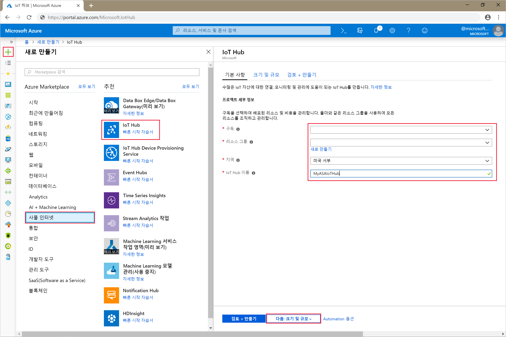

4. **다음: 크기 및 규모 설정**을 선택합니다.

5. **가격 책정 및 규모 계층**을 선택합니다. 이 빠른 시작의 경우 구독에서 아직 사용할 수 있다면 **F1 - 무료** 계층을 선택합니다. 자세한 내용은 [IoT Hub 가격 책정](https://azure.microsoft.com/pricing/details/iot-hub/)을 참조하세요.

   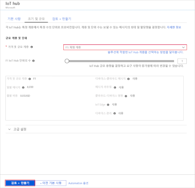

6. **검토 + 만들기**를 선택합니다. IoT Hub 정보를 검토하고 **만들기**를 클릭합니다. IoT Hub를 만드는 데 몇 분 정도 걸릴 수 있습니다. **알림** 창에서 진행 상황을 모니터링할 수 있습니다.

7. IoT Hub 탐색 메뉴의 **IoT 디바이스** 아래에서 **추가**를 클릭합니다. **디바이스 ID**를 추가하고 **저장**을 클릭합니다.

   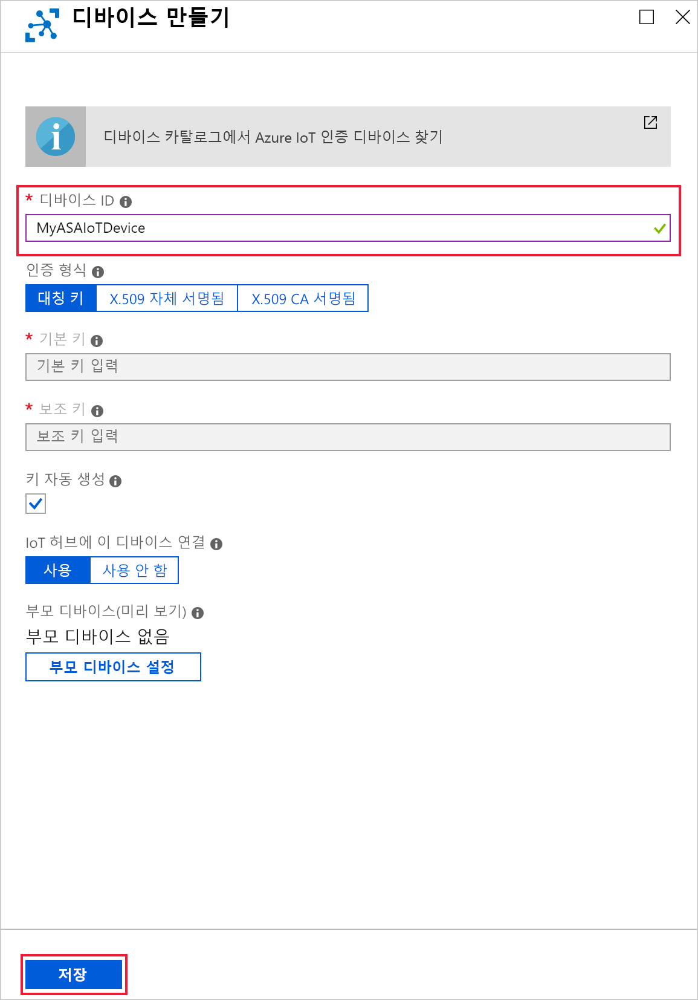

8. 디바이스가 만들어진 후에 **IoT 디바이스** 목록에서 디바이스를 엽니다. 나중에 사용하기 위해 **연결 문자열---기본 키**를 복사하고 메모장에 저장합니다.

   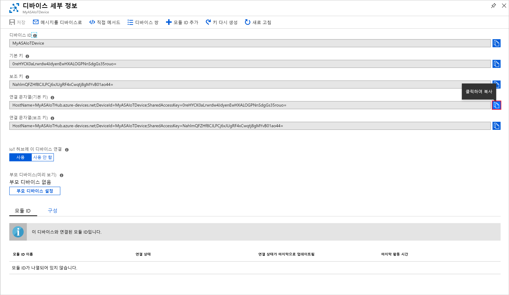

## <a name="create-blob-storage"></a>Blob Storage 만들기

1. Azure Portal의 왼쪽 위 모서리에서 **리소스 만들기** > **저장소** > **저장소 계정**을 선택합니다.

2. **스토리지 계정 만들기** 창에서 스토리지 계정 이름, 위치 및 리소스 그룹을 입력합니다. 자신이 만든 IoT Hub와 동일한 위치 및 리소스 그룹을 선택합니다. 그런 다음, **검토 + 만들기**를 클릭하여 계정을 만듭니다.

   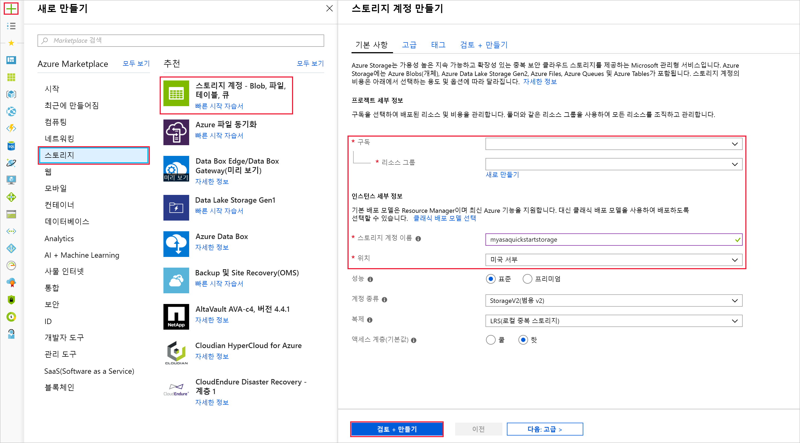

3. 스토리지 계정이 생성되면 **개요** 창에서 **Blob** 타일을 선택합니다.

   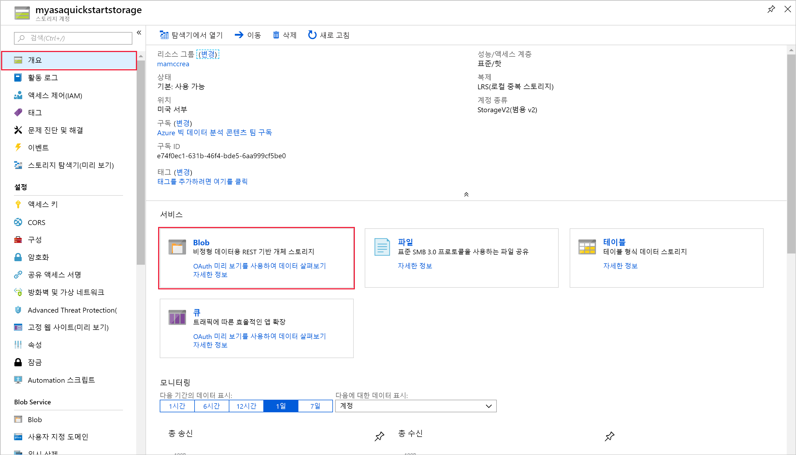

4. **Blob 서비스** 페이지에서 **컨테이너**를 선택하고, 컨테이너에 *container1*과 같은 이름을 지정합니다. **공용 액세스 수준**을 **개인(익명 액세스 없음)** 으로 유지하고 **확인**을 선택합니다.

   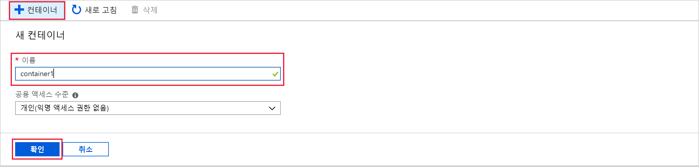

## <a name="create-a-stream-analytics-job"></a>Stream Analytics 작업 만들기

1. Azure 포털에 로그인합니다.

2. Azure Portal의 왼쪽 위 모서리에서 **리소스 만들기**를 선택합니다.  

3. 결과 목록에서 **데이터+Analytics** > **Stream Analytics 작업**을 선택합니다.  

4. Stream Analytics 작업 페이지를 다음 정보로 채웁니다.

   |**설정**  |**제안 값**  |**설명**  |
   |---------|---------|---------|
   |작업 이름   |  MyASAJob   |   Stream Analytics 작업을 식별하는 이름을 입력합니다. Stream Analytics 작업 이름은 영숫자 문자, 하이픈, 밑줄만 사용할 수 있으며 길이가 3자에서 63자 사이여야 합니다. |
   |구독  | \<구독\> |  이 작업에 사용할 Azure 구독을 선택합니다. |
   |리소스 그룹   |   asaquickstart-resourcegroup  |   IoT Hub와 동일한 리소스 그룹을 선택합니다. |
   |위치  |  \<사용자와 가장 가까운 지역 선택\> | Stream Analytics 작업을 호스트할 수 있는 지리적 위치를 선택합니다. 성능을 향상하고 데이터 전송 비용을 줄이기 위해 사용자에게 가장 가까운 위치를 사용합니다. |
   |스트리밍 단위  | 1  |   스트리밍 단위는 작업을 실행하는 데 필요한 컴퓨팅 리소스를 나타냅니다. 기본적으로 이 값은 1로 설정됩니다. 스트리밍 단위 크기를 조정하는 방법에 대한 자세한 내용은 [스트리밍 단위의 이해 및 크기 조정](stream-analytics-streaming-unit-consumption.md) 문서를 참조하세요.   |
   |호스팅 환경  |  클라우드  |   Stream Analytics 작업은 클라우드 또는 에지에 배포할 수 있습니다. 클라우드를 사용하면 Azure 클라우드에 배포할 수 있고, 에지를 사용하면 IoT 에지 디바이스에 배포할 수 있습니다. |

   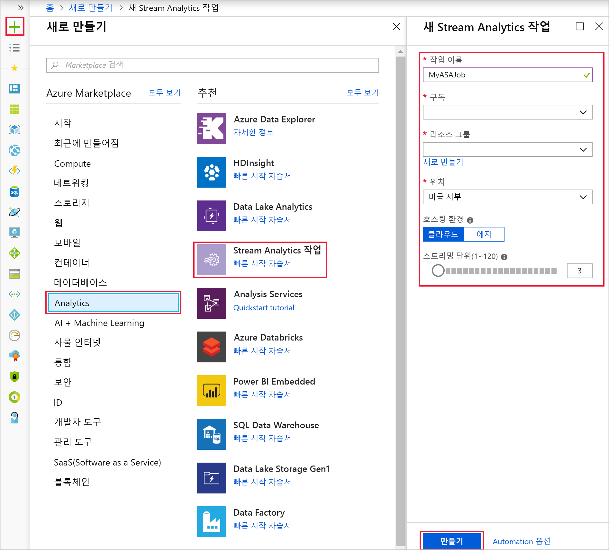

5. 대시보드에서 작업을 배치할 **대시보드에 고정** 확인란을 선택한 다음, **만들기**를 선택합니다.  

6. 브라우저 창의 오른쪽 위에 표시되는 *배포 진행 중* 알림이 보일 것입니다. 

## <a name="configure-job-input"></a>작업 입력 구성

이 섹션에서는 Stream Analytics 작업에 대한 IoT Hub 디바이스 입력을 구성합니다. 빠른 시작의 이전 섹션에서 만든 IoT Hub를 사용합니다.

1. Stream Analytics 작업으로 이동합니다.  

2. **입력** > **스트림 입력 추가** > **IoT Hub**를 선택합니다.  

3. 다음과 같은 **값으로** 페이지를 채웁니다.

   |**설정**  |**제안 값**  |**설명**  |
   |---------|---------|---------|
   |입력 별칭  |  IoTHubInput   |  작업의 입력을 식별하는 이름을 입력합니다.   |
   |구독   |  \<구독\> |  만든 저장소 계정이 있는 Azure 구독을 선택합니다. 동일한 또는 다른 구독에 저장소 계정이 있을 수 있습니다. 이 예제에서는 동일한 구독에 저장소 계정을 만들었다고 가정합니다. |
   |IoT Hub  |  MyASAIoTHub |  이전 섹션에서 만든 IoT Hub의 이름을 입력합니다. |

4. 다른 옵션을 기본값으로 유지하고 **저장**을 선택하여 설정을 저장합니다.  

   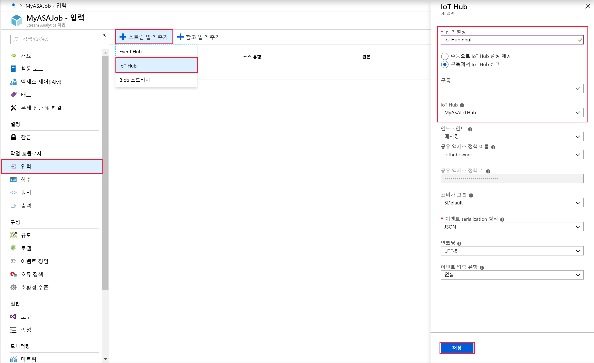
 
## <a name="configure-job-output"></a>작업 출력 구성

1. 이전에 만든 Stream Analytics 작업으로 이동합니다.  

2. **출력** > **추가** > **Blob Storage**를 선택합니다.  

3. 다음과 같은 값으로 **Blob 저장소** 페이지를 채웁니다.

   |**설정**  |**제안 값**  |**설명**  |
   |---------|---------|---------|
   |출력 별칭 |   BlobOutput   |   작업의 출력을 식별하는 이름을 입력합니다. |
   |구독  |  \<구독\>  |  만든 저장소 계정이 있는 Azure 구독을 선택합니다. 동일한 또는 다른 구독에 저장소 계정이 있을 수 있습니다. 이 예제에서는 동일한 구독에 저장소 계정을 만들었다고 가정합니다. |
   |Storage 계정 |  asaquickstartstorage |   저장소 계정의 이름을 선택하거나 입력합니다. 저장소 계정 이름은 동일한 구독에 만들어진 경우에 자동으로 감지됩니다.       |
   |컨테이너 |   container1  |  저장소 계정에서 만든 기존 컨테이너를 선택합니다.   |

4. 다른 옵션을 기본값으로 유지하고 **저장**을 선택하여 설정을 저장합니다.  

   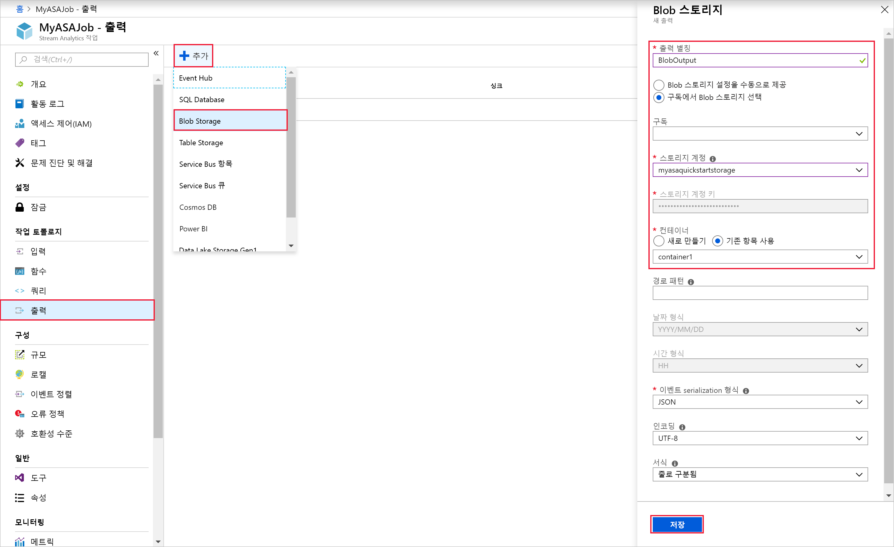
 
## <a name="define-the-transformation-query"></a>변환 쿼리 정의

1. 이전에 만든 Stream Analytics 작업으로 이동합니다.  

2. **쿼리**를 선택하고 쿼리를 다음과 같이 업데이트합니다.  

   ```sql
   SELECT *
   INTO BlobOutput
   FROM IoTHubInput
   HAVING Temperature > 27
   ```

3. 이 예제에서 쿼리는 IoT Hub에서 데이터를 읽고 Blob의 새 파일로 복사합니다. **저장**을 선택합니다.  

   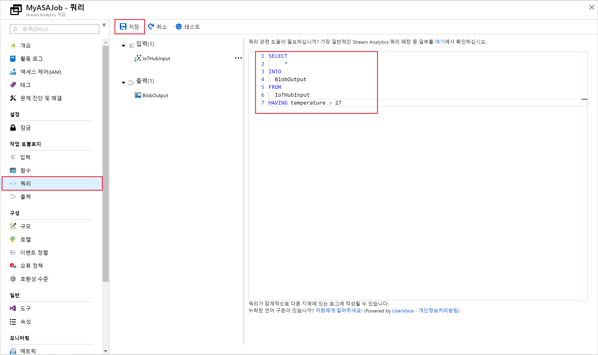

## <a name="run-the-iot-simulator"></a>IoT 시뮬레이터 실행

1. [Raspberry Pi Azure IoT 온라인 시뮬레이터](https://azure-samples.github.io/raspberry-pi-web-simulator/)를 엽니다.

2. 15행의 자리 표시자를 이전 섹션에서 저장한 Azure IoT Hub 디바이스 연결 문자열로 대체합니다.

3. **실행**을 클릭합니다. IoT Hub로 전송 중인 센서 데이터와 메시지가 출력에 표시되어야 합니다.

   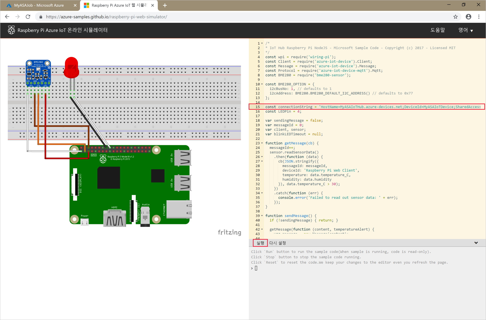

## <a name="start-the-stream-analytics-job-and-check-the-output"></a>Stream Analytics 작업을 시작하고 출력을 확인합니다.

1. 작업 개요 페이지로 돌아가서 **시작**을 선택합니다.

2. **작업 시작** 아래에서 **작업 출력 시작 시간** 필드에 **지금**을 선택합니다. 그런 다음, **시작**을 선택하여 작업을 시작합니다.

3. 몇 분 후 포털에서 작업에 대한 출력으로 구성한 저장소 계정 및 컨테이너를 찾습니다. 이제 컨테이너에서 출력 파일을 볼 수 있습니다. 작업이 처음으로 시작되는 데 몇 분이 소요되며, 시작된 후 데이터가 도착하는 것과 동일하게 계속해서 실행됩니다.  

   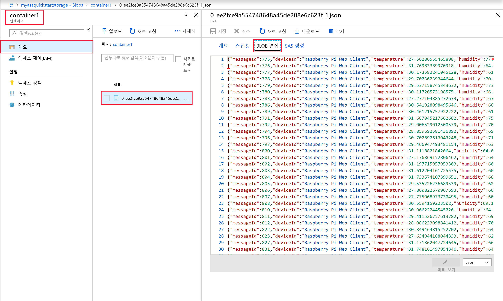

## <a name="clean-up-resources"></a>리소스 정리

더 이상 필요하지 않으면 리소스 그룹, 스트리밍 작업 및 모든 관련 리소스를 삭제합니다. 작업을 삭제하면 작업에서 사용된 스트리밍 단위에 대한 청구를 방지합니다. 작업을 나중에 사용하려는 경우 중지하고 나중에 필요할 때 다시 시작할 수 있습니다. 이 작업을 계속 사용하지 않으려면 다음 단계를 사용하여 이 빠른 시작에서 만든 리소스를 모두 삭제합니다.

1. Azure Portal의 왼쪽 메뉴에서 **리소스 그룹**을 선택한 다음, 만든 리소스의 이름을 선택합니다.  

2. 리소스 그룹 페이지에서 **삭제**를 선택하고 텍스트 상자에서 삭제할 리소스의 이름을 입력한 다음, **삭제**를 선택합니다.

## <a name="next-steps"></a>다음 단계

이 빠른 시작에서는 Azure Portal을 사용하여 간단한 Stream Analytics 작업을 배포했습니다. [PowerShell](stream-analytics-quick-create-powershell.md) 및 [Visual Studio](stream-analytics-quick-create-vs.md)를 통해서도 Stream Analytics 작업을 배포할 수 있습니다.

다른 입력 원본을 구성하고 실시간 검색을 수행하는 방법을 알아보려면 다음 문서로 이동하세요.

> [!div class="nextstepaction"]
> [Azure Stream Analytics를 사용하여 실시간 부정 행위 감지](stream-analytics-real-time-fraud-detection.md)

