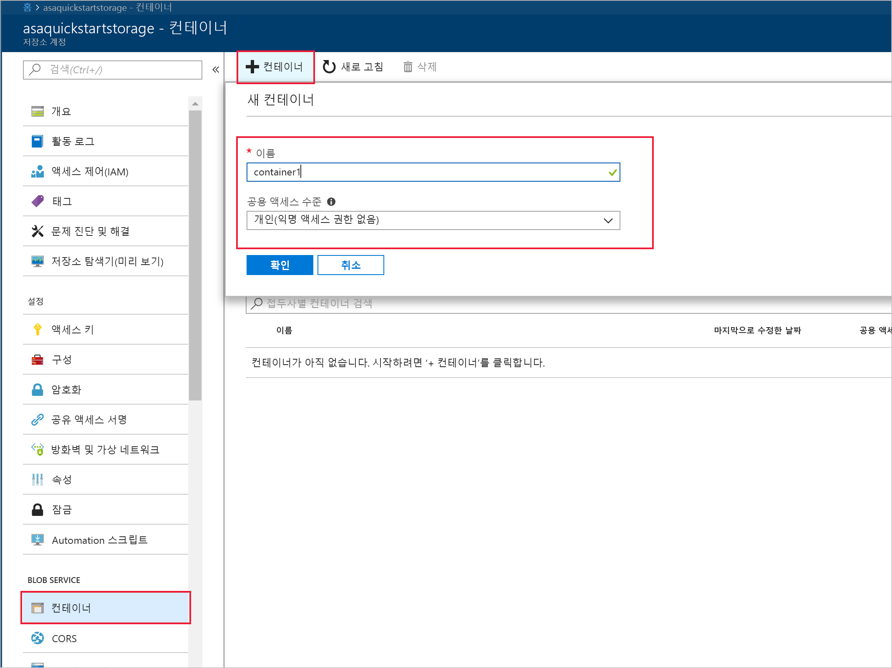
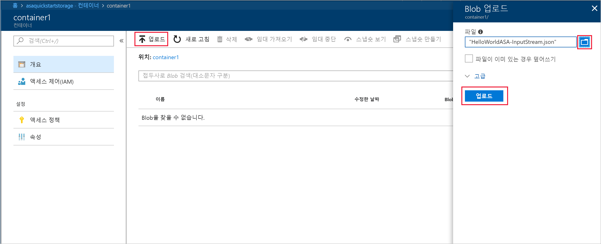
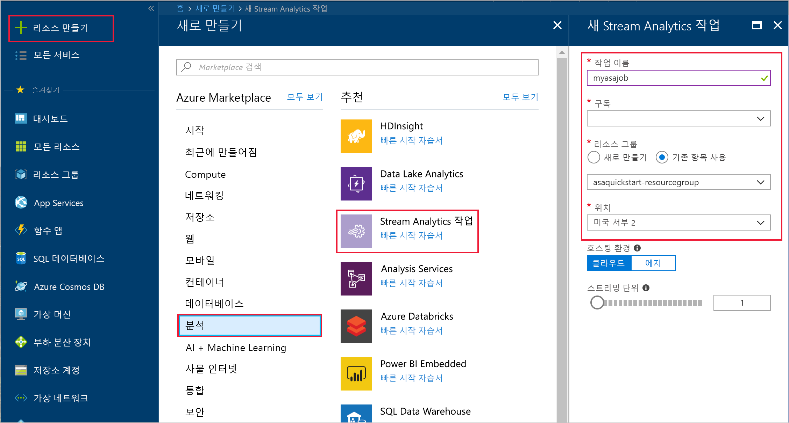
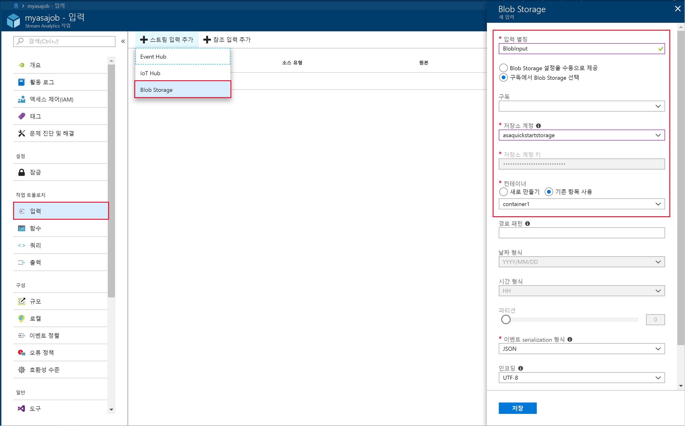
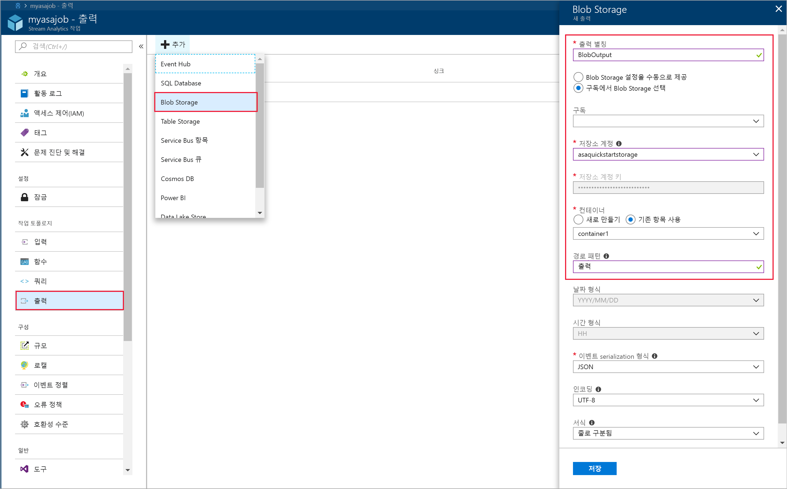
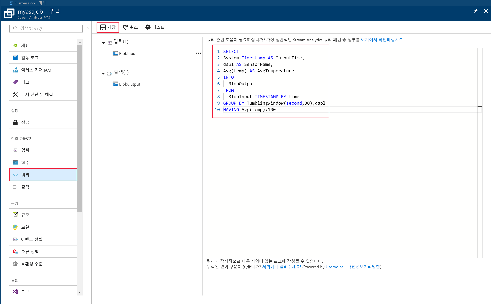
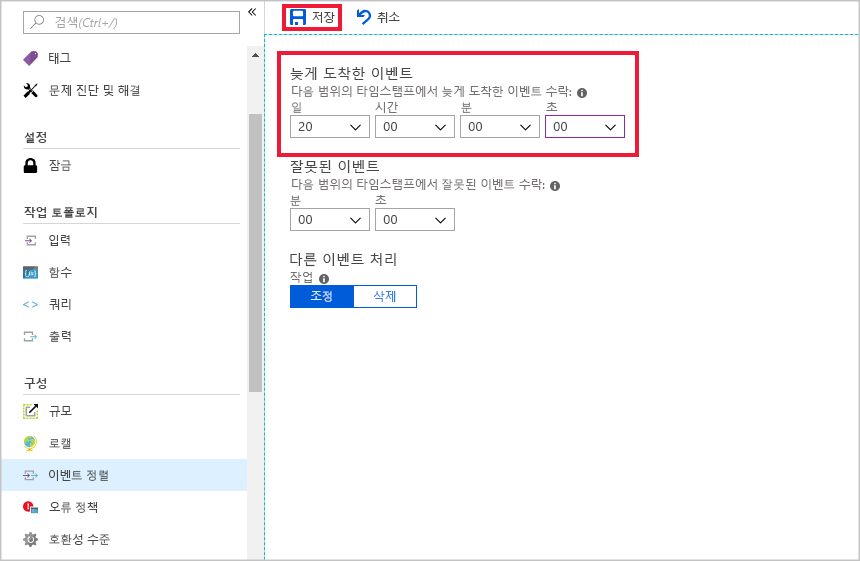
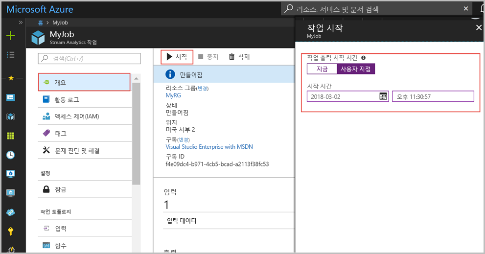
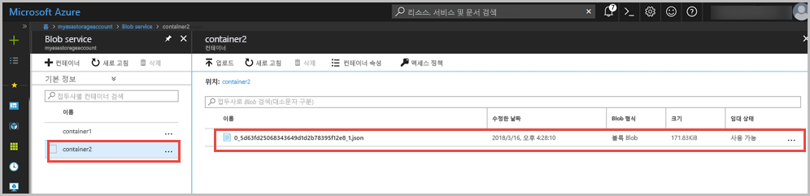

# <a name="quickstart-create-a-stream-analytics-job-by-using-the-azure-portal"></a>빠른 시작: Azure Portal을 사용하여 Stream Analytics 작업 만들기

이 빠른 시작은 Stream Analytics 작업 만들기를 시작하는 방법을 보여줍니다. 이 빠른 시작에서는 샘플 센서 데이터를 읽고 30초마다 100보다 큰 평균 온도를 갖는 행을 필터링하는 Stream Analytics 작업을 정의합니다. 이 문서에서는 Blob 저장소에서 데이터를 읽고, 데이터를 변환하고, 그 데이터를 동일한 Blob 저장소의 다른 컨테이너에 다시 씁니다. 이 빠른 시작에 사용된 입력 데이터 파일에는 오직 설명할 목적으로 정적 데이터가 들어 있습니다. 실제 시나리오에서는 Stream Analytics 작업에 스트리밍 입력 데이터를 사용합니다.

## <a name="before-you-begin"></a>시작하기 전에

* Azure 구독이 아직 없는 경우 [체험 계정](https://azure.microsoft.com/free/)을 만듭니다.

* [Azure Portal](https://portal.azure.com/)에 로그인합니다.

## <a name="prepare-the-input-data"></a>입력 데이터 준비

Stream Analytics 작업을 정의하기 전에 작업에 대한 입력으로 구성된 데이터를 준비해야 합니다. 작업에 필요한 입력 데이터를 준비하려면 다음 단계를 실행합니다.

1. GitHub에서 [샘플 센서 데이터](https://raw.githubusercontent.com/Azure/azure-stream-analytics/master/Samples/GettingStarted/HelloWorldASA-InputStream.json)를 다운로드합니다. 샘플 데이터는 다음 JSON 형식의 센서 정보를 포함합니다.  

   ```json
   {
     "time": "2018-08-19T21:18:52.0000000",
     "dspl": "sensorC",
     "temp": 87,
     "hmdt": 44
   }
   ```
2. [Azure Portal](https://portal.azure.com/)에 로그인합니다.  

3. Azure Portal의 왼쪽 위 모서리에서 **리소스 만들기** > **저장소** > **저장소 계정**을 선택합니다. **이름**이 "asaquickstartstorage"로, **위치**가 "미국 서부 2"로, **리소스 그룹**이 "asaquickstart-resourcegroup"으로 설정된 저장소 계정 작업 페이지를 작성합니다(성능 향상을 위해 스트리밍 작업과 동일한 리소스 그룹의 저장소 계정을 호스팅함). 나머지 설정은 해당 기본값으로 유지할 수 있습니다.  

   

4. **모든 리소스** 페이지에서 이전 단계에서 만든 저장소 계정을 찾습니다. **개요** 페이지, **Blob** 타일을 차례로 엽니다.  

5. **Blob Service** 페이지에서 **컨테이너**를 선택하고, *container1*과 같은 컨테이너에 대한 **이름**을 제공하고 **공용 액세스 수준**을 개인(익명 액세스 없음)으로 변경하고 > **확인**을 선택합니다.  

   

6. 이전 단계에서 만든 컨테이너로 이동합니다. **Upload**를 선택하고 첫 번째 단계에서 얻은 센서 데이터를 업로드합니다.  

   

## <a name="create-a-stream-analytics-job"></a>Stream Analytics 작업 만들기

1. Azure 포털에 로그인합니다.

2. Azure Portal의 왼쪽 위 모서리에서 **리소스 만들기**를 선택합니다.  

3. 결과 목록에서 **데이터+Analytics** > **Stream Analytics 작업**을 선택합니다.  

4. Stream Analytics 작업 페이지를 다음 정보로 채웁니다.

   |**설정**  |**제안 값**  |**설명**  |
   |---------|---------|---------|
   |작업 이름   |  myasajob   |   Stream Analytics 작업을 식별하는 이름을 입력합니다. Stream Analytics 작업 이름은 영숫자 문자, 하이픈, 밑줄만 사용할 수 있으며 길이가 3자에서 63자 사이여야 합니다. |
   |구독  | \<구독\> |  이 작업에 사용할 Azure 구독을 선택합니다. |
   |리소스 그룹   |   asaquickstart-resourcegroup  |   **새로 만들기**를 선택하고 계정의 새로운 리소스 그룹 이름을 입력합니다. |
   |위치  |  \<사용자와 가장 가까운 지역 선택\> | Stream Analytics 작업을 호스트할 수 있는 지리적 위치를 선택합니다. 성능을 향상하고 데이터 전송 비용을 줄이기 위해 사용자에게 가장 가까운 위치를 사용합니다. |
   |스트리밍 단위  | 1  |   스트리밍 단위는 작업을 실행하는 데 필요한 컴퓨팅 리소스를 나타냅니다. 기본적으로 이 값은 1로 설정됩니다. 스트리밍 단위 크기를 조정하는 방법에 대한 자세한 내용은 [스트리밍 단위의 이해 및 크기 조정](stream-analytics-streaming-unit-consumption.md) 문서를 참조하세요.   |
   |호스팅 환경  |  클라우드  |   Stream Analytics 작업은 클라우드 또는 에지에 배포할 수 있습니다. 클라우드를 사용하면 Azure Cloud에 배포할 수 있고, 에지를 사용하면 IoT 에지 장치에 배포할 수 있습니다. |

   

5. 대시보드에서 작업을 배치할 **대시보드에 고정** 확인란을 선택한 다음, **만들기**를 선택합니다.  

6. 브라우저 창의 오른쪽 위에서 '배포 진행 중...'이라고 표시됩니다. 

## <a name="configure-input-to-the-job"></a>작업에 대한 입력 구성

이 섹션에서는 Stream Analytics 작업에 대한 입력으로 Blob 저장소를 구성합니다. 입력을 구성하기 전에 Blob 저장소 계정을 만듭니다.  

### <a name="add-the-input"></a>입력 추가 

1. Stream Analytics 작업으로 이동합니다.  

2. **입력** > **스트림 입력 추가** > **Blob 저장소**를 선택합니다.  

3. 다음과 같은 값으로 **Blob 저장소** 페이지를 채웁니다.

   |**설정**  |**제안 값**  |**설명**  |
   |---------|---------|---------|
   |입력 별칭  |  BlobInput   |  작업의 입력을 식별하는 이름을 입력합니다.   |
   |구독   |  \<구독\> |  만든 저장소 계정이 있는 Azure 구독을 선택합니다. 동일한 또는 다른 구독에 저장소 계정이 있을 수 있습니다. 이 예제에서는 동일한 구독에 저장소 계정을 만들었다고 가정합니다. |
   |Storage 계정  |  myasastorageaccount |  저장소 계정의 이름을 선택하거나 입력합니다. 저장소 계정 이름은 동일한 구독에 만들어진 경우에 자동으로 감지됩니다. |
   |컨테이너  | container1 | 샘플 데이터를 보유하는 컨테이너의 이름을 선택합니다. 컨테이너 이름은 동일한 구독에 만들어진 경우에 자동으로 감지됩니다. |

4. 다른 옵션을 기본값으로 유지하고 **저장**을 선택하여 설정을 저장합니다.  

   
 
## <a name="configure-output-to-the-job"></a>작업에 대한 출력 구성

1. 이전에 만든 Stream Analytics 작업으로 이동합니다.  

2. **출력 > 추가 > Blob 저장소**를 선택합니다.  

3. 다음과 같은 값으로 **Blob 저장소** 페이지를 채웁니다.

   |**설정**  |**제안 값**  |**설명**  |
   |---------|---------|---------|
   |출력 별칭 |   BlobOutput   |   작업의 출력을 식별하는 이름을 입력합니다. |
   |구독  |  \<구독\>  |  만든 저장소 계정이 있는 Azure 구독을 선택합니다. 동일한 또는 다른 구독에 저장소 계정이 있을 수 있습니다. 이 예제에서는 동일한 구독에 저장소 계정을 만들었다고 가정합니다. |
   |Storage 계정 |  asaquickstartstorage |   저장소 계정의 이름을 선택하거나 입력합니다. 저장소 계정 이름은 동일한 구독에 만들어진 경우에 자동으로 감지됩니다.       |
   |컨테이너 |   container1  |  저장소 계정에서 만든 기존 컨테이너를 선택합니다.   |
   |경로 패턴 |   output  |  출력에 대한 기존 컨테이너 내의 경로로 사용할 이름을 입력합니다.   |

4. 다른 옵션을 기본값으로 유지하고 **저장**을 선택하여 설정을 저장합니다.  

   
 
## <a name="define-the-transformation-query"></a>변환 쿼리 정의

1. 이전에 만든 Stream Analytics 작업으로 이동합니다.  

2. **쿼리**를 선택하고 쿼리를 다음과 같이 업데이트합니다.  

   ```sql
   SELECT 
   System.Timestamp AS OutputTime,
   dspl AS SensorName,
   Avg(temp) AS AvgTemperature
   INTO
     BlobOutput
   FROM
     BlobInput TIMESTAMP BY time
   GROUP BY TumblingWindow(second,30),dspl
   HAVING Avg(temp)>100
   ```

3. 이 예제에서 쿼리는 Blob에서 데이터를 읽고 Blob의 새 파일로 복사합니다. **저장**을 선택합니다.  

   

## <a name="configure-late-arrival-policy"></a>지연 도착 정책 구성

1. 이전에 만든 Stream Analytics 작업으로 이동합니다.

2. **구성** 아래에서 **이벤트 순서 지정**을 선택합니다.

3. **늦게 도착하는 이벤트**를 20로 설정하고, **저장**을 선택합니다.

   

## <a name="start-the-stream-analytics-job-and-check-the-output"></a>Stream Analytics 작업을 시작하고 출력을 확인합니다.

1. 작업 개요 페이지로 돌아가서 **시작**을 선택합니다.

2. **작업 시작**아래에서 **시작 시간** 필드에 대해 **사용자 지정**을 선택합니다. `2018-01-24`을 시작 날짜로 합니다. 하지만 시간은 변경하지 마십시오. 이 시작 날짜가 선택된 것은 샘플 데이터의 이벤트 타임스탬프보다 앞서기 때문입니다. 완료되면 **시작**을 선택합니다.

   

3. 몇 분 후 포털에서 작업에 대한 출력으로 구성한 저장소 계정 및 컨테이너를 찾습니다. 출력 경로를 선택합니다. 이제 컨테이너에서 출력 파일을 볼 수 있습니다. 작업이 처음으로 시작되는 데 몇 분이 소요되며, 시작된 후 데이터가 도착하는 것과 동일하게 계속해서 실행됩니다.  

   

## <a name="clean-up-resources"></a>리소스 정리

더 이상 필요하지 않으면 리소스 그룹, 스트리밍 작업 및 모든 관련 리소스를 삭제합니다. 작업을 삭제하면 작업에서 사용된 스트리밍 단위에 대한 청구를 방지합니다. 작업을 나중에 사용하려는 경우 중지하고 나중에 필요할 때 다시 시작할 수 있습니다. 이 작업을 계속 사용하지 않으려면 다음 단계를 사용하여 이 빠른 시작에서 만든 리소스를 모두 삭제합니다.

1. Azure Portal의 왼쪽 메뉴에서 **리소스 그룹**을 선택한 다음, 만든 리소스의 이름을 선택합니다.  

2. 리소스 그룹 페이지에서 **삭제**를 선택하고 텍스트 상자에서 삭제할 리소스의 이름을 입력한 다음, **삭제**를 선택합니다.

## <a name="next-steps"></a>다음 단계

이 빠른 시작에서는 Azure Portal을 사용하여 간단한 Stream Analytics 작업을 배포했습니다. [PowerShell](stream-analytics-quick-create-powershell.md) 및 [Visual Studio](stream-analytics-quick-create-vs.md)를 통해서도 Stream Analytics 작업을 배포할 수 있습니다.

다른 입력 원본을 구성하고 실시간 검색을 수행하는 방법을 알아보려면 다음 문서로 이동하세요.

> [!div class="nextstepaction"]
> [Azure Stream Analytics를 사용하여 실시간 부정 행위 감지](stream-analytics-real-time-fraud-detection.md)

