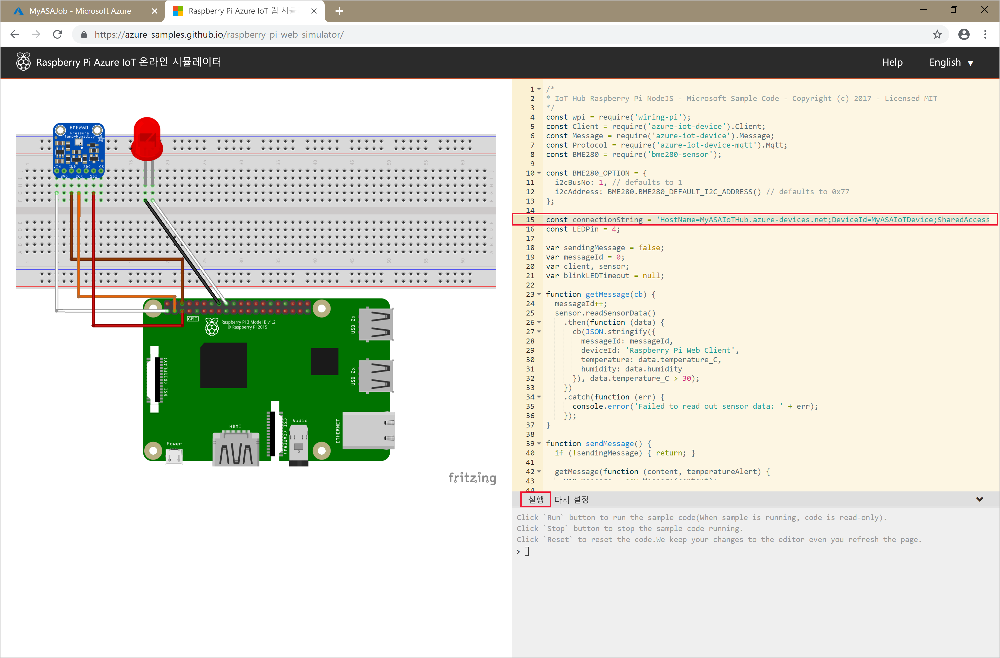

# <a name="quickstart-create-a-stream-analytics-job-using-azure-powershell"></a>빠른 시작: Azure PowerShell을 사용하여 Stream Analytics 작업 만들기

Azure PowerShell 모듈은 PowerShell cmdlet 또는 스크립트를 사용하여 Azure 리소스를 만들고 관리하는 데 사용됩니다. 이 빠른 시작에서는 Azure PowerShell 모듈을 사용하여 Azure Stream Analytics 작업을 배포하고 실행하는 방법을 자세히 설명합니다.

예제 작업에서는 IoT Hub 서비스에서 스트리밍 데이터를 읽습니다. 이 입력 데이터는 Raspberry Pi 온라인 시뮬레이터로 생성됩니다. 그런 다음, Stream Analytics 작업은 Stream Analytics 쿼리 언어를 사용하여 온도가 27°를 넘는 메시지를 필터링하여 데이터를 변환합니다. 마지막으로, 결과 출력 이벤트를 Blob 스토리지에 씁니다.

## <a name="before-you-begin"></a>시작하기 전에

[!INCLUDE [updated-for-az](../../includes/updated-for-az.md)]

* Azure 구독이 아직 없는 경우 [무료 계정](https://azure.microsoft.com/free/) 을 만듭니다.

* 이 빠른 시작에서는 Azure PowerShell 모듈이 필요합니다. 로컬 컴퓨터에 설치된 버전을 확인하려면 `Get-Module -ListAvailable Az`을 실행합니다. 설치 또는 업그레이드해야 하는 경우 [Azure PowerShell 모듈 설치](https://docs.microsoft.com/powershell/azure/install-Az-ps)를 참조하세요.

* 일부 IoT Hub 작업은 Azure PowerShell에서 지원되지 않으므로 Azure CLI 버전 2.0.24 이상 및 Azure CLI용 IoT 확장을 사용하여 완료해야 합니다. [Azure CLI를 설치](https://docs.microsoft.com/cli/azure/install-azure-cli?view=azure-cli-latest)하고 `az extension add --name azure-cli-iot-ext`를 사용하여 IoT 확장을 설치합니다.


## <a name="sign-in-to-azure"></a>Azure에 로그인

`Connect-AzAccount` 명령을 사용하여 Azure 구독에 로그인하고 팝업 브라우저에 Azure 자격 증명을 입력합니다.

```powershell
# Connect to your Azure account
Connect-AzAccount
```

구독이 한 개를 초과하는 경우, 다음 cmdlet을 실행하여 이 빠른 시작에 사용할 구독을 선택합니다. `<your subscription name>`을 구독의 이름으로 바꿔야 합니다.

```powershell
# List all available subscriptions.
Get-AzSubscription

# Select the Azure subscription you want to use to create the resource group and resources.
Get-AzSubscription -SubscriptionName "<your subscription name>" | Select-AzSubscription
```

## <a name="create-a-resource-group"></a>리소스 그룹 만들기

[New-AzResourceGroup](https://docs.microsoft.com/powershell/module/az.resources/new-azresourcegroup)을 사용하여 Azure 리소스 그룹을 만듭니다. 리소스 그룹은 Azure 리소스가 배포 및 관리되는 논리적 컨테이너입니다.

```powershell
$resourceGroup = "StreamAnalyticsRG"
$location = "WestUS2"
New-AzResourceGroup `
    -Name $resourceGroup `
    -Location $location
```

## <a name="prepare-the-input-data"></a>입력 데이터 준비

Stream Analytics 작업을 정의하기 전에 작업에 대한 입력으로 구성된 데이터를 준비합니다.

다음 Azure CLI 코드 블록은 여러 명령을 수행하여 작업에 필요한 입력 데이터를 준비합니다. 코드를 이해하려면 섹션을 검토합니다.

1. PowerShell 창에서 [az login](https://docs.microsoft.com/cli/azure/authenticate-azure-cli?view=azure-cli-latest) 명령을 실행하여 Azure 계정에 로그인합니다.

    성공적으로 로그인한 경우 Azure CLI는 구독 목록을 반환합니다. 이 빠른 시작에 사용 중인 구독을 복사하고 [az account set](https://docs.microsoft.com/cli/azure/manage-azure-subscriptions-azure-cli?view=azure-cli-latest#change-the-active-subscription) 명령을 실행하여 해당 구독을 선택합니다. PowerShell을 사용하여 이전 섹션에서 선택한 것과 동일한 구독을 선택합니다. `<your subscription name>`을 구독의 이름으로 바꾸어야 합니다.

    ```azurecli
    az login

    az account set --subscription "<your subscription>"
    ```

2. [az iot hub create](../iot-hub/iot-hub-create-using-cli.md#create-an-iot-hub) 명령을 사용하여 IoT Hub를 만듭니다. 이 예제에서는 **MyASAIoTHub**라는 IoT Hub를 만듭니다. IoT Hub 이름은 고유하므로 사용자 고유의 IoT Hub 이름으로 표시해야 합니다. 구독에 사용 가능한 경우 체험 계층을 사용하도록 SKU를 F1로 설정합니다. 그러지 않으면 다음으로 가장 낮은 계층을 선택합니다.

    ```azurecli
    az iot hub create --name "<your IoT Hub name>" --resource-group $resourceGroup --sku S1
    ```

    IoT Hub가 만들어지면 [az iot hub show-connection-string](https://docs.microsoft.com/cli/azure/iot/hub?view=azure-cli-latest) 명령을 사용하여 IoT Hub 연결 문자열을 가져옵니다. 전체 연결 문자열을 복사하여 IoT Hub를 Stream Analytics 작업에 대한 입력으로 추가할 때를 위해 저장해 둡니다.

    ```azurecli
    az iot hub show-connection-string --hub-name "MyASAIoTHub"
    ```

3. [az iothub device-identity create](../iot-hub/quickstart-send-telemetry-c.md#register-a-device) 명령을 사용하여 IoT Hub에 디바이스를 추가합니다. 이 예제에서는 **MyASAIoTDevice**라는 디바이스를 만듭니다.

    ```azurecli
    az iot hub device-identity create --hub-name "MyASAIoTHub" --device-id "MyASAIoTDevice"
    ```

4. [az iot hub device-identity show-connection-string](/cli/azure/ext/azure-cli-iot-ext/iot/hub/device-identity#ext-azure-cli-iot-ext-az-iot-hub-device-identity-show-connection-string) 명령을 사용하여 디바이스 연결 문자열을 가져옵니다. 전체 연결 문자열을 복사하여 Raspberry Pi 시뮬레이터를 만들 때를 위해 저장해 둡니다.

    ```azurecli
    az iot hub device-identity show-connection-string --hub-name "MyASAIoTHub" --device-id "MyASAIoTDevice" --output table
    ```

    **출력 예제:**

    ```azurecli
    HostName=MyASAIoTHub.azure-devices.net;DeviceId=MyASAIoTDevice;SharedAccessKey=a2mnUsg52+NIgYudxYYUNXI67r0JmNubmfVafojG8=
    ```

## <a name="create-blob-storage"></a>Blob Storage 만들기

다음 Azure PowerShell 코드 블록은 명령을 사용하여 작업 출력에 사용되는 Blob 스토리지를 만듭니다. 코드를 이해하려면 섹션을 검토합니다.

1. [New-AzStorageAccount](https://docs.microsoft.com/powershell/module/az.storage/New-azStorageAccount) cmdlet을 사용하여 표준 범용 스토리지 계정을 만듭니다.  이 예제에서는 LRS(로컬 중복 스토리지) 및 Blob 암호화(기본적으로 사용)를 사용하여 **myasaquickstartstorage**라는 스토리지 계정을 만듭니다.

2. 사용할 저장소 계정을 정의하는 저장소 계정 컨텍스트 `$storageAccount.Context`를 검색합니다. 저장소 계정으로 작업할 때 자격 증명을 반복적으로 제공하는 대신 컨텍스트를 참조합니다.

3. [New-AzStorageContainer](https://docs.microsoft.com/powershell/module/az.storage/new-azstoragecontainer)를 사용하여 스토리지 컨테이너를 만듭니다.

4. 코드에서 출력하는 스토리지 키를 복사한 다음, 해당 키를 저장하여 나중에 스트리밍 작업의 출력을 만듭니다.

    ```powershell
    $storageAccountName = "myasaquickstartstorage"
    $storageAccount = New-AzStorageAccount `
      -ResourceGroupName $resourceGroup `
      -Name $storageAccountName `
      -Location $location `
      -SkuName Standard_LRS `
      -Kind Storage

    $ctx = $storageAccount.Context
    $containerName = "container1"

    New-AzStorageContainer `
      -Name $containerName `
      -Context $ctx

    $storageAccountKey = (Get-AzStorageAccountKey `
      -ResourceGroupName $resourceGroup `
      -Name $storageAccountName).Value[0]

    Write-Host "The <storage account key> placeholder needs to be replaced in your output json files with this key value:"
    Write-Host $storageAccountKey -ForegroundColor Cyan
    ```

## <a name="create-a-stream-analytics-job"></a>Stream Analytics 작업 만들기

[New-AzStreamAnalyticsJob](https://docs.microsoft.com/powershell/module/az.streamanalytics/new-azstreamanalyticsjob) cmdlet을 사용하여 Stream Analytics 작업을 만듭니다. 이 cmdlet은 작업 이름, 리소스 그룹 이름 및 작업 정의를 매개 변수로 사용합니다. 작업 이름은 작업을 식별하는 친숙한 이름일 수 있습니다. 영숫자 문자, 하이픈 및 밑줄만 포함할 수 있으며 길이는 3자에서 63자 사이여야 합니다. 작업 정의는 작업을 만드는 데 필요한 속성을 포함하는 JSON 파일입니다. 로컬 컴퓨터에서 `JobDefinition.json`이라는 파일을 만들고 여기에 다음 JSON 데이터를 추가합니다.

```json
{
  "location":"WestUS2",
  "properties":{
    "sku":{
      "name":"standard"
    },
    "eventsOutOfOrderPolicy":"adjust",
    "eventsOutOfOrderMaxDelayInSeconds":10,
    "compatibilityLevel": 1.1
  }
}
```

그런 다음, `New-AzStreamAnalyticsJob` cmdlet을 실행합니다. `jobDefinitionFile` 변수의 값을 작업 정의 JSON 파일을 저장한 경로로 바꿉니다.

```powershell
$jobName = "MyStreamingJob"
$jobDefinitionFile = "C:\JobDefinition.json"
New-AzStreamAnalyticsJob `
  -ResourceGroupName $resourceGroup `
  -File $jobDefinitionFile `
  -Name $jobName `
  -Force
```

## <a name="configure-input-to-the-job"></a>작업에 대한 입력 구성

[New-AzStreamAnalyticsInput](https://docs.microsoft.com/powershell/module/az.streamanalytics/new-azstreamanalyticsinput) cmdlet을 사용하여 작업에 입력을 추가합니다. 이 cmdlet은 작업 이름, 작업 입력 이름, 리소스 그룹 이름 및 작업 입력 정의를 매개 변수로 사용합니다. 작업 입력 정의는 작업의 입력을 구성하는 데 필요한 속성을 포함하는 JSON 파일입니다. 이 예제에서는 입력으로 Blob 스토리지를 만듭니다.

로컬 컴퓨터에서 `JobInputDefinition.json`이라는 파일을 만들고 여기에 다음 JSON 데이터를 추가합니다. `accesspolicykey`의 값을 이전 섹션에서 저장한 IoT Hub 연결 문자열의 `SharedAccessKey` 부분으로 바꾸어야 합니다.

```json
{
    "properties": {
        "type": "Stream",
        "datasource": {
            "type": "Microsoft.Devices/IotHubs",
            "properties": {
                "iotHubNamespace": "MyASAIoTHub",
                "sharedAccessPolicyName": "iothubowner",
                "sharedAccessPolicyKey": "accesspolicykey",
                "endpoint": "messages/events",
                "consumerGroupName": "$Default"
                }
        },
        "compression": {
            "type": "None"
        },
        "serialization": {
            "type": "Json",
            "properties": {
                "encoding": "UTF8"
            }
        }
    },
    "name": "IoTHubInput",
    "type": "Microsoft.StreamAnalytics/streamingjobs/inputs"
}
```

그런 다음, `New-AzStreamAnalyticsInput` cmdlet을 실행하고 `jobDefinitionFile` 변수의 값을 작업 입력 정의 JSON 파일을 저장한 경로로 바꾸어야 합니다.

```powershell
$jobInputName = "IoTHubInput"
$jobInputDefinitionFile = "C:\JobInputDefinition.json"
New-AzStreamAnalyticsInput `
  -ResourceGroupName $resourceGroup `
  -JobName $jobName `
  -File $jobInputDefinitionFile `
  -Name $jobInputName
```

## <a name="configure-output-to-the-job"></a>작업에 대한 출력 구성

[New-AzStreamAnalyticsOutput](https://docs.microsoft.com/powershell/module/az.streamanalytics/new-azstreamanalyticsoutput) cmdlet을 사용하여 작업에 출력을 추가합니다. 이 cmdlet은 작업 이름, 작업 출력 이름, 리소스 그룹 이름 및 작업 출력 정의를 매개 변수로 사용합니다. 작업 출력 정의는 작업 출력을 구성하는 데 필요한 속성을 포함하는 JSON 파일입니다. 이 예제에서는 출력으로 Blob Storage를 사용합니다.

로컬 컴퓨터에서 `JobOutputDefinition.json`이라는 파일을 만들고 여기에 다음 JSON 데이터를 추가합니다. `accountKey`의 값을 $storageAccountKey 값에 저장된 값인 스토리지 계정의 액세스 키로 바꾸어야 합니다.

```json
{
    "properties": {
        "datasource": {
            "type": "Microsoft.Storage/Blob",
            "properties": {
                "storageAccounts": [
                    {
                      "accountName": "asaquickstartstorage",
                      "accountKey": "<storage account key>"
                    }
                ],
                "container": "container1",
                "pathPattern": "output/",
                "dateFormat": "yyyy/MM/dd",
                "timeFormat": "HH"
            }
        },
        "serialization": {
            "type": "Json",
            "properties": {
                "encoding": "UTF8",
                "format": "LineSeparated"
            }
        }
    },
    "name": "BlobOutput",
    "type": "Microsoft.StreamAnalytics/streamingjobs/outputs"
}
```

그런 다음, `New-AzStreamAnalyticsOutput` cmdlet을 실행합니다. `jobOutputDefinitionFile` 변수의 값을 작업 출력 정의 JSON 파일을 저장한 경로로 바꾸어야 합니다.

```powershell
$jobOutputName = "BlobOutput"
$jobOutputDefinitionFile = "C:\JobOutputDefinition.json"
New-AzStreamAnalyticsOutput `
  -ResourceGroupName $resourceGroup `
  -JobName $jobName `
  -File $jobOutputDefinitionFile `
  -Name $jobOutputName -Force
```

## <a name="define-the-transformation-query"></a>변환 쿼리 정의

[New-AzStreamAnalyticsTransformation](https://docs.microsoft.com/powershell/module/az.streamanalytics/new-azstreamanalyticstransformation) cmdlet을 사용하여 작업에 변환을 추가합니다. 이 cmdlet은 작업 이름, 작업 변환 이름, 리소스 그룹 이름 및 작업 변환 정의를 매개 변수로 사용합니다. 로컬 컴퓨터에서 `JobTransformationDefinition.json`이라는 파일을 만들고 여기에 다음 JSON 데이터를 추가합니다. JSON 파일에는 변환 쿼리를 정의하는 쿼리 매개 변수가 포함됩니다.

```json
{
    "name":"MyTransformation",
    "type":"Microsoft.StreamAnalytics/streamingjobs/transformations",
    "properties":{
        "streamingUnits":1,
        "script":null,
        "query":" SELECT * INTO BlobOutput FROM IoTHubInput HAVING Temperature > 27"
    }
}
```

그런 다음, `New-AzStreamAnalyticsTransformation` cmdlet을 실행합니다. `jobTransformationDefinitionFile` 변수의 값을 작업 출력 정의 JSON 파일을 저장한 경로로 바꾸어야 합니다.

```powershell
$jobTransformationName = "MyJobTransformation"
$jobTransformationDefinitionFile = "C:\JobTransformationDefinition.json"
New-AzStreamAnalyticsTransformation `
  -ResourceGroupName $resourceGroup `
  -JobName $jobName `
  -File $jobTransformationDefinitionFile `
  -Name $jobTransformationName -Force
```
## <a name="run-the-iot-simulator"></a>IoT 시뮬레이터 실행

1. [Raspberry Pi Azure IoT 온라인 시뮬레이터](https://azure-samples.github.io/raspberry-pi-web-simulator/)를 엽니다.

2. 15행의 자리 표시자를 이전 섹션에서 저장한 Azure IoT Hub 디바이스 전체 연결 문자열로 바꿉니다.

3. **실행**을 클릭합니다. IoT Hub로 전송 중인 센서 데이터와 메시지가 출력에 표시되어야 합니다.

    

## <a name="start-the-stream-analytics-job-and-check-the-output"></a>Stream Analytics 작업을 시작하고 출력을 확인합니다.

[Start-AzStreamAnalyticsJob](https://docs.microsoft.com/powershell/module/az.streamanalytics/start-azstreamanalyticsjob) cmdlet을 사용하여 작업을 시작합니다. 이 cmdlet은 작업 이름, 리소스 그룹 이름, 출력 시작 모드 및 시작 시간을 매개 변수로 사용합니다. `OutputStartMode`는 `JobStartTime`, `CustomTime` 또는 `LastOutputEventTime`의 값을 허용합니다. 이러한 각 값에 대한 자세한 내용은 PowerShell 설명서의 [매개 변수](https://docs.microsoft.com/powershell/module/az.streamanalytics/start-azstreamanalyticsjob) 섹션을 참조하세요.

다음 cmdlet을 실행한 후 작업이 시작되면 `True`가 출력으로 반환됩니다. 저장소 컨테이너에서 변환된 데이터를 사용하여 출력 폴더가 생성됩니다.

```powershell
Start-AzStreamAnalyticsJob `
  -ResourceGroupName $resourceGroup `
  -Name $jobName `
  -OutputStartMode 'JobStartTime'
```

## <a name="clean-up-resources"></a>리소스 정리

더 이상 필요하지 않으면 리소스 그룹, 스트리밍 작업 및 모든 관련 리소스를 삭제합니다. 작업을 삭제하면 작업에서 사용된 스트리밍 단위에 대한 청구를 방지합니다. 작업을 나중에 사용하려는 경우 삭제를 건너뛰고 지금은 작업을 중지할 수 있습니다. 이 작업을 계속 사용하지 않으려면 다음과 같은 cmdlet을 실행하여 빠른 시작에서 만든 리소스를 모두 삭제합니다.

```powershell
Remove-AzResourceGroup `
  -Name $resourceGroup
```

## <a name="next-steps"></a>다음 단계

이 빠른 시작에서는 PowerShell을 사용하여 간단한 Stream Analytics 작업을 배포했습니다. [Azure Portal](stream-analytics-quick-create-portal.md)과 [Visual Studio](stream-analytics-quick-create-vs.md)를 통해서도 Stream Analytics 작업을 배포할 수 있습니다.

다른 입력 원본을 구성하고 실시간 검색을 수행하는 방법을 알아보려면 다음 문서로 이동하세요.

> [!div class="nextstepaction"]
> [Azure Stream Analytics를 사용하여 실시간 부정 행위 감지](stream-analytics-real-time-fraud-detection.md)
