# <a name="quickstart-create-a-stream-analytics-job-by-using-the-azure-stream-analytics-tools-for-visual-studio"></a>빠른 시작: Visual Studio용 Azure Stream Analytics 도구를 사용하여 Stream Analytics 작업 만들기

이 빠른 시작에서는Visual Studio용 Azure Stream Analytics 도구를 사용하여 Stream Analytics 작업을 만들고 실행하는 방법을 보여줍니다. 예제 작업에서는 Azure Blob Storage에서 스트리밍 데이터를 읽습니다. 이 빠른 시작에 사용된 입력 데이터 파일에는 오직 설명할 목적으로 정적 데이터가 들어 있습니다. 실제 시나리오에서는 Stream Analytics 작업에 스트리밍 입력 데이터를 사용합니다. 이 빠른 시작에서는 100°를 초과할 때 평균 온도를 계산하고 새 파일에 결과 출력 이벤트를 작성하는 작업을 정의합니다.

## <a name="before-you-begin"></a>시작하기 전에

* Azure 구독이 아직 없는 경우 [체험 계정](https://azure.microsoft.com/free/)을 만듭니다.

* [Azure Portal](https://portal.azure.com/)에 로그인합니다.

* Visual Studio 2017, Visual Studio 2015 또는 Visual Studio 2013 업데이트 4를 설치합니다. Enterprise(Ultimate/Premium), Professional 및 Community Edition이 지원됩니다. Express Edition은 지원되지 않습니다.

* [설치 지침](https://docs.microsoft.com/azure/stream-analytics/stream-analytics-tools-for-visual-studio-install)에 따라 Visual Studio용 Stream Analytics 도구를 설치합니다.

## <a name="prepare-the-input-data"></a>입력 데이터 준비

Stream Analytics 작업을 정의하기 전에 작업에 대한 입력으로 구성된 데이터를 준비해야 합니다. 작업에 필요한 입력 데이터를 준비하려면 다음 단계를 실행합니다.

1. GitHub에서 [샘플 센서 데이터](https://raw.githubusercontent.com/Azure/azure-stream-analytics/master/Samples/GettingStarted/HelloWorldASA-InputStream.json)를 다운로드합니다. 샘플 데이터는 다음 JSON 형식의 센서 정보를 포함합니다.  

   ```json
   {
     "time": "2018-01-26T21:18:52.0000000",
     "dspl": "sensorC",
     "temp": 87,
     "hmdt": 44
   }
   ```
2. [Azure Portal](https://portal.azure.com/)에 로그인합니다.

3. Azure Portal의 왼쪽 위 모서리에서 **리소스 만들기** > **저장소** > **저장소 계정**을 선택합니다. **이름**이 "asaquickstartstorage"로 설정되고, **위치**가 "미국 서부"로 설정되고, **리소스 그룹**이 "asaquickstart-resourcegroup"으로 설정된 저장소 계정 작업 페이지를 작성합니다(성능 향상을 위해 스트리밍 작업과 동일한 리소스 그룹의 저장소 계정을 호스팅함). 나머지 설정은 해당 기본값으로 유지할 수 있습니다.  

   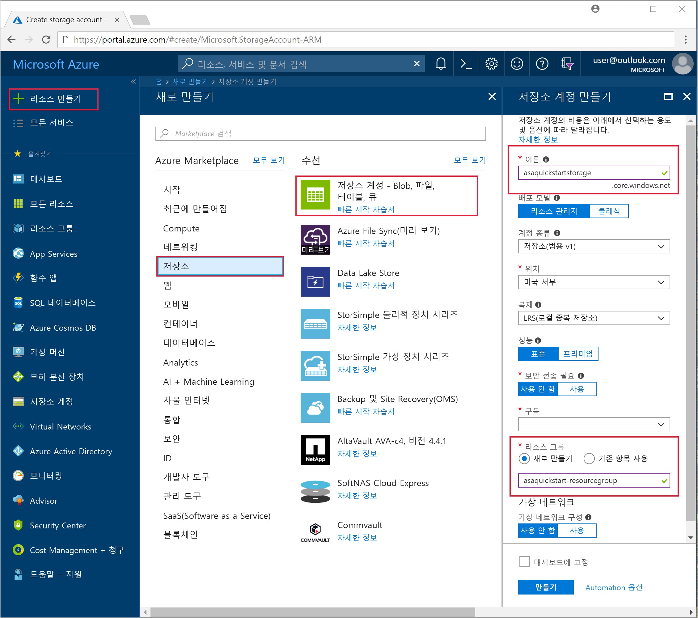

4. **모든 리소스** 페이지에서 이전 단계에서 만든 저장소 계정을 찾습니다. **개요** 페이지, **Blob** 타일을 차례로 엽니다.  

5. **Blob 서비스** 페이지에서 **컨테이너**를 선택하고, 컨테이너에 *container1*과 같은 **이름**을 입력하고, **확인**을 선택합니다.  

   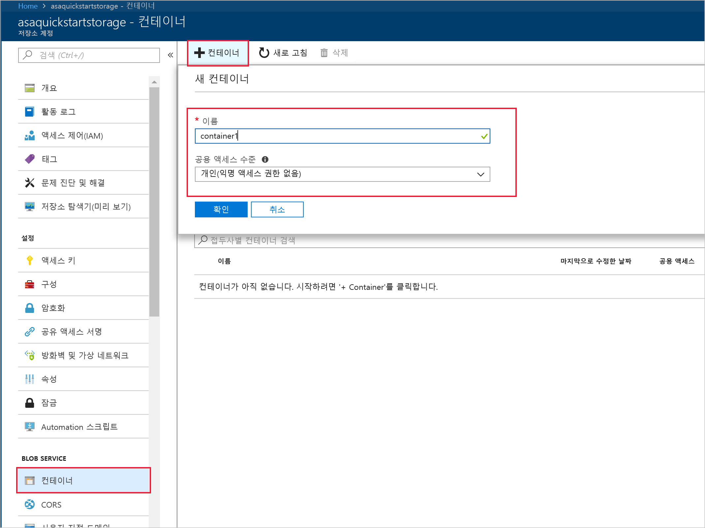

6. 이전 단계에서 만든 컨테이너로 이동합니다. **Upload**를 선택하고 첫 번째 단계에서 얻은 센서 데이터를 업로드합니다.  

   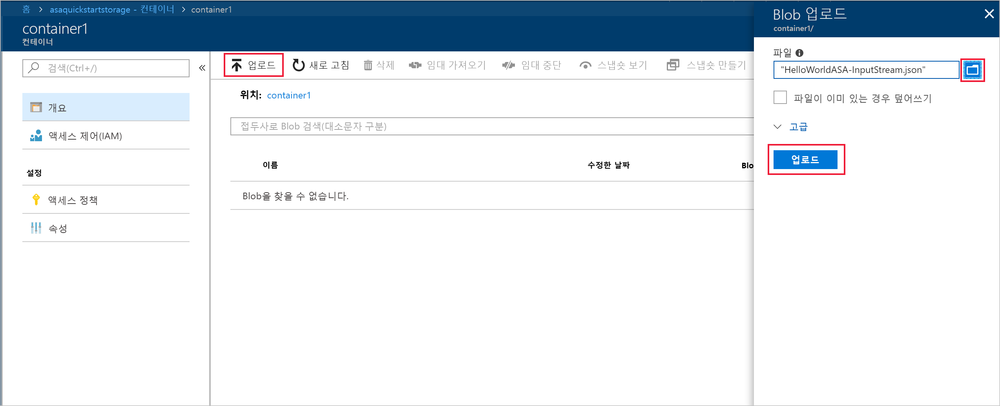

## <a name="create-a-stream-analytics-project"></a>Stream Analytics 프로젝트 만들기

1. Visual Studio를 시작합니다.

2. **파일 > 새 프로젝트 만들기**를 선택합니다.  

3. 왼쪽의 템플릿 목록에서 **Stream Analytics**를 선택한 다음 **Azure Stream Analytics 응용 프로그램**을 선택합니다.  

4. 프로젝트 **이름**, **위치** 및 **솔루션 이름**을 입력하고, **확인**을 선택합니다.

   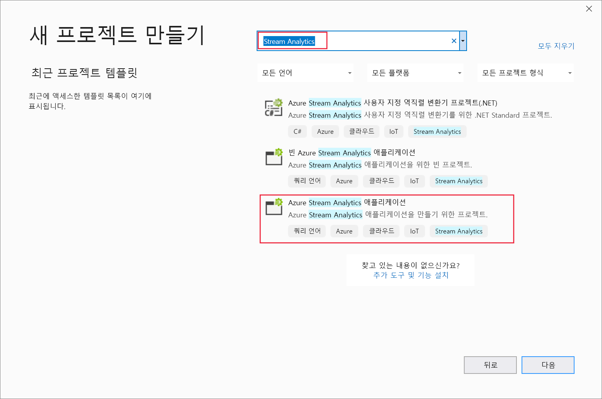

Azure Stream Analytics 프로젝트에 포함된 요소를 확인합니다.

   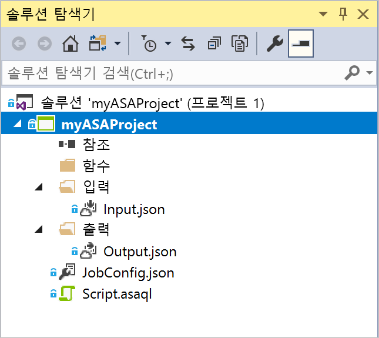


## <a name="choose-the-required-subscription"></a>필수 구독 선택

1. Visual Studio의 **보기** 메뉴에서 **서버 탐색기**를 선택합니다.

2. **Azure**를 마우스 오른쪽 단추로 클릭하고, **Microsoft Azure 구독에 연결**을 선택한 다음, Azure 계정으로 로그인합니다.

## <a name="define-input"></a>입력 정의

1. **솔루션 탐색기**에서 **입력** 노드를 확장하고 **Input.json**을 두 번 클릭합니다.

2. **Stream Analytics 입력 구성**을 다음 값으로 채웁니다.

   |**설정**  |**제안 값**  |**설명**   |
   |---------|---------|---------|
   |입력 별칭  |  입력   |  작업의 입력을 식별하는 이름을 입력합니다.   |
   |원본 유형   |  데이터 스트림 |  데이터 스트림 또는 참조 데이터라는 적절한 입력 원본을 선택합니다.   |
   |원본  |  Blob Storage |  적합한 입력 원본을 선택합니다.   |
   |리소스  | 현재 계정에서 데이터 원본 선택 | 기존 계정을 선택하거나 데이터를 수동으로 입력하도록 선택합니다.   |
   |구독  |  \<구독\>   | 만든 저장소 계정이 있는 Azure 구독을 선택합니다. 동일한 또는 다른 구독에 저장소 계정이 있을 수 있습니다. 이 예제에서는 동일한 구독에 저장소 계정을 만들었다고 가정합니다.   |
   |Storage 계정  |  asaquickstartstorage   |  저장소 계정의 이름을 선택하거나 입력합니다. 저장소 계정 이름은 동일한 구독에 만들어진 경우에 자동으로 감지됩니다.   |
   |컨테이너  |  container1   |  저장소 계정에서 만든 기존 컨테이너를 선택합니다.   |
   
3. 다른 옵션을 기본값으로 유지하고 **저장**을 선택하여 설정을 저장합니다.  

   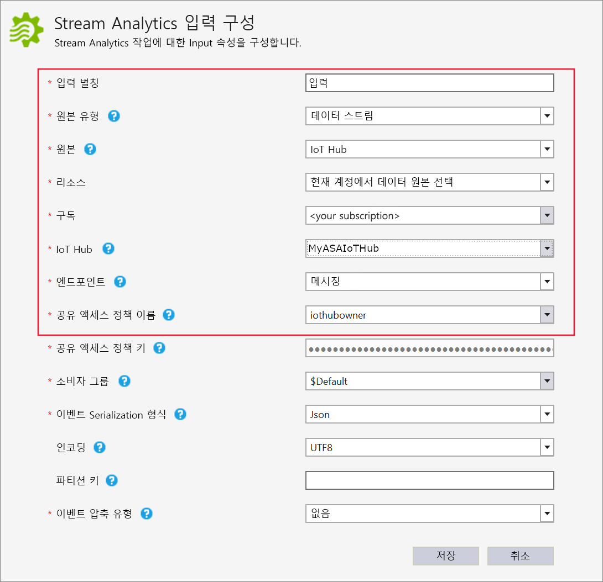

## <a name="define-output"></a>출력 정의

1. **솔루션 탐색기**에서 **출력** 노드를 확장하고 **Output.json**을 두 번 클릭합니다.

2. **Stream Analytics 출력 구성**을 다음 값으로 채웁니다.

   |**설정**  |**제안 값**  |**설명**   |
   |---------|---------|---------|
   |출력 별칭  |  출력   |  작업의 출력을 식별하는 이름을 입력합니다.   |
   |sink   |  Blob Storage |  적합한 싱크를 선택하세요.    |
   |리소스  |  데이터 원본 설정 수동 제공 |  기존 계정을 선택하거나 데이터를 수동으로 입력하도록 선택합니다.   |
   |구독  |  \<구독\>   | 만든 저장소 계정이 있는 Azure 구독을 선택합니다. 동일한 또는 다른 구독에 저장소 계정이 있을 수 있습니다. 이 예제에서는 동일한 구독에 저장소 계정을 만들었다고 가정합니다.   |
   |Storage 계정  |  asaquickstartstorage   |  저장소 계정의 이름을 선택하거나 입력합니다. 저장소 계정 이름은 동일한 구독에 만들어진 경우에 자동으로 감지됩니다.   |
   |컨테이너  |  container1   |  저장소 계정에서 만든 기존 컨테이너를 선택합니다.   |
   |경로 패턴  |  output   |  컨테이너 내에서 만들 파일 경로 이름을 입력합니다.   |
   
3. 다른 옵션을 기본값으로 유지하고 **저장**을 선택하여 설정을 저장합니다.  

   

## <a name="define-the-transformation-query"></a>변환 쿼리 정의

1. Visual Studio의 **솔루션 탐색기**에서 **Script.asaql**을 엽니다.

2. 다음 쿼리를 추가합니다.

   ```sql
   SELECT 
   System.Timestamp AS OutputTime,
   dspl AS SensorName,
   Avg(temp) AS AvgTemperature
   INTO
     Output
   FROM
     Input TIMESTAMP BY time
   GROUP BY TumblingWindow(second,30),dspl
   HAVING Avg(temp)>100
   ```

## <a name="submit-a-stream-analytics-query-to-azure"></a>Stream Analytics 쿼리를 Azure에 제출

1. **쿼리 편집기**의 스크립트 편집기에서 **Azure에 제출**을 선택합니다.

2. **새 Azure Stream Analytics 작업 만들기**를 선택하고 **작업 이름**을 입력합니다. 빠른 시작의 시작 부분에서 사용한 **구독**, **리소스 그룹** 및 **위치**를 선택합니다.

   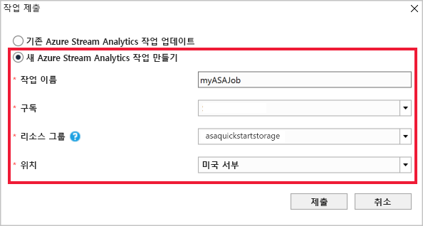

## <a name="start-the-stream-analytics-job-and-check-output"></a>Stream Analytics 작업 시작 및 출력 확인

1. 작업이 만들어지면 작업 보기가 자동으로 열립니다. 녹색 화살표 단추를 선택하여 작업을 시작합니다.

   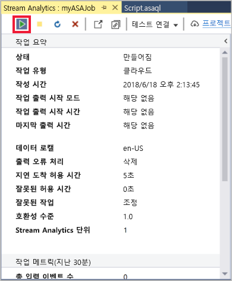

2. 날짜 **사용자 지정 시간**을 `2018-01-01`로 변경하고 **시작**을 선택합니다.

   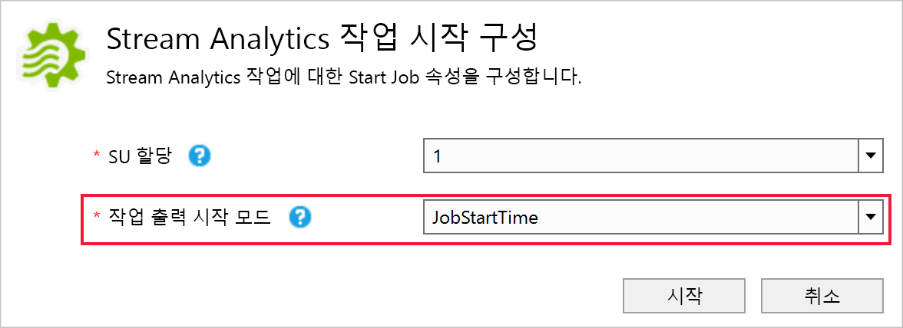

3. 작업 상태가 **실행 중**으로 변경되고 입력/출력 이벤트가 있습니다. 몇 분이 걸릴 수 있습니다.

   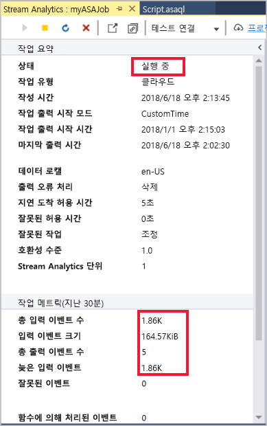

4. 결과를 보려면 **보기** 메뉴에서 **클라우드 탐색기**를 선택하고, 리소스 그룹의 저장소 계정으로 이동합니다. **Blob 컨테이너** 아래에서 **container1** 및 **출력** 파일 경로를 차례로 두 번 클릭합니다.

   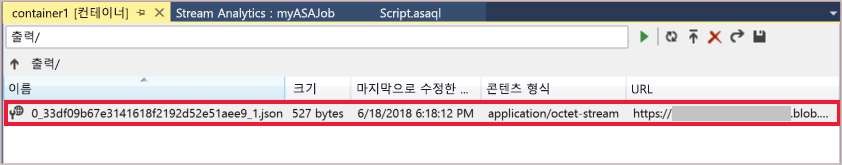

## <a name="clean-up-resources"></a>리소스 정리

더 이상 필요하지 않으면 리소스 그룹, 스트리밍 작업 및 모든 관련 리소스를 삭제합니다. 작업을 삭제하면 작업에서 사용된 스트리밍 단위에 대한 청구를 방지합니다. 작업을 나중에 사용하려는 경우 중지하고 나중에 필요할 때 다시 시작할 수 있습니다. 이 작업을 계속 사용하지 않으려면 다음 단계를 사용하여 이 빠른 시작에서 만든 리소스를 모두 삭제합니다.

1. Azure Portal의 왼쪽 메뉴에서 **리소스 그룹**을 선택한 다음, 만든 리소스의 이름을 선택합니다.  

2. 리소스 그룹 페이지에서 **삭제**를 선택하고 텍스트 상자에서 삭제할 리소스의 이름을 입력한 다음, **삭제**를 선택합니다.

## <a name="next-steps"></a>다음 단계

이 빠른 시작에서는 Visual Studio를 사용하여 간단한 Stream Analytics 작업을 배포했습니다. [Azure Portal](stream-analytics-quick-create-portal.md)과 [PowerShell](stream-analytics-quick-create-powershell.md)을 통해 Stream Analytics 작업도 배포할 수 있습니다. 

다른 입력 원본을 구성하고 실시간 검색을 수행하는 방법을 알아보려면 다음 문서로 이동하세요.

> [!div class="nextstepaction"]
> [Azure Stream Analytics를 사용하여 실시간 부정 행위 감지](stream-analytics-real-time-fraud-detection.md)
