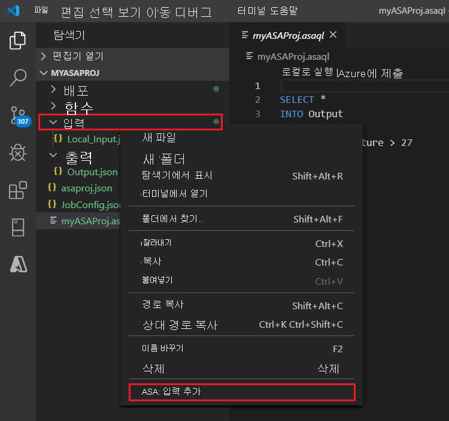
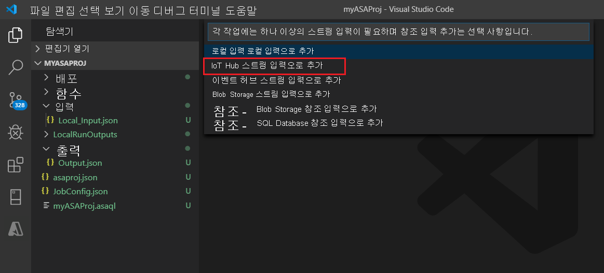

# Visual Studio Code를 사용하여 라이브 스트림 입력에 대해 로컬로 Azure Stream Analytics 쿼리 테스트

Visual Studio Code용 Azure Stream Analytics 도구를 사용하여 라이브 스트림 입력에 대해 Stream Analytics 작업을 로컬로 테스트할 수 있습니다. 입력은 Azure Event Hubs 또는 Azure IoT Hub와 같은 소스에서 가져올 수 있습니다. 출력 결과는 **LocalRunOutputs** 라는 프로젝트의 폴더에 JSON 파일로 전송됩니다.

## 사전 요구 사항

* [.NET Core SDK](https://dotnet.microsoft.com/download)를 설치하고 Visual Studio Code를 다시 시작합니다.

* [이 빠른 시작](quick-create-visual-studio-code.md)을 사용하여 Visual Studio Code를 통해 Stream Analytics 작업을 만드는 방법을 알아봅니다.

## 라이브 스트림 입력 정의

1. Stream Analytics 프로젝트에서 마우스 오른쪽 단추로 **Inputs** 폴더를 클릭합니다. 그런 다음, 상황에 맞는 메뉴에서 **ASA: 입력 추가** 를 선택합니다.

   

   **Ctrl+Shift+P** 를 선택하여 명령 팔레트를 열고 **ASA: Add Input** 을 입력할 수도 있습니다.

   

2. 드롭다운 목록에서 입력 원본 형식을 선택합니다.

   

3. 명령 팔레트에서 입력을 추가한 경우 해당 입력을 사용할 Stream Analytics 쿼리 스크립트를 선택합니다. 그러면 **myASAproj.asaql** 의 파일 경로로 자동으로 채워집니다.

   

4. 드롭다운 메뉴에서 **Azure 구독에서 선택** 을 선택합니다.

    

5. 새로 생성된 JSON 파일을 구성합니다. CodeLens 기능을 사용하여 문자열을 입력하거나, 드롭다운 목록에서 선택하거나, 파일에서 텍스트를 직접 변경할 수 있습니다. 다음 스크린샷에서는 **구독에서 선택** 을 예로 보여 줍니다.

   

## 입력 미리 보기

입력 데이터가 수신되는지 확인하려면 맨 윗줄에서 라이브 입력 구성 파일의 **데이터 미리 보기** 를 선택합니다. 일부 입력 데이터는 IoT 허브에서 수신되어 미리 보기 창에 표시됩니다. 미리 보기가 표시되려면 몇 초 정도 걸립니다.

 

## 로컬로 쿼리 실행

쿼리 편집기로 돌아가서 **로컬에서 실행** 을 선택합니다. 그런 다음 드롭다운 목록에서 **라이브 입력 사용** 을 선택합니다.

오른쪽 창에 결과가 표시되고 3초마다 새로 고침됩니다. **실행** 을 선택하여 다시 테스트할 수 있습니다. 또한 **폴더에서 열기** 를 선택하여 파일 탐색기에서 결과 파일을 보고 Visual Studio Code 또는 Excel 같은 도구를 사용하여 파일을 열 수 있습니다. 결과 파일은 JSON 형식으로만 사용할 수 있습니다.

출력 만들기를 시작하기 위한 작업의 기본 시간은 **지금** 으로 설정됩니다. 결과 창에서 **출력 시작 시간** 단추를 선택하여 시간을 사용자 지정할 수 있습니다.

## 다음 단계

* [Visual Studio Code를 사용하여 Azure Stream Analytics 작업 탐색(미리 보기)](visual-studio-code-explore-jobs.md)

* [npm 패키지를 사용하여 CI/CD 파이프라인 설정](./cicd-overview.md)